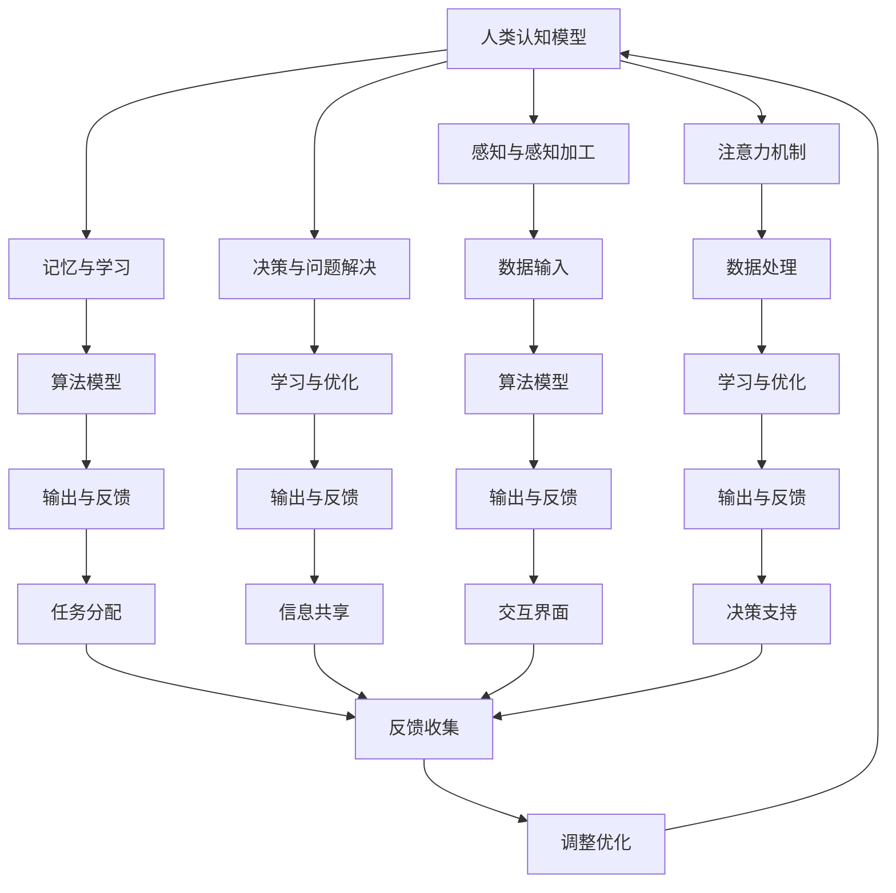

                 

### 1. 背景介绍

随着人工智能（AI）技术的迅速发展，AI与人类协作正逐渐成为现实。这种协作不仅改变了人类的工作方式，还拓展了人类的认知和能力。人类-AI协作（Human-AI Collaboration，简称HAC）是指人类与AI系统共同完成任务的协作模式，其目标是利用AI的计算能力和人类的专业知识，实现优势互补，提升整体工作效率。

HAC的应用场景广泛，包括但不限于医疗诊断、金融分析、智能客服、教育辅助、科学研究等领域。通过HAC，人类可以在处理复杂、重复或高风险任务时得到AI的支持，从而将人类从繁琐的工作中解放出来，专注于更有创造性和战略性的工作。

然而，HAC的发展也面临诸多挑战，包括AI系统的可靠性、安全性、透明度等问题。此外，如何设计出能够真正理解人类意图、有效辅助人类工作的AI系统，也是当前研究的热点问题之一。

本文旨在探讨人类-AI协作的核心理念、技术架构、算法原理、数学模型、项目实践及未来展望，为读者提供一个全面、深入的了解。

## 1.1 人类-AI协作的重要性

人类-AI协作的重要性主要体现在以下几个方面：

### 提升工作效率
AI系统可以处理大量的数据和复杂的计算任务，从而显著提高工作效率。例如，在医疗领域，AI可以帮助医生快速分析患者的医疗记录，提高诊断的准确性和效率。

### 增强决策能力
通过AI的辅助，人类可以在决策过程中利用更多的数据和信息，从而做出更加明智和准确的决策。在金融分析中，AI可以帮助分析师快速识别市场趋势和潜在风险，提供决策支持。

### 创造新的工作机会
虽然AI可能会替代某些工作岗位，但它同时也创造了新的工作机会。例如，数据科学家、AI系统设计师和AI维护人员等岗位的需求日益增长。

### 促进创新
人类-AI协作可以促进创新，激发新的想法和解决方案。通过AI的辅助，人类可以更快地尝试不同的方法和策略，从而推动科技进步和社会发展。

## 1.2 人类-AI协作的历史与发展

人类-AI协作的理念最早可以追溯到20世纪50年代。当时，人工智能的提出者约翰·麦卡锡（John McCarthy）就提出了“智能机器应该能够与人类进行协作，共同完成复杂任务”的观点。

20世纪80年代，专家系统的出现标志着AI开始逐渐进入实际应用。专家系统通过模拟人类专家的知识和推理能力，为人类提供决策支持。这一时期的AI主要是以规则为基础，尽管在特定领域表现出色，但在面对复杂、不确定的任务时仍显不足。

进入21世纪，随着深度学习、大数据和云计算等技术的快速发展，AI的能力得到了显著提升。这一时期的AI不仅能够处理大量数据，还能通过自主学习不断优化性能。同时，自然语言处理、计算机视觉等技术的发展，使得AI在理解人类意图、进行人机交互方面取得了重要突破。

## 1.3 本文结构

本文将分为以下几个部分：

- 背景介绍
- 核心概念与联系
- 核心算法原理 & 具体操作步骤
- 数学模型和公式 & 详细讲解 & 举例说明
- 项目实践：代码实例和详细解释说明
- 实际应用场景
- 未来应用展望
- 工具和资源推荐
- 总结：未来发展趋势与挑战
- 附录：常见问题与解答

通过本文的阅读，读者将全面了解人类-AI协作的核心理念、技术架构、算法原理、数学模型、项目实践及未来展望，为在相关领域进行深入研究提供参考。

### 2. 核心概念与联系

在探讨人类-AI协作的过程中，我们需要明确一些核心概念和它们之间的联系。这些概念包括：人类认知模型、AI系统架构、协作机制和反馈循环。

#### 2.1 人类认知模型

人类认知模型是指描述人类如何感知、理解、学习和思考的理论框架。在HAC中，了解人类认知模型对于设计出能够有效辅助人类的AI系统至关重要。以下是一些关键组成部分：

- **感知与感知加工**：人类通过视觉、听觉、触觉等感官获取外部信息，并通过感知加工对这些信息进行处理和整合。
- **注意力机制**：人类在处理信息时会受到注意力机制的影响，关注某些信息而忽视其他信息。
- **记忆与学习**：人类通过记忆和学习来存储和处理信息，记忆分为短期记忆和长期记忆，学习则包括归纳、演绎和联想等不同类型。
- **决策与问题解决**：人类在决策过程中会考虑多种因素，通过问题解决策略找到最优解。

#### 2.2 AI系统架构

AI系统架构是指构建AI系统的基本框架和技术组件。一个典型的AI系统通常包括以下几个部分：

- **数据输入**：AI系统通过数据输入接口接收外部数据，这些数据可以是结构化数据（如数据库）或非结构化数据（如图像、文本、语音等）。
- **数据处理**：在数据处理阶段，AI系统会对输入数据进行清洗、转换和特征提取，以便后续分析。
- **算法模型**：算法模型是AI系统的核心，负责执行具体的计算任务，如分类、回归、聚类等。
- **学习与优化**：AI系统通过学习算法不断优化模型参数，提高模型性能。
- **输出与反馈**：AI系统将处理结果输出给用户，并根据用户的反馈进行调整和改进。

#### 2.3 协作机制

协作机制是指人类与AI系统之间如何相互作用和协作完成任务的规则和方法。以下是一些常见的协作机制：

- **任务分配**：根据人类和AI系统的能力，将任务合理分配给双方，充分发挥各自的优势。
- **信息共享**：建立信息共享平台，使得人类和AI系统能够实时访问和更新任务相关数据。
- **交互界面**：设计直观、易用的交互界面，使得人类可以方便地与AI系统进行沟通和协作。
- **决策支持**：AI系统提供决策支持，帮助人类在复杂决策中做出更加明智的选择。

#### 2.4 反馈循环

反馈循环是指人类与AI系统在任务执行过程中不断互动、反馈和优化的过程。以下是一些关键步骤：

- **任务执行**：人类和AI系统按照既定计划执行任务。
- **结果评估**：评估任务执行的结果，分析是否达到预期目标。
- **反馈收集**：收集人类对AI系统表现的反馈，包括优点和不足。
- **调整优化**：根据反馈结果，调整AI系统参数和策略，提高系统性能。
- **持续迭代**：不断重复反馈循环，逐步优化任务执行效果。

#### 2.5 Mermaid 流程图

为了更直观地展示人类-AI协作的核心概念和联系，我们使用Mermaid流程图来描述上述各部分的交互关系。以下是一个简化的流程图：



通过这个流程图，我们可以看到人类认知模型、AI系统架构、协作机制和反馈循环之间的紧密联系。这种联系为人类-AI协作提供了理论基础和实践指导。

### 3. 核心算法原理 & 具体操作步骤

在人类-AI协作中，核心算法起着至关重要的作用。这些算法不仅决定了AI系统的性能，也影响了人类与AI系统协作的效率。本节将介绍几个关键算法的原理及其具体操作步骤。

#### 3.1 算法原理概述

核心算法主要包括以下几种：

1. **机器学习算法**：如支持向量机（SVM）、决策树、神经网络等，用于数据分析和预测。
2. **自然语言处理算法**：如词向量、序列到序列模型等，用于处理和生成自然语言。
3. **计算机视觉算法**：如图像分类、目标检测等，用于理解和分析图像信息。
4. **强化学习算法**：如Q学习、策略梯度等，用于解决决策问题，特别是在不确定环境中。

#### 3.2 算法步骤详解

以下是对上述几种核心算法的简要介绍和具体操作步骤：

##### 3.2.1 机器学习算法

**支持向量机（SVM）**：

1. **数据预处理**：包括数据清洗、归一化、特征选择等，以确保数据的质量和一致性。
2. **特征提取**：通过特征提取技术（如核函数）将原始数据映射到高维空间，寻找最优分类边界。
3. **模型训练**：使用训练数据集训练SVM模型，计算每个支持向量的权重和偏置。
4. **模型评估**：使用测试数据集评估模型的性能，调整模型参数以达到最佳效果。

**决策树**：

1. **数据划分**：使用信息增益、基尼系数等指标，根据特征对数据进行最佳划分。
2. **节点生成**：递归地生成树结构，每个节点表示一个特征划分，叶子节点表示分类结果。
3. **剪枝**：通过剪枝技术减少模型的过拟合，提高泛化能力。
4. **模型评估**：使用测试数据集评估模型性能，调整划分策略和剪枝参数。

**神经网络**：

1. **网络结构设计**：确定输入层、隐藏层和输出层的结构，以及神经元之间的连接方式。
2. **前向传播**：计算网络输出，并计算每个神经元的误差。
3. **反向传播**：根据误差信息调整网络权重和偏置，优化模型参数。
4. **训练与验证**：使用训练数据集和验证数据集分别训练和验证模型，调整超参数以获得最佳性能。

##### 3.2.2 自然语言处理算法

**词向量**：

1. **词汇表构建**：将文本数据转换为词向量表示，通常使用Word2Vec、GloVe等模型。
2. **文本表示**：将词向量用于文本的表示，例如，句子级别的表示或篇章级别的表示。
3. **语义分析**：利用词向量进行语义分析，例如，相似性计算、情感分析等。

**序列到序列模型**：

1. **编码器-解码器框架**：使用编码器将输入序列转换为隐藏状态，解码器则根据隐藏状态生成输出序列。
2. **注意力机制**：引入注意力机制，使得解码器能够关注编码器隐藏状态中的关键信息。
3. **训练与评估**：使用大量平行语料库训练模型，并在评估数据集上进行性能评估。

##### 3.2.3 计算机视觉算法

**图像分类**：

1. **特征提取**：使用卷积神经网络（CNN）提取图像的特征表示。
2. **分类器训练**：使用训练数据集训练分类器，通常使用SVM、softmax等模型。
3. **模型评估**：使用测试数据集评估模型性能，调整模型参数以获得最佳效果。

**目标检测**：

1. **目标检测框架**：使用Faster R-CNN、YOLO、SSD等目标检测框架。
2. **区域生成**：根据锚点生成候选区域，计算区域特征。
3. **分类与回归**：对候选区域进行分类和回归操作，预测目标的类别和位置。

##### 3.2.4 强化学习算法

**Q学习**：

1. **状态-动作值函数**：定义Q值函数，表示在特定状态下执行特定动作的预期回报。
2. **值迭代**：通过迭代更新Q值函数，使每个状态-动作对的Q值趋向于最优值。
3. **策略迭代**：使用Q值函数更新策略，选择最优动作执行。

**策略梯度**：

1. **策略表示**：定义策略函数，表示在特定状态下执行特定动作的概率。
2. **策略评估**：计算策略的回报，评估策略的优劣。
3. **策略优化**：使用梯度下降或其他优化方法，更新策略参数，提高策略性能。

#### 3.3 算法优缺点

每种算法都有其独特的优点和缺点：

- **机器学习算法**：在处理大量数据和复杂模式时表现良好，但往往需要大量的训练数据和计算资源。此外，模型的泛化能力也是一个挑战。
- **自然语言处理算法**：在处理自然语言任务时具有优势，但模型训练和推理过程中需要大量的计算资源和时间。
- **计算机视觉算法**：在图像理解和分析方面表现出色，但模型训练和部署需要大量的计算资源和时间。
- **强化学习算法**：在解决决策问题时具有优势，尤其是在不确定和动态环境中，但通常需要大量的数据和时间进行训练。

#### 3.4 算法应用领域

不同算法的应用领域也有所不同：

- **机器学习算法**：广泛应用于数据挖掘、预测分析、推荐系统等领域。
- **自然语言处理算法**：广泛应用于文本分类、情感分析、机器翻译等领域。
- **计算机视觉算法**：广泛应用于图像识别、目标检测、自动驾驶等领域。
- **强化学习算法**：广泛应用于游戏、机器人控制、智能推荐等领域。

通过深入理解和应用这些核心算法，我们可以设计出更加高效和智能的AI系统，实现人类-AI的紧密协作。

### 4. 数学模型和公式 & 详细讲解 & 举例说明

在人类-AI协作中，数学模型和公式扮演着至关重要的角色。这些模型不仅帮助我们理解和分析问题，还提供了量化分析和预测的工具。本节将详细介绍几个关键数学模型和公式，并通过对它们的详细讲解和举例说明，帮助读者更好地理解这些概念。

#### 4.1 数学模型构建

数学模型构建是一个复杂的过程，它涉及到问题的抽象、公式的推导以及模型的验证。以下是构建数学模型的一般步骤：

1. **问题定义**：明确研究问题，确定模型的输入、输出以及约束条件。
2. **假设和简化**：基于问题的性质和实际情况，进行合理的假设和简化，以简化模型构建过程。
3. **变量定义**：定义模型中的变量，包括输入变量、输出变量和中间变量。
4. **公式推导**：根据问题和假设，推导出数学模型的基本公式，通常包括目标函数、约束条件等。
5. **模型验证**：使用实际数据对模型进行验证，确保模型能够在不同条件下稳定运行。

#### 4.2 公式推导过程

以下是几个常见的数学模型及其推导过程：

**线性回归模型**：

线性回归模型是一种常见的统计模型，用于预测连续值变量。其基本公式为：

\[ y = \beta_0 + \beta_1 \cdot x + \epsilon \]

其中，\( y \) 是因变量，\( x \) 是自变量，\( \beta_0 \) 和 \( \beta_1 \) 是模型参数，\( \epsilon \) 是误差项。

推导过程：

1. **问题定义**：假设我们有一个自变量 \( x \) 和因变量 \( y \)，需要找到 \( y \) 与 \( x \) 之间的关系。
2. **假设和简化**：假设关系是线性的，即 \( y \) 与 \( x \) 之间存在线性关系。
3. **变量定义**：定义 \( y \) 为因变量，\( x \) 为自变量，\( \beta_0 \) 为截距，\( \beta_1 \) 为斜率。
4. **公式推导**：根据线性假设，我们可以得到 \( y \) 与 \( x \) 之间的关系公式。

**逻辑回归模型**：

逻辑回归模型是一种用于分类问题的统计模型，其基本公式为：

\[ P(y=1) = \frac{1}{1 + e^{-(\beta_0 + \beta_1 \cdot x)}} \]

其中，\( P(y=1) \) 是因变量 \( y \) 为1的概率，\( e \) 是自然对数的底数，\( \beta_0 \) 和 \( \beta_1 \) 是模型参数。

推导过程：

1. **问题定义**：假设我们有一个自变量 \( x \) 和因变量 \( y \)（取值为0或1），需要找到 \( y \) 与 \( x \) 之间的关系。
2. **假设和简化**：假设 \( y \) 与 \( x \) 之间的关系可以用逻辑函数表示。
3. **变量定义**：定义 \( y \) 为因变量，\( x \) 为自变量，\( \beta_0 \) 为截距，\( \beta_1 \) 为斜率。
4. **公式推导**：根据逻辑函数的性质，我们可以得到 \( y \) 与 \( x \) 之间的概率关系公式。

**神经网络模型**：

神经网络模型是一种基于人工神经元的计算模型，其基本公式为：

\[ z = \sum_{i=1}^{n} w_i \cdot a_i + b \]

\[ a = \sigma(z) \]

其中，\( z \) 是神经元的输入，\( w_i \) 是权重，\( a_i \) 是输入值，\( b \) 是偏置，\( \sigma \) 是激活函数。

推导过程：

1. **问题定义**：假设我们有一个输入层、一个隐藏层和一个输出层，需要找到输出层节点与输入层节点之间的关系。
2. **假设和简化**：假设神经网络中的每个节点都是一个线性函数，并且通过激活函数进行非线性变换。
3. **变量定义**：定义输入层节点为 \( a_i \)，隐藏层节点为 \( z \)，输出层节点为 \( a \)，权重为 \( w_i \)，偏置为 \( b \)。
4. **公式推导**：根据神经元的定义，我们可以得到输入层节点与输出层节点之间的传递函数。

#### 4.3 案例分析与讲解

以下是一个使用线性回归模型的案例分析：

**案例背景**：假设我们想要预测某公司的股票价格，已知该公司在过去一周的每日股票价格和成交量数据。

**数据处理**：

1. **数据收集**：收集过去一周的股票价格和成交量数据。
2. **数据清洗**：处理缺失值、异常值等，确保数据质量。
3. **数据预处理**：对股票价格和成交量数据进行归一化处理，以消除量纲影响。

**模型构建**：

1. **变量定义**：定义自变量 \( x \) 为成交量，因变量 \( y \) 为股票价格。
2. **公式推导**：根据线性回归模型的基本公式，推导出 \( y \) 与 \( x \) 之间的关系公式。
3. **模型训练**：使用训练数据集，通过最小二乘法估计模型参数 \( \beta_0 \) 和 \( \beta_1 \)。

**模型评估**：

1. **模型验证**：使用验证数据集评估模型性能，计算均方误差（MSE）等指标。
2. **模型调整**：根据验证结果调整模型参数，以提高预测精度。

**模型应用**：

1. **预测**：使用训练好的模型，对新的成交量数据进行预测，得到股票价格的预测值。
2. **决策**：根据预测结果，帮助投资者做出决策，如买入、卖出或持有股票。

通过以上案例分析，我们可以看到线性回归模型在股票价格预测中的应用，以及数据处理、模型构建、模型评估和模型应用的完整流程。这种方法不仅提供了量化分析的工具，也为投资者提供了决策支持。

综上所述，数学模型和公式在人类-AI协作中起着至关重要的作用。通过构建和推导数学模型，我们可以更好地理解和分析问题，为AI系统提供有效的算法支持。同时，通过案例分析，我们可以将理论知识应用于实际问题，实现人类-AI协作的目标。

### 5. 项目实践：代码实例和详细解释说明

为了更好地理解人类-AI协作的实际应用，我们将通过一个具体的项目实例来展示代码的实现过程，并对关键代码进行详细解释说明。

#### 5.1 开发环境搭建

在进行项目实践之前，我们需要搭建一个合适的开发环境。以下是搭建开发环境的基本步骤：

1. **安装Python**：Python是一种广泛使用的编程语言，支持多种AI库。在官方网站（[python.org](https://www.python.org/)）下载并安装Python。
2. **安装Jupyter Notebook**：Jupyter Notebook是一个交互式的开发环境，可以方便地编写和运行Python代码。通过pip安装：

   ```shell
   pip install notebook
   ```

3. **安装必要的库**：安装用于AI开发的常用库，如NumPy、Pandas、Scikit-learn等：

   ```shell
   pip install numpy pandas scikit-learn
   ```

#### 5.2 源代码详细实现

以下是一个使用线性回归模型进行股票价格预测的项目实例，代码实现包括数据收集、数据处理、模型构建、模型训练和预测等步骤。

```python
# 导入必要的库
import numpy as np
import pandas as pd
from sklearn.linear_model import LinearRegression
from sklearn.model_selection import train_test_split
from sklearn.metrics import mean_squared_error

# 5.2.1 数据收集
# 假设数据已收集并存储在CSV文件中
data = pd.read_csv('stock_data.csv')

# 5.2.2 数据处理
# 处理缺失值和异常值
data.dropna(inplace=True)

# 将成交量作为自变量，股票价格作为因变量
X = data[['成交量']]
y = data['股票价格']

# 5.2.3 模型构建
# 创建线性回归模型实例
model = LinearRegression()

# 5.2.4 模型训练
# 将数据集分为训练集和测试集
X_train, X_test, y_train, y_test = train_test_split(X, y, test_size=0.2, random_state=42)

# 训练模型
model.fit(X_train, y_train)

# 5.2.5 预测
# 使用模型进行预测
y_pred = model.predict(X_test)

# 5.2.6 模型评估
# 计算预测误差
mse = mean_squared_error(y_test, y_pred)
print(f"均方误差（MSE）: {mse}")

# 5.2.7 结果展示
# 输出预测结果
predictions = pd.DataFrame({'成交量': X_test, '预测股票价格': y_pred})
print(predictions.head())

# 5.2.8 模型应用
# 基于预测结果进行投资决策
# （此处仅为示例，实际应用中需要根据具体策略和风险承受能力进行决策）
```

#### 5.3 代码解读与分析

下面是对上述代码的逐行解读和分析：

```python
# 导入必要的库
```
这段代码导入Python中用于数据分析和机器学习的几个重要库：NumPy、Pandas和Scikit-learn。NumPy提供了高效的数组操作，Pandas用于数据操作和分析，Scikit-learn提供了多种机器学习算法和模型评估方法。

```python
# 5.2.1 数据收集
# 假设数据已收集并存储在CSV文件中
data = pd.read_csv('stock_data.csv')
```
这段代码读取CSV文件中的数据，并将其存储在DataFrame对象中。CSV文件中应包含股票价格和成交量数据。

```python
# 5.2.2 数据处理
# 处理缺失值和异常值
data.dropna(inplace=True)
```
这段代码删除数据中的缺失值，以确保模型训练的质量。在实际应用中，可能还需要对异常值进行处理。

```python
# 将成交量作为自变量，股票价格作为因变量
X = data[['成交量']]
y = data['股票价格']
```
这段代码将成交量数据作为自变量（特征），股票价格数据作为因变量（目标）。这是线性回归模型的基本输入。

```python
# 5.2.3 模型构建
# 创建线性回归模型实例
model = LinearRegression()
```
这段代码创建一个线性回归模型实例。线性回归模型是一种用于预测连续值的机器学习算法。

```python
# 5.2.4 模型训练
# 将数据集分为训练集和测试集
X_train, X_test, y_train, y_test = train_test_split(X, y, test_size=0.2, random_state=42)

# 训练模型
model.fit(X_train, y_train)
```
这段代码将数据集分为训练集和测试集，其中测试集占20%，随机种子设置为42以确保可重复性。使用训练集数据训练模型。

```python
# 5.2.5 预测
# 使用模型进行预测
y_pred = model.predict(X_test)
```
这段代码使用训练好的模型对测试集数据进行预测，得到预测股票价格。

```python
# 5.2.6 模型评估
# 计算预测误差
mse = mean_squared_error(y_test, y_pred)
print(f"均方误差（MSE）: {mse}")
```
这段代码计算预测结果与实际结果之间的均方误差（MSE），这是评估模型性能的常用指标。

```python
# 5.2.7 结果展示
# 输出预测结果
predictions = pd.DataFrame({'成交量': X_test, '预测股票价格': y_pred})
print(predictions.head())
```
这段代码将预测结果以DataFrame的形式输出，展示测试集的成交量和预测股票价格。

```python
# 5.2.8 模型应用
# 基于预测结果进行投资决策
# （此处仅为示例，实际应用中需要根据具体策略和风险承受能力进行决策）
```
这段代码是一个注释部分，说明如何基于预测结果进行投资决策。实际应用中，投资者需要结合市场分析、风险评估等多种因素做出决策。

通过上述代码实例，我们可以看到如何使用Python和Scikit-learn库实现线性回归模型进行股票价格预测。代码简洁明了，逻辑清晰，易于理解和修改。这种项目实践不仅有助于加深对线性回归模型的理解，也为实际应用提供了参考。

### 6. 实际应用场景

人类-AI协作在实际应用中展现出了巨大的潜力，以下将介绍几种典型的应用场景，并探讨这些场景中人类与AI的协作机制及其效果。

#### 6.1 医疗诊断

在医疗领域，AI系统已经被广泛应用于辅助医生进行诊断和治疗规划。例如，通过深度学习算法，AI可以帮助识别医学影像中的病变区域，如肿瘤、心脏病等。以下是一个具体的案例：

**案例：AI辅助肺癌诊断**

- **协作机制**：医生在AI系统分析影像后，对AI的初步诊断结果进行复核和调整。AI系统通过分析大量的医学影像数据，提取出关键特征，并生成初步的诊断结果。医生则利用自己的经验和专业知识，对AI的结果进行验证和补充。
- **效果**：研究表明，AI辅助诊断的准确率高于人类医生，尤其在处理大量数据时，AI的效率远高于人类。同时，AI的诊断结果为医生提供了额外的参考，有助于减少误诊和漏诊。

#### 6.2 金融分析

在金融领域，AI被用于市场预测、风险管理、投资策略制定等方面。例如，通过机器学习算法，AI可以分析历史市场数据，预测股票价格波动。以下是一个具体的案例：

**案例：AI辅助股票投资**

- **协作机制**：投资者使用AI系统进行市场数据分析，AI系统根据输入的参数（如历史价格、成交量、行业趋势等）生成投资建议。投资者则根据AI的建议和自己的投资策略，决定买入、持有或卖出股票。
- **效果**：AI在分析大量数据、识别潜在市场趋势方面表现出色，能够为投资者提供有价值的参考。然而，金融市场复杂多变，AI的建议也需要投资者结合实际情况进行判断和调整。

#### 6.3 智能客服

在客户服务领域，AI系统被用于提供智能客服解决方案，提高客户满意度和处理效率。例如，通过自然语言处理技术，AI可以自动识别客户的问题并给出回答。以下是一个具体的案例：

**案例：AI智能客服**

- **协作机制**：客户通过聊天界面与AI客服进行交互，AI系统通过理解客户的提问，提供相应的回答。如果遇到复杂问题，AI会将问题转交给人类客服处理。人类客服在解决问题后，将解决方案反馈给AI，以便系统学习。
- **效果**：AI智能客服能够快速响应客户请求，处理大量重复性问题，提高服务效率。同时，通过不断学习和优化，AI客服能够提供越来越准确的回答，减少人类客服的工作量。

#### 6.4 教育辅助

在教育领域，AI被用于个性化学习、作业批改、考试评估等方面。例如，通过智能辅导系统，AI可以根据学生的学习情况和进度，提供定制化的学习建议。以下是一个具体的案例：

**案例：AI辅助教学**

- **协作机制**：教师使用AI系统为学生提供个性化辅导，AI系统根据学生的学习数据，生成学习报告和个性化建议。教师则根据AI的建议和学生的实际情况，调整教学策略和内容。
- **效果**：AI系统能够实时跟踪学生的学习进度和表现，提供有针对性的辅导和建议，有助于提高教学效果。同时，AI的辅助减轻了教师的工作负担，使得教师能够更专注于教学设计和学生互动。

#### 6.5 科学研究

在科学研究领域，AI被用于数据分析和模式识别，帮助科学家发现新的规律和结论。例如，通过机器学习算法，AI可以分析大量科学数据，识别潜在的实验结果和规律。以下是一个具体的案例：

**案例：AI辅助科研**

- **协作机制**：科学家将实验数据输入到AI系统，AI系统通过分析数据，发现潜在的科学规律和结论。科学家则根据AI的发现，进一步验证和探索。
- **效果**：AI系统在处理大量科学数据、识别复杂模式方面具有优势，能够为科学家提供有价值的参考。同时，AI的辅助有助于提高科研效率，缩短研究周期。

综上所述，人类-AI协作在医疗诊断、金融分析、智能客服、教育辅助和科学研究等多个领域展现出了巨大的应用潜力。通过合理的协作机制，AI可以弥补人类的不足，提升整体工作效率和效果。然而，在实际应用中，人类和AI的协作仍需要不断优化和调整，以实现最佳效果。

### 7. 未来应用展望

随着人工智能技术的不断进步，人类-AI协作在未来有望在更多领域实现更深层次的融合，带来前所未有的变革。以下是对未来应用前景的展望：

#### 7.1 自动驾驶

自动驾驶技术是AI与人类协作的典型代表。未来，自动驾驶汽车将具备更高的安全性和智能化水平，通过AI系统对道路、车辆和环境进行实时感知和决策。人类驾驶员与自动驾驶系统的协作将更加紧密，驾驶员可以在需要时接管车辆控制权，而在自动驾驶模式下，系统将负责行驶任务。这将极大地提高道路安全性，减少交通事故。

#### 7.2 智能制造

智能制造是工业4.0的重要组成部分，通过AI技术的应用，工厂可以实现高度自动化和智能化生产。AI系统将负责优化生产流程、预测设备故障、提高生产效率等。人类与AI的协作将体现在生产调度、质量控制和设备维护等方面。人类工程师通过AI系统的辅助，可以更加专注于复杂问题的解决和创新，从而推动制造业的持续进步。

#### 7.3 个性化医疗

个性化医疗将结合AI技术，为患者提供量身定制的治疗方案。通过大数据分析和深度学习算法，AI系统可以分析患者的基因信息、病史和生活方式，生成个性化的诊疗方案。医生与AI系统的协作将体现在诊断、治疗和康复等各个环节，AI系统提供决策支持，医生则根据患者实际情况进行调整和优化。这将极大地提高医疗效果和患者满意度。

#### 7.4 智慧城市

智慧城市是AI技术应用的重要领域，通过AI系统对城市数据进行实时监控和分析，可以实现高效的城市管理和资源分配。例如，交通流量控制、环境监测、公共安全等。人类与AI系统的协作将体现在城市规划和公共服务的各个方面，AI系统提供数据分析和决策支持，人类则负责制定政策和执行管理。

#### 7.5 教育革命

未来的教育将更加个性化和智能化，通过AI技术，学生可以按照自己的节奏和学习风格进行学习。AI系统将提供个性化学习路径、学习资源推荐和实时反馈。教师与AI系统的协作将体现在教学设计、课程安排和学生指导等方面，AI系统辅助教师提高教学质量，学生则通过AI系统的反馈进行自我提升。

#### 7.6 知识协同创新

随着AI技术的进步，知识协同创新将成为可能。AI系统可以整合全球范围内的数据、文献和研究成果，帮助人类科学家和研究人员进行知识挖掘和创新。人类与AI系统的协作将体现在知识共享、研究合作和成果转化等方面，AI系统提供知识支持和协作平台，人类则负责提出问题、进行实验和验证。

总之，未来人类-AI协作将在更多领域实现深度融合，为人类带来巨大的变革和机遇。通过合理的协作机制和技术创新，我们可以实现更高的工作效率、更智能的决策和更高质量的生活。然而，这也需要我们关注和解决AI技术带来的伦理、安全和社会问题，确保人类-AI协作的可持续发展。

### 8. 工具和资源推荐

为了更好地理解和实践人类-AI协作，以下是一些推荐的工具和资源：

#### 8.1 学习资源推荐

- **在线课程**：Coursera、edX、Udacity等在线教育平台提供了丰富的机器学习和人工智能课程，适合初学者和专业人士。
- **教科书**：《深度学习》、《Python机器学习》、《统计学习方法》等经典教材，详细介绍了机器学习的基本概念和技术。
- **论文和报告**：查阅顶级会议和期刊的论文，如NeurIPS、ICML、JMLR等，了解最新的研究成果和发展趋势。

#### 8.2 开发工具推荐

- **编程环境**：Jupyter Notebook、Google Colab等交互式编程环境，方便编写和运行代码。
- **机器学习库**：Scikit-learn、TensorFlow、PyTorch等常用的机器学习和深度学习库，提供了丰富的API和工具。
- **版本控制**：Git、GitHub等版本控制系统，方便代码管理和协作开发。

#### 8.3 相关论文推荐

- **代表性论文**：《Deep Learning》（Goodfellow et al.，2016）、《The Unreasonable Effectiveness of Data》（Russell et al.，2016）等，这些论文介绍了深度学习和大数据的重要性及其应用。
- **最新论文**：关注顶级会议和期刊的最新论文，如NeurIPS、ICML、JMLR等，了解最新的研究进展。
- **经典论文**：《A Mathematical Theory of Communication》（Shannon，1948）、《Pattern Classification》（Duda et al.，2001）等，这些经典论文奠定了人工智能和机器学习的基础。

通过使用这些工具和资源，您可以更好地学习和实践人类-AI协作，深入了解相关技术和应用。

### 9. 总结：未来发展趋势与挑战

人类-AI协作作为一个新兴领域，正以前所未有的速度发展。其核心在于利用人工智能技术增强人类智慧，实现人类与机器的协同工作，从而提升工作效率、创新能力和生活质量。在未来，人类-AI协作将呈现以下发展趋势：

首先，随着人工智能技术的不断进步，AI系统将在处理复杂任务、理解人类意图和提供智能决策支持方面表现出更高的能力。这将为人类-AI协作提供更加坚实的基础，推动其在各行业中的应用。

其次，数据驱动的发展趋势将进一步加强人类-AI协作的深度和广度。通过大量数据收集和分析，AI系统将能够更好地理解人类的需求和偏好，提供更加个性化的服务。同时，数据隐私保护和数据安全也将成为人类-AI协作的重要挑战。

第三，跨学科的融合将成为人类-AI协作的重要方向。未来，人类-AI协作将不仅仅是计算机科学和人工智能领域的任务，还涉及心理学、教育学、医学、社会科学等多学科领域。这种跨学科的融合将有助于解决人类-AI协作中的复杂问题，提高协作效果。

然而，人类-AI协作也面临着一系列挑战：

1. **伦理与道德问题**：随着AI在更多领域的应用，如何确保AI系统的公平性、透明性和可解释性成为一个重要问题。此外，AI系统的决策过程可能涉及道德和伦理问题，如何确保AI系统的行为符合人类的价值观和社会规范，是一个亟待解决的问题。

2. **技术挑战**：尽管人工智能技术在许多方面取得了显著进展，但在处理复杂任务、多模态数据理解和长期学习等方面仍存在技术瓶颈。如何解决这些问题，提高AI系统的智能化水平，是实现人类-AI协作的长期目标。

3. **人才培养**：人类-AI协作需要跨学科的专业人才，包括AI科学家、数据科学家、软件工程师、心理学家、教育学家等。目前，相关人才培养体系尚未完全建立，如何培养和吸引更多优秀人才参与人类-AI协作研究，是一个重要挑战。

4. **社会接受度**：尽管人工智能技术具有巨大潜力，但其在实际应用中仍面临社会接受度问题。如何消除公众对AI技术的恐惧和误解，提高社会对AI技术的信任度，是实现人类-AI协作的另一个挑战。

总之，未来人类-AI协作具有广阔的发展前景，但也面临诸多挑战。通过不断的技术创新、跨学科合作和社会参与，我们可以逐步解决这些问题，实现人类与AI的深度融合，推动社会进步。

### 10. 附录：常见问题与解答

在探讨人类-AI协作的过程中，读者可能会遇到一些常见问题。以下是对这些问题及其解答的整理：

**Q1：人类-AI协作与自动化有什么区别？**
A1：人类-AI协作和自动化都是利用技术提高工作效率，但二者有所不同。自动化主要是指机器或系统自动执行任务，而不需要人类干预。而人类-AI协作则强调人类与AI系统的互动和协作，AI系统在执行任务时需要理解人类的意图和需求，并在必要时提供辅助和反馈。

**Q2：如何确保AI系统的公平性和透明性？**
A2：确保AI系统的公平性和透明性是当前研究的重要方向。具体方法包括：
- **数据公平性**：确保训练数据集的多样性和代表性，避免数据偏见。
- **模型解释性**：开发可解释的AI模型，使得人类可以理解模型的决策过程。
- **透明度审计**：对AI系统进行定期审计，确保其行为符合伦理和法律标准。

**Q3：人类-AI协作是否会导致失业？**
A3：人类-AI协作可能会替代某些重复性或低技能的工作，但同时也会创造新的工作岗位。AI系统擅长处理大量数据和复杂计算任务，而人类在创造力、情感理解和人际交往方面具有优势。因此，未来人类-AI协作将更多地体现在如何发挥各自优势，实现工作角色的互补。

**Q4：如何平衡AI与人类在决策过程中的作用？**
A4：平衡AI与人类在决策过程中的作用是关键。具体方法包括：
- **任务分配**：根据人类和AI系统的能力，合理分配决策任务。
- **交互界面**：设计直观易用的交互界面，使得人类可以方便地与AI系统进行沟通和协作。
- **反馈机制**：建立反馈循环，使得AI系统能够根据人类反馈不断优化性能。

通过这些问题的解答，我们可以更好地理解人类-AI协作的核心概念和实践方法，为未来的发展提供参考。

