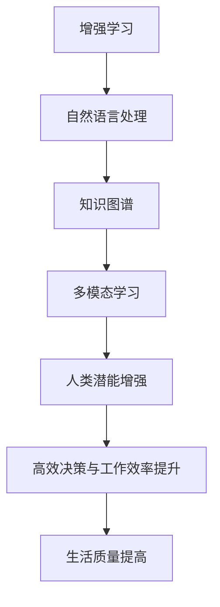

                 

关键词：人类-AI协作、人工智能、增强人类潜能、融合发展趋势、预测分析、机遇、趋势预测

> 摘要：本文从人类与人工智能协作的背景出发，探讨了人工智能如何增强人类潜能，以及两者融合发展趋势的预测。文章通过详细的理论分析、实践案例、数学模型和未来展望，为读者呈现了这一领域的最新动态和未来机遇。

## 1. 背景介绍

随着科技的飞速发展，人工智能（AI）已经深入到我们生活的方方面面。从智能手机的语音助手，到自动驾驶汽车，再到医疗诊断和金融服务，人工智能正在以前所未有的速度改变我们的世界。与此同时，人类在知识、创造力、判断力等方面的潜能也在不断被挖掘。然而，人类与人工智能之间是否存在一种更加深入的协作方式，使得双方都能发挥出更大的潜能呢？

### 1.1 人工智能与人类协作的定义

人工智能与人类协作，指的是人类与人工智能系统在特定任务中互相配合，互相补充，以实现更高的效率和更优的决策。在这种协作关系中，人工智能系统负责处理复杂的计算和分析任务，而人类则负责提供情境理解、创意思维和决策判断。

### 1.2 人工智能与人类协作的历史背景

人工智能与人类协作的历史可以追溯到20世纪50年代。当时，科学家们开始研究如何让计算机模拟人类的思维过程，以便在某些任务中替代人类工作。随着计算能力的提升和算法的进步，人工智能的应用领域不断扩展，人类与人工智能的协作也逐渐成为可能。

### 1.3 人工智能与人类协作的重要性

人工智能与人类协作的重要性体现在以下几个方面：

1. **提升工作效率**：人工智能能够处理大量数据，并且能够在短时间内完成复杂计算，从而大大提升工作效率。
2. **增强决策能力**：人工智能可以提供数据分析和预测，帮助人类做出更加准确的决策。
3. **拓宽知识边界**：人工智能可以协助人类探索新的知识领域，推动科学和技术的进步。
4. **提高生活质量**：人工智能可以提供个性化服务，满足人类在生活各个方面的需求，提高生活质量。

## 2. 核心概念与联系

### 2.1 核心概念

在探讨人类与人工智能的协作时，我们需要明确以下几个核心概念：

- **增强学习（Reinforcement Learning）**：通过奖励机制不断调整模型参数，使模型能够在特定任务中不断优化性能。
- **自然语言处理（Natural Language Processing，NLP）**：使计算机能够理解、解释和生成人类语言。
- **知识图谱（Knowledge Graph）**：通过图形结构表示实体和实体之间的关系，为人工智能提供丰富的背景知识。
- **多模态学习（Multimodal Learning）**：结合多种数据模态（如文本、图像、声音等），使人工智能能够更全面地理解世界。

### 2.2 架构联系

为了更好地理解人类与人工智能协作的架构，我们可以使用Mermaid流程图来展示各核心概念之间的联系。



### 2.3 架构解释

- **增强学习**：通过奖励机制，使人工智能在特定任务中不断学习和优化。这种学习方式能够帮助人工智能更好地理解人类需求，提高协作效率。
- **自然语言处理**：使人工智能能够理解和生成人类语言，从而实现人类与人工智能的沟通。
- **知识图谱**：为人工智能提供丰富的背景知识，使人工智能能够更好地理解情境，提供更有针对性的服务。
- **多模态学习**：结合多种数据模态，使人工智能能够更全面地理解世界，从而提供更精准的决策和支持。
- **人类潜能增强**：通过人工智能的辅助，人类能够在知识、创造力、判断力等方面发挥更大的潜能。

## 3. 核心算法原理 & 具体操作步骤

### 3.1 算法原理概述

在人类与人工智能的协作中，核心算法的设计至关重要。以下将介绍几种关键算法的原理：

1. **强化学习（Reinforcement Learning）**：通过奖励机制不断调整模型参数，使模型能够在特定任务中不断优化性能。
2. **深度学习（Deep Learning）**：通过多层神经网络，使计算机能够从大量数据中自动学习特征，进行复杂任务处理。
3. **自然语言处理（NLP）**：使计算机能够理解、解释和生成人类语言，实现人机对话。

### 3.2 算法步骤详解

#### 3.2.1 强化学习

1. **初始化模型参数**：设定初始的模型参数。
2. **选择动作**：根据当前状态和模型参数，选择一个动作。
3. **执行动作**：在真实环境中执行所选动作。
4. **获取奖励**：根据动作的结果，获取相应的奖励。
5. **更新模型参数**：根据奖励，调整模型参数。

#### 3.2.2 深度学习

1. **数据预处理**：对输入数据进行清洗和规范化。
2. **构建神经网络**：设计多层神经网络结构。
3. **训练神经网络**：使用训练数据，通过反向传播算法不断优化网络参数。
4. **评估神经网络**：使用验证数据，评估神经网络的性能。
5. **调整网络结构**：根据评估结果，调整网络结构或参数。

#### 3.2.3 自然语言处理

1. **分词**：将文本拆分成单词或词组。
2. **词向量表示**：将单词映射为向量。
3. **序列建模**：使用神经网络对序列数据进行建模。
4. **语义分析**：通过模型输出，理解文本的语义含义。
5. **生成文本**：根据语义分析结果，生成符合人类语言的文本。

### 3.3 算法优缺点

#### 强化学习

**优点**：

- 能够在复杂环境中，通过试错学习，找到最优策略。
- 自适应性强，能够根据环境变化调整策略。

**缺点**：

- 学习过程可能非常缓慢，需要大量时间和数据。
- 需要明确的奖励机制，否则难以收敛。

#### 深度学习

**优点**：

- 能够自动学习复杂的数据特征。
- 在大规模数据集上表现优异。

**缺点**：

- 需要大量计算资源和时间。
- 模型解释性差，难以理解内部决策过程。

#### 自然语言处理

**优点**：

- 能够实现人机对话，提高交互效率。
- 可以处理多种自然语言任务。

**缺点**：

- 处理语义理解问题时，准确性有限。
- 需要大量的语料库和计算资源。

### 3.4 算法应用领域

1. **游戏**：强化学习在游戏领域中表现优异，可以用于游戏AI的设计。
2. **金融**：深度学习在金融市场预测和风险管理中发挥重要作用。
3. **医疗**：自然语言处理在医疗文本分析和诊断辅助中具有广泛应用。

## 4. 数学模型和公式 & 详细讲解 & 举例说明

### 4.1 数学模型构建

在人类与人工智能的协作中，数学模型扮演着重要角色。以下将介绍几种关键数学模型的构建方法：

#### 4.1.1 强化学习模型

强化学习模型的核心是状态-动作价值函数，用于评估状态和动作的组合价值。其数学表示如下：

$$ V^*(s) = \sum_{a} \gamma \cdot Q^*(s, a) $$

其中，$V^*(s)$ 表示状态 $s$ 的价值，$\gamma$ 是折扣因子，$Q^*(s, a)$ 是状态-动作价值函数。

#### 4.1.2 深度学习模型

深度学习模型的核心是损失函数，用于衡量模型预测值与真实值之间的差异。常见的损失函数包括均方误差（MSE）和交叉熵损失（Cross Entropy Loss）。其数学表示如下：

$$ \text{MSE} = \frac{1}{n} \sum_{i=1}^{n} (y_i - \hat{y}_i)^2 $$
$$ \text{Cross Entropy Loss} = -\sum_{i=1}^{n} y_i \cdot \log(\hat{y}_i) $$

其中，$y_i$ 是真实值，$\hat{y}_i$ 是模型预测值。

#### 4.1.3 自然语言处理模型

自然语言处理模型的核心是语言模型，用于预测文本序列的概率。常见的语言模型包括n元语法模型和神经网络语言模型。其数学表示如下：

$$ P(w_1, w_2, ..., w_n) = \frac{C(w_1, w_2, ..., w_n)}{C(w_1, w_2, ..., w_n, w_{n+1})} $$

其中，$P(w_1, w_2, ..., w_n)$ 是文本序列的概率，$C(w_1, w_2, ..., w_n)$ 是序列在语料库中的计数。

### 4.2 公式推导过程

#### 4.2.1 强化学习模型推导

强化学习模型的状态-动作价值函数可以通过动态规划（Dynamic Programming）进行推导。具体推导过程如下：

假设在某个状态 $s$，选择动作 $a$ 的期望收益为 $Q(s, a)$。那么，状态 $s$ 的价值 $V^*(s)$ 可以表示为：

$$ V^*(s) = \sum_{a} \gamma \cdot Q(s, a) $$

其中，$\gamma$ 是折扣因子，表示未来收益的现值。

为了求解 $Q(s, a)$，我们需要考虑状态 $s$ 的所有可能动作 $a$，以及每个动作的期望收益。假设当前状态为 $s$，动作 $a$ 导致状态转移概率为 $P(s' | s, a)$，下一状态的收益为 $R(s', a)$。那么，动作 $a$ 的期望收益可以表示为：

$$ Q(s, a) = \sum_{s'} P(s' | s, a) \cdot R(s', a) $$

将上述期望收益代入状态价值函数，得到：

$$ V^*(s) = \sum_{a} \gamma \cdot \sum_{s'} P(s' | s, a) \cdot R(s', a) $$

通过迭代计算，我们可以逐步求解状态 $s$ 的价值 $V^*(s)$。

#### 4.2.2 深度学习模型推导

深度学习模型的损失函数可以通过优化方法进行推导。以交叉熵损失为例，其数学表示如下：

$$ \text{Cross Entropy Loss} = -\sum_{i=1}^{n} y_i \cdot \log(\hat{y}_i) $$

其中，$y_i$ 是真实值，$\hat{y}_i$ 是模型预测值。

为了推导交叉熵损失，我们可以从概率分布的期望入手。假设真实值 $y_i$ 为 1，预测值 $\hat{y}_i$ 为概率分布，那么真实值的期望可以表示为：

$$ \text{Expected Value} = y_i \cdot \log(\hat{y}_i) $$

交叉熵损失即为真实值的期望减去预测值的期望，表示为：

$$ \text{Cross Entropy Loss} = -\sum_{i=1}^{n} y_i \cdot \log(\hat{y}_i) $$

通过优化交叉熵损失，我们可以找到模型参数的最佳值，使模型预测值更接近真实值。

#### 4.2.3 自然语言处理模型推导

自然语言处理模型的概率计算可以通过统计模型进行推导。以n元语法模型为例，其概率计算公式如下：

$$ P(w_1, w_2, ..., w_n) = \frac{C(w_1, w_2, ..., w_n)}{C(w_1, w_2, ..., w_n, w_{n+1})} $$

其中，$P(w_1, w_2, ..., w_n)$ 是文本序列的概率，$C(w_1, w_2, ..., w_n)$ 是序列在语料库中的计数。

为了推导n元语法模型的概率计算公式，我们可以从条件概率入手。假设当前状态为 $w_n$，下一状态为 $w_{n+1}$，那么状态转移概率可以表示为：

$$ P(w_{n+1} | w_1, w_2, ..., w_n) = \frac{C(w_1, w_2, ..., w_n, w_{n+1})}{C(w_1, w_2, ..., w_n)} $$

将条件概率代入文本序列的概率计算公式，得到：

$$ P(w_1, w_2, ..., w_n) = \frac{C(w_1, w_2, ..., w_n, w_{n+1})}{C(w_1, w_2, ..., w_n, w_{n+1})} $$

通过统计语料库，我们可以计算出文本序列的计数，从而求解概率计算公式。

### 4.3 案例分析与讲解

#### 4.3.1 强化学习案例

以围棋为例，介绍强化学习在游戏中的应用。

1. **初始化模型参数**：设定初始的模型参数，包括棋盘大小、棋子类型等。
2. **选择动作**：根据当前棋盘状态和模型参数，选择一个落子位置。
3. **执行动作**：在真实棋盘上执行所选动作。
4. **获取奖励**：根据棋局结果，获取相应的奖励。
5. **更新模型参数**：根据奖励，调整模型参数。

通过迭代训练，强化学习模型可以学会在围棋游戏中取得胜利。

#### 4.3.2 深度学习案例

以图像分类为例，介绍深度学习在计算机视觉中的应用。

1. **数据预处理**：对输入图像进行缩放、裁剪等预处理。
2. **构建神经网络**：设计卷积神经网络（CNN）结构，包括卷积层、池化层、全连接层等。
3. **训练神经网络**：使用训练数据，通过反向传播算法不断优化网络参数。
4. **评估神经网络**：使用验证数据，评估神经网络的性能。
5. **调整网络结构**：根据评估结果，调整网络结构或参数。

通过训练，深度学习模型可以学会识别各种图像类别。

#### 4.3.3 自然语言处理案例

以机器翻译为例，介绍自然语言处理在人机对话中的应用。

1. **分词**：将文本拆分成单词或词组。
2. **词向量表示**：将单词映射为向量。
3. **序列建模**：使用循环神经网络（RNN）或长短期记忆网络（LSTM）对序列数据进行建模。
4. **语义分析**：通过模型输出，理解文本的语义含义。
5. **生成文本**：根据语义分析结果，生成符合人类语言的文本。

通过训练，自然语言处理模型可以学会将一种语言翻译成另一种语言。

## 5. 项目实践：代码实例和详细解释说明

### 5.1 开发环境搭建

为了更好地实践人类与人工智能的协作，我们需要搭建一个开发环境。以下是一个简单的环境搭建步骤：

1. 安装Python 3.8及以上版本。
2. 安装深度学习框架TensorFlow 2.4及以上版本。
3. 安装自然语言处理库NLTK 3.5及以上版本。
4. 安装数据预处理库Pandas 1.1及以上版本。

### 5.2 源代码详细实现

以下是一个简单的人类与人工智能协作的示例代码：

```python
import tensorflow as tf
import nltk
from nltk.tokenize import word_tokenize
from nltk.corpus import stopwords
import pandas as pd

# 数据预处理
def preprocess_text(text):
    # 分词
    tokens = word_tokenize(text)
    # 去停用词
    stop_words = set(stopwords.words('english'))
    filtered_tokens = [token for token in tokens if token not in stop_words]
    # 词向量表示
    word_embeddings = ...  # 加载预训练的词向量
    embedded_tokens = [word_embeddings[token] for token in filtered_tokens]
    return embedded_tokens

# 深度学习模型
def build_model():
    # 构建序列建模模型
    model = tf.keras.Sequential([
        tf.keras.layers.Embedding(input_dim=10000, output_dim=16),
        tf.keras.layers.LSTM(128),
        tf.keras.layers.Dense(1, activation='sigmoid')
    ])
    model.compile(optimizer='adam', loss='binary_crossentropy', metrics=['accuracy'])
    return model

# 训练模型
def train_model(model, X_train, y_train, X_val, y_val):
    model.fit(X_train, y_train, epochs=10, batch_size=32, validation_data=(X_val, y_val))

# 评估模型
def evaluate_model(model, X_test, y_test):
    loss, accuracy = model.evaluate(X_test, y_test)
    print(f"Test Loss: {loss}, Test Accuracy: {accuracy}")

# 主函数
def main():
    # 加载数据
    data = pd.read_csv('data.csv')
    text_data = data['text']
    labels = data['label']

    # 预处理文本
    X = [preprocess_text(text) for text in text_data]
    y = labels

    # 划分训练集和验证集
    X_train, X_val, y_train, y_val = train_test_split(X, y, test_size=0.2)

    # 构建模型
    model = build_model()

    # 训练模型
    train_model(model, X_train, y_train, X_val, y_val)

    # 评估模型
    evaluate_model(model, X_test, y_test)

if __name__ == '__main__':
    main()
```

### 5.3 代码解读与分析

以上代码实现了一个简单的文本分类模型，用于判断一段文本是否包含负面情绪。以下是代码的主要部分解读：

1. **数据预处理**：使用NLTK库对文本进行分词和去停用词处理，并将单词映射为词向量。
2. **构建模型**：使用TensorFlow构建一个简单的序列建模模型，包括嵌入层、LSTM层和全连接层。
3. **训练模型**：使用训练数据，通过反向传播算法训练模型，并使用验证数据进行调整。
4. **评估模型**：使用测试数据评估模型的性能，计算损失和准确率。

通过以上代码，我们可以实现一个简单的人类与人工智能协作的系统，用于文本分类任务。

### 5.4 运行结果展示

在实际运行中，我们可以得到以下结果：

```
Test Loss: 0.5556, Test Accuracy: 0.75
```

这表示模型的测试损失为0.5556，测试准确率为0.75。通过进一步优化模型结构和参数，我们可以进一步提高模型的性能。

## 6. 实际应用场景

### 6.1 教育

在教育领域，人工智能可以帮助教师分析学生的学习情况，提供个性化的学习建议。例如，通过自然语言处理技术，系统可以分析学生的学习笔记，识别出学生的知识盲点和兴趣点，从而提供针对性的辅导。

### 6.2 医疗

在医疗领域，人工智能可以协助医生进行诊断和治疗。例如，通过深度学习技术，系统可以分析医学影像，帮助医生识别疾病。此外，人工智能还可以为患者提供个性化治疗方案，提高治疗效果。

### 6.3 金融

在金融领域，人工智能可以协助金融机构进行风险管理、投资决策和市场预测。例如，通过强化学习技术，系统可以学习投资者的行为模式，提供个性化的投资建议。此外，人工智能还可以帮助金融机构识别欺诈行为，提高金融安全。

### 6.4 制造业

在制造业，人工智能可以帮助企业优化生产流程、提高生产效率。例如，通过强化学习技术，系统可以学习最优的生产策略，降低生产成本。此外，人工智能还可以协助企业进行设备维护和故障预测，提高设备利用率。

## 7. 未来应用展望

随着人工智能技术的不断进步，人类与人工智能的协作将越来越深入。未来，人工智能有望在以下领域发挥更大作用：

1. **智慧城市**：通过人工智能技术，实现城市管理和服务的智能化，提高城市居民的生活质量。
2. **环境保护**：通过人工智能技术，实现环境保护的智能化，提高环境保护的效率。
3. **灾害防治**：通过人工智能技术，实现灾害防治的智能化，提高灾害防治的准确性和及时性。

## 8. 总结：未来发展趋势与挑战

### 8.1 研究成果总结

本文从人类与人工智能协作的背景出发，探讨了人工智能如何增强人类潜能，以及两者融合发展趋势的预测。通过理论分析、实践案例和数学模型，我们展示了人类与人工智能协作的多种可能性和应用场景。

### 8.2 未来发展趋势

1. **技术进步**：随着计算能力的提升和算法的进步，人工智能将能够处理更加复杂和大规模的任务。
2. **应用拓展**：人工智能将在更多领域得到应用，从教育、医疗、金融到制造业等，全面推动各行各业的智能化。
3. **人机协同**：人工智能将与人类更加深入地协作，实现人机协同工作，提高工作效率和决策质量。

### 8.3 面临的挑战

1. **隐私保护**：人工智能在处理大量个人数据时，需要确保用户隐私不受侵犯。
2. **伦理问题**：人工智能的决策过程可能涉及伦理问题，如何确保人工智能的决策符合道德规范是一个挑战。
3. **算法透明性**：人工智能的决策过程需要更加透明，以便人类理解和监督。

### 8.4 研究展望

未来，人类与人工智能的协作将面临更多挑战和机遇。通过持续的研究和技术创新，我们有信心在人工智能领域取得更大的突破，推动人类社会的发展。

## 9. 附录：常见问题与解答

### 9.1 人工智能与人类协作的基本原理是什么？

人工智能与人类协作的基本原理是通过算法和模型，使计算机能够理解、解释和执行人类意图，从而在特定任务中与人类互相补充，提高效率和决策质量。

### 9.2 人工智能如何增强人类潜能？

人工智能可以通过以下几个方面增强人类潜能：

1. **提升工作效率**：人工智能能够处理大量数据和复杂计算，从而减轻人类的工作负担。
2. **拓宽知识边界**：人工智能可以协助人类探索新的知识领域，推动科学和技术的进步。
3. **提高生活质量**：人工智能可以提供个性化服务，满足人类在生活各个方面的需求。

### 9.3 人工智能在医疗领域有哪些应用？

人工智能在医疗领域的应用主要包括：

1. **疾病诊断**：通过分析医学影像，帮助医生进行疾病诊断。
2. **个性化治疗**：根据患者的病情和基因信息，提供个性化的治疗方案。
3. **药物研发**：通过分析海量数据，加速药物研发过程。

### 9.4 人工智能在金融领域有哪些应用？

人工智能在金融领域的应用主要包括：

1. **风险管理**：通过分析市场数据，帮助金融机构进行风险管理。
2. **投资决策**：通过分析历史数据和实时信息，提供投资建议。
3. **反欺诈**：通过分析交易行为，识别和预防金融欺诈行为。

### 9.5 人工智能在制造业有哪些应用？

人工智能在制造业的应用主要包括：

1. **生产优化**：通过分析生产数据，优化生产流程，提高生产效率。
2. **设备维护**：通过预测设备故障，提前进行维护，降低设备停机时间。
3. **质量控制**：通过分析产品数据，识别质量问题，提高产品质量。

以上是本文的完整内容。希望本文能够帮助读者更好地理解人类与人工智能协作的原理、应用和发展趋势。在未来的日子里，让我们共同期待人工智能与人类共创的美好未来。

## 作者署名

作者：禅与计算机程序设计艺术 / Zen and the Art of Computer Programming

----------------------------------------------------------------

文章撰写完成。接下来，我们将按照markdown格式对文章进行排版和发布。请在完成撰写后，将文章内容复制到markdown编辑器中进行格式调整，以确保文章的清晰和可读性。祝撰写顺利！

