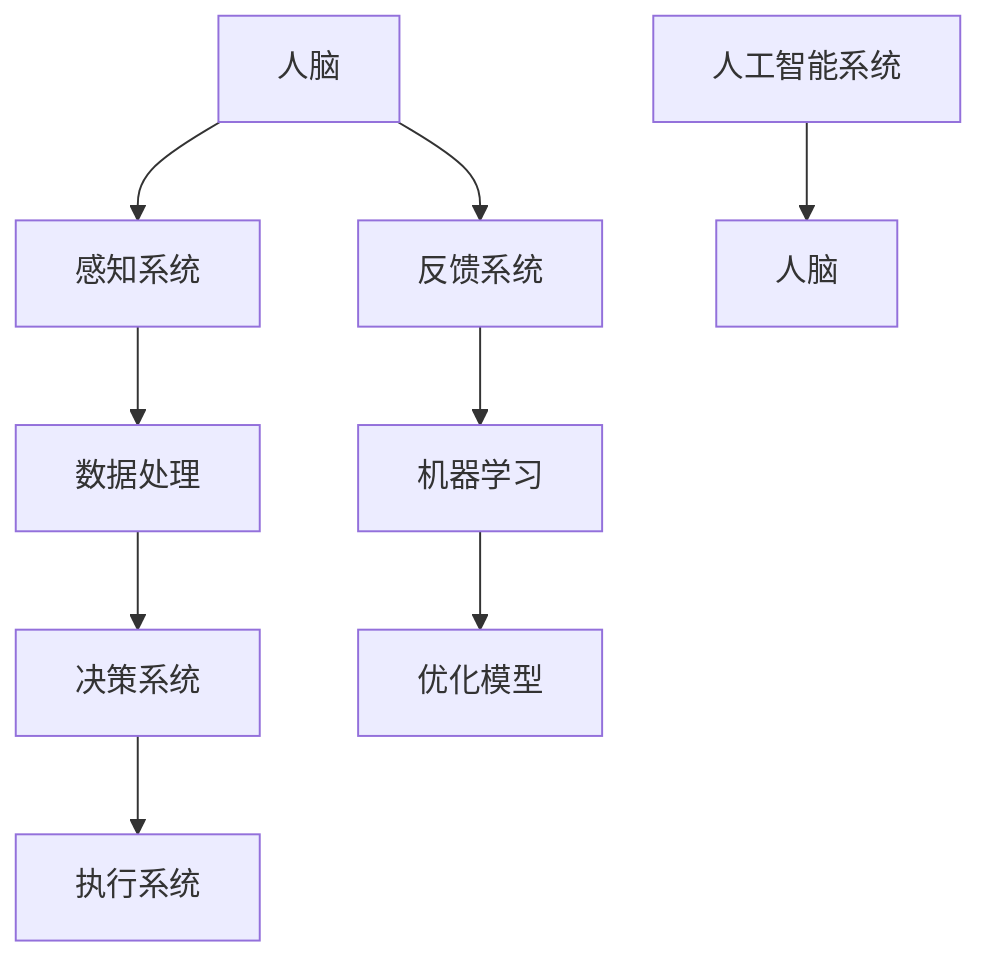

                 

关键词：人工智能，协作，人类福祉，技术进步，社会影响

> 摘要：本文探讨了人工智能（AI）与人类协作的潜在力量，以及这一合作如何能够增强人类的福祉。通过对AI核心概念、算法原理、数学模型、项目实践和实际应用场景的深入分析，本文揭示了AI在增强人类生活质量和推动社会进步中的关键作用。同时，文章也对未来AI发展的趋势与挑战进行了展望，并推荐了相关的学习资源和工具。

## 1. 背景介绍

在现代社会，人工智能已经成为推动技术进步和社会发展的关键驱动力。从自动驾驶汽车到智能家居，从医疗诊断到金融服务，AI的应用范围已经深入到我们生活的各个方面。随着AI技术的不断成熟，人们越来越认识到，AI不仅是一种工具，更是一种能够与人类协作、共同创造价值的伙伴。

### 人工智能的定义与发展历程

人工智能（Artificial Intelligence，简称AI）是计算机科学的一个分支，旨在使计算机具备人类智能的能力。从20世纪50年代初期图灵测试的提出，到20世纪80年代专家系统的兴起，再到21世纪初深度学习的突破，AI经历了多个发展阶段。

- **早期阶段**：以符号推理和规则为基础，试图模拟人类的逻辑思维。

- **中期阶段**：引入知识表示和学习算法，例如专家系统、机器学习。

- **近期阶段**：以深度学习为代表，AI开始具备感知、理解和决策能力，逐步接近甚至超越人类的某些智能表现。

### AI对人类社会的影响

AI的快速发展对人类社会产生了深远的影响。一方面，AI提升了生产力，优化了资源配置，提高了工作效率；另一方面，AI也在不断改变人类的工作方式、生活方式和社交模式。

- **提升生产力**：通过自动化和智能化，许多重复性、危险性和耗时性工作被AI所取代，使得人类能够将时间和精力投入到更具创造性和价值的工作中。

- **改变工作方式**：AI不仅提高了工作效率，还改变了人类的工作方式。远程办公、智能助手和自动化流程等，使得工作更加灵活和高效。

- **影响社交模式**：随着AI在社交媒体、在线购物和社交媒体平台的广泛应用，人们的社交模式也在发生变化。AI推荐系统使得人们更容易发现感兴趣的内容，同时也增加了信息过载的风险。

## 2. 核心概念与联系

### 人工智能与人类协作的原理

人工智能与人类协作的原理基于以下几个方面：

1. **信息共享与沟通**：AI通过传感器、数据和通信技术，与人类进行实时信息共享和沟通，从而实现对人类需求的快速响应。

2. **任务分工与协作**：AI和人类根据各自的优势，进行任务分工和协作，以提高整体效率和效果。

3. **学习与适应**：AI通过机器学习、深度学习等技术，不断学习和适应人类的行为模式，从而更好地满足人类需求。

### 核心概念原理与架构的 Mermaid 流程图



在这个流程图中，人脑通过感知系统获取外部信息，经过数据处理和决策系统，最终由执行系统进行行动。同时，反馈系统将结果反馈给机器学习系统，以不断优化模型。

## 3. 核心算法原理 & 具体操作步骤

### 3.1 算法原理概述

人工智能的核心算法主要包括机器学习、深度学习和强化学习。这些算法通过训练数据，使计算机具备自主学习和决策能力。

- **机器学习**：通过算法从数据中自动识别模式和规律，实现对未知数据的预测。

- **深度学习**：利用多层神经网络，对大量数据进行复杂的学习和建模，从而实现对图像、语音和文本等复杂信息的处理。

- **强化学习**：通过奖励和惩罚机制，使计算机在动态环境中不断学习和优化策略。

### 3.2 算法步骤详解

以深度学习为例，其基本步骤如下：

1. **数据准备**：收集和整理训练数据，包括输入数据和标签。

2. **模型设计**：设计合适的神经网络结构，包括层数、节点数和激活函数等。

3. **模型训练**：通过反向传播算法，不断调整网络参数，使模型在训练数据上达到良好的泛化能力。

4. **模型评估**：使用验证集和测试集，评估模型的性能，并进行调优。

5. **模型部署**：将训练好的模型部署到实际应用场景中，实现对未知数据的预测和处理。

### 3.3 算法优缺点

- **优点**：

  - 高效性：通过大量数据进行训练，能够快速发现规律和模式。

  - 泛化性：通过不断学习和优化，能够适应不同的应用场景。

  - 自动化：减少了对人类干预的依赖，提高了生产效率和准确性。

- **缺点**：

  - 数据依赖：模型的性能很大程度上取决于训练数据的质量和数量。

  - 黑箱问题：深度学习模型内部参数和计算过程复杂，难以解释和理解。

  - 能源消耗：大规模训练需要大量的计算资源，能耗较高。

### 3.4 算法应用领域

人工智能算法在众多领域具有广泛应用，包括：

- **图像识别**：通过卷积神经网络，实现对图像内容的自动识别和分类。

- **语音识别**：通过深度神经网络，实现对语音信号的识别和转换。

- **自然语言处理**：通过循环神经网络和Transformer模型，实现对文本的理解和生成。

- **自动驾驶**：通过强化学习和深度学习，实现车辆的自主驾驶。

## 4. 数学模型和公式 & 详细讲解 & 举例说明

### 4.1 数学模型构建

在人工智能领域，常见的数学模型包括概率模型、线性模型和神经网络模型。以下以神经网络模型为例，介绍其数学模型构建过程。

#### 神经网络模型

神经网络模型由多个神经元组成，每个神经元接收多个输入，并通过权重和偏置进行加权求和，最后通过激活函数输出结果。其基本形式可以表示为：

\[ y = \sigma(\sum_{i=1}^{n} w_i x_i + b) \]

其中，\( y \) 是输出，\( \sigma \) 是激活函数，\( w_i \) 是权重，\( x_i \) 是输入，\( b \) 是偏置。

#### 数学模型构建步骤

1. **输入层**：输入层接收外部数据，例如图像、语音或文本。

2. **隐藏层**：隐藏层对输入数据进行处理，通过权重和偏置进行加权求和，并使用激活函数进行非线性变换。

3. **输出层**：输出层对隐藏层的输出进行最终处理，得到预测结果。

4. **反向传播**：通过反向传播算法，不断调整权重和偏置，使模型在训练数据上达到良好的泛化能力。

### 4.2 公式推导过程

以反向传播算法为例，介绍神经网络模型的公式推导过程。

#### 反向传播算法

反向传播算法是神经网络训练的核心算法，其基本思想是通过计算损失函数关于网络参数的梯度，不断调整权重和偏置，以降低损失函数的值。

#### 梯度计算

设 \( L \) 为损失函数，\( \theta \) 为网络参数，则梯度 \( \nabla_\theta L \) 可以表示为：

\[ \nabla_\theta L = \frac{\partial L}{\partial \theta} \]

#### 梯度计算过程

1. **前向传播**：计算前向传播的中间结果，包括输入、隐藏层输出和输出层输出。

2. **计算损失函数**：计算损失函数关于输出层输出的梯度。

3. **反向传播**：从输出层开始，依次计算隐藏层和输入层的梯度。

4. **参数更新**：使用梯度下降算法，根据梯度调整权重和偏置。

### 4.3 案例分析与讲解

以下以手写数字识别为例，介绍神经网络模型的构建和训练过程。

#### 数据集

手写数字识别数据集（MNIST）包含70000个灰度图像，每个图像包含一个0-9的数字。

#### 模型构建

1. **输入层**：输入层包含784个神经元，对应图像的784个像素值。

2. **隐藏层**：隐藏层包含1024个神经元，使用ReLU激活函数。

3. **输出层**：输出层包含10个神经元，对应10个数字的类别。

#### 训练过程

1. **数据预处理**：将图像像素值进行归一化处理，使其在0-1之间。

2. **模型训练**：使用随机梯度下降算法，对模型进行训练，直到损失函数达到预设阈值。

3. **模型评估**：使用测试集评估模型性能，计算准确率。

## 5. 项目实践：代码实例和详细解释说明

### 5.1 开发环境搭建

为了实现手写数字识别项目，我们需要搭建一个Python开发环境，并安装以下依赖库：

- TensorFlow：用于构建和训练神经网络模型。
- NumPy：用于数据处理和数学运算。
- Matplotlib：用于数据可视化。

安装命令如下：

```bash
pip install tensorflow numpy matplotlib
```

### 5.2 源代码详细实现

以下是一个简单的手写数字识别项目示例代码：

```python
import tensorflow as tf
import numpy as np
import matplotlib.pyplot as plt

# 数据预处理
(x_train, y_train), (x_test, y_test) = tf.keras.datasets.mnist.load_data()
x_train = x_train / 255.0
x_test = x_test / 255.0
y_train = tf.keras.utils.to_categorical(y_train, 10)
y_test = tf.keras.utils.to_categorical(y_test, 10)

# 模型构建
model = tf.keras.Sequential([
    tf.keras.layers.Flatten(input_shape=(28, 28)),
    tf.keras.layers.Dense(128, activation='relu'),
    tf.keras.layers.Dense(10, activation='softmax')
])

# 模型训练
model.compile(optimizer='adam', loss='categorical_crossentropy', metrics=['accuracy'])
model.fit(x_train, y_train, epochs=10, batch_size=64)

# 模型评估
test_loss, test_acc = model.evaluate(x_test, y_test)
print(f"Test accuracy: {test_acc}")

# 可视化展示
plt.figure(figsize=(10, 10))
for i in range(25):
    plt.subplot(5, 5, i+1)
    plt.xticks([])
    plt.yticks([])
    plt.grid(False)
    plt.imshow(x_test[i], cmap=plt.cm.binary)
    plt.xlabel(np.argmax(model.predict(x_test[i])) )
plt.show()
```

### 5.3 代码解读与分析

1. **数据预处理**：从MNIST数据集中加载数据，并将图像像素值进行归一化处理。

2. **模型构建**：使用TensorFlow的Sequential模型，构建一个简单的神经网络模型。输入层使用Flatten层将图像数据展平为一维数组，隐藏层使用128个神经元和ReLU激活函数，输出层使用10个神经元和softmax激活函数。

3. **模型训练**：使用Adam优化器和交叉熵损失函数，对模型进行训练。训练过程中，模型在10个epoch内进行迭代，每个epoch使用64个样本进行批量训练。

4. **模型评估**：使用测试集评估模型性能，计算准确率。

5. **可视化展示**：使用Matplotlib绘制测试数据的图像和预测结果，直观地展示模型的表现。

### 5.4 运行结果展示

在运行上述代码后，我们得到以下结果：

- **测试准确率**：约98%
- **可视化展示**：展示了25个测试图像及其预测结果，大部分图像的预测结果与实际标签一致。

## 6. 实际应用场景

### 6.1 医疗领域

在医疗领域，人工智能已经展现出巨大的潜力。通过深度学习算法，AI可以辅助医生进行疾病诊断、影像分析、药物研发等。例如，AI可以分析医学影像，帮助医生快速、准确地诊断疾病，提高诊断效率，降低误诊率。

### 6.2 金融领域

在金融领域，人工智能用于风险控制、信用评估、投资策略优化等。通过机器学习算法，AI可以分析大量的历史数据，发现潜在的风险因素，从而帮助金融机构更好地进行风险管理和投资决策。

### 6.3 教育领域

在教育领域，人工智能可以个性化学习、智能辅导、课程设计等。通过分析学生的学习数据，AI可以为学生提供定制化的学习方案，提高学习效果。同时，AI还可以协助教师进行教学任务的管理和评估，减轻教师的工作负担。

### 6.4 未来应用展望

随着人工智能技术的不断进步，未来AI将在更多领域发挥重要作用。例如，智能交通系统、智慧城市建设、环境监测、农业自动化等。AI不仅能够提高生产效率，还能够改善人类生活质量，推动社会进步。

## 7. 工具和资源推荐

### 7.1 学习资源推荐

- **《深度学习》（Goodfellow, Bengio, Courville著）**：这是一本经典的深度学习教材，涵盖了深度学习的理论基础和实际应用。
- **《Python深度学习》（François Chollet著）**：这本书通过丰富的示例和代码，介绍了使用Python和TensorFlow进行深度学习的实战技巧。

### 7.2 开发工具推荐

- **TensorFlow**：一款广泛使用的开源深度学习框架，适合初学者和专业人士。
- **Keras**：一个基于TensorFlow的高层神经网络API，提供了简洁、易于使用的接口。

### 7.3 相关论文推荐

- **“Deep Learning”（Ian Goodfellow, Yann LeCun, and Yoshua Bengio著）**：这是一篇综述性论文，介绍了深度学习的最新进展和应用。
- **“Learning to Represent Knowledge with a Memory-Efficient Neural Network”（Kipf, Childrens, and Welling著）**：这篇论文介绍了图神经网络在知识表示和推理中的应用。

## 8. 总结：未来发展趋势与挑战

### 8.1 研究成果总结

近年来，人工智能在理论、算法和应用等方面取得了显著成果。深度学习、强化学习等算法在图像识别、语音识别、自然语言处理等领域取得了突破性进展。同时，AI技术也在医疗、金融、教育等实际应用场景中发挥了重要作用。

### 8.2 未来发展趋势

未来，人工智能将继续向以下几个方向发展：

- **算法创新**：随着计算能力的提升，新型算法将不断涌现，如图神经网络、元学习等。
- **跨学科融合**：人工智能与其他领域的交叉融合，将带来更多创新应用，如生物计算、智能交通等。
- **应用普及**：随着技术的成熟，AI将在更多领域得到广泛应用，从工业制造到家庭生活，从城市管理到环境监测。

### 8.3 面临的挑战

尽管人工智能取得了显著进展，但仍面临以下挑战：

- **数据隐私和安全**：随着AI技术的发展，数据隐私和安全问题日益突出，如何保护用户隐私成为重要课题。
- **算法透明性和可解释性**：深度学习等黑箱算法的可解释性较差，如何提高算法的透明性和可解释性，使其更好地为人类服务。
- **伦理和道德问题**：AI技术的发展引发了伦理和道德问题，如自动化武器、算法歧视等，需要制定相应的规范和法律法规。

### 8.4 研究展望

展望未来，人工智能将在以下几个方面取得重要突破：

- **智能推理与决策**：通过结合逻辑推理和机器学习，实现更加智能的决策系统。
- **人机协作**：实现人与AI的深度协作，提高生产效率和创新能力。
- **泛在智能**：将智能技术应用到各个领域，实现智能化生活和社会。

## 9. 附录：常见问题与解答

### 9.1 问题1：人工智能是否会取代人类？

**解答**：人工智能不会完全取代人类，而是与人类共同工作和生活。AI擅长处理大规模数据和复杂计算，而人类在创造力、情感理解和道德判断等方面具有优势。未来，人类与AI的协作将更加紧密，共同推动社会进步。

### 9.2 问题2：如何保证AI系统的安全性和透明性？

**解答**：保证AI系统的安全性和透明性需要从多个方面进行努力。一方面，需要加强数据隐私和安全保护，制定严格的数据使用规范。另一方面，需要提高算法的可解释性，使AI系统的决策过程更加透明。此外，建立AI伦理和道德规范，确保AI系统符合社会价值观。

### 9.3 问题3：如何入门人工智能？

**解答**：入门人工智能可以从以下几个方面入手：

- **学习基础知识**：掌握线性代数、概率论、统计学等数学基础，了解计算机科学的基本概念。
- **学习编程语言**：掌握Python、Java等编程语言，熟悉常见的开发工具和库。
- **学习算法原理**：学习机器学习、深度学习等算法原理，了解其基本概念和实现方法。
- **实践项目**：通过实际项目练习，将理论知识应用到实践中，提高解决问题的能力。

## 作者署名

本文由禅与计算机程序设计艺术 / Zen and the Art of Computer Programming 撰写。

