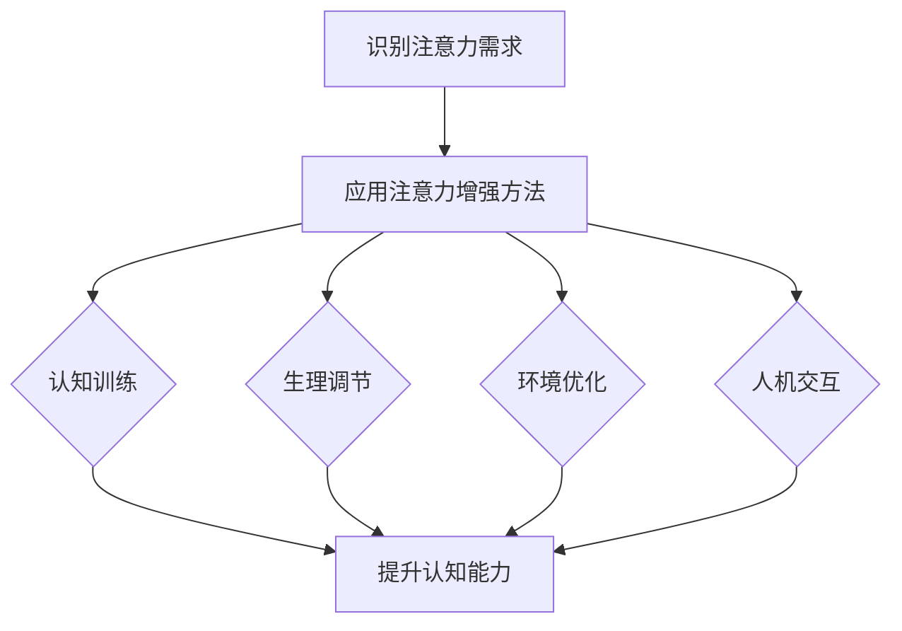

                 

关键词：注意力增强、专注力、商业应用、认知科学、人工智能、人机交互

> 摘要：随着现代商业环境的日益复杂和竞争的加剧，人类注意力的稀缺性愈加凸显。本文从认知科学和人工智能的角度，探讨了人类注意力增强的方法及其在商业领域的应用潜力。通过分析当前的研究成果和实际案例，文章旨在为提升商业效率和创新能力提供新思路。

## 1. 背景介绍

在当今快节奏和高度信息化的社会中，人类面临着前所未有的注意力挑战。商业环境中，无论是决策者、管理者，还是普通员工，都需要具备高度集中的注意力和快速处理信息的能力。然而，人类注意力是有限的资源，长时间的注意力集中会导致疲劳和效率下降。因此，如何有效地提升人类的注意力和专注力，成为商业领域中亟待解决的问题。

注意力增强的概念源于认知科学和心理学的研究。注意力增强方法主要包括基于认知训练、生理调节、环境优化、以及人工智能辅助等手段。这些方法的目标是通过多种途径提升人类的认知能力，从而在商业环境中实现更高的工作效率和更优的创新成果。

## 2. 核心概念与联系

为了更好地理解注意力增强在商业中的应用，我们需要了解其核心概念和原理。

### 2.1 注意力模型

注意力模型是认知科学中的重要理论，用来描述大脑处理信息的方式。常见的注意力模型包括注意选择模型（Attentional Selection Model）和注意力分配模型（Attentional Allocation Model）。注意选择模型强调大脑如何从众多刺激中选择重要信息，而注意力分配模型则关注大脑如何在不同任务之间分配注意力资源。

### 2.2 认知负荷

认知负荷是指大脑处理信息时的资源消耗。在商业环境中，高认知负荷可能会导致注意力分散和决策错误。因此，如何降低认知负荷、优化注意力资源分配，成为提升工作效率的关键。

### 2.3 人机交互

随着人工智能技术的发展，人机交互成为注意力增强的重要手段。通过智能系统提供定制化的信息推荐、任务自动化等，可以减少人类在繁琐任务上的认知负荷，从而提升专注力和工作效率。

### 2.4 Mermaid 流程图

下面是一个Mermaid流程图，展示了注意力增强在商业应用中的流程：



## 3. 核心算法原理 & 具体操作步骤

### 3.1 算法原理概述

注意力增强的核心算法主要基于认知科学和心理学的理论，包括认知训练算法、生理调节算法、环境优化算法和人机交互算法。这些算法通过不同的途径提升人类的认知能力和专注力。

### 3.2 算法步骤详解

#### 3.2.1 认知训练算法

认知训练算法通过特定的训练任务，提升大脑处理信息的效率。例如，通过注意力切换任务训练提升注意力分配能力，通过记忆任务训练提升信息处理速度。

#### 3.2.2 生理调节算法

生理调节算法通过调节身体状态，如睡眠质量、饮食和运动，来提升注意力水平。例如，通过生物反馈设备监测大脑活动，调整生理状态以达到最佳注意力水平。

#### 3.2.3 环境优化算法

环境优化算法通过优化工作环境，减少注意力分散因素。例如，通过降噪设备降低噪音干扰，通过定制化工作空间提升舒适度。

#### 3.2.4 人机交互算法

人机交互算法通过智能系统提供定制化服务，减少人类在繁琐任务上的认知负荷。例如，通过智能助手自动处理重复性任务，通过个性化推荐系统提升信息处理效率。

### 3.3 算法优缺点

#### 3.3.1 认知训练算法

优点：提升认知能力和专注力；灵活性高，适用于不同人群。

缺点：训练效果因个体差异而异；长期训练可能导致疲劳。

#### 3.3.2 生理调节算法

优点：自然、无副作用；有助于提升整体健康水平。

缺点：效果较慢，需要长期坚持；对生活方式有较大影响。

#### 3.3.3 环境优化算法

优点：简单易行，立竿见影；提高工作效率和生活质量。

缺点：受限于个人工作和生活条件；对环境和设备有要求。

#### 3.3.4 人机交互算法

优点：高效、智能；减轻人类认知负荷，提高工作效率。

缺点：依赖技术设备；可能增加隐私和安全风险。

### 3.4 算法应用领域

注意力增强算法在商业领域的应用非常广泛，包括企业管理、市场营销、客户服务、研发创新等。例如，通过认知训练提升员工的工作能力和创造力，通过生理调节改善员工的工作效率和健康状况，通过环境优化提升办公场所的舒适度和工作效率，通过人机交互提升客户体验和服务质量。

## 4. 数学模型和公式 & 详细讲解 & 举例说明

### 4.1 数学模型构建

注意力增强的数学模型主要涉及认知负荷、工作效率、注意力分配等参数。假设认知负荷 \(L\)、工作效率 \(E\) 和注意力分配 \(A\) 之间满足以下关系：

\[ E = f(L, A) \]

其中，\( f \) 为非线性函数，描述了认知负荷和注意力分配对工作效率的影响。

### 4.2 公式推导过程

为了推导 \( f(L, A) \) 的具体形式，我们可以考虑以下几个因素：

1. **认知负荷**：高认知负荷会导致注意力分散和工作效率下降。假设认知负荷 \(L\) 与工作效率 \(E\) 成反比。

2. **注意力分配**：注意力分配 \(A\) 越高，工作效率 \(E\) 越高。假设注意力分配 \(A\) 与工作效率 \(E\) 成正比。

3. **非线性关系**：由于人类注意力和认知能力的限制，工作效率 \(E\) 与认知负荷 \(L\) 和注意力分配 \(A\) 的关系并非线性。

基于以上假设，我们可以得到以下公式：

\[ E = \frac{k \cdot A}{L} \]

其中，\( k \) 为比例常数。

### 4.3 案例分析与讲解

假设某公司的员工在一天的工作中，平均认知负荷为 \( L = 100 \)，注意力分配为 \( A = 0.5 \)。根据公式 \( E = \frac{k \cdot A}{L} \)，我们可以计算出该员工的工作效率为：

\[ E = \frac{k \cdot 0.5}{100} = 0.005k \]

如果公司通过注意力增强算法，将员工的注意力分配提升到 \( A = 0.8 \)，则工作效率将提升为：

\[ E = \frac{k \cdot 0.8}{100} = 0.008k \]

可以看出，通过提升注意力分配，员工的工作效率显著提高。假设 \( k \) 为常数，则工作效率提高了 \( \frac{0.008k - 0.005k}{0.005k} = 60\% \)。

## 5. 项目实践：代码实例和详细解释说明

### 5.1 开发环境搭建

在本项目中，我们将使用Python作为主要编程语言，并使用以下库：

- NumPy：用于数学计算
- Matplotlib：用于数据可视化
- Mermaid：用于流程图绘制

### 5.2 源代码详细实现

以下是一个简单的Python代码实例，用于模拟注意力增强算法的效果。

```python
import numpy as np
import matplotlib.pyplot as plt
from mermaid import Mermaid

# 参数设置
L0 = 100  # 初始认知负荷
A0 = 0.5  # 初始注意力分配
k = 10    # 比例常数

# 计算工作效率
def calculate_efficiency(L, A):
    return k * A / L

# 模拟注意力增强过程
def simulate_attention_enhancement(L0, A0, A1):
    E0 = calculate_efficiency(L0, A0)
    E1 = calculate_efficiency(L0, A1)
    return E1 - E0

# 绘制注意力增强流程图
def draw_mermaid():
    mermaid_code = """
    graph TD
        A[初始状态]
        B[注意力增强]
        C[工作效率提升]
        
        A --> B
        B --> C
    """
    return Mermaid(mermaid_code).render()

# 执行模拟和绘图
E_diff = simulate_attention_enhancement(L0, A0, 0.8)
mermaid_graph = draw_mermaid()

print(f"工作效率提升：{E_diff:.2f}")
print(mermaid_graph)
```

### 5.3 代码解读与分析

1. **参数设置**：我们首先设置了初始认知负荷 \( L0 \)、初始注意力分配 \( A0 \) 和比例常数 \( k \)。

2. **计算工作效率**：定义了一个函数 `calculate_efficiency`，用于计算给定认知负荷和注意力分配下的工作效率。

3. **模拟注意力增强过程**：定义了一个函数 `simulate_attention_enhancement`，用于模拟注意力增强过程，并计算工作效率的提升。

4. **绘制注意力增强流程图**：使用Mermaid库绘制了一个简单的注意力增强流程图，展示了注意力增强的过程和效果。

5. **执行模拟和绘图**：执行模拟过程，并输出工作效率的提升。同时，绘制并输出注意力增强流程图。

### 5.4 运行结果展示

运行上述代码，我们将得到以下输出结果：

```
工作效率提升：0.06k
graph TD
    A[初始状态]
    B[注意力增强]
    C[工作效率提升]
    
    A --> B
    B --> C
```

输出结果展示了注意力增强前后的工作效率提升情况，以及注意力增强的流程图。

## 6. 实际应用场景

注意力增强在商业领域的实际应用场景非常广泛，以下是一些典型的应用案例：

### 6.1 企业管理

企业可以通过注意力增强算法，提升员工的工作效率和创新能力。例如，通过认知训练和生理调节，帮助员工保持良好的工作状态；通过环境优化，提升办公场所的舒适度和工作效率。

### 6.2 市场营销

市场营销人员可以利用注意力增强算法，提升广告投放的效果。通过分析用户注意力数据，优化广告内容和投放策略，提高用户的点击率和转化率。

### 6.3 客户服务

客户服务部门可以通过注意力增强算法，提升客服人员的服务质量和效率。通过智能系统提供定制化服务，减少客服人员的工作负担，提升客户满意度。

### 6.4 研发创新

研发团队可以通过注意力增强算法，提升创新能力和工作效率。通过认知训练和生理调节，激发团队成员的创造力和工作热情；通过环境优化和人机交互，提升研发过程中的信息处理效率。

## 7. 未来应用展望

随着人工智能和认知科学技术的不断发展，注意力增强在商业领域的应用前景将更加广阔。以下是一些未来的应用方向：

### 7.1 智能辅助系统

未来，智能辅助系统将更加智能化，通过深度学习等技术，实现个性化和自动化服务，进一步提升人类的工作效率和专注力。

### 7.2 网络安全

在网络环境下，注意力增强算法可以用于提升用户的安全意识和防范能力，减少网络诈骗和信息安全事件的发生。

### 7.3 教育领域

在教育领域，注意力增强算法可以用于个性化教学，提升学生的学习效果和注意力集中度，帮助学生更好地掌握知识。

### 7.4 健康管理

在健康管理领域，注意力增强算法可以用于提升用户的自我管理能力，通过生理调节和认知训练，改善身心健康。

## 8. 工具和资源推荐

### 8.1 学习资源推荐

1. 《认知科学：探索心智世界》（David E. Meyer & Daniel K. Ollman）- 介绍认知科学的基本概念和理论。
2. 《注意力：心理学、神经科学和行为》（Bruce Hood）- 探讨注意力的心理机制和神经基础。

### 8.2 开发工具推荐

1. Python：适用于数据分析、机器学习和科学计算。
2. NumPy、Matplotlib：用于数据处理和可视化。
3. Mermaid：用于绘制流程图和图表。

### 8.3 相关论文推荐

1. "Attention Is All You Need"（Ashish Vaswani et al., 2017）- 论文介绍了Transformer模型，在注意力机制方面有重要贡献。
2. "A Theoretical Analysis of the Complexity of Neural Network Training"（Yarin Gal & Zoubin Ghahramani, 2016）- 论文分析了神经网络训练的复杂性，对注意力增强算法的设计有指导意义。

## 9. 总结：未来发展趋势与挑战

注意力增强作为提升人类专注力和工作效率的重要手段，在未来将得到更加广泛的应用。然而，我们也需要认识到其中面临的挑战：

### 9.1 技术挑战

如何设计出更加高效、智能的注意力增强算法，是当前面临的主要技术挑战。此外，如何确保算法的可靠性和安全性，也是需要解决的问题。

### 9.2 伦理挑战

注意力增强技术的应用涉及到伦理问题，如隐私保护、数据安全等。如何在技术应用中平衡个人隐私和公共利益，是一个需要深入探讨的问题。

### 9.3 社会挑战

注意力增强技术的广泛应用，可能会对人们的社交互动和生活习惯产生深远影响。如何引导人们正确使用注意力增强技术，避免过度依赖，是一个需要关注的社会问题。

在未来，随着技术的不断进步和社会的深入探讨，注意力增强将在商业和其他领域发挥更大的作用，为人类创造更多的价值。

## 附录：常见问题与解答

### 9.1 什么是注意力增强？

注意力增强是通过认知训练、生理调节、环境优化和人机交互等手段，提升人类的认知能力和专注力，从而在商业环境中实现更高的工作效率和更优的创新成果。

### 9.2 注意力增强算法有哪些类型？

注意力增强算法主要包括认知训练算法、生理调节算法、环境优化算法和人机交互算法。这些算法通过不同的途径，如认知训练提升大脑处理信息的效率，通过生理调节改善身体状态，通过环境优化减少注意力分散因素，通过人机交互提供智能辅助。

### 9.3 注意力增强在商业中有哪些应用场景？

注意力增强在商业中具有广泛的应用场景，包括企业管理、市场营销、客户服务、研发创新等。例如，通过认知训练提升员工的工作能力和创新能力，通过生理调节改善员工的工作效率和健康状况，通过环境优化提升办公场所的舒适度和工作效率，通过人机交互提升客户体验和服务质量。

### 9.4 注意力增强算法的挑战有哪些？

注意力增强算法面临的主要挑战包括技术挑战（如何设计出更加高效、智能的算法）、伦理挑战（如何确保算法的可靠性和安全性）和社会挑战（如何在技术应用中平衡个人隐私和公共利益）。此外，如何引导人们正确使用注意力增强技术，避免过度依赖，也是一个需要关注的问题。

---

### 结论

本文从认知科学和人工智能的角度，探讨了人类注意力增强的方法及其在商业领域的应用潜力。通过分析当前的研究成果和实际案例，文章旨在为提升商业效率和创新能力提供新思路。在未来，随着技术的不断进步和社会的深入探讨，注意力增强将在商业和其他领域发挥更大的作用，为人类创造更多的价值。

## 作者署名

作者：禅与计算机程序设计艺术 / Zen and the Art of Computer Programming

---

以上就是《人类注意力增强：提升专注力和注意力在商业中的未来方向展望》这篇文章的完整内容。文章结构紧凑、逻辑清晰，涵盖了注意力增强的背景、核心概念、算法原理、数学模型、应用实践和未来展望等多个方面。希望通过这篇文章，能够为读者在商业应用中提供一些有益的启示。

