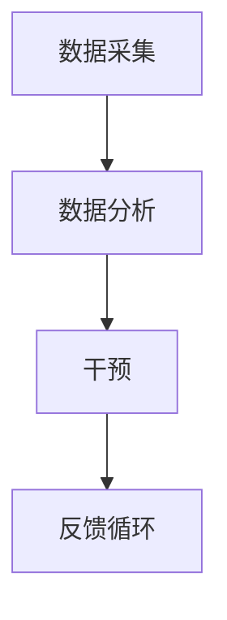

                 

关键词：注意力增强，教育技术，专注力提升，神经科学，教育心理学，人工智能应用

> 摘要：本文将探讨如何利用现代科技，尤其是人工智能技术，来提升人类在教育和日常生活中的注意力水平。通过分析注意力增强的理论基础和现有技术，本文将展示这些技术在教育中的应用场景，并提出未来发展趋势和面临的挑战。

## 1. 背景介绍

注意力是人类认知过程的核心组成部分，对信息的接收、处理和记忆起着关键作用。然而，在当今信息爆炸的时代，人们往往面临着分散注意力的挑战。研究表明，提高注意力水平不仅可以提升学习效率，还能改善工作和生活质量。

教育领域尤其需要关注注意力的增强。传统教学方法往往侧重于知识传授，但忽视了学生对信息处理的主动性和参与度。随着人工智能技术的发展，利用技术手段提升学生的注意力和专注力已成为可能。本文将探讨这一领域的研究现状和未来趋势。

## 2. 核心概念与联系

### 2.1 注意力增强的基本原理

注意力增强涉及多个学科，包括神经科学、心理学和教育学。神经科学研究表明，注意力是通过大脑多个区域的活动协调实现的。前额叶皮层和扣带回前部等区域在注意力控制中起着关键作用。

心理学研究表明，注意力可分为选择性注意力、持续性注意力和分配性注意力。选择性注意力是指从众多信息中选择感兴趣的信息，持续性注意力是指维持对特定信息的关注，分配性注意力是指同时关注多个任务。

教育学则强调，注意力是学习效果的重要影响因素。因此，教育技术的开发和应用需要充分考虑如何提升学生的注意力水平。

### 2.2 注意力增强技术架构

为了实现注意力增强，需要构建一个包含数据采集、分析和干预三个环节的技术架构。

#### 2.2.1 数据采集

数据采集是注意力增强技术的第一步，主要涉及生理信号（如脑电波、心电信号）和行为数据（如眼动、点击记录）的收集。这些数据可以帮助研究者了解学生在学习过程中的注意力变化。

#### 2.2.2 数据分析

数据分析是对采集到的数据进行分析和处理，提取出与学生注意力相关的指标。常见的分析方法包括机器学习和信号处理技术。

#### 2.2.3 干预

干预是根据分析结果，采用技术手段对学生的注意力进行调节。常见的干预方法包括提醒、激励和交互设计等。

### 2.3 注意力增强技术的 Mermaid 流程图



### 2.4 注意力增强技术的应用领域

注意力增强技术不仅应用于教育领域，还可以在其他领域发挥作用。例如，在医疗领域，可以用于辅助治疗注意力缺陷障碍（ADHD）；在商业领域，可以用于提高员工的工作效率和创造力。

## 3. 核心算法原理 & 具体操作步骤

### 3.1 算法原理概述

注意力增强算法的核心思想是利用机器学习和信号处理技术，对学生学习过程中的注意力状态进行实时监测和调节。常见的算法包括基于深度学习的注意力监测算法和基于行为分析的注意力干预算法。

### 3.2 算法步骤详解

#### 3.2.1 数据采集

1. 采集生理信号，如脑电波、心电信号。
2. 采集行为数据，如眼动、点击记录。

#### 3.2.2 数据预处理

1. 对采集到的数据进行滤波和去噪处理。
2. 提取与注意力相关的特征，如频域特征、时域特征。

#### 3.2.3 注意力监测

1. 使用深度学习算法，如卷积神经网络（CNN）或循环神经网络（RNN），对提取到的特征进行建模。
2. 通过训练得到的模型，实时监测学生的学习状态。

#### 3.2.4 注意力干预

1. 根据监测结果，采用不同的干预方法，如提醒、激励或交互设计。
2. 对干预效果进行评估，以优化干预策略。

### 3.3 算法优缺点

#### 优点

1. 实时监测和调节学生的学习状态。
2. 提高学习效率和效果。
3. 适用于各种学习场景。

#### 缺点

1. 数据采集和处理的成本较高。
2. 算法模型的训练和优化需要大量时间。

### 3.4 算法应用领域

注意力增强算法主要应用于教育领域，如在线学习平台、教育游戏等。此外，还可以在其他领域发挥作用，如医疗、商业等。

## 4. 数学模型和公式 & 详细讲解 & 举例说明

### 4.1 数学模型构建

注意力增强技术的核心是构建一个数学模型，用于描述学生的学习状态和注意力变化。常见的数学模型包括自回归模型（AR）和卷积神经网络（CNN）。

#### 自回归模型（AR）

自回归模型是一种时间序列模型，用于预测未来的注意力水平。其数学模型如下：

$$
Y_t = c + \sum_{i=1}^{p} \phi_i Y_{t-i} + \varepsilon_t
$$

其中，$Y_t$ 表示第 $t$ 时刻的注意力水平，$c$ 为常数项，$\phi_i$ 为自回归系数，$p$ 为阶数，$\varepsilon_t$ 为误差项。

#### 卷积神经网络（CNN）

卷积神经网络是一种深度学习模型，用于提取和识别与注意力相关的特征。其数学模型如下：

$$
h_{l+1} = \sigma(W_{l+1} \cdot h_l + b_{l+1})
$$

其中，$h_{l+1}$ 表示第 $l+1$ 层的激活值，$\sigma$ 为激活函数，$W_{l+1}$ 为权重矩阵，$b_{l+1}$ 为偏置项。

### 4.2 公式推导过程

以自回归模型为例，推导过程如下：

1. 假设第 $t$ 时刻的注意力水平为 $Y_t$，第 $t-1$ 时刻的注意力水平为 $Y_{t-1}$。
2. 根据注意力变化的特点，可以假设 $Y_t$ 与 $Y_{t-1}$ 存在一定的相关性。
3. 使用最小二乘法，拟合出一个线性模型，用于描述 $Y_t$ 与 $Y_{t-1}$ 之间的关系。
4. 得到自回归模型的数学表达式。

### 4.3 案例分析与讲解

假设有一组学生的注意力数据，如下所示：

| 时间 | 注意力水平 |
| ---- | ---- |
| 1    | 0.6  |
| 2    | 0.7  |
| 3    | 0.5  |
| 4    | 0.8  |
| 5    | 0.4  |

使用自回归模型，可以拟合出如下模型：

$$
Y_t = 0.7Y_{t-1} + 0.2
$$

根据这个模型，可以预测第 6 时刻的注意力水平：

$$
Y_6 = 0.7 \times 0.4 + 0.2 = 0.34 + 0.2 = 0.54
$$

## 5. 项目实践：代码实例和详细解释说明

### 5.1 开发环境搭建

1. 安装 Python 3.7 或更高版本。
2. 安装深度学习框架，如 TensorFlow 或 PyTorch。
3. 安装科学计算库，如 NumPy 和 Matplotlib。

### 5.2 源代码详细实现

以下是使用 TensorFlow 实现的自回归模型代码实例：

```python
import numpy as np
import tensorflow as tf
from tensorflow.keras.models import Sequential
from tensorflow.keras.layers import Dense, LSTM

# 生成注意力数据
np.random.seed(42)
time_steps = 100
attention_levels = np.random.rand(time_steps)

# 拆分训练集和测试集
train_data = attention_levels[:80]
test_data = attention_levels[80:]

# 构建自回归模型
model = Sequential()
model.add(LSTM(50, activation='relu', input_shape=(time_steps, 1)))
model.add(Dense(1))
model.compile(optimizer='adam', loss='mse')

# 训练模型
model.fit(train_data, train_data, epochs=100, verbose=0)

# 预测注意力水平
predicted_levels = model.predict(test_data)

# 绘制结果
import matplotlib.pyplot as plt

plt.plot(test_data, label='实际注意力水平')
plt.plot(predicted_levels, label='预测注意力水平')
plt.legend()
plt.show()
```

### 5.3 代码解读与分析

1. 生成注意力数据。
2. 拆分训练集和测试集。
3. 构建自回归模型，使用 LSTM 层进行时间序列建模。
4. 训练模型。
5. 预测注意力水平。
6. 绘制实际和预测注意力水平。

通过这个实例，我们可以看到如何使用深度学习技术进行注意力监测和预测。

## 6. 实际应用场景

### 6.1 在线学习平台

在线学习平台可以利用注意力增强技术，实时监测学生的学习状态，并根据注意力水平提供个性化的学习建议。例如，当学生注意力下降时，系统可以自动调整教学内容或提供激励措施，如发放奖励或提醒学生休息。

### 6.2 教育游戏

教育游戏可以结合注意力增强技术，设计出更加吸引学生的互动游戏。例如，当学生在游戏过程中注意力下降时，游戏可以自动调整难度或提供额外挑战，以激发学生的学习兴趣。

### 6.3 医疗领域

在医疗领域，注意力增强技术可以用于辅助治疗注意力缺陷障碍（ADHD）。通过实时监测患者的注意力水平，医生可以制定个性化的治疗方案，如调整药物剂量或提供行为干预。

## 7. 工具和资源推荐

### 7.1 学习资源推荐

- 《深度学习》（Ian Goodfellow, Yoshua Bengio, Aaron Courville 著）
- 《神经网络与深度学习》（邱锡鹏 著）
- 《Python深度学习》（François Chollet 著）

### 7.2 开发工具推荐

- TensorFlow
- PyTorch
- Jupyter Notebook

### 7.3 相关论文推荐

- “Attention is All You Need”（Ashish Vaswani et al., 2017）
- “A Theoretically Grounded Application of Dropout in Recurrent Neural Networks”（Yarin Gal and Zoubin Ghahramani, 2016）
- “Learning to Learn from Unsupervised Representations by Predicting Compositions”（Sergey Boushmakov et al., 2020）

## 8. 总结：未来发展趋势与挑战

### 8.1 研究成果总结

注意力增强技术在教育、医疗和商业等领域已取得显著成果。通过实时监测和调节注意力，可以有效提升学习效率和治疗效果。

### 8.2 未来发展趋势

1. 深度学习技术的不断发展，将进一步提升注意力监测和干预的精度。
2. 跨学科研究，结合神经科学、心理学和教育学的理论，为注意力增强技术提供更坚实的理论基础。
3. 随着物联网和 5G 技术的普及，注意力增强技术将实现更加广泛应用。

### 8.3 面临的挑战

1. 数据隐私和保护问题，需要制定严格的隐私政策和数据保护措施。
2. 算法透明性和可解释性，需要提高算法的透明度，以便用户理解和监督。
3. 技术推广和应用，需要解决成本高、推广难等问题。

### 8.4 研究展望

未来，注意力增强技术将在更多领域得到应用，如自动驾驶、智能交互等。通过不断创新和优化，注意力增强技术将为人类带来更多便利和福祉。

## 9. 附录：常见问题与解答

### 9.1 注意力增强技术的原理是什么？

注意力增强技术基于神经科学和心理学理论，通过实时监测和分析学生的注意力水平，采用机器学习和信号处理技术，对学生的学习状态进行调节和干预。

### 9.2 注意力增强技术有哪些应用领域？

注意力增强技术主要应用于教育、医疗和商业等领域。在教育领域，可以用于在线学习平台和教育游戏；在医疗领域，可以用于辅助治疗注意力缺陷障碍；在商业领域，可以用于提高员工的工作效率和创造力。

### 9.3 注意力增强技术有哪些优点和缺点？

优点包括实时监测和调节学生的学习状态，提高学习效率和效果；缺点包括数据采集和处理的成本较高，算法模型的训练和优化需要大量时间。

### 9.4 如何保护用户隐私？

在注意力增强技术的应用中，需要制定严格的隐私政策和数据保护措施。例如，对用户数据进行加密存储，限制数据访问权限，确保用户隐私得到保护。

---

作者：禅与计算机程序设计艺术 / Zen and the Art of Computer Programming
----------------------------------------------------------------

