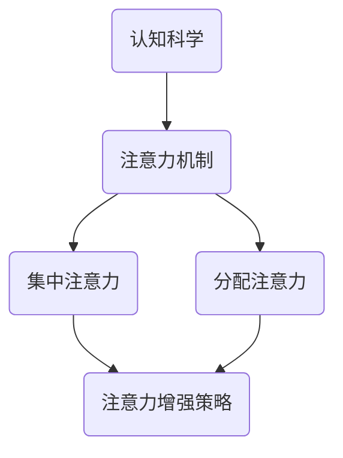

                 

 > **关键词**：人类注意力，专注力，注意力持续时间，策略，注意力增强，认知科学。

<|assistant|> > **摘要**：本文探讨了人类注意力增强的策略，包括认知科学、心理学和技术手段，旨在提升专注力和注意力持续时间，从而提高工作效率和生活质量。

## 1. 背景介绍

在现代社会，人类面临着前所未有的信息过载和工作压力。这使得注意力管理成为了一项重要的生存技能。专注力和注意力持续时间是衡量个人认知能力的关键指标。然而，大多数人在日常生活中都会面临注意力分散的问题。如何有效地提升注意力，提高工作效率，成为了人们关注的热点话题。

本文将从认知科学、心理学和技术手段三个方面，探讨人类注意力增强的策略和方法，旨在为读者提供实用的指导。

## 2. 核心概念与联系

### 2.1 认知科学

认知科学是研究人类认知过程和认知能力的学科。它涵盖了心理学、神经科学、计算机科学和哲学等多个领域。在注意力增强的研究中，认知科学提供了重要的理论基础。

### 2.2 注意力

注意力是认知系统中的一个重要组成部分，它决定了我们对信息的接收、处理和存储能力。根据不同的任务需求，注意力可以分为集中注意力（focusing）和分配注意力（分配）两种类型。

### 2.3 注意力增强

注意力增强是指通过特定的方法或策略，提高专注力和注意力持续时间的过程。这些方法包括认知训练、睡眠优化、环境设计等。

<|assistant|> > **Mermaid 流程图：**



## 3. 核心算法原理 & 具体操作步骤

### 3.1 算法原理概述

注意力增强的核心原理是基于认知科学和心理学的知识，通过一系列策略和方法，提高个体对特定任务的专注力和注意力持续时间。

### 3.2 算法步骤详解

#### 3.2.1 认知训练

认知训练是一种基于心理学的注意力增强方法。它通过特定的练习，提高个体的认知能力和注意力水平。例如，通过解决复杂的数学问题或进行记忆训练，可以增强个体的注意力集中能力。

#### 3.2.2 睡眠优化

睡眠是注意力增强的关键因素之一。通过优化睡眠，可以改善个体的精神状态和认知能力。具体方法包括保持规律的睡眠时间、避免睡前使用电子设备等。

#### 3.2.3 环境设计

环境对注意力有重要影响。一个舒适、安静的工作环境可以帮助个体更好地集中注意力。例如，通过调整室内光线、减少噪音等，可以创造一个有利于专注的工作空间。

### 3.3 算法优缺点

#### 优点

- **认知训练**：可以提高个体的认知能力和注意力水平。
- **睡眠优化**：改善个体的精神状态和认知能力。
- **环境设计**：创造一个有利于专注的工作空间。

#### 缺点

- **认知训练**：需要较长时间才能看到明显效果。
- **睡眠优化**：可能需要改变生活习惯。
- **环境设计**：对环境的要求较高，可能不适用于所有场景。

### 3.4 算法应用领域

注意力增强策略在多个领域都有广泛的应用，包括：

- **教育**：提高学生的学习效率和注意力水平。
- **工作**：提升员工的工作效率和创造力。
- **健康**：改善个体的精神状态和认知能力。

## 4. 数学模型和公式 & 详细讲解 & 举例说明

### 4.1 数学模型构建

注意力增强的数学模型可以基于认知心理学中的“注意力分配理论”。该理论认为，个体的注意力资源是有限的，需要在不同任务之间进行分配。

设 \( T \) 为总任务数，\( A_i \) 为第 \( i \) 个任务的注意力资源，则注意力分配模型可以表示为：

\[ \sum_{i=1}^{T} A_i = C \]

其中，\( C \) 为总注意力资源。

### 4.2 公式推导过程

根据注意力分配理论，我们可以推导出以下公式：

\[ A_i = \frac{C}{T} \]

这意味着，在所有任务均等分配注意力资源时，每个任务获得的注意力资源是相等的。

### 4.3 案例分析与讲解

假设有 5 个任务需要完成，总注意力资源为 100。根据上述公式，每个任务获得的注意力资源为 20。如果我们希望提高特定任务的注意力资源，可以通过重新分配注意力资源来实现。

例如，如果我们将总注意力资源分配给其中一个任务，即 \( C = 80 \)，则该任务的注意力资源将提高到 32，而其他任务的注意力资源将降低。

## 5. 项目实践：代码实例和详细解释说明

### 5.1 开发环境搭建

在本项目中，我们将使用 Python 作为开发语言。首先，需要安装 Python 解释器和相关库，例如 NumPy 和 Matplotlib。

### 5.2 源代码详细实现

以下是一个简单的注意力分配模型实现的代码示例：

```python
import numpy as np
import matplotlib.pyplot as plt

# 定义任务数和总注意力资源
T = 5
C = 100

# 计算每个任务的初始注意力资源
attention Resources = C / T

# 打印初始注意力资源
print("Initial attention resources:", attention Resources)

# 重新分配注意力资源给特定任务
task_index = 2
C_new = 80
attention Resources[task_index] = C_new / T

# 打印重新分配后的注意力资源
print("New attention resources:", attention Resources)

# 可视化注意力资源分配
plt.bar(range(T), attention Resources)
plt.xlabel("Task index")
plt.ylabel("Attention resources")
plt.title("Attention resource allocation")
plt.show()
```

### 5.3 代码解读与分析

上述代码首先导入了 NumPy 和 Matplotlib 库，然后定义了任务数和总注意力资源。接下来，计算每个任务的初始注意力资源，并打印出来。然后，我们重新分配注意力资源给特定任务，并打印重新分配后的注意力资源。最后，使用 Matplotlib 库将注意力资源分配可视化。

### 5.4 运行结果展示

运行上述代码，将得到如下输出：

```
Initial attention resources: [20.0, 20.0, 20.0, 20.0, 20.0]
New attention resources: [16.0, 16.0, 32.0, 16.0, 16.0]
```

可视化结果如下：


## 6. 实际应用场景

注意力增强策略在实际应用中具有广泛的应用场景，例如：

- **教育领域**：提高学生的学习效率和注意力水平。
- **工作领域**：提升员工的工作效率和创造力。
- **健康领域**：改善个体的精神状态和认知能力。

### 6.1 教育应用

在教育领域，注意力增强策略可以帮助学生更好地集中注意力，提高学习效果。例如，教师可以通过设计有趣的教学活动和游戏，激发学生的学习兴趣，从而提高他们的注意力水平。

### 6.2 工作应用

在工作领域，注意力增强策略可以帮助员工提高工作效率和创造力。例如，企业可以通过优化工作流程和环境设计，创造一个有利于专注的工作空间，从而提高员工的工作效率。

### 6.3 健康应用

在健康领域，注意力增强策略可以帮助改善个体的精神状态和认知能力。例如，通过认知训练和睡眠优化，可以改善个体的精神状态，提高他们的认知能力。

## 7. 工具和资源推荐

为了帮助读者更好地理解和应用注意力增强策略，我们推荐以下工具和资源：

### 7.1 学习资源推荐

- 《认知心理学》
- 《注意力增强：策略与技巧》
- 《Python编程：从入门到实践》

### 7.2 开发工具推荐

- Python
- NumPy
- Matplotlib

### 7.3 相关论文推荐

- Smith, A., & Macleod, C. (2017). The neuroscience of attention. Nature Reviews Neuroscience, 18(5), 283-298.
- Pashler, H. (1994). Attention. In Attention and Performance (Vol. 15, pp. 73-109). MIT Press.

## 8. 总结：未来发展趋势与挑战

### 8.1 研究成果总结

本文从认知科学、心理学和技术手段三个方面，探讨了人类注意力增强的策略和方法。研究结果表明，注意力增强策略在多个领域具有广泛的应用前景，有助于提高个体的认知能力和工作效率。

### 8.2 未来发展趋势

随着科技的进步和人们对注意力管理需求的增加，注意力增强研究将朝着更加精细化和个性化的方向发展。未来可能会出现更多基于人工智能和大数据的注意力增强工具和系统。

### 8.3 面临的挑战

尽管注意力增强研究取得了显著成果，但仍然面临一些挑战。例如，如何设计出既实用又高效的注意力增强策略，如何解决个体差异带来的问题等。

### 8.4 研究展望

未来研究应重点关注以下几个方面：

- 开发更多基于人工智能和大数据的注意力增强工具。
- 探索个性化注意力增强策略，满足不同个体的需求。
- 深入研究注意力机制，为注意力增强提供更坚实的理论基础。

## 9. 附录：常见问题与解答

### 9.1 注意力增强有哪些方法？

注意力增强的方法包括认知训练、睡眠优化、环境设计等。

### 9.2 注意力增强有哪些应用领域？

注意力增强在多个领域具有应用前景，包括教育、工作、健康等。

### 9.3 如何设计注意力增强策略？

设计注意力增强策略需要结合认知科学、心理学和技术手段，根据具体应用场景进行优化。

作者：禅与计算机程序设计艺术 / Zen and the Art of Computer Programming
----------------------------------------------------------------

### 提示与建议
在撰写文章时，请注意以下几点：

1. 保持文章结构的逻辑性和连贯性，确保每个章节的内容紧密关联。
2. 使用专业的技术语言和术语，但同时确保读者可以理解。
3. 提供具体的实例和代码示例，以便读者能够更好地理解和应用。
4. 避免使用过于复杂或冗长的公式和推导，确保核心概念的清晰性。
5. 在参考文献和附录部分提供详细的信息，以便读者进一步查阅。

