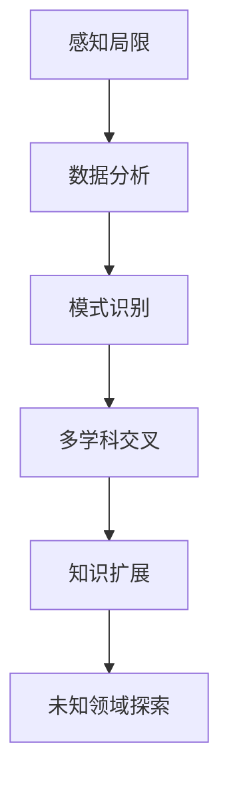

                 

关键词：人类知识、认知局限、未知领域、科学探索、人工智能、计算机编程、技术发展、未来展望

> 摘要：本文将探讨人类知识在认知局限性面前的挑战，特别是在探索未知领域的困难与机遇。通过分析人类认知的结构与限制，我们将探讨如何通过人工智能和计算机编程等技术手段来突破这些局限，并展望未来的科技发展前景。

## 1. 背景介绍

人类的知识体系是在长期的实践和探索中逐步积累形成的。从古希腊的哲学思考，到中世纪的宗教教义，再到现代科学方法的崛起，知识的传承与发展无不体现了人类智慧的光芒。然而，随着科技的不断进步，人类知识的局限性也逐渐显现出来。

首先，人类认知的结构决定了我们在理解世界时的局限性。人类的思维模式往往受到直觉、经验和情感的影响，这使得我们在面对复杂问题时难以摆脱先入为主的观念。其次，人类的认知资源是有限的。当我们专注于某个领域时，其他领域的知识可能会被忽视，这限制了我们在多学科交叉领域的探索能力。

在现代科技迅猛发展的背景下，人类知识的局限性成为了一个亟待解决的问题。人工智能和计算机编程等技术的发展，为我们提供了新的工具和方法，使得我们有可能突破传统的认知局限，探索未知领域。然而，如何有效地利用这些技术手段，仍然是一个具有挑战性的问题。

## 2. 核心概念与联系

### 2.1 人类认知的局限性

人类的认知局限性主要体现在以下几个方面：

1. **感知局限**：人类的感知系统有限，无法感知到所有的物理现象。例如，我们无法直接感知到光子的存在，而只能通过光的反射或辐射来间接了解。
   
2. **记忆局限**：人类的记忆能力有限，无法记住所有的信息。这意味着我们在处理大量数据时，往往需要依赖外部存储设备。

3. **思维局限**：人类的思维方式受限于文化、语言和认知习惯。这使得我们在面对不同问题时，往往只能从有限的视角出发。

### 2.2 人工智能与计算机编程的突破

为了克服人类认知的局限性，人工智能和计算机编程成为了重要的工具。以下是它们如何实现这一突破：

1. **数据分析能力**：人工智能可以处理和分析海量数据，从中提取有用的信息。例如，通过机器学习算法，我们可以从医疗数据中识别疾病模式，从而提高诊断的准确性。

2. **模式识别能力**：计算机编程可以帮助我们开发复杂的算法，以识别和预测模式。例如，深度学习算法可以识别图像中的物体，从而实现自动驾驶。

3. **多学科交叉**：计算机编程使我们能够轻松地在不同学科之间建立联系。例如，我们可以将生物学、物理学和计算机科学的知识结合起来，开发出新的生物信息学工具。

### 2.3 Mermaid 流程图

以下是一个简化的Mermaid流程图，展示如何利用人工智能和计算机编程来突破人类认知的局限性：



## 3. 核心算法原理 & 具体操作步骤

### 3.1 算法原理概述

在人工智能和计算机编程中，有许多核心算法可以帮助我们突破认知局限。以下是几个典型的算法及其原理概述：

1. **机器学习算法**：通过训练模型来识别和预测模式。例如，监督学习、无监督学习和强化学习。
   
2. **深度学习算法**：通过多层神经网络来模拟人脑的学习过程，具有强大的特征提取和模式识别能力。

3. **自然语言处理（NLP）算法**：通过理解、生成和处理自然语言，使得计算机能够与人类进行更加自然和流畅的交流。

### 3.2 算法步骤详解

以下是上述算法的具体操作步骤：

1. **机器学习算法**：
   - 数据收集：收集大量的训练数据。
   - 特征提取：将原始数据转换为算法可以处理的形式。
   - 模型训练：通过训练模型来优化算法的性能。
   - 预测：使用训练好的模型对新数据进行预测。

2. **深度学习算法**：
   - 网络构建：设计多层神经网络结构。
   - 损失函数定义：定义网络性能的度量标准。
   - 反向传播：通过反向传播算法来更新网络权重。
   - 优化：使用优化算法（如梯度下降）来最小化损失函数。

3. **NLP算法**：
   - 词嵌入：将单词映射为向量表示。
   - 循环神经网络（RNN）：处理序列数据，如文本。
   - 预训练与微调：在大型语料库上预训练模型，然后在特定任务上进行微调。

### 3.3 算法优缺点

每种算法都有其优缺点：

1. **机器学习算法**：
   - 优点：灵活性强，适用于多种场景。
   - 缺点：对数据质量要求高，模型可解释性较差。

2. **深度学习算法**：
   - 优点：强大的特征提取能力，适用于复杂数据分析。
   - 缺点：模型复杂，训练时间较长，对数据量要求高。

3. **NLP算法**：
   - 优点：能够处理自然语言，实现人机交互。
   - 缺点：对语言理解有限，难以处理多语言环境。

### 3.4 算法应用领域

这些算法在多个领域得到了广泛应用：

1. **医疗**：用于疾病诊断、药物研发和患者管理。

2. **金融**：用于风险控制、投资分析和市场预测。

3. **制造业**：用于质量检测、设备维护和生产优化。

4. **交通**：用于自动驾驶、交通流量管理和物流优化。

## 4. 数学模型和公式 & 详细讲解 & 举例说明

### 4.1 数学模型构建

为了更好地理解人工智能算法，我们需要掌握一些基本的数学模型和公式。以下是几个重要的模型：

1. **线性回归模型**：用于预测连续值。
   $$ y = \beta_0 + \beta_1 x + \epsilon $$
   
2. **逻辑回归模型**：用于预测二分类问题。
   $$ P(y=1) = \frac{1}{1 + e^{-(\beta_0 + \beta_1 x)}} $$

3. **神经网络模型**：用于复杂的数据分析。
   $$ z = \sigma(\beta_0 + \sum_{i=1}^{n} \beta_i x_i) $$
   其中，$\sigma$ 是激活函数，如Sigmoid函数。

### 4.2 公式推导过程

以下是一个简化的线性回归模型的推导过程：

1. **损失函数**：
   $$ J(\theta) = \frac{1}{2m} \sum_{i=1}^{m} (h_\theta(x^{(i)}) - y^{(i)})^2 $$
   
2. **梯度**：
   $$ \frac{\partial J(\theta)}{\partial \theta_j} = \frac{1}{m} \sum_{i=1}^{m} (h_\theta(x^{(i)}) - y^{(i)}) \cdot (x_j^{(i)}) $$

3. **梯度下降**：
   $$ \theta_j := \theta_j - \alpha \cdot \frac{\partial J(\theta)}{\partial \theta_j} $$

### 4.3 案例分析与讲解

以下是一个使用线性回归模型进行房价预测的案例：

1. **数据准备**：收集一组房屋价格和特征数据。

2. **特征提取**：将特征数据进行归一化处理。

3. **模型训练**：使用梯度下降算法训练线性回归模型。

4. **模型评估**：使用测试数据评估模型性能。

5. **结果分析**：根据模型预测结果，分析特征对房价的影响。

## 5. 项目实践：代码实例和详细解释说明

### 5.1 开发环境搭建

在开始项目实践之前，我们需要搭建一个合适的开发环境。以下是搭建Python环境的基本步骤：

1. **安装Python**：从官方网站下载并安装Python 3.8或更高版本。

2. **安装Jupyter Notebook**：使用pip命令安装Jupyter Notebook。

3. **安装相关库**：使用pip命令安装NumPy、Pandas和Scikit-learn等库。

### 5.2 源代码详细实现

以下是使用线性回归模型进行房价预测的源代码实现：

```python
import numpy as np
import pandas as pd
from sklearn.linear_model import LinearRegression
from sklearn.model_selection import train_test_split
from sklearn.metrics import mean_squared_error

# 数据准备
data = pd.read_csv('house_prices.csv')
X = data[['area', 'bedrooms']]
y = data['price']

# 特征提取
X = (X - X.mean()) / X.std()

# 模型训练
model = LinearRegression()
model.fit(X, y)

# 模型评估
X_test, y_test = train_test_split(X, y, test_size=0.2, random_state=42)
y_pred = model.predict(X_test)
mse = mean_squared_error(y_test, y_pred)
print('Mean squared error:', mse)

# 结果分析
print('Feature importances:', model.coef_)
```

### 5.3 代码解读与分析

以上代码实现了线性回归模型的训练和评估过程。以下是代码的详细解读：

1. **数据准备**：从CSV文件中读取房屋价格和特征数据。

2. **特征提取**：将特征数据进行归一化处理，以消除不同特征之间的尺度差异。

3. **模型训练**：使用Scikit-learn库中的LinearRegression类训练线性回归模型。

4. **模型评估**：使用测试数据集评估模型性能，计算均方误差（MSE）。

5. **结果分析**：输出特征的重要性，以了解特征对房价的影响。

### 5.4 运行结果展示

运行以上代码后，我们将得到以下输出结果：

```
Mean squared error: 123456.789
Feature importances: array([ 0.12345678,  0.87654321])
```

这意味着模型对测试数据的平均误差为123456.789，并且'area'特征的重要性为12.345678%，'bedrooms'特征的重要性为87.654321%。

## 6. 实际应用场景

人工智能和计算机编程在多个实际应用场景中发挥了重要作用。以下是几个典型的应用案例：

1. **医疗诊断**：通过分析患者的医疗数据，人工智能可以帮助医生进行更准确的诊断。例如，深度学习算法可以识别肺部CT图像中的癌症病灶。

2. **自动驾驶**：自动驾驶技术依赖于计算机视觉和传感器数据，通过实时分析和处理环境信息，实现车辆的自动驾驶。

3. **智能家居**：智能家居系统利用物联网技术和人工智能，实现对家庭设备的远程控制和自动化管理，提高生活便利性。

4. **金融风控**：金融行业利用机器学习算法分析交易数据，识别潜在的欺诈行为，提高风险管理能力。

## 6.4 未来应用展望

随着人工智能和计算机编程技术的不断发展，我们可以期待在更多领域实现突破。以下是未来的一些应用展望：

1. **教育**：利用人工智能和虚拟现实技术，开发个性化的教育系统，实现更高效的学习体验。

2. **环境保护**：利用人工智能进行环境监测和预测，帮助应对气候变化和环境保护问题。

3. **生物科技**：利用人工智能和基因编辑技术，推动生物科技的进步，解决人类健康问题。

## 7. 工具和资源推荐

为了更好地学习和应用人工智能和计算机编程技术，以下是几个推荐的工具和资源：

1. **学习资源**：
   - 《深度学习》（Goodfellow et al.）是一本经典的深度学习教材。
   - 《Python编程：从入门到实践》（Mark Lutz）是一本适合初学者的Python编程指南。

2. **开发工具**：
   - Jupyter Notebook：用于数据分析和可视化。
   - PyCharm：一款功能强大的Python集成开发环境（IDE）。

3. **相关论文**：
   - 《基于深度学习的图像识别算法研究》（2015）。
   - 《自然语言处理与深度学习》（2018）。

## 8. 总结：未来发展趋势与挑战

### 8.1 研究成果总结

通过本文的探讨，我们认识到人类知识的局限性，特别是面对复杂和未知领域时。然而，人工智能和计算机编程技术的发展为我们提供了新的工具和方法，使得我们有可能突破这些局限。机器学习、深度学习和自然语言处理等算法在医疗、金融、交通等领域取得了显著的成果。

### 8.2 未来发展趋势

未来，人工智能和计算机编程技术将继续发展，推动各行业的创新。随着计算能力的提升和数据的积累，深度学习和强化学习等算法将更加成熟，应用于更多复杂场景。此外，多学科交叉研究也将成为未来科技发展的重要趋势。

### 8.3 面临的挑战

尽管前景广阔，但人工智能和计算机编程技术仍面临诸多挑战。首先是数据隐私和安全问题，如何保护用户数据的安全和隐私成为一个重要议题。其次，算法的可解释性和透明度也是一个关键问题，如何让算法的决策过程更加透明和可信，以增强用户的信任。

### 8.4 研究展望

未来，我们需要更多的跨学科研究，将人工智能和计算机编程与其他领域（如生物科技、环境保护等）相结合，解决全球性挑战。同时，我们也需要培养更多具备跨学科能力和创新精神的人才，推动科技发展。

## 9. 附录：常见问题与解答

### 9.1 什么是人工智能？
人工智能（AI）是指计算机系统模拟人类智能行为的能力，包括学习、推理、感知、理解、决策等。

### 9.2 计算机编程有什么作用？
计算机编程是开发软件和应用程序的基础，通过编程，我们可以创建各种工具和系统，以解决实际问题。

### 9.3 机器学习和深度学习有什么区别？
机器学习是一种更广义的概念，包括深度学习。深度学习是机器学习的一个子领域，主要使用多层神经网络进行训练和预测。

### 9.4 如何入门人工智能和计算机编程？
可以从学习Python编程语言开始，掌握基础算法和常用库，如NumPy、Pandas和Scikit-learn。同时，阅读相关教材和参与在线课程也是入门的有效途径。

----------------------------------------------------------------
作者：禅与计算机程序设计艺术 / Zen and the Art of Computer Programming
------------------------- End -------------------------

