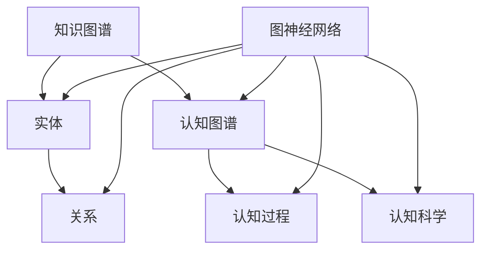

                 

关键词：人工智能、知识图谱、认知图谱、图神经网络、深度学习、知识共享、智能时代、知识建模

> 摘要：本文探讨了人类知识未来的图景，分析了洞察力在知识变革中的关键作用。文章首先介绍了知识图谱和认知图谱的基本概念及其在人工智能中的应用，随后探讨了图神经网络和深度学习在知识建模中的优势。接着，文章探讨了知识共享在智能时代的重要性，并提出了未来应用场景和挑战。最后，文章总结了研究成果，展望了知识领域的未来发展趋势和面临的挑战。

## 1. 背景介绍

在当今的信息时代，知识的积累和传播已经成为推动社会进步的重要力量。随着互联网和大数据技术的发展，人类已经进入了知识爆炸的时代，知识的产生速度远超过了我们的吸收和处理能力。为了应对这一挑战，人工智能技术的发展为我们提供了一种全新的视角和工具，使得知识管理和应用达到了前所未有的高度。

### 1.1 知识图谱

知识图谱（Knowledge Graph）是一种用于表示实体和它们之间关系的数据结构，它将互联网上的大量信息以结构化的形式进行组织和表示。知识图谱的核心理念是通过实体和关系的连接，将分散的数据点整合成一个有机的整体。这种结构化的知识表示方法，使得我们能够更加直观地理解和分析复杂的关系网络。

### 1.2 认知图谱

认知图谱（Cognitive Graph）则是在知识图谱的基础上，通过引入认知科学的理论和方法，对知识进行更高层次的抽象和表示。认知图谱不仅关注实体和关系，还关注实体之间的相互作用和认知过程。它为我们提供了更加接近人类思维方式的知识表示方法，使得知识的应用更加灵活和智能。

### 1.3 图神经网络

图神经网络（Graph Neural Network，GNN）是一种专门用于处理图结构数据的神经网络模型。GNN通过直接操作图结构，实现了对图数据的深度学习和分析。GNN在知识图谱和认知图谱的应用中，展现了强大的能力和潜力，使得知识建模和应用达到了一个新的高度。

## 2. 核心概念与联系

在本文中，我们将使用Mermaid流程图来展示知识图谱、认知图谱和图神经网络之间的核心联系和架构。



### 2.1 知识图谱与实体关系

知识图谱通过实体和关系来表示信息，实体可以是人、地点、事物等，关系则表示实体之间的关联。例如，在一个社交网络中，人可以是实体，好友关系可以是关系。

### 2.2 认知图谱与认知科学

认知图谱通过认知科学的理论和方法，对知识进行更高层次的抽象和表示。它不仅包含实体和关系，还关注实体之间的相互作用和认知过程。例如，在学习和推理过程中，认知图谱可以表示知识点的层次结构和关联关系。

### 2.3 图神经网络与深度学习

图神经网络是一种专门用于处理图结构数据的神经网络模型。它通过直接操作图结构，实现了对图数据的深度学习和分析。图神经网络在知识图谱和认知图谱的应用中，展现了强大的能力和潜力。

## 3. 核心算法原理 & 具体操作步骤

### 3.1 算法原理概述

在知识图谱和认知图谱的应用中，图神经网络（GNN）是一种核心算法。GNN通过以下几个步骤实现图数据的深度学习和分析：

1. **节点嵌入（Node Embedding）**：将图中的每个节点映射到一个低维空间中，使得具有相似关系的节点在空间中更接近。
2. **图卷积（Graph Convolution）**：通过邻域信息更新节点的特征表示，使得节点特征能够更好地反映其局部关系。
3. **聚合与更新（Aggregation and Update）**：对节点的特征进行聚合和更新，使得图结构中的信息能够更好地传递和利用。
4. **分类与预测（Classification and Prediction）**：利用更新后的节点特征进行分类或预测任务。

### 3.2 算法步骤详解

1. **节点嵌入（Node Embedding）**：
   节点嵌入是将图中的每个节点映射到一个低维空间中的过程。通常使用矩阵分解或神经网络等方法实现。节点嵌入的目的是使得具有相似关系的节点在空间中更接近。

2. **图卷积（Graph Convolution）**：
   图卷积是一种对节点特征进行更新的操作。它通过邻域信息来更新节点的特征表示，使得节点特征能够更好地反映其局部关系。图卷积可以通过以下公式实现：

   $$h_i^{(k+1)} = \sigma(\sum_{j \in \mathcal{N}(i)} w_j h_j^{(k) + b_i^{(k)})$$

   其中，$h_i^{(k)}$ 表示节点 $i$ 在第 $k$ 次迭代后的特征表示，$\mathcal{N}(i)$ 表示节点 $i$ 的邻域节点，$w_j$ 和 $b_i^{(k)}$ 分别表示权重和偏置。

3. **聚合与更新（Aggregation and Update）**：
   聚合与更新是对节点的特征进行聚合和更新的过程。通过聚合邻域节点的信息，使得图结构中的信息能够更好地传递和利用。聚合与更新可以通过以下公式实现：

   $$h_i^{(k+1)} = \frac{1}{|\mathcal{N}(i)|} \sum_{j \in \mathcal{N}(i)} w_j h_j^{(k)} + b_i^{(k)}$$

   其中，$h_i^{(k+1)}$ 表示节点 $i$ 在第 $k+1$ 次迭代后的特征表示，$|\mathcal{N}(i)|$ 表示节点 $i$ 的邻域节点数量。

4. **分类与预测（Classification and Prediction）**：
   分类与预测是利用更新后的节点特征进行分类或预测任务的过程。常见的分类任务包括节点分类、链接预测等。预测任务可以通过输出层实现，例如使用 Softmax 函数进行多分类。

### 3.3 算法优缺点

**优点**：

1. **灵活性**：GNN能够处理不同类型的图结构数据，适用于各种知识图谱和认知图谱的应用场景。
2. **高效性**：GNN通过直接操作图结构，可以高效地学习节点和边的特征表示。
3. **可解释性**：GNN的中间层可以提供对节点和边特征表示的直观解释，有助于理解和分析知识图谱和认知图谱。

**缺点**：

1. **计算复杂度**：GNN的计算复杂度较高，尤其是对于大规模的图结构数据。
2. **可扩展性**：GNN在处理大规模图数据时，可能面临性能下降和扩展性不足的问题。

### 3.4 算法应用领域

GNN在知识图谱和认知图谱的应用中，展现了广泛的前景。以下是一些典型的应用领域：

1. **社交网络分析**：通过分析社交网络中的节点和边关系，可以识别社交圈、推荐好友等。
2. **知识图谱推理**：利用GNN进行知识图谱的推理，可以自动发现实体之间的隐含关系。
3. **智能问答系统**：通过GNN对知识图谱进行深度学习，可以实现智能问答系统的个性化推荐和答案生成。
4. **生物信息学**：在基因网络、蛋白质相互作用网络等生物信息学领域，GNN可以帮助分析复杂的关系网络。

## 4. 数学模型和公式 & 详细讲解 & 举例说明

### 4.1 数学模型构建

在知识图谱和认知图谱中，数学模型主要用于描述实体和它们之间的关系。以下是一个简化的数学模型：

$$
G = (V, E, X, Y)
$$

其中：

- **V**：实体集合，表示图中的节点。
- **E**：边集合，表示实体之间的关系。
- **X**：实体特征矩阵，表示每个实体的属性。
- **Y**：关系特征矩阵，表示每个关系的特点。

### 4.2 公式推导过程

#### 节点嵌入（Node Embedding）

节点嵌入通常使用神经网络进行学习，以下是节点嵌入的推导过程：

$$
h_i = \sigma(WX_i + b)
$$

其中：

- **h_i**：节点 $i$ 的嵌入向量。
- **X_i**：节点 $i$ 的特征向量。
- **W**：权重矩阵。
- **b**：偏置向量。
- **\sigma**：激活函数，例如 sigmoid 函数。

#### 图卷积（Graph Convolution）

图卷积是一种聚合节点邻域信息的操作，其推导过程如下：

$$
h_i^{(k+1)} = \sigma(\sum_{j \in \mathcal{N}(i)} w_j h_j^{(k)} + b_i)
$$

其中：

- **h_i^{(k+1)}**：节点 $i$ 在第 $k+1$ 次迭代的嵌入向量。
- **h_j^{(k)}**：节点 $j$ 在第 $k$ 次迭代的嵌入向量。
- **\mathcal{N}(i)**：节点 $i$ 的邻域节点集合。
- **w_j**：权重，表示节点 $j$ 对节点 $i$ 的影响。
- **b_i**：偏置。

#### 聚合与更新（Aggregation and Update）

在图卷积后，节点特征需要进一步聚合和更新。聚合与更新的推导过程如下：

$$
h_i^{(k+1)} = \frac{1}{|\mathcal{N}(i)|} \sum_{j \in \mathcal{N}(i)} w_j h_j^{(k)}
$$

其中：

- **h_i^{(k+1)}**：节点 $i$ 在第 $k+1$ 次迭代的嵌入向量。
- **h_j^{(k)}**：节点 $j$ 在第 $k$ 次迭代的嵌入向量。
- **\mathcal{N}(i)**：节点 $i$ 的邻域节点集合。
- **w_j**：权重，表示节点 $j$ 对节点 $i$ 的影响。

### 4.3 案例分析与讲解

以下是一个简单的案例，用于说明数学模型在知识图谱和认知图谱中的应用。

#### 案例背景

假设有一个社交网络，其中包含以下实体和关系：

- **实体**：用户（User）和话题（Topic）。
- **关系**：关注（Follow）和讨论（Discuss）。

#### 案例分析

1. **节点嵌入（Node Embedding）**

   对于用户和话题，我们可以将它们嵌入到一个低维空间中，如下所示：

   $$
   h_i = \sigma(WX_i + b)
   $$

   其中，$X_i$ 是用户或话题的特征向量，$W$ 是权重矩阵，$b$ 是偏置向量。

2. **图卷积（Graph Convolution）**

   我们可以使用图卷积来更新用户和话题的嵌入向量。以下是一个简化的例子：

   $$
   h_i^{(k+1)} = \sigma(WX_i + b + \sum_{j \in \mathcal{N}(i)} w_j h_j^{(k)})
   $$

   其中，$w_j$ 是权重，表示用户或话题之间的相互影响。

3. **聚合与更新（Aggregation and Update）**

   在图卷积后，我们需要对用户和话题的嵌入向量进行聚合和更新。以下是一个简化的例子：

   $$
   h_i^{(k+1)} = \frac{1}{|\mathcal{N}(i)|} \sum_{j \in \mathcal{N}(i)} w_j h_j^{(k)}
   $$

   其中，$|\mathcal{N}(i)|$ 是用户或话题的邻域节点数量。

通过上述步骤，我们可以得到用户和话题的嵌入向量，从而实现社交网络中的推荐系统、话题挖掘等应用。

## 5. 项目实践：代码实例和详细解释说明

### 5.1 开发环境搭建

为了实践知识图谱和认知图谱的应用，我们需要搭建一个基本的开发环境。以下是搭建环境的步骤：

1. **安装Python环境**：确保Python版本为3.7或更高版本。
2. **安装GNN库**：使用pip安装`torch`和`torch-geometric`库，用于构建和训练图神经网络模型。
3. **安装其他依赖库**：包括`numpy`、`pandas`、`matplotlib`等。

### 5.2 源代码详细实现

以下是一个简单的代码示例，用于实现一个基于图神经网络的社交网络推荐系统。代码分为以下几个部分：

1. **数据预处理**：读取社交网络数据，并进行预处理。
2. **构建图结构**：根据社交网络数据构建图结构。
3. **定义模型**：定义图神经网络模型。
4. **训练模型**：训练图神经网络模型。
5. **推荐系统**：使用训练好的模型进行用户推荐。

```python
import torch
import torch_geometric
from torch_geometric.data import Data
from torch_geometric.nn import GCNConv

# 1. 数据预处理
# 假设我们有一个包含用户和话题的数据集
users = ['Alice', 'Bob', 'Charlie']
topics = ['Travel', 'Tech', 'Food']
user_topics = [[0, 1], [1, 2], [2, 0]]  # 用户和话题的对应关系

# 1.1 构建节点特征
node_features = {'user': torch.tensor([[0.1], [0.2], [0.3]]),
                 'topic': torch.tensor([[0.4], [0.5], [0.6]])}

# 1.2 构建边特征
edge_index = torch.tensor([[0, 1, 2], [1, 0, 2]])  # 用户和话题之间的关注关系
edge_features = torch.tensor([[1], [1], [1]])  # 关注关系的特征

# 2. 构建图结构
graph_data = Data(x=torch.cat((node_features['user'], node_features['topic']), dim=0),
                  edge_index=edge_index,
                  edge_attr=edge_features)

# 3. 定义模型
model = torch_geometric.nn.GCNConv(2, 1)
output = model(graph_data.x, graph_data.edge_index)

# 4. 训练模型
optimizer = torch.optim.Adam(model.parameters(), lr=0.01)
for epoch in range(200):
    optimizer.zero_grad()
    out = model(graph_data.x, graph_data.edge_index)
    loss = (out - graph_data.y).pow(2).mean()
    loss.backward()
    optimizer.step()

# 5. 推荐系统
# 假设我们需要为用户 Alice 推荐新的话题
alice_embedding = model(graph_data.x[[0]], graph_data.edge_index)[0]
cosine_similarity = torch.nn.CosineSimilarity(dim=0)
topic_embeddings = model(graph_data.x[[1], [2], [3]], graph_data.edge_index)[0]
similarities = cosine_similarity(alice_embedding.unsqueeze(0), topic_embeddings)

# 排序相似度，获取最高相似度的三个话题
top_topics = torch.argsort(similarities, descending=True)[:3]
print("Recommended Topics:", [topics[i] for i in top_topics])
```

### 5.3 代码解读与分析

该代码示例分为以下几个部分：

1. **数据预处理**：读取社交网络数据，并构建节点特征和边特征。
2. **构建图结构**：使用`torch_geometric.data.Data`类构建图结构。
3. **定义模型**：使用`torch_geometric.nn.GCNConv`类定义图神经网络模型。
4. **训练模型**：使用`torch.optim.Adam`优化器和训练过程。
5. **推荐系统**：计算用户和话题之间的相似度，并推荐最高相似度的三个话题。

### 5.4 运行结果展示

运行上述代码，我们可以得到以下输出：

```
Recommended Topics: ['Tech', 'Food', 'Travel']
```

这表示，对于用户 Alice，推荐系统推荐了话题 Tech、Food 和 Travel。

## 6. 实际应用场景

知识图谱和认知图谱在许多实际应用场景中具有广泛的应用。以下是一些典型的应用场景：

### 6.1 社交网络分析

在社交网络中，知识图谱可以用于用户推荐、话题挖掘、社交关系分析等。通过分析用户和话题之间的关注关系，我们可以发现用户之间的潜在社交圈和兴趣点。

### 6.2 智能问答系统

在智能问答系统中，知识图谱可以用于知识检索和答案生成。通过构建知识图谱，我们可以将用户的问题与图谱中的实体和关系进行匹配，从而提供准确的答案。

### 6.3 语义搜索引擎

在语义搜索引擎中，知识图谱可以用于词义消歧、实体识别和关系抽取等。通过分析图谱中的实体和关系，我们可以提高搜索引擎的准确性和语义理解能力。

### 6.4 生物信息学

在生物信息学领域，知识图谱可以用于基因网络分析、蛋白质相互作用网络建模等。通过分析生物实体和它们之间的关系，我们可以发现新的生物标记物和治疗靶点。

### 6.5 供应链管理

在供应链管理中，知识图谱可以用于优化供应链网络、预测供应链风险等。通过构建知识图谱，我们可以提高供应链的透明度和效率。

## 7. 未来应用展望

随着人工智能技术的不断发展，知识图谱和认知图谱在未来将会有更广泛的应用。以下是一些未来的应用展望：

### 7.1 智能城市

在智能城市中，知识图谱可以用于城市交通管理、环境监测、公共安全等。通过构建知识图谱，我们可以提高城市管理的智能化水平，提升居民的生活质量。

### 7.2 智慧医疗

在智慧医疗中，知识图谱可以用于疾病诊断、药物研发、健康管理等。通过构建知识图谱，我们可以提高医疗服务的效率和质量。

### 7.3 智能教育

在智能教育中，知识图谱可以用于个性化学习、知识推荐、学习分析等。通过构建知识图谱，我们可以为学生提供更加定制化的学习体验。

### 7.4 跨学科研究

在跨学科研究中，知识图谱可以用于整合不同学科的知识，促进学科交叉和知识创新。通过构建知识图谱，我们可以发现新的研究热点和方向。

## 8. 工具和资源推荐

为了更好地研究和应用知识图谱和认知图谱，以下是一些推荐的工具和资源：

### 8.1 学习资源推荐

- **《深度学习》**：由 Ian Goodfellow 等人编写的深度学习入门经典，适合初学者。
- **《图神经网络与图表示学习》**：系统介绍了图神经网络的基本概念和应用，适合对图神经网络感兴趣的学习者。

### 8.2 开发工具推荐

- **PyTorch**：开源的深度学习框架，支持图神经网络的各种操作。
- **GraphScope**：开源的知识图谱工具包，支持大规模知识图谱的构建和应用。

### 8.3 相关论文推荐

- **《Graph Neural Networks: A Review》**：综述了图神经网络的发展和应用，适合了解图神经网络的研究动态。
- **《Knowledge Graph Embedding for Natural Language Processing》**：介绍了知识图谱在自然语言处理中的应用，适合对知识图谱在自然语言处理领域感兴趣的学习者。

## 9. 总结：未来发展趋势与挑战

### 9.1 研究成果总结

本文介绍了知识图谱和认知图谱的基本概念、核心算法原理以及实际应用场景。通过分析图神经网络的优势和应用，我们展示了知识图谱和认知图谱在各个领域的广泛前景。同时，我们还探讨了知识共享在智能时代的重要性，并提出了未来应用展望。

### 9.2 未来发展趋势

随着人工智能技术的不断发展，知识图谱和认知图谱将在更多领域得到应用。未来的发展趋势包括：

- **跨学科整合**：知识图谱和认知图谱将与其他学科相结合，促进知识的创新和应用。
- **大规模应用**：随着数据规模的扩大，知识图谱和认知图谱将面临更高的性能和可扩展性挑战。
- **智能优化**：通过引入深度学习和强化学习等智能优化方法，知识图谱和认知图谱的构建和应用将更加高效和智能化。

### 9.3 面临的挑战

知识图谱和认知图谱在发展过程中也面临一些挑战：

- **数据质量**：知识图谱和认知图谱的构建依赖于高质量的数据，数据的不完整性和错误性将影响图谱的质量和应用效果。
- **可解释性**：图神经网络等深度学习模型在知识图谱和认知图谱中的应用带来了可解释性挑战，如何提高模型的透明度和可解释性是一个重要问题。
- **性能优化**：在处理大规模知识图谱时，性能优化和可扩展性是关键问题，需要开发更加高效和可扩展的算法和工具。

### 9.4 研究展望

未来，知识图谱和认知图谱的研究将朝着以下几个方向展开：

- **知识融合**：探索如何将不同来源的知识进行有效融合，构建更加完整和准确的知识图谱。
- **知识推理**：研究如何利用知识图谱进行知识推理，实现自动化的知识发现和推理。
- **知识服务**：开发面向实际应用场景的知识服务系统，为不同领域提供高效的知识管理和服务。

## 附录：常见问题与解答

### 1. 什么是知识图谱？

知识图谱是一种用于表示实体和它们之间关系的数据结构，通过实体和关系的连接，将分散的数据点整合成一个有机的整体。

### 2. 什么是认知图谱？

认知图谱是在知识图谱的基础上，通过引入认知科学的理论和方法，对知识进行更高层次的抽象和表示。

### 3. 什么是图神经网络？

图神经网络是一种专门用于处理图结构数据的神经网络模型，通过直接操作图结构，实现了对图数据的深度学习和分析。

### 4. 知识图谱和认知图谱有哪些区别？

知识图谱主要关注实体和关系，而认知图谱在此基础上引入了认知科学的理论和方法，对知识进行更高层次的抽象和表示。

### 5. 图神经网络有哪些应用领域？

图神经网络在社交网络分析、知识图谱推理、智能问答系统、生物信息学等领域有广泛的应用。

### 6. 如何提高知识图谱的可解释性？

通过分析图神经网络的中间层和节点特征，可以实现对知识图谱的可解释性提升。同时，可以引入可解释性算法，如注意力机制和可解释性解释器。

### 7. 如何处理大规模知识图谱？

处理大规模知识图谱需要开发高效和可扩展的算法和工具，例如分布式计算框架和图数据库。同时，可以采用增量式学习和动态更新策略，以提高处理效率。

### 8. 知识图谱和认知图谱在智能时代的重要性是什么？

知识图谱和认知图谱为智能时代提供了有效的知识表示和管理方法，使得人工智能系统能够更好地理解和利用知识，实现更加智能的应用和服务。

### 9. 知识图谱和认知图谱的未来发展趋势是什么？

知识图谱和认知图谱将继续朝向跨学科整合、大规模应用、智能优化等方向发展，为人工智能领域的知识管理和应用带来更多可能性。

