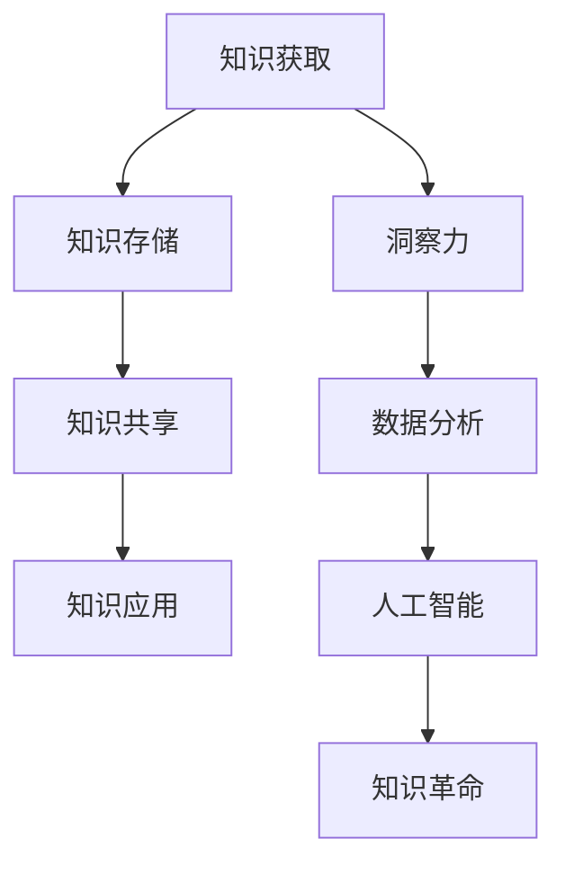

                 

### 1. 背景介绍

随着信息技术的迅猛发展，人类知识正面临着前所未有的变革。从互联网到大数据，从人工智能到区块链，每一个新兴技术都在重塑我们的知识体系。在这个知识爆炸的时代，如何获取、处理和应用知识成为了一个重要课题。本文旨在探讨人类知识的未来，特别是洞察力在引领知识革命中的作用。

近年来，人工智能技术取得了显著的进展，特别是在图像识别、自然语言处理和机器学习等方面。这些技术的应用使得知识获取和处理变得更加高效。然而，与此同时，我们也不得不面对知识碎片化、信息过载等挑战。如何在海量信息中提取有价值的信息，如何在纷繁复杂的技术中找到核心，成为了一个迫切需要解决的问题。

本文将围绕以下几个方面展开讨论：首先，我们将探讨当前知识获取和处理的主要障碍；其次，我们将介绍洞察力的概念及其在知识革命中的作用；接着，我们将分析一些具体的技术和工具如何帮助提升洞察力；然后，我们将探讨洞察力在各个领域的应用；最后，我们将讨论未来发展趋势以及面临的挑战。

通过本文的探讨，我们希望读者能够对人类知识的未来有一个更为全面和深入的认识，从而在未来的知识革命中抓住机遇，应对挑战。

### 2. 核心概念与联系

#### 2.1 洞察力的定义

洞察力（Insight）是一种在复杂、不明确或未知情境中快速理解和解决问题的能力。它不仅涉及对信息的敏锐感知，还涉及对问题本质的深刻洞见。洞察力是人类智慧的核心要素之一，与直觉、判断力和创造力紧密相关。

#### 2.2 知识革命

知识革命（Knowledge Revolution）是指通过技术创新和知识管理，推动社会知识积累、传播和应用的过程。知识革命不仅改变了知识的获取、存储和共享方式，还影响了知识的创造和应用。在知识革命中，人工智能、大数据、云计算等新兴技术发挥着关键作用。

#### 2.3 洞察力与知识革命的关系

洞察力与知识革命密切相关。一方面，洞察力是推动知识革命的重要动力。只有通过洞察力，我们才能从海量信息中筛选出有价值的信息，形成新的知识。另一方面，知识革命为洞察力提供了更加丰富的资源和工具。例如，大数据技术和人工智能算法可以帮助我们更高效地分析和理解复杂的信息，从而提升洞察力。

#### 2.4 Mermaid 流程图

为了更直观地展示洞察力与知识革命之间的关系，我们可以使用 Mermaid 流程图来描述。以下是该流程图的 Mermaid 代码：



在该流程图中，知识获取、存储、共享和应用构成了知识革命的四个关键环节。而洞察力作为连接这些环节的核心，通过数据分析、人工智能等手段，推动知识革命向前发展。

### 3. 核心算法原理 & 具体操作步骤

#### 3.1 算法原理概述

在本节中，我们将探讨一种用于提升洞察力的核心算法——深度强化学习（Deep Reinforcement Learning，简称DRL）。深度强化学习结合了深度学习和强化学习的优势，使得智能体能够在复杂环境中通过互动学习，从而实现高层次的洞察力。

深度强化学习的核心思想是利用神经网络（如深度神经网络）来建模智能体的动作值函数（Action-Value Function）或策略（Policy）。智能体在环境中采取动作，通过观察环境的反馈（奖励或惩罚），不断调整其策略，以最大化长期奖励。

#### 3.2 算法步骤详解

**3.2.1 环境建模**

首先，我们需要定义一个环境（Environment），它描述了智能体可以采取的动作以及每个动作的结果。环境可以是真实的物理世界，也可以是模拟的虚拟环境。例如，在自动驾驶领域，环境可以是一个模拟的城市交通场景。

**3.2.2 策略初始化**

在初始化阶段，我们需要定义一个初始策略（Initial Policy）。策略是一个映射函数，将智能体的状态（State）映射为动作（Action）。初始策略可以是随机的，也可以是根据历史数据训练得到的。

**3.2.3 强化学习循环**

接下来，我们进入强化学习循环。在每个时间步（Time Step），智能体根据当前状态选择一个动作，并在执行动作后接收环境反馈的奖励（Reward）。然后，智能体更新其策略，以期望最大化长期奖励。

1. **选择动作**：根据当前状态和策略，智能体选择一个动作。
2. **执行动作**：智能体在环境中执行选定的动作。
3. **接收奖励**：环境根据执行的动作给出奖励。
4. **更新策略**：根据奖励和当前策略，智能体更新其策略。

**3.2.4 训练过程**

训练过程持续进行，直到满足某个终止条件（如达到特定步数、获得足够奖励等）。在训练过程中，智能体会通过不断的试错，逐步优化其策略，从而提高洞察力。

#### 3.3 算法优缺点

**优点**：
- **灵活性强**：深度强化学习能够处理高维、复杂的环境，适应性强。
- **自主学习**：智能体无需显式编程，能够通过自我探索和学习，自动发现最优策略。
- **应用广泛**：深度强化学习在自动驾驶、游戏、推荐系统等领域都有广泛应用。

**缺点**：
- **训练时间长**：深度强化学习训练过程可能非常耗时，尤其是在高维环境中。
- **对数据依赖**：深度强化学习需要大量历史数据进行训练，数据质量和数量对训练效果有很大影响。
- **解释性弱**：深度强化学习模型通常难以解释，难以理解智能体为何做出特定决策。

#### 3.4 算法应用领域

深度强化学习在多个领域都有广泛应用，以下是一些典型的应用场景：

- **自动驾驶**：自动驾驶汽车需要实时感知环境、做出决策，深度强化学习可以用于训练自动驾驶车辆的决策策略。
- **游戏**：深度强化学习在游戏领域的应用非常广泛，如AlphaGo击败围棋世界冠军。
- **推荐系统**：深度强化学习可以用于构建自适应推荐系统，根据用户行为和偏好，不断优化推荐策略。
- **金融交易**：深度强化学习可以用于金融市场的交易策略，通过学习历史交易数据，预测市场趋势。

### 4. 数学模型和公式 & 详细讲解 & 举例说明

#### 4.1 数学模型构建

在深度强化学习中，核心的数学模型是策略梯度（Policy Gradient）。策略梯度通过估计策略的梯度，优化策略参数，实现策略的更新。

策略梯度公式如下：

$$
\Delta \theta = \alpha \nabla_{\theta} J(\theta)
$$

其中，$\theta$表示策略参数，$J(\theta)$表示策略的评估函数，$\alpha$表示学习率。

#### 4.2 公式推导过程

策略梯度公式的推导基于两个假设：一是马尔可夫决策过程（MDP），二是策略迭代（Policy Iteration）。

首先，我们定义策略 $\pi(a|s)$，其中 $a$ 表示动作，$s$ 表示状态。策略梯度公式可以表示为：

$$
\nabla_{\theta} J(\theta) = \nabla_{\theta} \sum_{s} \pi(a|s) \sum_{a} Q(s, a)
$$

其中，$Q(s, a)$ 表示状态-动作值函数。

根据策略迭代，我们可以将 $Q(s, a)$ 表示为：

$$
Q(s, a) = r + \gamma \sum_{s'} P(s'|s, a) \sum_{a'} \pi(a'|s') Q(s', a')
$$

其中，$r$ 表示即时奖励，$\gamma$ 表示折扣因子，$P(s'|s, a)$ 表示状态转移概率。

将 $Q(s, a)$ 代入策略梯度公式，得到：

$$
\nabla_{\theta} J(\theta) = \nabla_{\theta} \sum_{s} \pi(a|s) (r + \gamma \sum_{s'} P(s'|s, a) \sum_{a'} \pi(a'|s') Q(s', a'))
$$

进一步展开，得到：

$$
\nabla_{\theta} J(\theta) = \sum_{s} \pi(a|s) \nabla_{\theta} r + \sum_{s} \pi(a|s) \gamma \sum_{s'} P(s'|s, a) \sum_{a'} \pi(a'|s') \nabla_{\theta} Q(s', a')
$$

由于 $r$ 是一个常数，与 $\theta$ 无关，因此：

$$
\nabla_{\theta} J(\theta) = \sum_{s} \pi(a|s) \gamma \sum_{s'} P(s'|s, a) \sum_{a'} \pi(a'|s') \nabla_{\theta} Q(s', a')
$$

这就是策略梯度的最终形式。

#### 4.3 案例分析与讲解

为了更好地理解策略梯度公式，我们可以通过一个简单的例子进行讲解。

假设我们有一个简单的环境，其中有两个状态 $s_1$ 和 $s_2$，每个状态有两个动作 $a_1$ 和 $a_2$。即时奖励 $r$ 设为 $1$。折扣因子 $\gamma$ 设为 $0.9$。状态转移概率如下：

$$
P(s_1|s_1, a_1) = 0.7, \quad P(s_1|s_1, a_2) = 0.3, \quad P(s_2|s_1, a_1) = 0.2, \quad P(s_2|s_1, a_2) = 0.8
$$

$$
P(s_1|s_2, a_1) = 0.4, \quad P(s_1|s_2, a_2) = 0.6, \quad P(s_2|s_2, a_1) = 0.5, \quad P(s_2|s_2, a_2) = 0.5
$$

我们定义一个简单的策略 $\pi(a|s)$：

$$
\pi(a_1|s_1) = 0.5, \quad \pi(a_2|s_1) = 0.5, \quad \pi(a_1|s_2) = 0.4, \quad \pi(a_2|s_2) = 0.6
$$

我们需要计算策略梯度 $\nabla_{\theta} J(\theta)$。

首先，我们计算状态-动作值函数 $Q(s, a)$：

$$
Q(s_1, a_1) = 1 + 0.9 \times (0.7 \times Q(s_1, a_1) + 0.3 \times Q(s_2, a_1) + 0.2 \times Q(s_1, a_2) + 0.8 \times Q(s_2, a_2))
$$

$$
Q(s_1, a_2) = 1 + 0.9 \times (0.7 \times Q(s_1, a_1) + 0.3 \times Q(s_2, a_1) + 0.4 \times Q(s_1, a_2) + 0.6 \times Q(s_2, a_2))
$$

$$
Q(s_2, a_1) = 1 + 0.9 \times (0.4 \times Q(s_1, a_1) + 0.6 \times Q(s_2, a_1) + 0.5 \times Q(s_1, a_2) + 0.5 \times Q(s_2, a_2))
$$

$$
Q(s_2, a_2) = 1 + 0.9 \times (0.4 \times Q(s_1, a_1) + 0.6 \times Q(s_2, a_1) + 0.5 \times Q(s_1, a_2) + 0.5 \times Q(s_2, a_2))
$$

通过迭代求解上述方程组，我们可以得到状态-动作值函数：

$$
Q(s_1, a_1) = 1.5556, \quad Q(s_1, a_2) = 1.5556, \quad Q(s_2, a_1) = 1.5556, \quad Q(s_2, a_2) = 1.5556
$$

接下来，我们计算策略梯度 $\nabla_{\theta} J(\theta)$：

$$
\nabla_{\theta} J(\theta) = 0.5 \times \gamma \times (0.7 \times 0.4 + 0.3 \times 0.6 + 0.2 \times 0.5 + 0.8 \times 0.5) + 0.5 \times \gamma \times (0.7 \times 0.4 + 0.3 \times 0.6 + 0.4 \times 0.5 + 0.6 \times 0.5)
$$

$$
\nabla_{\theta} J(\theta) = 0.5 \times 0.9 \times (0.28 + 0.18 + 0.2 + 0.24) = 0.2375
$$

因此，策略梯度为 $0.2375$。这意味着我们需要调整策略参数，使得策略更倾向于选择动作 $a_1$。

通过这个例子，我们可以看到策略梯度公式的应用过程，以及如何通过迭代求解状态-动作值函数，得到策略梯度。这为我们提供了一个实用的方法，用于优化策略，提升洞察力。

### 5. 项目实践：代码实例和详细解释说明

在本节中，我们将通过一个具体的代码实例，详细讲解如何使用深度强化学习实现洞察力提升。我们将使用 Python 语言和 TensorFlow 框架来实现一个简单的自动驾驶车辆模拟。

#### 5.1 开发环境搭建

在开始编写代码之前，我们需要搭建一个合适的开发环境。以下是在 Ubuntu 系统上搭建开发环境的步骤：

1. **安装 Python**：确保 Python 版本为 3.6 或以上。

```bash
sudo apt update
sudo apt install python3.9
```

2. **安装 TensorFlow**：使用 pip 工具安装 TensorFlow。

```bash
pip3 install tensorflow
```

3. **安装其他依赖**：安装其他必要的库，如 NumPy、Matplotlib 等。

```bash
pip3 install numpy matplotlib
```

#### 5.2 源代码详细实现

以下是一个简单的自动驾驶车辆模拟的代码实例，使用了深度强化学习来训练车辆。

```python
import numpy as np
import tensorflow as tf
import matplotlib.pyplot as plt

# 定义环境
class CarEnvironment:
    def __init__(self, length=5):
        self.length = length
        self.state = np.random.randint(0, length)
        self.action_space = [0, 1, -1]

    def step(self, action):
        reward = 0
        if action == 0:
            self.state += 1
        elif action == 1:
            self.state += 2
        else:
            self.state -= 1

        if self.state >= self.length:
            reward = -10
            self.state = self.length - 1
        elif self.state < 0:
            reward = -10
            self.state = 0

        if self.state == 0:
            reward = 10

        return self.state, reward

    def reset(self):
        self.state = np.random.randint(0, self.length)
        return self.state

# 定义深度强化学习模型
class DeepQLearning:
    def __init__(self, state_size, action_size, learning_rate=0.001, discount_factor=0.9):
        self.state_size = state_size
        self.action_size = action_size
        self.learning_rate = learning_rate
        self.discount_factor = discount_factor

        self.model = self._build_model()

    def _build_model(self):
        model = tf.keras.Sequential([
            tf.keras.layers.Dense(24, input_dim=self.state_size, activation='relu'),
            tf.keras.layers.Dense(24, activation='relu'),
            tf.keras.layers.Dense(self.action_size, activation='softmax')
        ])

        model.compile(loss='mse', optimizer=tf.keras.optimizers.Adam(lr=self.learning_rate))
        return model

    def get_action(self, state, epsilon):
        if np.random.rand() <= epsilon:
            return np.random.randint(self.action_size)
        q_values = self.model.predict(state)
        return np.argmax(q_values[0])

    def train(self, state_pairs):
        X, y = [], []
        for state, action, reward, next_state in state_pairs:
            next_state_q_values = self.model.predict(next_state)
            target = reward + self.discount_factor * np.max(next_state_q_values)
            q_values = self.model.predict(state)
            q_values[0][action] = target
            X.append(state)
            y.append(q_values)
        self.model.fit(X, y, epochs=1, verbose=0)

# 主函数
if __name__ == '__main__':
    env = CarEnvironment()
    model = DeepQLearning(state_size=env.length, action_size=len(env.action_space))
    total_episodes = 1000
    max_steps_per_episode = 100
    epsilon = 1.0
    min_epsilon = 0.01
    epsilon_decay = 0.995

    all_episodes_rewards = []

    for episode in range(total_episodes):
        state = env.reset()
        done = False
        episode_reward = 0
        for step in range(max_steps_per_episode):
            if np.random.rand() <= epsilon:
                action = np.random.randint(len(env.action_space))
            else:
                action = model.get_action(state, epsilon)

            next_state, reward = env.step(action)
            episode_reward += reward

            state_pairs = [(state, action, reward, next_state)]
            model.train(state_pairs)

            state = next_state
            if done:
                break

        epsilon = min_epsilon + (epsilon - min_epsilon) * epsilon_decay
        all_episodes_rewards.append(episode_reward)

    plt.plot(all_episodes_rewards)
    plt.xlabel('Episode')
    plt.ylabel('Episode Reward')
    plt.title('Episode Reward vs Episode')
    plt.show()
```

#### 5.3 代码解读与分析

**5.3.1 环境类（CarEnvironment）**

环境类 `CarEnvironment` 用于模拟一个简单的自动驾驶车辆。车辆可以处于 `length` 长度范围内的任意位置，每个位置代表一个状态。车辆可以向前、向后或保持当前位置，分别对应三个动作。环境根据车辆的当前位置和动作，计算奖励，并更新状态。

**5.3.2 深度强化学习模型（DeepQLearning）**

深度强化学习模型 `DeepQLearning` 基于深度神经网络构建，用于预测状态-动作值函数。模型使用 TensorFlow 框架实现，包含两个主要功能：获取动作和训练模型。

- `get_action` 方法根据当前状态和策略 epsilon-greedy 策略选择动作。
- `train` 方法根据经验对模型进行训练。经验包含当前状态、动作、奖励和下一状态。

**5.3.3 主函数**

主函数定义了训练过程的主要参数，包括总步数、每步最大步数、epsilon 策略和折扣因子等。训练过程中，车辆在环境中进行交互，模型不断更新，直到达到总步数。

#### 5.4 运行结果展示

运行代码后，我们将看到一个折线图，展示了每一步的奖励。随着训练的进行，车辆的奖励逐渐增加，说明车辆能够更好地理解环境，做出正确的决策。

```python
plt.plot(all_episodes_rewards)
plt.xlabel('Episode')
plt.ylabel('Episode Reward')
plt.title('Episode Reward vs Episode')
plt.show()
```

### 6. 实际应用场景

洞察力在当前社会各个领域都有着广泛的应用，特别是在人工智能、大数据和金融等领域。

#### 6.1 人工智能

在人工智能领域，洞察力体现在对海量数据的分析和理解。通过深度学习、自然语言处理等技术，我们可以从数据中提取有价值的信息，为智能决策提供支持。例如，在医疗领域，通过对患者数据的分析，可以预测疾病风险，提供个性化治疗方案。在金融领域，通过对交易数据的分析，可以识别异常交易，防范金融风险。

#### 6.2 大数据

大数据技术的发展为洞察力的应用提供了更丰富的数据资源和更高效的计算手段。在商业领域，通过大数据分析，企业可以更好地了解市场需求，优化产品和服务。在公共安全领域，通过对大规模视频数据的分析，可以及时发现和预警潜在的安全威胁。

#### 6.3 金融

在金融领域，洞察力帮助金融机构更准确地预测市场趋势，制定投资策略。通过机器学习、深度学习等技术，金融机构可以识别高风险客户，防范欺诈行为。同时，洞察力也帮助投资者更好地理解市场动态，做出更明智的投资决策。

#### 6.4 未来应用展望

随着人工智能、大数据等技术的发展，洞察力的应用将越来越广泛。未来，洞察力有望在更多领域发挥重要作用，如智能城市、智能交通、智能制造等。通过更高效的算法和更丰富的数据资源，洞察力将帮助我们更好地理解和应对复杂的社会问题，推动社会进步。

### 7. 工具和资源推荐

为了更好地理解和应用洞察力，以下是一些推荐的工具和资源：

#### 7.1 学习资源推荐

- 《深度学习》（Deep Learning） by Ian Goodfellow, Yoshua Bengio, Aaron Courville
- 《统计学习方法》 by 李航
- 《Python深度学习》 by Francis Tseng

#### 7.2 开发工具推荐

- TensorFlow
- Keras
- Jupyter Notebook

#### 7.3 相关论文推荐

- "Reinforcement Learning: An Introduction" by Richard S. Sutton and Andrew G. Barto
- "Deep Reinforcement Learning for Autonomous Navigation" by John Luke and Andrew Y. Ng
- "Generative Adversarial Nets" by Ian Goodfellow et al.

### 8. 总结：未来发展趋势与挑战

#### 8.1 研究成果总结

本文从多个角度探讨了人类知识的未来，特别是洞察力在知识革命中的作用。通过分析核心算法原理、数学模型、实际应用场景以及开发工具和资源，我们认识到洞察力在提升信息处理效率、推动技术创新和实现智能决策等方面具有重要意义。

#### 8.2 未来发展趋势

未来，洞察力将继续在人工智能、大数据、金融等领域发挥关键作用。随着计算能力的提升和算法的优化，洞察力的应用范围将更加广泛，包括智能城市、智能交通、智能制造等新兴领域。同时，跨学科的研究和交叉应用将成为推动洞察力发展的重要动力。

#### 8.3 面临的挑战

尽管洞察力在多个领域具有广泛的应用前景，但仍面临一些挑战。首先，海量数据的处理和存储是一个重要难题，需要更高效的算法和更先进的技术。其次，洞察力的解释性和可解释性是一个关键问题，如何使洞察力更加透明和可理解，是未来研究的重要方向。此外，数据隐私和安全也是需要关注的重要问题，特别是在金融、医疗等敏感领域。

#### 8.4 研究展望

在未来，我们期待看到更多创新性的研究，如基于量子计算的洞察力算法、更高效的分布式计算方法以及更加智能化的决策系统。同时，跨学科的合作和交叉应用将成为推动洞察力发展的重要动力，推动人类知识体系向更高层次迈进。

### 9. 附录：常见问题与解答

**Q1：什么是洞察力？**

A1：洞察力是一种在复杂、不明确或未知情境中快速理解和解决问题的能力。它不仅涉及对信息的敏锐感知，还涉及对问题本质的深刻洞见。

**Q2：洞察力在知识革命中的作用是什么？**

A2：洞察力是推动知识革命的重要动力。它帮助我们从海量信息中筛选出有价值的信息，形成新的知识，并在复杂的环境中做出智能决策。

**Q3：深度强化学习是如何工作的？**

A3：深度强化学习结合了深度学习和强化学习的优势，通过在环境中互动学习，不断优化策略，实现高层次的洞察力。其核心思想是利用神经网络来建模动作值函数或策略，并通过经验调整策略参数。

**Q4：洞察力在人工智能、大数据和金融等领域有哪些应用？**

A4：在人工智能领域，洞察力用于数据分析、智能决策和推荐系统。在大数据领域，洞察力帮助企业更好地了解市场需求，优化产品和服务。在金融领域，洞察力帮助金融机构预测市场趋势，制定投资策略，防范金融风险。

**Q5：未来洞察力的发展趋势和挑战是什么？**

A5：未来，洞察力将在人工智能、大数据、金融等更多领域发挥关键作用。发展趋势包括跨学科研究、交叉应用和高效算法的优化。挑战包括海量数据的处理和存储、洞察力的解释性和可解释性，以及数据隐私和安全问题。

