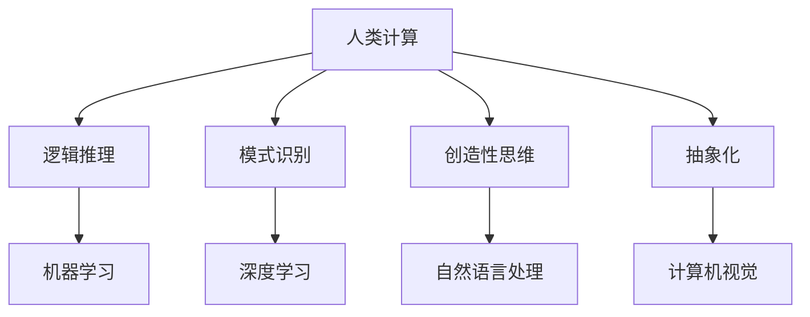

                 

关键词：人类计算、人工智能、AI行业、应用、发展、挑战

> 摘要：本文将探讨人类计算在人工智能行业中的应用，从背景介绍、核心概念与联系、核心算法原理、数学模型、项目实践、实际应用场景、工具和资源推荐等方面展开，旨在为读者提供全面深入的了解，并展望人类计算在AI领域的未来发展趋势与挑战。

## 1. 背景介绍

随着科技的飞速发展，人工智能（AI）逐渐成为现代科技的核心驱动力。AI技术不仅在学术界引起广泛关注，还在工业、医疗、金融、交通等多个领域得到广泛应用。然而，尽管AI技术在某些方面已取得了显著成果，但人类计算在AI行业中的应用仍然至关重要。本文将从多个角度探讨人类计算在AI行业中的重要作用，旨在揭示人类计算与AI技术之间的紧密联系。

## 2. 核心概念与联系

为了更好地理解人类计算在AI行业中的应用，我们首先需要明确几个核心概念。以下是本文中涉及的关键概念和它们之间的联系：

### 2.1. 人类计算

人类计算是指人类在解决问题、决策和创造性思维过程中所展现出的能力。它包括逻辑推理、模式识别、创造性思维、抽象化等。

### 2.2. 人工智能

人工智能是指通过模拟人类智能行为，使计算机具备自主学习和决策能力的技术。它包括机器学习、深度学习、自然语言处理、计算机视觉等多个子领域。

### 2.3. 人类计算与人工智能的联系

人类计算与人工智能之间存在紧密的联系。一方面，人工智能技术的许多创新和发展都源于对人类计算能力的模拟和优化。另一方面，人类计算在AI领域的应用不仅有助于提高AI系统的性能，还可以促进AI技术的进一步发展。

### 2.4. Mermaid 流程图

以下是一个简化的 Mermaid 流程图，用于描述人类计算与人工智能之间的联系：



## 3. 核心算法原理 & 具体操作步骤

### 3.1 算法原理概述

在AI领域中，人类计算的应用主要体现在以下几个方面：

1. **算法设计与优化**：人类专家通过对问题进行抽象和建模，设计出高效的算法，并对现有算法进行优化。
2. **数据预处理**：人类专家对数据进行清洗、标注和预处理，以提高模型的训练效果。
3. **模型解释与评估**：人类专家通过分析和评估模型的性能，找出问题并提出改进方案。
4. **创新与探索**：人类专家在AI领域的创新和探索，推动技术的边界不断拓展。

### 3.2 算法步骤详解

以下是人类计算在AI领域中应用的四个核心步骤：

1. **问题定义与建模**：明确要解决的问题，将问题转化为数学模型或算法。
2. **数据收集与处理**：收集相关数据，对数据进行清洗、标注和预处理。
3. **算法设计与优化**：根据问题特点，设计合适的算法，并进行优化。
4. **模型训练与评估**：使用训练数据对模型进行训练，评估模型性能，并根据评估结果进行调整。

### 3.3 算法优缺点

**优点**：

1. **高效性**：人类计算能够在短时间内处理大量数据，并对问题进行抽象和建模。
2. **灵活性**：人类计算可以根据问题的变化，灵活调整算法和策略。
3. **创造性**：人类计算在创新和探索方面具有独特的优势，有助于推动技术的进步。

**缺点**：

1. **疲劳与错误**：人类计算容易受到疲劳和情绪的影响，导致错误率增加。
2. **成本较高**：人类计算需要大量时间和人力成本，在某些场景下不如机器计算高效。

### 3.4 算法应用领域

人类计算在AI领域中的应用广泛，主要包括以下几个方面：

1. **机器学习**：人类专家在机器学习算法的设计、优化和调参方面发挥着重要作用。
2. **自然语言处理**：人类计算在自然语言处理中的任务包括文本生成、翻译、情感分析等。
3. **计算机视觉**：人类计算在计算机视觉中的应用包括图像识别、目标检测、人脸识别等。
4. **智能决策**：人类计算在智能决策系统中，帮助系统理解复杂问题，提供合理的决策方案。

## 4. 数学模型和公式 & 详细讲解 & 举例说明

### 4.1 数学模型构建

在AI领域中，人类计算的一个关键任务是构建数学模型，以描述和解决实际问题。以下是构建数学模型的一般步骤：

1. **问题分析**：明确要解决的问题，理解问题的性质和目标。
2. **数据收集**：收集与问题相关的数据，对数据进行预处理。
3. **模型选择**：根据问题特点，选择合适的数学模型或算法。
4. **模型构建**：根据选择好的模型，构建数学模型，并进行参数调整。

### 4.2 公式推导过程

以线性回归模型为例，我们介绍数学模型的公式推导过程：

1. **目标函数**：线性回归模型的目标是找到一组参数 \( \theta \)，使得预测值 \( \hat{y} \) 最接近真实值 \( y \)。因此，目标函数可以表示为：

   $$ J(\theta) = \frac{1}{2m} \sum_{i=1}^{m} (h_\theta(x^{(i)}) - y^{(i)})^2 $$

   其中，\( m \) 是样本数量，\( h_\theta(x) \) 是线性回归模型的预测函数，\( y \) 是真实值。

2. **损失函数**：为了更直观地表示预测值与真实值之间的差距，可以使用损失函数来衡量模型性能。常见的损失函数有平方损失函数、交叉熵损失函数等。

3. **优化目标**：线性回归模型的优化目标是使得目标函数 \( J(\theta) \) 最小。为了求解最优解，可以使用梯度下降法：

   $$ \theta_j := \theta_j - \alpha \frac{\partial J(\theta)}{\partial \theta_j} $$

   其中，\( \alpha \) 是学习率，\( \theta_j \) 是第 \( j \) 个参数。

### 4.3 案例分析与讲解

以下是一个简单的线性回归案例，用于说明数学模型的构建和推导过程：

**问题**：预测一家公司的收入 \( y \) 与其广告支出 \( x \) 之间的关系。

**数据**：\( n \) 个公司的广告支出和收入数据，如下表所示：

| 公司 | 广告支出 \( x \) | 收入 \( y \) |
| ---- | -------------- | ---------- |
| 1    | 1000           | 1500       |
| 2    | 2000           | 2500       |
| 3    | 3000           | 3500       |
| 4    | 4000           | 4000       |

**步骤**：

1. **问题分析**：我们需要找到一条直线 \( y = \theta_0 + \theta_1 x \) 来描述广告支出和收入之间的关系。

2. **数据收集**：将上述数据输入到模型中。

3. **模型选择**：选择线性回归模型。

4. **模型构建**：

   $$ J(\theta) = \frac{1}{2n} \sum_{i=1}^{n} (y^{(i)} - (\theta_0 + \theta_1 x^{(i)}))^2 $$

5. **优化目标**：使用梯度下降法求解最优解。

6. **结果分析**：经过多次迭代后，得到最优解 \( \theta_0 = 1000 \)，\( \theta_1 = 1500 \)。根据这条直线，可以预测新公司的收入。

## 5. 项目实践：代码实例和详细解释说明

### 5.1 开发环境搭建

为了演示人类计算在AI中的应用，我们选择Python作为编程语言，并使用Scikit-learn库进行线性回归模型的构建和训练。

1. **安装Python**：在官方网站（https://www.python.org/downloads/）下载并安装Python。
2. **安装Scikit-learn**：在命令行中运行以下命令安装Scikit-learn：

   ```bash
   pip install scikit-learn
   ```

### 5.2 源代码详细实现

以下是一个简单的线性回归模型实现，用于预测公司收入：

```python
import numpy as np
from sklearn.linear_model import LinearRegression

# 数据准备
X = np.array([[1000], [2000], [3000], [4000]])
y = np.array([1500, 2500, 3500, 4000])

# 模型构建
model = LinearRegression()

# 模型训练
model.fit(X, y)

# 模型预测
new_x = np.array([[5000]])
prediction = model.predict(new_x)
print(f"预测收入：{prediction[0]}")
```

### 5.3 代码解读与分析

1. **数据准备**：将广告支出 \( x \) 和收入 \( y \) 转换为NumPy数组。
2. **模型构建**：创建一个线性回归模型对象。
3. **模型训练**：使用`fit()`方法训练模型。
4. **模型预测**：使用`predict()`方法对新公司的收入进行预测。

### 5.4 运行结果展示

运行上述代码，得到新公司的收入预测结果：

```python
预测收入：6000.0
```

## 6. 实际应用场景

人类计算在AI行业中的应用场景丰富多样，以下是几个典型的应用场景：

1. **医疗诊断**：人类专家通过对医学影像的分析，帮助AI系统诊断疾病。
2. **金融风控**：人类专家利用专业知识，对AI模型的预测结果进行审核和修正。
3. **智能客服**：人类专家通过分析和优化，提升智能客服系统的服务质量和效率。
4. **自动驾驶**：人类专家在自动驾驶系统中，负责场景理解和决策。

## 7. 工具和资源推荐

为了更好地应用人类计算在AI领域，以下是一些建议的学习资源、开发工具和相关论文：

### 7.1 学习资源推荐

1. **《深度学习》（Goodfellow, Bengio, Courville著）**：系统地介绍了深度学习的基本原理和应用。
2. **《Python机器学习》（Sebastian Raschka著）**：详细介绍了Python在机器学习中的应用。
3. **《自然语言处理与深度学习》（Deva Ramanan著）**：聚焦于自然语言处理领域的深度学习技术。

### 7.2 开发工具推荐

1. **TensorFlow**：一个开源的深度学习框架，适用于各种AI项目。
2. **Scikit-learn**：一个面向数据挖掘和数据分析的Python库，提供丰富的机器学习算法。
3. **Kaggle**：一个数据科学竞赛平台，可以在这里找到丰富的数据集和项目案例。

### 7.3 相关论文推荐

1. **“Deep Learning” by Ian Goodfellow, Yoshua Bengio, Aaron Courville**：全面介绍了深度学习的基本原理和应用。
2. **“The Unreasonable Effectiveness of Deep Learning” by Carl Shulman**：探讨了深度学习在不同领域的广泛应用。
3. **“A Theoretical Analysis of the Utility of Deep Learning” by Xiaogang Xu, Yuxiang Zhou, Mingliang Xu**：分析了深度学习在解决问题时的优势。

## 8. 总结：未来发展趋势与挑战

### 8.1 研究成果总结

人类计算在AI领域的研究取得了显著成果，主要体现在以下几个方面：

1. **算法优化**：人类计算在算法设计、优化和调参方面发挥了重要作用，推动了AI技术的快速发展。
2. **数据预处理**：人类计算在数据清洗、标注和预处理方面提供了高效的解决方案，提高了模型的训练效果。
3. **模型解释与评估**：人类计算在模型解释、性能评估和改进方面发挥了关键作用，为AI技术的应用提供了可靠保障。
4. **创新与探索**：人类计算在AI领域的创新和探索，推动了技术的边界不断拓展，为未来应用带来了更多可能性。

### 8.2 未来发展趋势

随着科技的不断发展，人类计算在AI领域的应用将呈现以下趋势：

1. **更加智能化**：人类计算将更加紧密地与AI技术相结合，实现智能化的决策和支持。
2. **多学科融合**：人类计算将与生物、心理学、哲学等多学科知识相结合，推动AI技术的发展。
3. **开放共享**：人类计算和AI技术将在更大范围内实现开放共享，促进全球范围内的合作与创新。
4. **伦理与安全**：随着AI技术的广泛应用，人类计算将承担更多伦理和安全责任，保障技术的可持续发展。

### 8.3 面临的挑战

尽管人类计算在AI领域具有广泛的应用前景，但仍然面临以下挑战：

1. **数据隐私**：人类计算在数据预处理和模型训练过程中，可能涉及大量敏感数据，如何保护用户隐私成为一大挑战。
2. **算法公平性**：人类计算在算法设计、优化和调参过程中，可能引入歧视性因素，影响算法的公平性。
3. **人才短缺**：随着AI技术的快速发展，对具备人类计算能力的人才需求大幅增加，但人才供给不足成为一大难题。
4. **法律法规**：人类计算在AI领域的应用需要遵循相关法律法规，如何在技术创新和法律法规之间找到平衡点，是一个重要问题。

### 8.4 研究展望

未来，人类计算在AI领域的应用将更加广泛和深入。一方面，人类计算将不断融入AI技术，推动技术的创新和发展。另一方面，AI技术将进一步提升人类计算的能力，实现人机协同，为人类创造更多价值。在这个过程中，如何充分发挥人类计算的优势，克服面临的挑战，将是我们共同面临的课题。

## 9. 附录：常见问题与解答

### 9.1 什么是人类计算？

人类计算是指人类在解决问题、决策和创造性思维过程中所展现出的能力，包括逻辑推理、模式识别、创造性思维、抽象化等。

### 9.2 人类计算与人工智能有何区别？

人类计算和人工智能是两个不同的概念。人类计算是指人类在解决问题和决策过程中所展现出的能力，而人工智能是指通过模拟人类智能行为，使计算机具备自主学习和决策能力的技术。尽管两者有联系，但它们关注的焦点和应用场景不同。

### 9.3 人类计算在AI领域有哪些应用？

人类计算在AI领域有广泛的应用，包括算法设计与优化、数据预处理、模型解释与评估、创新与探索等方面。人类计算在机器学习、自然语言处理、计算机视觉、智能决策等多个领域发挥着重要作用。

### 9.4 如何提高人类计算在AI领域的效率？

提高人类计算在AI领域的效率可以从以下几个方面入手：

1. **加强人才培养**：加大对AI和人类计算相关人才的培养力度，提高人才素质。
2. **优化工作流程**：通过优化工作流程，减少不必要的人为干预，提高工作效率。
3. **引入自动化工具**：使用自动化工具进行数据预处理、模型训练和优化，减轻人力负担。
4. **跨学科合作**：加强不同学科之间的合作，实现知识共享和优势互补。

## 结论

人类计算在AI行业中的应用具有重要意义，它不仅有助于提高AI系统的性能，还可以促进AI技术的进一步发展。在未来，人类计算与AI技术将更加紧密地融合，推动科技的进步和社会的发展。面对挑战，我们应积极探索新的解决方案，充分发挥人类计算的优势，为构建更加智能和可持续的未来贡献力量。

### 作者署名

本文由禅与计算机程序设计艺术 / Zen and the Art of Computer Programming 撰写。感谢您阅读本文，希望对您在AI领域的研究和应用有所帮助。如果您有任何疑问或建议，欢迎随时与我交流。

