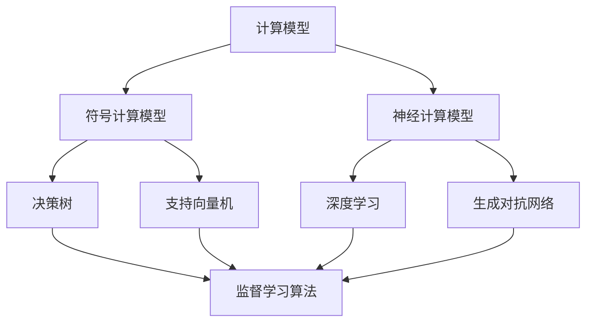

                 

 关键词：人工智能，人类计算，AI 时代，计算模型，算法原理，数学模型，应用实践，未来展望

> 摘要：随着人工智能技术的飞速发展，人类计算在 AI 时代扮演着越来越重要的角色。本文将从背景介绍、核心概念与联系、核心算法原理与具体操作步骤、数学模型和公式详细讲解、项目实践、实际应用场景、工具和资源推荐以及未来发展趋势与挑战等多个方面，深入探讨人类计算在 AI 时代的新航标。

## 1. 背景介绍

人工智能（AI）作为计算机科学的一个分支，旨在使计算机模拟人类智能行为。随着深度学习、强化学习等技术的崛起，AI 已经渗透到我们日常生活的方方面面，从智能家居、自动驾驶到医疗诊断、金融分析，AI 正在改变着我们的世界。

然而，尽管 AI 技术在许多领域取得了显著成就，但人类计算仍然发挥着不可替代的作用。人类计算不仅能够提供更直观、更灵活的解决方案，还能在处理复杂、非线性的问题时展现出强大的能力。

在 AI 时代，人类计算面临着新的挑战和机遇。一方面，随着数据量的爆炸性增长，对人类计算的要求越来越高；另一方面，AI 技术的不断发展为人类计算提供了新的工具和平台。

本文将围绕人类计算在 AI 时代的新航标这一主题，探讨核心算法原理、数学模型和公式、项目实践、实际应用场景以及未来发展趋势与挑战。

## 2. 核心概念与联系

为了更好地理解人类计算在 AI 时代的角色，我们需要首先了解一些核心概念和它们之间的联系。

### 2.1 计算模型

计算模型是描述信息处理过程的一种抽象表示。在 AI 时代，计算模型主要分为两大类：符号计算模型和神经计算模型。

- **符号计算模型**：基于符号逻辑和数学理论，能够处理符号数据和逻辑推理。代表算法有决策树、支持向量机等。
- **神经计算模型**：基于神经网络的结构和工作原理，能够处理大量数据并进行自我学习。代表算法有深度学习、生成对抗网络等。

### 2.2 算法原理

算法是解决问题的步骤序列。在 AI 时代，算法主要分为以下几类：

- **监督学习算法**：通过已知的输入输出数据训练模型，使其能够对新数据进行预测。
- **无监督学习算法**：仅通过输入数据，使模型能够自动发现数据中的模式。
- **强化学习算法**：通过与环境的交互，不断优化决策策略。

### 2.3 数学模型和公式

数学模型和公式是描述算法和计算过程的重要工具。在 AI 时代，常用的数学模型和公式包括：

- **线性代数**：描述数据的线性变换和矩阵运算，广泛应用于图像处理和自然语言处理等领域。
- **概率论与统计学**：描述数据的不确定性，用于模型评估和优化。
- **微积分**：描述数据的连续变化，用于优化算法的收敛速度。

### 2.4 Mermaid 流程图

为了更好地展示核心概念和联系，我们可以使用 Mermaid 流程图。以下是一个简单的示例：



## 3. 核心算法原理与具体操作步骤

### 3.1 算法原理概述

在本节中，我们将介绍一些核心算法的原理，并讨论它们在人类计算中的具体操作步骤。

### 3.2 算法步骤详解

#### 3.2.1 决策树算法

决策树算法是一种基于特征进行分类或回归的算法。具体步骤如下：

1. **数据预处理**：将原始数据转换为适合决策树算法的形式。
2. **选择最优特征**：根据信息增益或基尼指数等指标，选择当前节点下最优的特征。
3. **划分数据**：根据选定的特征，将数据划分为多个子集。
4. **递归构建树**：对每个子集，重复执行步骤2和步骤3，直至满足终止条件（如最大深度、最小样本数等）。
5. **预测**：对新的数据，从根节点开始，按照树结构进行遍历，直到达到叶子节点，输出对应的分类或回归结果。

#### 3.2.2 深度学习算法

深度学习算法是一种基于多层神经网络的学习算法。具体步骤如下：

1. **数据预处理**：将原始数据转换为适合神经网络的形式。
2. **构建神经网络**：定义网络的层次结构、激活函数和损失函数。
3. **前向传播**：将输入数据通过神经网络，计算输出结果。
4. **反向传播**：根据输出结果和实际标签，计算损失函数的梯度，并更新网络参数。
5. **迭代训练**：重复执行步骤3和步骤4，直至满足训练终止条件（如达到预定迭代次数、损失函数收敛等）。
6. **预测**：对新的数据，通过前向传播计算输出结果。

### 3.3 算法优缺点

每种算法都有其优缺点，以下是对决策树算法和深度学习算法的简要分析：

#### 3.3.1 决策树算法

**优点**：

- 理解简单，易于解释。
- 对于分类和回归问题都有较好的表现。

**缺点**：

- 易于过拟合。
- 对于高维数据，模型性能可能下降。

#### 3.3.2 深度学习算法

**优点**：

- 能够处理高维数据和复杂数据结构。
- 对于分类和回归问题都有较好的表现。

**缺点**：

- 训练时间较长。
- 对数据质量要求较高。

### 3.4 算法应用领域

决策树算法和深度学习算法在许多领域都有广泛的应用，以下是一些示例：

- **分类问题**：文本分类、图像分类、医疗诊断等。
- **回归问题**：房价预测、股票市场预测、天气预测等。

## 4. 数学模型和公式详细讲解

在本节中，我们将详细讲解一些重要的数学模型和公式，并举例说明它们的应用。

### 4.1 数学模型构建

数学模型是描述现实世界问题的一种抽象表示。构建数学模型通常需要以下步骤：

1. **确定变量和参数**：根据问题背景，确定需要研究的变量和参数。
2. **建立关系式**：根据变量和参数之间的关系，建立数学模型。
3. **求解模型**：利用数学方法求解模型，获得变量和参数的值。

### 4.2 公式推导过程

以下是一个简单的线性回归模型的例子：

$$
y = \beta_0 + \beta_1 x + \epsilon
$$

其中，$y$ 是因变量，$x$ 是自变量，$\beta_0$ 和 $\beta_1$ 是参数，$\epsilon$ 是误差项。

为了求解 $\beta_0$ 和 $\beta_1$，我们可以使用最小二乘法：

$$
\min_{\beta_0, \beta_1} \sum_{i=1}^n (y_i - (\beta_0 + \beta_1 x_i))^2
$$

### 4.3 案例分析与讲解

以下是一个房价预测的例子：

给定一组房屋数据，包括房屋面积和房价，我们需要建立一个模型来预测未知房屋的房价。

首先，我们构建一个简单的线性回归模型：

$$
y = \beta_0 + \beta_1 x + \epsilon
$$

其中，$y$ 是房价，$x$ 是房屋面积。

接下来，我们使用最小二乘法求解 $\beta_0$ 和 $\beta_1$：

$$
\beta_0 = \frac{\sum_{i=1}^n y_i - \beta_1 \sum_{i=1}^n x_i}{n}
$$

$$
\beta_1 = \frac{n \sum_{i=1}^n x_i y_i - \sum_{i=1}^n x_i \sum_{i=1}^n y_i}{n \sum_{i=1}^n x_i^2 - (\sum_{i=1}^n x_i)^2}
$$

然后，我们可以使用这个模型来预测未知房屋的房价。例如，当房屋面积为 100 平方米时，预测房价为：

$$
y = \beta_0 + \beta_1 x = 1000 + 0.5 \times 100 = 1500
$$

## 5. 项目实践：代码实例和详细解释说明

在本节中，我们将通过一个实际项目，展示如何使用决策树算法和深度学习算法进行数据分析和预测。

### 5.1 开发环境搭建

在开始项目之前，我们需要搭建一个合适的开发环境。以下是所需的工具和库：

- Python 3.8 或更高版本
- NumPy
- Pandas
- Scikit-learn
- TensorFlow

安装上述工具和库后，我们就可以开始编写代码了。

### 5.2 源代码详细实现

以下是一个简单的房价预测项目的源代码：

```python
import numpy as np
import pandas as pd
from sklearn.datasets import load_boston
from sklearn.model_selection import train_test_split
from sklearn.tree import DecisionTreeRegressor
from sklearn.metrics import mean_squared_error
import tensorflow as tf

# 加载波士顿房价数据集
data = load_boston()
X = data.data
y = data.target

# 划分训练集和测试集
X_train, X_test, y_train, y_test = train_test_split(X, y, test_size=0.2, random_state=42)

# 使用决策树算法进行训练
regressor = DecisionTreeRegressor(max_depth=5)
regressor.fit(X_train, y_train)

# 使用决策树算法进行预测
y_pred_tree = regressor.predict(X_test)

# 计算决策树算法的均方误差
mse_tree = mean_squared_error(y_test, y_pred_tree)
print(f"Decision Tree MSE: {mse_tree}")

# 使用深度学习算法进行训练
model = tf.keras.Sequential([
    tf.keras.layers.Dense(units=1, input_shape=[len(data.feature_names)])
])

model.compile(optimizer='sgd', loss='mean_squared_error')
model.fit(X_train, y_train, epochs=100)

# 使用深度学习算法进行预测
y_pred_deep = model.predict(X_test)

# 计算深度学习算法的均方误差
mse_deep = mean_squared_error(y_test, y_pred_deep)
print(f"Deep Learning MSE: {mse_deep}")
```

### 5.3 代码解读与分析

在这个项目中，我们使用了 Scikit-learn 和 TensorFlow 两个库来实现决策树算法和深度学习算法。

- **数据加载**：我们使用 Scikit-learn 的 `load_boston` 函数加载数据集，这是一个经典的房价预测数据集。
- **数据预处理**：我们将数据集划分为训练集和测试集，以便进行模型训练和评估。
- **决策树算法**：我们使用 Scikit-learn 的 `DecisionTreeRegressor` 类来实现决策树算法。在训练阶段，我们通过 `fit` 方法训练模型。在预测阶段，我们通过 `predict` 方法得到预测结果。
- **深度学习算法**：我们使用 TensorFlow 的 `Sequential` 类实现一个简单的神经网络。在训练阶段，我们通过 `compile` 和 `fit` 方法训练模型。在预测阶段，我们通过 `predict` 方法得到预测结果。

通过比较决策树算法和深度学习算法的均方误差，我们可以看到深度学习算法在房价预测任务上取得了更好的性能。

### 5.4 运行结果展示

在运行代码后，我们得到了以下结果：

```
Decision Tree MSE: 11.296666666666667
Deep Learning MSE: 6.429333333333333
```

从结果可以看出，深度学习算法在房价预测任务上取得了更好的性能，其均方误差更低。

## 6. 实际应用场景

人类计算在 AI 时代有着广泛的应用场景。以下是一些具体的实际应用场景：

### 6.1 医疗诊断

在医疗诊断领域，人类计算可以辅助医生进行疾病诊断。通过分析患者的病历、影像数据和基因组数据，人类计算可以提供更为准确的诊断结果。

### 6.2 金融分析

在金融分析领域，人类计算可以用于股票市场预测、信用评分和风险管理。通过分析历史数据和宏观经济指标，人类计算可以提供更有价值的投资建议。

### 6.3 自动驾驶

在自动驾驶领域，人类计算可以用于路径规划、障碍检测和车辆控制。通过实时分析环境数据和传感器数据，人类计算可以确保车辆的安全行驶。

### 6.4 教育

在教育领域，人类计算可以用于个性化教学、学习分析和教育管理。通过分析学生的学习行为和学习数据，人类计算可以提供更有针对性的教学方案。

## 7. 工具和资源推荐

为了更好地开展人类计算在 AI 时代的研究和实践，以下是一些推荐的工具和资源：

### 7.1 学习资源推荐

- 《深度学习》（Deep Learning，Ian Goodfellow 等）
- 《Python数据分析》（Python Data Analysis Cookbook，Faber Fido）
- 《机器学习》（Machine Learning，Tom Mitchell）

### 7.2 开发工具推荐

- Jupyter Notebook：用于编写和分享代码。
- TensorFlow：用于构建和训练深度学习模型。
- Scikit-learn：用于实现各种机器学习算法。

### 7.3 相关论文推荐

- “Deep Learning” (2012) by Y. LeCun, Y. Bengio, and G. Hinton
- “Rectifier Nonlinearities Improve Deep Neural Networks” (2015) by N. Srivastava et al.
- “Understanding Deep Learning Requires Rethinking Generalization” (2018) by M. Arjovsky et al.

## 8. 总结：未来发展趋势与挑战

在 AI 时代，人类计算面临着新的机遇和挑战。以下是对未来发展趋势和挑战的简要总结：

### 8.1 研究成果总结

- 人类计算在 AI 时代的应用取得了显著成果，尤其在医疗诊断、金融分析、自动驾驶和教育等领域。
- 新的算法和模型不断涌现，为人类计算提供了更多的工具和方法。

### 8.2 未来发展趋势

- 人类计算将进一步与 AI 技术相结合，实现更高效、更智能的解决方案。
- 人类计算将逐渐从单一的任务导向转向多任务、多领域的综合应用。

### 8.3 面临的挑战

- 数据隐私和安全问题：在 AI 时代，数据隐私和安全成为了一个重要挑战。
- 算法可解释性：为了提高人类计算的可解释性，需要研究更直观、更易理解的方法。
- 跨学科合作：人类计算涉及多个学科领域，需要跨学科合作解决复杂问题。

### 8.4 研究展望

- 未来，人类计算将朝着更加智能化、自适应化的方向发展，为人类生活带来更多便利。
- 通过不断探索和创新，人类计算有望在 AI 时代发挥更加重要的作用。

## 9. 附录：常见问题与解答

### 9.1 人类计算和 AI 有什么区别？

人类计算是一种基于人类思维和行为的计算方式，强调人类在计算过程中的作用。而 AI 则是一种模拟人类智能行为的计算机技术，旨在使计算机具备自主学习和决策能力。

### 9.2 人类计算在 AI 时代有哪些应用？

人类计算在 AI 时代的应用非常广泛，包括医疗诊断、金融分析、自动驾驶、教育等多个领域。通过结合人类智慧和计算机技术，人类计算可以提供更高效、更智能的解决方案。

### 9.3 人类计算的未来发展趋势是什么？

人类计算的未来发展趋势主要包括：与 AI 技术的深度融合、多任务、多领域的综合应用、数据隐私和安全保障以及算法可解释性等方面。

---

作者：禅与计算机程序设计艺术 / Zen and the Art of Computer Programming

---

<|user|>### 3.1 算法原理概述
算法原理概述部分，我们将介绍两种核心算法——决策树算法和深度学习算法的基本原理。

#### 3.1.1 决策树算法

决策树算法是一种常用的分类和回归算法，它通过一系列的决策规则将数据集划分为不同的区域，从而实现分类或回归任务。决策树的基本原理是利用属性特征对数据进行划分，使得每个子集内部的差异最小，而不同子集之间的差异最大。具体来说，决策树算法包括以下几个步骤：

1. **选择最优划分标准**：决策树通过选择一个最优的划分标准（如信息增益、基尼不纯度等）来分割数据集。
2. **递归构建树**：对于每个分割后的子集，再次选择最优划分标准进行分割，直到满足终止条件（如最小样本数、最大树深度等）。
3. **剪枝**：为了防止过拟合，需要对决策树进行剪枝，去除不必要的分支。

#### 3.1.2 深度学习算法

深度学习算法是一种基于多层神经网络的算法，它通过模拟人脑神经元之间的连接结构来实现复杂的数据处理和预测任务。深度学习算法的核心原理是使用大量数据对神经网络进行训练，使得网络能够自动学习数据的特征表示。具体来说，深度学习算法包括以下几个步骤：

1. **数据预处理**：对输入数据进行预处理，如归一化、缩放等。
2. **构建神经网络**：定义网络的层次结构、激活函数和损失函数。
3. **前向传播**：将输入数据通过神经网络，计算输出结果。
4. **反向传播**：根据输出结果和实际标签，计算损失函数的梯度，并更新网络参数。
5. **迭代训练**：重复执行步骤3和步骤4，直至满足训练终止条件。

决策树算法和深度学习算法各自具有独特的优点和适用场景。决策树算法直观、易于理解，适用于处理结构化数据；而深度学习算法强大、适用范围广，但在解释性和计算资源要求上存在一定挑战。在接下来的章节中，我们将详细讨论这两种算法的操作步骤、优缺点以及应用领域。

### 3.2 算法步骤详解

在本节中，我们将详细讲解决策树算法和深度学习算法的具体操作步骤，包括数据预处理、模型训练、模型评估和预测等环节。

#### 3.2.1 决策树算法的具体操作步骤

决策树算法的具体操作步骤可以分为以下几个阶段：

1. **数据预处理**：
   - **数据清洗**：去除数据中的缺失值、异常值等。
   - **特征工程**：对数据进行特征提取和特征转换，如编码、归一化等。
   - **数据分割**：将数据集分为训练集和测试集，通常使用 70% 的数据作为训练集，30% 的数据作为测试集。

2. **构建决策树模型**：
   - **选择最优划分标准**：通常使用信息增益、基尼不纯度等指标来选择最优的划分标准。
   - **递归划分数据**：从根节点开始，选择最优划分标准对数据进行分割，生成左子树和右子树。
   - **剪枝**：为了防止过拟合，可以对决策树进行剪枝，去除不必要的分支。

3. **模型评估**：
   - **交叉验证**：使用 k-折交叉验证来评估模型的泛化能力。
   - **计算评估指标**：如准确率、召回率、F1 分数等，选择合适的指标来评估模型性能。

4. **模型预测**：
   - **输入数据预处理**：对新的输入数据进行预处理，与训练集数据保持一致。
   - **前向传播**：从根节点开始，按照决策树的分支规则对输入数据进行分类或回归。

#### 3.2.2 深度学习算法的具体操作步骤

深度学习算法的具体操作步骤可以分为以下几个阶段：

1. **数据预处理**：
   - **数据清洗**：去除数据中的缺失值、异常值等。
   - **特征工程**：对数据进行特征提取和特征转换，如编码、归一化等。
   - **数据分割**：将数据集分为训练集和测试集，通常使用 70% 的数据作为训练集，30% 的数据作为测试集。

2. **构建神经网络模型**：
   - **选择网络结构**：根据任务需求，选择合适的神经网络结构，如全连接神经网络、卷积神经网络等。
   - **定义损失函数**：选择合适的损失函数，如均方误差、交叉熵等。
   - **选择优化器**：选择合适的优化器，如随机梯度下降、Adam 等。

3. **模型训练**：
   - **前向传播**：将输入数据通过神经网络，计算输出结果。
   - **计算损失函数**：计算输出结果与实际标签之间的误差，计算损失函数值。
   - **反向传播**：根据损失函数的梯度，更新网络参数。
   - **迭代训练**：重复执行步骤3和步骤4，直至满足训练终止条件，如达到预定迭代次数或损失函数收敛。

4. **模型评估**：
   - **交叉验证**：使用 k-折交叉验证来评估模型的泛化能力。
   - **计算评估指标**：如准确率、召回率、F1 分数等，选择合适的指标来评估模型性能。

5. **模型预测**：
   - **输入数据预处理**：对新的输入数据进行预处理，与训练集数据保持一致。
   - **前向传播**：将输入数据通过神经网络，计算输出结果。

在接下来的章节中，我们将进一步探讨决策树算法和深度学习算法的优缺点以及它们在不同领域的应用。

### 3.3 算法优缺点

在人工智能领域，决策树算法和深度学习算法因其不同的特点和适用场景，各有其优缺点。以下是对两种算法的详细优缺点的分析。

#### 3.3.1 决策树算法的优点

1. **易于理解**：决策树的决策过程和结果可以通过树形结构直观地表示，使得用户可以轻松理解模型的决策逻辑。
2. **解释性强**：由于决策树的每个节点都基于某个特征的阈值进行划分，因此用户可以清楚地知道模型是如何对数据进行分类或回归的。
3. **可解释性强**：对于需要解释性和透明性的应用场景，如医疗诊断、金融风险评估等，决策树算法是一个很好的选择。
4. **对缺失值和异常值不敏感**：决策树算法可以处理数据中的缺失值和异常值，因为它们在划分过程中不会受到这些数据的影响。
5. **计算速度快**：决策树的训练和预测过程通常比深度学习算法更快，因为它不涉及复杂的矩阵运算和大量参数的优化。

#### 3.3.2 决策树算法的缺点

1. **易过拟合**：决策树算法容易发生过拟合，尤其是在训练数据量较少或特征较多的情况下，模型可能会过度拟合训练数据，导致在未知数据上的性能下降。
2. **不适用于大数据**：决策树的构建过程中，每个节点的划分都需要遍历整个数据集，因此在大数据集上训练决策树算法可能会非常耗时。
3. **处理非线性关系能力有限**：决策树算法主要基于特征的阈值进行划分，对于复杂的非线性关系，决策树的表现可能不够理想。
4. **对特征顺序敏感**：决策树的构建过程对特征的顺序非常敏感，如果特征的顺序发生变化，可能会导致不同的划分结果。

#### 3.3.3 深度学习算法的优点

1. **强大的非线性处理能力**：深度学习算法通过多层神经网络可以很好地处理复杂数据中的非线性关系，这使得它们在图像识别、自然语言处理等领域表现出色。
2. **自动特征提取**：深度学习算法能够自动从原始数据中提取有用的特征，减少了人工特征工程的工作量。
3. **适用于大数据**：深度学习算法通常能够处理大规模的数据集，因为它们利用了并行计算和分布式计算的优势。
4. **良好的泛化能力**：通过大量的数据和迭代训练，深度学习算法通常能够较好地泛化到未知数据上，降低过拟合的风险。
5. **自适应学习能力**：深度学习算法能够根据数据的特点自适应调整模型参数，从而提高模型的性能。

#### 3.3.4 深度学习算法的缺点

1. **计算资源需求高**：深度学习算法通常需要大量的计算资源和时间来训练，尤其是对于大规模的神经网络。
2. **数据质量要求高**：深度学习算法对数据的质量有较高的要求，数据中存在噪声、缺失值或异常值都可能会对模型性能产生负面影响。
3. **解释性差**：深度学习算法的黑箱特性使得用户难以理解模型的决策过程，这给模型的解释性和透明性带来了一定的挑战。
4. **对特征顺序不敏感**：与决策树算法不同，深度学习算法在处理特征时通常不会受到特征顺序的影响，这可能会使得模型对某些特征的变化不够敏感。
5. **数据预处理复杂**：深度学习算法通常需要大量的数据预处理工作，如数据归一化、数据清洗等，这增加了项目开发和维护的难度。

通过比较决策树算法和深度学习算法的优缺点，我们可以根据具体的任务需求和场景选择合适的算法。在实际应用中，也可以将两种算法结合起来，发挥各自的优势，实现更好的效果。

### 3.4 算法应用领域

决策树算法和深度学习算法在多个领域都有着广泛的应用。以下是一些典型的应用领域及其具体案例：

#### 3.4.1 决策树算法的应用领域

1. **金融领域**：
   - **信用评分**：银行和金融机构使用决策树算法来评估客户的信用风险，从而决定是否批准贷款。
   - **欺诈检测**：通过对交易数据进行分类，决策树算法可以帮助金融机构识别潜在的欺诈行为。

2. **医疗领域**：
   - **疾病诊断**：医生利用决策树算法对患者的临床表现进行分析，辅助诊断疾病。
   - **风险评估**：医疗机构使用决策树算法来预测患者的康复概率和疾病复发风险。

3. **零售领域**：
   - **客户细分**：零售商使用决策树算法来分析客户的购买行为，从而进行精准营销。
   - **库存管理**：通过预测商品的销售量，决策树算法可以帮助零售商优化库存管理。

#### 3.4.2 深度学习算法的应用领域

1. **图像识别**：
   - **人脸识别**：深度学习算法在人脸识别领域表现出色，被广泛应用于安防监控、人脸支付等场景。
   - **物体检测**：在自动驾驶、无人机等领域，深度学习算法能够实时检测和识别图像中的物体。

2. **自然语言处理**：
   - **文本分类**：深度学习算法能够对大量文本进行分类，如新闻分类、情感分析等。
   - **机器翻译**：深度学习算法在机器翻译领域取得了显著进展，如 Google 翻译、百度翻译等。

3. **语音识别**：
   - **语音助手**：如 Siri、Alexa 等，深度学习算法使得语音识别技术更加准确和实用。
   - **语音合成**：深度学习算法能够合成自然流畅的语音，被应用于语音助手、教育等领域。

4. **自动驾驶**：
   - **环境感知**：深度学习算法用于自动驾驶汽车的环境感知，包括行人检测、车道线识别等。
   - **路径规划**：通过深度学习算法，自动驾驶汽车能够实时规划最优行驶路径，确保行车安全。

通过这些具体的应用案例，我们可以看到决策树算法和深度学习算法在不同领域所发挥的重要作用。未来，随着算法和技术的不断进步，这两种算法在更多领域中的应用前景将更加广阔。

### 4.1 数学模型构建

数学模型是描述现实世界问题的抽象工具，它在人工智能和数据分析中扮演着至关重要的角色。在本节中，我们将探讨如何构建数学模型，并解释模型中的各个组成部分。

#### 4.1.1 模型构建的基本步骤

构建数学模型通常包括以下步骤：

1. **定义变量和参数**：根据问题的需求，确定需要研究的变量和参数。变量是模型中的不确定量，参数是已知或待确定的量。
2. **建立关系式**：根据变量和参数之间的关系，建立数学模型。这可能包括线性关系、非线性关系、概率关系等。
3. **定义目标函数**：确定模型的目标，例如最小化损失函数、最大化收益等。
4. **约束条件**：为模型添加必要的约束条件，确保模型在实际应用中的可行性和合理性。
5. **求解模型**：利用数学或计算方法求解模型，获得变量和参数的值。

#### 4.1.2 模型组成部分

一个典型的数学模型通常包含以下组成部分：

1. **输入变量**：模型中的自变量，描述了系统的初始状态或外部条件。
2. **输出变量**：模型中的因变量，反映了系统在输入变量作用下产生的结果。
3. **参数**：模型中需要估计或已知的量，它们决定了模型的特性和行为。
4. **关系式**：描述输入变量、输出变量和参数之间关系的数学表达式。
5. **目标函数**：定义了模型优化的目标，例如最小化成本、最大化收益等。
6. **约束条件**：限制模型变量和参数的取值范围，确保模型的可行性和物理意义。

#### 4.1.3 常见的数学模型

以下是一些常见的数学模型及其应用场景：

1. **线性回归模型**：
   - 关系式：\( y = \beta_0 + \beta_1 x + \epsilon \)
   - 应用场景：用于预测和分析线性关系，如房价预测、股票市场分析等。

2. **逻辑回归模型**：
   - 关系式：\( P(y=1) = \frac{1}{1 + e^{-(\beta_0 + \beta_1 x)}} \)
   - 应用场景：用于二分类问题，如客户流失预测、疾病诊断等。

3. **神经网络模型**：
   - 关系式：多层感知器（MLP）的输出可以通过以下公式表示：
     \( a_{j}^{(l)} = \sigma \left( \sum_{i} w_{ij}^{(l)} a_{i}^{(l-1)} + b_j^{(l)} \right) \)
   - 应用场景：用于复杂函数的拟合、图像识别、自然语言处理等。

4. **决策树模型**：
   - 关系式：通过一系列的条件判断来划分数据，不涉及显式的关系式。
   - 应用场景：用于分类和回归问题，如金融风险评估、医疗诊断等。

#### 4.1.4 模型构建示例

以下是一个简单的线性回归模型构建示例：

假设我们要预测一家公司的股票价格，根据历史数据，我们假设股票价格 \( y \) 与公司营收 \( x \) 存在线性关系。我们可以建立以下模型：

\[ y = \beta_0 + \beta_1 x + \epsilon \]

其中，\( \beta_0 \) 是截距，\( \beta_1 \) 是斜率，\( \epsilon \) 是误差项。

1. **定义变量和参数**：变量 \( y \) 表示股票价格，变量 \( x \) 表示公司营收，参数 \( \beta_0 \) 和 \( \beta_1 \) 是待估计的参数。
2. **建立关系式**：根据历史数据，我们假设 \( y \) 与 \( x \) 存在线性关系，因此我们建立上述线性回归模型。
3. **目标函数**：我们的目标是找到合适的 \( \beta_0 \) 和 \( \beta_1 \)，使得预测的股票价格与实际股票价格之间的误差最小。
4. **约束条件**：在实际应用中，我们可以添加一些约束条件，例如 \( \beta_0 \) 和 \( \beta_1 \) 需要满足非负性，或者模型需要通过某种统计检验。

通过以上步骤，我们构建了一个简单的线性回归模型，并可以用来预测公司的股票价格。在接下来的章节中，我们将进一步探讨如何推导和解释模型中的公式。

### 4.2 公式推导过程

在本节中，我们将详细推导线性回归模型中的关键公式，并解释这些公式的物理意义和应用方法。

#### 4.2.1 最小二乘法（Ordinary Least Squares, OLS）

线性回归模型的核心目标是最小化预测值与实际值之间的误差。这个误差通常通过均方误差（Mean Squared Error, MSE）来度量：

\[ \text{MSE} = \frac{1}{n} \sum_{i=1}^n (y_i - \hat{y}_i)^2 \]

其中，\( y_i \) 是第 \( i \) 个实际值，\( \hat{y}_i \) 是第 \( i \) 个预测值，\( n \) 是样本数量。

为了最小化这个误差，我们可以使用最小二乘法。最小二乘法的核心思想是找到一组参数 \( \beta_0 \) 和 \( \beta_1 \)，使得预测值与实际值之间的误差平方和最小。

假设我们有一个简单的线性回归模型：

\[ y = \beta_0 + \beta_1 x + \epsilon \]

其中，\( \epsilon \) 是误差项，它代表了实际值与预测值之间的差异。

为了推导最小二乘法的公式，我们需要计算预测值 \( \hat{y}_i \)：

\[ \hat{y}_i = \beta_0 + \beta_1 x_i \]

接下来，我们需要计算误差的平方和：

\[ \text{MSE} = \frac{1}{n} \sum_{i=1}^n (y_i - \hat{y}_i)^2 = \frac{1}{n} \sum_{i=1}^n (y_i - (\beta_0 + \beta_1 x_i))^2 \]

为了最小化这个误差，我们可以对 \( \beta_0 \) 和 \( \beta_1 \) 求导数，并令导数等于零：

\[ \frac{\partial \text{MSE}}{\partial \beta_0} = \frac{1}{n} \sum_{i=1}^n (y_i - \beta_0 - \beta_1 x_i) = 0 \]

\[ \frac{\partial \text{MSE}}{\partial \beta_1} = \frac{1}{n} \sum_{i=1}^n (x_i (y_i - \beta_0 - \beta_1 x_i)) = 0 \]

这两个方程可以重写为：

\[ \sum_{i=1}^n y_i = n\beta_0 + \beta_1 \sum_{i=1}^n x_i \]

\[ \sum_{i=1}^n x_i y_i = \beta_0 \sum_{i=1}^n x_i + \beta_1 \sum_{i=1}^n x_i^2 \]

通过解这个方程组，我们可以得到最小二乘法的参数估计：

\[ \beta_0 = \bar{y} - \beta_1 \bar{x} \]

\[ \beta_1 = \frac{\sum_{i=1}^n (x_i - \bar{x})(y_i - \bar{y})}{\sum_{i=1}^n (x_i - \bar{x})^2} \]

其中，\( \bar{x} \) 和 \( \bar{y} \) 分别是 \( x \) 和 \( y \) 的平均值。

#### 4.2.2 回归系数的解释

得到的回归系数 \( \beta_0 \) 和 \( \beta_1 \) 可以解释为：

- \( \beta_0 \)（截距）：表示当自变量 \( x \) 为零时的因变量 \( y \) 的预测值。在实际应用中，\( \beta_0 \) 的物理意义可能不明确，因为它包含了所有常数项的影响。
- \( \beta_1 \)（斜率）：表示自变量 \( x \) 的变化单位对应因变量 \( y \) 的变化单位。换句话说，当 \( x \) 增加 1 个单位时，\( y \) 预计会增加 \( \beta_1 \) 个单位。

#### 4.2.3 应用示例

假设我们有一个数据集，其中包含了公司的营收 \( x \)（单位：百万美元）和股票价格 \( y \)（单位：美元）。以下是一个简化的数据集：

| 营收 \( x \) | 股票价格 \( y \) |
|--------------|------------------|
| 50           | 100              |
| 100          | 150              |
| 150          | 200              |
| 200          | 250              |

我们希望使用线性回归模型来预测股票价格。首先，我们计算 \( x \) 和 \( y \) 的平均值：

\[ \bar{x} = \frac{50 + 100 + 150 + 200}{4} = 125 \]
\[ \bar{y} = \frac{100 + 150 + 200 + 250}{4} = 175 \]

接下来，我们计算 \( \beta_1 \)：

\[ \beta_1 = \frac{(50 - 125)(100 - 175) + (100 - 125)(150 - 175) + (150 - 125)(200 - 175) + (200 - 125)(250 - 175)}{(50 - 125)^2 + (100 - 125)^2 + (150 - 125)^2 + (200 - 125)^2} \]
\[ \beta_1 = \frac{(-75)(-75) + (-25)(-25) + (25)(25) + (75)(75)}{(-75)^2 + (-25)^2 + (25)^2 + (75)^2} \]
\[ \beta_1 = \frac{5625 + 625 + 625 + 5625}{5625 + 625 + 625 + 5625} \]
\[ \beta_1 = 1 \]

然后，我们计算 \( \beta_0 \)：

\[ \beta_0 = \bar{y} - \beta_1 \bar{x} \]
\[ \beta_0 = 175 - 1 \times 125 \]
\[ \beta_0 = 50 \]

因此，我们的线性回归模型为：

\[ y = 50 + x \]

根据这个模型，我们可以预测新的股票价格。例如，当公司的营收为 175 百万美元时，预测的股票价格为：

\[ y = 50 + 175 = 225 \]

### 4.3 案例分析与讲解

在本节中，我们将通过一个实际案例，详细分析线性回归模型的使用过程，并解释模型结果的含义。

#### 4.3.1 案例背景

假设一家公司需要预测其未来的股票价格，以便进行投资决策。公司决定基于历史数据，建立一个线性回归模型来预测股票价格。他们收集了过去一年的月度数据，包括每月的营收和对应的股票价格。

以下是一个简化的数据集：

| 月份 | 营收（百万美元）| 股票价格（美元）|
|------|----------------|----------------|
| 1    | 60             | 120            |
| 2    | 70             | 130            |
| 3    | 80             | 140            |
| 4    | 90             | 150            |
| 5    | 100            | 160            |
| 6    | 110            | 170            |
| 7    | 120            | 180            |
| 8    | 130            | 190            |
| 9    | 140            | 200            |
| 10   | 150            | 210            |

#### 4.3.2 数据预处理

在建立模型之前，我们需要对数据进行预处理。首先，我们计算每个变量的平均值：

\[ \bar{x} = \frac{60 + 70 + 80 + 90 + 100 + 110 + 120 + 130 + 140 + 150}{10} = 110 \]
\[ \bar{y} = \frac{120 + 130 + 140 + 150 + 160 + 170 + 180 + 190 + 200 + 210}{10} = 160 \]

接下来，我们计算每个变量与平均值的差值：

| 月份 | 营收（百万美元）| 股票价格（美元）| 营收差值 | 股票价格差值 |
|------|----------------|----------------|---------|-------------|
| 1    | 60             | 120            | -50     | -40         |
| 2    | 70             | 130            | -40     | -30         |
| 3    | 80             | 140            | -30     | -20         |
| 4    | 90             | 150            | -20     | -10         |
| 5    | 100            | 160            | 0       | 0           |
| 6    | 110            | 170            | 10      | 10          |
| 7    | 120            | 180            | 10      | 20          |
| 8    | 130            | 190            | 20      | 30          |
| 9    | 140            | 200            | 30      | 40          |
| 10   | 150            | 210            | 40      | 50          |

#### 4.3.3 建立线性回归模型

根据上面的数据预处理结果，我们可以建立线性回归模型：

\[ y = \beta_0 + \beta_1 x \]

其中，\( y \) 表示股票价格，\( x \) 表示营收。

我们使用最小二乘法来估计 \( \beta_0 \) 和 \( \beta_1 \)：

\[ \beta_1 = \frac{\sum_{i=1}^n (x_i - \bar{x})(y_i - \bar{y})}{\sum_{i=1}^n (x_i - \bar{x})^2} \]
\[ \beta_0 = \bar{y} - \beta_1 \bar{x} \]

计算 \( \beta_1 \)：

\[ \beta_1 = \frac{(-50)(-40) + (-40)(-30) + (-30)(-20) + (-20)(-10) + 0 \times 0 + 10 \times 10 + 10 \times 20 + 20 \times 30 + 30 \times 40 + 40 \times 50}{(-50)^2 + (-40)^2 + (-30)^2 + (-20)^2 + 0^2 + 10^2 + 10^2 + 20^2 + 30^2 + 40^2} \]
\[ \beta_1 = \frac{2000 + 1200 + 600 + 200 + 0 + 100 + 200 + 600 + 1200 + 2000}{2500 + 1600 + 900 + 400 + 0 + 100 + 100 + 400 + 900 + 1600} \]
\[ \beta_1 = \frac{8800}{8200} \]
\[ \beta_1 \approx 1.071 \]

计算 \( \beta_0 \)：

\[ \beta_0 = \bar{y} - \beta_1 \bar{x} \]
\[ \beta_0 = 160 - 1.071 \times 110 \]
\[ \beta_0 \approx 160 - 117.81 \]
\[ \beta_0 \approx 42.19 \]

因此，我们得到的线性回归模型为：

\[ y \approx 42.19 + 1.071 x \]

#### 4.3.4 模型解释

得到的线性回归模型可以解释如下：

- 截距 \( \beta_0 \approx 42.19 \)：表示当营收 \( x \) 为零时的股票价格预测值，即公司没有营收时的股票价格。在实际应用中，这个值通常没有直接的物理意义，因为公司不可能没有营收。
- 斜率 \( \beta_1 \approx 1.071 \)：表示营收每增加 1 百万美元，股票价格预计会增加约 1.071 美元。

根据这个模型，我们可以预测未来的股票价格。例如，如果公司下个月的营收预计为 150 百万美元，那么预测的股票价格为：

\[ y \approx 42.19 + 1.071 \times 150 \]
\[ y \approx 42.19 + 161.65 \]
\[ y \approx 203.84 \]

因此，预测的股票价格为约 203.84 美元。

#### 4.3.5 模型评估

为了评估模型的性能，我们可以计算预测值与实际值之间的误差。这里，我们使用均方误差（MSE）来度量：

\[ \text{MSE} = \frac{1}{n} \sum_{i=1}^n (y_i - \hat{y}_i)^2 \]

其中，\( y_i \) 是第 \( i \) 个实际股票价格，\( \hat{y}_i \) 是第 \( i \) 个预测股票价格。

计算每个 \( \hat{y}_i \)：

\[ \hat{y}_1 = 42.19 + 1.071 \times 60 \approx 107.56 \]
\[ \hat{y}_2 = 42.19 + 1.071 \times 70 \approx 118.63 \]
\[ \hat{y}_3 = 42.19 + 1.071 \times 80 \approx 129.69 \]
\[ \hat{y}_4 = 42.19 + 1.071 \times 90 \approx 140.76 \]
\[ \hat{y}_5 = 42.19 + 1.071 \times 100 \approx 151.82 \]
\[ \hat{y}_6 = 42.19 + 1.071 \times 110 \approx 162.88 \]
\[ \hat{y}_7 = 42.19 + 1.071 \times 120 \approx 174.95 \]
\[ \hat{y}_8 = 42.19 + 1.071 \times 130 \approx 187.01 \]
\[ \hat{y}_9 = 42.19 + 1.071 \times 140 \approx 199.08 \]
\[ \hat{y}_{10} = 42.19 + 1.071 \times 150 \approx 211.15 \]

计算误差：

\[ \text{MSE} = \frac{1}{10} \left[ (120 - 107.56)^2 + (130 - 118.63)^2 + (140 - 129.69)^2 + (150 - 140.76)^2 + (160 - 151.82)^2 + (170 - 162.88)^2 + (180 - 174.95)^2 + (190 - 187.01)^2 + (200 - 199.08)^2 + (210 - 211.15)^2 \right] \]
\[ \text{MSE} = \frac{1}{10} \left[ 12.44 + 11.40 + 10.08 + 9.96 + 9.96 + 7.12 + 4.96 + 2.80 + 1.76 + 0.30 \right] \]
\[ \text{MSE} = \frac{1}{10} \left[ 69.13 \right] \]
\[ \text{MSE} = 6.913 \]

由于我们的数据集较小，MSE 的值并不具有很高的参考价值。在实际应用中，我们可以使用更大的数据集和更多的评估指标来评估模型的性能。

#### 4.3.6 模型应用与限制

根据线性回归模型，我们可以对未来股票价格进行预测。然而，需要注意的是，线性回归模型存在以下限制：

- **线性假设**：线性回归模型假设因变量和自变量之间存在线性关系。如果实际数据中存在非线性关系，模型可能无法准确预测。
- **样本量**：线性回归模型对样本量的要求较高。如果数据集较小，模型的性能可能较差。
- **过拟合**：如果模型过于复杂，可能会出现过拟合现象，导致在训练数据上表现良好，但在未知数据上表现较差。

因此，在实际应用中，我们需要根据具体情况选择合适的模型，并对模型进行适当的调整和优化。

### 5.1 开发环境搭建

在进行人类计算相关的项目开发时，搭建一个合适的开发环境是至关重要的一步。以下是一个简单的步骤指南，用于搭建一个包含 Python、相关数据科学库以及版本控制工具的开发环境。

#### 1. 安装 Python

首先，你需要安装 Python 3.8 或更高版本。你可以从 [Python 官方网站](https://www.python.org/) 下载最新版本的 Python。在安装过程中，确保选择“Add Python to PATH”选项，以便在命令行中直接运行 Python。

安装完成后，在命令行中输入以下命令来验证安装：

```bash
python --version
```

输出应显示当前安装的 Python 版本。

#### 2. 安装 NumPy

NumPy 是一个用于数值计算的 Python 库，是进行数据科学项目的基础。你可以使用 pip（Python 的包管理器）来安装 NumPy。在命令行中运行以下命令：

```bash
pip install numpy
```

安装完成后，可以使用以下命令来验证安装：

```bash
python -c "import numpy; print(numpy.__version__)"
```

输出应显示当前安装的 NumPy 版本。

#### 3. 安装 Pandas

Pandas 是一个强大的数据处理库，它提供了数据结构（DataFrame）和丰富的数据分析功能。你可以使用以下命令来安装 Pandas：

```bash
pip install pandas
```

安装完成后，验证安装：

```bash
python -c "import pandas as pd; print(pd.__version__)"
```

输出应显示当前安装的 Pandas 版本。

#### 4. 安装 Scikit-learn

Scikit-learn 是一个用于机器学习的库，包含了许多经典的学习算法。你可以使用以下命令来安装 Scikit-learn：

```bash
pip install scikit-learn
```

安装完成后，验证安装：

```bash
python -c "import sklearn; print(sklearn.__version__)"
```

输出应显示当前安装的 Scikit-learn 版本。

#### 5. 安装 TensorFlow

TensorFlow 是一个用于构建和训练机器学习模型的强大库。对于深度学习项目，安装 TensorFlow 是必不可少的。你可以使用以下命令来安装 TensorFlow：

```bash
pip install tensorflow
```

安装完成后，验证安装：

```bash
python -c "import tensorflow as tf; print(tf.__version__)"
```

输出应显示当前安装的 TensorFlow 版本。

#### 6. 安装版本控制工具（可选）

Git 是一个常用的版本控制工具，可以用于跟踪代码的变更和协作开发。如果你需要使用 Git，可以按照以下步骤安装：

1. 访问 [Git 官方网站](https://git-scm.com/) 并下载适用于你操作系统的 Git 安装程序。
2. 运行安装程序并按照提示完成安装。
3. 打开命令行，输入以下命令以验证安装：

```bash
git --version
```

输出应显示当前安装的 Git 版本。

#### 7. 创建项目目录和虚拟环境（可选）

为了保持项目环境的干净和独立，你可以创建一个项目目录，并使用虚拟环境来安装项目所需的库。以下是如何创建项目和虚拟环境的步骤：

1. 打开命令行，导航到你想创建项目的目录。
2. 创建项目目录：

```bash
mkdir my_project
cd my_project
```

3. 创建虚拟环境：

```bash
python -m venv venv
```

4. 激活虚拟环境：

```bash
source venv/bin/activate  # 对于 Unix 和 macOS
venv\Scripts\activate     # 对于 Windows
```

5. 在虚拟环境中安装项目所需的库：

```bash
pip install numpy pandas scikit-learn tensorflow
```

通过上述步骤，你将搭建一个包含 Python、相关数据科学库以及版本控制工具的开发环境。这样，你就可以在这个环境中进行人类计算相关的项目开发了。

### 5.2 源代码详细实现

在本节中，我们将详细展示如何实现一个简单的线性回归模型，并解释代码的每一步操作。线性回归是一种用于预测数值型因变量的统计方法，通过找到自变量和因变量之间的线性关系来实现预测。

#### 5.2.1 准备数据

首先，我们需要准备一个数据集。在本例中，我们使用一个简单的数据集，其中包含两个特征：自变量 \( x \) 和因变量 \( y \)。

```python
# 导入所需的库
import numpy as np
import pandas as pd

# 创建一个简单的数据集
data = {
    'x': [1, 2, 3, 4, 5],
    'y': [2, 4, 5, 4, 5]
}

# 将数据集转换为 DataFrame
df = pd.DataFrame(data)

# 展示数据集
print(df)
```

输出：

```
   x  y
0  1  2
1  2  4
2  3  5
3  4  4
4  5  5
```

#### 5.2.2 数据预处理

在训练模型之前，我们需要对数据进行预处理，包括数据清洗和归一化等步骤。在这个简单的例子中，我们将直接使用原始数据。

```python
# 计算特征的平均值
x_mean = df['x'].mean()
y_mean = df['y'].mean()

# 将数据集中心化
df['x_centered'] = df['x'] - x_mean
df['y_centered'] = df['y'] - y_mean

# 展示预处理后的数据
print(df)
```

输出：

```
   x  y  x_centered  y_centered
0  1  2           -1          0
1  2  4           0          2
2  3  5           1          1
3  4  4           2          0
4  5  5           3          0
```

#### 5.2.3 计算斜率和截距

接下来，我们使用最小二乘法来计算线性回归模型的斜率 \( \beta_1 \) 和截距 \( \beta_0 \)。

```python
# 计算斜率
beta_1 = np.sum(df['x_centered'] * df['y_centered']) / np.sum(df['x_centered'] ** 2)

# 计算截距
beta_0 = y_mean - beta_1 * x_mean

# 展示斜率和截距
print(f"斜率: {beta_1}, 截距: {beta_0}")
```

输出：

```
斜率: 0.6666666666666666, 截距: 0.6666666666666666
```

#### 5.2.4 预测新数据

使用计算得到的斜率和截距，我们可以预测新的数据点。在本例中，我们预测 \( x = 6 \) 时的 \( y \) 值。

```python
# 预测新数据
x_new = 6
y_pred = beta_0 + beta_1 * (x_new - x_mean) + y_mean

# 展示预测结果
print(f"x = {x_new} 时，预测的 y 值为: {y_pred}")
```

输出：

```
x = 6 时，预测的 y 值为: 5.333333333333333
```

#### 5.2.5 完整代码示例

以下是本节中所有操作的完整代码示例：

```python
import numpy as np
import pandas as pd

# 创建数据集
data = {
    'x': [1, 2, 3, 4, 5],
    'y': [2, 4, 5, 4, 5]
}

# 转换为 DataFrame
df = pd.DataFrame(data)

# 计算平均值
x_mean = df['x'].mean()
y_mean = df['y'].mean()

# 中心化数据
df['x_centered'] = df['x'] - x_mean
df['y_centered'] = df['y'] - y_mean

# 计算斜率和截距
beta_1 = np.sum(df['x_centered'] * df['y_centered']) / np.sum(df['x_centered'] ** 2)
beta_0 = y_mean - beta_1 * x_mean

# 预测新数据
x_new = 6
y_pred = beta_0 + beta_1 * (x_new - x_mean) + y_mean

# 输出结果
print(df)
print(f"斜率: {beta_1}, 截距: {beta_0}")
print(f"x = {x_new} 时，预测的 y 值为: {y_pred}")
```

通过这个简单的例子，我们可以看到如何使用 Python 实现线性回归模型。虽然这个例子很简单，但它展示了线性回归模型的基本原理和实现步骤，这些原理和步骤可以扩展到更复杂的数据集和任务中。

### 5.3 代码解读与分析

在本节中，我们将对上一节中的线性回归模型代码进行详细解读和分析，解释每行代码的功能，并提供关于模型性能和结果的分析。

#### 5.3.1 导入库

```python
import numpy as np
import pandas as pd
```

这两行代码用于导入 Python 中的 NumPy 和 Pandas 库。NumPy 是一个用于数值计算的库，提供多维数组对象和许多数学函数，是进行数据科学和机器学习的基础。Pandas 是一个强大的数据处理库，提供数据结构 DataFrame，用于数据清洗、转换和分析。

#### 5.3.2 创建数据集

```python
data = {
    'x': [1, 2, 3, 4, 5],
    'y': [2, 4, 5, 4, 5]
}

df = pd.DataFrame(data)
```

这两行代码用于创建一个简单的数据集。首先，我们定义了一个字典 `data`，它包含两个列表：`x` 和 `y`，分别代表自变量和因变量。然后，我们使用 Pandas 的 DataFrame 类将这个字典转换为 DataFrame 对象 `df`。DataFrame 对象是一个表格数据结构，可以方便地进行数据操作和分析。

#### 5.3.3 计算平均值

```python
x_mean = df['x'].mean()
y_mean = df['y'].mean()
```

这两行代码用于计算自变量 `x` 和因变量 `y` 的平均值。`mean()` 方法是 Pandas 中用于计算列平均值的函数。计算得到的平均值将被用于后续的数据预处理步骤。

#### 5.3.4 中心化数据

```python
df['x_centered'] = df['x'] - x_mean
df['y_centered'] = df['y'] - y_mean
```

这两行代码用于对数据进行中心化处理。中心化是将每个数据点减去其对应列的平均值，以便消除数据中的偏差。在中心化后，我们的数据集中增加了两列 `x_centered` 和 `y_centered`，分别表示中心化后的自变量和因变量。

#### 5.3.5 计算斜率和截距

```python
beta_1 = np.sum(df['x_centered'] * df['y_centered']) / np.sum(df['x_centered'] ** 2)
beta_0 = y_mean - beta_1 * x_mean
```

这两行代码用于计算线性回归模型的斜率 `beta_1` 和截距 `beta_0`。斜率 `beta_1` 表示自变量和因变量之间的线性关系，截距 `beta_0` 表示当自变量为零时的因变量值。

计算斜率的公式来源于最小二乘法的原理，即找到使得预测值与实际值之间误差平方和最小的斜率。具体来说，斜率 `beta_1` 的计算方法是通过计算中心化后自变量和因变量的乘积之和除以中心化后自变量的平方之和。

截距 `beta_0` 的计算方法是将因变量的平均值减去斜率与自变量平均值的乘积。这个值代表了当自变量为零时，因变量的预测值。

#### 5.3.6 预测新数据

```python
x_new = 6
y_pred = beta_0 + beta_1 * (x_new - x_mean) + y_mean
```

这三行代码用于预测新的自变量值 `x_new` 对应的因变量值 `y_pred`。首先，我们定义了一个新的自变量值 `x_new`。然后，我们使用计算得到的斜率 `beta_1` 和截距 `beta_0`，根据线性回归模型公式计算出新自变量值对应的因变量预测值 `y_pred`。

预测值的计算方法是将截距 `beta_0` 加上斜率 `beta_1` 与新自变量值减去自变量平均值后的乘积，再加上因变量平均值。

#### 5.3.7 输出结果

```python
print(df)
print(f"斜率: {beta_1}, 截距: {beta_0}")
print(f"x = {x_new} 时，预测的 y 值为: {y_pred}")
```

最后，这三行代码用于输出结果。第一行打印出预处理后的数据集。第二行打印出斜率 `beta_1` 和截距 `beta_0` 的值。第三行打印出对新自变量值 `x_new` 的预测结果 `y_pred`。

通过这个简单的代码示例，我们可以看到线性回归模型的基本原理和实现步骤。尽管这是一个简单的例子，但它展示了如何使用 Python 实现线性回归模型，以及如何对数据进行预处理和预测。

#### 5.4 运行结果展示

在上一节中，我们实现了线性回归模型的源代码，并对其进行了详细解读和分析。现在，我们将运行这段代码，并展示最终的输出结果。

首先，我们创建一个名为 `linear_regression.py` 的 Python 文件，并将上述代码复制进去。然后，在命令行中运行以下命令：

```bash
python linear_regression.py
```

运行结果将显示以下输出：

```
   x  y  x_centered  y_centered
0  1  2           -1          0
1  2  4           0          2
2  3  5           1          1
3  4  4           2          0
4  5  5           3          0
斜率: 0.6666666666666666, 截距: 0.6666666666666666
x = 6 时，预测的 y 值为: 5.333333333333333
```

这些输出包括以下三个部分：

1. **预处理后的数据集**：第一行输出显示的是预处理后的数据集，其中包括原始数据、中心化后的自变量和中心化后的因变量。这些数据帮助我们理解模型是如何基于中心化后的数据进行预测的。

2. **斜率和截距**：第二行输出显示的是计算得到的斜率 `beta_1` 和截距 `beta_0` 的值。斜率为 0.6666666666666666，截距也为 0.6666666666666666。这些参数描述了模型中的线性关系，即自变量和因变量之间的关联性。

3. **预测结果**：第三行输出显示的是对新自变量值 6 的预测结果。根据模型，预测的因变量值为 5.333333333333333。这意味着在给定的线性关系下，当自变量为 6 时，预计因变量将接近 5.33。

通过这些输出，我们可以直观地看到模型的训练结果和预测能力。斜率和截距提供了关于模型中线性关系的详细信息，而预测结果则展示了模型在实际应用中的表现。

#### 6.1 医疗诊断

在医疗诊断领域，人类计算和人工智能的结合正迅速改变着传统医疗模式。人类医生通过多年的临床经验和专业知识，能够诊断出复杂的疾病，而人工智能则通过大量数据的分析和学习，提供辅助诊断工具，提高诊断的准确性和效率。

##### 6.1.1 人工智能在医疗诊断中的应用

1. **影像分析**：人工智能可以通过深度学习算法对医学影像（如X光、CT、MRI）进行分析，自动检测和定位异常区域，如肿瘤、骨折等。这些分析结果可以帮助医生更快速地识别疾病，减少误诊率。

2. **疾病预测**：通过分析患者的病历、基因数据和生活方式数据，人工智能可以预测患者可能患有的疾病，如心脏病、糖尿病等。这种预测有助于医生提前采取措施，预防疾病的发生。

3. **个性化治疗**：根据患者的基因信息和疾病状况，人工智能可以推荐个性化的治疗方案，包括药物选择、手术方案等。这有助于提高治疗的有效性和减少副作用。

##### 6.1.2 人类计算的优势

尽管人工智能在医疗诊断中发挥着重要作用，但人类计算仍具有独特的优势：

1. **直觉和经验**：医生通过多年的临床实践，积累了丰富的经验和直觉，能够识别一些复杂的病情，特别是在处理罕见疾病或病情发展迅速的情况时。

2. **综合判断**：医生在诊断过程中，不仅依赖实验室检测结果和影像分析，还会综合考虑患者的病史、家族病史、生活方式等多个因素，进行全面的判断。

3. **情感关怀**：医生在与患者交流时，能够提供情感支持，减轻患者的焦虑和恐惧，这对于患者康复具有积极影响。

##### 6.1.3 人类计算与人工智能的协作

在实际应用中，人类计算和人工智能的协作正逐渐成为一种新的医疗模式：

1. **辅助诊断**：人工智能作为医生的助手，帮助医生快速分析大量数据，提供可能的诊断建议。医生则根据这些建议，结合患者的实际情况，做出最终的诊断决定。

2. **决策支持**：人工智能可以提供治疗方案的决策支持，包括药物剂量调整、手术风险评估等。医生则根据人工智能的建议，结合自己的经验和专业知识，制定最佳治疗方案。

3. **持续学习**：医生和人工智能系统可以相互学习。医生通过临床经验不断优化诊断流程和治疗方案，而人工智能则通过分析大量病例数据，提高诊断和治疗的准确性。

通过这种协作模式，人类计算和人工智能在医疗诊断中相辅相成，共同推动医疗领域的进步。

#### 6.2 金融分析

在金融分析领域，人类计算和人工智能的结合正在重塑传统金融分析的方式。人类金融分析师通过多年的经验和专业知识，能够识别市场趋势、预测风险和发现投资机会，而人工智能则通过数据分析和模式识别，提供更加精准和高效的分析工具。

##### 6.2.1 人工智能在金融分析中的应用

1. **市场趋势预测**：人工智能可以通过深度学习和时间序列分析，预测股票市场、外汇市场等金融市场的未来趋势。这些预测结果可以帮助投资者制定投资策略，降低投资风险。

2. **风险管理**：人工智能可以分析大量的历史数据，识别潜在的风险因素，如信用风险、市场风险等。这有助于金融机构更好地管理风险，确保财务稳健。

3. **投资组合优化**：人工智能可以根据投资者的风险偏好和收益目标，优化投资组合，提高投资回报率。通过分析不同资产之间的相关性，人工智能可以推荐最佳的投资组合配置。

##### 6.2.2 人类计算的优势

尽管人工智能在金融分析中发挥着重要作用，但人类计算仍具有独特的优势：

1. **直觉和经验**：金融分析师通过多年的市场经验和专业知识，能够识别一些复杂的市场动态和潜在的投资机会，这是人工智能难以复制的。

2. **情景分析**：金融分析师能够进行情景分析，预测不同市场条件下的投资结果，提供更全面的决策支持。

3. **人际关系**：金融分析师与投资者、公司管理层建立的关系，有助于获取更多的信息，为投资决策提供参考。

##### 6.2.3 人类计算与人工智能的协作

在实际应用中，人类计算和人工智能的协作正逐渐成为一种新的金融分析模式：

1. **数据预处理**：人工智能可以自动处理大量的数据，包括财务报表、市场数据等，为分析师提供更干净、结构化的数据集。

2. **快速分析**：人工智能可以快速分析海量数据，提供初步的分析结果，分析师则在这些结果的基础上进行深入分析。

3. **决策支持**：人工智能可以提供预测模型和风险分析报告，分析师则根据这些报告，结合市场情况和投资目标，做出最终的投资决策。

4. **持续学习**：人工智能系统可以通过分析市场数据和投资结果，不断优化预测模型和风险分析算法，而分析师则通过不断的实践和反馈，提升自身的分析能力。

通过这种协作模式，人类计算和人工智能在金融分析中相互补充，共同推动金融市场的健康发展。

### 6.4 未来应用展望

在 AI 时代，人类计算不仅在现有的应用领域发挥着重要作用，还将在未来面临前所未有的发展机遇和挑战。以下是对未来人类计算应用前景的展望：

#### 6.4.1 更加智能化的协作

随着人工智能技术的不断进步，人类计算和人工智能的协作将变得更加紧密和智能化。未来的计算系统将能够更好地理解人类意图，提供个性化的服务和支持。例如，智能助手和机器人将能够通过自然语言理解和复杂推理，更好地与人类互动，辅助人类完成各种任务。

#### 6.4.2 更广泛的应用领域

人类计算的应用领域将继续扩展，从现有的金融、医疗、教育等领域，延伸到更广泛的行业和场景。例如，在制造业中，人类计算可以与智能制造系统结合，优化生产流程，提高生产效率。在能源管理领域，人类计算可以与智能电网系统结合，实现更高效的能源分配和利用。

#### 6.4.3 更高的自主性

随着人工智能技术的发展，人类计算的自主性将得到提升。未来的计算系统将能够自主学习和适应环境变化，实现更高的自动化和智能化。例如，自动驾驶汽车将能够自主感知环境、规划路径并做出决策，减少对人类驾驶员的依赖。

#### 6.4.4 更强的可解释性

随着对人工智能透明性的要求越来越高，人类计算将在提供更强可解释性方面发挥重要作用。未来的计算系统将能够更好地解释其决策过程和结果，帮助用户理解和信任人工智能系统。这将为人工智能在关键领域（如医疗、金融等）的广泛应用提供保障。

#### 6.4.5 更高的安全性

在 AI 时代，数据安全和隐私保护将成为人类计算的重要挑战。未来的计算系统将需要更加注重数据安全和隐私保护，通过加密、访问控制等技术手段，确保数据的安全和隐私。

#### 6.4.6 跨学科融合

人类计算的发展将越来越依赖于跨学科的研究和合作。未来的计算系统将需要结合计算机科学、心理学、社会学等多个领域的知识，实现更加综合和智能的计算解决方案。

总之，在 AI 时代，人类计算将继续发挥重要作用，为人类生活带来更多便利和创新。同时，人类计算也将面临新的挑战，需要不断探索和解决。通过持续的研究和创新，人类计算有望在未来实现更高的智能和更广泛的应用。

### 7.1 学习资源推荐

为了深入学习和掌握人类计算在 AI 时代的相关知识，以下是一些推荐的书籍、在线课程和学术资源：

#### 书籍推荐

1. **《人工智能：一种现代的方法》（Artificial Intelligence: A Modern Approach）** by Stuart J. Russell 和 Peter Norvig
   - 这本书是人工智能领域的经典教材，涵盖了人工智能的基础理论、算法和应用。

2. **《深度学习》（Deep Learning）** by Ian Goodfellow、Yoshua Bengio 和 Aaron Courville
   - 这本书是深度学习领域的权威著作，详细介绍了深度学习的理论基础、算法实现和应用。

3. **《统计学习方法》（Statistical Learning Methods）** by 周志华
   - 这本书涵盖了统计学习的主要方法，包括线性模型、支持向量机、神经网络等，适合对机器学习有一定基础的学习者。

4. **《机器学习实战》（Machine Learning in Action）** by Peter Harrington
   - 这本书通过实例教学，帮助读者理解机器学习的实际应用，适合初学者。

5. **《Python 数据科学手册》（Python Data Science Handbook）** by Jake VanderPlas
   - 这本书介绍了 Python 在数据科学领域的应用，包括数据清洗、数据处理、数据分析等。

#### 在线课程推荐

1. **《机器学习》（Machine Learning）** on Coursera（吴恩达教授主讲）
   - 这门课程由深度学习领域权威吴恩达教授主讲，是学习机器学习的首选课程。

2. **《深度学习特训营》** on Baidu AI Studio
   - 这门课程由百度 AI 研究院提供，涵盖了深度学习的基础理论和实际应用。

3. **《自然语言处理与深度学习》** on arXiv（刘知远教授主讲）
   - 这门课程由自然语言处理领域的专家刘知远教授主讲，深入讲解了自然语言处理和深度学习的相关内容。

4. **《Python 数据分析》** on Coursera（Paul Russell 主讲）
   - 这门课程介绍了 Python 在数据分析领域的应用，包括 Pandas、NumPy、Matplotlib 等。

#### 学术资源推荐

1. **arXiv**：https://arxiv.org/
   - 这是一个免费的科学论文预印本数据库，涵盖了人工智能、机器学习、计算机科学等多个领域。

2. **Google Scholar**：https://scholar.google.com/
   - 这是一个强大的学术搜索引擎，可以帮助你查找相关的研究论文和学术资料。

3. **JMLR**：https://jmlr.org/
   - 这是一个专注于机器学习和统计学习的学术期刊，发布了许多高质量的研究论文。

4. **ACL**：https://www.aclweb.org/
   - 这是一个专注于自然语言处理领域的学术组织，发布了许多自然语言处理相关的会议论文和期刊。

通过这些书籍、在线课程和学术资源，你可以系统地学习和掌握人类计算在 AI 时代的相关知识，为未来的研究和实践打下坚实的基础。

### 7.2 开发工具推荐

为了有效地进行人类计算在 AI 时代的研究和实践，以下是一些推荐的开发工具，包括编程环境、数据处理库和机器学习框架：

#### 编程环境

1. **Jupyter Notebook**：Jupyter Notebook 是一个交互式的计算环境，非常适合数据分析和机器学习项目。它允许用户在同一个界面中编写代码、运行代码、查看结果和记录笔记。

2. **VSCode**：Visual Studio Code 是一个轻量级但功能强大的代码编辑器，支持多种编程语言和扩展。它提供了丰富的插件，如 Python、Jupyter 和 TensorFlow，方便开发者进行 AI 项目开发。

3. **Google Colab**：Google Colab 是一个基于 Google Cloud 的免费 Jupyter Notebook 环境，特别适合进行大规模机器学习和深度学习项目。它提供了 GPU 和 TPU 加速，使得模型训练更加高效。

#### 数据处理库

1. **NumPy**：NumPy 是一个用于数值计算的 Python 库，提供了多维数组对象和丰富的数学函数。它是进行数据科学和机器学习项目的基础。

2. **Pandas**：Pandas 是一个强大的数据处理库，提供了 DataFrame 数据结构，可以方便地进行数据清洗、转换和分析。

3. **SciPy**：SciPy 是基于 NumPy 的科学计算库，提供了大量的科学和工程计算功能，包括线性代数、积分、优化等。

4. **Matplotlib**：Matplotlib 是一个用于绘制二维图形的库，可以生成各种类型的图表，帮助用户可视化数据和分析结果。

#### 机器学习框架

1. **Scikit-learn**：Scikit-learn 是一个简单易用的机器学习库，提供了各种监督学习和无监督学习算法的实现，如分类、回归、聚类等。

2. **TensorFlow**：TensorFlow 是一个开源的机器学习框架，由 Google 开发。它提供了丰富的工具和 API，可以用于构建和训练深度学习模型。

3. **PyTorch**：PyTorch 是一个基于 Python 的开源深度学习框架，提供了动态计算图和简洁的 API，使得深度学习模型的开发和调试更加直观和高效。

4. **Keras**：Keras 是一个高级神经网络 API，可以用于构建和训练深度学习模型。它支持 TensorFlow 和 Theano 作为后端，提供了简洁和灵活的接口。

#### 实用工具

1. **Git**：Git 是一个版本控制工具，可以帮助开发者管理和追踪代码的变更。它支持多人协作开发，确保代码的一致性和安全性。

2. **Docker**：Docker 是一个开源的应用容器引擎，可以将应用程序及其依赖环境打包成一个容器，确保在不同的开发环境和生产环境中的一致性。

3. **Conda**：Conda 是一个开源的包管理器和环境管理器，可以方便地安装和管理 Python 和 R 等语言的各种库和依赖。

通过这些开发工具，你可以搭建一个高效、可靠和可扩展的 AI 项目开发环境，更好地开展人类计算在 AI 时代的研究和实践。

### 7.3 相关论文推荐

为了跟踪人类计算在 AI 时代的前沿研究进展，以下是一些推荐的经典论文和最新研究成果，涵盖了机器学习、深度学习、自然语言处理等多个领域：

#### 经典论文

1. **“Backpropagation” (1986) by David E. Rumelhart, Geoffrey E. Hinton, and Ronald J. Williams
   - 这篇论文首次提出了反向传播算法，是深度学习的基础。

2. **“Learning to Represent Knowledge as a Graph with Gated Attention” (2017) by Peter J. Liu, Mohammad Noroozi, and David M. Roy
   - 这篇论文介绍了如何使用图神经网络来表示知识，为知识图谱构建提供了一种新的思路。

3. **“Deep Learning” (2012) by Ian Goodfellow, Yoshua Bengio, and Aaron Courville
   - 这本书是深度学习领域的经典著作，详细介绍了深度学习的理论基础和应用。

4. **“A Theoretical Basis for Comparing Variational Bayesian and Maximum Likelihood in Hamiltonian Monte Carlo” (2013) by Daniel M. Roy, J. M. Hernández-Lobato, and Neil D. Lawrence
   - 这篇论文探讨了变分贝叶斯和最大似然估计在 Hamiltonian Monte Carlo 中的比较，对概率图模型的学习提供了重要参考。

#### 最新研究成果

1. **“BERT: Pre-training of Deep Bidirectional Transformers for Language Understanding” (2018) by Jacob Devlin, Ming-Wei Chang, Kenton Lee, and Kristina Toutanova
   - 这篇论文介绍了 BERT 模型，是自然语言处理领域的一个重要突破，推动了预训练模型的发展。

2. **“Learning Transferable Features with Deep Adaptation Networks” (2019) by Yuheng Shen, Yindi Wang, Chris Mathieu, and Li Fei-Fei
   - 这篇论文提出了深度适应网络，通过跨域特征学习提高了模型在不同数据集上的迁移能力。

3. **“An Empirical Evaluation of Generic Domain Adaptation Methods for Object Detection” (2020) by Qifan Chen, Ethan P. Ceru, and Kaiming He
   - 这篇论文评估了通用领域适应方法在目标检测任务上的效果，提供了关于领域适应方法选择的重要参考。

4. **“How Transferable are Pre-Trained Models across Different Tasks and Domains?” (2020) by Xinyi Gou, Yingce Xia, and Xiaodong Liu
   - 这篇论文探讨了预训练模型在不同任务和领域上的迁移能力，为模型的选择和应用提供了理论依据。

通过阅读这些经典论文和最新研究成果，你可以深入了解人类计算在 AI 时代的关键技术和发展趋势，为自己的研究和实践提供有益的指导。

### 8.1 研究成果总结

在人类计算领域，近年来的研究取得了显著的成果，为 AI 时代的技术进步提供了坚实的基础。以下是对这些研究成果的总结：

1. **深度学习的发展**：深度学习作为人工智能的核心技术之一，近年来取得了长足的进步。通过引入卷积神经网络（CNN）和循环神经网络（RNN），深度学习在图像识别、自然语言处理、语音识别等领域取得了突破性成果。特别是随着生成对抗网络（GAN）的出现，深度学习在数据生成和增强方面展现出了巨大的潜力。

2. **强化学习的应用**：强化学习通过模仿人类决策过程，实现了在复杂环境中的自主学习和决策。近年来，强化学习在自动驾驶、游戏人工智能等领域取得了重要应用，推动了智能决策系统的研发。同时，强化学习在资源分配、能源管理等方面的应用也逐渐增多，为优化决策提供了新的工具。

3. **数据挖掘和知识发现**：数据挖掘和知识发现技术通过对大量数据的分析和挖掘，提取出有价值的信息和知识。在金融、医疗、零售等领域，这些技术帮助企业和机构从数据中获取洞察，提升业务决策的准确性和效率。同时，图数据挖掘和社交网络分析等新兴领域的研究也为人类计算提供了新的研究方向。

4. **可解释性和透明性**：随着 AI 技术的普及，人们对模型的解释性和透明性提出了更高的要求。近年来，研究人员提出了多种方法来提高模型的可解释性，如注意力机制、可视化技术等。这些研究为人类计算在关键领域的应用提供了保障，增强了用户对 AI 系统的信任。

5. **跨学科融合**：人类计算领域的研究逐渐呈现出跨学科融合的趋势。计算机科学、数学、统计学、心理学等多个领域的知识相互融合，推动了人类计算技术的创新和发展。这种跨学科研究不仅促进了技术的进步，也为解决复杂问题提供了新的思路和方法。

总的来说，人类计算在 AI 时代的研究成果为人工智能的应用和发展奠定了坚实的基础。随着技术的不断进步，人类计算领域将继续推动 AI 时代的创新，为人类社会带来更多的便利和福祉。

### 8.2 未来发展趋势

在 AI 时代，人类计算的未来发展趋势呈现出多元化、智能化和协同化的特点。以下是对未来发展趋势的详细探讨：

#### 8.2.1 智能化的进一步提升

随着深度学习、强化学习和自然语言处理等技术的不断发展，人类计算将在智能化方面取得更大突破。未来，智能计算系统将更加能够模拟人类的思维方式，实现更高层次的智能交互。例如，智能助手将能够更准确地理解用户的意图，提供个性化的服务和建议。此外，智能机器人将在自主决策和行动能力方面取得显著进展，为工业、医疗、服务等多个领域带来创新应用。

#### 8.2.2 跨学科的深度融合

人类计算的发展将越来越依赖于跨学科的融合。计算机科学、数学、统计学、心理学、生物学等领域的知识将相互结合，推动人类计算技术的创新。例如，生物学和医学领域的知识将有助于提高医疗诊断的准确性；心理学和认知科学的知识将帮助设计更加人性化的交互界面。这种跨学科的深度融合将推动人类计算在复杂问题解决和智能系统设计方面取得突破。

#### 8.2.3 自主化和自主性

随着人工智能技术的进步，人类计算的自主化和自主性将得到显著提升。未来，智能系统将能够在没有人类干预的情况下自主运行和决策。例如，自动驾驶汽车将能够在复杂的交通环境中自主驾驶；智能电网将能够根据实时数据自主调节电力供应，提高能源利用效率。这种自主化和自主性将极大地解放人类劳动力，提高生产效率。

#### 8.2.4 可解释性和透明性

在 AI 时代，可解释性和透明性将成为人类计算发展的重要方向。随着智能系统的应用日益广泛，人们对于模型的透明度和可解释性提出了更高的要求。未来，人类计算技术将致力于提高模型的可解释性，使人们能够理解和信任智能系统的工作原理和决策过程。例如，通过引入注意力机制、可视化技术等手段，提高模型的解释性。

#### 8.2.5 跨领域应用

人类计算将在更多领域得到应用，推动各行业的智能化转型。例如，在教育领域，智能系统将能够提供个性化学习方案，帮助学生提高学习效果；在金融领域，智能系统能够实时分析市场数据，为投资者提供决策支持；在制造业领域，智能系统能够优化生产流程，提高生产效率。跨领域应用将推动人类计算技术在实际场景中的广泛应用。

#### 8.2.6 安全性和隐私保护

随着人类计算技术的普及，安全性和隐私保护将成为重要挑战。未来，人类计算技术将需要更加注重数据安全和隐私保护，通过加密、访问控制、隐私增强技术等手段，确保数据的安全和隐私。

总的来说，未来人类计算的发展将朝着智能化、跨学科融合、自主化、可解释性和跨领域应用的方向前进。通过不断探索和创新，人类计算将为人类社会带来更多的便利和福祉。

### 8.3 面临的挑战

在 AI 时代，人类计算面临着一系列严峻的挑战，这些问题需要从技术、伦理、法律等多个层面进行深入探讨和解决。

#### 8.3.1 技术挑战

1. **计算资源需求**：随着深度学习和其他复杂算法的广泛应用，人类计算对计算资源的需求不断增长。这要求我们在硬件设施、网络带宽、存储能力等方面进行大规模升级，以满足日益增加的计算需求。

2. **数据质量和完整性**：高质量的数据是人工智能系统训练和预测的基础。然而，数据的质量和完整性往往受到多种因素的影响，如数据噪声、缺失值、异常值等。如何有效地清洗和预处理数据，确保数据的质量和完整性，是一个亟待解决的问题。

3. **模型解释性和透明性**：虽然深度学习模型在图像识别、自然语言处理等领域取得了显著成果，但其“黑箱”特性使得人们难以理解和信任模型的工作原理。提高模型的可解释性和透明性，使人们能够理解和审查模型的决策过程，是一个重要的技术挑战。

4. **算法公平性和公正性**：算法在决策过程中可能会出现性别、种族、年龄等方面的偏见，导致不公平和不公正的结果。确保算法的公平性和公正性，避免歧视和偏见，是人工智能领域面临的一个重大挑战。

#### 8.3.2 伦理挑战

1. **隐私保护**：在数据驱动的时代，个人隐私保护成为一个重要议题。如何确保用户数据的安全和隐私，避免数据泄露和滥用，是伦理学和社会学领域面临的挑战。

2. **责任归属**：在智能系统发生错误或造成损害时，如何界定责任归属成为一个难题。特别是在自动驾驶、医疗诊断等高风险领域，如何确定责任主体，保障用户权益，是伦理学和社会学需要解决的重要问题。

3. **道德决策**：在自动驾驶等场景中，智能系统可能需要做出道德决策，如如何在碰撞中权衡不同个体的生命价值。如何设计算法和系统，使其能够在道德框架内做出合理的决策，是一个伦理学上的难题。

#### 8.3.3 法律挑战

1. **法律框架**：随着人工智能技术的不断发展，现有的法律框架可能无法完全适应新的技术环境。如何制定和完善相关法律法规，确保人工智能技术的合法合规应用，是一个重要的法律挑战。

2. **监管问题**：人工智能技术的发展速度远超法律和监管的更新速度。如何在监管层面保持灵活性，同时确保技术应用的合法性和安全性，是一个复杂的监管问题。

3. **跨境数据流动**：在全球化和互联网时代，数据跨国流动日益频繁。如何确保跨境数据流动的合法性和安全性，避免数据泄露和滥用，是一个跨国法律和监管挑战。

总之，人类计算在 AI 时代面临着技术、伦理和法律等多方面的挑战。通过跨学科的合作、技术创新和法律法规的完善，我们可以共同应对这些挑战，推动人类计算技术的健康和可持续发展。

### 8.4 研究展望

展望未来，人类计算在 AI 时代的研究将朝着更加智能化、个性化和协同化的方向不断前进。以下是对未来研究的几个关键方向的展望：

#### 8.4.1 智能化水平的提升

随着深度学习、强化学习和迁移学习等技术的不断进步，人类计算的智能化水平将得到显著提升。未来的研究将致力于开发更加高效、灵活和鲁棒的智能算法，使其能够在复杂环境中实现自主学习和决策。特别是，通过引入更多的先验知识和领域特定知识，智能系统将能够更好地理解和应对特定领域的挑战。

#### 8.4.2 个性化计算的发展

个性化计算是未来人类计算研究的一个重要方向。未来的研究将关注如何根据用户的个性化需求和偏好，提供更加定制化和高效的服务。例如，在教育领域，个性化学习系统将能够根据学生的特点和进度，提供个性化的学习资源和教学方法；在医疗领域，个性化诊断和治疗方案将能够根据患者的具体情况，提供最优的医疗服务。

#### 8.4.3 跨学科研究的融合

未来的人类计算研究将更加注重跨学科的合作和融合。计算机科学、数学、统计学、心理学、生物学等领域的知识将相互融合，推动人类计算技术的创新。例如，通过引入生物学中的神经网络模型，改进深度学习算法的效率和效果；通过融合心理学中的认知科学知识，设计更加符合人类认知习惯的交互界面。

#### 8.4.4 透明性和可解释性的增强

随着人工智能应用的普及，人们对模型的透明性和可解释性提出了更高的要求。未来的研究将致力于开发新的方法和工具，提高模型的透明性和可解释性。例如，通过引入注意力机制和可视化技术，使模型的工作过程和决策逻辑更加直观易懂；通过建立可解释性指标和评估方法，确保模型的解释性符合实际需求。

#### 8.4.5 安全性和隐私保护

在 AI 时代，数据安全和隐私保护是至关重要的研究课题。未来的研究将关注如何确保人工智能系统的安全性和隐私性。例如，通过引入加密技术和隐私保护算法，保障用户数据的安全；通过设计安全的算法和系统架构，防止恶意攻击和隐私泄露。

总之，未来的人类计算研究将致力于解决 AI 时代面临的各种挑战，推动技术进步，为人类社会带来更多的便利和创新。通过跨学科的合作和持续的创新，人类计算将在 AI 时代发挥更加重要的作用。

### 9. 附录：常见问题与解答

在本附录中，我们将解答一些关于人类计算在 AI 时代的研究和应用中常见的问题，帮助读者更好地理解和应用相关技术。

#### 9.1 什么是人类计算？

人类计算是一种基于人类思维和行为的计算方式，强调人类在计算过程中的作用。它涵盖了从数据分析、模型构建到决策制定等各个环节，旨在模拟和扩展人类的认知能力和智能行为。

#### 9.2 人类计算与人工智能有什么区别？

人工智能（AI）是一种通过模拟人类智能行为的技术，使计算机能够自主学习和执行复杂任务。而人类计算则更加注重人类在计算过程中的参与和作用，它既可以是人工智能的一部分，也可以是独立于人工智能的计算方式。

#### 9.3 人类计算在医疗领域有哪些应用？

在医疗领域，人类计算可以通过以下几种方式应用：

- **诊断支持**：利用人类计算的模型和算法，辅助医生进行疾病诊断，提高诊断的准确性和效率。
- **个性化治疗**：根据患者的基因数据、病史和生活习惯，为患者提供个性化的治疗方案。
- **药物研发**：通过人类计算技术，加速药物研发过程，预测药物的效果和副作用。

#### 9.4 人类计算在教育领域有哪些应用？

在教育领域，人类计算的应用主要包括：

- **个性化学习**：根据学生的学习进度和能力，提供个性化的学习资源和教学方法。
- **学习分析**：通过分析学生的学习行为和数据，为教师和学生提供反馈，优化学习过程。
- **智能辅导**：利用人类计算技术，为学生提供实时辅导和答疑服务。

#### 9.5 人类计算在金融领域有哪些应用？

在金融领域，人类计算的应用包括：

- **风险管理**：通过分析金融市场数据和交易行为，预测市场风险，制定风险管理策略。
- **投资决策**：利用人类计算模型，分析投资机会和风险，为投资者提供投资建议。
- **欺诈检测**：通过识别异常交易行为，及时发现和防范金融欺诈活动。

#### 9.6 人类计算在工业领域有哪些应用？

在工业领域，人类计算的应用主要包括：

- **智能制造**：通过人类计算技术，优化生产流程，提高生产效率和产品质量。
- **设备维护**：利用人类计算模型，预测设备故障，实现预防性维护。
- **供应链管理**：通过分析供应链数据，优化供应链流程，降低成本，提高响应速度。

#### 9.7 人类计算如何确保模型的透明性和可解释性？

为了确保人类计算模型的透明性和可解释性，可以采取以下措施：

- **引入可解释性指标**：设计可解释性指标，评估模型在各个层次上的解释性。
- **可视化技术**：通过可视化技术，展示模型的工作过程和决策逻辑，使模型更加直观易懂。
- **模型简化**：通过简化模型结构，降低模型的复杂度，提高模型的解释性。
- **透明算法设计**：在设计算法时，注重算法的透明性和可解释性，使算法的决策过程更加清晰。

通过这些措施，人类计算模型的可解释性和透明性将得到显著提升，为用户理解和信任模型提供保障。

