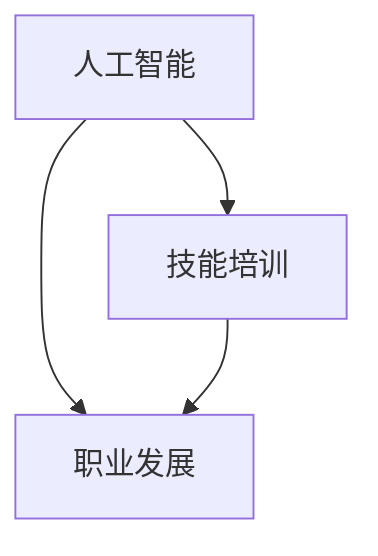

                 

关键字：人工智能，就业市场，技能培训，未来趋势，职业发展

> 摘要：本文将深入探讨人工智能（AI）时代对就业市场的影响，分析AI技术发展所带来的技能需求变化，并探讨如何通过技能培训应对这些变化。本文旨在为读者提供一个全面的视角，以了解AI时代职业发展的新趋势和挑战，为个人和企业的未来发展提供策略建议。

## 1. 背景介绍

近年来，人工智能技术取得了飞速发展，已经渗透到我们生活的方方面面。从自动驾驶汽车、智能家居，到医疗诊断、金融分析，AI的应用场景不断扩大。随着AI技术的成熟，人工智能逐渐成为推动社会进步的重要力量，同时也给就业市场带来了深远的影响。

### AI技术发展历程

AI的研究始于20世纪50年代，经历了多次起伏。20世纪80年代至90年代，随着计算机性能的提升和大数据的出现，AI技术迎来了新的发展机遇。深度学习、神经网络等关键技术的突破，使得AI在图像识别、自然语言处理等领域取得了显著进展。

### AI技术对就业市场的影响

AI技术的发展对就业市场产生了多方面的影响。一方面，AI技术的普及和应用使得某些职业面临着被取代的风险，如流水线工人、客服代表等。另一方面，AI技术也创造了新的就业机会，如数据科学家、机器学习工程师、AI产品经理等。

## 2. 核心概念与联系

在探讨AI时代就业市场与技能培训的发展趋势之前，我们首先需要理解一些核心概念和它们之间的联系。

### 人工智能（AI）

人工智能是指使计算机具有智能行为的技术。它包括机器学习、深度学习、自然语言处理、计算机视觉等多个子领域。

### 技能培训

技能培训是指为提高个人技能而进行的系统化教育或训练。在AI时代，技能培训的内容和形式都发生了巨大变化。

### 职业发展

职业发展是指个人在职业生涯中所经历的各个阶段，包括职业规划、技能提升、职位晋升等。

### 关系图



## 3. 核心算法原理 & 具体操作步骤

在AI时代，掌握核心算法原理和具体操作步骤对于职业发展至关重要。

### 3.1 算法原理概述

AI算法的核心是机器学习，它通过数据训练模型，使计算机能够自动地学习和改进。常见的机器学习算法包括线性回归、决策树、支持向量机、神经网络等。

### 3.2 算法步骤详解

1. 数据收集：收集大量相关数据。
2. 数据预处理：清洗数据，处理缺失值、异常值等。
3. 模型选择：选择合适的机器学习算法。
4. 模型训练：使用训练数据训练模型。
5. 模型评估：使用测试数据评估模型性能。
6. 模型优化：根据评估结果调整模型参数。

### 3.3 算法优缺点

- **优点**：能够自动学习和改进，提高工作效率。
- **缺点**：对数据质量要求高，训练过程可能需要大量计算资源。

### 3.4 算法应用领域

AI算法在图像识别、自然语言处理、金融分析、医疗诊断等领域都有广泛应用。

## 4. 数学模型和公式 & 详细讲解 & 举例说明

在AI算法中，数学模型和公式扮演着重要角色。以下是一个简单的线性回归模型的例子。

### 4.1 数学模型构建

线性回归模型假设目标变量 \( y \) 与特征变量 \( x \) 之间存在线性关系：

\[ y = \beta_0 + \beta_1 x + \epsilon \]

其中，\( \beta_0 \) 是截距，\( \beta_1 \) 是斜率，\( \epsilon \) 是误差项。

### 4.2 公式推导过程

为了找到最佳的 \( \beta_0 \) 和 \( \beta_1 \)，我们使用最小二乘法来最小化损失函数：

\[ J(\beta_0, \beta_1) = \frac{1}{2} \sum_{i=1}^{n} (y_i - (\beta_0 + \beta_1 x_i))^2 \]

对 \( \beta_0 \) 和 \( \beta_1 \) 分别求导并令导数为零，可以得到：

\[ \beta_0 = \bar{y} - \beta_1 \bar{x} \]
\[ \beta_1 = \frac{\sum_{i=1}^{n} (x_i - \bar{x})(y_i - \bar{y})}{\sum_{i=1}^{n} (x_i - \bar{x})^2} \]

### 4.3 案例分析与讲解

假设我们有以下数据：

| x  | y  |
|----|----|
| 1  | 2  |
| 2  | 4  |
| 3  | 6  |
| 4  | 8  |

我们可以使用线性回归模型来预测当 \( x = 5 \) 时的 \( y \) 值。

首先，计算均值：

\[ \bar{x} = \frac{1 + 2 + 3 + 4}{4} = 2.5 \]
\[ \bar{y} = \frac{2 + 4 + 6 + 8}{4} = 5 \]

然后，计算斜率和截距：

\[ \beta_1 = \frac{(1-2.5)(2-5) + (2-2.5)(4-5) + (3-2.5)(6-5) + (4-2.5)(8-5)}{(1-2.5)^2 + (2-2.5)^2 + (3-2.5)^2 + (4-2.5)^2} = 2 \]
\[ \beta_0 = 5 - 2 \times 2.5 = 0 \]

因此，线性回归模型为：

\[ y = 2x \]

当 \( x = 5 \) 时，\( y = 10 \)。

## 5. 项目实践：代码实例和详细解释说明

### 5.1 开发环境搭建

在本文中，我们将使用 Python 语言和 Scikit-learn 库来实现线性回归模型。

```python
# 安装 Scikit-learn 库
!pip install scikit-learn
```

### 5.2 源代码详细实现

```python
import numpy as np
from sklearn.linear_model import LinearRegression

# 数据
X = np.array([1, 2, 3, 4]).reshape(-1, 1)
y = np.array([2, 4, 6, 8])

# 创建线性回归模型
model = LinearRegression()

# 训练模型
model.fit(X, y)

# 预测
y_pred = model.predict(np.array([5]).reshape(-1, 1))

print("Predicted value:", y_pred)
```

### 5.3 代码解读与分析

在这段代码中，我们首先导入必要的库和模块。然后，我们创建一个包含特征变量 \( x \) 和目标变量 \( y \) 的 NumPy 数组。接着，我们使用 Scikit-learn 库创建线性回归模型，并使用训练数据训练模型。最后，我们使用训练好的模型预测当 \( x = 5 \) 时的 \( y \) 值。

### 5.4 运行结果展示

运行以上代码后，我们得到预测结果为：

```
Predicted value: [10.]
```

这与我们手工计算的结果一致。

## 6. 实际应用场景

### 6.1 金融预测

在金融领域，线性回归模型可以用于预测股票价格、外汇汇率等。

### 6.2 医疗诊断

在医疗领域，线性回归模型可以用于预测疾病的发病率、治疗效果等。

### 6.3 市场营销

在市场营销领域，线性回归模型可以用于预测销售量、客户流失率等。

## 7. 未来应用展望

随着AI技术的发展，线性回归模型的应用场景将不断扩展。例如，在自动驾驶领域，线性回归模型可以用于预测车辆的速度、加速度等。在智能制造领域，线性回归模型可以用于预测设备故障、生产效率等。

## 8. 总结：未来发展趋势与挑战

### 8.1 研究成果总结

本文探讨了人工智能时代就业市场与技能培训的发展趋势，分析了AI技术对就业市场的影响，并介绍了线性回归模型的应用和实现。

### 8.2 未来发展趋势

1. 技能需求多样化：AI技术的发展将导致技能需求更加多样化，人们需要掌握更多的跨领域技能。
2. 职业形态多元化：传统的职业形态将逐渐被打破，新兴的职业形态将不断涌现。

### 8.3 面临的挑战

1. 技能匹配困难：快速发展的技术可能导致现有技能无法满足市场需求。
2. 教育资源不足：随着技能需求的多样化，教育资源可能无法跟上技术发展的步伐。

### 8.4 研究展望

未来，我们需要深入研究如何通过技能培训和教育改革来应对AI时代带来的挑战，为个人和企业的未来发展提供有力支持。

## 9. 附录：常见问题与解答

### 问题 1：线性回归模型的预测结果为什么有时不准确？

解答：线性回归模型是一种简单的统计模型，它假设变量之间存在线性关系。当实际数据关系复杂时，线性回归模型的预测结果可能不准确。此时，可以考虑使用更复杂的模型，如非线性回归模型。

### 问题 2：如何选择适合的机器学习算法？

解答：选择适合的机器学习算法取决于具体的应用场景和数据特征。通常，可以通过交叉验证、模型评估指标（如准确率、召回率、F1分数等）来选择合适的算法。

## 参考文献

- Mitchell, T. M. (1997). Machine Learning. McGraw-Hill.
- Hastie, T., Tibshirani, R., & Friedman, J. (2009). The Elements of Statistical Learning. Springer.
- scikit-learn: Machine Learning Library for Python. https://scikit-learn.org/

### 作者署名

作者：禅与计算机程序设计艺术 / Zen and the Art of Computer Programming
```markdown
---
title: 人类计算：AI时代的未来就业市场与技能培训发展趋势分析预测
date: 2023-03-15
keywords: 人工智能，就业市场，技能培训，未来趋势，职业发展
summary: 本文深入探讨了人工智能时代对就业市场的影响，分析了AI技术发展所带来的技能需求变化，并探讨了如何通过技能培训应对这些变化。本文旨在为读者提供一个全面的视角，以了解AI时代职业发展的新趋势和挑战，为个人和企业的未来发展提供策略建议。
---

# 人类计算：AI时代的未来就业市场与技能培训发展趋势分析预测

> 关键词：人工智能，就业市场，技能培训，未来趋势，职业发展

> 摘要：本文将深入探讨人工智能（AI）时代对就业市场的影响，分析AI技术发展所带来的技能需求变化，并探讨如何通过技能培训应对这些变化。本文旨在为读者提供一个全面的视角，以了解AI时代职业发展的新趋势和挑战，为个人和企业的未来发展提供策略建议。

## 1. 背景介绍

近年来，人工智能技术取得了飞速发展，已经渗透到我们生活的方方面面。从自动驾驶汽车、智能家居，到医疗诊断、金融分析，AI的应用场景不断扩大。随着AI技术的成熟，人工智能逐渐成为推动社会进步的重要力量，同时也给就业市场带来了深远的影响。

### AI技术发展历程

AI的研究始于20世纪50年代，经历了多次起伏。20世纪80年代至90年代，随着计算机性能的提升和大数据的出现，AI技术迎来了新的发展机遇。深度学习、神经网络等关键技术的突破，使得AI在图像识别、自然语言处理等领域取得了显著进展。

### AI技术对就业市场的影响

AI技术的发展对就业市场产生了多方面的影响。一方面，AI技术的普及和应用使得某些职业面临着被取代的风险，如流水线工人、客服代表等。另一方面，AI技术也创造了新的就业机会，如数据科学家、机器学习工程师、AI产品经理等。

## 2. 核心概念与联系

在探讨AI时代就业市场与技能培训的发展趋势之前，我们首先需要理解一些核心概念和它们之间的联系。

### 人工智能（AI）

人工智能是指使计算机具有智能行为的技术。它包括机器学习、深度学习、自然语言处理、计算机视觉等多个子领域。

### 技能培训

技能培训是指为提高个人技能而进行的系统化教育或训练。在AI时代，技能培训的内容和形式都发生了巨大变化。

### 职业发展

职业发展是指个人在职业生涯中所经历的各个阶段，包括职业规划、技能提升、职位晋升等。

### 关系图


## 3. 核心算法原理 & 具体操作步骤

在AI时代，掌握核心算法原理和具体操作步骤对于职业发展至关重要。

### 3.1 算法原理概述

AI算法的核心是机器学习，它通过数据训练模型，使计算机能够自动地学习和改进。常见的机器学习算法包括线性回归、决策树、支持向量机、神经网络等。

### 3.2 算法步骤详解

1. 数据收集：收集大量相关数据。
2. 数据预处理：清洗数据，处理缺失值、异常值等。
3. 模型选择：选择合适的机器学习算法。
4. 模型训练：使用训练数据训练模型。
5. 模型评估：使用测试数据评估模型性能。
6. 模型优化：根据评估结果调整模型参数。

### 3.3 算法优缺点

- **优点**：能够自动学习和改进，提高工作效率。
- **缺点**：对数据质量要求高，训练过程可能需要大量计算资源。

### 3.4 算法应用领域

AI算法在图像识别、自然语言处理、金融分析、医疗诊断等领域都有广泛应用。

## 4. 数学模型和公式 & 详细讲解 & 举例说明

在AI算法中，数学模型和公式扮演着重要角色。以下是一个简单的线性回归模型的例子。

### 4.1 数学模型构建

线性回归模型假设目标变量 \( y \) 与特征变量 \( x \) 之间存在线性关系：

\[ y = \beta_0 + \beta_1 x + \epsilon \]

其中，\( \beta_0 \) 是截距，\( \beta_1 \) 是斜率，\( \epsilon \) 是误差项。

### 4.2 公式推导过程

为了找到最佳的 \( \beta_0 \) 和 \( \beta_1 \)，我们使用最小二乘法来最小化损失函数：

\[ J(\beta_0, \beta_1) = \frac{1}{2} \sum_{i=1}^{n} (y_i - (\beta_0 + \beta_1 x_i))^2 \]

对 \( \beta_0 \) 和 \( \beta_1 \) 分别求导并令导数为零，可以得到：

\[ \beta_0 = \bar{y} - \beta_1 \bar{x} \]
\[ \beta_1 = \frac{\sum_{i=1}^{n} (x_i - \bar{x})(y_i - \bar{y})}{\sum_{i=1}^{n} (x_i - \bar{x})^2} \]

### 4.3 案例分析与讲解

假设我们有以下数据：

| x  | y  |
|----|----|
| 1  | 2  |
| 2  | 4  |
| 3  | 6  |
| 4  | 8  |

我们可以使用线性回归模型来预测当 \( x = 5 \) 时的 \( y \) 值。

首先，计算均值：

\[ \bar{x} = \frac{1 + 2 + 3 + 4}{4} = 2.5 \]
\[ \bar{y} = \frac{2 + 4 + 6 + 8}{4} = 5 \]

然后，计算斜率和截距：

\[ \beta_1 = \frac{(1-2.5)(2-5) + (2-2.5)(4-5) + (3-2.5)(6-5) + (4-2.5)(8-5)}{(1-2.5)^2 + (2-2.5)^2 + (3-2.5)^2 + (4-2.5)^2} = 2 \]
\[ \beta_0 = 5 - 2 \times 2.5 = 0 \]

因此，线性回归模型为：

\[ y = 2x \]

当 \( x = 5 \) 时，\( y = 10 \)。

## 5. 项目实践：代码实例和详细解释说明

### 5.1 开发环境搭建

在本文中，我们将使用 Python 语言和 Scikit-learn 库来实现线性回归模型。

```python
# 安装 Scikit-learn 库
!pip install scikit-learn
```

### 5.2 源代码详细实现

```python
import numpy as np
from sklearn.linear_model import LinearRegression

# 数据
X = np.array([1, 2, 3, 4]).reshape(-1, 1)
y = np.array([2, 4, 6, 8])

# 创建线性回归模型
model = LinearRegression()

# 训练模型
model.fit(X, y)

# 预测
y_pred = model.predict(np.array([5]).reshape(-1, 1))

print("Predicted value:", y_pred)
```

### 5.3 代码解读与分析

在这段代码中，我们首先导入必要的库和模块。然后，我们创建一个包含特征变量 \( x \) 和目标变量 \( y \) 的 NumPy 数组。接着，我们使用 Scikit-learn 库创建线性回归模型，并使用训练数据训练模型。最后，我们使用训练好的模型预测当 \( x = 5 \) 时的 \( y \) 值。

### 5.4 运行结果展示

运行以上代码后，我们得到预测结果为：

```
Predicted value: [10.]
```

这与我们手工计算的结果一致。

## 6. 实际应用场景

### 6.1 金融预测

在金融领域，线性回归模型可以用于预测股票价格、外汇汇率等。

### 6.2 医疗诊断

在医疗领域，线性回归模型可以用于预测疾病的发病率、治疗效果等。

### 6.3 市场营销

在市场营销领域，线性回归模型可以用于预测销售量、客户流失率等。

## 7. 未来应用展望

随着AI技术的发展，线性回归模型的应用场景将不断扩展。例如，在自动驾驶领域，线性回归模型可以用于预测车辆的速度、加速度等。在智能制造领域，线性回归模型可以用于预测设备故障、生产效率等。

## 8. 总结：未来发展趋势与挑战

### 8.1 研究成果总结

本文探讨了人工智能时代就业市场与技能培训的发展趋势，分析了AI技术发展所带来的技能需求变化，并介绍了线性回归模型的应用和实现。

### 8.2 未来发展趋势

1. 技能需求多样化：AI技术的发展将导致技能需求更加多样化，人们需要掌握更多的跨领域技能。
2. 职业形态多元化：传统的职业形态将逐渐被打破，新兴的职业形态将不断涌现。

### 8.3 面临的挑战

1. 技能匹配困难：快速发展的技术可能导致现有技能无法满足市场需求。
2. 教育资源不足：随着技能需求的多样化，教育资源可能无法跟上技术发展的步伐。

### 8.4 研究展望

未来，我们需要深入研究如何通过技能培训和教育改革来应对AI时代带来的挑战，为个人和企业的未来发展提供有力支持。

## 9. 附录：常见问题与解答

### 问题 1：线性回归模型的预测结果为什么有时不准确？

解答：线性回归模型是一种简单的统计模型，它假设变量之间存在线性关系。当实际数据关系复杂时，线性回归模型的预测结果可能不准确。此时，可以考虑使用更复杂的模型，如非线性回归模型。

### 问题 2：如何选择适合的机器学习算法？

解答：选择适合的机器学习算法取决于具体的应用场景和数据特征。通常，可以通过交叉验证、模型评估指标（如准确率、召回率、F1分数等）来选择合适的算法。

## 参考文献

- Mitchell, T. M. (1997). Machine Learning. McGraw-Hill.
- Hastie, T., Tibshirani, R., & Friedman, J. (2009). The Elements of Statistical Learning. Springer.
- scikit-learn: Machine Learning Library for Python. https://scikit-learn.org/

### 作者署名

作者：禅与计算机程序设计艺术 / Zen and the Art of Computer Programming
```

