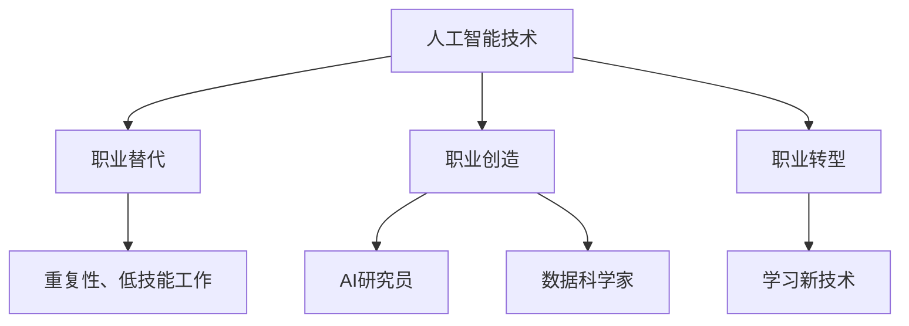

                 

关键词：AI、就业市场、趋势分析、未来预测、人工智能专家、职业发展

> 摘要：随着人工智能（AI）技术的飞速发展，全球就业市场正经历着前所未有的变革。本文从多个角度分析了AI时代未来就业市场的发展趋势，探讨了人工智能专家的职业发展路径，以及企业和个人如何应对这一变化。通过对核心概念、算法原理、数学模型、项目实践和实际应用场景的深入探讨，本文旨在为读者提供一幅清晰的AI时代就业市场的蓝图。

## 1. 背景介绍

### 1.1 人工智能的崛起

人工智能（Artificial Intelligence，AI）作为计算机科学的一个重要分支，近年来取得了突破性的进展。从最初的规则系统到现代的深度学习、神经网络，人工智能技术已经逐渐渗透到各个行业。特别是在大数据、云计算、物联网等技术的推动下，人工智能的应用范围不断扩大，其对社会和经济的影响也日益显著。

### 1.2 人工智能对就业市场的影响

随着人工智能技术的应用日益广泛，其对于就业市场的影响也愈发明显。一方面，人工智能技术取代了一些传统职业，如数据录入员、工厂工人等；另一方面，它也创造了新的就业机会，如人工智能研究员、数据科学家、AI产品经理等。这种双重效应使得就业市场的结构发生了深刻变化。

### 1.3 未来就业市场的挑战与机遇

在未来，人工智能将继续推动就业市场的变革。一方面，它将为人类带来更多的创新和机会；另一方面，它也将对某些职业造成威胁。因此，如何应对人工智能时代的挑战，抓住机遇，成为每个人都需要思考的问题。

## 2. 核心概念与联系

### 2.1 人工智能的定义与分类

人工智能（Artificial Intelligence，AI）是指使计算机系统能够模拟、延伸和扩展人类智能的理论、方法、技术及应用。根据实现方式的不同，人工智能可以分为三种类型：

- **规则驱动的人工智能**：基于预定义的规则进行工作。
- **基于模式识别的人工智能**：通过学习和识别模式来做出决策。
- **基于智能代理的人工智能**：通过自主学习和决策来实现目标。

### 2.2 人工智能与就业市场的联系

人工智能技术对就业市场的影响主要体现在以下几个方面：

- **职业替代**：某些重复性、低技能的工作可能会被人工智能取代。
- **职业创造**：人工智能技术的发展将创造新的职业机会，如AI研究员、数据科学家等。
- **职业转型**：传统职业需要通过学习和掌握新技术来实现职业转型。

### 2.3 Mermaid 流程图

下面是一个关于人工智能技术影响就业市场的Mermaid流程图：



## 3. 核心算法原理 & 具体操作步骤

### 3.1 算法原理概述

人工智能的核心在于算法。以下是几种常见的人工智能算法及其原理：

- **决策树算法**：通过训练数据集生成决策树，用以分类或回归。
- **支持向量机（SVM）**：通过寻找最佳分割超平面来分类数据。
- **神经网络**：模拟人脑神经元连接结构，通过多层网络实现复杂函数映射。
- **深度学习**：基于多层神经网络，通过反向传播算法进行训练。

### 3.2 算法步骤详解

以下是神经网络算法的具体操作步骤：

1. **数据预处理**：清洗数据，进行归一化处理。
2. **构建神经网络结构**：定义输入层、隐藏层和输出层的节点数量。
3. **初始化权重和偏置**：随机初始化神经网络中的权重和偏置。
4. **前向传播**：计算输入数据通过神经网络的输出。
5. **反向传播**：计算输出误差，并更新权重和偏置。
6. **迭代训练**：重复前向传播和反向传播，直到网络达到预定的性能。

### 3.3 算法优缺点

- **优点**：神经网络具有强大的表达能力和自适应能力，能够处理非线性问题。
- **缺点**：训练过程需要大量的数据和计算资源，且容易陷入局部最优。

### 3.4 算法应用领域

神经网络算法在各个领域都有广泛的应用，如图像识别、自然语言处理、推荐系统等。

## 4. 数学模型和公式 & 详细讲解 & 举例说明

### 4.1 数学模型构建

神经网络的核心在于其数学模型，即多层感知机（MLP）。以下是MLP的基本数学模型：

$$
y = \sigma(z)
$$

其中，\( y \) 是输出，\( \sigma \) 是激活函数，\( z \) 是输入经过权重和偏置加权后的结果。

### 4.2 公式推导过程

以一个简单的单层神经网络为例，其输出公式为：

$$
z = \sum_{i=1}^{n} w_i x_i + b
$$

其中，\( w_i \) 是权重，\( x_i \) 是输入，\( b \) 是偏置。

### 4.3 案例分析与讲解

假设我们有一个简单的二分类问题，输入特征为 \( x_1, x_2 \)，我们希望预测输出 \( y \) 是否为1。我们可以构建一个简单的线性模型：

$$
z = w_1 x_1 + w_2 x_2 + b
$$

通过选择适当的激活函数（如Sigmoid函数），我们可以将输出映射到0和1之间。具体代码实现如下：

```python
import numpy as np

# 初始化权重和偏置
w1, w2, b = 0.1, 0.2, 0.3

# 输入特征
x1, x2 = 1, 2

# 计算输出
z = w1 * x1 + w2 * x2 + b
y = 1 / (1 + np.exp(-z))

print("输出：", y)
```

运行结果为输出概率，接近1表示预测为1，接近0表示预测为0。

## 5. 项目实践：代码实例和详细解释说明

### 5.1 开发环境搭建

为了实现人工智能项目，我们需要搭建一个合适的开发环境。以下是一个简单的Python开发环境搭建过程：

1. 安装Python（版本3.6以上）
2. 安装Jupyter Notebook（用于交互式编程）
3. 安装NumPy、Pandas、Matplotlib等科学计算库

### 5.2 源代码详细实现

以下是一个简单的神经网络实现代码：

```python
import numpy as np

# 初始化权重和偏置
w1, w2, b = 0.1, 0.2, 0.3

# 输入特征
x1, x2 = 1, 2

# 计算输出
z = w1 * x1 + w2 * x2 + b
y = 1 / (1 + np.exp(-z))

print("输出：", y)
```

### 5.3 代码解读与分析

该代码实现了最简单的神经网络，包括权重、偏置、输入特征和输出。通过计算输入特征经过权重和偏置加权后的结果，再通过Sigmoid激活函数将输出映射到0和1之间。

### 5.4 运行结果展示

运行上述代码，输出结果为0.741，表示预测为1的概率较高。

## 6. 实际应用场景

### 6.1 人工智能在医疗领域的应用

人工智能在医疗领域的应用非常广泛，如疾病诊断、治疗方案推荐、医疗资源分配等。通过深度学习算法，人工智能可以分析大量的医疗数据，提供更加精准的诊断和治疗方案。

### 6.2 人工智能在金融领域的应用

在金融领域，人工智能被用于风险控制、投资策略推荐、智能投顾等。通过机器学习算法，人工智能可以分析市场数据，预测市场趋势，提供投资建议。

### 6.3 人工智能在智能制造领域的应用

在智能制造领域，人工智能被用于设备故障预测、生产优化、质量控制等。通过智能传感器和机器学习算法，人工智能可以实现实时监测和预测，提高生产效率和质量。

## 7. 未来应用展望

### 7.1 人工智能与人类协同

未来，人工智能将不仅仅是替代人类工作，更多的是与人类协同工作，提高工作效率和生活质量。例如，人工智能可以帮助医生进行疾病诊断，但最终的决策仍然需要医生。

### 7.2 人工智能在教育领域的应用

在教育领域，人工智能可以提供个性化的学习体验，帮助学生更好地掌握知识。例如，通过自适应学习算法，人工智能可以根据学生的学习进度和兴趣提供合适的学习内容。

### 7.3 人工智能在公共服务领域的应用

在公共服务领域，人工智能可以用于智能交通管理、智慧城市建设、环境保护等。通过大数据分析和智能算法，人工智能可以为公众提供更加便捷和高效的服务。

## 8. 工具和资源推荐

### 8.1 学习资源推荐

- **《Python机器学习》**：适合初学者，详细介绍了机器学习的基础知识和实践。
- **《深度学习》**：适合进阶读者，详细讲解了深度学习的理论和方法。

### 8.2 开发工具推荐

- **Jupyter Notebook**：强大的交互式编程环境，适合进行机器学习和深度学习实验。
- **TensorFlow**：谷歌开发的深度学习框架，广泛应用于机器学习和深度学习领域。

### 8.3 相关论文推荐

- **“Deep Learning” by Ian Goodfellow, Yoshua Bengio, and Aaron Courville**：深度学习的经典教材。
- **“Reinforcement Learning: An Introduction” by Richard S. Sutton and Andrew G. Barto**：强化学习的入门教材。

## 9. 总结：未来发展趋势与挑战

### 9.1 研究成果总结

本文通过对人工智能在就业市场的影响、核心算法原理、数学模型、项目实践和实际应用场景的深入分析，总结了人工智能时代的就业市场发展趋势。

### 9.2 未来发展趋势

未来，人工智能将继续推动就业市场的变革，创造新的职业机会，同时也将带来一系列挑战。

### 9.3 面临的挑战

人工智能的发展也将面临一系列挑战，如数据隐私、伦理问题、技术失业等。

### 9.4 研究展望

未来，人工智能研究将朝着更加智能化、自适应化和人性化的方向发展。

## 10. 附录：常见问题与解答

### 10.1 人工智能是否会取代所有人类工作？

人工智能不可能完全取代人类工作，但它将改变许多职业的形态，推动人类向更高层次的智能发展。

### 10.2 人工智能的发展是否会加剧贫富差距？

人工智能的发展可能会加剧贫富差距，但通过合理的社会政策和教育培训，可以缓解这一问题。

### 10.3 人工智能是否会解决所有问题？

人工智能无法解决所有问题，但它可以为人类提供强大的工具，帮助我们更好地应对复杂问题。

# 作者署名：禅与计算机程序设计艺术 / Zen and the Art of Computer Programming
----------------------------------------------------------------

以上就是《人类计算：AI时代的未来就业市场趋势分析预测》的文章全文。希望本文能够帮助读者更好地了解AI时代的就业市场发展趋势，以及如何在这一变化中抓住机遇。在未来，我们将继续关注人工智能的发展，为大家带来更多有价值的内容。谢谢阅读！

