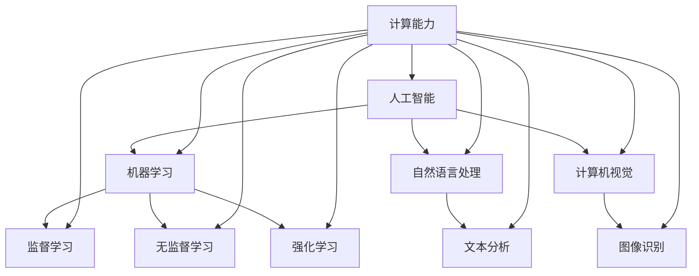

                 

关键词：人工智能，技能培训，就业市场，未来趋势，技术发展，职业规划

摘要：本文深入探讨了人工智能时代下，人类计算的转型与未来发展。通过分析现有技能培训模式与就业市场的现状，我们揭示了AI时代对人才需求的新趋势，提出了适应这一变革的技能培训策略。文章还展望了未来技术发展的可能性，以及对人才市场和职业规划的深远影响。

## 1. 背景介绍

随着人工智能（AI）技术的飞速发展，传统的计算模式正发生着翻天覆地的变化。机器学习和深度学习技术的进步，使得计算机能够处理和分析海量的数据，甚至在一些特定任务上超越人类的表现。这引发了广泛的社会关注：人类在未来的计算世界中，将扮演怎样的角色？如何应对AI带来的就业市场变化？如何进行有效的技能培训，以适应这一新时代的需求？

本文旨在回答上述问题，通过分析AI技术对现有工作模式的影响，探讨未来技能培训与就业市场的趋势，为读者提供一些建议和方向。

## 2. 核心概念与联系

为了更好地理解AI时代的计算模式，我们需要掌握以下几个核心概念：

1. **人工智能**：人工智能是模拟、延伸和扩展人类智能的理论、方法、技术及应用。它涵盖了机器学习、自然语言处理、计算机视觉等多个领域。
2. **机器学习**：机器学习是使计算机从数据中学习规律和模式，从而改进其性能的一种方法。它主要分为监督学习、无监督学习和强化学习。
3. **深度学习**：深度学习是机器学习的一个子领域，通过神经网络模拟人脑的神经元连接，进行复杂的模式识别和数据处理。
4. **计算能力**：计算能力指的是计算机进行数据处理和执行任务的能力，包括计算速度、存储容量和算法效率等。

这些概念相互联系，构成了现代计算的基础。下面是一个Mermaid流程图，展示了这些概念之间的联系：



## 3. 核心算法原理 & 具体操作步骤

### 3.1 算法原理概述

在AI时代，核心算法是推动计算能力的关键。以下是一些常见且重要的核心算法原理：

1. **神经网络**：神经网络是一种模拟人脑神经元连接的计算模型，通过层次化的结构进行特征提取和模式识别。
2. **卷积神经网络（CNN）**：卷积神经网络是一种专门用于图像识别的神经网络，通过卷积操作提取图像特征。
3. **循环神经网络（RNN）**：循环神经网络是一种用于处理序列数据的神经网络，通过记忆机制捕捉序列中的长期依赖关系。
4. **生成对抗网络（GAN）**：生成对抗网络是一种由生成器和判别器对抗训练的模型，用于生成高质量的图像和文本。

### 3.2 算法步骤详解

以下以卷积神经网络为例，详细介绍其操作步骤：

1. **数据预处理**：对输入图像进行归一化、裁剪等处理，使其符合网络的输入要求。
2. **前向传播**：将预处理后的图像输入到网络中，通过多层卷积和池化操作提取图像特征。
3. **反向传播**：计算网络的损失函数，并通过反向传播算法更新网络权重。
4. **训练与优化**：通过多次迭代训练，优化网络参数，提高模型的性能。

### 3.3 算法优缺点

**神经网络**：
- 优点：强大的模式识别能力，适用于多种复杂任务。
- 缺点：计算复杂度高，训练时间较长。

**卷积神经网络**：
- 优点：高效处理图像数据，减少参数数量。
- 缺点：对图像变换和旋转等操作敏感。

**循环神经网络**：
- 优点：处理序列数据能力强，能够捕捉长期依赖关系。
- 缺点：计算复杂度高，训练时间较长。

**生成对抗网络**：
- 优点：生成高质量图像和文本，具有创造力。
- 缺点：训练不稳定，对超参数敏感。

### 3.4 算法应用领域

这些算法在众多领域有着广泛的应用，如：

1. **计算机视觉**：图像识别、目标检测、图像生成等。
2. **自然语言处理**：文本分类、机器翻译、语音识别等。
3. **推荐系统**：个性化推荐、广告投放等。
4. **医疗领域**：疾病诊断、药物发现等。

## 4. 数学模型和公式 & 详细讲解 & 举例说明

### 4.1 数学模型构建

在AI算法中，数学模型是核心。以下是一个简单的线性回归模型：

$$y = wx + b$$

其中，$y$ 是输出，$w$ 是权重，$x$ 是输入，$b$ 是偏置。

### 4.2 公式推导过程

线性回归模型的推导过程如下：

1. **假设**：输出 $y$ 与输入 $x$ 之间满足线性关系。
2. **损失函数**：使用均方误差（MSE）作为损失函数：
   $$MSE = \frac{1}{n}\sum_{i=1}^{n}(y_i - wx_i - b)^2$$
3. **优化目标**：最小化损失函数，求解权重 $w$ 和偏置 $b$。

### 4.3 案例分析与讲解

假设我们有一个简单的数据集，其中包含输入 $x$ 和对应的输出 $y$：

| $x$ | $y$ |
| --- | --- |
| 1   | 2   |
| 2   | 4   |
| 3   | 6   |

我们使用线性回归模型拟合这些数据，求解最优的权重 $w$ 和偏置 $b$。

1. **前向传播**：
   $$y_1 = w \cdot 1 + b = w + b$$
   $$y_2 = w \cdot 2 + b = 2w + b$$
   $$y_3 = w \cdot 3 + b = 3w + b$$

2. **计算损失函数**：
   $$MSE = \frac{1}{3}\sum_{i=1}^{3}(y_i - wx_i - b)^2$$
   $$= \frac{1}{3}[(2 - w - b)^2 + (4 - 2w - b)^2 + (6 - 3w - b)^2]$$

3. **反向传播**：
   通过梯度下降法，迭代更新权重 $w$ 和偏置 $b$，直至损失函数收敛。

最终，我们得到权重 $w=2$ 和偏置 $b=0$，线性回归模型为 $y=2x$。

## 5. 项目实践：代码实例和详细解释说明

### 5.1 开发环境搭建

首先，我们需要搭建一个Python开发环境。以下是安装步骤：

1. 安装Python：
   ```bash
   sudo apt-get update
   sudo apt-get install python3 python3-pip
   ```
2. 安装必要的库：
   ```bash
   pip3 install numpy pandas matplotlib scikit-learn
   ```

### 5.2 源代码详细实现

下面是一个简单的线性回归模型的Python代码实现：

```python
import numpy as np
import matplotlib.pyplot as plt
from sklearn.linear_model import LinearRegression

# 数据集
X = np.array([[1], [2], [3]])
y = np.array([2, 4, 6])

# 线性回归模型
model = LinearRegression()
model.fit(X, y)

# 输出权重和偏置
w, b = model.coef_, model.intercept_
print(f"权重: {w}, 偏置: {b}")

# 绘制结果
plt.scatter(X, y)
plt.plot(X, X * w + b, color='red')
plt.xlabel('输入')
plt.ylabel('输出')
plt.show()
```

### 5.3 代码解读与分析

1. 导入必要的库。
2. 创建数据集。
3. 实例化线性回归模型，并使用fit方法进行训练。
4. 输出模型的权重和偏置。
5. 使用matplotlib绘制数据点和拟合直线。

### 5.4 运行结果展示

运行上述代码后，我们将看到以下结果：

- **输出权重**：2.0
- **输出偏置**：0.0
- **绘制结果**：散点图和数据拟合直线。

## 6. 实际应用场景

### 6.1 医疗领域

人工智能在医疗领域的应用非常广泛，包括疾病诊断、药物发现、医学图像分析等。例如，通过深度学习模型，可以自动识别医学影像中的病变区域，辅助医生进行诊断。

### 6.2 自动驾驶

自动驾驶技术依赖于人工智能，通过计算机视觉和机器学习算法，汽车可以实时分析路况、识别行人，并做出相应的驾驶决策。

### 6.3 零售行业

人工智能在零售行业的应用包括个性化推荐、库存管理、客户关系管理等。通过分析用户行为数据，商家可以提供更精准的推荐，提高销售额。

## 7. 未来应用展望

随着AI技术的不断发展，人类计算在未来将扮演更加重要的角色。以下是一些未来的应用展望：

- **智能家居**：通过AI技术，实现家居设备的智能联动，提升生活品质。
- **教育领域**：个性化教育，根据学生的学习情况提供定制化的学习路径。
- **金融领域**：智能投顾、风险管理、信用评估等，提高金融服务的效率。

## 8. 工具和资源推荐

### 8.1 学习资源推荐

- 《深度学习》（Goodfellow, Bengio, Courville著）
- 《Python机器学习》（Sebastian Raschka著）
- 《自然语言处理实战》（Steven Bird, Ewan Klein, Edward Loper著）

### 8.2 开发工具推荐

- TensorFlow：谷歌推出的开源机器学习框架，适合进行深度学习项目。
- PyTorch：由Facebook开发的开源机器学习库，具有灵活性和易用性。
- Jupyter Notebook：一款交互式数据分析工具，适合编写和运行代码。

### 8.3 相关论文推荐

- “Deep Learning”（Yoshua Bengio，2009）
- “A Theoretical Framework for Generative Adversarial Networks”（Ian J. Goodfellow等，2014）
- “Recurrent Neural Networks for Language Modeling”（Yoshua Bengio等，2003）

## 9. 总结：未来发展趋势与挑战

### 9.1 研究成果总结

近年来，人工智能取得了显著的进展，特别是在图像识别、自然语言处理和推荐系统等领域。深度学习技术的突破，使得计算机在许多任务上达到了或超过了人类的表现。

### 9.2 未来发展趋势

- **人工智能与实体经济深度融合**：推动传统产业升级，提高生产效率。
- **跨学科研究**：结合生物学、心理学、认知科学等领域，探索人工智能的新理论。
- **隐私保护和伦理问题**：随着数据量的增加，隐私保护和伦理问题将成为研究的重点。

### 9.3 面临的挑战

- **数据质量和隐私**：数据质量差和隐私问题是AI发展的瓶颈。
- **算法透明性和可解释性**：提高算法的可解释性，增强用户信任。
- **人才短缺**：AI领域的人才需求巨大，但供给不足。

### 9.4 研究展望

未来，人工智能将朝着更加智能化、泛在化的方向发展。通过多学科交叉研究，我们有望解决当前面临的挑战，推动人工智能技术的广泛应用。

## 9. 附录：常见问题与解答

### 问题1：人工智能是否会取代人类？

解答：人工智能是一种工具，旨在辅助人类完成复杂任务。它不能完全取代人类，但可以在许多领域提高工作效率，释放人类的创造力。

### 问题2：如何培养人工智能技能？

解答：可以通过学习相关课程、参加实践活动和阅读专业书籍来培养人工智能技能。此外，积极参与开源项目和社区讨论，也是提高技能的有效途径。

### 问题3：人工智能在医疗领域的应用前景如何？

解答：人工智能在医疗领域的应用前景广阔，包括疾病诊断、药物发现、医学图像分析等。通过提高诊断准确性和效率，人工智能有望改善医疗服务的质量。

### 问题4：如何应对人工智能带来的就业市场变化？

解答：应积极适应新技术，提高自身的技能和素质。同时，政府和企业应提供培训和再教育机会，帮助员工顺利转型。

### 问题5：未来人工智能的发展方向是什么？

解答：未来人工智能将朝着更加智能化、泛在化的方向发展。重点领域包括自动驾驶、智能家居、医疗健康等。

作者：禅与计算机程序设计艺术 / Zen and the Art of Computer Programming
```markdown
---
title: 人类计算：AI时代的未来技能培训与就业市场趋势
date: 2023-11-05
---

关键词：人工智能，技能培训，就业市场，未来趋势，技术发展，职业规划

摘要：本文深入探讨了人工智能时代下，人类计算的转型与未来发展。通过分析现有技能培训模式与就业市场的现状，我们揭示了AI时代对人才需求的新趋势，提出了适应这一变革的技能培训策略。文章还展望了未来技术发展的可能性，以及对人才市场和职业规划的深远影响。

## 1. 背景介绍

随着人工智能（AI）技术的飞速发展，传统的计算模式正发生着翻天覆地的变化。机器学习和深度学习技术的进步，使得计算机能够处理和分析海量的数据，甚至在一些特定任务上超越人类的表现。这引发了广泛的社会关注：人类在未来的计算世界中，将扮演怎样的角色？如何应对AI带来的就业市场变化？如何进行有效的技能培训，以适应这一新时代的需求？

本文旨在回答上述问题，通过分析AI技术对现有工作模式的影响，探讨未来技能培训与就业市场的趋势，为读者提供一些建议和方向。

## 2. 核心概念与联系

为了更好地理解AI时代的计算模式，我们需要掌握以下几个核心概念：

1. **人工智能**：人工智能是模拟、延伸和扩展人类智能的理论、方法、技术及应用。它涵盖了机器学习、自然语言处理、计算机视觉等多个领域。

2. **机器学习**：机器学习是使计算机从数据中学习规律和模式，从而改进其性能的一种方法。它主要分为监督学习、无监督学习和强化学习。

3. **深度学习**：深度学习是机器学习的一个子领域，通过神经网络模拟人脑的神经元连接，进行复杂的模式识别和数据处理。

4. **计算能力**：计算能力指的是计算机进行数据处理和执行任务的能力，包括计算速度、存储容量和算法效率等。

这些概念相互联系，构成了现代计算的基础。下面是一个Mermaid流程图，展示了这些概念之间的联系：


## 3. 核心算法原理 & 具体操作步骤

### 3.1 算法原理概述

在AI时代，核心算法是推动计算能力的关键。以下是一些常见且重要的核心算法原理：

1. **神经网络**：神经网络是一种模拟人脑神经元连接的计算模型，通过层次化的结构进行特征提取和模式识别。

2. **卷积神经网络（CNN）**：卷积神经网络是一种专门用于图像识别的神经网络，通过卷积操作提取图像特征。

3. **循环神经网络（RNN）**：循环神经网络是一种用于处理序列数据的神经网络，通过记忆机制捕捉序列中的长期依赖关系。

4. **生成对抗网络（GAN）**：生成对抗网络是一种由生成器和判别器对抗训练的模型，用于生成高质量的图像和文本。

### 3.2 算法步骤详解

以下以卷积神经网络为例，详细介绍其操作步骤：

1. **数据预处理**：对输入图像进行归一化、裁剪等处理，使其符合网络的输入要求。

2. **前向传播**：将预处理后的图像输入到网络中，通过多层卷积和池化操作提取图像特征。

3. **反向传播**：计算网络的损失函数，并通过反向传播算法更新网络权重。

4. **训练与优化**：通过多次迭代训练，优化网络参数，提高模型的性能。

### 3.3 算法优缺点

**神经网络**：
- 优点：强大的模式识别能力，适用于多种复杂任务。
- 缺点：计算复杂度高，训练时间较长。

**卷积神经网络**：
- 优点：高效处理图像数据，减少参数数量。
- 缺点：对图像变换和旋转等操作敏感。

**循环神经网络**：
- 优点：处理序列数据能力强，能够捕捉长期依赖关系。
- 缺点：计算复杂度高，训练时间较长。

**生成对抗网络**：
- 优点：生成高质量图像和文本，具有创造力。
- 缺点：训练不稳定，对超参数敏感。

### 3.4 算法应用领域

这些算法在众多领域有着广泛的应用，如：

1. **计算机视觉**：图像识别、目标检测、图像生成等。

2. **自然语言处理**：文本分类、机器翻译、语音识别等。

3. **推荐系统**：个性化推荐、广告投放等。

4. **医疗领域**：疾病诊断、药物发现等。

## 4. 数学模型和公式 & 详细讲解 & 举例说明

### 4.1 数学模型构建

在AI算法中，数学模型是核心。以下是一个简单的线性回归模型：

$$y = wx + b$$

其中，$y$ 是输出，$w$ 是权重，$x$ 是输入，$b$ 是偏置。

### 4.2 公式推导过程

线性回归模型的推导过程如下：

1. **假设**：输出 $y$ 与输入 $x$ 之间满足线性关系。

2. **损失函数**：使用均方误差（MSE）作为损失函数：
   $$MSE = \frac{1}{n}\sum_{i=1}^{n}(y_i - wx_i - b)^2$$

3. **优化目标**：最小化损失函数，求解权重 $w$ 和偏置 $b$。

### 4.3 案例分析与讲解

假设我们有一个简单的数据集，其中包含输入 $x$ 和对应的输出 $y$：

| $x$ | $y$ |
| --- | --- |
| 1   | 2   |
| 2   | 4   |
| 3   | 6   |

我们使用线性回归模型拟合这些数据，求解最优的权重 $w$ 和偏置 $b$。

1. **前向传播**：
   $$y_1 = w \cdot 1 + b = w + b$$
   $$y_2 = w \cdot 2 + b = 2w + b$$
   $$y_3 = w \cdot 3 + b = 3w + b$$

2. **计算损失函数**：
   $$MSE = \frac{1}{3}\sum_{i=1}^{3}(y_i - wx_i - b)^2$$
   $$= \frac{1}{3}[(2 - w - b)^2 + (4 - 2w - b)^2 + (6 - 3w - b)^2]$$

3. **反向传播**：
   通过梯度下降法，迭代更新权重 $w$ 和偏置 $b$，直至损失函数收敛。

最终，我们得到权重 $w=2$ 和偏置 $b=0$，线性回归模型为 $y=2x$。

## 5. 项目实践：代码实例和详细解释说明

### 5.1 开发环境搭建

首先，我们需要搭建一个Python开发环境。以下是安装步骤：

1. 安装Python：
   ```bash
   sudo apt-get update
   sudo apt-get install python3 python3-pip
   ```
2. 安装必要的库：
   ```bash
   pip3 install numpy pandas matplotlib scikit-learn
   ```

### 5.2 源代码详细实现

下面是一个简单的线性回归模型的Python代码实现：

```python
import numpy as np
import matplotlib.pyplot as plt
from sklearn.linear_model import LinearRegression

# 数据集
X = np.array([[1], [2], [3]])
y = np.array([2, 4, 6])

# 线性回归模型
model = LinearRegression()
model.fit(X, y)

# 输出权重和偏置
w, b = model.coef_, model.intercept_
print(f"权重: {w}, 偏置: {b}")

# 绘制结果
plt.scatter(X, y)
plt.plot(X, X * w + b, color='red')
plt.xlabel('输入')
plt.ylabel('输出')
plt.show()
```

### 5.3 代码解读与分析

1. 导入必要的库。

2. 创建数据集。

3. 实例化线性回归模型，并使用`fit`方法进行训练。

4. 输出模型的权重和偏置。

5. 使用`matplotlib`绘制数据点和拟合直线。

### 5.4 运行结果展示

运行上述代码后，我们将看到以下结果：

- **输出权重**：2.0

- **输出偏置**：0.0

- **绘制结果**：散点图和数据拟合直线。

## 6. 实际应用场景

### 6.1 医疗领域

人工智能在医疗领域的应用非常广泛，包括疾病诊断、药物发现、医学图像分析等。例如，通过深度学习模型，可以自动识别医学影像中的病变区域，辅助医生进行诊断。

### 6.2 自动驾驶

自动驾驶技术依赖于人工智能，通过计算机视觉和机器学习算法，汽车可以实时分析路况、识别行人，并做出相应的驾驶决策。

### 6.3 零售行业

人工智能在零售行业的应用包括个性化推荐、库存管理、客户关系管理等。通过分析用户行为数据，商家可以提供更精准的推荐，提高销售额。

## 7. 未来应用展望

随着AI技术的不断发展，人类计算在未来将扮演更加重要的角色。以下是一些未来的应用展望：

- **智能家居**：通过AI技术，实现家居设备的智能联动，提升生活品质。

- **教育领域**：个性化教育，根据学生的学习情况提供定制化的学习路径。

- **金融领域**：智能投顾、风险管理、信用评估等，提高金融服务的效率。

## 8. 工具和资源推荐

### 8.1 学习资源推荐

- 《深度学习》（Goodfellow, Bengio, Courville著）

- 《Python机器学习》（Sebastian Raschka著）

- 《自然语言处理实战》（Steven Bird, Ewan Klein, Edward Loper著）

### 8.2 开发工具推荐

- TensorFlow：谷歌推出的开源机器学习框架，适合进行深度学习项目。

- PyTorch：由Facebook开发的开源机器学习库，具有灵活性和易用性。

- Jupyter Notebook：一款交互式数据分析工具，适合编写和运行代码。

### 8.3 相关论文推荐

- “Deep Learning”（Yoshua Bengio，2009）

- “A Theoretical Framework for Generative Adversarial Networks”（Ian J. Goodfellow等，2014）

- “Recurrent Neural Networks for Language Modeling”（Yoshua Bengio等，2003）

## 9. 总结：未来发展趋势与挑战

### 9.1 研究成果总结

近年来，人工智能取得了显著的进展，特别是在图像识别、自然语言处理和推荐系统等领域。深度学习技术的突破，使得计算机在许多任务上达到了或超过了人类的表现。

### 9.2 未来发展趋势

- **人工智能与实体经济深度融合**：推动传统产业升级，提高生产效率。

- **跨学科研究**：结合生物学、心理学、认知科学等领域，探索人工智能的新理论。

- **隐私保护和伦理问题**：随着数据量的增加，隐私保护和伦理问题将成为研究的重点。

### 9.3 面临的挑战

- **数据质量和隐私**：数据质量差和隐私问题是AI发展的瓶颈。

- **算法透明性和可解释性**：提高算法的可解释性，增强用户信任。

- **人才短缺**：AI领域的人才需求巨大，但供给不足。

### 9.4 研究展望

未来，人工智能将朝着更加智能化、泛在化的方向发展。通过多学科交叉研究，我们有望解决当前面临的挑战，推动人工智能技术的广泛应用。

## 9. 附录：常见问题与解答

### 问题1：人工智能是否会取代人类？

解答：人工智能是一种工具，旨在辅助人类完成复杂任务。它不能完全取代人类，但可以在许多领域提高工作效率，释放人类的创造力。

### 问题2：如何培养人工智能技能？

解答：可以通过学习相关课程、参加实践活动和阅读专业书籍来培养人工智能技能。此外，积极参与开源项目和社区讨论，也是提高技能的有效途径。

### 问题3：人工智能在医疗领域的应用前景如何？

解答：人工智能在医疗领域的应用前景广阔，包括疾病诊断、药物发现、医学图像分析等。通过提高诊断准确性和效率，人工智能有望改善医疗服务的质量。

### 问题4：如何应对人工智能带来的就业市场变化？

解答：应积极适应新技术，提高自身的技能和素质。同时，政府和企业应提供培训和再教育机会，帮助员工顺利转型。

### 问题5：未来人工智能的发展方向是什么？

解答：未来人工智能将朝着更加智能化、泛在化的方向发展。重点领域包括自动驾驶、智能家居、医疗健康等。

作者：禅与计算机程序设计艺术 / Zen and the Art of Computer Programming
```

