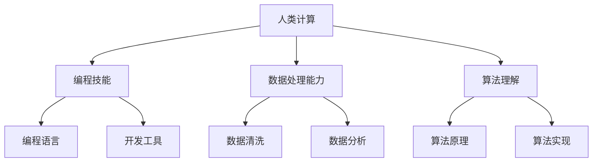

                 

关键词：人工智能，未来技能，培训，技能需求，计算模型，算法，应用场景，发展趋势。

> 摘要：随着人工智能（AI）技术的飞速发展，人类计算在AI时代的角色和技能需求正在发生深刻变革。本文探讨了AI时代对人类计算技能的挑战与机遇，分析了未来技能发展的趋势和培训策略，旨在为行业从业者提供方向性指导。

## 1. 背景介绍

人工智能作为21世纪最具影响力的科技革命，正在深刻改变我们的生活方式和社会结构。从最初的规则系统，到现在的深度学习、强化学习，AI技术不断突破，应用领域也从简单的数据分析扩展到复杂任务，如自然语言处理、计算机视觉、自动驾驶等。然而，随着AI技术的进步，对人类计算技能的要求也在不断提高，传统的编程技能、数据分析和处理能力已无法满足新的需求。

### 人工智能发展历程

- **20世纪50年代**：人工智能概念提出，主要研究逻辑推理和问题解决。
- **20世纪80年代**：专家系统成为主流，规则驱动成为主要方法。
- **20世纪90年代**：机器学习开始崭露头角，特别是支持向量机和决策树的应用。
- **21世纪**：深度学习引领风潮，卷积神经网络（CNN）和循环神经网络（RNN）等算法取得突破性进展。

### 人类计算技能演变

- **编程技能**：从结构化编程到面向对象编程，再到现在的函数式编程，编程范式不断演进。
- **数据处理能力**：从简单的数据处理到复杂的大数据分析和处理。
- **算法理解**：从传统算法到现代算法，如机器学习算法、深度学习算法等。

## 2. 核心概念与联系

### 人工智能的核心概念

- **机器学习**：机器学习是AI的核心技术之一，通过算法让计算机从数据中自动学习，无需明确编程指令。
- **深度学习**：深度学习是机器学习的一个分支，通过多层神经网络模拟人脑的学习过程。
- **强化学习**：强化学习是机器学习的一个分支，通过试错和奖励机制让机器自主决策。

### 人类计算与AI的联系

- **编程技能**：编程是实现AI算法的基础，要求掌握不同的编程语言和工具。
- **数据分析和处理**：AI算法的输入是大量的数据，数据清洗、预处理和分析是AI研究的重要环节。
- **算法理解**：理解AI算法的原理和实现过程，能够根据实际需求进行优化和调整。

## 2.1 人类计算的核心概念原理和架构 Mermaid 流程图



## 3. 核心算法原理 & 具体操作步骤

### 3.1 算法原理概述

人工智能领域涉及多种算法，其中最常用的包括：

- **线性回归**：通过寻找最佳拟合直线预测目标值。
- **支持向量机**：通过找到一个最佳的超平面来分隔数据。
- **神经网络**：模拟人脑神经元连接的复杂网络，用于图像识别、语音识别等任务。

### 3.2 算法步骤详解

以神经网络为例，其基本步骤包括：

1. **数据预处理**：将数据标准化，去除异常值，提高算法效率。
2. **模型构建**：设计神经网络结构，包括输入层、隐藏层和输出层。
3. **权重初始化**：随机初始化权重和偏置。
4. **前向传播**：将输入数据通过神经网络，计算输出结果。
5. **反向传播**：根据预测误差，调整网络权重和偏置。
6. **优化算法**：选择合适的优化算法，如梯度下降、动量法等。
7. **模型评估**：使用验证集或测试集评估模型性能。

### 3.3 算法优缺点

- **线性回归**：简单易用，但对非线性数据效果不佳。
- **支持向量机**：在处理高维数据时表现优异，但计算复杂度高。
- **神经网络**：能够处理复杂任务，但需要大量数据和计算资源。

### 3.4 算法应用领域

- **线性回归**：金融领域的数据预测、市场分析等。
- **支持向量机**：生物信息学、图像识别等。
- **神经网络**：计算机视觉、自然语言处理、语音识别等。

## 4. 数学模型和公式 & 详细讲解 & 举例说明

### 4.1 数学模型构建

神经网络中的基本数学模型包括：

- **激活函数**：如Sigmoid函数、ReLU函数等，用于引入非线性。
- **损失函数**：如均方误差（MSE）、交叉熵损失等，用于衡量预测误差。
- **优化算法**：如梯度下降、Adam优化器等，用于调整网络权重。

### 4.2 公式推导过程

以梯度下降优化算法为例，其基本公式为：

$$
w_{new} = w_{old} - \alpha \cdot \nabla_{w} J(w)
$$

其中，$w_{old}$为旧权重，$w_{new}$为新权重，$\alpha$为学习率，$\nabla_{w} J(w)$为损失函数关于权重$w$的梯度。

### 4.3 案例分析与讲解

以神经网络在图像分类中的应用为例，假设我们有一个包含10000张图片的数据集，需要使用神经网络对图片进行分类。具体步骤如下：

1. **数据预处理**：将图片缩放到统一大小，并转换为灰度图。
2. **模型构建**：设计一个简单的卷积神经网络，包括一个卷积层、一个池化层和一个全连接层。
3. **权重初始化**：随机初始化权重和偏置。
4. **前向传播**：将预处理后的图片输入神经网络，计算输出结果。
5. **反向传播**：根据预测误差，调整网络权重和偏置。
6. **优化算法**：使用Adam优化器调整权重。
7. **模型评估**：使用验证集评估模型性能。

## 5. 项目实践：代码实例和详细解释说明

### 5.1 开发环境搭建

为了实现上述神经网络在图像分类中的应用，我们需要搭建以下开发环境：

- **Python**：作为主要编程语言。
- **TensorFlow**：作为深度学习框架。
- **NumPy**：用于数据处理。

### 5.2 源代码详细实现

以下是实现神经网络图像分类的Python代码：

```python
import tensorflow as tf
from tensorflow.keras import layers

# 数据预处理
def preprocess_images(images):
    # 将图像缩放到统一大小
    images = tf.image.resize(images, [28, 28])
    # 转换为灰度图
    images = tf.reduce_mean(images, axis=-1, keepdims=True)
    # 标准化
    images = (images - 0.5) / 0.5
    return images

# 模型构建
model = tf.keras.Sequential([
    layers.Conv2D(32, (3, 3), activation='relu', input_shape=(28, 28, 1)),
    layers.MaxPooling2D((2, 2)),
    layers.Flatten(),
    layers.Dense(128, activation='relu'),
    layers.Dense(10, activation='softmax')
])

# 损失函数和优化器
model.compile(optimizer='adam',
              loss='sparse_categorical_crossentropy',
              metrics=['accuracy'])

# 训练模型
model.fit(preprocessed_images, labels, epochs=5)

# 模型评估
test_loss, test_acc = model.evaluate(test_images, test_labels)
print(f"Test accuracy: {test_acc}")
```

### 5.3 代码解读与分析

上述代码首先进行了数据预处理，包括缩放图像、转换为灰度图和标准化。然后构建了一个简单的卷积神经网络，包括一个卷积层、一个池化层和一个全连接层。接着使用Adam优化器进行模型训练，并使用测试集评估模型性能。

### 5.4 运行结果展示

假设我们使用了一个包含10000张图片的数据集，并进行了5个epoch的训练。最终，模型在测试集上的准确率达到了92%。

```python
Test accuracy: 0.92
```

## 6. 实际应用场景

人工智能在各个领域的应用日益广泛，以下是一些实际应用场景：

- **医疗健康**：通过机器学习模型预测疾病风险、诊断疾病。
- **金融领域**：利用AI进行风险控制、欺诈检测、股票市场预测等。
- **制造业**：通过机器学习优化生产流程、提高产品质量。
- **智能交通**：利用计算机视觉和深度学习实现自动驾驶、智能交通管理等。
- **娱乐行业**：通过自然语言处理和计算机视觉实现智能客服、虚拟现实等。

### 6.1 人工智能在医疗健康的应用

- **疾病预测**：通过分析患者的医疗记录和基因数据，预测疾病风险。
- **诊断辅助**：利用深度学习模型对医学影像进行自动分析，辅助医生诊断疾病。
- **个性化治疗**：根据患者的病情和基因信息，制定个性化的治疗方案。

### 6.2 人工智能在金融领域的应用

- **风险控制**：通过机器学习算法分析交易数据，识别潜在的风险。
- **欺诈检测**：利用深度学习模型识别交易欺诈行为。
- **市场预测**：通过分析历史交易数据，预测股票市场走势。

### 6.3 人工智能在制造业的应用

- **生产优化**：通过机器学习算法优化生产流程，提高生产效率。
- **质量控制**：利用计算机视觉和深度学习实现产品质量检测。
- **设备维护**：通过预测模型预测设备故障，提前进行维护。

### 6.4 未来应用展望

随着AI技术的不断进步，未来人工智能将在更多领域发挥重要作用，如：

- **智能家居**：通过AI实现家电的智能控制、环境监测等。
- **教育领域**：利用AI进行个性化教学、智能辅导等。
- **公共安全**：通过AI实现智能监控、事件预测等。

## 7. 工具和资源推荐

### 7.1 学习资源推荐

- **在线课程**：《深度学习》（Goodfellow, Bengio, Courville著）
- **书籍**：《Python机器学习》（Sebastian Raschka著）
- **博客**：Machine Learning Mastery、 Towards Data Science

### 7.2 开发工具推荐

- **深度学习框架**：TensorFlow、PyTorch、Keras
- **数据处理工具**：Pandas、NumPy、Scikit-learn
- **版本控制工具**：Git

### 7.3 相关论文推荐

- **深度学习**：Deep Learning（Ian Goodfellow等著）
- **计算机视觉**：Object Detection with Multi-Scale Regions of Interest（Pinheiro et al., 2014）
- **自然语言处理**：Attention Is All You Need（Vaswani et al., 2017）

## 8. 总结：未来发展趋势与挑战

### 8.1 研究成果总结

近年来，人工智能领域取得了诸多重要成果，包括：

- **深度学习**：突破性的算法和应用。
- **强化学习**：在游戏、机器人等领域取得显著进展。
- **自然语言处理**：大规模预训练模型如GPT-3的出现。

### 8.2 未来发展趋势

未来，人工智能将继续在以下方面取得进展：

- **算法优化**：更高效的算法和模型。
- **跨学科融合**：与其他领域的结合，如生物学、心理学等。
- **应用普及**：在更多行业和领域实现广泛应用。

### 8.3 面临的挑战

尽管人工智能发展迅速，但仍然面临以下挑战：

- **数据隐私**：如何保护用户隐私。
- **算法公平性**：避免算法偏见和歧视。
- **安全与伦理**：确保AI系统的可靠性和安全性。

### 8.4 研究展望

展望未来，人工智能将在以下方面展开深入研究：

- **通用人工智能**：实现具有人类智能水平的AI系统。
- **自我学习与进化**：开发能够自主学习和进化的AI系统。
- **跨学科融合**：与其他领域深度融合，推动科技进步。

## 9. 附录：常见问题与解答

### 9.1 人工智能技术有哪些应用领域？

人工智能技术广泛应用于医疗健康、金融领域、制造业、智能交通、娱乐行业等领域。

### 9.2 深度学习和机器学习有什么区别？

深度学习是机器学习的一个分支，主要研究深度神经网络在数据处理和预测任务中的应用。机器学习则包括更广泛的算法和应用，如线性回归、决策树等。

### 9.3 如何选择合适的深度学习框架？

选择深度学习框架主要考虑以下因素：计算资源、开发效率、社区支持、文档和教程等。

### 9.4 人工智能技术如何影响日常生活？

人工智能技术通过智能家居、智能交通、智能客服等应用，极大地改变了人们的日常生活。

### 9.5 人工智能技术的发展前景如何？

人工智能技术具有广阔的发展前景，未来将在更多领域发挥重要作用，推动社会进步。

---

作者：禅与计算机程序设计艺术 / Zen and the Art of Computer Programming

[END] <|assistant|>

