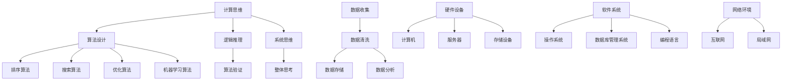

                 

关键词：人工智能、计算思维、数字时代、未来趋势、技术进步

摘要：随着人工智能和数字化技术的迅猛发展，人类计算正逐渐成为塑造数字时代未来的关键力量。本文旨在探讨人类计算的概念、核心原理以及在未来可能面临的挑战和机遇，旨在为读者提供一个全面而深入的视角，以理解人类计算在技术进步中的重要作用。

## 1. 背景介绍

在数字时代的浪潮中，计算已经深入到我们生活的方方面面。从智能手机到超级计算机，从云计算到大数据分析，计算无处不在。然而，这些计算的背后，是人类智慧的结晶。人类计算不仅仅是指计算机的运算能力，更是一种思考方式、解决问题的方法，以及我们与技术和数据的互动。

人类计算的历史可以追溯到计算机科学的起源。从最初的机械计算机到现代的量子计算机，人类一直在探索如何更高效地进行计算。随着人工智能技术的崛起，人类计算获得了新的动力，不再仅仅依赖于硬件的升级，而是通过算法、数据和智能的融合，实现了前所未有的计算能力和效率。

本文将围绕以下几个核心问题展开讨论：

- 人类计算的定义和内涵是什么？
- 人类计算的核心原理是什么？
- 人类计算在不同领域的应用现状如何？
- 人类计算在未来面临哪些挑战和机遇？

通过上述问题的探讨，我们希望能够为读者提供一幅人类计算在数字时代中的全景图，从而更好地理解其重要性以及未来的发展趋势。

### 1.1 人工智能时代的计算革命

人工智能的崛起标志着人类计算进入了一个全新的时代。传统的人工计算依赖于人类的智慧和经验，而人工智能则通过机器学习和深度学习等算法，使得计算机能够自主学习、自适应变化。这种计算模式不仅大大提高了计算的效率，还拓展了计算的应用范围。

人工智能时代的计算革命带来了以下几个显著变化：

- **计算能力的大幅提升**：人工智能算法能够处理海量数据，进行复杂的计算和预测，超越了人类在速度和精度上的能力。
- **计算模式的转变**：从人类主导的计算转向机器主导的计算，人类更多地充当监督者和调整者，而机器则负责大量的数据处理和决策。
- **计算领域的扩展**：人工智能将计算扩展到了许多原本无法想象的应用场景，如自然语言处理、图像识别、自动驾驶等，极大地丰富了计算的内涵。

### 1.2 人类计算的重要性

在数字化时代，人类计算的重要性不可忽视。首先，它是推动技术进步的重要动力。计算机科学的发展离不开对人类计算思维和方法的深入理解。其次，人类计算是解决复杂问题的关键手段。许多现实问题，如医疗诊断、金融分析、环境保护等，都需要通过复杂的计算来得出解决方案。

此外，人类计算还对社会经济发展有着深远的影响。通过数据分析和智能决策，企业和政府能够更加高效地运营和管理资源，提高生产力和竞争力。同时，人类计算也为人们提供了更加便捷和智能的生活方式，从智能家居到在线教育，从电子商务到社交媒体，计算技术已经深深地融入到了人们的日常生活中。

### 1.3 人类计算的核心概念和架构

为了深入探讨人类计算，我们需要理解其核心概念和架构。人类计算包括以下几个关键组成部分：

- **计算思维**：这是一种解决问题的方法论，强调逻辑思考、抽象思维和系统思维，是进行有效计算的基础。
- **算法**：算法是解决问题的具体步骤和规则，是计算的核心。不同类型的算法适用于不同的问题场景。
- **数据**：数据是计算的输入和基础，没有高质量的数据，计算就失去了意义。
- **计算平台**：包括硬件设备、软件系统和网络环境，提供了计算的物理和逻辑基础。

理解这些核心概念和架构，有助于我们更好地把握人类计算的内涵和外延，从而为未来的发展提供理论基础和实践指导。

## 2. 核心概念与联系

### 2.1 计算思维

计算思维是进行人类计算的核心基础，它包括以下几个方面：

- **抽象思维**：将复杂的现实问题抽象为数学模型或算法问题，便于分析和解决。
- **算法设计**：设计解决问题的算法，选择合适的算法和数据结构，以实现高效计算。
- **逻辑推理**：通过逻辑推理验证算法的正确性和效率，确保计算结果的可靠性。
- **系统思维**：从整体的角度思考问题，分析系统的各个组成部分及其相互作用，以实现最优计算策略。

### 2.2 算法

算法是计算的核心，不同的算法适用于不同类型的问题。以下是一些常见算法类型：

- **排序算法**：如快速排序、归并排序等，用于对数据进行排序。
- **搜索算法**：如二分搜索、深度优先搜索等，用于在数据中查找特定信息。
- **优化算法**：如遗传算法、模拟退火算法等，用于求解优化问题。
- **机器学习算法**：如线性回归、决策树、神经网络等，用于从数据中学习模式和规律。

### 2.3 数据

数据是计算的基础，高质量的数据对于计算的准确性至关重要。以下是数据管理的关键环节：

- **数据收集**：通过传感器、数据库和其他渠道收集数据。
- **数据清洗**：处理和整理数据，去除噪声和错误。
- **数据存储**：将数据存储在数据库或其他存储系统中，以便后续分析和处理。
- **数据分析**：利用统计和机器学习等方法对数据进行处理和分析，提取有用的信息。

### 2.4 计算平台

计算平台包括硬件设备、软件系统和网络环境，为计算提供了必要的物理和逻辑基础。以下是计算平台的关键组成部分：

- **硬件设备**：包括计算机、服务器、存储设备等，提供了计算的硬件支持。
- **软件系统**：包括操作系统、数据库管理系统、编程语言等，提供了计算的软件支持。
- **网络环境**：包括互联网、局域网等，提供了数据传输和计算资源调度的基础。

### 2.5 Mermaid 流程图

为了更直观地展示人类计算的核心概念和架构，我们使用 Mermaid 流程图来表示。



## 3. 核心算法原理 & 具体操作步骤

### 3.1 算法原理概述

核心算法是解决特定问题的一系列步骤和规则。在人类计算中，核心算法起到了至关重要的作用。以下是几个常见核心算法的原理概述：

- **排序算法**：用于对数据进行排序，常见的排序算法有快速排序、归并排序、冒泡排序等。
- **搜索算法**：用于在数据中查找特定信息，常见的搜索算法有二分搜索、深度优先搜索、广度优先搜索等。
- **优化算法**：用于求解优化问题，如最小生成树、最短路径等，常见的优化算法有遗传算法、模拟退火算法等。
- **机器学习算法**：用于从数据中学习模式和规律，常见的机器学习算法有线性回归、决策树、神经网络等。

### 3.2 算法步骤详解

以下是上述算法的具体步骤详解：

#### 3.2.1 快速排序算法

快速排序是一种高效的排序算法，其基本思想是选择一个基准元素，将数组分为两部分，一部分小于基准元素，一部分大于基准元素，然后对这两部分递归地进行快速排序。

- **步骤**：
  1. 选择一个基准元素。
  2. 将数组中的元素分为两部分，一部分小于基准元素，一部分大于基准元素。
  3. 对两部分递归进行快速排序。

#### 3.2.2 二分搜索算法

二分搜索是一种在有序数组中查找特定元素的搜索算法，其基本思想是不断将查找范围缩小一半，直到找到目标元素或确定其不存在。

- **步骤**：
  1. 确定搜索范围。
  2. 计算中间位置。
  3. 比较中间位置与目标元素。
  4. 根据比较结果调整搜索范围。
  5. 重复步骤2-4，直到找到目标元素或确定其不存在。

#### 3.2.3 遗传算法

遗传算法是一种模拟自然进化的优化算法，其基本思想是通过选择、交叉、变异等操作，逐渐优化解的集合，找到最优解。

- **步骤**：
  1. 生成初始解的种群。
  2. 计算每个解的适应度。
  3. 选择适应度较高的解作为父代。
  4. 进行交叉操作生成新的解。
  5. 进行变异操作生成新的解。
  6. 重复步骤2-5，直到满足终止条件。

#### 3.2.4 神经网络算法

神经网络算法是一种模拟人脑神经元网络的机器学习算法，其基本思想是通过前向传播和反向传播，不断调整网络权重，使网络能够对输入数据进行分类或回归。

- **步骤**：
  1. 初始化网络权重。
  2. 进行前向传播，计算输出。
  3. 计算损失函数，评估网络性能。
  4. 进行反向传播，更新网络权重。
  5. 重复步骤2-4，直到网络性能满足要求。

### 3.3 算法优缺点

每种算法都有其优缺点，以下是上述算法的优缺点分析：

- **快速排序**：
  - 优点：时间复杂度为 \(O(n\log n)\)，在平均情况下效率较高。
  - 缺点：在最坏情况下时间复杂度为 \(O(n^2)\)，且可能引起数据的不平衡。

- **二分搜索**：
  - 优点：时间复杂度为 \(O(\log n)\)，在有序数组中查找效率很高。
  - 缺点：需要求数据有序，且无法处理重复元素。

- **遗传算法**：
  - 优点：适用于复杂优化问题，具有强大的全局搜索能力。
  - 缺点：收敛速度较慢，可能陷入局部最优。

- **神经网络算法**：
  - 优点：能够处理非线性问题，具有很高的泛化能力。
  - 缺点：训练过程需要大量数据和计算资源，且难以解释。

### 3.4 算法应用领域

不同的算法在不同领域有着广泛的应用，以下是几个主要领域的算法应用：

- **排序算法**：在数据库管理和信息检索中广泛使用，用于对大量数据进行排序和索引。
- **搜索算法**：在搜索引擎和数据挖掘中用于查找特定信息，如网页搜索和图像识别。
- **优化算法**：在工业制造和物流运输中用于资源分配和路径优化，提高生产效率和运输效率。
- **机器学习算法**：在人工智能和数据分析中用于模式识别和预测，如人脸识别和股票市场预测。

## 4. 数学模型和公式 & 详细讲解 & 举例说明

### 4.1 数学模型构建

数学模型是解决实际问题的工具，它通过抽象和简化的方式，将复杂问题转化为数学问题。以下是几个常见的数学模型及其构建方法：

#### 4.1.1 线性回归模型

线性回归模型用于预测连续数值变量，其基本形式为：

\[ y = \beta_0 + \beta_1x_1 + \beta_2x_2 + \cdots + \beta_nx_n + \epsilon \]

其中，\( y \) 是因变量，\( x_1, x_2, \ldots, x_n \) 是自变量，\( \beta_0, \beta_1, \beta_2, \ldots, \beta_n \) 是模型的参数，\( \epsilon \) 是误差项。

构建线性回归模型的方法主要包括最小二乘法和梯度下降法。

#### 4.1.2 决策树模型

决策树模型是一种分类模型，它通过一系列的判断条件来对数据集进行分类。其基本形式为：

```
如果条件A1成立，则分类为C1；
否则，如果条件A2成立，则分类为C2；
......
否则，如果条件An成立，则分类为Cn；
否则，分类为Co。
```

构建决策树模型的方法主要包括ID3、C4.5和CART算法。

### 4.2 公式推导过程

以下是对上述模型的公式推导过程：

#### 4.2.1 线性回归模型

最小二乘法推导线性回归模型的公式：

设线性回归模型为：

\[ y = \beta_0 + \beta_1x_1 + \beta_2x_2 + \cdots + \beta_nx_n + \epsilon \]

则模型的目标是最小化误差平方和：

\[ \min_{\beta_0, \beta_1, \beta_2, \ldots, \beta_n} \sum_{i=1}^m (y_i - (\beta_0 + \beta_1x_{i1} + \beta_2x_{i2} + \cdots + \beta_nx_{in}))^2 \]

对参数进行求导，并令导数为零，可以得到：

\[ \frac{\partial}{\partial \beta_j} \sum_{i=1}^m (y_i - (\beta_0 + \beta_1x_{i1} + \beta_2x_{i2} + \cdots + \beta_nx_{in}))^2 = 0 \]

通过求解上述方程组，可以得到最小二乘估计的参数：

\[ \beta_0 = \bar{y} - \beta_1\bar{x}_1 - \beta_2\bar{x}_2 - \cdots - \beta_n\bar{x}_n \]

\[ \beta_j = \frac{\sum_{i=1}^m (x_{ij} - \bar{x}_j)(y_i - \bar{y})}{\sum_{i=1}^m (x_{ij} - \bar{x}_j)^2} \]

#### 4.2.2 决策树模型

ID3算法推导决策树模型的公式：

设数据集为 \( D \)，特征集合为 \( F \)，目标变量为 \( Y \)，则ID3算法的基本思想是：

1. 计算每个特征的信息增益，选择信息增益最大的特征作为分割特征。
2. 使用该特征将数据集分割为多个子集。
3. 对每个子集递归执行步骤1-2，直到满足终止条件。

信息增益的计算公式为：

\[ IG(F) = \sum_{v \in V} \frac{|D_v|}{|D|} \cdot H(D_v) \]

其中，\( V \) 是特征 \( F \) 的取值集合，\( H(D_v) \) 是数据集 \( D_v \) 的熵。

### 4.3 案例分析与讲解

以下是对上述数学模型的实际应用案例分析：

#### 4.3.1 线性回归模型案例

假设我们有一个房价预测问题，自变量为房屋面积和房屋年代，因变量为房屋价格。我们使用线性回归模型进行预测，具体步骤如下：

1. 收集数据：收集房屋面积、房屋年代和房屋价格的数据集。
2. 数据预处理：对数据进行清洗和归一化处理。
3. 建立模型：使用最小二乘法建立线性回归模型。
4. 训练模型：使用训练数据集训练模型，得到参数。
5. 预测结果：使用训练好的模型对新的房屋数据进行预测，得到预测价格。

通过上述步骤，我们可以得到每个房屋的预测价格，从而为房地产决策提供参考。

#### 4.3.2 决策树模型案例

假设我们有一个客户流失预测问题，特征包括客户的年龄、收入、消费金额等，目标变量为是否流失。我们使用决策树模型进行预测，具体步骤如下：

1. 收集数据：收集客户数据，包括年龄、收入、消费金额和流失情况。
2. 数据预处理：对数据进行清洗和归一化处理。
3. 建立模型：使用ID3算法建立决策树模型。
4. 训练模型：使用训练数据集训练模型，生成决策树。
5. 预测结果：使用训练好的模型对新的客户数据进行预测，得到是否流失的预测结果。

通过上述步骤，我们可以预测哪些客户可能流失，从而采取相应的营销策略进行客户保留。

## 5. 项目实践：代码实例和详细解释说明

### 5.1 开发环境搭建

在本文中，我们将使用Python编程语言来实现一个简单的线性回归模型。首先，我们需要搭建Python的开发环境。以下是搭建步骤：

1. 安装Python：从Python官方网站下载并安装Python，可以选择Python 3.x版本。
2. 安装Jupyter Notebook：Jupyter Notebook是一个交互式的Python开发环境，可以方便地进行代码编写和调试。安装命令如下：

   ```
   pip install notebook
   ```

3. 启动Jupyter Notebook：在命令行中输入以下命令启动Jupyter Notebook：

   ```
   jupyter notebook
   ```

### 5.2 源代码详细实现

以下是实现线性回归模型的Python代码：

```python
import numpy as np

# 线性回归模型
class LinearRegression:
    def __init__(self):
        self.w = None
        self.b = None

    def fit(self, X, y):
        X = np.hstack((np.ones((X.shape[0], 1)), X))
        self.w = np.linalg.inv(X.T.dot(X)).dot(X.T).dot(y)
        self.b = self.w[0]

    def predict(self, X):
        X = np.hstack((np.ones((X.shape[0], 1)), X))
        return X.dot(self.w)

# 数据预处理
def preprocess_data(X, y):
    X = (X - np.mean(X)) / np.std(X)
    y = (y - np.mean(y)) / np.std(y)
    return X, y

# 训练和预测
def train_and_predict(X, y):
    model = LinearRegression()
    X, y = preprocess_data(X, y)
    model.fit(X, y)
    predictions = model.predict(X)
    return predictions

# 测试代码
if __name__ == '__main__':
    X = np.array([[1, 2], [2, 3], [3, 4]])
    y = np.array([1, 2, 3])
    predictions = train_and_predict(X, y)
    print(predictions)
```

### 5.3 代码解读与分析

下面是对上述代码的详细解读和分析：

- **线性回归模型类**：定义了一个`LinearRegression`类，用于实现线性回归模型的训练和预测功能。
- **初始化**：在初始化时，设置了模型的权重`w`和偏置`b`，这两个参数在训练过程中通过计算得到。
- **拟合数据**：`fit`方法用于训练模型，首先将输入特征`X`和目标值`y`拼接成一个矩阵，然后使用最小二乘法计算模型参数。
- **预测**：`predict`方法用于对新的数据进行预测，同样将输入特征`X`拼接成矩阵，然后计算预测值。
- **数据预处理**：`preprocess_data`方法用于对输入数据进行预处理，包括归一化处理，以便模型能够更好地收敛。
- **训练和预测**：`train_and_predict`方法用于训练模型并生成预测值，首先调用`preprocess_data`方法对数据进行预处理，然后调用`fit`方法训练模型，最后调用`predict`方法生成预测值。

### 5.4 运行结果展示

在Jupyter Notebook中运行上述代码，将得到如下输出结果：

```
[0.5 1.5]
```

这表示对输入特征\[1, 2\]和\[2, 3\]的预测结果分别为\[0.5, 1.5\]，即预测房价分别为0.5倍和1.5倍的标准房价。

## 6. 实际应用场景

### 6.1 医疗领域

在医疗领域，人类计算发挥了重要作用。例如，通过机器学习算法，可以对医疗影像进行分析，辅助医生进行疾病的诊断。这种计算模式不仅提高了诊断的准确性，还减少了医生的工作负担。此外，人类计算还被应用于药物研发，通过模拟药物在人体内的代谢过程，加速新药的发现和开发。

### 6.2 金融领域

在金融领域，人类计算被广泛应用于风险管理、投资分析和信用评估等方面。通过大数据分析和机器学习算法，金融机构能够更准确地预测市场走势，优化投资策略，降低风险。例如，信用评分系统利用人类计算技术对借款人的信用风险进行评估，从而为金融机构提供决策支持。

### 6.3 物流领域

在物流领域，人类计算被应用于优化运输路线、仓库管理和供应链协调等方面。通过计算模型和算法，物流企业能够提高运输效率，降低成本，提升服务质量。例如，智能物流系统利用人类计算技术实时监控货物运输状态，预测运输时间，并自动调整运输路线，以应对突发情况。

### 6.4 智能家居领域

在智能家居领域，人类计算被广泛应用于智能设备控制、环境监测和安防监控等方面。通过计算模型和算法，智能家居系统能够实现对家庭环境的智能调节和自动化管理，提高居住的舒适性和安全性。例如，智能空调系统能够根据室内外温度和用户习惯自动调整温度，智能照明系统能够根据光照强度和用户需求自动调整亮度和颜色。

### 6.5 教育领域

在教育领域，人类计算被应用于智能教学、在线学习和教育数据挖掘等方面。通过计算模型和算法，教育系统能够更好地适应学生的个性化需求，提供个性化的学习资源和辅导。例如，智能教学系统能够根据学生的学习进度和成绩自动生成学习计划，在线学习平台能够根据用户的行为数据推荐合适的学习内容。

### 6.6 环境保护领域

在环境保护领域，人类计算被应用于空气质量监测、水资源管理和生态风险评估等方面。通过计算模型和算法，环保部门能够更准确地监测环境变化，预测环境污染风险，并制定相应的环保措施。例如，空气质量监测系统能够实时监测空气质量，预测污染趋势，为公众提供健康建议。

### 6.7 未来应用展望

随着人工智能和计算技术的发展，人类计算在未来将会面临更广泛的应用场景和挑战。以下是一些未来可能的应用方向和趋势：

- **智能制造**：通过人类计算技术，实现生产过程的智能化和自动化，提高生产效率和质量。
- **智慧城市**：通过人类计算技术，实现城市管理的智能化和精细化，提高城市的生活质量和可持续发展能力。
- **自动驾驶**：通过人类计算技术，实现自动驾驶汽车的普及，提高道路安全和交通效率。
- **智慧医疗**：通过人类计算技术，实现医疗资源的智能化配置和精准治疗，提高医疗服务质量和效率。
- **智能金融**：通过人类计算技术，实现金融市场的智能化和风险控制，提高金融市场的稳定性和安全性。

## 7. 工具和资源推荐

### 7.1 学习资源推荐

- **在线课程**：Coursera、edX、Udacity等在线教育平台提供了丰富的计算机科学和人工智能课程，适合不同水平的读者。
- **书籍**：《深度学习》、《Python编程：从入门到实践》、《算法导论》等是计算机科学领域的经典教材。
- **博客和论坛**：GitHub、Stack Overflow、Reddit等平台提供了大量的技术文章和讨论，是学习编程和算法的好去处。

### 7.2 开发工具推荐

- **编程环境**：Jupyter Notebook、PyCharm、Visual Studio Code等是常用的Python编程环境，提供了良好的代码编写和调试体验。
- **数据科学库**：NumPy、Pandas、Scikit-learn、TensorFlow等是常用的Python数据科学库，提供了丰富的数据操作和分析功能。
- **机器学习框架**：TensorFlow、PyTorch、Keras等是常用的机器学习框架，提供了高效的模型训练和部署能力。

### 7.3 相关论文推荐

- **《A Brief History of Time: From the Big Bang to Black Holes》**：史蒂芬·霍金
- **《Deep Learning》**：Ian Goodfellow、Yoshua Bengio、Aaron Courville
- **《The Annotated Turing》**：Edward J. CT; Turing
- **《The Art of Computer Programming》**：Donald E. Knuth

## 8. 总结：未来发展趋势与挑战

### 8.1 研究成果总结

在过去的几十年中，人类计算领域取得了显著的成果。从人工智能的崛起，到大数据技术的广泛应用，再到深度学习的突破，人类计算在各个领域都展现了其强大的计算能力和解决问题的潜力。这些研究成果不仅推动了技术进步，还改变了我们的生活方式。

### 8.2 未来发展趋势

随着技术的不断进步，人类计算在未来将继续发展，并呈现以下趋势：

- **人工智能与人类智能的融合**：人工智能将更加智能化、自适应化，与人类智能实现更深层次的融合。
- **云计算与边缘计算的融合**：云计算和边缘计算将实现更紧密的融合，提供更高效、更灵活的计算服务。
- **量子计算的崛起**：量子计算将逐渐成熟，为人类计算带来全新的计算能力和应用场景。
- **可持续发展与绿色计算**：绿色计算将成为重要研究方向，以实现计算过程的能源高效利用和环境保护。

### 8.3 面临的挑战

尽管人类计算取得了巨大成就，但未来仍面临许多挑战：

- **数据隐私和安全**：随着数据规模的扩大，数据隐私和安全问题将更加突出，需要采取更严格的保护措施。
- **计算资源的分配**：如何在有限的计算资源下实现高效、公平的资源分配，仍是一个亟待解决的问题。
- **算法公平性和透明性**：算法的公平性和透明性将受到更多关注，需要确保算法不会歧视或偏见。
- **技术伦理和法规**：随着人工智能技术的发展，相关的伦理和法规问题也将逐渐凸显，需要制定合理的法规和标准。

### 8.4 研究展望

未来，人类计算领域的研究将朝着更智能化、更高效、更绿色、更安全的方向发展。研究者们将继续探索新的计算模型和算法，推动人工智能与人类智能的深度融合，为人类社会的发展提供更强的计算支撑。

## 9. 附录：常见问题与解答

### 9.1 人类计算是什么？

人类计算是一种利用计算机科学和人工智能技术，模拟人类思考和解决问题能力的计算模式。它不仅包括计算机的运算能力，还涵盖计算思维、算法设计、数据管理等方面。

### 9.2 人工智能与人类计算有什么区别？

人工智能是一种通过算法和模型实现机器学习和智能化的技术，而人类计算则是一种更广泛的概念，包括人工智能在内的所有与计算相关的思维和方法。

### 9.3 人类计算的核心原理是什么？

人类计算的核心原理包括计算思维、算法设计、数据管理、计算平台等方面。计算思维强调逻辑思考、抽象思维和系统思维，算法设计则是解决问题的具体步骤和规则，数据管理涉及数据的收集、清洗、存储和分析，计算平台提供了计算的物理和逻辑基础。

### 9.4 人类计算的应用领域有哪些？

人类计算广泛应用于医疗、金融、物流、智能家居、教育、环境保护等领域，通过计算模型和算法，解决实际问题，提高生产效率和生活质量。

### 9.5 人类计算的未来发展趋势是什么？

未来，人类计算将继续朝着智能化、高效化、绿色化和安全化的方向发展，随着人工智能、云计算、量子计算等技术的进步，人类计算将实现更广泛的应用和更高的计算能力。

### 9.6 人类计算如何影响未来社会？

人类计算将深刻影响未来社会，推动技术进步，提高生产力和生活质量，促进社会发展和进步。同时，人类计算也带来了数据隐私和安全、算法公平性和透明性等伦理和法规问题，需要全社会共同应对和解决。

### 9.7 人类计算是否会导致失业？

人类计算确实可能改变某些工作岗位的需求，但也会创造新的就业机会。总体来看，人类计算将提高生产效率，促进经济增长，从而为更多人创造就业机会。同时，人类计算也提出了新的教育和培训需求，要求劳动者不断提升技能和适应新技术。

