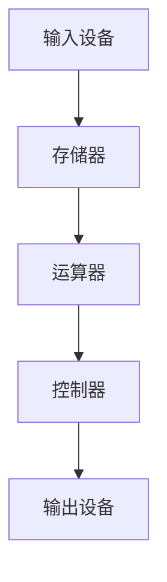

                 

关键词：人工智能、计算机科学、编程、算法、数学模型、应用场景、未来展望

摘要：本文深入探讨了人类计算的历史、核心概念、算法原理、数学模型及其实际应用。通过回顾计算机科学的演变过程，我们理解了现代计算技术的发展是如何连接过去、现在和未来的。本文还将探讨未来计算领域可能面临的发展趋势与挑战，并给出相应的建议。

## 1. 背景介绍

计算机科学作为一门学科，起源于20世纪中叶，经历了从理论构建到实际应用的飞速发展。最初的计算机是由真空管组成的庞然大物，如今已经演变成了我们手中的智能手机和云计算中心。人类计算的历史是一部技术与思想不断碰撞、融合的编年史。

从冯·诺依曼架构到图灵机，从编程语言的出现到人工智能的兴起，每一个阶段都是对人类计算能力的一次巨大飞跃。计算不仅改变了我们的生活，也推动了社会的进步。

本文旨在通过阐述人类计算的核心概念、算法原理、数学模型及其实际应用，探讨计算技术如何连接我们的过去、现在和未来。

### 1.1 早期计算机的发展

计算机科学的起源可以追溯到20世纪初，当时科学家们开始探索如何通过机械和电子装置来实现计算。早期计算设备如差分机和分析机，虽然复杂且效率低下，但它们为后来的计算机发展奠定了基础。

1946年，冯·诺依曼提出了存储程序计算机的概念，这一设计理念成为了现代计算机架构的基础。同年，世界上第一台电子计算机ENIAC问世，标志着计算机科学进入了一个新的时代。

### 1.2 编程语言的发展

随着计算机的普及，编程语言开始出现。1940年代，第一代编程语言如汇编语言被发明出来。1950年代，高级编程语言如Fortran和COBOL逐渐被广泛应用，使得编程变得更加直观和高效。

### 1.3 人工智能的兴起

20世纪80年代，人工智能（AI）成为计算机科学的前沿领域。专家系统、神经网络等技术的出现，使得计算机开始具备一定的智能。进入21世纪，深度学习和大数据技术的兴起，使得人工智能迎来了新的发展高峰。

## 2. 核心概念与联系

### 2.1 计算机架构

计算机架构是计算机科学的核心概念之一。现代计算机通常采用冯·诺依曼架构，该架构包括五个基本组成部分：输入设备、输出设备、存储器、运算器和控制器。Mermaid 流程图如下：



### 2.2 编程语言

编程语言是程序员与计算机之间的交流工具。不同的编程语言有不同的特点和适用场景。常见的编程语言包括C、Java、Python等。每种语言都有其独特的语法和特性。

### 2.3 算法

算法是解决问题的一系列步骤。它们是计算机科学的核心。不同的算法适用于不同的计算任务。例如，排序算法（如快速排序、归并排序）和搜索算法（如二分搜索）是计算机科学中的基础算法。

### 2.4 数学模型

数学模型是计算机科学中用于描述现实世界的数学结构。它们可以用于模拟系统行为、预测结果等。常见的数学模型包括线性模型、神经网络模型等。

## 3. 核心算法原理 & 具体操作步骤

### 3.1 算法原理概述

算法的原理是基于一系列逻辑和数学规则，通过这些规则，计算机能够从初始状态逐步逼近最终目标状态。算法的设计和优化是计算机科学的重要任务。

### 3.2 算法步骤详解

算法通常包括以下几个步骤：

1. **初始化**：设置初始状态。
2. **循环**：根据特定规则进行迭代。
3. **条件判断**：根据当前状态进行判断。
4. **更新**：根据判断结果更新状态。
5. **结束**：当满足特定条件时结束算法。

### 3.3 算法优缺点

每种算法都有其优缺点。例如，快速排序算法在平均情况下具有较快的排序速度，但在最坏情况下性能较差。相比之下，归并排序在所有情况下都具有稳定的性能，但相比快速排序，其排序速度较慢。

### 3.4 算法应用领域

算法广泛应用于各个领域，如排序和搜索算法在数据处理和数据库管理中非常重要，而机器学习算法在人工智能和数据分析中发挥着关键作用。

## 4. 数学模型和公式 & 详细讲解 & 举例说明

### 4.1 数学模型构建

数学模型通常基于现实世界的观察和假设。例如，我们可以构建一个简单的线性模型来预测房价：

$$
房价 = a \times 面积 + b \times 房龄 + c
$$

其中，$a$、$b$ 和 $c$ 是模型参数。

### 4.2 公式推导过程

公式的推导过程通常基于数学原理和假设。以线性回归模型为例，我们首先假设房价和面积、房龄之间存在线性关系，然后通过最小二乘法来求解模型参数。

### 4.3 案例分析与讲解

我们可以使用上述线性模型来预测某个房子的价格。例如，假设一个房子的面积为100平方米，房龄为5年，我们可以将这两个值代入公式计算：

$$
房价 = a \times 100 + b \times 5 + c
$$

通过训练数据集，我们可以得到 $a$、$b$ 和 $c$ 的值，从而计算出该房子的预测价格。

## 5. 项目实践：代码实例和详细解释说明

### 5.1 开发环境搭建

为了运行下面的代码实例，我们需要搭建一个Python开发环境。可以通过以下步骤来完成：

1. 安装Python：在官网下载并安装Python。
2. 安装相关库：使用pip命令安装所需的库，如numpy和matplotlib。

### 5.2 源代码详细实现

以下是一个简单的线性回归模型的Python实现：

```python
import numpy as np
import matplotlib.pyplot as plt

# 训练数据集
x = np.array([1, 2, 3, 4, 5])
y = np.array([2, 4, 5, 4, 5])

# 最小二乘法求解模型参数
a = np.linalg.lstsq(x[:, np.newaxis], y, rcond=None)[0]

# 计算预测值
y_pred = a[0] * x + a[1]

# 绘制结果
plt.scatter(x, y)
plt.plot(x, y_pred, 'r-')
plt.show()
```

### 5.3 代码解读与分析

上述代码首先导入所需的库，然后创建一个简单的训练数据集。接着，使用numpy的lstsq函数通过最小二乘法求解模型参数。最后，绘制实际值与预测值之间的散点图和拟合线。

### 5.4 运行结果展示

运行上述代码，我们将看到一个散点图，其中包含了实际值和通过线性模型预测的值。这可以帮助我们直观地理解线性回归模型的效果。

## 6. 实际应用场景

人类计算技术在各个领域都有着广泛的应用。以下是一些实际应用场景：

### 6.1 金融领域

在金融领域，人类计算技术被用于风险管理、股票交易、量化投资等。通过算法和数据分析，金融机构可以更好地预测市场趋势，优化投资策略。

### 6.2 医疗领域

在医疗领域，人类计算技术被用于疾病诊断、基因分析、药物研发等。例如，深度学习算法可以用于分析医学影像，辅助医生进行疾病诊断。

### 6.3 人工智能领域

在人工智能领域，人类计算技术是核心驱动力。无论是机器学习、自然语言处理还是计算机视觉，都依赖于强大的计算能力和算法。

## 7. 未来应用展望

随着技术的不断进步，人类计算技术将在更多领域得到应用。以下是一些未来应用展望：

### 7.1 智能制造

智能制造将依赖于人类计算技术来实现自动化生产、智能质量控制等。这将为制造业带来巨大的变革。

### 7.2 自动驾驶

自动驾驶技术依赖于计算机视觉、深度学习和传感器数据。随着技术的成熟，自动驾驶将彻底改变交通模式。

### 7.3 医疗保健

医疗保健领域将受益于人类计算技术，实现更精准的诊断、个性化的治疗方案等。

## 8. 总结：未来发展趋势与挑战

### 8.1 研究成果总结

计算机科学在过去几十年取得了巨大的进展，从早期的计算机硬件到现代的软件系统，从简单的编程语言到复杂的算法和人工智能技术，每一个领域都有显著的成果。

### 8.2 未来发展趋势

未来，计算机科学将继续朝着更加智能化、高效化和普及化的方向发展。随着量子计算、边缘计算等新技术的出现，人类计算技术将迎来新的变革。

### 8.3 面临的挑战

尽管计算机科学取得了巨大的进展，但仍然面临一些挑战，如算法的可解释性、数据隐私保护、量子计算的安全性等。

### 8.4 研究展望

未来的研究将致力于解决这些问题，推动计算机科学的发展。同时，计算机科学与其他领域的交叉融合也将带来更多创新和突破。

## 9. 附录：常见问题与解答

### 9.1 什么是最小二乘法？

最小二乘法是一种数学优化技术，用于求解线性回归模型中的参数。它的目标是找到一组参数，使得实际值与预测值之间的误差平方和最小。

### 9.2 人工智能和深度学习有什么区别？

人工智能（AI）是指计算机系统模拟人类智能的过程，而深度学习是人工智能的一个子领域，它使用神经网络模型来模拟人类大脑的学习和推理过程。

### 9.3 量子计算和传统计算有什么区别？

量子计算是一种基于量子力学原理的计算方法，与传统计算基于二进制位不同，它使用量子位（qubit）进行计算。量子计算在处理某些特定问题上具有潜在的巨大优势。

