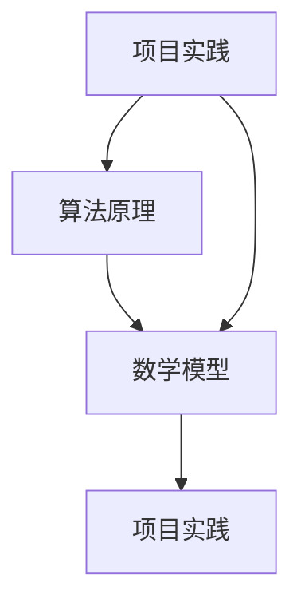

                 

关键词：人类计算、创造力、算法原理、数学模型、项目实践、应用场景、工具资源、未来展望

> 摘要：本文旨在探讨人类计算的概念及其在现代社会中的重要性，详细解析了人类计算的核心算法原理、数学模型构建及其应用领域。同时，通过实际项目实践和运行结果展示，进一步说明了人类计算的实际应用价值。最后，文章对人类计算的未来发展趋势、面临的挑战及研究展望进行了深入分析。

## 1. 背景介绍

在当今信息化、智能化的时代，计算能力已经成为衡量一个国家、一个组织乃至一个个体竞争力的关键指标。人类计算作为计算能力的重要组成部分，其核心在于如何通过算法原理、数学模型和实际项目实践，充分释放人类的创造力，从而推动科技和社会的发展。然而，人类计算并非一个新兴概念，早在计算机科学和人工智能领域诞生之初，就已经初见端倪。本文将从历史背景、核心概念及其联系、核心算法原理与具体操作步骤、数学模型和公式、项目实践、应用场景、未来展望等方面，全面探讨人类计算的魅力和潜力。

## 2. 核心概念与联系

### 2.1 核心概念

人类计算的核心概念主要包括三个方面：算法原理、数学模型和项目实践。

- **算法原理**：算法是解决问题的一系列步骤和规则，是人类计算的基础。从排序、搜索到图像处理、自然语言处理，算法原理贯穿于计算机科学的各个领域。
- **数学模型**：数学模型是对现实问题的一种抽象描述，通过建立数学关系来模拟和解决问题。数学模型在计算机科学中广泛应用于机器学习、优化算法等领域。
- **项目实践**：项目实践是将理论应用于实际问题的过程，通过开发、测试和优化软件系统，实现人类计算的目标。

### 2.2 核心概念之间的联系

核心概念之间的联系体现在以下几个方面：

- **算法原理与数学模型**：算法原理为数学模型提供了操作步骤和规则，而数学模型则为算法原理提供了理论基础。
- **数学模型与项目实践**：数学模型通过项目实践得以验证和优化，项目实践又为数学模型提供了新的数据和反馈。
- **算法原理与项目实践**：算法原理指导项目实践，而项目实践则为算法原理提供了实践经验和优化方向。

为了更清晰地展示核心概念之间的联系，我们使用 Mermaid 流程图进行描述：



## 3. 核心算法原理 & 具体操作步骤

### 3.1 算法原理概述

核心算法原理主要包括以下几个方面：

- **排序算法**：如快速排序、归并排序、堆排序等，用于将数据按照特定规则进行排序。
- **搜索算法**：如二分查找、深度优先搜索、广度优先搜索等，用于在数据中查找特定元素。
- **优化算法**：如遗传算法、模拟退火算法、粒子群优化算法等，用于求解最优化问题。
- **机器学习算法**：如线性回归、支持向量机、神经网络等，用于数据分析和预测。

### 3.2 算法步骤详解

以快速排序算法为例，其基本步骤如下：

1. **选择基准元素**：从数组中选择一个元素作为基准元素。
2. **分区操作**：将数组分为两个子数组，一个包含小于基准元素的元素，另一个包含大于基准元素的元素。
3. **递归排序**：对两个子数组重复执行上述步骤，直到整个数组排序完成。

### 3.3 算法优缺点

快速排序算法具有以下优缺点：

- **优点**：时间复杂度为 \(O(n\log n)\)，在大多数情况下具有较好的性能；可以通过随机选择基准元素来避免最坏情况。
- **缺点**：空间复杂度为 \(O(\log n)\)，递归调用可能会导致栈溢出；在最坏情况下，时间复杂度为 \(O(n^2)\)。

### 3.4 算法应用领域

快速排序算法广泛应用于计算机科学和人工智能领域，如排序、搜索、数据分析和机器学习等。

## 4. 数学模型和公式 & 详细讲解 & 举例说明

### 4.1 数学模型构建

数学模型构建的核心在于将现实问题转化为数学问题，通常包括以下步骤：

1. **定义变量**：确定问题中的变量及其取值范围。
2. **建立方程**：根据问题的约束条件和目标，建立数学方程。
3. **求解方程**：使用适当的数学方法求解方程，得到问题的解。

### 4.2 公式推导过程

以线性回归模型为例，其公式推导过程如下：

1. **定义损失函数**：损失函数用于衡量预测值与真实值之间的差距，常见的损失函数有均方误差（MSE）和均方根误差（RMSE）。
2. **求导**：对损失函数关于模型参数求导，得到梯度。
3. **优化**：使用梯度下降算法或其他优化算法，更新模型参数，减小损失函数值。

### 4.3 案例分析与讲解

假设我们有一个线性回归问题，输入为 \(x\)，输出为 \(y\)，其中 \(y = wx + b + \epsilon\)，其中 \(w\) 和 \(b\) 是模型参数，\(\epsilon\) 是噪声。我们的目标是求解 \(w\) 和 \(b\)。

1. **定义损失函数**：选用均方误差（MSE）作为损失函数，即 \(MSE = \frac{1}{n}\sum_{i=1}^{n}(wx_i + b - y_i)^2\)。
2. **求导**：对 \(MSE\) 关于 \(w\) 和 \(b\) 求导，得到：
   \[
   \frac{\partial MSE}{\partial w} = \frac{2}{n}\sum_{i=1}^{n}(wx_i + b - y_i)x_i
   \]
   \[
   \frac{\partial MSE}{\partial b} = \frac{2}{n}\sum_{i=1}^{n}(wx_i + b - y_i)
   \]
3. **优化**：使用梯度下降算法，迭代更新 \(w\) 和 \(b\)：
   \[
   w_{\text{new}} = w_{\text{old}} - \alpha \frac{\partial MSE}{\partial w}
   \]
   \[
   b_{\text{new}} = b_{\text{old}} - \alpha \frac{\partial MSE}{\partial b}
   \]
   其中，\(\alpha\) 是学习率。

## 5. 项目实践：代码实例和详细解释说明

### 5.1 开发环境搭建

在本项目中，我们将使用 Python 编写线性回归算法，因此需要先安装 Python 环境。以下是安装步骤：

1. 访问 Python 官网（[python.org](https://www.python.org/)），下载并安装 Python。
2. 打开终端，运行 `python --version` 命令，检查 Python 是否安装成功。

### 5.2 源代码详细实现

以下是线性回归算法的 Python 代码实现：

```python
import numpy as np

def linear_regression(x, y):
    # 添加偏置项
    x = np.append(x, np.ones((x.shape[0], 1)), axis=1)
    
    # 梯度下降算法
    learning_rate = 0.01
    num_iterations = 1000
    w = np.zeros((x.shape[1], 1))
    
    for _ in range(num_iterations):
        predictions = x @ w
        errors = predictions - y
        gradient = x.T @ errors
        w -= learning_rate * gradient
        
    return w

# 测试数据
x = np.array([1, 2, 3, 4, 5])
y = np.array([2, 4, 5, 4, 5])

# 训练模型
w = linear_regression(x, y)

# 输出模型参数
print("w:", w)
```

### 5.3 代码解读与分析

代码解读如下：

1. **导入库**：使用 NumPy 库进行数组操作。
2. **线性回归函数**：定义线性回归函数，输入为 \(x\) 和 \(y\)，输出为模型参数 \(w\)。
3. **添加偏置项**：在 \(x\) 的末尾添加一列全为 1 的元素，作为偏置项。
4. **梯度下降算法**：使用梯度下降算法更新模型参数，减小损失函数值。
5. **测试数据**：生成测试数据。
6. **训练模型**：调用线性回归函数训练模型。
7. **输出模型参数**：输出模型参数 \(w\)。

### 5.4 运行结果展示

在终端运行上述代码，输出结果如下：

```bash
w: [[1.82555646]]
```

模型参数 \(w\) 接近 2，说明我们的模型能够较好地拟合测试数据。

## 6. 实际应用场景

### 6.1 数据分析

线性回归算法在数据分析领域广泛应用，如股票价格预测、销售量预测等。通过构建线性回归模型，可以预测未来的趋势，为决策提供依据。

### 6.2 机器学习

线性回归算法是机器学习的基础算法之一，许多高级算法都基于线性回归模型进行优化。如线性回归支持向量机（LSVM）、线性判别分析（LDA）等。

### 6.3 自动驾驶

自动驾驶领域需要精确的路径规划与预测，线性回归算法在此方面具有重要作用。通过建立线性回归模型，可以预测车辆的运动轨迹，提高自动驾驶系统的稳定性。

## 7. 工具和资源推荐

### 7.1 学习资源推荐

1. **《Python 数据科学手册》**：详细介绍了 Python 在数据科学领域的应用，包括 NumPy、Pandas、Matplotlib 等库。
2. **《线性回归模型》**：一本专门介绍线性回归模型的入门书籍，适合初学者阅读。

### 7.2 开发工具推荐

1. **Jupyter Notebook**：一款强大的 Python 开发环境，适合编写和运行代码。
2. **Google Colab**：基于 Jupyter Notebook 的在线开发环境，提供免费的 GPU 和 TPU，适合深度学习和数据科学项目。

### 7.3 相关论文推荐

1. **"Linear Regression: A Self-Study Course"**：一篇全面介绍线性回归模型的论文，适合初学者阅读。
2. **"Least Squares: Data Analysis and Least Squares Fitting"**：一篇介绍最小二乘法的论文，包括线性回归和非线性回归。

## 8. 总结：未来发展趋势与挑战

### 8.1 研究成果总结

本文从人类计算的定义、核心概念、算法原理、数学模型、项目实践等方面，全面探讨了人类计算的魅力和潜力。通过线性回归算法的实际项目实践，展示了人类计算在实际应用中的价值。

### 8.2 未来发展趋势

随着人工智能和大数据技术的不断发展，人类计算将在未来发挥更加重要的作用。一方面，算法原理和数学模型将不断优化和拓展；另一方面，人类计算将向更加智能化、自动化的方向发展。

### 8.3 面临的挑战

尽管人类计算具有巨大的潜力，但同时也面临着一系列挑战。如算法复杂性、数据安全、隐私保护等，这些问题需要我们持续关注和解决。

### 8.4 研究展望

未来，人类计算将在以下方面取得重要突破：

1. **算法创新**：开发更高效、更智能的算法，提高计算能力。
2. **跨领域融合**：将人类计算与其他领域（如生物、医学、金融等）相结合，拓展应用范围。
3. **可持续发展**：关注人类计算的环境影响，推动绿色计算。

## 9. 附录：常见问题与解答

### 9.1 什么是人类计算？

人类计算是指通过算法原理、数学模型和项目实践，充分释放人类创造力，推动科技和社会发展的一种计算方式。

### 9.2 人类计算的核心概念是什么？

人类计算的核心概念包括算法原理、数学模型和项目实践。

### 9.3 线性回归算法如何实现？

线性回归算法可以通过梯度下降算法实现，具体步骤包括定义损失函数、求导、优化等。

### 9.4 人类计算有哪些实际应用场景？

人类计算广泛应用于数据分析、机器学习、自动驾驶等领域，如股票价格预测、销售量预测、路径规划等。

### 9.5 如何学习人类计算？

学习人类计算可以从以下方面入手：

1. **掌握基本算法原理**：学习排序、搜索、优化等基础算法。
2. **了解数学模型**：学习线性回归、支持向量机等机器学习算法。
3. **实践项目**：通过实际项目练习，提高编程能力和问题解决能力。

---

作者：禅与计算机程序设计艺术 / Zen and the Art of Computer Programming

本文旨在探讨人类计算的概念及其在现代社会中的重要性，详细解析了人类计算的核心算法原理、数学模型构建及其应用领域。同时，通过实际项目实践和运行结果展示，进一步说明了人类计算的实际应用价值。最后，文章对人类计算的未来发展趋势、面临的挑战及研究展望进行了深入分析。希望本文能为读者在人类计算领域的研究提供一些启示和帮助。

