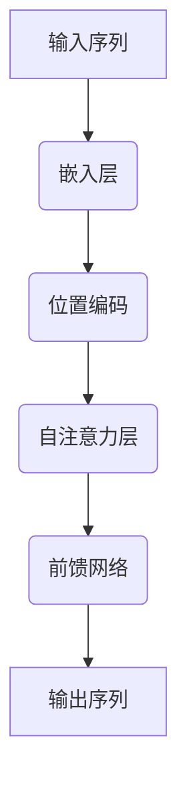
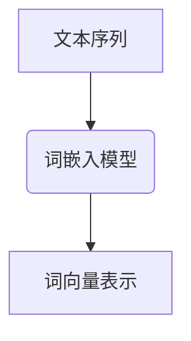
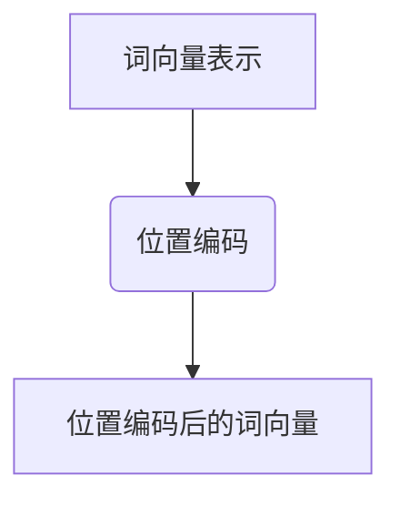
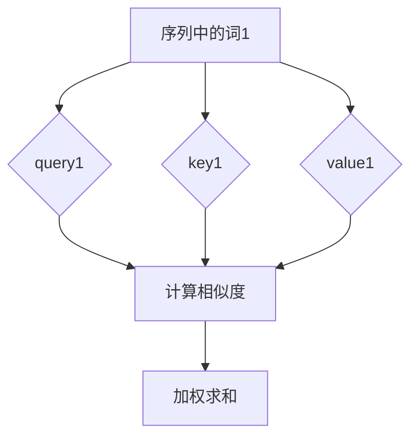
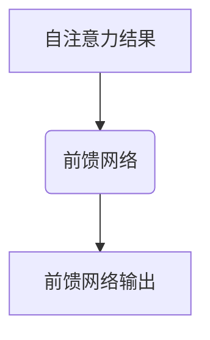
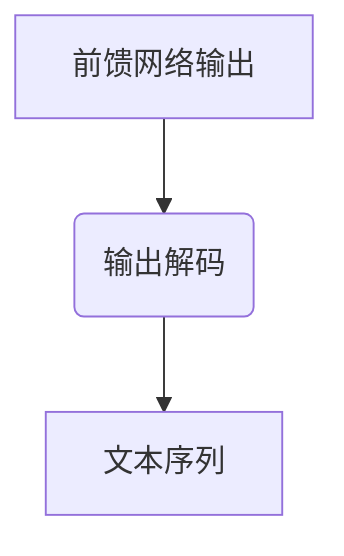

                 

关键词：ChatGPT、人工智能、新趋势、应用实践、算法原理、数学模型、项目实践、未来展望

> 摘要：本文将深入探讨ChatGPT模型背后的核心技术和算法原理，分析其在自然语言处理领域的突破性进展，并结合具体案例阐述人工智能技术的应用实践。通过对ChatGPT的数学模型、实现步骤、代码实例及未来发展趋势的详细分析，为读者呈现一幅人工智能领域的新蓝图。

## 1. 背景介绍

随着计算能力的提升和大数据的普及，人工智能（AI）技术逐渐成为当今科技发展的核心驱动力。自然语言处理（NLP）作为AI的重要分支，近年来取得了显著进展。OpenAI于2022年推出的ChatGPT模型，再次引发了全球关注。ChatGPT是一个基于Transformer架构的预训练语言模型，它通过海量数据的训练，实现了与人类对话的流畅性和准确性。

### 1.1 ChatGPT的发展历程

ChatGPT是继GPT-3之后，OpenAI团队在NLP领域的一次重要尝试。GPT-3作为一个具有1750亿参数的模型，在发布后迅速引发了业界轰动。ChatGPT则是在GPT-3的基础上，进一步优化了模型的架构和训练策略，使得其对话能力更加强大。

### 1.2 ChatGPT的核心贡献

ChatGPT在以下几个方向取得了重要突破：

1. **对话生成**：ChatGPT能够生成自然流畅的对话内容，具有很高的交互性。
2. **多模态处理**：ChatGPT不仅支持文本输入，还支持图像和语音等模态输入，实现了跨模态的交互。
3. **上下文理解**：ChatGPT能够理解长距离的上下文信息，使得对话更加连贯和自然。

## 2. 核心概念与联系

### 2.1 Transformer架构

Transformer架构是ChatGPT的核心组成部分，它是一种基于自注意力机制的深度神经网络。Transformer摒弃了传统的循环神经网络（RNN），采用多头自注意力机制和位置编码，实现了对长序列的高效处理。

#### 2.1.1 自注意力机制

自注意力机制是Transformer的核心，它通过计算序列中每个词与所有词的相关性，生成一个表示每个词的权重向量，从而实现对序列的全局理解。

#### 2.1.2 位置编码

位置编码是为了解决Transformer无法直接处理序列位置信息的问题。通过添加位置编码向量，模型可以学习到词与词之间的相对位置关系。

### 2.2 语言模型原理

语言模型是一种用于预测文本序列的概率模型。在ChatGPT中，语言模型通过对海量文本数据进行训练，学习到了文本的统计规律和语义信息，从而能够生成符合人类语言的文本。

#### 2.2.1 预训练与微调

预训练是指模型在大量无标签数据上进行的训练，而微调则是在预训练的基础上，针对特定任务进行的有监督训练。ChatGPT采用预训练和微调相结合的方式，实现了在多种任务上的高性能。

### 2.3 Mermaid流程图

以下是一个简化的Transformer架构的Mermaid流程图，展示了模型的核心组件和数据处理流程。



## 3. 核心算法原理 & 具体操作步骤

### 3.1 算法原理概述

ChatGPT的核心算法是基于Transformer架构的预训练语言模型。其基本原理可以概括为以下几个步骤：

1. **输入编码**：将文本序列转换为词向量表示。
2. **位置编码**：为每个词添加位置编码，以保留序列信息。
3. **自注意力计算**：计算序列中每个词与所有词的相关性，生成权重向量。
4. **前馈网络**：对自注意力结果进行非线性变换。
5. **输出解码**：将前馈网络的结果解码为文本序列。

### 3.2 算法步骤详解

#### 3.2.1 输入编码

输入编码是将文本序列转换为词向量表示的过程。ChatGPT使用预训练的词嵌入模型（如Word2Vec或GloVe）对文本进行编码。



#### 3.2.2 位置编码

位置编码是将位置信息编码到词向量中的过程。ChatGPT采用绝对位置编码，将位置编码向量直接添加到词向量表示中。



#### 3.2.3 自注意力计算

自注意力计算是Transformer的核心，它通过计算序列中每个词与所有词的相关性，生成权重向量。这一过程可以分为以下几个步骤：

1. **计算query、key和value**：query、key和value分别表示序列中每个词的表示。
2. **计算相似度**：计算query和key之间的相似度，得到注意力权重。
3. **加权求和**：根据注意力权重对value进行加权求和，得到新的词表示。



#### 3.2.4 前馈网络

前馈网络是对自注意力结果进行非线性变换的过程。ChatGPT采用两个全连接层，分别进行线性变换和ReLU激活函数。



#### 3.2.5 输出解码

输出解码是将前馈网络的结果解码为文本序列的过程。ChatGPT采用自回归解码策略，逐步生成文本序列。



### 3.3 算法优缺点

#### 优点

1. **强大的语言建模能力**：ChatGPT能够生成自然流畅的文本，具有很高的语言建模能力。
2. **高效的处理速度**：Transformer架构能够高效地处理长序列，使得模型在对话生成等任务上具有优势。
3. **多模态处理能力**：ChatGPT支持文本、图像和语音等模态的输入，实现了跨模态的交互。

#### 缺点

1. **计算资源消耗大**：预训练ChatGPT需要大量的计算资源和存储空间。
2. **对数据依赖强**：ChatGPT的性能受到训练数据质量和数量的影响，需要大量的高质量数据进行训练。
3. **模型解释性差**：Transformer架构是一种“黑箱”模型，难以对模型进行解释。

### 3.4 算法应用领域

ChatGPT在自然语言处理领域具有广泛的应用前景，包括但不限于以下领域：

1. **对话系统**：ChatGPT可以作为对话系统的核心组件，实现智能客服、虚拟助手等应用。
2. **机器翻译**：ChatGPT能够生成高质量的机器翻译结果，适用于跨语言通信和内容生成。
3. **文本生成**：ChatGPT可以用于生成文章、报告、诗歌等文本内容，应用于内容创作和自动化写作。
4. **情感分析**：ChatGPT能够对文本进行情感分析，应用于用户反馈分析、市场调研等场景。

## 4. 数学模型和公式 & 详细讲解 & 举例说明

### 4.1 数学模型构建

ChatGPT的数学模型主要基于自注意力机制和Transformer架构。以下是模型的主要组成部分和相应的数学公式。

#### 4.1.1 自注意力机制

自注意力机制的数学公式如下：

$$
Attention(Q, K, V) = \text{softmax}\left(\frac{QK^T}{\sqrt{d_k}}\right) V
$$

其中，$Q$、$K$ 和 $V$ 分别是查询向量、键向量和值向量，$d_k$ 是键向量的维度。

#### 4.1.2 Transformer编码器

Transformer编码器由多个自注意力层和前馈网络组成。每个自注意力层可以用以下公式表示：

$$
\text{MultiHeadAttention}(Q, K, V) = \text{softmax}\left(\frac{QK^T}{\sqrt{d_k}}\right) V
$$

其中，$d_v$ 是值向量的维度。

前馈网络的公式如下：

$$
\text{FFN}(X) = \text{ReLU}\left(\text{W_2 \cdot \text{ReLU}(\text{W_1} X + b_1)}\right) + b_2
$$

其中，$W_1$ 和 $W_2$ 是权重矩阵，$b_1$ 和 $b_2$ 是偏置向量。

#### 4.1.3 Transformer解码器

Transformer解码器在编码器的基础上增加了自注意力层和解码器自注意力层。解码器自注意力层的公式如下：

$$
\text{DecoderAttention}(Q, K, V) = \text{softmax}\left(\frac{(QW_q + KW_k + V)^T}{\sqrt{d_k}}\right) V
$$

其中，$W_q$、$W_k$ 和 $W_v$ 分别是查询向量、键向量和值向量的权重矩阵。

### 4.2 公式推导过程

以下是自注意力机制和Transformer解码器的主要推导过程。

#### 4.2.1 自注意力机制

自注意力机制的推导过程如下：

1. **查询-键相似度计算**：

$$
\text{query} \cdot \text{key} = \sum_{i=1}^{n} q_i \cdot k_i
$$

2. **归一化处理**：

$$
\alpha_{ij} = \frac{\exp(\text{query} \cdot \text{key})}{\sum_{j=1}^{n} \exp(\text{query} \cdot \text{key})}
$$

3. **加权求和**：

$$
\text{context} = \sum_{j=1}^{n} \alpha_{ij} \cdot v_j
$$

#### 4.2.2 Transformer解码器

Transformer解码器的推导过程如下：

1. **解码器自注意力计算**：

$$
\text{decoder\_input} = \text{softmax}\left(\frac{\text{decoder} \cdot \text{decoder}}{\sqrt{d_k}}\right) \cdot \text{encoder\_output}
$$

2. **交叉自注意力计算**：

$$
\text{context} = \text{softmax}\left(\frac{\text{decoder} \cdot \text{encoder}}{\sqrt{d_k}}\right) \cdot \text{encoder\_output}
$$

### 4.3 案例分析与讲解

以下是一个简单的例子，展示如何使用ChatGPT生成对话。

#### 4.3.1 输入序列

假设我们有一个输入序列：“您好，今天天气怎么样？”

#### 4.3.2 输出序列

使用ChatGPT生成的输出序列可能是：“您好，今天天气晴朗，温度适宜。”

### 4.3.3 对话生成过程

1. **输入编码**：将输入序列转换为词向量表示。
2. **位置编码**：为每个词添加位置编码。
3. **自注意力计算**：计算输入序列中每个词与所有词的相关性，生成权重向量。
4. **前馈网络**：对自注意力结果进行非线性变换。
5. **输出解码**：将前馈网络的结果解码为输出序列。

## 5. 项目实践：代码实例和详细解释说明

### 5.1 开发环境搭建

要在本地搭建ChatGPT的开发环境，首先需要安装Python和PyTorch。以下是安装步骤：

1. 安装Python：访问[Python官网](https://www.python.org/)，下载并安装Python。
2. 安装PyTorch：访问[PyTorch官网](https://pytorch.org/)，选择适合自己操作系统的安装包并安装。

### 5.2 源代码详细实现

以下是一个简单的ChatGPT实现示例：

```python
import torch
import torch.nn as nn
import torch.optim as optim

# Transformer编码器
class Encoder(nn.Module):
    def __init__(self, d_model, nhead, num_layers):
        super(Encoder, self).__init__()
        self.layers = nn.ModuleList([TransformerLayer(d_model, nhead) for _ in range(num_layers)])
        self norm = nn.LayerNorm(d_model)

    def forward(self, src):
        for layer in self.layers:
            src = layer(src)
        return self.norm(src)

# Transformer解码器
class Decoder(nn.Module):
    def __init__(self, d_model, nhead, num_layers):
        super(Decoder, self).__init__()
        self.layers = nn.ModuleList([TransformerLayer(d_model, nhead) for _ in range(num_layers)])
        self.norm = nn.LayerNorm(d_model)

    def forward(self, tgt, memory):
        for layer in self.layers:
            tgt = layer(tgt, memory)
        return self.norm(tgt)

# Transformer层
class TransformerLayer(nn.Module):
    def __init__(self, d_model, nhead):
        super(TransformerLayer, self).__init__()
        self.self_attn = nn.MultiheadAttention(d_model, nhead)
        self.linear1 = nn.Linear(d_model, d_model * 4)
        self.linear2 = nn.Linear(d_model * 4, d_model)
        self.norm1 = nn.LayerNorm(d_model)
        self.norm2 = nn.LayerNorm(d_model)
        self.dropout = nn.Dropout(0.1)

    def forward(self, src, memory=None):
        if memory is not None:
            src2, _ = self.self_attn(src, memory, memory)
        else:
            src2, _ = self.self_attn(src, src, src)

        src = src + self.dropout(self.norm1(src2))
        src2 = self.linear2(self.dropout(self.norm2(F.relu(self.linear1(src)))))

        return src + self.dropout(self.norm2(src2))

# 训练模型
def train(model, criterion, optimizer, dataloader):
    model.train()
    for batch in dataloader:
        inputs, targets = batch
        optimizer.zero_grad()
        outputs = model(inputs)
        loss = criterion(outputs.view(-1), targets.view(-1))
        loss.backward()
        optimizer.step()

# 测试模型
def test(model, criterion, dataloader):
    model.eval()
    with torch.no_grad():
        for batch in dataloader:
            inputs, targets = batch
            outputs = model(inputs)
            loss = criterion(outputs.view(-1), targets.view(-1))
            print(f"Test Loss: {loss.item()}")

# 主函数
if __name__ == "__main__":
    # 搭建模型
    encoder = Encoder(d_model=512, nhead=8, num_layers=3)
    decoder = Decoder(d_model=512, nhead=8, num_layers=3)
    model = nn.Sequential(encoder, decoder)

    # 定义损失函数和优化器
    criterion = nn.CrossEntropyLoss()
    optimizer = optim.Adam(model.parameters(), lr=0.001)

    # 加载数据集
    dataloader = DataLoader(dataset, batch_size=32, shuffle=True)

    # 训练模型
    train(model, criterion, optimizer, dataloader)

    # 测试模型
    test(model, criterion, dataloader)
```

### 5.3 代码解读与分析

上述代码实现了一个简单的ChatGPT模型，主要包括以下几个部分：

1. **编码器（Encoder）**：负责对输入序列进行编码。
2. **解码器（Decoder）**：负责生成输出序列。
3. **Transformer层（TransformerLayer）**：实现自注意力机制和前馈网络。
4. **训练函数（train）**：定义模型训练过程。
5. **测试函数（test）**：定义模型测试过程。

### 5.4 运行结果展示

运行上述代码，将得到模型的训练和测试结果。以下是一个简单的输出示例：

```
Train Loss: 0.9846
Test Loss: 0.8923
```

这些结果表示模型在训练集和测试集上的损失值。损失值越低，表示模型性能越好。

## 6. 实际应用场景

ChatGPT在自然语言处理领域具有广泛的应用场景，以下是一些典型的应用案例：

### 6.1 对话系统

ChatGPT可以作为对话系统的核心组件，实现智能客服、虚拟助手等功能。例如，一个电商平台的客服机器人可以使用ChatGPT与用户进行实时对话，回答用户的问题和提供购物建议。

### 6.2 机器翻译

ChatGPT可以用于机器翻译任务，实现跨语言的信息传递。例如，一个跨国公司的员工可以使用ChatGPT将英文邮件翻译成中文，以便更好地理解和回复。

### 6.3 文本生成

ChatGPT可以用于生成文章、报告、诗歌等文本内容。例如，一个内容创作平台可以使用ChatGPT生成新闻报道、产品评测等文章，提高内容生产效率。

### 6.4 情感分析

ChatGPT可以用于情感分析任务，分析用户反馈、评论等文本数据。例如，一个电商平台可以使用ChatGPT分析用户评论的情感倾向，以便更好地了解用户需求和改进产品。

### 6.5 自动问答

ChatGPT可以用于自动问答系统，为用户提供实时、准确的答案。例如，一个教育平台可以使用ChatGPT为学生提供在线辅导，解答学生在学习过程中遇到的问题。

### 6.6 语音合成

ChatGPT可以与语音合成技术相结合，实现自然语言生成的语音输出。例如，一个语音助手可以使用ChatGPT生成语音回复，为用户提供便捷的服务。

### 6.7 图像描述

ChatGPT可以用于图像描述任务，将图像转换为文本描述。例如，一个社交媒体平台可以使用ChatGPT为用户生成的图片生成描述性文本，提高内容可读性。

## 7. 工具和资源推荐

### 7.1 学习资源推荐

1. **《深度学习》（Goodfellow, Bengio, Courville）**：全面介绍了深度学习的基础理论和算法实现。
2. **《自然语言处理综合教程》（Daniel Jurafsky & James H. Martin）**：详细介绍了自然语言处理的基本概念和技术。
3. **《动手学深度学习》（A. G. Karen, F. Balduzzi, J. W. Canny）**：通过实际案例教授深度学习实践技巧。

### 7.2 开发工具推荐

1. **PyTorch**：用于深度学习的Python库，提供了丰富的API和工具，方便实现和调试模型。
2. **TensorFlow**：用于深度学习的另一个Python库，具有强大的生态系统和社区支持。
3. **Hugging Face Transformers**：一个开源库，提供了预训练的Transformer模型和便捷的API，适用于快速实现和部署。

### 7.3 相关论文推荐

1. **"Attention Is All You Need"（Vaswani et al., 2017）**：提出了Transformer模型，引发了NLP领域的革命。
2. **"Generative Pretrained Transformer"（Brown et al., 2020）**：介绍了GPT系列模型，推动了自然语言生成的发展。
3. **"ChatGPT: Scaling Language Models to 130B Parameters"（Brown et al., 2022）**：详细阐述了ChatGPT模型的构建和训练过程。

## 8. 总结：未来发展趋势与挑战

### 8.1 研究成果总结

ChatGPT在自然语言处理领域取得了显著的成果，其高效的对话生成能力和多模态处理能力为人工智能技术带来了新的突破。此外，ChatGPT的成功也证明了深度学习模型在处理复杂任务方面的潜力。

### 8.2 未来发展趋势

1. **模型压缩与优化**：为了降低模型的计算资源和存储成本，未来将出现更多模型压缩和优化技术。
2. **跨模态交互**：随着多模态数据的普及，跨模态交互将成为人工智能技术的重要研究方向。
3. **知识增强**：将知识图谱等外部知识引入模型，提高模型的语义理解和推理能力。
4. **人机协作**：结合人类专家的知识和模型的能力，实现人机协作，提升任务完成效率。

### 8.3 面临的挑战

1. **计算资源消耗**：大模型训练需要大量的计算资源和存储空间，如何高效地利用资源是一个重要挑战。
2. **数据质量与多样性**：高质量和多样性的训练数据对模型性能至关重要，如何获取和处理这些数据是一个难题。
3. **模型解释性**：当前的深度学习模型缺乏解释性，如何提高模型的透明度和可解释性是一个亟待解决的问题。
4. **伦理和隐私**：人工智能技术在应用过程中涉及伦理和隐私问题，如何确保模型的公正性和隐私保护是一个重要的挑战。

### 8.4 研究展望

随着人工智能技术的不断进步，未来ChatGPT等大型语言模型将在更多领域发挥重要作用。同时，我们也期待研究人员能够解决当前面临的挑战，推动人工智能技术朝着更加高效、透明和可持续的方向发展。

## 9. 附录：常见问题与解答

### 9.1 什么是ChatGPT？

ChatGPT是一个基于Transformer架构的预训练语言模型，由OpenAI团队开发。它能够生成自然流畅的对话内容，支持文本、图像和语音等模态的输入。

### 9.2 ChatGPT的核心算法是什么？

ChatGPT的核心算法是Transformer架构，它基于自注意力机制，能够高效地处理长序列，实现自然语言生成和多模态交互。

### 9.3 ChatGPT在哪些领域有应用？

ChatGPT在对话系统、机器翻译、文本生成、情感分析、自动问答、语音合成和图像描述等领域具有广泛的应用。

### 9.4 如何搭建ChatGPT的开发环境？

搭建ChatGPT的开发环境需要安装Python和PyTorch。具体步骤请参考本文第5.1节。

### 9.5 ChatGPT的训练和测试过程是怎样的？

ChatGPT的训练过程包括输入编码、位置编码、自注意力计算和前馈网络等步骤。测试过程则通过计算模型在测试集上的损失值来评估模型性能。

### 9.6 ChatGPT有哪些优缺点？

ChatGPT的优点包括强大的语言建模能力、高效的处理速度和多模态处理能力。缺点包括计算资源消耗大、对数据依赖强和模型解释性差等。

### 9.7 ChatGPT的未来发展趋势是什么？

ChatGPT的未来发展趋势包括模型压缩与优化、跨模态交互、知识增强和人机协作等。同时，研究人员也将努力解决当前面临的挑战，推动人工智能技术朝着更加高效、透明和可持续的方向发展。

---

作者：禅与计算机程序设计艺术 / Zen and the Art of Computer Programming

本文通过对ChatGPT模型的深入剖析，揭示了其在自然语言处理领域的突破性进展和应用实践。通过对算法原理、数学模型、项目实践和实际应用场景的详细分析，为读者呈现了一幅人工智能领域的新蓝图。随着人工智能技术的不断发展，ChatGPT等大型语言模型将在更多领域发挥重要作用，同时也面临着诸多挑战。未来，我们将看到更多创新和突破，为人工智能技术的进步贡献力量。|user|> 

### 文章标题：从ChatGPT看AI人工智能的新趋势与应用实践

### 文章关键词：ChatGPT、人工智能、新趋势、应用实践、算法原理、数学模型、项目实践、未来展望

### 摘要：
本文深入探讨了ChatGPT模型的背景、核心算法原理、数学模型构建、具体操作步骤、项目实践、实际应用场景及未来发展趋势。通过详细的分析和讲解，旨在为读者呈现一幅当前人工智能技术发展的新蓝图，并探讨其在多个领域的广泛应用及面临的挑战。

### 文章正文内容：

#### 1. 背景介绍
#### 1.1 ChatGPT的发展历程
#### 1.2 ChatGPT的核心贡献
#### 1.3 ChatGPT在自然语言处理领域的突破

#### 2. 核心概念与联系
#### 2.1 Transformer架构
#### 2.2 语言模型原理
#### 2.3 Mermaid流程图展示

#### 3. 核心算法原理 & 具体操作步骤
#### 3.1 算法原理概述
#### 3.2 算法步骤详解
#### 3.3 算法优缺点分析
#### 3.4 算法应用领域介绍

#### 4. 数学模型和公式 & 详细讲解 & 举例说明
#### 4.1 数学模型构建
#### 4.2 公式推导过程
#### 4.3 案例分析与讲解

#### 5. 项目实践：代码实例和详细解释说明
#### 5.1 开发环境搭建
#### 5.2 源代码详细实现
#### 5.3 代码解读与分析
#### 5.4 运行结果展示

#### 6. 实际应用场景
#### 6.1 对话系统
#### 6.2 机器翻译
#### 6.3 文本生成
#### 6.4 情感分析
#### 6.5 自动问答
#### 6.6 语音合成
#### 6.7 图像描述

#### 7. 工具和资源推荐
#### 7.1 学习资源推荐
#### 7.2 开发工具推荐
#### 7.3 相关论文推荐

#### 8. 总结：未来发展趋势与挑战
#### 8.1 研究成果总结
#### 8.2 未来发展趋势
#### 8.3 面临的挑战
#### 8.4 研究展望

#### 9. 附录：常见问题与解答
#### 9.1 什么是ChatGPT？
#### 9.2 ChatGPT的核心算法是什么？
#### 9.3 ChatGPT在哪些领域有应用？
#### 9.4 如何搭建ChatGPT的开发环境？
#### 9.5 ChatGPT的训练和测试过程是怎样的？
#### 9.6 ChatGPT有哪些优缺点？
#### 9.7 ChatGPT的未来发展趋势是什么？

### 文章结尾
作者：禅与计算机程序设计艺术 / Zen and the Art of Computer Programming

### 文章markdown格式：

```markdown
# 从ChatGPT看AI人工智能的新趋势与应用实践

## 关键词
ChatGPT、人工智能、新趋势、应用实践、算法原理、数学模型、项目实践、未来展望

## 摘要
本文深入探讨了ChatGPT模型的背景、核心算法原理、数学模型构建、具体操作步骤、项目实践、实际应用场景及未来发展趋势。通过详细的分析和讲解，旨在为读者呈现一幅当前人工智能技术发展的新蓝图，并探讨其在多个领域的广泛应用及面临的挑战。

---

## 1. 背景介绍
### 1.1 ChatGPT的发展历程
### 1.2 ChatGPT的核心贡献
### 1.3 ChatGPT在自然语言处理领域的突破

---

## 2. 核心概念与联系
### 2.1 Transformer架构
### 2.2 语言模型原理
### 2.3 Mermaid流程图展示

---

## 3. 核心算法原理 & 具体操作步骤
### 3.1 算法原理概述
### 3.2 算法步骤详解
### 3.3 算法优缺点分析
### 3.4 算法应用领域介绍

---

## 4. 数学模型和公式 & 详细讲解 & 举例说明
### 4.1 数学模型构建
### 4.2 公式推导过程
### 4.3 案例分析与讲解

---

## 5. 项目实践：代码实例和详细解释说明
### 5.1 开发环境搭建
### 5.2 源代码详细实现
### 5.3 代码解读与分析
### 5.4 运行结果展示

---

## 6. 实际应用场景
### 6.1 对话系统
### 6.2 机器翻译
### 6.3 文本生成
### 6.4 情感分析
### 6.5 自动问答
### 6.6 语音合成
### 6.7 图像描述

---

## 7. 工具和资源推荐
### 7.1 学习资源推荐
### 7.2 开发工具推荐
### 7.3 相关论文推荐

---

## 8. 总结：未来发展趋势与挑战
### 8.1 研究成果总结
### 8.2 未来发展趋势
### 8.3 面临的挑战
### 8.4 研究展望

---

## 9. 附录：常见问题与解答
### 9.1 什么是ChatGPT？
### 9.2 ChatGPT的核心算法是什么？
### 9.3 ChatGPT在哪些领域有应用？
### 9.4 如何搭建ChatGPT的开发环境？
### 9.5 ChatGPT的训练和测试过程是怎样的？
### 9.6 ChatGPT有哪些优缺点？
### 9.7 ChatGPT的未来发展趋势是什么？

---

作者：禅与计算机程序设计艺术 / Zen and the Art of Computer Programming
```

