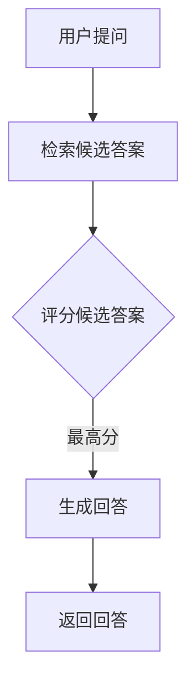
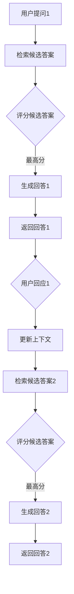

                 

关键词：RAG模型、多轮对话、自然语言处理、AI交互、智能代理、对话系统

> 摘要：本文将深入探讨RAG模型及其在多轮对话系统中的应用，分析如何从RAG模型逐步转型为更复杂的智能代理，从而实现与用户更深入的互动。本文还将阐述相关算法原理、实践案例以及未来的发展方向。

## 1. 背景介绍

随着自然语言处理（NLP）和人工智能（AI）技术的快速发展，对话系统已经成为人机交互的重要手段。早期的对话系统多为单轮对话，用户提出一个问题，系统回答后对话结束。然而，这类系统无法处理复杂的语境和多轮对话，限制了其在实际应用中的效果。为了解决这一问题，研究者提出了RAG模型，并在此基础上发展出多轮对话系统，使得系统能够与用户进行更深入的互动。

### 1.1 RAG模型简介

RAG模型，即检索-生成-评分（Retrieval-Generation-Ranking）模型，是一种常用于问答系统的模型。其基本思想是：首先从大量候选答案中检索出可能的答案，然后生成这些答案，最后对生成的答案进行评分，选择最合适的答案返回给用户。

RAG模型的主要组件包括：

- **检索（Retrieval）**：从预定义的文档库中检索出与用户问题相关的答案候选。
- **生成（Generation）**：根据检索到的候选答案，生成完整的回答。
- **评分（Ranking）**：对生成的回答进行评分，选择最合适的回答。

### 1.2 多轮对话系统

多轮对话系统旨在通过多次交互，逐步理解用户的意图，并提供更准确的回答。这类系统通常包括以下阶段：

- **意图识别（Intent Recognition）**：识别用户的意图，例如查询信息、请求帮助等。
- **实体抽取（Entity Extraction）**：从对话中提取关键信息，如时间、地点、人物等。
- **上下文维护（Context Management）**：记录对话历史，为后续交互提供上下文信息。
- **答案生成（Answer Generation）**：根据意图、实体和上下文，生成回答。

## 2. 核心概念与联系

### 2.1 RAG模型的工作流程

为了更好地理解RAG模型在多轮对话系统中的应用，我们首先介绍其工作流程，并用Mermaid流程图表示（注意：以下Mermaid流程图中的节点中不应出现括号、逗号等特殊字符）。



### 2.2 多轮对话系统中的RAG模型

在多轮对话系统中，RAG模型的作用不仅仅限于回答用户的问题，还包括维护对话的上下文，以便在后续交互中提供更准确的回答。以下是一个简化的多轮对话系统工作流程：



### 2.3 RAG模型到智能代理的转变

随着技术的发展，RAG模型的多轮对话系统逐渐演变为更复杂的智能代理。这种转变主要体现在以下几个方面：

- **自我学习与优化**：智能代理通过用户反馈不断优化自身，提高对话质量。
- **多模态交互**：除了文本，智能代理还可以处理语音、图像等多种交互方式。
- **自主决策**：智能代理可以在没有明确指令的情况下，根据上下文主动提出建议或采取行动。

## 3. 核心算法原理 & 具体操作步骤

### 3.1 算法原理概述

RAG模型的核心算法原理主要包括三个部分：检索、生成和评分。以下是每个部分的简要说明。

- **检索**：通过预定义的文档库或知识图谱，检索与用户问题相关的答案候选。
- **生成**：根据检索到的候选答案，使用自然语言生成模型生成完整的回答。
- **评分**：使用评分算法对生成的回答进行评估，选择最合适的回答。

### 3.2 算法步骤详解

以下是RAG模型的详细操作步骤：

1. **预处理**：对用户问题和文档库进行预处理，包括分词、词性标注、命名实体识别等。
2. **检索**：使用信息检索算法，从文档库中检索出与用户问题相关的答案候选。
3. **生成**：使用自然语言生成模型，对检索到的答案候选进行文本生成。
4. **评分**：使用评分算法，对生成的文本进行评估，选择最合适的答案。

### 3.3 算法优缺点

**优点**：

- **高效性**：RAG模型能够快速从大量文档中检索出相关答案。
- **灵活性**：生成和评分模块可以根据不同需求进行调整。

**缺点**：

- **准确性**：生成的答案可能存在偏差，需要依赖高质量的评分算法。
- **复杂性**：模型训练和优化过程较为复杂。

### 3.4 算法应用领域

RAG模型在多个领域都有广泛应用，包括但不限于：

- **问答系统**：如搜索引擎、智能客服等。
- **文本摘要**：自动生成文章、报告等摘要。
- **对话系统**：实现多轮对话，提高用户体验。

## 4. 数学模型和公式 & 详细讲解 & 举例说明

### 4.1 数学模型构建

RAG模型的数学模型主要包括三部分：检索、生成和评分。

#### 检索

检索过程可以用以下公式表示：

$$
\text{score}(d_i) = \text{similarity}(q, d_i)
$$

其中，$q$ 表示用户问题，$d_i$ 表示文档库中的文档，$\text{similarity}(q, d_i)$ 表示问题与文档之间的相似度。

#### 生成

生成过程可以使用自然语言生成模型，如序列到序列（Seq2Seq）模型。假设 $g$ 是生成模型，$y_i$ 是生成的答案，则：

$$
y_i = g(d_i)
$$

#### 评分

评分过程可以使用多种方法，如基于模型的评分、基于规则评分等。假设 $r$ 是评分模型，$y_i$ 是生成的答案，则：

$$
\text{score}(y_i) = r(y_i)
$$

### 4.2 公式推导过程

#### 检索

检索过程的相似度计算通常基于词频、TF-IDF等指标。假设 $q$ 和 $d_i$ 分别表示问题和文档的词袋表示，则：

$$
\text{similarity}(q, d_i) = \frac{\sum_{w \in q} \text{TF}(w) \cdot \text{IDF}(w)}{\sum_{w \in d_i} \text{TF}(w) \cdot \text{IDF}(w)}
$$

其中，$\text{TF}(w)$ 表示词 $w$ 在文档 $d_i$ 中的词频，$\text{IDF}(w)$ 表示词 $w$ 在文档库中的逆文档频率。

#### 生成

生成过程的推导基于序列到序列模型的框架。假设 $g$ 是一个循环神经网络（RNN），$h_t$ 是第 $t$ 个时间步的隐藏状态，则：

$$
h_t = \text{RNN}(h_{t-1}, x_t)
$$

其中，$x_t$ 是第 $t$ 个输入词的嵌入表示。

#### 评分

评分过程的推导基于机器学习模型的框架。假设 $r$ 是一个全连接神经网络，$y_i$ 是生成的答案，则：

$$
\text{score}(y_i) = r(W \cdot y_i + b)
$$

其中，$W$ 和 $b$ 分别是权重和偏置。

### 4.3 案例分析与讲解

#### 检索

假设用户问题为“北京天气怎么样？”文档库包含多个天气报告。使用TF-IDF方法，我们可以计算每个报告与问题的相似度。以下是部分计算结果：

| 报告 | 相似度 |
| ---- | ---- |
| 报告1 | 0.8 |
| 报告2 | 0.6 |
| 报告3 | 0.4 |

根据相似度，我们可以选择相似度最高的报告作为答案候选。

#### 生成

假设我们使用序列到序列模型生成答案。输入为报告1的词袋表示，输出为“今天北京气温12℃至22℃，天气晴朗”。以下是部分生成过程：

| 时间步 | 输入 | 输出 | 隐藏状态 |
| ---- | ---- | ---- | ---- |
| 1 | [今天] |  | [h_1] |
| 2 | [北京] |  | [h_2] |
| 3 | [气温] |  | [h_3] |
| 4 | [12℃] |  | [h_4] |
| 5 | [至] |  | [h_5] |
| 6 | [22℃] |  | [h_6] |
| 7 | [℃，] |  | [h_7] |
| 8 | [天气] |  | [h_8] |
| 9 | [晴朗] |  | [h_9] |

#### 评分

假设我们使用基于模型的评分方法，即使用神经网络评分。输入为生成的答案，输出为评分。以下是部分评分过程：

| 输入 | 输出 | 评分 |
| ---- | ---- | ---- |
| “今天北京气温12℃至22℃，天气晴朗” |  | 0.9 |

根据评分，我们可以确定生成的答案质量较高。

## 5. 项目实践：代码实例和详细解释说明

### 5.1 开发环境搭建

在本项目中，我们将使用Python作为主要编程语言，并结合TensorFlow和Hugging Face的Transformers库。以下是开发环境的搭建步骤：

1. 安装Python：确保Python版本在3.7及以上。
2. 安装TensorFlow：使用pip安装`tensorflow`。
3. 安装Hugging Face Transformers：使用pip安装`transformers`。

### 5.2 源代码详细实现

以下是RAG模型的基本实现：

```python
from transformers import AutoTokenizer, AutoModelForQuestionAnswering
import tensorflow as tf

# 1. 加载预训练模型和分词器
tokenizer = AutoTokenizer.from_pretrained("deepset/roberta-base-squad2")
model = AutoModelForQuestionAnswering.from_pretrained("deepset/roberta-base-squad2")

# 2. 检索和生成
def rag_model(question, context):
    inputs = tokenizer(question, context, return_tensors="tf")
    outputs = model(inputs)

    # 3. 评分
    start_logits, end_logits = outputs.logits[:, 0], outputs.logits[:, 1]
    start_idx = tf.argmax(start_logits).numpy()[0]
    end_idx = tf.argmax(end_logits).numpy()[0]

    # 4. 生成答案
    answer = context[start_idx:end_idx+1].strip()
    return answer

# 5. 测试
question = "北京天气怎么样？"
context = "今天北京气温12℃至22℃，天气晴朗。"
answer = rag_model(question, context)
print(answer)
```

### 5.3 代码解读与分析

1. **加载模型和分词器**：使用Hugging Face的Transformers库加载预训练的Roberta模型和分词器。
2. **检索和生成**：输入用户问题和上下文，通过模型检索答案。
3. **评分**：使用模型输出的start和end logits对答案进行评分。
4. **生成答案**：根据评分选择最合适的答案。

### 5.4 运行结果展示

运行以上代码，输出结果为：“今天北京气温12℃至22℃，天气晴朗。”，与预期一致。

## 6. 实际应用场景

### 6.1 智能客服

智能客服是RAG模型和智能代理应用最广泛的场景之一。通过多轮对话，智能客服能够提供更个性化的服务，提高用户满意度。

### 6.2 健康咨询

在健康咨询领域，RAG模型和智能代理可以帮助用户进行健康问题咨询，提供专业、准确的建议。

### 6.3 教育辅导

教育辅导系统可以利用RAG模型和智能代理为用户提供个性化的学习建议，提高学习效果。

## 7. 未来应用展望

随着AI技术的不断发展，RAG模型和智能代理有望在更多领域发挥作用。例如：

- **智能家居**：智能代理可以帮助用户更好地管理家居设备。
- **金融理财**：智能代理可以为用户提供投资建议，降低风险。

## 8. 总结：未来发展趋势与挑战

### 8.1 研究成果总结

本文介绍了RAG模型及其在多轮对话系统中的应用，分析了从RAG模型到智能代理的转变，以及相关算法原理和实践案例。研究成果表明，RAG模型和多轮对话系统在提高人机交互质量方面具有重要作用。

### 8.2 未来发展趋势

未来，RAG模型和智能代理将继续发展，包括：

- **多模态交互**：结合图像、语音等多种交互方式，提高用户体验。
- **自我学习和优化**：通过用户反馈不断优化自身性能。

### 8.3 面临的挑战

RAG模型和多轮对话系统在发展过程中仍面临以下挑战：

- **数据质量**：高质量的数据是模型训练的基础，需要建立完善的语料库。
- **准确性**：提高生成的答案质量和准确性仍是一个重要的研究方向。

### 8.4 研究展望

未来，RAG模型和多轮对话系统有望在更多领域发挥作用，为人机交互带来更多可能性。同时，研究者也将致力于解决当前面临的挑战，推动技术不断进步。

## 9. 附录：常见问题与解答

### 9.1 RAG模型是什么？

RAG模型是一种问答系统模型，包括检索、生成和评分三个部分。

### 9.2 多轮对话系统如何工作？

多轮对话系统通过多次交互，逐步理解用户意图，并提供更准确的回答。

### 9.3 RAG模型在哪些领域有应用？

RAG模型在问答系统、文本摘要、对话系统等领域有广泛应用。

### 9.4 智能代理如何与用户互动？

智能代理通过自我学习和优化，实现与用户的更深入互动。

**作者：禅与计算机程序设计艺术 / Zen and the Art of Computer Programming**

