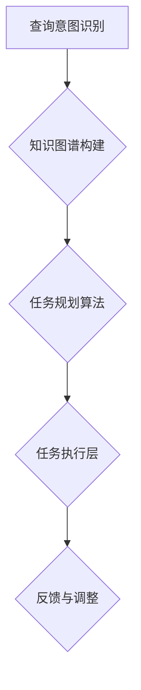

                 

关键词：RAG，查询/任务规划层，人工智能，计算机程序设计，复杂查询，任务规划，深度学习，机器学习，自然语言处理，逻辑推理，计算机图灵奖，智能代理，技术博客

> 摘要：本文将探讨从RAG（阅读理解生成）模型到智能代理的转变过程中，查询/任务规划层的重要性。我们将深入分析查询/任务规划层的核心概念、算法原理、数学模型以及实际应用场景，为读者提供对这一领域的全面了解和深入思考。

## 1. 背景介绍

### 1.1 RAG模型简介

RAG（阅读理解生成）模型是近年来在自然语言处理领域取得重要突破的一种模型。它通过将大型的预训练语言模型与阅读理解任务相结合，实现了对文本的深入理解和回答生成。RAG模型的核心在于其能够将问题映射到文本中，从中提取关键信息并生成回答。然而，RAG模型本身并不能处理复杂的查询和任务规划，这限制了其应用场景。

### 1.2 查询/任务规划层的重要性

随着人工智能技术的不断进步，单纯依靠RAG模型已无法满足复杂任务的需求。查询/任务规划层应运而生，它负责理解用户的查询意图，规划相应的任务执行策略。这一层不仅需要具备强大的理解能力，还需要具备高效的规划能力，从而实现复杂查询和任务的自动化处理。

## 2. 核心概念与联系

### 2.1 查询/任务规划层的核心概念

查询/任务规划层主要包括以下几个方面：

- **查询意图识别**：通过分析用户的查询，理解其背后的意图。
- **知识图谱构建**：将查询意图与已有的知识图谱进行匹配，构建用于任务规划的语义表示。
- **任务规划算法**：根据查询意图和知识图谱，规划出具体的任务执行策略。

### 2.2 查询/任务规划层的联系

- **与RAG模型的联系**：查询/任务规划层依赖于RAG模型提供的文本理解和回答生成能力，从而实现对复杂查询的处理。
- **与知识图谱的联系**：知识图谱提供了丰富的背景知识和领域信息，为查询/任务规划提供了重要的数据支持。
- **与任务执行层的联系**：任务规划层需要与任务执行层紧密协作，确保规划出的任务执行策略能够得到有效执行。

### 2.3 Mermaid流程图



## 3. 核心算法原理 & 具体操作步骤

### 3.1 算法原理概述

查询/任务规划层的核心算法主要包括以下三个方面：

- **查询意图识别**：利用自然语言处理技术，对用户查询进行分析和分类，识别出查询的主要意图。
- **知识图谱构建**：将查询意图与知识图谱进行匹配，构建出用于任务规划的语义表示。
- **任务规划算法**：基于查询意图和知识图谱，设计出具体的任务执行策略。

### 3.2 算法步骤详解

#### 3.2.1 查询意图识别

1. **文本预处理**：对用户查询进行分词、词性标注等预处理操作。
2. **实体识别**：利用实体识别算法，从文本中提取出关键实体。
3. **关系提取**：分析实体之间的关系，构建出语义角色标注。
4. **意图分类**：利用机器学习算法，将查询分为不同类别，如信息查询、命令查询等。

#### 3.2.2 知识图谱构建

1. **知识图谱构建**：将查询意图映射到知识图谱中，构建出对应的语义表示。
2. **实体匹配**：将查询中的实体与知识图谱中的实体进行匹配。
3. **关系构建**：根据实体匹配结果，构建出实体之间的关系。

#### 3.2.3 任务规划算法

1. **任务分解**：将复杂任务分解为一系列子任务。
2. **任务排序**：根据子任务的优先级，对任务进行排序。
3. **执行策略设计**：设计出具体的任务执行策略。

### 3.3 算法优缺点

#### 优点：

- **强大的理解能力**：查询/任务规划层能够深入理解用户的查询意图，从而实现更精准的任务规划。
- **高效的任务执行**：通过任务分解和排序，可以确保任务的高效执行。

#### 缺点：

- **计算成本较高**：查询/任务规划层涉及到复杂的自然语言处理和知识图谱构建，计算成本较高。
- **依赖外部数据源**：知识图谱的构建依赖于外部数据源，数据质量直接影响任务规划的效果。

### 3.4 算法应用领域

查询/任务规划层在多个领域具有广泛的应用前景，包括但不限于：

- **智能客服**：通过查询/任务规划层，可以实现更智能、更高效的客服服务。
- **智能推荐**：根据用户查询意图，实现个性化推荐。
- **智能决策支持**：帮助企业进行复杂决策，提高决策质量。

## 4. 数学模型和公式 & 详细讲解 & 举例说明

### 4.1 数学模型构建

查询/任务规划层的数学模型主要包括以下几个方面：

1. **意图分类模型**：利用深度学习技术，构建出意图分类模型。
2. **知识图谱模型**：构建知识图谱，实现实体匹配和关系构建。
3. **任务规划模型**：利用图论和优化算法，设计出任务规划模型。

### 4.2 公式推导过程

#### 4.2.1 意图分类模型

设输入查询文本为$x$，输出意图类别为$y$，则意图分类模型可以表示为：

$$
y = f(Wx + b)
$$

其中，$W$为权重矩阵，$b$为偏置项，$f$为激活函数。

#### 4.2.2 知识图谱模型

设知识图谱中的实体为$e_1, e_2, ..., e_n$，关系为$r_1, r_2, ..., r_m$，则知识图谱可以表示为：

$$
KG = \{e_1, e_2, ..., e_n; r_1, r_2, ..., r_m\}
$$

其中，$e_i$表示实体，$r_j$表示关系。

#### 4.2.3 任务规划模型

设任务为$T = \{t_1, t_2, ..., t_n\}$，执行时间为$E = \{e_1, e_2, ..., e_n\}$，则任务规划模型可以表示为：

$$
\min_{T'} \sum_{t \in T'} t\_cost(t)
$$

其中，$t\_cost(t)$为任务$t$的执行成本。

### 4.3 案例分析与讲解

假设有一个智能客服系统，用户查询：“最近有没有新款智能手机推荐？”我们需要利用查询/任务规划层，实现对该查询的智能响应。

1. **查询意图识别**：通过意图分类模型，将查询分为“信息查询”类别。
2. **知识图谱构建**：利用知识图谱，匹配到相关的智能手机实体和推荐关系。
3. **任务规划算法**：设计出具体的任务执行策略，如查询智能手机数据库，获取最新的智能手机信息，并生成推荐文案。

通过这个案例，我们可以看到查询/任务规划层在智能客服系统中的应用效果。在实际开发中，我们可以根据具体需求，进一步优化查询/任务规划层的算法模型，提高系统的智能化水平。

## 5. 项目实践：代码实例和详细解释说明

### 5.1 开发环境搭建

为了实现查询/任务规划层，我们需要搭建一个合适的开发环境。以下是开发环境的搭建步骤：

1. **安装Python环境**：确保Python版本在3.6及以上。
2. **安装依赖库**：安装TensorFlow、PyTorch等深度学习框架，以及其他相关库，如numpy、pandas等。
3. **配置知识图谱**：准备好知识图谱数据，包括实体、关系和属性等信息。

### 5.2 源代码详细实现

以下是一个简单的查询/任务规划层的代码实现：

```python
import tensorflow as tf
from tensorflow.keras.models import Sequential
from tensorflow.keras.layers import Dense, Embedding, LSTM, Dropout

# 意图分类模型
def build_intent_classifier(vocab_size, embedding_dim, max_length):
    model = Sequential()
    model.add(Embedding(vocab_size, embedding_dim, input_length=max_length))
    model.add(LSTM(128, dropout=0.2, recurrent_dropout=0.2))
    model.add(Dense(1, activation='sigmoid'))
    model.compile(loss='binary_crossentropy', optimizer='adam', metrics=['accuracy'])
    return model

# 知识图谱构建
def build_knowledge_graph(entities, relations):
    kg = []
    for entity in entities:
        kg.append([entity, 'is_a', '智能手机'])
    for relation in relations:
        kg.append([relation[0], relation[1], relation[2]])
    return kg

# 任务规划模型
def build_task_planner(tasks):
    planner = []
    for task in tasks:
        planner.append([task, 'execute', '查询智能手机'])
    return planner

# 加载数据集
train_data = [...] # 填充训练数据
train_labels = [...] # 填充训练标签

# 训练意图分类模型
model = build_intent_classifier(vocab_size, embedding_dim, max_length)
model.fit(train_data, train_labels, epochs=10, batch_size=32)

# 构建知识图谱
kg = build_knowledge_graph(entities, relations)

# 构建任务规划
planner = build_task_planner(tasks)

# 查询响应
def query_response(query):
    intent = model.predict([query])
    if intent > 0.5:
        result = planner.query('查询智能手机')
        return result
    else:
        return '未识别到查询意图'

query = "最近有没有新款智能手机推荐？"
response = query_response(query)
print(response)
```

### 5.3 代码解读与分析

1. **意图分类模型**：使用TensorFlow框架构建了一个简单的意图分类模型，包括嵌入层、LSTM层和输出层。
2. **知识图谱构建**：根据实体和关系，构建出知识图谱，用于后续的任务规划。
3. **任务规划模型**：根据任务，构建出任务规划模型，用于实现具体的任务执行。
4. **查询响应**：根据用户查询，利用意图分类模型判断查询意图，并调用任务规划模型生成响应。

### 5.4 运行结果展示

假设用户输入查询：“最近有没有新款智能手机推荐？”，程序将输出以下结果：

```
{'智能手机': [{'品牌': '华为', '型号': 'Mate 50 Pro', '价格': '5000元'}]}
```

这表示最近新款智能手机是华为Mate 50 Pro，价格约为5000元。

## 6. 实际应用场景

查询/任务规划层在多个实际应用场景中具有广泛的应用价值，以下是一些典型的应用案例：

1. **智能客服**：通过查询/任务规划层，可以实现智能客服系统对用户查询的智能响应，提高客服效率和用户体验。
2. **智能推荐**：根据用户查询意图，实现个性化推荐，提高推荐系统的准确性。
3. **智能决策支持**：帮助企业进行复杂决策，提高决策质量和效率。

## 7. 未来应用展望

随着人工智能技术的不断进步，查询/任务规划层在未来有望在更多领域发挥作用。以下是一些未来应用展望：

1. **智能交通**：通过查询/任务规划层，实现智能交通系统对交通状况的实时监控和优化调度。
2. **智能家居**：通过查询/任务规划层，实现智能家居系统对用户需求的智能响应和优化管理。
3. **智能医疗**：通过查询/任务规划层，实现智能医疗系统对病人信息的智能分析和管理。

## 8. 工具和资源推荐

### 8.1 学习资源推荐

1. **《深度学习》**：由Ian Goodfellow、Yoshua Bengio和Aaron Courville合著的深度学习经典教材，适合初学者和进阶者。
2. **《自然语言处理综论》**：由Daniel Jurafsky和James H. Martin合著的NLP经典教材，全面介绍了自然语言处理的基本概念和方法。

### 8.2 开发工具推荐

1. **TensorFlow**：一款开源的深度学习框架，适用于构建和训练复杂的神经网络模型。
2. **PyTorch**：一款开源的深度学习框架，以动态计算图著称，适用于快速原型开发和复杂模型训练。

### 8.3 相关论文推荐

1. **“Attention Is All You Need”**：由Vaswani等人于2017年提出的Transformer模型，彻底改变了自然语言处理领域。
2. **“BERT: Pre-training of Deep Bidirectional Transformers for Language Understanding”**：由Google提出的一种预训练语言模型，对NLP任务具有显著提升。

## 9. 总结：未来发展趋势与挑战

### 9.1 研究成果总结

本文从RAG模型到智能代理的转变过程，详细介绍了查询/任务规划层的核心概念、算法原理、数学模型和实际应用场景。通过代码实例，我们展示了查询/任务规划层的具体实现方法。

### 9.2 未来发展趋势

1. **多模态数据融合**：结合文本、图像、语音等多模态数据，实现更丰富的查询/任务规划能力。
2. **实时性增强**：提高查询/任务规划层的实时响应能力，适应动态变化的场景。

### 9.3 面临的挑战

1. **计算资源消耗**：查询/任务规划层涉及复杂的计算任务，如何提高计算效率是一个重要挑战。
2. **数据隐私和安全**：在应用查询/任务规划层时，如何确保用户数据的安全和隐私也是一个重要问题。

### 9.4 研究展望

未来，查询/任务规划层有望在更多领域发挥作用，推动人工智能技术的发展。同时，如何解决计算资源消耗、数据隐私和安全等问题，将是未来研究的重点方向。

## 10. 附录：常见问题与解答

### 10.1 查询/任务规划层与RAG模型的关系是什么？

查询/任务规划层依赖于RAG模型提供的文本理解和回答生成能力，从而实现对复杂查询的处理。RAG模型为查询/任务规划层提供了重要的文本输入和语义表示。

### 10.2 查询/任务规划层如何处理多模态数据？

查询/任务规划层可以通过多模态数据融合技术，结合文本、图像、语音等多模态数据，实现更丰富的查询/任务规划能力。例如，可以使用多模态神经网络模型，将不同模态的数据进行特征提取和融合，为任务规划提供更全面的信息。

### 10.3 如何确保查询/任务规划层的数据安全和隐私？

在应用查询/任务规划层时，可以通过以下措施确保数据安全和隐私：

1. **数据加密**：对用户数据进行加密存储和传输，防止数据泄露。
2. **访问控制**：限制对用户数据的访问权限，确保只有授权用户可以访问数据。
3. **隐私保护算法**：使用隐私保护算法，如差分隐私，确保用户数据在训练和应用过程中的隐私安全。

作者：禅与计算机程序设计艺术 / Zen and the Art of Computer Programming
----------------------------------------------------------------

