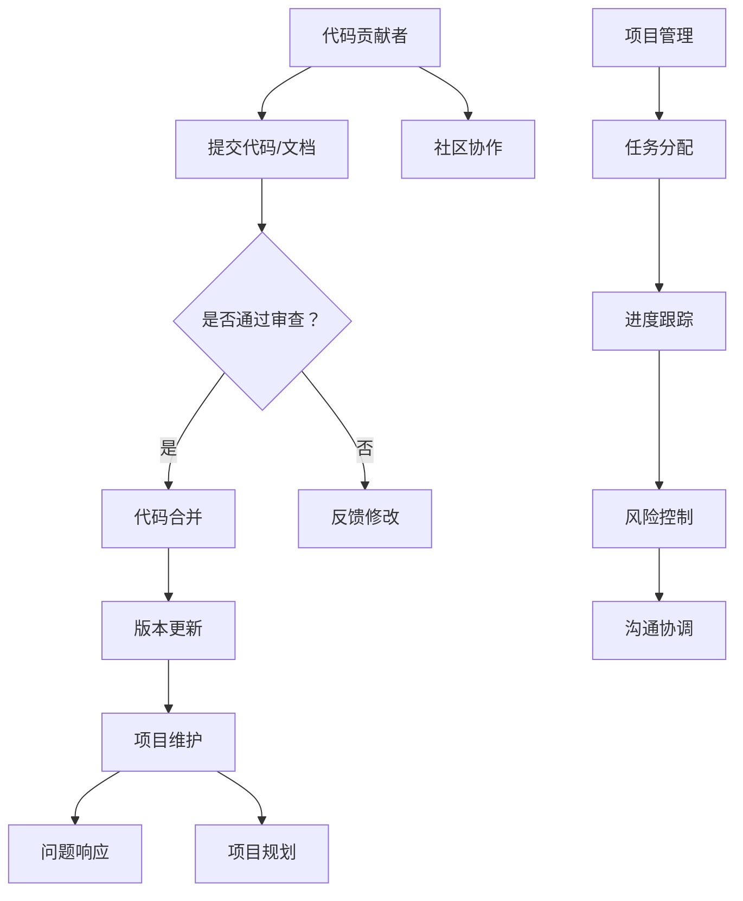

                 

关键词：开源项目、代码贡献者、维护者、项目管理、协作开发、社区建设

> 摘要：本文将探讨如何从一名代码贡献者成长为一个成功的开源项目维护者。通过分析开源项目的核心价值、维护者的角色定位以及项目管理技巧，结合实践案例，作者希望为想要在开源社区中发挥更大作用的开发者提供一些有益的指导。

## 1. 背景介绍

开源项目作为现代软件开发的重要模式之一，已经成为技术创新和知识共享的重要平台。众多知名软件，如Linux内核、Apache HTTP服务器、MySQL数据库等，都是开源项目的结果。参与开源项目不仅能够提升个人的技术能力，还可以扩大人脉，增强影响力。然而，从一名代码贡献者成长为一名成功的开源项目维护者，并非易事。这不仅需要深厚的技术功底，还需要良好的项目管理能力和团队协作精神。

本文旨在探讨如何实现这一角色转变，帮助开发者更好地参与到开源项目中，成为一名有责任感和影响力的维护者。

## 2. 核心概念与联系

在深入探讨如何成为开源项目维护者之前，我们首先需要理解几个核心概念：代码贡献者、开源项目、维护者、项目管理等。

### 2.1. 代码贡献者

代码贡献者是指向开源项目提交代码或文档的人。他们的工作通常包括但不限于：

- **代码编写**：为项目增加新功能或修复已知问题。
- **文档撰写**：完善项目文档，包括开发文档、用户手册等。
- **测试**：编写和执行测试用例，确保代码质量。

### 2.2. 开源项目

开源项目是一种基于共享协议（如GPL、MIT等）的软件项目，允许任何人自由地使用、修改和分发。其核心价值在于社区协作和知识共享。

### 2.3. 维护者

维护者是负责维护开源项目的人。他们的主要职责包括：

- **代码审查**：审核提交的代码，确保其符合项目的质量和规范要求。
- **版本控制**：管理项目的版本更新，确保代码库的稳定性和安全性。
- **问题响应**：及时响应社区成员的问题和反馈。
- **项目规划**：制定项目的发展方向和目标，协调社区成员的工作。

### 2.4. 项目管理

项目管理是指规划、执行、监控和关闭项目的过程。在开源项目中，项目管理包括：

- **任务分配**：为社区成员分配任务，确保项目进展顺利。
- **进度跟踪**：监控项目进度，确保项目按计划进行。
- **风险控制**：识别和应对项目中的风险。
- **沟通协调**：确保团队成员之间的沟通畅通，共同推动项目发展。

### 2.5. Mermaid 流程图

为了更好地理解这些核心概念之间的联系，我们使用Mermaid绘制了一个简单的流程图：



## 3. 核心算法原理 & 具体操作步骤

### 3.1. 算法原理概述

作为开源项目的维护者，理解核心算法原理至关重要。这不仅有助于评估代码质量，还能在需要时进行优化和修复。

开源项目的核心算法通常包括：

- **排序算法**：如快速排序、归并排序等。
- **搜索算法**：如二分搜索、深度优先搜索等。
- **图算法**：如最小生成树、最短路径算法等。

这些算法在开源项目中广泛应用，例如数据库索引、网络路由算法等。

### 3.2. 算法步骤详解

以下以快速排序算法为例，介绍其具体操作步骤：

```mermaid
graph TD
    A[选择基准] --> B{基准左侧}
    B --> C|递归排序左子序列|
    B --> D|递归排序右子序列|
    C --> E{基准右侧}
    E --> F|递归排序左子序列|
    E --> G|递归排序右子序列|
```

1. 选择基准元素。
2. 将数组分为左右两个子序列，左子序列的所有元素小于基准，右子序列的所有元素大于基准。
3. 递归对左右子序列进行快速排序。

### 3.3. 算法优缺点

**优点**：

- **高效**：平均时间复杂度为O(n log n)。
- **稳定性**：相对于其他排序算法，快速排序更加稳定。

**缺点**：

- **最坏情况**：时间复杂度为O(n^2)，当输入序列已经有序或接近有序时，性能会大幅下降。
- **空间复杂度**：递归调用需要额外的栈空间，空间复杂度为O(log n)。

### 3.4. 算法应用领域

快速排序算法在开源项目中广泛应用于各种场景，如数据库索引、排序任务等。例如，Apache Lucene搜索引擎中的文档排序就使用了快速排序算法。

## 4. 数学模型和公式 & 详细讲解 & 举例说明

### 4.1. 数学模型构建

在开源项目中，数学模型的应用无处不在。以下以线性回归模型为例，介绍其数学模型构建过程。

线性回归模型假设数据集Y和特征X之间存在线性关系，可以用以下公式表示：

\[ Y = \beta_0 + \beta_1 \cdot X + \epsilon \]

其中，\(\beta_0\)和\(\beta_1\)分别为模型参数，\(\epsilon\)为误差项。

### 4.2. 公式推导过程

为了求解模型参数，我们通常使用最小二乘法。具体步骤如下：

1. 构建损失函数：

\[ J(\beta_0, \beta_1) = \sum_{i=1}^{n} (Y_i - (\beta_0 + \beta_1 \cdot X_i))^2 \]

2. 对损失函数分别对\(\beta_0\)和\(\beta_1\)求偏导，并令其等于0，得到以下方程组：

\[ \frac{\partial J}{\partial \beta_0} = -2 \sum_{i=1}^{n} (Y_i - (\beta_0 + \beta_1 \cdot X_i)) = 0 \]
\[ \frac{\partial J}{\partial \beta_1} = -2 \sum_{i=1}^{n} (X_i (Y_i - (\beta_0 + \beta_1 \cdot X_i))) = 0 \]

3. 解方程组，得到最优参数：

\[ \beta_0 = \frac{1}{n} \sum_{i=1}^{n} Y_i - \beta_1 \cdot \frac{1}{n} \sum_{i=1}^{n} X_i \]
\[ \beta_1 = \frac{1}{n} \sum_{i=1}^{n} X_i Y_i - \frac{1}{n} \sum_{i=1}^{n} X_i \sum_{i=1}^{n} Y_i \]

### 4.3. 案例分析与讲解

假设我们有以下数据集：

| X | Y |
|---|---|
| 1 | 2 |
| 2 | 4 |
| 3 | 6 |
| 4 | 8 |

根据上述线性回归模型，我们可以计算出模型参数：

```latex
\beta_0 = \frac{1}{4} (2 + 4 + 6 + 8) - \beta_1 \cdot \frac{1}{4} (1 + 2 + 3 + 4) = 5 - \beta_1 \cdot 2.5
\beta_1 = \frac{1}{4} (1 \cdot 2 + 2 \cdot 4 + 3 \cdot 6 + 4 \cdot 8) - \frac{1}{4} (1 + 2 + 3 + 4) (2 + 4 + 6 + 8) = 20 - 25 = -5
```

因此，线性回归模型为：

\[ Y = 5 - 2.5X \]

我们可以用这个模型预测X为3时的Y值：

\[ Y = 5 - 2.5 \cdot 3 = 2.5 \]

## 5. 项目实践：代码实例和详细解释说明

### 5.1. 开发环境搭建

在参与开源项目之前，我们需要搭建一个合适的开发环境。以下以Python为例，介绍开发环境的搭建步骤：

1. 安装Python：
   ```bash
   sudo apt-get install python3
   ```
2. 安装依赖管理工具pip：
   ```bash
   sudo apt-get install python3-pip
   ```
3. 安装项目所需依赖：
   ```bash
   pip3 install -r requirements.txt
   ```

### 5.2. 源代码详细实现

以下是一个简单的Python开源项目示例，用于计算两个数的和。

```python
# sum.py

def add(a, b):
    return a + b

if __name__ == "__main__":
    print("The sum of 3 and 4 is:", add(3, 4))
```

### 5.3. 代码解读与分析

1. **函数定义**：`add`函数接收两个参数`a`和`b`，返回它们的和。
2. **主程序**：当模块被直接运行时，执行`if __name__ == "__main__":`下的代码，打印计算结果。

### 5.4. 运行结果展示

```bash
$ python sum.py
The sum of 3 and 4 is: 7
```

## 6. 实际应用场景

开源项目在实际应用场景中扮演着重要角色。以下是一些常见的应用场景：

### 6.1. 软件开发

开源项目为软件开发的各个环节提供了丰富的工具和框架，如Web开发中的Django、Flask等，数据库开发中的MySQL、PostgreSQL等。

### 6.2. 系统集成

开源项目在系统集成中也发挥着重要作用。例如，Kubernetes用于容器编排，Docker用于容器化部署。

### 6.3. 数据科学

开源项目为数据科学提供了丰富的工具和库，如Python中的Pandas、NumPy、Scikit-learn等。

### 6.4. 未来应用展望

随着技术的不断进步，开源项目在未来的应用场景将更加广泛。例如，人工智能、区块链等新兴领域都将依赖于开源项目。

## 7. 工具和资源推荐

### 7.1. 学习资源推荐

- 《开源之道》：了解开源项目的基本概念和实践方法。
- 《GitHub实战》：详细介绍如何使用GitHub进行版本控制和项目管理。

### 7.2. 开发工具推荐

- Visual Studio Code：一款功能强大的跨平台代码编辑器。
- Git：版本控制工具，用于管理代码的版本和变更。

### 7.3. 相关论文推荐

- “Open Source Software Development: The Case of Linux” by M. F.etecta, 2002。
- “The Success of Open Source” by R. W. Reifer, 2004。

## 8. 总结：未来发展趋势与挑战

### 8.1. 研究成果总结

本文从代码贡献者到开源项目维护者的角色转变进行了深入探讨，分析了开源项目的核心价值、维护者的角色定位以及项目管理技巧。

### 8.2. 未来发展趋势

随着技术的不断进步，开源项目将在更多领域得到应用。未来，开源项目的发展趋势将包括：

- **自动化和智能化**：利用人工智能技术优化开源项目的开发和管理。
- **社区协作**：加强社区成员之间的合作与交流。

### 8.3. 面临的挑战

开源项目在未来的发展中也将面临一些挑战：

- **知识产权保护**：确保开源项目的知识产权得到保护。
- **社区治理**：建立有效的社区治理机制，确保项目的稳定发展。

### 8.4. 研究展望

未来，我们将继续关注开源项目的发展趋势，探讨如何更好地利用开源技术推动技术创新和知识共享。

## 9. 附录：常见问题与解答

### 9.1. 如何选择合适的开源项目？

- 关注自己感兴趣的技术领域。
- 选择活跃的项目，查看其维护者和管理团队。
- 考虑项目的需求和贡献者数量。

### 9.2. 开源项目的维护者如何应对贡献者的反馈？

- 保持开放和诚恳的态度，认真对待每一个反馈。
- 及时回应，给出明确的答复和解决方案。
- 与贡献者保持良好的沟通，建立信任关系。

### 9.3. 如何在开源项目中提升自己的技术能力？

- 学习项目中的核心算法和架构。
- 参与代码审查和测试，提高代码质量。
- 多与项目成员交流，拓宽技术视野。

----------------------------------------------------------------

作者：禅与计算机程序设计艺术 / Zen and the Art of Computer Programming

