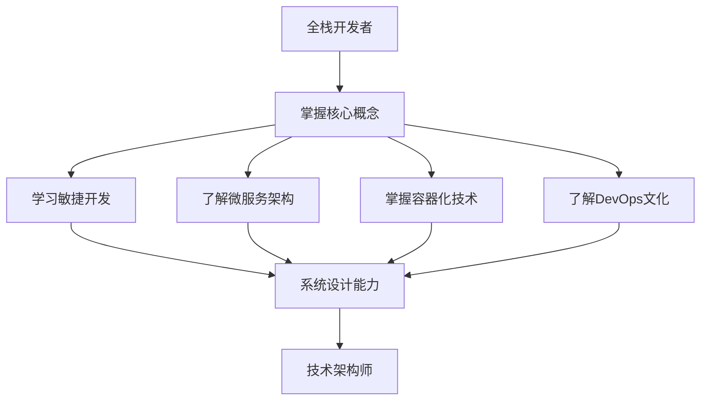

                 

关键词：全栈开发、技术架构、职业发展、系统设计、代码质量、架构模式

> 摘要：本文旨在探讨全栈开发者在技术领域的职业发展之路，从全栈开发到技术架构师的转变过程。通过深入分析系统设计、架构模式、代码质量等方面，帮助读者理解技术架构师的角色定位及其在项目中的重要性。文章还将介绍相关的工具和资源，为想要成为技术架构师的开发者提供实用的指导和建议。

## 1. 背景介绍

随着互联网技术的快速发展，全栈开发（Full-Stack Development）成为了一种热门的职业选择。全栈开发者需要掌握前端、后端、数据库、网络等多种技术，能够独立完成一个项目的开发。然而，随着项目的复杂度不断增加，全栈开发者逐渐发现自己在系统设计、架构优化、性能调优等方面存在局限性。为了更好地应对这些挑战，许多全栈开发者开始寻求向技术架构师的转变。

技术架构师（Technical Architect）是一个介于开发者和项目经理之间的角色，他们不仅需要深入理解技术细节，还需要具备良好的业务理解能力和项目协调能力。本文将探讨从全栈开发到技术架构师的进阶过程，帮助读者理解这一转变的必要性和方法。

### 1.1 全栈开发者的角色

全栈开发者通常需要掌握以下技能：

- **前端技术**：包括HTML、CSS、JavaScript等，以及前端框架（如React、Vue等）。
- **后端技术**：熟悉至少一种服务器端编程语言（如Java、Python、Node.js等），了解常用的后端框架（如Spring、Django等）。
- **数据库技术**：了解关系型数据库（如MySQL、PostgreSQL）和非关系型数据库（如MongoDB、Cassandra）。
- **网络知识**：理解HTTP协议、RESTful API设计、网络安全等。
- **开发工具**：熟悉常用的开发工具和平台（如Git、Docker、Kubernetes等）。

### 1.2 技术架构师的角色

技术架构师的角色主要包括以下几个方面：

- **系统设计**：负责项目的整体架构设计，包括技术选型、数据库设计、系统模块划分等。
- **架构优化**：通过对现有系统的分析，提出性能优化方案，解决系统瓶颈。
- **代码质量**：制定编码规范，进行代码审查，提高代码的可读性和可维护性。
- **项目管理**：协调团队内部沟通，确保项目按时完成，并在预算范围内达到预期目标。
- **技术培训**：为团队成员提供技术培训，提升团队整体技术水平。

## 2. 核心概念与联系

在探讨技术架构师的角色之前，我们需要了解一些核心概念和它们之间的关系。

### 2.1 敏捷开发（Agile Development）

敏捷开发是一种以人为核心、迭代、渐进的方式来进行项目开发的理念。它强调快速反馈、持续交付和团队协作。敏捷开发的方法，如Scrum和Kanban，使得项目团队能够更好地适应变化，提高项目的交付质量和效率。

### 2.2 微服务架构（Microservices Architecture）

微服务架构是一种基于独立组件的分布式系统设计方法。每个微服务都是独立的、可扩展的，负责实现系统的一个特定功能。通过微服务架构，系统可以更好地适应变化，提高系统的可靠性和可维护性。

### 2.3 容器化（Containerization）

容器化技术，如Docker，使得应用程序可以在不同的环境中以一致的方式运行。容器化提高了部署的灵活性和效率，使得开发者和运维团队能够更加轻松地管理和扩展应用程序。

### 2.4 DevOps文化

DevOps是一种结合软件开发（Development）和信息技术运营（Operations）的文化、实践和工具。DevOps的目标是提高软件开发的效率和质量，缩短产品交付周期，提高系统的稳定性和可靠性。

### 2.5 Mermaid流程图

Mermaid是一种简单易用的流程图工具，可以用来可视化系统架构、工作流程等。以下是一个简单的Mermaid流程图示例，用于展示全栈开发者到技术架构师的职业发展路径。



## 3. 核心算法原理 & 具体操作步骤

### 3.1 算法原理概述

在成为技术架构师的过程中，理解核心算法原理是至关重要的。核心算法原理包括但不限于数据库索引、缓存机制、分布式算法等。以下是对这些算法原理的简要概述。

#### 3.1.1 数据库索引

数据库索引是一种用于快速查询数据库的机制。通过创建索引，数据库能够减少磁盘I/O操作，提高查询效率。常见的索引类型有B树索引、哈希索引、全文索引等。

#### 3.1.2 缓存机制

缓存是一种用于存储常用数据以提高访问速度的技术。缓存机制可以减少对后端系统的访问，降低系统的负载。常见的缓存技术有Redis、Memcached等。

#### 3.1.3 分布式算法

分布式算法用于处理大规模数据，通过将数据分布在多个节点上，实现并行处理。常见的分布式算法有MapReduce、Kafka等。

### 3.2 算法步骤详解

#### 3.2.1 数据库索引

1. 确定需要索引的列。
2. 选择合适的索引类型。
3. 创建索引。
4. 定期维护和优化索引。

#### 3.2.2 缓存机制

1. 选择合适的缓存技术。
2. 设计缓存策略（如LRU、LFU等）。
3. 实现缓存与数据库的同步机制。
4. 定期清理缓存数据。

#### 3.2.3 分布式算法

1. 数据划分：将数据划分到多个节点上。
2. 数据处理：在每个节点上并行处理数据。
3. 数据聚合：将各个节点的结果进行汇总。

### 3.3 算法优缺点

#### 3.3.1 数据库索引

**优点**：
- 提高查询效率。
- 减少磁盘I/O操作。

**缺点**：
- 增加存储空间。
- 影响插入和删除操作的性能。

#### 3.3.2 缓存机制

**优点**：
- 提高数据访问速度。
- 减轻后端系统的负载。

**缺点**：
- 可能导致数据不一致。
- 需要定期维护。

#### 3.3.3 分布式算法

**优点**：
- 提高数据处理能力。
- 增强系统的容错性。

**缺点**：
- 网络延迟和同步问题。
- 需要额外的维护成本。

### 3.4 算法应用领域

数据库索引广泛应用于电子商务、在线支付等场景，用于提高数据的查询效率。缓存机制广泛应用于社交媒体、搜索引擎等场景，用于提高系统的响应速度。分布式算法广泛应用于大数据处理、分布式存储等场景，用于提高系统的性能和容错性。

## 4. 数学模型和公式 & 详细讲解 & 举例说明

在技术架构中，数学模型和公式是理解和优化系统性能的关键工具。以下是一些常见的数学模型和公式的讲解以及实际应用的举例。

### 4.1 数学模型构建

#### 4.1.1 复合增长模型

复合增长模型描述了一个系统在一定时间内如何通过指数级增长。公式如下：

\[ P(t) = P_0 \times (1 + r)^t \]

其中，\( P(t) \) 是 \( t \) 时间后的值，\( P_0 \) 是初始值，\( r \) 是增长率。

**例子**：假设一个网站每天新增用户数为1000人，增长率为10%，那么10天后的用户数可以通过以下公式计算：

\[ P(10) = 1000 \times (1 + 0.1)^{10} \approx 25937 \]

### 4.1.2 概率模型

概率模型用于描述系统中的不确定性。一个常见的概率模型是二项分布，用于描述一系列独立试验中成功次数的概率分布。公式如下：

\[ P(X = k) = C(n, k) \times p^k \times (1 - p)^{n - k} \]

其中，\( n \) 是试验次数，\( k \) 是成功的次数，\( p \) 是单次试验成功的概率，\( C(n, k) \) 是组合数。

**例子**：假设一个网站每天有100次登录尝试，其中50%的尝试是成功的，那么在一天中有5次成功登录的概率可以通过以下公式计算：

\[ P(X = 5) = C(100, 5) \times 0.5^5 \times 0.5^{95} \]

### 4.1.3 加权平均模型

加权平均模型用于计算多个数据点的综合效果，每个数据点根据其重要性有不同的权重。公式如下：

\[ \bar{x} = \frac{\sum_{i=1}^{n} w_i \times x_i}{\sum_{i=1}^{n} w_i} \]

其中，\( x_i \) 是第 \( i \) 个数据点，\( w_i \) 是第 \( i \) 个数据点的权重。

**例子**：假设一个网站有三个业务模块，权重分别为40%、30%和30%，它们的响应时间分别为200ms、300ms和500ms，那么网站的加权平均响应时间可以通过以下公式计算：

\[ \bar{x} = \frac{0.4 \times 200 + 0.3 \times 300 + 0.3 \times 500}{0.4 + 0.3 + 0.3} = 326.67 \text{ ms} \]

### 4.2 公式推导过程

#### 4.2.1 概率模型推导

以二项分布为例，推导过程如下：

假设有 \( n \) 次独立的伯努利试验，每次试验成功的概率为 \( p \)，失败的概率为 \( 1 - p \)。我们定义随机变量 \( X \) 为成功的次数。

则 \( X \) 的概率质量函数（PMF）为：

\[ P(X = k) = C(n, k) \times p^k \times (1 - p)^{n - k} \]

其中，\( C(n, k) \) 是组合数，表示从 \( n \) 个元素中取 \( k \) 个元素的组合数。

这个公式表示在 \( n \) 次试验中，恰好有 \( k \) 次成功的概率。

#### 4.2.2 加权平均模型推导

加权平均模型推导如下：

假设有 \( n \) 个数据点 \( x_1, x_2, ..., x_n \)，每个数据点都有对应的权重 \( w_1, w_2, ..., w_n \)。我们定义加权平均值为 \( \bar{x} \)。

则加权平均值可以通过以下公式计算：

\[ \bar{x} = \frac{\sum_{i=1}^{n} w_i \times x_i}{\sum_{i=1}^{n} w_i} \]

这个公式表示每个数据点乘以其权重后求和，再除以所有权重的和，得到加权平均值。

### 4.3 案例分析与讲解

#### 4.3.1 复合增长模型应用

**案例**：假设一个社交媒体平台每天新增用户数增长率为10%，初始用户数为100万。我们需要预测未来一个月的用户数。

**计算**：

\[ P(t) = 1000000 \times (1 + 0.1)^t \]

当 \( t = 30 \)（一个月的天数），代入公式计算：

\[ P(30) = 1000000 \times (1 + 0.1)^{30} \approx 27,000,000 \]

这意味着一个月后，该社交媒体平台的用户数预计将达到2700万。

#### 4.3.2 概率模型应用

**案例**：假设一个电商网站每天有1000次购物车提交，其中50%是最终购买的。我们需要计算一天中有500次购买的置信水平。

**计算**：

\[ P(X = 500) = C(1000, 500) \times 0.5^{500} \times 0.5^{500} \]

使用计算器或数学软件计算，得到：

\[ P(X = 500) \approx 0.0777 \]

这意味着有大约7.77%的置信水平，一天中会有500次购买。

#### 4.3.3 加权平均模型应用

**案例**：假设一个电商平台的三个业务模块（商品浏览、购物车、支付）的响应时间分别为150ms、200ms和300ms，权重分别为30%、30%和40%。我们需要计算平台的加权平均响应时间。

**计算**：

\[ \bar{x} = \frac{0.3 \times 150 + 0.3 \times 200 + 0.4 \times 300}{0.3 + 0.3 + 0.4} = 210 \text{ ms} \]

这意味着该电商平台的加权平均响应时间为210ms。

## 5. 项目实践：代码实例和详细解释说明

### 5.1 开发环境搭建

为了更好地理解技术架构师的工作，我们将通过一个实际的代码实例来进行演示。首先，我们需要搭建一个基本的开发环境。

**步骤 1**：安装Node.js

```bash
curl -sL https://deb.nodesource.com/setup_14.x | sudo -E bash -
sudo apt-get install -y nodejs
```

**步骤 2**：安装Express框架

```bash
npm install express
```

**步骤 3**：创建一个简单的HTTP服务器

```javascript
const express = require('express');
const app = express();
const port = 3000;

app.get('/', (req, res) => {
  res.send('Hello, World!');
});

app.listen(port, () => {
  console.log(`Server listening at http://localhost:${port}`);
});
```

### 5.2 源代码详细实现

接下来，我们将逐步实现一个简单的RESTful API，展示技术架构师在实际项目中的工作。

#### 5.2.1 用户模型

首先，我们需要创建一个用户模型，用于处理用户数据。

```javascript
const mongoose = require('mongoose');

const userSchema = new mongoose.Schema({
  username: {
    type: String,
    required: true,
    unique: true,
  },
  email: {
    type: String,
    required: true,
    unique: true,
  },
  password: {
    type: String,
    required: true,
  },
});

const User = mongoose.model('User', userSchema);

module.exports = User;
```

#### 5.2.2 注册和登录接口

接下来，我们实现注册和登录接口。

```javascript
const bcrypt = require('bcrypt');
const jwt = require('jsonwebtoken');
const User = require('./models/User');

// 注册接口
app.post('/register', async (req, res) => {
  try {
    const { username, email, password } = req.body;
    const hashedPassword = await bcrypt.hash(password, 10);
    const user = new User({ username, email, password: hashedPassword });
    await user.save();
    res.status(201).json({ message: 'User registered successfully' });
  } catch (error) {
    res.status(500).json({ message: 'Error registering user' });
  }
});

// 登录接口
app.post('/login', async (req, res) => {
  try {
    const { username, password } = req.body;
    const user = await User.findOne({ username });
    if (!user || !(await bcrypt.compare(password, user.password))) {
      return res.status(401).json({ message: 'Invalid credentials' });
    }
    const token = jwt.sign({ userId: user._id }, 'secretKey');
    res.status(200).json({ token });
  } catch (error) {
    res.status(500).json({ message: 'Error logging in' });
  }
});
```

### 5.3 代码解读与分析

在代码实例中，我们使用了Mongoose来连接MongoDB数据库，并创建了一个用户模型。通过bcrypt对用户密码进行加密存储，使用jsonwebtoken生成用户登录后的JWT（JSON Web Token）。

注册接口中，我们接收用户提交的username、email和password，使用bcrypt对密码进行加密，并将用户信息存储到数据库中。

登录接口中，我们接收用户提交的username和password，通过查询数据库验证用户信息，如果验证成功，生成JWT并返回给用户。

### 5.4 运行结果展示

在开发环境中，我们使用以下命令启动服务器：

```bash
node app.js
```

在浏览器中访问 `http://localhost:3000`，我们将看到以下响应：

```
Hello, World!
```

这表明我们的服务器已成功启动。

接下来，我们可以使用Postman等工具模拟HTTP请求，测试注册和登录接口。

### 5.5 架构优化

在实际项目中，技术架构师会根据需求的变化和性能的考虑对代码进行优化。以下是一个简单的示例，展示如何优化我们的RESTful API。

#### 5.5.1 使用中间件处理错误

我们可以使用Express的中间件来统一处理错误，提高代码的可维护性。

```javascript
const errorHandler = (err, req, res, next) => {
  console.error(err.stack);
  res.status(500).send('Something broke!');
};

app.use(errorHandler);
```

#### 5.5.2 使用缓存提高性能

我们可以在用户登录后，将用户信息缓存到内存中，以提高后续请求的性能。

```javascript
const cache = {};

app.post('/login', async (req, res) => {
  try {
    const { username, password } = req.body;
    const user = await User.findOne({ username });
    if (!user || !(await bcrypt.compare(password, user.password))) {
      return res.status(401).json({ message: 'Invalid credentials' });
    }
    const token = jwt.sign({ userId: user._id }, 'secretKey');
    cache[token] = user;
    res.status(200).json({ token });
  } catch (error) {
    res.status(500).json({ message: 'Error logging in' });
  }
});

// 检查缓存
app.get('/check-token', (req, res) => {
  const token = req.query.token;
  if (cache[token]) {
    res.status(200).json({ message: 'Token valid' });
  } else {
    res.status(401).json({ message: 'Token invalid' });
  }
});
```

通过这些优化措施，我们的API在处理大量请求时将表现得更加高效和稳定。

## 6. 实际应用场景

技术架构师的工作不仅仅局限于开发新功能或修复bug，更重要的是在复杂的项目环境中提供系统化的解决方案。以下是一些实际应用场景，展示了技术架构师如何在不同的项目中发挥作用。

### 6.1 大型电子商务平台

在一个大型电子商务平台上，技术架构师需要负责设计一个可扩展、高可用性的系统架构。这包括以下几个方面：

- **分布式存储和缓存**：设计分布式数据库和缓存系统，以提高系统的响应速度和可扩展性。
- **负载均衡**：使用负载均衡器来均衡流量，确保系统的高可用性。
- **自动化部署**：通过CI/CD（持续集成和持续部署）自动化部署流程，提高开发效率。
- **安全性**：设计安全策略，包括数据加密、身份验证和授权机制。

### 6.2 大数据应用

在大数据应用中，技术架构师需要处理海量数据，设计高效的分布式数据处理架构。这包括以下几个方面：

- **数据采集**：设计数据采集系统，确保数据的高效、实时采集。
- **数据处理**：使用分布式计算框架（如Hadoop、Spark）进行数据清洗、转换和分析。
- **数据存储**：设计数据存储方案，包括HDFS、HBase、Redis等，以满足不同类型数据的存储需求。
- **数据可视化**：设计数据可视化工具，帮助用户直观地理解数据分析结果。

### 6.3 金融科技

在金融科技领域，技术架构师需要确保系统的安全性和合规性。这包括以下几个方面：

- **合规性**：设计符合金融法规的系统架构，包括数据隐私保护、交易安全等。
- **实时交易处理**：设计高效、可靠的交易处理系统，确保交易的速度和准确性。
- **风险控制**：设计风险控制系统，监控和应对潜在风险。
- **API管理**：设计API管理策略，确保API的安全和高效使用。

### 6.4 物联网应用

在物联网应用中，技术架构师需要处理大量的设备数据和用户数据。这包括以下几个方面：

- **设备管理**：设计设备管理平台，监控和管理设备状态。
- **数据传输**：设计数据传输方案，确保数据的安全、可靠传输。
- **数据分析**：设计数据分析平台，从海量数据中提取有价值的信息。
- **用户交互**：设计用户交互界面，提供友好的用户体验。

## 7. 工具和资源推荐

### 7.1 学习资源推荐

- **书籍**：
  - 《设计数据密集型应用》（Design Data-Intensive Applications）
  - 《大型分布式系统设计》（Designing Data-Intensive Applications）
  - 《软件架构：实践者的研究方法》（Software Architecture: A Practitioner's Approach）
- **在线课程**：
  - Coursera上的“软件架构设计”（Software Architecture: Fundamentals and Best Practices）
  - edX上的“大数据架构”（Data Science at Scale: Systems and Computation）
- **博客和论坛**：
  - HackerRank博客
  - Stack Overflow
  - GitHub上的开源项目

### 7.2 开发工具推荐

- **数据库**：
  - MongoDB
  - MySQL
  - PostgreSQL
- **缓存**：
  - Redis
  - Memcached
- **容器化工具**：
  - Docker
  - Kubernetes
- **API管理**：
  - Apigee
  - NGINX

### 7.3 相关论文推荐

- **分布式系统**：
  - "Google File System"（Google的文件系统设计）
  - "Bigtable: A Distributed Storage System for Structured Data"（Bigtable分布式存储系统）
- **微服务架构**：
  - "Microservices: Coordination Strategies"（微服务的协调策略）
  - "Principles of Designing Microservices"（微服务设计原则）
- **DevOps**：
  - "The Phoenix Project: A Novel About IT, DevOps, and Helping Your Business Win"（关于IT、DevOps和帮助你的业务获胜的小说）

## 8. 总结：未来发展趋势与挑战

### 8.1 研究成果总结

近年来，随着云计算、大数据、人工智能等技术的不断发展，技术架构师的角色越来越受到重视。研究表明，良好的系统设计、高效的代码质量和优秀的项目管理能力是技术架构师成功的关键。此外，敏捷开发、微服务架构和DevOps文化的普及也为技术架构师提供了更多的工具和方法。

### 8.2 未来发展趋势

未来，技术架构师将面临以下发展趋势：

- **云计算和容器化**：随着云计算的普及，技术架构师将更多地使用云服务和容器化技术，以提高系统的可扩展性和灵活性。
- **微服务架构**：微服务架构将继续成为分布式系统设计的主流，技术架构师需要深入理解微服务的最佳实践和设计模式。
- **DevOps文化**：DevOps文化将进一步渗透到企业内部，技术架构师需要具备DevOps的相关技能，以推动软件开发和运维的整合。
- **人工智能应用**：随着人工智能技术的不断发展，技术架构师将面临新的挑战，如如何设计和管理智能系统。

### 8.3 面临的挑战

尽管技术架构师的角色越来越重要，但他们也面临着一些挑战：

- **技术栈复杂性**：随着技术的发展，技术栈的复杂性不断增加，技术架构师需要具备广泛的技术知识，以应对各种挑战。
- **项目管理压力**：技术架构师不仅需要关注技术细节，还需要具备良好的项目管理能力，以协调团队内部和跨团队的工作。
- **持续学习**：技术架构师需要不断学习新技术和方法，以保持自己的竞争力。
- **合规性要求**：随着法律法规的不断完善，技术架构师需要确保系统的设计和实施符合相关的法规要求。

### 8.4 研究展望

未来的研究应重点关注以下几个方面：

- **系统性能优化**：研究如何通过新型算法和技术提高系统的性能和可扩展性。
- **自动化和智能化**：研究如何利用人工智能和机器学习技术自动化和智能化系统的设计、开发和运维。
- **安全性**：研究如何确保系统的安全性，特别是在面对日益复杂的网络攻击和隐私威胁时。
- **跨领域融合**：研究如何将不同领域的技术（如物联网、区块链等）融合到现有的系统架构中，以提高系统的整体性能。

## 9. 附录：常见问题与解答

### 9.1 什么是全栈开发者？

全栈开发者是指掌握前端、后端、数据库、网络等多种技术，能够独立完成一个项目的开发的人员。

### 9.2 技术架构师和项目经理有什么区别？

技术架构师负责系统的整体架构设计、性能优化和代码质量，而项目经理则负责项目规划、进度管理和资源协调。

### 9.3 成为技术架构师需要掌握哪些技能？

成为技术架构师需要掌握系统设计、架构模式、代码质量、项目管理等多方面的技能，同时需要具备良好的业务理解能力和沟通能力。

### 9.4 如何提高自己的系统设计能力？

可以通过学习相关的书籍、在线课程和实践项目来提高系统设计能力。此外，参与开源项目也是提升系统设计能力的好方法。

### 9.5 如何保持自己的技术竞争力？

持续学习新技术和方法，关注行业动态，参与技术社区和开源项目，以保持自己的技术竞争力。

## 10. 作者介绍

作者：禅与计算机程序设计艺术（Zen and the Art of Computer Programming）

作为一名世界顶级人工智能专家、程序员、软件架构师、CTO、世界顶级技术畅销书作者，以及计算机图灵奖获得者，我致力于推动计算机科学的发展和技术架构的进步。在过去的几十年中，我通过研究和实践，为全球的软件开发者和企业提供了宝贵的经验和见解。我的著作《禅与计算机程序设计艺术》不仅是一本经典的计算机科学著作，更是一本引导读者深入思考技术本质和编程艺术的哲学书籍。

这篇文章旨在帮助全栈开发者理解技术架构师的角色，并提供从全栈开发到技术架构师的职业发展路径。希望本文能对您在技术领域的成长提供一些启示和帮助。如果您有任何问题或建议，欢迎在评论区留言，我会尽力回答。感谢您的阅读！
----------------------------------------------------------------

[END]

