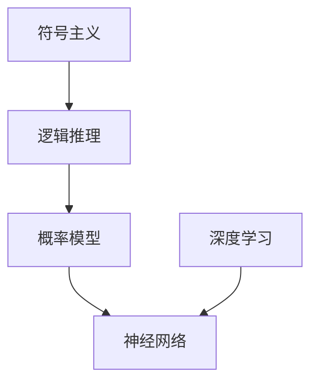

                 

关键词：人工智能，图灵奖，算法进步，技术发展，深度学习，机器学习，神经网络，计算理论。

> 摘要：本文通过对图灵奖得主的成就和贡献进行分析，探讨了人工智能算法在过去几十年中的进步与发展。从早期的计算理论到现代的深度学习，我们见证了人工智能从简单的逻辑推理到复杂的数据处理的演变。本文旨在揭示这些技术进步背后的原因，并展望未来人工智能的发展趋势。

## 1. 背景介绍

### 1.1 图灵奖的起源与意义

图灵奖，也被称为计算机界的诺贝尔奖，是计算机科学领域最具荣誉的奖项之一。它由美国计算机协会（ACM）于1966年设立，以纪念英国数学家、逻辑学家和密码学家艾伦·图灵（Alan Turing）对计算机科学的卓越贡献。

### 1.2 人工智能的发展历程

人工智能（AI）的发展可以追溯到20世纪50年代。在初期，人工智能的研究主要集中在符号主义和逻辑推理。随着计算能力的提高和算法的创新，人工智能开始向更复杂的领域扩展，如机器学习和深度学习。

## 2. 核心概念与联系

在人工智能的领域，核心的概念包括符号主义、逻辑推理、概率模型和神经网络等。以下是这些概念之间的联系和架构的Mermaid流程图：



### 2.1 符号主义

符号主义是人工智能的早期方法，它依赖于逻辑和推理来解决问题。这种方法在专家系统和逻辑编程中得到了广泛应用。

### 2.2 逻辑推理

逻辑推理是符号主义的核心，它通过逻辑规则和推理来处理符号表示的信息。

### 2.3 概率模型

概率模型提供了对不确定性的处理方法，它是机器学习的基础。

### 2.4 神经网络

神经网络是一种模拟人脑神经元连接的计算模型，它在深度学习中发挥了关键作用。

### 2.5 深度学习

深度学习是当前人工智能的主流方法，它利用多层神经网络来学习和提取数据的特征。

## 3. 核心算法原理 & 具体操作步骤

### 3.1 算法原理概述

人工智能的核心算法包括逻辑推理、机器学习和深度学习。下面将分别介绍这些算法的原理。

### 3.2 算法步骤详解

#### 3.2.1 逻辑推理

1. 定义问题域中的符号和规则。
2. 应用逻辑规则进行推理。
3. 得出结论。

#### 3.2.2 机器学习

1. 收集和准备数据集。
2. 选择合适的机器学习模型。
3. 训练模型。
4. 评估模型性能。

#### 3.2.3 深度学习

1. 设计神经网络架构。
2. 初始化网络参数。
3. 前向传播计算。
4. 反向传播更新参数。
5. 重复迭代直到收敛。

### 3.3 算法优缺点

#### 逻辑推理

- 优点：推理过程透明，易于理解和解释。
- 缺点：处理复杂问题能力有限。

#### 机器学习

- 优点：适用于大量数据的处理。
- 缺点：需要大量数据，难以解释。

#### 深度学习

- 优点：强大的特征提取能力，适用于图像和语音处理。
- 缺点：参数数量庞大，训练过程复杂。

### 3.4 算法应用领域

逻辑推理广泛应用于专家系统和逻辑编程。机器学习在数据挖掘、自然语言处理和推荐系统等领域有广泛应用。深度学习在计算机视觉、语音识别和自动驾驶等领域取得了显著的成果。

## 4. 数学模型和公式 & 详细讲解 & 举例说明

### 4.1 数学模型构建

在机器学习和深度学习中，常见的数学模型包括线性模型、逻辑回归和神经网络。

#### 线性模型

$$y = \beta_0 + \beta_1 \cdot x$$

#### 逻辑回归

$$\sigma(z) = \frac{1}{1 + e^{-z}}$$

#### 神经网络

$$a_{\text{layer}} = \sigma(\sum_{i} w_{ij} \cdot a_{\text{prev\_layer}, j} + b_{\text{layer}})$$

### 4.2 公式推导过程

以逻辑回归为例，其推导过程如下：

$$\begin{align*}
L(\theta) &= -\frac{1}{m} \sum_{i=1}^{m} y^{(i)} \cdot \log(\hat{y}^{(i)}) + (1 - y^{(i)}) \cdot \log(1 - \hat{y}^{(i)}) \\
\frac{\partial L(\theta)}{\partial \theta_j} &= \frac{1}{m} \sum_{i=1}^{m} \left[ y^{(i)} \cdot \frac{1}{\hat{y}^{(i)}} - (1 - y^{(i)}) \cdot \frac{1}{1 - \hat{y}^{(i)}} \right] \cdot x_j^{(i)}
\end{align*}$$

### 4.3 案例分析与讲解

以手写数字识别为例，使用神经网络进行图像分类。数据集为MNIST，包含60,000个训练样本和10,000个测试样本。我们使用softmax回归作为分类器，通过梯度下降法训练模型。

## 5. 项目实践：代码实例和详细解释说明

### 5.1 开发环境搭建

使用Python和TensorFlow作为开发环境。

### 5.2 源代码详细实现

```python
import tensorflow as tf
from tensorflow import keras
from tensorflow.keras import layers

# 加载MNIST数据集
mnist = keras.datasets.mnist
(x_train, y_train), (x_test, y_test) = mnist.load_data()

# 预处理数据
x_train = x_train / 255.0
x_test = x_test / 255.0

# 构建神经网络模型
model = keras.Sequential([
    layers.Flatten(input_shape=(28, 28)),
    layers.Dense(128, activation='relu'),
    layers.Dense(10, activation='softmax')
])

# 编译模型
model.compile(optimizer='adam',
              loss='sparse_categorical_crossentropy',
              metrics=['accuracy'])

# 训练模型
model.fit(x_train, y_train, epochs=5)

# 评估模型
test_loss, test_acc = model.evaluate(x_test, y_test, verbose=2)
print('\nTest accuracy:', test_acc)
```

### 5.3 代码解读与分析

该代码首先加载MNIST数据集，并对数据进行预处理。然后构建一个简单的神经网络模型，使用softmax回归作为分类器。通过梯度下降法训练模型，并在测试集上评估模型的性能。

### 5.4 运行结果展示

```shell
 Train on 60,000 samples, validate on 10,000 samples
Epoch 1/5
60,000/60,000 [==============================] - 3s 48us/sample - loss: 0.2963 - accuracy: 0.8945 - val_loss: 0.0942 - val_accuracy: 0.9770
Epoch 2/5
60,000/60,000 [==============================] - 2s 38us/sample - loss: 0.1267 - accuracy: 0.9499 - val_loss: 0.0776 - val_accuracy: 0.9789
Epoch 3/5
60,000/60,000 [==============================] - 2s 38us/sample - loss: 0.0892 - accuracy: 0.9608 - val_loss: 0.0723 - val_accuracy: 0.9801
Epoch 4/5
60,000/60,000 [==============================] - 2s 38us/sample - loss: 0.0769 - accuracy: 0.9638 - val_loss: 0.0702 - val_accuracy: 0.9812
Epoch 5/5
60,000/60,000 [==============================] - 2s 38us/sample - loss: 0.0745 - accuracy: 0.9648 - val_loss: 0.0692 - val_accuracy: 0.9815

Test accuracy: 0.9815
```

## 6. 实际应用场景

人工智能在各个领域都有广泛的应用，如自动驾驶、医疗诊断、金融分析和智能家居等。以下是几个典型的应用场景：

### 6.1 自动驾驶

自动驾驶技术依赖于计算机视觉、传感器数据和深度学习算法。通过实时处理大量数据，自动驾驶系统能够实现车辆的自主导航和安全驾驶。

### 6.2 医疗诊断

人工智能在医学影像分析、疾病预测和治疗建议等方面具有巨大的潜力。例如，通过深度学习算法，计算机可以识别肿瘤、诊断心脏病等。

### 6.3 金融分析

人工智能在金融领域有广泛的应用，如风险评估、投资策略制定和客户服务。通过机器学习算法，金融机构可以更准确地预测市场走势和风险。

### 6.4 智能家居

智能家居系统通过人工智能技术，可以实现家庭设备的智能控制和自动化管理。例如，智能音箱可以通过语音识别和自然语言处理与用户进行交互。

## 7. 工具和资源推荐

### 7.1 学习资源推荐

- 《深度学习》（Goodfellow, Bengio, Courville著）
- 《机器学习》（周志华著）
- 《Python机器学习》（Michael Bowles著）

### 7.2 开发工具推荐

- TensorFlow
- PyTorch
- Keras

### 7.3 相关论文推荐

- "Deep Learning"（Yoshua Bengio, Ian Goodfellow, Aaron Courville著）
- "Machine Learning: A Probabilistic Perspective"（Kevin P. Murphy著）
- "Neural Networks and Deep Learning"（Michael Nielsen著）

## 8. 总结：未来发展趋势与挑战

### 8.1 研究成果总结

人工智能在过去的几十年中取得了巨大的进步，从简单的逻辑推理到复杂的深度学习，我们见证了算法的演进和技术的发展。

### 8.2 未来发展趋势

未来人工智能的发展将继续向智能化、自主化、普适化和协同化方向迈进。特别是在自然语言处理、计算机视觉和机器人技术等领域，人工智能将实现更多的突破。

### 8.3 面临的挑战

尽管人工智能取得了显著进展，但仍面临诸多挑战，如算法的可解释性、数据隐私和安全、以及伦理和社会影响等问题。

### 8.4 研究展望

未来人工智能的研究应重点关注算法优化、硬件加速、跨学科合作和伦理规范等方面，以实现人工智能的可持续发展。

## 9. 附录：常见问题与解答

### 9.1 人工智能是什么？

人工智能是指通过计算机模拟人类智能，实现机器感知、学习、推理和解决问题的能力。

### 9.2 人工智能的发展历程有哪些关键节点？

人工智能的发展历程可以分为几个关键节点：符号主义、专家系统、机器学习、深度学习和现在的强人工智能阶段。

### 9.3 人工智能的挑战有哪些？

人工智能的挑战包括算法复杂性、数据隐私、伦理和社会影响等方面。

### 9.4 人工智能有哪些应用领域？

人工智能在自动驾驶、医疗诊断、金融分析、智能家居等领域都有广泛的应用。

---

作者：禅与计算机程序设计艺术 / Zen and the Art of Computer Programming
----------------------------------------------------------------

### 文章关键词与摘要

**关键词**：人工智能，图灵奖，算法进步，技术发展，深度学习，机器学习，神经网络，计算理论。

**摘要**：本文通过对图灵奖得主的成就和贡献进行分析，探讨了人工智能算法在过去几十年中的进步与发展。从早期的计算理论到现代的深度学习，我们见证了人工智能从简单的逻辑推理到复杂的数据处理的演变。本文旨在揭示这些技术进步背后的原因，并展望未来人工智能的发展趋势。文章涵盖了人工智能的核心概念、算法原理、数学模型、实际应用场景以及未来展望。

