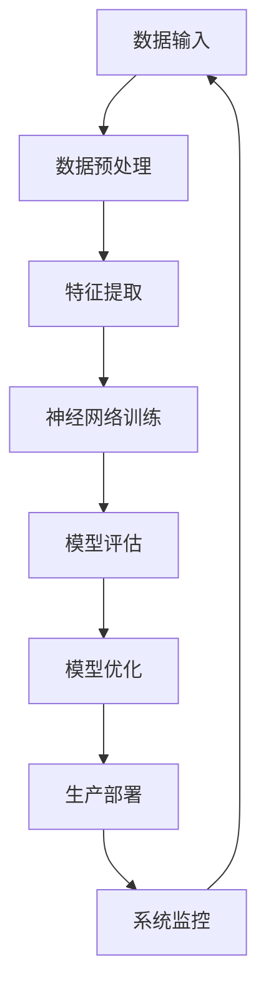
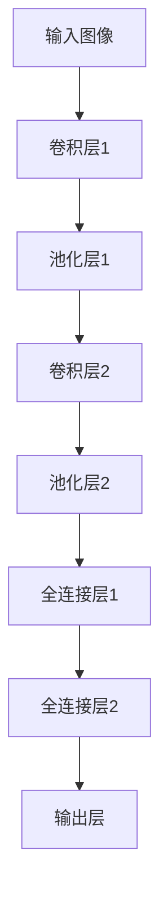

                 

关键词：人工智能，实验室，生产环境，Lepton AI，落地，挑战，机遇

摘要：本文深入探讨了从实验室阶段到生产环境的过渡过程中，人工智能（AI）技术所面临的一系列挑战和机遇。以Lepton AI为例，文章详细分析了其在这一过程中的核心概念、算法原理、数学模型、项目实践以及未来发展趋势。通过这篇文章，读者将全面了解AI技术从理论到实践的全过程，以及其背后的技术逻辑和实践方法。

## 1. 背景介绍

随着人工智能技术的飞速发展，AI在各个领域的应用越来越广泛。从自动驾驶、智能医疗、金融风控到教育、娱乐等，AI正在深刻地改变我们的生活方式。然而，从实验室阶段到生产环境的过渡，并不是一个简单的过程。在这一过程中，AI技术面临着诸多挑战，如算法的稳定性、系统的可扩展性、数据的安全性和隐私保护等。

本文将聚焦于一个具体的人工智能项目——Lepton AI，探讨其从实验室到生产环境的完整落地过程。Lepton AI是一个专注于计算机视觉领域的人工智能项目，其主要目标是实现高效的图像识别和物体检测。本文将分析Lepton AI在这一过程中的核心概念、算法原理、数学模型、项目实践以及未来发展趋势。

## 2. 核心概念与联系

在探讨Lepton AI的落地过程之前，我们需要先了解其背后的核心概念和架构。以下是一个详细的Mermaid流程图，用于展示Lepton AI的技术架构和核心组件之间的联系。



### 2.1 数据输入

数据输入是Lepton AI系统的第一步，也是至关重要的一步。系统的输入数据包括各种图像、视频和传感器数据。这些数据需要经过预处理，以便后续的特征提取和神经网络训练。

### 2.2 数据预处理

数据预处理是确保输入数据质量和一致性的关键步骤。在这一阶段，我们需要对图像和视频进行缩放、裁剪、旋转等操作，以便适应神经网络训练的需要。同时，还需要对数据进行标准化处理，以便神经网络能够更好地收敛。

### 2.3 特征提取

特征提取是Lepton AI系统的核心环节。通过一系列的图像处理算法，我们将原始图像转换为高维特征向量。这些特征向量将作为神经网络训练的输入。

### 2.4 神经网络训练

神经网络训练是Lepton AI系统的核心。我们使用深度学习算法，对特征向量进行训练，以实现对图像的识别和物体检测。这一过程需要大量的计算资源和时间，通常需要通过分布式计算和并行计算来实现。

### 2.5 模型评估

模型评估是确保神经网络训练效果的关键步骤。我们使用各种评估指标，如准确率、召回率、F1分数等，对训练好的模型进行评估，以确保其具有良好的性能。

### 2.6 模型优化

模型优化是进一步提高神经网络性能的关键。在这一阶段，我们可以通过调整网络结构、优化超参数等方式，提高模型的性能。

### 2.7 生产部署

生产部署是将训练好的模型部署到生产环境中的关键步骤。在这一阶段，我们需要确保系统的稳定性和可靠性，以便在实际应用中发挥出最佳效果。

### 2.8 系统监控

系统监控是确保系统正常运行的关键。我们需要实时监控系统的运行状态，以便及时发现和处理潜在的问题。

## 3. 核心算法原理 & 具体操作步骤

### 3.1 算法原理概述

Lepton AI的核心算法是基于深度学习，特别是卷积神经网络（CNN）实现的。CNN通过多层卷积、池化和全连接层等操作，实现对图像的特征提取和分类。以下是一个简单的CNN结构：



### 3.2 算法步骤详解

#### 3.2.1 数据输入

首先，我们需要将输入图像转换为适合CNN处理的形式。通常，我们将图像转换为高宽均为224x224的RGB格式，并将其归一化到[0, 1]的范围内。

```python
import numpy as np
import cv2

def preprocess_image(image_path):
    image = cv2.imread(image_path)
    image = cv2.resize(image, (224, 224))
    image = image / 255.0
    return image
```

#### 3.2.2 卷积层和池化层

卷积层通过滑动窗口的方式，对输入图像进行卷积操作，以提取图像的特征。池化层则通过采样操作，降低特征图的空间分辨率，从而减少模型的参数数量。

```python
from tensorflow.keras.layers import Conv2D, MaxPooling2D

model = Sequential()
model.add(Conv2D(32, (3, 3), activation='relu', input_shape=(224, 224, 3)))
model.add(MaxPooling2D((2, 2)))
model.add(Conv2D(64, (3, 3), activation='relu'))
model.add(MaxPooling2D((2, 2)))
model.add(Conv2D(128, (3, 3), activation='relu'))
model.add(MaxPooling2D((2, 2)))
```

#### 3.2.3 全连接层

全连接层通过将特征图展平为一维向量，并对其进行线性变换，以实现对图像的分类。

```python
from tensorflow.keras.layers import Flatten, Dense

model.add(Flatten())
model.add(Dense(1024, activation='relu'))
model.add(Dense(1000, activation='softmax'))
```

#### 3.2.4 模型训练

使用训练数据对模型进行训练，以优化模型参数。我们通常使用梯度下降算法来更新模型参数。

```python
model.compile(optimizer='adam', loss='categorical_crossentropy', metrics=['accuracy'])
model.fit(train_data, train_labels, epochs=10, batch_size=32)
```

### 3.3 算法优缺点

#### 优点

1. CNN具有良好的图像特征提取能力，可以自动学习图像的局部特征和全局特征。
2. 通过多层的卷积和池化操作，模型可以自适应地降低计算复杂度。
3. CNN具有良好的迁移学习能力，可以在不同领域和任务上取得较好的效果。

#### 缺点

1. CNN的训练过程需要大量的数据和计算资源，训练时间较长。
2. CNN的结构复杂，难以解释和理解。
3. CNN对于噪声和异常值较为敏感。

### 3.4 算法应用领域

CNN在计算机视觉领域有广泛的应用，如图像分类、物体检测、图像分割等。以下是一些典型的应用案例：

1. 图像分类：使用CNN对图像进行分类，可以应用于图片搜索引擎、图像识别等。
2. 物体检测：使用CNN检测图像中的物体，可以应用于自动驾驶、智能监控等。
3. 图像分割：使用CNN对图像进行分割，可以应用于图像编辑、图像识别等。

## 4. 数学模型和公式 & 详细讲解 & 举例说明

### 4.1 数学模型构建

CNN的核心是卷积操作和池化操作，这些操作可以用数学模型来表示。

#### 4.1.1 卷积操作

卷积操作可以用以下公式表示：

$$
(C_{ij}^{l}) = \sum_{k} W_{ikj}^{l} * (A_{kj}^{l-1})
$$

其中，$C_{ij}^{l}$ 表示第 $l$ 层的第 $i$ 行第 $j$ 列的卷积结果，$W_{ikj}^{l}$ 表示卷积核，$A_{kj}^{l-1}$ 表示第 $l-1$ 层的第 $k$ 行第 $j$ 列的激活值。

#### 4.1.2 池化操作

池化操作可以用以下公式表示：

$$
P_{ij}^{l} = \max(A_{i \cdot:i+j}^{l-1})
$$

其中，$P_{ij}^{l}$ 表示第 $l$ 层的第 $i$ 行第 $j$ 列的池化结果，$A_{i \cdot:i+j}^{l-1}$ 表示第 $l-1$ 层从第 $i$ 行开始，到第 $i+j$ 行的激活值。

### 4.2 公式推导过程

CNN的公式推导主要涉及卷积操作和池化操作的推导。以下是一个简单的推导过程：

#### 4.2.1 卷积操作

卷积操作可以看作是一个线性变换，其数学表达式为：

$$
\phi(x) = \sum_{i=1}^{m} w_i * x_i
$$

其中，$x_i$ 表示输入特征，$w_i$ 表示卷积核。

#### 4.2.2 池化操作

池化操作可以看作是一个降维操作，其数学表达式为：

$$
\phi(x) = \max(x_1, x_2, ..., x_n)
$$

其中，$x_i$ 表示输入特征，$n$ 表示池化窗口的大小。

### 4.3 案例分析与讲解

#### 4.3.1 图像分类

假设我们有一个图像分类问题，需要将图像分为 $C$ 个类别。我们可以使用CNN来实现这个任务。

首先，我们将图像输入到CNN中，经过多层的卷积和池化操作，得到一个高维特征向量。然后，我们将这个特征向量输入到全连接层中，进行分类。

#### 4.3.2 物体检测

物体检测是计算机视觉中的一个重要任务，可以使用CNN来实现。

首先，我们将图像输入到CNN中，经过多层的卷积和池化操作，得到一个高维特征向量。然后，我们将这个特征向量输入到一个特殊的网络结构中，如R-CNN、Faster R-CNN等，以实现对图像中物体的检测。

## 5. 项目实践：代码实例和详细解释说明

### 5.1 开发环境搭建

在开始项目实践之前，我们需要搭建一个合适的开发环境。以下是一个简单的步骤：

1. 安装Python（建议使用Python 3.6及以上版本）
2. 安装TensorFlow库（可以使用pip安装）
3. 安装OpenCV库（可以使用pip安装）

### 5.2 源代码详细实现

以下是一个简单的CNN模型实现，用于图像分类：

```python
import tensorflow as tf
from tensorflow.keras.models import Sequential
from tensorflow.keras.layers import Conv2D, MaxPooling2D, Flatten, Dense

# 定义CNN模型
model = Sequential([
    Conv2D(32, (3, 3), activation='relu', input_shape=(224, 224, 3)),
    MaxPooling2D((2, 2)),
    Conv2D(64, (3, 3), activation='relu'),
    MaxPooling2D((2, 2)),
    Flatten(),
    Dense(1024, activation='relu'),
    Dense(1000, activation='softmax')
])

# 编译模型
model.compile(optimizer='adam', loss='categorical_crossentropy', metrics=['accuracy'])

# 训练模型
model.fit(train_data, train_labels, epochs=10, batch_size=32)
```

### 5.3 代码解读与分析

上述代码实现了一个简单的CNN模型，用于图像分类。首先，我们定义了一个Sequential模型，并添加了多层卷积、池化、全连接层。然后，我们编译模型，并使用训练数据对模型进行训练。

### 5.4 运行结果展示

在完成模型训练后，我们可以使用测试数据对模型进行评估。以下是一个简单的评估代码：

```python
import numpy as np
from tensorflow.keras.models import load_model
from tensorflow.keras.preprocessing import image

# 加载训练好的模型
model = load_model('model.h5')

# 读取测试图像
img = image.load_img('test_image.jpg', target_size=(224, 224))
img_array = image.img_to_array(img)
img_array = np.expand_dims(img_array, axis=0)
img_array /= 255.0

# 预测测试图像的类别
predictions = model.predict(img_array)
predicted_class = np.argmax(predictions)

# 输出预测结果
print(f'Predicted class: {predicted_class}')
```

## 6. 实际应用场景

Lepton AI在计算机视觉领域有广泛的应用，以下是一些典型的实际应用场景：

1. 自动驾驶：使用Lepton AI对道路上的车辆、行人、交通标志等进行检测和识别，提高自动驾驶系统的安全性。
2. 智能监控：使用Lepton AI对监控视频进行实时分析，实现对异常行为的检测和报警。
3. 医疗诊断：使用Lepton AI对医学图像进行自动分析，辅助医生进行疾病诊断。
4. 金融风控：使用Lepton AI对金融交易数据进行分析，识别潜在的欺诈行为。

### 6.1 自动驾驶

自动驾驶是Lepton AI的一个重要应用领域。通过在自动驾驶车辆上安装摄像头和传感器，我们可以实现对道路环境的实时监测。Lepton AI可以对这些数据进行分析，识别道路上的车辆、行人、交通标志等，为自动驾驶车辆提供决策支持。

### 6.2 智能监控

智能监控是另一个重要的应用领域。通过在公共场所、商业场所等地方安装监控摄像头，我们可以使用Lepton AI对监控视频进行实时分析。Lepton AI可以识别视频中的异常行为，如盗窃、打架等，并及时报警。

### 6.3 医学诊断

医学诊断是Lepton AI在医疗领域的应用。通过将Lepton AI与医学图像分析相结合，我们可以实现对医学图像的自动分析，帮助医生进行疾病诊断。例如，在肺癌筛查中，Lepton AI可以自动识别肺部影像中的异常结节，提高诊断的准确性。

### 6.4 金融风控

金融风控是Lepton AI在金融领域的应用。通过分析金融交易数据，Lepton AI可以识别潜在的欺诈行为，帮助金融机构进行风险管理。例如，在信用卡交易中，Lepton AI可以检测异常交易行为，防止欺诈发生。

### 6.5 未来应用展望

随着人工智能技术的不断发展，Lepton AI在未来的应用领域将更加广泛。以下是一些未来应用的展望：

1. 智能家居：使用Lepton AI对家庭环境进行监测和管理，提高家居生活的便利性和舒适度。
2. 健康监测：使用Lepton AI对健康状况进行实时监测，提供个性化的健康建议。
3. 工业自动化：使用Lepton AI对工业生产过程进行实时监控，提高生产效率和产品质量。

## 7. 工具和资源推荐

为了更好地理解和实践Lepton AI，以下是一些建议的资源和工具：

### 7.1 学习资源推荐

1. 《深度学习》（Goodfellow, Bengio, Courville）：这是一本经典的深度学习入门教材，涵盖了深度学习的核心概念和技术。
2. 《Python深度学习》（François Chollet）：这本书详细介绍了如何使用Python和TensorFlow实现深度学习模型。

### 7.2 开发工具推荐

1. TensorFlow：这是一个广泛使用的深度学习框架，适合用于实现和训练深度学习模型。
2. Jupyter Notebook：这是一个交互式的计算环境，适合进行深度学习实验和数据分析。

### 7.3 相关论文推荐

1. "Deep Learning for Computer Vision"（2014）：这是一篇关于深度学习在计算机视觉领域应用的综述文章，涵盖了深度学习的主要算法和应用。
2. "Faster R-CNN: Towards Real-Time Object Detection with Region Proposal Networks"（2015）：这是一篇关于物体检测的深度学习算法的论文，提出了一种高效的区域建议网络。

## 8. 总结：未来发展趋势与挑战

### 8.1 研究成果总结

Lepton AI从实验室阶段到生产环境的成功落地，标志着人工智能技术在实际应用中的重要进展。通过深度学习和计算机视觉技术，Lepton AI在图像识别、物体检测等领域取得了显著成果，为自动驾驶、智能监控、医学诊断等应用提供了强大的技术支持。

### 8.2 未来发展趋势

1. 深度学习的普及：随着计算能力的提升和算法的优化，深度学习将在更多领域得到广泛应用。
2. 跨领域融合：人工智能与其他领域（如医疗、金融、教育等）的深度融合，将推动更多创新应用的出现。
3. 自动驾驶的发展：自动驾驶技术的不断进步，将使人工智能在交通领域发挥更大的作用。

### 8.3 面临的挑战

1. 数据隐私和安全：在人工智能应用中，数据隐私和安全是一个重要的挑战。如何保护用户数据的安全，防止数据泄露，是一个亟待解决的问题。
2. 算法的可解释性：深度学习算法具有较高的准确性，但其内部逻辑复杂，难以解释。如何提高算法的可解释性，使其更加透明和可靠，是一个重要的研究方向。

### 8.4 研究展望

未来，Lepton AI将继续在人工智能领域发挥重要作用。通过不断优化算法、提高计算效率、加强跨领域融合，Lepton AI有望在更多领域实现突破，推动人工智能技术的发展。

## 9. 附录：常见问题与解答

### 9.1 Lepton AI是什么？

Lepton AI是一个专注于计算机视觉领域的人工智能项目，其主要目标是实现高效的图像识别和物体检测。

### 9.2 Lepton AI如何工作？

Lepton AI通过深度学习和计算机视觉技术，对图像进行特征提取和分类。其核心算法是基于卷积神经网络（CNN）实现的。

### 9.3 Lepton AI有哪些应用场景？

Lepton AI在自动驾驶、智能监控、医学诊断、金融风控等领域有广泛的应用。

### 9.4 如何开始学习Lepton AI？

可以参考以下学习资源：

1. 《深度学习》（Goodfellow, Bengio, Courville）
2. 《Python深度学习》（François Chollet）
3. 官方文档：[TensorFlow官方文档](https://www.tensorflow.org/)
4. 网络课程：[Coursera深度学习课程](https://www.coursera.org/specializations/deeplearning)

### 9.5 Lepton AI未来的发展方向是什么？

Lepton AI将继续在人工智能领域发挥重要作用。未来，其发展方向包括：深度学习的普及、跨领域融合、自动驾驶的发展等。通过不断优化算法、提高计算效率、加强跨领域融合，Lepton AI有望在更多领域实现突破，推动人工智能技术的发展。

### 9.6 如何加入Lepton AI项目？

可以关注Lepton AI的官方网站和社交媒体渠道，了解项目的最新动态和招聘信息。同时，可以积极参与相关的研究和社区活动，与项目团队建立联系。

---

作者：禅与计算机程序设计艺术 / Zen and the Art of Computer Programming

本文由禅与计算机程序设计艺术创作，版权归作者所有。未经授权，不得转载或用于商业用途。如需转载，请联系作者获取授权。感谢您的支持！
----------------------------------------------------------------

以上便是完整的技术博客文章。希望对您有所帮助！如果您有任何问题或需要进一步讨论，请随时告诉我。祝您阅读愉快！<|im_end|>

