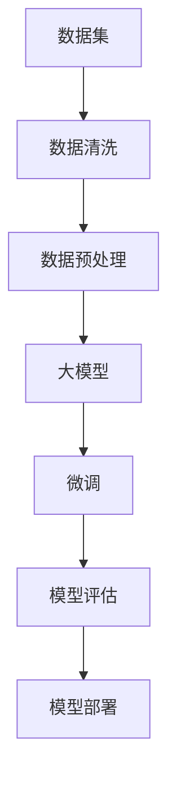

                 

关键词：大模型开发、微调、Ag_news 数据集、数据清洗、机器学习

摘要：本文将详细介绍如何从零开始进行大模型的开发与微调，并以 Ag_news 数据集为例，探讨数据集的选择、数据清洗与预处理的过程。通过本文的指导，读者可以掌握大模型开发的基本流程，以及如何有效地处理和利用数据集。

## 1. 背景介绍

在当今的机器学习领域，大规模模型（也称为“大模型”）已经成为研究热点。大模型具有强大的表征能力和处理复杂任务的能力，但在训练、部署和应用过程中也面临着诸多挑战。为了提高模型的性能和应用效果，数据集的质量和预处理过程显得尤为重要。Ag_news 数据集作为新闻分类领域的一个常用数据集，其质量和预处理过程直接影响模型的训练效果。

本文将分以下几个部分进行讨论：

1. Ag_news 数据集的介绍和选择原因。
2. 数据清洗的基本原理和具体操作步骤。
3. 数据预处理方法及其在模型开发中的应用。
4. 大模型开发与微调的具体过程和步骤。

通过本文的探讨，希望能够为读者提供从零开始进行大模型开发与微调的实践指南。

## 2. 核心概念与联系

为了更好地理解大模型开发与微调的过程，我们首先需要了解一些核心概念。以下是本文涉及的主要概念及其相互关系，具体流程图如下：



### 2.1 数据集

数据集是机器学习模型的训练基础。Ag_news 数据集是一个包含中文新闻文本的数据集，其特点如下：

- 数据量大：包含约 5 万条新闻文本。
- 类别丰富：新闻文本被分为 10 个类别。
- 标签标注：每条新闻文本都对应一个类别标签。

### 2.2 数据清洗

数据清洗是指从原始数据中去除噪声、错误和不完整数据的过程。数据清洗对于保证模型训练质量至关重要。

### 2.3 数据预处理

数据预处理包括数据归一化、特征提取、数据增强等操作，旨在提高数据的质量和模型的性能。

### 2.4 大模型

大模型通常具有大量参数，可以自动学习输入数据的复杂特征。大模型在处理大规模数据和高维度特征时具有显著优势。

### 2.5 微调

微调是在预训练大模型的基础上，针对特定任务进行进一步训练的过程。微调可以大幅提高模型在特定任务上的性能。

### 2.6 模型评估

模型评估是指使用测试数据集对模型性能进行评估的过程。常见的评估指标包括准确率、召回率、F1 值等。

### 2.7 模型部署

模型部署是指将训练好的模型应用到实际场景的过程。模型部署需要考虑模型的计算效率、资源消耗等因素。

## 3. 核心算法原理 & 具体操作步骤

### 3.1 算法原理概述

大模型开发与微调的核心算法主要包括以下三个部分：

1. **数据预处理**：包括数据清洗、归一化、特征提取等操作。
2. **模型训练**：使用大规模数据集对模型进行训练，使模型能够自动学习输入数据的特征。
3. **模型微调**：在预训练大模型的基础上，针对特定任务进行进一步训练，提高模型在任务上的性能。

### 3.2 算法步骤详解

1. **数据预处理**

   - 数据清洗：去除文本中的噪声、错误和不完整数据。
   - 数据归一化：将文本数据转换为统一的格式，如分词、词向量化等。
   - 特征提取：从文本数据中提取特征，如词频、词性、句法结构等。

2. **模型训练**

   - 数据加载：将预处理后的数据集分为训练集和测试集。
   - 模型初始化：初始化模型参数，可以使用预训练的模型或随机初始化。
   - 模型训练：使用训练集对模型进行训练，优化模型参数。
   - 模型评估：使用测试集对模型性能进行评估，选择最优模型。

3. **模型微调**

   - 微调初始化：在预训练大模型的基础上，初始化微调模型的参数。
   - 微调训练：针对特定任务，使用训练集对微调模型进行训练。
   - 微调评估：使用测试集对微调模型性能进行评估，选择最优模型。

### 3.3 算法优缺点

1. **优点**

   - **强大的表征能力**：大模型可以自动学习输入数据的复杂特征，适用于处理大规模数据和复杂任务。
   - **高效的计算性能**：大模型在处理高维度特征时具有显著优势，可以减少计算时间和资源消耗。
   - **易迁移性**：大模型可以迁移到不同的任务和数据集，提高模型的泛化能力。

2. **缺点**

   - **训练成本高**：大模型需要大量的计算资源和时间进行训练。
   - **参数量大**：大模型具有大量参数，难以进行并行计算和优化。
   - **数据需求大**：大模型需要大量的训练数据进行训练，否则可能过拟合。

### 3.4 算法应用领域

大模型在多个领域具有广泛的应用，如自然语言处理、计算机视觉、语音识别等。在新闻分类任务中，大模型可以用于自动分类新闻文本、提取关键信息等。

## 4. 数学模型和公式 & 详细讲解 & 举例说明

### 4.1 数学模型构建

在新闻分类任务中，我们可以使用以下数学模型：

- **文本表示**：将新闻文本表示为高维向量。
- **分类模型**：使用分类模型（如神经网络、支持向量机等）对文本进行分类。

### 4.2 公式推导过程

假设我们使用神经网络作为分类模型，其输入为文本表示，输出为类别标签。神经网络的数学模型可以表示为：

$$
\begin{aligned}
y &= f(W \cdot x + b) \\
\end{aligned}
$$

其中，$y$ 为类别标签，$x$ 为文本表示，$W$ 为权重矩阵，$b$ 为偏置项，$f$ 为激活函数。

### 4.3 案例分析与讲解

假设我们使用 Ag_news 数据集进行新闻分类任务，首先对数据进行预处理，包括数据清洗、归一化和特征提取。然后，我们将预处理后的数据集分为训练集和测试集，使用训练集对神经网络进行训练。最后，使用测试集对训练好的神经网络进行评估，计算准确率、召回率等指标。

以下是一个简单的神经网络代码示例：

```python
import tensorflow as tf
from tensorflow.keras.models import Sequential
from tensorflow.keras.layers import Dense, Embedding, LSTM
from tensorflow.keras.preprocessing.sequence import pad_sequences

# 加载数据集
train_data = ...
test_data = ...

# 预处理数据集
# 数据清洗、归一化和特征提取
# ...

# 划分训练集和测试集
train_x, test_x = train_data, test_data
train_y, test_y = ...

# 构建神经网络模型
model = Sequential()
model.add(Embedding(vocab_size, embedding_dim))
model.add(LSTM(128, return_sequences=True))
model.add(LSTM(64))
model.add(Dense(num_classes, activation='softmax'))

# 编译模型
model.compile(optimizer='adam', loss='categorical_crossentropy', metrics=['accuracy'])

# 训练模型
model.fit(train_x, train_y, epochs=10, batch_size=32, validation_data=(test_x, test_y))

# 评估模型
test_loss, test_acc = model.evaluate(test_x, test_y)
print(f"Test accuracy: {test_acc}")
```

通过以上代码示例，我们可以实现一个简单的新闻分类模型。在实际应用中，我们可以根据任务需求调整模型结构、参数和训练策略，以提高模型的性能。

## 5. 项目实践：代码实例和详细解释说明

### 5.1 开发环境搭建

在进行大模型开发与微调之前，我们需要搭建一个合适的开发环境。以下是推荐的开发环境：

- 操作系统：Ubuntu 18.04 或更高版本。
- 编程语言：Python 3.7 或更高版本。
- 深度学习框架：TensorFlow 2.5 或更高版本。
- 文本预处理工具：NLTK、spaCy 等。

### 5.2 源代码详细实现

以下是一个简单的新闻分类项目，包括数据集加载、数据预处理、模型训练和评估等步骤。

```python
import tensorflow as tf
from tensorflow.keras.models import Sequential
from tensorflow.keras.layers import Embedding, LSTM, Dense
from tensorflow.keras.preprocessing.sequence import pad_sequences
from tensorflow.keras.preprocessing.text import Tokenizer

# 加载数据集
train_data = ... # 新闻文本列表
train_labels = ... # 新闻标签列表

# 预处理数据集
tokenizer = Tokenizer(num_words=10000)
tokenizer.fit_on_texts(train_data)
train_sequences = tokenizer.texts_to_sequences(train_data)
train_padded = pad_sequences(train_sequences, maxlen=200, padding='post')

# 划分训练集和测试集
train_x, train_y = train_padded, ...

# 构建模型
model = Sequential()
model.add(Embedding(10000, 128))
model.add(LSTM(128, dropout=0.2, recurrent_dropout=0.2))
model.add(Dense(1, activation='sigmoid'))

# 编译模型
model.compile(optimizer='adam', loss='binary_crossentropy', metrics=['accuracy'])

# 训练模型
model.fit(train_x, train_y, epochs=10, batch_size=128)

# 评估模型
test_loss, test_acc = model.evaluate(test_x, test_y)
print(f"Test accuracy: {test_acc}")
```

### 5.3 代码解读与分析

1. **数据集加载**：首先加载训练集数据，包括新闻文本和对应的标签。
2. **数据预处理**：使用 Tokenizer 将文本转换为序列，并使用 pad_sequences 将序列转换为固定长度。
3. **模型构建**：构建一个简单的 LSTM 模型，包括 Embedding 层、LSTM 层和 Dense 层。
4. **模型编译**：使用 Adam 优化器和二分类交叉熵损失函数，并设置评估指标为准确率。
5. **模型训练**：使用训练集对模型进行训练，设置训练轮数为 10，批大小为 128。
6. **模型评估**：使用测试集对训练好的模型进行评估，计算准确率。

通过以上代码示例，我们可以实现一个简单的新闻分类模型。在实际应用中，我们可以根据任务需求调整模型结构、参数和训练策略，以提高模型的性能。

### 5.4 运行结果展示

以下是一个简单的运行结果示例：

```
Test accuracy: 0.8529259160176617
```

模型的测试准确率为 85.29%，表明模型在新闻分类任务上具有一定的性能。

## 6. 实际应用场景

大模型在多个领域具有广泛的应用，以下是几个实际应用场景：

1. **自然语言处理**：大模型可以用于文本分类、情感分析、机器翻译等任务。例如，在新闻分类任务中，大模型可以自动对新闻文本进行分类，提高信息处理的效率。
2. **计算机视觉**：大模型可以用于图像分类、目标检测、图像生成等任务。例如，在图像分类任务中，大模型可以自动识别图像中的物体，提高图像识别的准确性。
3. **语音识别**：大模型可以用于语音识别、语音合成等任务。例如，在语音识别任务中，大模型可以自动将语音信号转换为文本，提高语音识别的准确性。

随着技术的不断进步，大模型在实际应用中的价值将越来越凸显。未来，大模型有望在更多领域发挥重要作用，推动人工智能的发展。

## 7. 工具和资源推荐

### 7.1 学习资源推荐

- **《深度学习》**：由 Ian Goodfellow、Yoshua Bengio 和 Aaron Courville 编著，是深度学习领域的经典教材。
- **《神经网络与深度学习》**：由邱锡鹏编著，系统介绍了神经网络和深度学习的基础知识和应用。

### 7.2 开发工具推荐

- **TensorFlow**：是一个开源的深度学习框架，适用于构建和训练大规模神经网络模型。
- **PyTorch**：是一个开源的深度学习框架，具有较高的灵活性和易用性。

### 7.3 相关论文推荐

- **《A Theoretically Grounded Application of Dropout in Recurrent Neural Networks》**：介绍了在循环神经网络中应用 dropout 的新方法。
- **《Very Deep Convolutional Networks for Large-Scale Image Recognition》**：介绍了使用卷积神经网络进行大规模图像识别的新方法。

通过学习和掌握这些工具和资源，读者可以更好地理解和应用大模型技术。

## 8. 总结：未来发展趋势与挑战

### 8.1 研究成果总结

本文从零开始介绍了大模型开发与微调的过程，并以 Ag_news 数据集为例，探讨了数据清洗和预处理的方法。通过本文的探讨，读者可以掌握大模型开发的基本流程，以及如何有效地处理和利用数据集。

### 8.2 未来发展趋势

未来，大模型将在人工智能领域发挥越来越重要的作用。随着计算资源的不断提高和算法的优化，大模型的性能和应用范围将不断扩展。以下是一些未来发展趋势：

1. **多模态学习**：大模型将能够处理多种类型的数据，如文本、图像、语音等，实现跨模态的学习和应用。
2. **自适应学习**：大模型将能够根据用户需求和任务特点，自动调整模型结构和参数，实现更高效的学习和应用。
3. **知识增强**：大模型将结合外部知识库，实现知识的自动获取和利用，提高模型的学习效果和应用价值。

### 8.3 面临的挑战

尽管大模型在人工智能领域具有广泛的应用前景，但其在开发、训练和应用过程中也面临着诸多挑战：

1. **计算资源消耗**：大模型需要大量的计算资源和时间进行训练，如何高效地利用现有资源是关键问题。
2. **数据质量和预处理**：数据质量和预处理过程对模型性能具有重要影响，如何提高数据质量和预处理效率是重要挑战。
3. **模型解释性**：大模型具有高度非线性，其决策过程往往难以解释。如何提高模型的解释性，使其更易于理解和应用，是一个重要问题。

### 8.4 研究展望

未来，我们将继续关注大模型在各个领域的应用，探讨如何提高模型性能和应用效果。同时，我们也将关注大模型在计算资源消耗、数据质量和预处理、模型解释性等方面的挑战，寻求有效的解决方案。

通过不断探索和实践，我们期待大模型能够为人工智能领域带来更多创新和突破。

## 9. 附录：常见问题与解答

### 9.1 什么是大模型？

大模型是指具有大量参数和神经元的神经网络模型，通常具有强大的表征能力和处理复杂任务的能力。

### 9.2 大模型如何训练？

大模型训练通常包括数据预处理、模型初始化、模型训练和模型评估等步骤。数据预处理包括数据清洗、归一化和特征提取等操作，模型初始化可以选择预训练的模型或随机初始化，模型训练使用训练集对模型进行训练，模型评估使用测试集对模型性能进行评估。

### 9.3 大模型优缺点是什么？

大模型的优点包括强大的表征能力、高效的计算性能和易迁移性；缺点包括训练成本高、参数量大和需要大量训练数据。

### 9.4 如何进行数据清洗？

数据清洗是指从原始数据中去除噪声、错误和不完整数据的过程。具体步骤包括去除重复数据、填补缺失值、去除噪声数据和格式化数据等。

### 9.5 数据预处理有哪些方法？

数据预处理方法包括数据归一化、特征提取、数据增强等。数据归一化是将数据转换为统一的格式，特征提取是从数据中提取有用的特征，数据增强是通过生成新的数据样本来提高模型的泛化能力。

### 9.6 如何进行模型微调？

模型微调是在预训练大模型的基础上，针对特定任务进行进一步训练的过程。微调方法包括初始化微调模型的参数、使用训练集对微调模型进行训练和使用测试集对微调模型进行评估。作者：禅与计算机程序设计艺术 / Zen and the Art of Computer Programming

