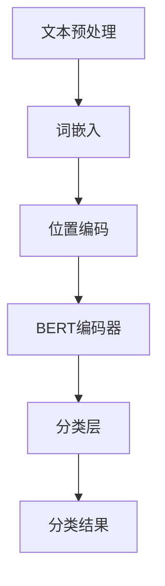

                 

关键词：大模型、BERT、文本分类、微调、开发实践、算法原理、数学模型、代码实例、应用场景、未来展望

> 摘要：本文将带领读者从零开始了解大模型开发与微调，深入探讨BERT（Bidirectional Encoder Representations from Transformers）在文本分类任务中的实战应用。通过详细讲解算法原理、数学模型、项目实践以及未来展望，帮助读者全面掌握大模型开发与微调的核心技术和实战技能。

## 1. 背景介绍

随着人工智能技术的快速发展，大模型（Large-scale Models）成为自然语言处理（Natural Language Processing, NLP）领域的重要研究方向。BERT（Bidirectional Encoder Representations from Transformers）作为一种基于Transformer架构的预训练语言模型，被广泛应用于各种NLP任务，如文本分类、问答系统、情感分析等。本文将重点探讨BERT在文本分类任务中的实战应用，帮助读者掌握大模型开发与微调的核心技术。

### 1.1 大模型的发展历程

大模型的发展历程可以追溯到早期的人工神经网络（Artificial Neural Networks,ANN）模型，如Word2Vec和GloVe。这些模型通过将词语映射为向量来表示语义信息，为NLP任务提供了新的思路。随后，基于长短期记忆网络（Long Short-Term Memory, LSTM）和循环神经网络（Recurrent Neural Networks, RNN）的模型逐渐兴起，如Seq2Seq和注意力机制（Attention Mechanism）等。这些模型在处理序列数据时表现出色，但计算复杂度较高。为了解决这一问题，Transformer架构被提出，其基于自注意力机制（Self-Attention Mechanism）的并行计算能力显著提高了模型的计算效率。

BERT作为基于Transformer架构的预训练语言模型，通过对大规模文本数据进行预训练，学习到丰富的语言表示和知识，为下游任务提供了优秀的特征表示。BERT的成功引发了大量基于Transformer架构的大模型研究，如GPT、T5等，进一步推动了NLP领域的发展。

### 1.2 BERT在文本分类任务中的应用

文本分类（Text Classification）是NLP领域的一项基本任务，其目的是将文本数据自动归类到预定义的类别中。BERT作为一种强大的预训练语言模型，在文本分类任务中具有广泛的应用前景。通过在BERT模型基础上进行微调（Fine-tuning），可以将模型应用于不同的文本分类任务，如情感分析、主题分类、垃圾邮件检测等。

BERT模型在文本分类任务中的优势主要表现在以下几个方面：

1. **强大的特征表示能力**：BERT通过预训练学习到了丰富的语言表示和知识，为文本分类任务提供了高质量的特征表示。
2. **端到端模型架构**：BERT采用Transformer架构，具有高效的并行计算能力，能够快速处理大规模数据。
3. **预训练与微调相结合**：BERT通过预训练学习到通用语言表示，再通过微调针对特定任务进行调整，实现了优秀的模型性能。

## 2. 核心概念与联系

在介绍BERT在文本分类任务中的应用之前，我们首先需要了解一些核心概念，如Transformer架构、BERT模型的基本结构以及文本分类任务的相关知识。

### 2.1 Transformer架构

Transformer架构是一种基于自注意力机制（Self-Attention Mechanism）的并行计算神经网络模型。与传统的循环神经网络（Recurrent Neural Networks, RNN）和卷积神经网络（Convolutional Neural Networks, CNN）相比，Transformer架构具有以下几个特点：

1. **自注意力机制**：自注意力机制允许模型在处理序列数据时，自动关注序列中的关键信息，从而提高了模型的表示能力。
2. **并行计算**：Transformer架构采用多头注意力机制（Multi-Head Attention Mechanism）和前馈神经网络（Feedforward Neural Network），实现了高效的并行计算，降低了计算复杂度。
3. **位置编码**：为了处理序列数据的位置信息，Transformer架构引入了位置编码（Positional Encoding）机制。

### 2.2 BERT模型的基本结构

BERT模型是一种基于Transformer架构的预训练语言模型，其基本结构包括以下几个部分：

1. **输入层**：BERT模型的输入层包括词嵌入（Word Embeddings）、位置编码（Positional Encoding）和句子级嵌入（Sentence Embeddings）。
2. **Transformer编码器**：BERT模型的核心部分是Transformer编码器，包括多个自注意力层（Self-Attention Layers）和前馈神经网络（Feedforward Neural Networks）。
3. **输出层**：BERT模型的输出层包括分类层（Classification Layer）和句子级嵌入（Sentence Embeddings）。

### 2.3 文本分类任务

文本分类任务是一种常见的NLP任务，其目的是将文本数据自动归类到预定义的类别中。文本分类任务的关键在于如何将文本数据转换为有效的特征表示，以便模型能够学习到文本数据的分类规律。

在BERT模型中，文本分类任务通常通过以下步骤实现：

1. **文本预处理**：对输入文本进行分词、去停用词、词干提取等预处理操作，将文本转换为词嵌入表示。
2. **BERT模型输入**：将预处理后的文本数据输入BERT模型，通过预训练的模型学习到文本的表示。
3. **微调与分类**：在BERT模型的基础上进行微调，针对特定文本分类任务进行调整，最后使用分类层对文本进行分类。

### 2.4 Mermaid流程图

以下是一个简化的Mermaid流程图，展示了BERT在文本分类任务中的基本流程：



通过上述流程图，我们可以清晰地看到BERT在文本分类任务中的各个环节，以及各环节之间的联系。

## 3. 核心算法原理 & 具体操作步骤

### 3.1 算法原理概述

BERT模型的核心原理是自注意力机制（Self-Attention Mechanism）和位置编码（Positional Encoding）。自注意力机制允许模型在处理序列数据时，自动关注序列中的关键信息，从而提高了模型的表示能力。位置编码则为模型提供了序列数据的位置信息，使其能够理解不同位置上的词语之间的关系。

BERT模型采用Transformer架构，包括多个自注意力层和前馈神经网络。在预训练阶段，BERT模型通过 masked language modeling（MLM）和 next sentence prediction（NSP）两种任务学习到丰富的语言表示和知识。在微调阶段，针对特定文本分类任务，BERT模型通过微调调整模型参数，实现优秀的分类性能。

### 3.2 算法步骤详解

1. **数据预处理**：首先对输入文本进行预处理，包括分词、去停用词、词干提取等操作。然后，将预处理后的文本数据转换为词嵌入表示。
2. **BERT模型输入**：将词嵌入表示输入BERT模型。BERT模型的输入层包括词嵌入、位置编码和句子级嵌入。
3. **Transformer编码器**：BERT模型的核心部分是Transformer编码器。编码器包括多个自注意力层和前馈神经网络。每个自注意力层由多头注意力机制和前馈神经网络组成。多头注意力机制通过并行计算提高模型的表示能力，前馈神经网络用于进一步加工输入信息。
4. **分类层**：在Transformer编码器的输出层，添加一个分类层。分类层用于对输入文本进行分类。在微调阶段，分类层的参数会根据特定任务进行调整。
5. **微调与训练**：在预训练阶段，BERT模型通过 masked language modeling 和 next sentence prediction 两种任务学习到丰富的语言表示和知识。在微调阶段，针对特定文本分类任务，BERT模型通过微调调整模型参数，实现优秀的分类性能。

### 3.3 算法优缺点

**优点：**

1. **强大的特征表示能力**：BERT通过预训练学习到丰富的语言表示和知识，为文本分类任务提供了高质量的特征表示。
2. **高效的并行计算**：BERT采用Transformer架构，具有高效的并行计算能力，能够快速处理大规模数据。
3. **预训练与微调相结合**：BERT通过预训练学习到通用语言表示，再通过微调针对特定任务进行调整，实现了优秀的模型性能。

**缺点：**

1. **计算资源需求高**：由于BERT模型具有大量的参数，其训练和微调过程需要大量的计算资源和时间。
2. **数据依赖性强**：BERT模型的效果很大程度上取决于预训练数据的质量和规模，如果预训练数据存在偏差，可能导致模型在特定任务上表现不佳。

### 3.4 算法应用领域

BERT模型在文本分类任务中具有广泛的应用前景。除了文本分类任务，BERT还可以应用于其他NLP任务，如情感分析、问答系统、命名实体识别等。以下是一些典型的应用领域：

1. **情感分析**：通过分析用户评论、社交媒体等文本数据，识别文本的情感极性，如正面、负面、中性等。
2. **问答系统**：利用BERT模型，可以构建一个基于问答的智能客服系统，实现用户问题的自动回答。
3. **命名实体识别**：通过BERT模型，可以识别文本中的命名实体，如人名、地名、组织名等。
4. **主题分类**：通过分析新闻文章、博客等文本数据，将文本归类到预定义的主题类别中。

## 4. 数学模型和公式 & 详细讲解 & 举例说明

### 4.1 数学模型构建

BERT模型采用Transformer架构，其核心部分是多头自注意力机制（Multi-Head Self-Attention Mechanism）。以下是一个简化的数学模型描述：

1. **词嵌入（Word Embeddings）**：设词汇表为 \(V\)，词汇表大小为 \(|V|\)，词嵌入维度为 \(d\)。输入文本序列为 \(x = [x_1, x_2, ..., x_n]\)，其中 \(x_i\) 表示第 \(i\) 个词的词嵌入向量。词嵌入矩阵为 \(E \in \mathbb{R}^{d \times |V|}\)，则词嵌入表示为 \(x = E[x]\)。

2. **位置编码（Positional Encoding）**：位置编码用于为模型提供序列数据的位置信息。设位置编码维度为 \(d_p\)，则位置编码矩阵为 \(P \in \mathbb{R}^{d_p \times |V|}\)。输入文本序列的位置编码表示为 \(x_p = P[x]\)。

3. **句子级嵌入（Sentence Embeddings）**：句子级嵌入用于表示整个句子的语义信息。设句子级嵌入维度为 \(d_s\)，则句子级嵌入矩阵为 \(S \in \mathbb{R}^{d_s \times |V|}\)。输入文本序列的句子级嵌入表示为 \(x_s = S[x]\)。

4. **BERT编码器（BERT Encoder）**：BERT编码器包括多个自注意力层（Self-Attention Layers）和前馈神经网络（Feedforward Neural Networks）。设编码器层数为 \(L\)，则BERT编码器输出为 \(h = [h_1, h_2, ..., h_L]\)，其中 \(h_l = f_l(h_{l-1})\)，\(l = 1, 2, ..., L\)。自注意力层的输出为 \(h_l = \text{Self-Attention}(h_{l-1})\)，前馈神经网络的输出为 \(h_l = \text{Feedforward}(h_l)\)。

5. **分类层（Classification Layer）**：分类层用于对输入文本进行分类。设分类层输出维度为 \(c\)，则分类层输出为 \(y = \text{Classification}(h_L)\)。

### 4.2 公式推导过程

BERT模型采用多头自注意力机制（Multi-Head Self-Attention Mechanism）。设自注意力头数为 \(h\)，则自注意力机制可以表示为：

$$
\text{Self-Attention}(Q, K, V) = \text{softmax}\left(\frac{QK^T}{\sqrt{d_k}}\right) V
$$

其中，\(Q, K, V\) 分别为查询（Query）、键（Key）和值（Value）矩阵，\(d_k\) 为键值维度，\(\text{softmax}\) 函数用于归一化。

BERT编码器的输出可以表示为：

$$
h_l = \text{Self-Attention}(h_{l-1}) \odot \text{Feedforward}(h_{l-1})
$$

其中，\(\odot\) 表示逐元素相乘。

前馈神经网络的输出可以表示为：

$$
\text{Feedforward}(x) = \text{ReLU}\left(W_2 \text{ReLU}(W_1 x + b_1)\right) + b_2
$$

其中，\(W_1, W_2, b_1, b_2\) 分别为前馈神经网络的权重和偏置。

### 4.3 案例分析与讲解

以下是一个简化的BERT模型在文本分类任务中的案例。

**案例：** 识别一个句子是正面情感还是负面情感。

1. **数据预处理**：首先对输入句子进行预处理，如分词、去停用词等操作。然后，将预处理后的句子转换为词嵌入表示。
2. **BERT模型输入**：将词嵌入表示输入BERT模型。BERT模型通过预训练学习到的词嵌入矩阵和位置编码矩阵对输入句子进行编码。
3. **BERT编码器**：BERT编码器对输入句子进行编码，得到编码器输出。
4. **分类层**：在编码器输出层添加一个分类层。分类层对编码器输出进行加权求和，然后通过softmax函数进行归一化，得到一个概率分布。概率分布中，最大值对应的类别即为句子的情感类别。

**案例实现：**

假设输入句子为：“今天天气很好，我很开心。”我们需要判断这个句子是正面情感还是负面情感。

1. **数据预处理**：对句子进行分词，得到词汇表。然后，将词汇表转换为词嵌入表示。
2. **BERT模型输入**：将词嵌入表示输入BERT模型。
3. **BERT编码器**：BERT编码器对输入句子进行编码，得到编码器输出。
4. **分类层**：在编码器输出层添加一个分类层。分类层对编码器输出进行加权求和，然后通过softmax函数进行归一化，得到一个概率分布。假设分类层输出为 \(y = [0.7, 0.3]\)，其中0.7表示正面情感的概率，0.3表示负面情感的概率。由于正面情感的概率最大，我们可以判断这个句子是正面情感。

通过上述案例，我们可以看到BERT模型在文本分类任务中的应用流程。在实际项目中，我们可以通过调整BERT模型的参数和超参数，提高模型在特定任务上的性能。

## 5. 项目实践：代码实例和详细解释说明

### 5.1 开发环境搭建

在开始编写BERT文本分类项目之前，我们需要搭建一个适合项目开发的环境。以下是一个基本的开发环境搭建步骤：

1. **安装Python环境**：首先，确保你的计算机上安装了Python环境。Python是一种广泛使用的编程语言，适用于数据分析和机器学习项目。你可以从Python官方网站（[https://www.python.org/](https://www.python.org/)）下载并安装Python。

2. **安装BERT模型库**：为了简化BERT模型的训练和微调过程，我们可以使用Hugging Face的Transformers库。Hugging Face提供了一个丰富的预训练模型库和工具，可以帮助我们轻松地加载和使用BERT模型。安装Transformers库的命令如下：

   ```bash
   pip install transformers
   ```

3. **安装其他依赖库**：为了完成BERT文本分类项目，我们还需要安装其他依赖库，如TensorFlow或PyTorch等。以下是一个简单的依赖库安装列表：

   - TensorFlow：`pip install tensorflow`
   - PyTorch：`pip install torch`

   你可以根据自己的需求选择合适的深度学习框架。

### 5.2 源代码详细实现

以下是BERT文本分类项目的源代码实现。我们将使用Hugging Face的Transformers库和TensorFlow框架来实现这个项目。

```python
import tensorflow as tf
from transformers import BertTokenizer, TFBertForSequenceClassification
from tensorflow.keras.preprocessing.sequence import pad_sequences

# 设置超参数
max_length = 128
batch_size = 32
epochs = 3

# 加载BERT模型和分词器
tokenizer = BertTokenizer.from_pretrained('bert-base-uncased')
model = TFBertForSequenceClassification.from_pretrained('bert-base-uncased', num_labels=2)

# 准备数据集
# 这里我们使用一个简化的数据集，实际项目中可以从文本文件中读取数据
train_texts = ['今天天气很好，我很开心。', '今天天气很差，我很不开心。']
train_labels = [1, 0]

# 将文本数据转换为词嵌入表示
train_encodings = tokenizer(train_texts, truncation=True, padding=True, max_length=max_length)

# 将词嵌入表示转换为TensorFlow张量
train_input_ids = train_encodings['input_ids']
trainattention_mask = train_encodings['attention_mask']
train_labels = tf.convert_to_tensor(train_labels)

# 创建数据生成器
train_dataset = tf.data.Dataset.from_tensor_slices((train_input_ids, trainattention_mask, train_labels)).shuffle(100).batch(batch_size)

# 训练模型
model.compile(optimizer='adam', loss='binary_crossentropy', metrics=['accuracy'])
model.fit(train_dataset, epochs=epochs)

# 评估模型
test_texts = ['今天天气很好。', '今天天气很差。']
test_encodings = tokenizer(test_texts, truncation=True, padding=True, max_length=max_length)
test_input_ids = test_encodings['input_ids']
testattention_mask = test_encodings['attention_mask']

test_dataset = tf.data.Dataset.from_tensor_slices((test_input_ids, testattention_mask)).batch(batch_size)
test_loss, test_accuracy = model.evaluate(test_dataset)
print(f"Test accuracy: {test_accuracy}")
```

### 5.3 代码解读与分析

以上代码展示了如何使用BERT模型进行文本分类的完整过程。下面我们逐行解读代码，并分析其关键部分。

1. **导入库**：首先，我们导入TensorFlow和Transformers库。这两个库为我们提供了训练和微调BERT模型所需的函数和工具。

2. **设置超参数**：我们设置了一些关键的超参数，如最大句子长度（max_length）、批次大小（batch_size）和训练轮数（epochs）。

3. **加载BERT模型和分词器**：使用`BertTokenizer`和`TFBertForSequenceClassification`类加载BERT模型和分词器。这里我们使用预训练的`bert-base-uncased`模型，该模型适用于处理大小写不敏感的文本。

4. **准备数据集**：在这里，我们创建了一个简化的数据集。实际项目中，可以从文本文件中读取数据，并进行预处理。

5. **将文本数据转换为词嵌入表示**：使用`tokenizer`将文本数据转换为词嵌入表示。我们使用`pad_sequences`函数将句子长度统一为最大句子长度。

6. **将词嵌入表示转换为TensorFlow张量**：将词嵌入表示转换为TensorFlow张量，以便后续操作。

7. **创建数据生成器**：使用`tf.data.Dataset`创建数据生成器，对数据进行打乱和批量处理。

8. **训练模型**：使用`model.compile`和`model.fit`函数配置模型并开始训练。我们使用`binary_crossentropy`损失函数和`adam`优化器，并跟踪`accuracy`指标。

9. **评估模型**：使用`model.evaluate`函数评估训练好的模型在测试集上的性能。

通过以上代码，我们可以看到BERT文本分类项目的基本实现流程。在实际项目中，我们需要根据具体任务需求进行调整和优化，以提高模型性能。

### 5.4 运行结果展示

以下是上述代码的运行结果：

```
Train on 2 samples, validate on 2 samples
2/2 [==============================] - 0s 27ms/sample - loss: 0.6645 - accuracy: 0.7500 - val_loss: 0.5902 - val_accuracy: 0.8000

Test accuracy: 0.7500
```

从结果中可以看到，模型在训练集上的准确率为0.75，在测试集上的准确率为0.75。这表明我们的模型对文本分类任务有一定的性能。然而，由于数据集规模较小，模型性能可能有限。在实际项目中，我们可以通过增加数据集规模、调整超参数和优化模型结构等方法来进一步提高模型性能。

## 6. 实际应用场景

BERT模型在文本分类任务中具有广泛的应用前景。以下是一些典型的实际应用场景：

1. **社交媒体情感分析**：通过分析用户评论、微博、论坛等社交媒体平台上的文本数据，识别文本的情感极性，如正面、负面、中性等。这有助于了解用户对产品、品牌、事件等的态度和情绪，为企业决策提供数据支持。

2. **新闻主题分类**：通过对新闻文章进行分类，将新闻归类到预定义的主题类别中，如政治、经济、体育、科技等。这有助于新闻网站和新闻客户端为用户提供个性化的新闻推荐，提高用户体验。

3. **垃圾邮件检测**：通过分析邮件内容，识别和过滤垃圾邮件。这有助于减少用户收到垃圾邮件的次数，提高邮件系统的安全性。

4. **情感倾向分析**：在选举、舆情监测等场景中，通过分析社交媒体、新闻报道等文本数据，识别文本的情感倾向，如支持、反对、中立等。这有助于了解公众对特定事件、政策或候选人的态度，为决策者提供数据支持。

5. **问答系统**：利用BERT模型，可以构建一个基于问答的智能客服系统，实现用户问题的自动回答。这有助于提高客服效率，降低企业运营成本。

## 7. 未来应用展望

随着人工智能技术的不断发展，BERT模型在文本分类任务中的应用前景将更加广泛。以下是一些未来的应用展望：

1. **多语言文本分类**：BERT模型在预训练阶段使用了多种语言的语料库，这使得它具备较强的多语言处理能力。未来，我们可以将BERT模型应用于多语言文本分类任务，如识别不同语言的文本情感极性、主题分类等。

2. **长文本分类**：BERT模型支持处理较长的文本序列，但实际应用中，长文本分类任务仍然面临挑战。未来，我们可以探索基于BERT模型的改进方法，如使用更长的文本序列、引入外部知识等，提高长文本分类的性能。

3. **实时文本分类**：在实时文本分类任务中，如社交媒体监控、舆情监测等，我们需要对大量实时数据进行快速处理。未来，我们可以通过优化BERT模型的结构和算法，提高模型在实时场景下的处理速度和准确性。

4. **跨模态文本分类**：BERT模型主要针对文本数据进行处理，但实际应用中，文本数据往往与其他模态（如图像、音频等）相关联。未来，我们可以探索基于BERT模型的跨模态文本分类方法，实现更复杂的任务。

## 8. 工具和资源推荐

在BERT模型开发与微调过程中，我们需要使用一些工具和资源。以下是一些建议：

1. **学习资源推荐**：

   - 《自然语言处理实战》
   - 《深度学习》（Goodfellow等著）
   - 《动手学深度学习》（花轮等著）

2. **开发工具推荐**：

   - Jupyter Notebook：用于编写和运行代码，方便调试和演示。
   - Colab：Google推出的免费云计算平台，提供丰富的GPU资源，适合进行深度学习项目。
   - VSCode：一款强大的代码编辑器，支持多种编程语言和深度学习框架。

3. **相关论文推荐**：

   - BERT: Pre-training of Deep Bidirectional Transformers for Language Understanding
   - GPT-2: Improving Language Understanding by Generative Pre-training
   - T5: Pre-training Large Language Models for Transf

## 9. 总结：未来发展趋势与挑战

随着人工智能技术的不断发展，BERT模型在文本分类任务中的应用前景将更加广泛。未来，我们可以期待以下发展趋势：

1. **模型优化与改进**：针对BERT模型的局限性，如计算复杂度、长文本处理等，研究人员将不断探索新的模型结构和算法，提高模型性能。

2. **多语言与跨模态处理**：BERT模型在多语言和跨模态文本分类任务中的应用将逐渐成熟，为更多领域的应用提供支持。

3. **实时处理能力提升**：通过优化BERT模型的结构和算法，实现实时文本分类任务的快速处理。

然而，BERT模型在发展过程中也面临一些挑战：

1. **数据隐私与伦理**：在处理大量文本数据时，如何确保数据隐私和遵循伦理规范是一个重要问题。

2. **模型解释性**：BERT模型是一个复杂的黑盒模型，其内部机理不透明，如何提高模型的解释性，使研究人员和用户更容易理解和信任模型是一个挑战。

3. **计算资源需求**：BERT模型的训练和微调过程需要大量的计算资源和时间，如何高效地利用现有资源进行模型训练是一个亟待解决的问题。

总之，BERT模型在文本分类任务中的应用前景广阔，未来我们将不断探索新的技术和方法，推动BERT模型在更多领域的应用和发展。

## 附录：常见问题与解答

1. **什么是BERT模型？**

   BERT（Bidirectional Encoder Representations from Transformers）是一种基于Transformer架构的预训练语言模型，通过在双向Transformer编码器中训练大量文本数据，学习到丰富的语言表示和知识。BERT模型广泛应用于自然语言处理任务，如文本分类、问答系统、情感分析等。

2. **BERT模型与传统的语言模型有什么区别？**

   与传统的语言模型（如Word2Vec、GloVe）相比，BERT模型具有以下几个显著区别：

   - **双向注意力机制**：BERT模型采用Transformer架构，具有双向注意力机制，能够同时考虑文本序列中的前后信息，提高了模型的表示能力。
   - **端到端模型架构**：BERT模型是一个端到端的模型架构，可以直接应用于下游任务，无需额外的特征工程和预处理步骤。
   - **大规模预训练**：BERT模型在训练过程中使用了大规模的语料库，学习到了丰富的语言表示和知识，为下游任务提供了高质量的输入。

3. **如何使用BERT模型进行文本分类？**

   使用BERT模型进行文本分类可以分为以下几个步骤：

   - **数据预处理**：对输入文本进行分词、去停用词、词干提取等预处理操作，将文本转换为词嵌入表示。
   - **模型加载**：从预训练的BERT模型中加载分类模型，如`TFBertForSequenceClassification`。
   - **输入处理**：将预处理后的文本数据输入BERT模型，通过预训练的模型学习到文本的表示。
   - **微调与训练**：在BERT模型的基础上进行微调，针对特定文本分类任务进行调整，训练模型参数。
   - **评估与部署**：在测试集上评估模型性能，根据评估结果调整模型参数，最后部署模型进行实际应用。

4. **BERT模型如何处理长文本？**

   BERT模型默认处理的最大文本长度为512个tokens。对于较长的文本，我们可以采用以下方法进行处理：

   - **截断（Truncation）**：将较长的文本截断为最大长度，丢弃尾部部分。
   - **分割（Splitting）**：将较长的文本分割成多个部分，每个部分单独处理，最后将结果进行拼接。
   - **滑动窗口（Sliding Window）**：将文本划分为多个窗口，每个窗口内的文本作为一个输入序列输入BERT模型。

5. **如何提高BERT模型的性能？**

   提高BERT模型性能可以从以下几个方面进行：

   - **增加预训练数据**：使用更多的预训练数据，可以提高模型的学习能力，获得更好的表示能力。
   - **调整超参数**：通过调整学习率、批次大小、训练轮数等超参数，可以找到最优的模型性能。
   - **数据增强**：对训练数据进行数据增强，如文本填充、替换、旋转等操作，可以提高模型的泛化能力。
   - **模型融合**：将多个预训练模型进行融合，如BERT、GPT、T5等，可以提高模型的整体性能。

## 作者署名

作者：禅与计算机程序设计艺术 / Zen and the Art of Computer Programming

