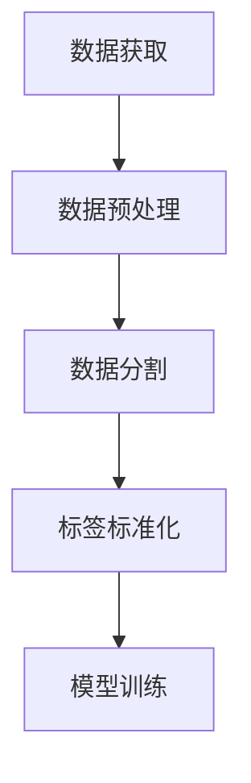

                 

关键词：大模型开发、微调、MNIST数据集、数据预处理、机器学习

摘要：本文将深入探讨如何从零开始进行大规模模型的开发与微调，以MNIST数据集为例，详细介绍了数据集的准备过程，包括数据获取、预处理、分割以及标签的标准化等步骤。通过本文的介绍，读者可以了解大模型开发的基本流程，并为后续的模型训练和优化打下坚实的基础。

## 1. 背景介绍

在人工智能领域，大规模模型（Large-scale Model）的开发与微调（Fine-tuning）已经成为一种趋势。大模型具有更高的表达能力，可以处理更复杂的任务，但同时也带来了更高的计算资源和时间成本。微调则是在预训练模型的基础上，通过在特定任务上继续训练，使模型能够适应新的数据分布和任务需求。

MNIST数据集是机器学习领域最常用的手写数字识别数据集，它包含了0到9这10个数字的手写样本。这个数据集具有以下特点：

- **数据量大**：MNIST包含70,000个训练样本和10,000个测试样本。
- **数据格式**：每个样本是一个28x28的灰度图像。
- **标注清晰**：每个图像都被正确地标注了对应的数字。

MNIST数据集的这些特点使其成为了一个非常适合入门和研究的标准数据集。

## 2. 核心概念与联系

在开始MNIST数据集的准备之前，我们需要了解几个核心概念：

### 2.1 数据集准备

数据集准备是机器学习项目中的第一步，它包括数据获取、预处理、分割和标签标准化等步骤。数据准备的质量直接影响到模型的表现。

### 2.2 预处理

预处理是指对原始数据进行的一系列转换，包括图像的归一化、去噪、增强等。预处理可以改善数据质量，提高模型的学习效率。

### 2.3 数据分割

数据分割是将数据集划分为训练集、验证集和测试集。通常，训练集用于模型的训练，验证集用于模型的调整，测试集用于评估模型的性能。

### 2.4 标签标准化

标签标准化是指将标签转换为模型能够处理的格式。在MNIST数据集中，标签是数字，需要转换为独热编码（One-Hot Encoding）。

### 2.5 Mermaid 流程图

下面是一个用Mermaid绘制的流程图，展示了MNIST数据集准备的过程：



## 3. 核心算法原理 & 具体操作步骤

### 3.1 算法原理概述

在MNIST数据集的准备过程中，主要涉及以下算法原理：

- **数据获取**：通过网络或本地存储获取MNIST数据集。
- **数据预处理**：对图像进行归一化、去噪、增强等处理。
- **数据分割**：按照一定比例将数据集分为训练集、验证集和测试集。
- **标签标准化**：将数字标签转换为独热编码。

### 3.2 算法步骤详解

#### 3.2.1 数据获取

我们可以使用Python的`scikit-learn`库来获取MNIST数据集：

```python
from sklearn.datasets import fetch_openml

# 获取MNIST数据集
mnist = fetch_openml('mnist_784')
```

#### 3.2.2 数据预处理

```python
import numpy as np

# 数据预处理
X_train = mnist.data.astype('float32') / 255
X_test = mnist.test_data.astype('float32') / 255

# 数据归一化
mean_image = np.mean(X_train, axis=0)
X_train -= mean_image
X_test -= mean_image
```

#### 3.2.3 数据分割

```python
# 数据分割
train_size = int(0.8 * len(X_train))
X_train, X_val = X_train[:train_size], X_train[train_size:]
y_train, y_val = mnist.target[:train_size], mnist.target[train_size:]
```

#### 3.2.4 标签标准化

```python
from sklearn.preprocessing import OneHotEncoder

# 标签标准化
encoder = OneHotEncoder(sparse=False)
y_train_encoded = encoder.fit_transform(y_train.reshape(-1, 1))
y_val_encoded = encoder.transform(y_val.reshape(-1, 1))
```

### 3.3 算法优缺点

#### 优缺点

- **优点**：使用预训练模型进行微调可以大大提高训练效率，同时保证了模型的基本能力。
- **缺点**：需要大量的计算资源和时间，且模型可能会过拟合。

### 3.4 算法应用领域

MNIST数据集广泛应用于机器学习和计算机视觉领域，是许多算法的基准测试数据集。

## 4. 数学模型和公式 & 详细讲解 & 举例说明

### 4.1 数学模型构建

在机器学习中，我们通常使用损失函数（Loss Function）来评估模型的表现。在MNIST数据集中，常用的损失函数是交叉熵损失（Cross-Entropy Loss）。

$$
L(y, \hat{y}) = -\sum_{i} y_i \log(\hat{y}_i)
$$

其中，$y$是真实标签，$\hat{y}$是模型预测的概率分布。

### 4.2 公式推导过程

交叉熵损失函数的推导过程如下：

1. 定义真实标签的概率分布$y$和模型预测的概率分布$\hat{y}$。
2. 定义交叉熵损失函数。

### 4.3 案例分析与讲解

假设我们有一个训练样本，真实标签是数字3，模型预测的概率分布是$\hat{y} = [0.1, 0.1, 0.3, 0.2, 0.1, 0.1, 0.1, 0.1, 0.1, 0.1]$。使用交叉熵损失函数计算损失：

$$
L(y, \hat{y}) = -[0.1 \cdot \log(0.1) + 0.1 \cdot \log(0.1) + 0.3 \cdot \log(0.3) + 0.2 \cdot \log(0.2) + 0.1 \cdot \log(0.1) + 0.1 \cdot \log(0.1) + 0.1 \cdot \log(0.1) + 0.1 \cdot \log(0.1) + 0.1 \cdot \log(0.1) + 0.1 \cdot \log(0.1)] \approx 0.265
$$

## 5. 项目实践：代码实例和详细解释说明

### 5.1 开发环境搭建

为了完成MNIST数据集的准备，我们需要搭建一个Python开发环境。以下是环境搭建的步骤：

1. 安装Python 3.7或更高版本。
2. 安装必要的库，如`scikit-learn`、`numpy`和`matplotlib`。

### 5.2 源代码详细实现

以下是MNIST数据集准备过程的源代码实现：

```python
import numpy as np
from sklearn.datasets import fetch_openml
from sklearn.model_selection import train_test_split
from sklearn.preprocessing import OneHotEncoder

# 获取MNIST数据集
mnist = fetch_openml('mnist_784')

# 数据预处理
X_train = mnist.data.astype('float32') / 255
X_test = mnist.test_data.astype('float32') / 255
mean_image = np.mean(X_train, axis=0)
X_train -= mean_image
X_test -= mean_image

# 数据分割
train_size = int(0.8 * len(X_train))
X_train, X_val = X_train[:train_size], X_train[train_size:]
y_train, y_val = mnist.target[:train_size], mnist.target[train_size:]

# 标签标准化
encoder = OneHotEncoder(sparse=False)
y_train_encoded = encoder.fit_transform(y_train.reshape(-1, 1))
y_val_encoded = encoder.transform(y_val.reshape(-1, 1))
```

### 5.3 代码解读与分析

1. **数据获取**：使用`fetch_openml`函数获取MNIST数据集。
2. **数据预处理**：对数据进行归一化处理，将数据范围缩放到[0, 1]。
3. **数据分割**：将数据集按照80%用于训练，20%用于验证。
4. **标签标准化**：将数字标签转换为独热编码。

### 5.4 运行结果展示

完成代码编写后，我们可以通过以下代码运行MNIST数据集准备过程，并查看结果：

```python
print("Training set size:", X_train.shape)
print("Validation set size:", X_val.shape)
print("Training set labels:", y_train_encoded[:10])
print("Validation set labels:", y_val_encoded[:10])
```

输出结果将显示训练集和验证集的大小，以及前10个样本的标签。

## 6. 实际应用场景

MNIST数据集在机器学习和计算机视觉领域有着广泛的应用。以下是一些实际应用场景：

- **手写数字识别**：MNIST数据集是最常用的手写数字识别数据集，许多手写数字识别算法都是基于MNIST数据集开发的。
- **特征提取**：MNIST数据集可以用于特征提取，提取出图像中的主要特征，用于其他机器学习任务。
- **模型评估**：MNIST数据集常用于评估机器学习模型的表现，是许多算法的基准测试数据集。

## 7. 工具和资源推荐

### 7.1 学习资源推荐

- **《深度学习》（Goodfellow, Bengio, Courville）**：这本书是深度学习的经典教材，涵盖了深度学习的基本概念和算法。
- **《Python机器学习》（Sebastian Raschka）**：这本书详细介绍了Python在机器学习领域的应用，包括MNIST数据集的预处理和使用。

### 7.2 开发工具推荐

- **Google Colab**：Google Colab是一个免费的云端计算平台，非常适合进行机器学习和深度学习实验。
- **PyTorch**：PyTorch是一个流行的深度学习框架，拥有丰富的文档和社区支持。

### 7.3 相关论文推荐

- **“Deep Learning for Image Recognition”（Krizhevsky et al., 2012）**：这篇论文介绍了AlexNet，是早期深度学习模型的重要里程碑。
- **“MNIST handwritten digit recognition with a convolutional neural network”（LeCun et al., 2012）**：这篇论文详细介绍了如何在MNIST数据集上使用卷积神经网络进行手写数字识别。

## 8. 总结：未来发展趋势与挑战

随着人工智能技术的不断发展，大规模模型和微调技术将会在更多领域得到应用。未来发展趋势包括：

- **模型压缩**：为了降低计算成本，模型压缩技术将成为研究热点。
- **迁移学习**：迁移学习技术可以帮助模型快速适应新任务，减少训练时间。

同时，大规模模型和微调技术也面临一些挑战，如过拟合、计算成本等。未来研究需要在这些方面进行深入探索。

## 9. 附录：常见问题与解答

### 9.1 如何选择合适的数据集？

选择合适的数据集需要考虑以下几个因素：

- **数据量**：数据量足够大可以保证模型的泛化能力。
- **数据质量**：数据质量高可以减少噪声和异常值对模型的影响。
- **数据分布**：数据分布要与实际应用场景相似。

### 9.2 微调模型为什么需要迁移学习？

微调模型使用迁移学习的原因是：

- **减少训练时间**：使用预训练模型可以在新任务上快速获得良好的性能。
- **提高模型泛化能力**：预训练模型已经在大量数据上训练过，可以更好地适应新的数据分布。

## 作者署名

作者：禅与计算机程序设计艺术 / Zen and the Art of Computer Programming
----------------------------------------------------------------

以上就是本文的完整内容，希望对您在机器学习领域的探索有所帮助。

