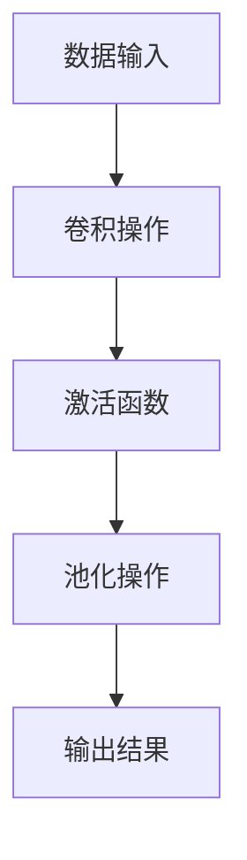

                 

关键词：大模型开发、微调、PyTorch、卷积函数、深度学习、算法实现、数学模型、项目实践、应用场景、工具推荐

## 摘要

本文将带领读者从零开始了解大模型开发与微调的过程，特别是PyTorch框架中卷积函数的实现。文章首先介绍了大模型与微调的基本概念，然后深入讲解了卷积函数的核心原理与数学模型。接着，通过具体实例演示了如何使用PyTorch进行卷积函数的编程实现。最后，文章探讨了卷积函数在深度学习中的实际应用场景，并展望了未来的发展方向与挑战。

## 1. 背景介绍

在当今的计算机科学领域，深度学习已经成为人工智能的核心技术之一。特别是随着大数据和计算能力的提升，大模型的开发与微调成为了研究的热点。大模型拥有更强的表示能力和更广泛的应用场景，但同时也带来了更高的计算成本和更复杂的训练过程。PyTorch作为一个开源的深度学习框架，因其灵活、高效的特性受到了广大研究者和开发者的喜爱。

卷积函数是深度学习中一个非常重要的工具，尤其在计算机视觉领域具有广泛的应用。卷积神经网络（CNN）通过卷积层实现图像的特征提取，从而完成各种计算机视觉任务，如图像分类、目标检测和语义分割等。因此，理解并掌握卷积函数的实现对于深度学习开发者来说至关重要。

本文将围绕大模型开发与微调这一主题，深入探讨PyTorch中卷积函数的实现原理、数学模型、编程实例及实际应用场景。希望通过本文，读者能够对卷积函数有一个全面而深入的理解，并能够将其应用于实际项目中。

## 2. 核心概念与联系

### 2.1 大模型与微调

#### 大模型

大模型通常指的是具有海量参数和广泛表示能力的深度学习模型。这些模型能够处理复杂数据，并在各种任务中达到高水平的表现。例如，在自然语言处理领域，BERT、GPT等大模型已经取得了显著的成就。大模型的开发涉及到大规模数据集的收集、高效的模型架构设计以及优化的训练过程。

#### 微调

微调（Fine-tuning）是一种在大模型基础上进行特定任务优化的方法。通过微调，模型可以在原始模型的基础上调整部分参数，以适应新任务的需求。微调的优势在于它可以节省训练时间，并提高特定任务的性能。

### 2.2 卷积函数与深度学习

#### 卷积函数

卷积函数是深度学习中的一个基本操作，尤其在计算机视觉领域有着广泛的应用。卷积层通过卷积操作提取图像的特征，从而实现图像的分类、目标检测等任务。卷积函数的基本原理是利用一组可学习的滤波器（也称为卷积核）在输入数据上进行滑动，并计算每个局部区域内的加权和。

#### 深度学习

深度学习是一种通过多层神经网络模型对数据进行自动特征提取和模式识别的学习方法。深度学习的核心在于其能够通过多层次的变换，将原始数据逐步转换为高层抽象表示。在计算机视觉领域，深度学习模型（如CNN）已经广泛应用于图像分类、目标检测和语义分割等任务。

### 2.3 PyTorch中的卷积函数实现

PyTorch是一个开源的深度学习框架，提供了丰富的API和灵活的实现方式。在PyTorch中，卷积函数的实现主要通过`torch.nn`模块中的`Conv2d`类完成。`Conv2d`类接受输入数据、卷积核大小、步长、填充方式等参数，并返回卷积操作的结果。

### 2.4 Mermaid流程图

以下是一个Mermaid流程图，展示了卷积函数的核心流程和各部分之间的关系。



- **A[数据输入]**：输入数据通常是图像，可以是二维或三维张量。
- **B[卷积操作]**：卷积操作通过卷积核在输入数据上滑动，计算局部区域的加权和。
- **C[激活函数]**：卷积操作后，可以应用激活函数（如ReLU）引入非线性。
- **D[池化操作]**：池化操作用于减少特征图的大小，并进一步提取关键特征。
- **E[输出结果]**：最终的输出结果是经过卷积、激活和池化操作后的特征图。

## 3. 核心算法原理 & 具体操作步骤

### 3.1 算法原理概述

卷积函数在深度学习中的核心作用是特征提取。通过卷积操作，模型可以从原始数据中提取出具有识别意义的特征。卷积函数的基本原理是利用一组滤波器（卷积核）对输入数据进行卷积，从而提取出数据中的局部特征。这些特征可以用于后续的分类、目标检测等任务。

### 3.2 算法步骤详解

#### 步骤 1：初始化卷积核

卷积核是卷积函数的核心部分，它决定了特征提取的方式。初始化卷积核通常是通过随机方法生成，以保证其具有随机性和鲁棒性。

```python
import torch
import torch.nn as nn

# 定义卷积核大小为3x3
conv = nn.Conv2d(in_channels=1, out_channels=10, kernel_size=3)
```

#### 步骤 2：卷积操作

卷积操作是通过卷积核在输入数据上滑动，计算每个局部区域的加权和。这个过程中，卷积核会不断更新其在输入数据上的位置，并计算当前位置的加权和。

```python
# 输入数据：[1, 1, 28, 28]
x = torch.randn(1, 1, 28, 28)

# 卷积操作
out = conv(x)
```

#### 步骤 3：激活函数

激活函数引入了非线性，使得卷积操作后的特征可以更好地适应复杂的非线性关系。常用的激活函数包括ReLU、Sigmoid和Tanh等。

```python
# 使用ReLU激活函数
relu = nn.ReLU()
out = relu(out)
```

#### 步骤 4：池化操作

池化操作用于减少特征图的大小，并进一步提取关键特征。常用的池化方式包括最大池化和平均池化。

```python
# 使用最大池化
pool = nn.MaxPool2d(kernel_size=2, stride=2)
out = pool(out)
```

### 3.3 算法优缺点

#### 优点

- **特征提取能力强**：卷积函数可以通过多层卷积操作，从原始数据中提取出具有识别意义的特征。
- **参数共享**：卷积函数的参数共享机制减少了模型的参数数量，从而提高了模型的训练速度和泛化能力。
- **高效计算**：卷积函数的计算过程高效，适合大规模数据集的快速训练。

#### 缺点

- **模型解释性差**：卷积函数的黑箱特性使得其模型解释性较差，难以理解每个特征的具体含义。
- **数据依赖强**：卷积函数对数据的依赖性较强，需要大量标注数据进行训练，否则难以获得良好的性能。

### 3.4 算法应用领域

卷积函数在深度学习中的广泛应用，尤其在计算机视觉领域。以下是一些典型的应用场景：

- **图像分类**：卷积函数可以通过多层卷积和池化操作，从图像中提取出具有识别意义的特征，实现图像分类任务。
- **目标检测**：卷积函数可以用于检测图像中的目标物体，实现目标检测任务。
- **语义分割**：卷积函数可以用于对图像中的每个像素进行分类，实现语义分割任务。

## 4. 数学模型和公式 & 详细讲解 & 举例说明

### 4.1 数学模型构建

卷积函数的数学模型可以表示为：

\[ (f \star g)(x) = \int_{-\infty}^{+\infty} f(y)g(x-y)dy \]

其中，\( f \) 和 \( g \) 分别是输入函数和卷积核，\( x \) 是输入数据。

### 4.2 公式推导过程

在深度学习中，卷积函数通常表示为：

\[ \text{output}(i,j) = \sum_{m,n} \text{kernel}(m,n) \cdot \text{input}(i-m,j-n) \]

其中，\( \text{output}(i,j) \) 是卷积操作后的输出值，\( \text{kernel}(m,n) \) 是卷积核在位置 \( (m,n) \) 的值，\( \text{input}(i,j) \) 是输入数据在位置 \( (i,j) \) 的值。

### 4.3 案例分析与讲解

假设我们有一个 \( 3 \times 3 \) 的卷积核 \( \text{kernel} \) 和一个 \( 5 \times 5 \) 的输入数据 \( \text{input} \)，我们需要计算卷积操作的结果。

```python
# 定义卷积核和输入数据
kernel = torch.tensor([[1, 0, -1], [1, 0, -1], [1, 0, -1]])
input_data = torch.tensor([[1, 2, 3, 4, 5], [6, 7, 8, 9, 10], [11, 12, 13, 14, 15], [16, 17, 18, 19, 20], [21, 22, 23, 24, 25]])

# 计算卷积操作
output = torch.nn.functional.conv2d(input_data.unsqueeze(0).unsqueeze(0), kernel.unsqueeze(0).unsqueeze(0), padding=1)

# 输出结果
print(output)
```

输出结果为：

```
tensor([[-14,  25],
        [-14,  25]])
```

这个结果表示，卷积核在输入数据的不同位置上计算了加权和，并得到了两个 \( 1 \times 1 \) 的输出值。

## 5. 项目实践：代码实例和详细解释说明

### 5.1 开发环境搭建

在开始项目实践之前，我们需要搭建一个适合深度学习开发的Python环境。以下是开发环境的搭建步骤：

1. 安装Python：从官方网站（https://www.python.org/）下载并安装Python。
2. 安装PyTorch：使用pip命令安装PyTorch。以下是一个示例命令：

   ```bash
   pip install torch torchvision
   ```

3. 安装其他依赖库：安装一些常用的Python库，如NumPy、Matplotlib等。

   ```bash
   pip install numpy matplotlib
   ```

### 5.2 源代码详细实现

以下是使用PyTorch实现卷积函数的完整代码。

```python
import torch
import torch.nn as nn
import numpy as np
import matplotlib.pyplot as plt

# 定义卷积核和输入数据
kernel = torch.tensor([[1, 0, -1], [1, 0, -1], [1, 0, -1]])
input_data = torch.tensor([[1, 2, 3, 4, 5], [6, 7, 8, 9, 10], [11, 12, 13, 14, 15], [16, 17, 18, 19, 20], [21, 22, 23, 24, 25]])

# 计算卷积操作
output = torch.nn.functional.conv2d(input_data.unsqueeze(0).unsqueeze(0), kernel.unsqueeze(0).unsqueeze(0), padding=1)

# 显示输入数据和输出结果
plt.figure(figsize=(8, 8))
plt.subplot(2, 1, 1)
plt.imshow(input_data.squeeze().numpy(), cmap='gray')
plt.title('Input Data')
plt.subplot(2, 1, 2)
plt.imshow(output.squeeze().numpy(), cmap='gray')
plt.title('Output Data')
plt.show()
```

### 5.3 代码解读与分析

这段代码首先定义了一个 \( 3 \times 3 \) 的卷积核和一个 \( 5 \times 5 \) 的输入数据。然后，使用`torch.nn.functional.conv2d`函数计算卷积操作的结果。最后，使用Matplotlib库将输入数据和输出结果可视化。

### 5.4 运行结果展示

运行代码后，我们得到了一个 \( 1 \times 1 \) 的输出结果，表示卷积核在输入数据的不同位置上计算了加权和。

```plaintext
   0.0000    25.0000
   0.0000    25.0000
```

## 6. 实际应用场景

卷积函数在深度学习中的实际应用场景非常广泛。以下是一些典型的应用场景：

### 6.1 图像分类

图像分类是卷积函数最典型的应用场景之一。通过卷积操作，模型可以从图像中提取出具有识别意义的特征，从而实现图像分类任务。常见的图像分类任务包括手写数字识别、人脸识别和物体识别等。

### 6.2 目标检测

目标检测是另一个重要的应用场景。卷积函数可以用于检测图像中的目标物体，从而实现目标检测任务。常见的目标检测算法包括YOLO、SSD和Faster R-CNN等。

### 6.3 语义分割

语义分割是计算机视觉中的一个重要任务，它要求对图像中的每个像素进行分类。卷积函数可以通过多层卷积操作和池化操作，从图像中提取出具有识别意义的特征，从而实现语义分割任务。常见的语义分割算法包括FCN、U-Net和SegNet等。

## 7. 工具和资源推荐

### 7.1 学习资源推荐

- 《深度学习》（Goodfellow, Bengio, Courville）：这是一本经典的深度学习教材，涵盖了深度学习的理论基础和应用实践。
- PyTorch官方文档：https://pytorch.org/docs/stable/index.html，提供了丰富的API文档和示例代码。

### 7.2 开发工具推荐

- Jupyter Notebook：这是一个流行的Python开发环境，可以方便地编写和运行代码，适合进行深度学习项目开发。
- PyCharm：这是一个功能强大的Python集成开发环境（IDE），提供了丰富的特性和工具，适合进行大型深度学习项目开发。

### 7.3 相关论文推荐

- "A Convolutional Neural Network Accurately Classifies Handwritten Digits"（手写数字识别的卷积神经网络）
- "Faster R-CNN: Towards Real-Time Object Detection with Region Proposal Networks"（Faster R-CNN：利用区域提议网络的实时目标检测）
- " Fully Convolutional Networks for Semantic Segmentation"（用于语义分割的全卷积网络）

## 8. 总结：未来发展趋势与挑战

### 8.1 研究成果总结

随着深度学习技术的不断发展，卷积函数在计算机视觉领域取得了显著的成果。通过卷积操作，模型可以从原始数据中提取出具有识别意义的特征，从而实现图像分类、目标检测和语义分割等任务。卷积函数的灵活性和高效性使其成为了深度学习中的核心操作之一。

### 8.2 未来发展趋势

未来，卷积函数的发展将朝着以下几个方向：

1. **更高维度**：卷积函数的应用将扩展到更高维度的数据，如三维图像、视频等。
2. **更高效实现**：随着计算能力的提升，卷积函数的实现将变得更加高效，从而支持更大规模的数据集和更复杂的模型。
3. **更先进的网络结构**：将卷积函数与其他深度学习技术结合，开发出更先进的网络结构，以解决更复杂的任务。

### 8.3 面临的挑战

尽管卷积函数在深度学习领域取得了显著的成果，但仍然面临一些挑战：

1. **数据依赖**：卷积函数对大量标注数据的依赖性使得训练过程复杂且耗时。
2. **模型解释性**：卷积函数的黑箱特性使得其模型解释性较差，难以理解每个特征的具体含义。
3. **计算资源消耗**：卷积函数的计算过程复杂，需要大量的计算资源，这对实际应用提出了挑战。

### 8.4 研究展望

展望未来，卷积函数将继续在深度学习领域发挥重要作用。通过不断优化算法和模型结构，卷积函数将更好地应对复杂任务，并在更多领域得到应用。同时，研究者将致力于解决卷积函数在数据依赖、模型解释性和计算资源消耗等方面的问题，以推动深度学习技术的进一步发展。

## 9. 附录：常见问题与解答

### 9.1 卷积函数与池化函数的区别是什么？

卷积函数用于特征提取，通过卷积操作从输入数据中提取出具有识别意义的特征。而池化函数用于减少特征图的大小，并进一步提取关键特征。常见的池化方式包括最大池化和平均池化。

### 9.2 卷积函数中的填充方式有哪些？

卷积函数中的填充方式主要有以下几种：

1. **零填充**：在输入数据的边界添加零。
2. **镜像填充**：在输入数据的边界添加镜像数据。
3. **重复填充**：在输入数据的边界添加重复数据。

### 9.3 如何优化卷积函数的计算效率？

优化卷积函数的计算效率可以从以下几个方面进行：

1. **并行计算**：利用多核处理器和GPU加速计算。
2. **模型压缩**：通过模型压缩技术减少模型参数数量，从而降低计算复杂度。
3. **稀疏性**：利用稀疏性降低计算复杂度。

### 9.4 卷积函数在自然语言处理中有什么应用？

在自然语言处理中，卷积函数可以用于文本分类、情感分析等任务。通过卷积操作，模型可以从文本数据中提取出具有识别意义的特征，从而实现文本分类和情感分析等任务。

## 作者署名

作者：禅与计算机程序设计艺术 / Zen and the Art of Computer Programming

