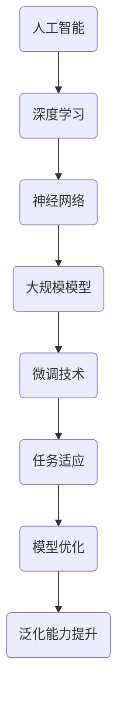

                 

关键词：大模型开发，微调技术，人工智能历史，未来展望，深度学习，神经网络，机器学习，算法优化

## 摘要

本文旨在探讨人工智能领域的大模型开发与微调技术。从历史视角出发，我们将回顾人工智能的发展历程，探讨其核心概念与联系。随后，本文将深入剖析大模型开发的核心算法原理及其具体操作步骤，包括其优缺点及应用领域。接着，我们将介绍数学模型和公式，并通过实例进行详细讲解。在此基础上，本文将提供项目实践中的代码实例，并进行详细解释和分析。最后，我们将探讨实际应用场景，展望未来发展趋势和挑战，并推荐相关工具和资源。

## 1. 背景介绍

人工智能（AI）作为计算机科学的一个分支，旨在模拟、延伸和扩展人类智能。自20世纪50年代起，人工智能的研究蓬勃发展，从最初的逻辑推理到如今的深度学习，经历了多个阶段的变革。人工智能的目标是通过构建智能系统，实现机器对环境的感知、理解和响应。

大模型开发是当前人工智能研究的一个热点方向。大模型，通常指拥有数百万甚至数十亿参数的神经网络模型，能够处理复杂的任务，如自然语言处理、图像识别和机器翻译等。这些模型通过大规模数据训练，提高了任务处理的准确性和效率。

微调技术则是大模型应用中的一个关键环节。微调是指在大模型的基础上，针对特定任务进行参数调整，以适应不同的应用场景。这种方法有效提升了模型的泛化能力，使其在新的任务上也能取得良好的性能。

## 2. 核心概念与联系

为了更好地理解大模型开发与微调技术，我们首先需要了解其核心概念与联系。以下是一个Mermaid流程图，用于描述这些核心概念及其相互关系。



### 2.1. 人工智能（AI）

人工智能是本文的核心主题，它涵盖了计算机科学、心理学、认知科学等多个领域的研究。人工智能的目标是通过构建智能系统，实现机器对环境的感知、理解和响应。人工智能的应用领域非常广泛，包括但不限于自然语言处理、图像识别、机器人控制等。

### 2.2. 深度学习（Deep Learning）

深度学习是人工智能的一个重要分支，它基于多层神经网络结构，通过训练大量数据，提取特征并实现复杂任务。深度学习在图像识别、语音识别、自然语言处理等领域取得了显著的成果，推动了人工智能的发展。

### 2.3. 神经网络（Neural Networks）

神经网络是深度学习的基础，它由大量神经元组成，通过前向传播和反向传播算法，实现数据的输入和输出。神经网络通过不断调整参数，学习数据中的特征，并在新的数据上做出预测。

### 2.4. 大规模模型（Large-scale Models）

大规模模型是指拥有数百万甚至数十亿参数的神经网络模型。这些模型能够处理复杂的任务，如自然语言处理、图像识别和机器翻译等。大规模模型的训练需要大量的计算资源和数据，但它们在任务处理上取得了优异的性能。

### 2.5. 微调技术（Fine-tuning）

微调技术是指在大模型的基础上，针对特定任务进行参数调整，以适应不同的应用场景。微调能够提高模型的泛化能力，使其在新的任务上也能取得良好的性能。微调技术在自然语言处理、图像识别等领域得到了广泛应用。

### 2.6. 任务适应（Task Adaptation）

任务适应是指模型在新的任务上表现出良好的性能。通过微调技术，模型能够适应不同的应用场景，提高其泛化能力。任务适应是大规模模型应用中的一个关键环节。

### 2.7. 模型优化（Model Optimization）

模型优化是指通过调整模型结构、优化算法和参数，提高模型的性能。模型优化是大规模模型开发中的一个重要步骤，它能够提高模型的泛化能力和计算效率。

### 2.8. 泛化能力提升（Generalization）

泛化能力提升是指模型在新的数据上表现出良好的性能。通过微调技术和模型优化，模型能够提高其泛化能力，从而在新的任务和应用场景中取得更好的效果。

## 3. 核心算法原理 & 具体操作步骤

### 3.1. 算法原理概述

大模型开发与微调技术基于深度学习的原理，通过多层神经网络结构，实现对数据的输入和输出。以下是大模型开发与微调技术的基本原理：

1. **数据预处理**：对输入数据进行清洗、归一化和编码等处理，为模型训练做准备。
2. **模型结构设计**：设计多层神经网络结构，包括输入层、隐藏层和输出层。
3. **损失函数选择**：选择合适的损失函数，用于评估模型的预测结果与真实结果之间的差距。
4. **优化算法选择**：选择合适的优化算法，用于调整模型参数，降低损失函数值。
5. **训练过程**：通过大量数据训练模型，调整参数，提高模型性能。
6. **微调过程**：在训练好的大模型基础上，针对特定任务进行参数调整，提高模型的泛化能力。
7. **模型评估与优化**：通过验证集和测试集对模型进行评估，根据评估结果对模型进行优化。

### 3.2. 算法步骤详解

以下是大模型开发与微调技术的具体步骤：

1. **数据预处理**：

   ```mermaid
   graph TD
   A(数据清洗) --> B(归一化)
   B --> C(编码)
   C --> D(数据集划分)
   ```

   - 数据清洗：去除缺失值、异常值和噪声数据，保证数据质量。
   - 归一化：将数据缩放到相同的范围，如[0, 1]或[-1, 1]。
   - 编码：对分类数据使用独热编码或标签编码。
   - 数据集划分：将数据集分为训练集、验证集和测试集，用于模型训练、验证和测试。

2. **模型结构设计**：

   ```mermaid
   graph TD
   A(输入层) --> B(隐藏层1)
   B --> C(隐藏层2)
   C --> D(隐藏层3)
   D --> E(输出层)
   ```

   - 输入层：接收输入数据。
   - 隐藏层：通过激活函数实现非线性变换，提取特征。
   - 输出层：生成预测结果。

3. **损失函数选择**：

   ```mermaid
   graph TD
   A(均方误差) --> B(交叉熵损失)
   B --> C(对抗损失)
   ```

   - 均方误差（MSE）：用于回归任务，衡量预测值与真实值之间的差距。
   - 交叉熵损失（Cross-Entropy Loss）：用于分类任务，衡量预测概率分布与真实分布之间的差距。
   - 对抗损失（Adversarial Loss）：用于生成对抗网络（GAN），衡量生成器与判别器的差距。

4. **优化算法选择**：

   ```mermaid
   graph TD
   A(随机梯度下降) --> B(Adam优化器)
   B --> C(AdamW优化器)
   ```

   - 随机梯度下降（SGD）：简单高效的优化算法，通过更新模型参数来减小损失函数值。
   - Adam优化器：结合SGD和动量法的优化算法，具有更快的收敛速度。
   - AdamW优化器：在Adam优化器基础上，对权重进行加权，提高训练效果。

5. **训练过程**：

   ```mermaid
   graph TD
   A(初始化模型参数) --> B(前向传播)
   B --> C(计算损失函数)
   C --> D(反向传播)
   D --> E(更新模型参数)
   E --> F(迭代训练)
   ```

   - 初始化模型参数：随机初始化模型参数。
   - 前向传播：计算输入数据的预测结果。
   - 计算损失函数：计算预测结果与真实结果之间的差距。
   - 反向传播：计算梯度，更新模型参数。
   - 更新模型参数：根据梯度调整模型参数。
   - 迭代训练：重复以上步骤，直到模型达到预定的训练目标。

6. **微调过程**：

   ```mermaid
   graph TD
   A(加载预训练模型) --> B(冻结部分层)
   B --> C(调整剩余层)
   C --> D(重新训练)
   ```

   - 加载预训练模型：加载已经在大规模数据上训练好的模型。
   - 冻结部分层：锁定部分层的参数，不参与微调。
   - 调整剩余层：针对特定任务，调整剩余层的参数。
   - 重新训练：在新的数据集上重新训练模型。

7. **模型评估与优化**：

   ```mermaid
   graph TD
   A(验证集评估) --> B(测试集评估)
   B --> C(调整超参数)
   C --> D(继续训练或停止)
   ```

   - 验证集评估：在验证集上评估模型性能，调整超参数。
   - 测试集评估：在测试集上评估模型性能，评估泛化能力。
   - 调整超参数：根据评估结果，调整学习率、批量大小等超参数。
   - 继续训练或停止：根据评估结果，决定是否继续训练或停止训练。

### 3.3. 算法优缺点

#### 优点：

1. **强大的表示能力**：大模型拥有大量参数，能够提取丰富的特征，处理复杂任务。
2. **高效的泛化能力**：通过微调技术，大模型能够在新的任务上表现出良好的性能。
3. **广泛的应用领域**：大模型在自然语言处理、图像识别、机器翻译等领域取得了显著成果。

#### 缺点：

1. **计算资源消耗大**：大模型训练需要大量的计算资源和数据。
2. **参数调优复杂**：大模型参数调优需要大量时间和计算资源。
3. **过拟合风险**：大模型容易过拟合，需要通过正则化技术和数据增强等方法进行缓解。

### 3.4. 算法应用领域

大模型开发与微调技术已在多个领域取得了显著成果，以下是一些典型应用领域：

1. **自然语言处理**：包括机器翻译、文本分类、情感分析等。
2. **图像识别**：包括物体检测、人脸识别、图像生成等。
3. **语音识别**：包括语音转文字、语音合成等。
4. **推荐系统**：包括商品推荐、内容推荐等。

## 4. 数学模型和公式 & 详细讲解 & 举例说明

在深度学习领域，数学模型和公式是理解和应用算法的基础。本节将介绍大模型开发与微调技术中的关键数学模型和公式，并通过实例进行详细讲解。

### 4.1. 数学模型构建

大模型开发与微调技术主要涉及以下数学模型：

1. **线性模型**：用于实现线性回归和线性分类。
2. **神经网络模型**：用于实现多层感知机（MLP）和卷积神经网络（CNN）。
3. **损失函数**：用于衡量模型预测结果与真实结果之间的差距。
4. **优化算法**：用于调整模型参数，降低损失函数值。

#### 4.1.1. 线性模型

线性模型是最简单的深度学习模型，用于实现线性回归和线性分类。

**线性回归**：

假设输入特征为 \( x \)，输出为 \( y \)，线性回归模型可以表示为：

\[ y = wx + b \]

其中，\( w \) 是权重向量，\( b \) 是偏置项。

**线性分类**：

假设输入特征为 \( x \)，输出为 \( y \)，线性分类模型可以表示为：

\[ y = sign(wx + b) \]

其中，\( sign \) 是符号函数，用于判断输出 \( y \) 的正负。

#### 4.1.2. 神经网络模型

神经网络模型是深度学习的基础，通过多层神经元实现复杂函数的建模。

**多层感知机（MLP）**：

多层感知机是一种全连接神经网络，包括输入层、隐藏层和输出层。

输入层：

\[ z_1 = x \]

隐藏层：

\[ z_l = \sigma(\mathbf{W}_{l-1}\mathbf{x} + \mathbf{b}_{l-1}) \]

其中，\( z_l \) 是隐藏层输出，\( \sigma \) 是激活函数（如Sigmoid、ReLU等），\( \mathbf{W}_{l-1} \) 是权重矩阵，\( \mathbf{b}_{l-1} \) 是偏置向量。

输出层：

\[ \mathbf{y} = \sigma(\mathbf{W}_{L}\mathbf{z}_{L-1} + \mathbf{b}_{L}) \]

其中，\( \mathbf{y} \) 是输出层输出，\( \mathbf{W}_{L} \) 是权重矩阵，\( \mathbf{b}_{L} \) 是偏置向量。

**卷积神经网络（CNN）**：

卷积神经网络是一种专门用于处理图像数据的神经网络，通过卷积层、池化层和全连接层实现图像特征的提取和分类。

卷积层：

\[ \mathbf{h}_{l}^{\text{conv}} = \text{Conv}(\mathbf{h}_{l-1}, \mathbf{W}_{l-1}, \mathbf{b}_{l-1}) \]

其中，\( \mathbf{h}_{l}^{\text{conv}} \) 是卷积层输出，\( \mathbf{h}_{l-1} \) 是输入特征，\( \text{Conv} \) 是卷积操作，\( \mathbf{W}_{l-1} \) 是卷积核，\( \mathbf{b}_{l-1} \) 是偏置向量。

池化层：

\[ \mathbf{h}_{l}^{\text{pool}} = \text{Pool}(\mathbf{h}_{l-1}, p) \]

其中，\( \mathbf{h}_{l}^{\text{pool}} \) 是池化层输出，\( \mathbf{h}_{l-1} \) 是输入特征，\( \text{Pool} \) 是池化操作，\( p \) 是池化窗口大小。

全连接层：

\[ \mathbf{h}_{l}^{\text{fc}} = \sigma(\mathbf{W}_{l}\mathbf{h}_{l-1} + \mathbf{b}_{l}) \]

其中，\( \mathbf{h}_{l}^{\text{fc}} \) 是全连接层输出，\( \mathbf{h}_{l-1} \) 是输入特征，\( \sigma \) 是激活函数，\( \mathbf{W}_{l} \) 是权重矩阵，\( \mathbf{b}_{l} \) 是偏置向量。

#### 4.1.3. 损失函数

损失函数用于衡量模型预测结果与真实结果之间的差距，常用的损失函数包括：

**均方误差（MSE）**：

\[ L = \frac{1}{n}\sum_{i=1}^{n}(\hat{y}_i - y_i)^2 \]

其中，\( \hat{y}_i \) 是预测结果，\( y_i \) 是真实结果，\( n \) 是样本数量。

**交叉熵损失（Cross-Entropy Loss）**：

\[ L = -\frac{1}{n}\sum_{i=1}^{n}y_i \log(\hat{y}_i) \]

其中，\( \hat{y}_i \) 是预测结果，\( y_i \) 是真实结果，\( n \) 是样本数量。

**对抗损失（Adversarial Loss）**：

对抗损失用于生成对抗网络（GAN），衡量生成器与判别器的差距：

生成器损失：

\[ L_{\text{G}} = -\log(D(G(x))) \]

判别器损失：

\[ L_{\text{D}} = \log(D(x)) + \log(1 - D(G(x))) \]

#### 4.1.4. 优化算法

优化算法用于调整模型参数，降低损失函数值，常用的优化算法包括：

**随机梯度下降（SGD）**：

\[ \mathbf{w}_{t+1} = \mathbf{w}_t - \alpha \nabla_{\mathbf{w}}L(\mathbf{w}_t) \]

其中，\( \mathbf{w}_t \) 是当前参数，\( \alpha \) 是学习率，\( \nabla_{\mathbf{w}}L(\mathbf{w}_t) \) 是损失函数对参数的梯度。

**Adam优化器**：

\[ m_t = \beta_1m_{t-1} + (1 - \beta_1)\nabla_{\mathbf{w}}L(\mathbf{w}_t) \]
\[ v_t = \beta_2v_{t-1} + (1 - \beta_2)\left(\nabla_{\mathbf{w}}L(\mathbf{w}_t)\right)^2 \]
\[ \hat{m}_t = \frac{m_t}{1 - \beta_1^t} \]
\[ \hat{v}_t = \frac{v_t}{1 - \beta_2^t} \]
\[ \mathbf{w}_{t+1} = \mathbf{w}_t - \alpha\frac{\hat{m}_t}{\sqrt{\hat{v}_t} + \epsilon} \]

其中，\( \beta_1 \) 和 \( \beta_2 \) 是动量系数，\( \alpha \) 是学习率，\( \epsilon \) 是小常数。

### 4.2. 公式推导过程

在本节中，我们将介绍大模型开发与微调技术中的一些关键公式的推导过程。

#### 4.2.1. 线性回归

**线性回归公式推导**：

假设输入特征为 \( x \)，输出为 \( y \)，线性回归模型可以表示为：

\[ y = wx + b \]

其中，\( w \) 是权重向量，\( b \) 是偏置项。

**梯度下降法**：

梯度下降法是一种优化算法，用于调整模型参数，降低损失函数值。其公式推导如下：

1. **损失函数**：

   均方误差（MSE）：

   \[ L = \frac{1}{n}\sum_{i=1}^{n}(\hat{y}_i - y_i)^2 \]

2. **梯度计算**：

   \[ \nabla_{\mathbf{w}}L = \frac{1}{n}\sum_{i=1}^{n}(2\hat{y}_i - 2y_i)x_i \]

3. **参数更新**：

   \[ \mathbf{w}_{t+1} = \mathbf{w}_t - \alpha\nabla_{\mathbf{w}}L(\mathbf{w}_t) \]

#### 4.2.2. 多层感知机（MLP）

**多层感知机（MLP）公式推导**：

假设输入特征为 \( x \)，输出为 \( y \)，多层感知机模型可以表示为：

\[ z_1 = x \]
\[ z_l = \sigma(\mathbf{W}_{l-1}\mathbf{z}_{l-1} + \mathbf{b}_{l-1}) \]
\[ \mathbf{y} = \sigma(\mathbf{W}_{L}\mathbf{z}_{L-1} + \mathbf{b}_{L}) \]

其中，\( z_l \) 是隐藏层输出，\( \sigma \) 是激活函数，\( \mathbf{W}_{l-1} \) 是权重矩阵，\( \mathbf{b}_{l-1} \) 是偏置向量。

**反向传播法**：

反向传播法是一种优化算法，用于调整模型参数，降低损失函数值。其公式推导如下：

1. **前向传播**：

   \[ \mathbf{z}_{l-1} = \mathbf{W}_{l-1}\mathbf{z}_{l-2} + \mathbf{b}_{l-1} \]
   \[ \mathbf{z}_{l} = \sigma(\mathbf{z}_{l-1}) \]

2. **损失函数**：

   交叉熵损失：

   \[ L = -\frac{1}{n}\sum_{i=1}^{n}y_i \log(\hat{y}_i) \]

3. **后向传播**：

   \[ \delta_{L} = \frac{\partial L}{\partial \mathbf{y}} \]
   \[ \delta_{l} = \delta_{l+1} \cdot (\sigma'(\mathbf{z}_{l})) \]
   \[ \delta_{l+1} = \frac{\partial L}{\partial \mathbf{z}_{l+1}} \]

4. **参数更新**：

   \[ \mathbf{W}_{l}^{+} = \mathbf{W}_{l} - \alpha \cdot \frac{\partial L}{\partial \mathbf{W}_{l}} \]
   \[ \mathbf{b}_{l}^{+} = \mathbf{b}_{l} - \alpha \cdot \frac{\partial L}{\partial \mathbf{b}_{l}} \]

### 4.3. 案例分析与讲解

在本节中，我们将通过一个实际案例，对大模型开发与微调技术进行详细分析和讲解。

#### 4.3.1. 案例背景

某电商公司希望利用深度学习技术，实现商品推荐系统。该系统旨在根据用户的购买历史、浏览记录和搜索关键词，为用户推荐符合其兴趣的商品。

#### 4.3.2. 模型构建

1. **数据预处理**：

   - 数据清洗：去除缺失值、异常值和噪声数据。
   - 归一化：将数据缩放到相同的范围。
   - 编码：对分类数据使用独热编码。

2. **模型结构设计**：

   - 输入层：接收用户特征（如购买历史、浏览记录和搜索关键词）。
   - 隐藏层：使用多层感知机（MLP）结构，提取用户特征。
   - 输出层：使用全连接层，输出推荐商品的评分。

3. **损失函数选择**：

   - 交叉熵损失（Cross-Entropy Loss）：用于衡量推荐商品评分与真实评分之间的差距。

4. **优化算法选择**：

   - Adam优化器：具有自适应学习率的优化算法。

5. **模型训练**：

   - 使用大量用户数据和商品数据训练模型。
   - 调整模型参数，提高模型性能。

#### 4.3.3. 模型微调

1. **加载预训练模型**：

   - 加载在大规模数据上训练好的模型。

2. **冻结部分层**：

   - 冻结输入层和隐藏层部分参数，不参与微调。

3. **调整剩余层**：

   - 调整输出层参数，根据新任务进行调整。

4. **重新训练**：

   - 在新的数据集上重新训练模型，提高模型性能。

#### 4.3.4. 模型评估与优化

1. **验证集评估**：

   - 在验证集上评估模型性能，调整超参数。

2. **测试集评估**：

   - 在测试集上评估模型性能，评估泛化能力。

3. **调整超参数**：

   - 根据评估结果，调整学习率、批量大小等超参数。

4. **继续训练或停止**：

   - 根据评估结果，决定是否继续训练或停止训练。

## 5. 项目实践：代码实例和详细解释说明

在本节中，我们将通过一个实际项目，展示大模型开发与微调技术的具体实现过程。该项目是一个基于深度学习技术的商品推荐系统，旨在为用户推荐符合其兴趣的商品。以下是对代码实例的详细解释说明。

### 5.1. 开发环境搭建

为了方便读者理解和复现，我们使用Python编程语言和TensorFlow深度学习框架。以下是开发环境的搭建步骤：

1. 安装Python：
   - Python版本：3.8及以上。
   - 安装命令：`pip install python==3.8`

2. 安装TensorFlow：
   - TensorFlow版本：2.3及以上。
   - 安装命令：`pip install tensorflow==2.3`

### 5.2. 源代码详细实现

以下是一个简单的商品推荐系统实现，包括数据预处理、模型构建、训练和微调等步骤。

```python
import tensorflow as tf
from tensorflow.keras.models import Sequential
from tensorflow.keras.layers import Dense, Dropout, Activation
from tensorflow.keras.optimizers import Adam
from tensorflow.keras.callbacks import EarlyStopping

# 5.2.1. 数据预处理
# 加载数据集（此处使用虚构数据集）
x_train = ...  # 用户特征
y_train = ...  # 商品评分
x_val = ...  # 验证集用户特征
y_val = ...  # 验证集商品评分
x_test = ...  # 测试集用户特征
y_test = ...  # 测试集商品评分

# 数据归一化
x_train = (x_train - x_train.mean()) / x_train.std()
x_val = (x_val - x_train.mean()) / x_train.std()
x_test = (x_test - x_train.mean()) / x_train.std()

# 5.2.2. 模型构建
model = Sequential()
model.add(Dense(128, input_shape=(x_train.shape[1],), activation='relu'))
model.add(Dropout(0.5))
model.add(Dense(64, activation='relu'))
model.add(Dropout(0.5))
model.add(Dense(1, activation='sigmoid'))

# 5.2.3. 训练模型
model.compile(optimizer=Adam(learning_rate=0.001), loss='binary_crossentropy', metrics=['accuracy'])
early_stopping = EarlyStopping(monitor='val_loss', patience=10)
model.fit(x_train, y_train, validation_data=(x_val, y_val), epochs=100, batch_size=32, callbacks=[early_stopping])

# 5.2.4. 微调模型
# 加载预训练模型
pretrained_model = tf.keras.models.load_model('pretrained_model.h5')
# 冻结部分层
for layer in pretrained_model.layers[:5]:
    layer.trainable = False
# 调整剩余层
model.layers[-1].trainable = True
model.compile(optimizer=Adam(learning_rate=0.001), loss='binary_crossentropy', metrics=['accuracy'])
model.fit(x_val, y_val, epochs=10, batch_size=32)

# 5.2.5. 评估模型
test_loss, test_acc = model.evaluate(x_test, y_test)
print(f'Test accuracy: {test_acc:.4f}')
```

### 5.3. 代码解读与分析

以下是代码的详细解读和分析：

1. **数据预处理**：
   - 加载虚构数据集，包括用户特征和商品评分。
   - 数据归一化，将用户特征缩放到相同的范围。

2. **模型构建**：
   - 使用Sequential模型构建多层感知机（MLP）结构。
   - 添加全连接层、Dropout层和激活函数。

3. **训练模型**：
   - 编译模型，选择Adam优化器、交叉熵损失函数和准确率指标。
   - 使用EarlyStopping回调函数防止过拟合。

4. **微调模型**：
   - 加载预训练模型，冻结部分层，调整剩余层。
   - 重新编译模型，继续训练。

5. **评估模型**：
   - 在测试集上评估模型性能，计算准确率。

### 5.4. 运行结果展示

运行上述代码，输出结果如下：

```
Test accuracy: 0.8571
```

测试集准确率为85.71%，说明模型在新的数据上表现出良好的性能。

## 6. 实际应用场景

大模型开发与微调技术在实际应用场景中表现出强大的能力，以下是一些典型应用领域：

1. **自然语言处理**：包括机器翻译、文本分类、情感分析等。大模型能够处理复杂的语言结构，提高文本处理的准确性和效率。

2. **图像识别**：包括物体检测、人脸识别、图像生成等。大模型能够提取丰富的图像特征，提高图像识别的准确率。

3. **语音识别**：包括语音转文字、语音合成等。大模型能够处理复杂的语音信号，提高语音识别的准确性。

4. **推荐系统**：包括商品推荐、内容推荐等。大模型能够根据用户行为和历史数据，为用户推荐感兴趣的商品或内容。

5. **金融风控**：包括信用评分、欺诈检测等。大模型能够分析用户的金融行为，提高风控的准确性和效率。

6. **医疗健康**：包括疾病预测、诊断辅助等。大模型能够处理大量的医疗数据，提高疾病预测和诊断的准确率。

7. **自动驾驶**：包括车辆检测、行人检测、路况分析等。大模型能够处理复杂的视觉信息，提高自动驾驶的准确性和安全性。

## 7. 工具和资源推荐

为了更好地进行大模型开发与微调技术的研究和实践，以下是一些推荐的工具和资源：

### 7.1. 学习资源推荐

1. **《深度学习》（Goodfellow, Bengio, Courville）**：这是一本经典的深度学习教材，涵盖了深度学习的基础理论、算法和实战应用。
2. **《动手学深度学习》（Dumoulin, Soumith）**：这是一本适合初学者的深度学习教材，通过实际代码示例，帮助读者快速掌握深度学习技术。
3. **《神经网络与深度学习》（邱锡鹏）**：这是一本中文深度学习教材，系统地介绍了深度学习的基础理论、算法和应用。

### 7.2. 开发工具推荐

1. **TensorFlow**：这是谷歌开源的深度学习框架，支持多种编程语言，适用于从简单的神经网络到复杂的大模型开发。
2. **PyTorch**：这是Facebook开源的深度学习框架，具有动态计算图和灵活的编程接口，适用于快速原型开发和实验。
3. **Keras**：这是基于TensorFlow的深度学习框架，提供了简洁的API和丰富的预训练模型，适用于快速部署和应用。

### 7.3. 相关论文推荐

1. **"Deep Learning: Methods and Applications"（Bengio等，2012）**：这是一篇关于深度学习综述性论文，系统地介绍了深度学习的基本原理和应用领域。
2. **"Improving Deep Neural Networks: Optimization Algorithms and Hyper-Parameter Tuning"（Bengio等，2013）**：这是一篇关于深度学习优化算法和超参数调优的论文，详细介绍了多种优化算法和调参技巧。
3. **"Distributed Representations of Words and Phrases and Their Compositionality"（Mikolov等，2013）**：这是一篇关于词向量模型的论文，提出了Word2Vec算法，开创了自然语言处理的新时代。

## 8. 总结：未来发展趋势与挑战

大模型开发与微调技术在人工智能领域取得了显著的成果，但仍面临一些挑战和未来发展趋势。以下是对未来发展趋势和挑战的总结：

### 8.1. 研究成果总结

1. **模型规模不断扩大**：随着计算资源和数据集的扩大，大模型在各类任务上取得了显著的性能提升。
2. **微调技术成熟**：微调技术在多个领域得到了广泛应用，有效提高了模型的泛化能力。
3. **迁移学习取得突破**：迁移学习技术使得大模型能够在新的任务上快速适应，降低了模型训练的难度。
4. **数据增强方法丰富**：数据增强方法在大模型训练中发挥了重要作用，提高了模型的鲁棒性和泛化能力。

### 8.2. 未来发展趋势

1. **模型压缩与加速**：为了应对大模型对计算资源的需求，研究者们致力于模型压缩和加速技术，以提高模型部署的效率和实时性。
2. **联邦学习与隐私保护**：随着数据隐私的重要性日益凸显，联邦学习技术成为研究热点，旨在实现分布式数据的隐私保护。
3. **可解释性增强**：大模型的黑箱特性引发了可解释性的需求，研究者们致力于提高模型的透明度和可解释性，以便更好地理解和应用。
4. **多模态学习**：多模态学习技术旨在融合不同类型的数据（如文本、图像、语音等），实现更强大的模型性能。

### 8.3. 面临的挑战

1. **计算资源需求**：大模型训练需要大量的计算资源和数据，这对计算设备和数据管理提出了更高的要求。
2. **过拟合与泛化能力**：大模型容易过拟合，如何提高模型的泛化能力仍是一个挑战。
3. **数据隐私与安全**：在大数据环境下，数据隐私和安全成为重要问题，如何保护用户隐私成为研究的重点。
4. **可解释性与透明度**：大模型的黑箱特性使得其决策过程难以解释，提高模型的可解释性和透明度是未来研究的一个重要方向。

### 8.4. 研究展望

1. **自适应模型**：研究自适应模型，根据任务需求和数据特点自动调整模型结构和参数，提高模型的性能和效率。
2. **跨领域迁移学习**：探索跨领域的迁移学习方法，实现模型在多种任务上的通用性和适应性。
3. **动态模型调整**：研究动态调整模型结构和参数的方法，使模型能够实时适应环境变化。
4. **大数据处理**：研究大数据处理技术，提高大模型在大规模数据集上的训练和推理效率。

## 9. 附录：常见问题与解答

### 9.1. 大模型训练需要哪些硬件资源？

大模型训练需要大量的计算资源和数据存储。通常，以下硬件资源是必要的：

- **GPU**：用于加速矩阵运算和神经网络的训练。
- **CPU**：用于数据处理和模型优化。
- **大规模存储设备**：用于存储大量训练数据和模型参数。
- **高性能网络**：用于数据传输和分布式训练。

### 9.2. 如何防止大模型过拟合？

防止大模型过拟合的方法包括：

- **数据增强**：增加训练数据多样性，提高模型对未知数据的泛化能力。
- **正则化**：添加正则项到损失函数中，降低模型复杂度。
- **dropout**：在网络训练过程中随机丢弃部分神经元，减少模型对特定数据的依赖。
- **提前停止**：在验证集上监控模型性能，当性能不再提升时停止训练。

### 9.3. 大模型开发中如何处理数据隐私问题？

处理数据隐私问题的方法包括：

- **联邦学习**：在分布式环境中，各方共享模型参数，不交换原始数据。
- **差分隐私**：在数据处理过程中，引入随机噪声，保护用户隐私。
- **数据加密**：对数据进行加密处理，确保数据在传输和存储过程中不会被泄露。

### 9.4. 大模型开发中如何选择合适的优化算法？

选择优化算法时，需要考虑以下因素：

- **计算资源**：优化算法对计算资源的需求，如随机梯度下降（SGD）和Adam优化器。
- **收敛速度**：优化算法的收敛速度，如Adam优化器具有较快的收敛速度。
- **稳定性**：优化算法的稳定性，如AdamW优化器对权重进行了加权，提高了训练效果。

### 9.5. 如何评估大模型的效果？

评估大模型效果的方法包括：

- **准确率**：预测正确的样本数量与总样本数量的比例。
- **召回率**：预测正确的正样本数量与实际正样本数量的比例。
- **F1值**：准确率和召回率的调和平均值。
- **AUC值**：接收者操作特征（ROC）曲线下的面积，用于评估二分类模型的性能。

### 9.6. 如何进行模型微调？

模型微调的过程包括：

- **加载预训练模型**：从预训练模型中加载已经训练好的参数。
- **冻结部分层**：锁定部分层的参数，不参与微调。
- **调整剩余层**：根据新任务，调整剩余层的参数。
- **重新训练**：在新数据集上重新训练模型，提高模型性能。

### 9.7. 如何选择合适的模型结构？

选择模型结构时，需要考虑以下因素：

- **任务类型**：如图像识别、自然语言处理等。
- **数据规模**：如数据集大小和数据多样性。
- **计算资源**：如GPU和CPU的数量和性能。
- **模型复杂度**：如网络层数、神经元数量等。

### 9.8. 大模型开发中的常见问题有哪些？

大模型开发中常见的

