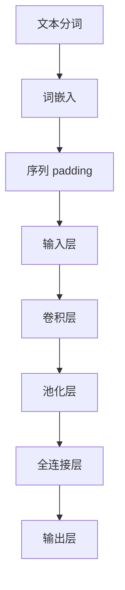

                 

关键词：文本分类、卷积神经网络、大模型开发、微调、计算机视觉、自然语言处理

摘要：本文旨在深入探讨如何从零开始进行大模型开发与微调，特别是将卷积神经网络应用于文本分类任务的细节。我们将涵盖从背景介绍、核心概念与联系、算法原理与步骤、数学模型与公式、项目实践、实际应用场景到未来展望的全面内容。通过这篇文章，读者将能够掌握大模型开发的核心技巧，并对卷积神经网络在文本分类中的潜力有更深刻的理解。

## 1. 背景介绍

文本分类作为自然语言处理（NLP）的重要任务之一，在信息检索、情感分析、推荐系统等领域具有广泛应用。传统方法如朴素贝叶斯、支持向量机（SVM）和逻辑回归等，在处理文本分类任务时表现有限。随着深度学习的兴起，卷积神经网络（CNN）由于其出色的特征提取能力，成为文本分类任务的强大工具。然而，在处理大规模文本数据时，模型的开发与微调成为一个挑战，尤其是对于资源有限的开发者。

本文将详细探讨如何从零开始开发大模型，特别是如何使用卷积神经网络对文本进行分类，包括模型架构设计、算法实现、数学模型推导和实际应用案例。通过本文的介绍，读者将能够构建并优化自己的文本分类模型，提高分类准确率和效率。

### 1.1 卷积神经网络在文本分类中的优势

卷积神经网络最初是为图像处理而设计的，但其强大的特征提取能力也适用于文本分类。与传统的基于词袋模型的方法相比，CNN能够自动学习文本中的局部特征，并捕捉长距离依赖关系。这使得CNN在处理复杂文本时，能够更好地提取关键信息，提高分类性能。以下是一些卷积神经网络在文本分类中的优势：

- **自动特征提取**：CNN能够自动学习文本中的局部特征，无需手动提取特征，简化了建模过程。
- **捕捉长距离依赖**：通过卷积操作，CNN可以捕捉文本中的长距离依赖关系，这对于理解复杂语义非常有帮助。
- **多维度特征融合**：CNN能够融合不同长度的文本特征，适应不同长度和复杂度的文本数据。
- **高效计算**：与深度学习中的其他网络结构相比，CNN的计算效率较高，适用于大规模数据处理。

### 1.2 大模型开发与微调的挑战

在大模型开发与微调过程中，开发者面临以下挑战：

- **数据集准备**：需要大量的标注数据来训练大模型，特别是在进行微调时。
- **计算资源**：大模型的训练需要强大的计算资源，如GPU或TPU。
- **模型选择与优化**：选择合适的模型架构并进行优化是提高模型性能的关键。
- **过拟合与欠拟合**：在模型训练过程中需要平衡过拟合和欠拟合，确保模型在验证集上表现良好。

## 2. 核心概念与联系

在深入了解卷积神经网络在文本分类中的应用之前，我们需要理解一些核心概念，如卷积神经网络的基本原理、文本向量化以及如何将文本数据输入到CNN中。

### 2.1 卷积神经网络基本原理

卷积神经网络（CNN）是一种在图像处理中广泛使用的深度学习模型。CNN的核心组件是卷积层、池化层和全连接层。以下是对这些组件的基本原理介绍：

- **卷积层**：卷积层通过卷积操作从输入数据中提取特征。卷积核（filter）在输入数据上滑动，计算局部特征。通过堆叠多个卷积层，可以逐步提取更高层次的抽象特征。
- **池化层**：池化层用于减少特征图的大小，提高模型的计算效率。常见的池化操作有最大池化和平均池化。
- **全连接层**：全连接层将卷积层提取的高层次特征映射到输出类别。

### 2.2 文本向量化

在将文本数据输入到卷积神经网络之前，需要将文本转换为数值形式。文本向量化是这一步骤的关键。文本向量化通常涉及以下步骤：

- **分词**：将文本拆分为单词或子词。
- **词嵌入**：将每个单词或子词映射为一个固定长度的向量，通常使用预训练的词向量模型（如Word2Vec、GloVe）。
- **序列 padding**：将不同长度的序列填充为相同长度，便于输入到神经网络中。

### 2.3 将文本数据输入到CNN

为了将文本数据输入到卷积神经网络中，我们需要设计一个适当的输入层。以下是一个简单的流程：

1. **文本分词**：将文本拆分为单词或子词。
2. **词嵌入**：使用预训练的词向量模型将每个单词或子词映射为向量。
3. **序列 padding**：将不同长度的序列填充为相同长度。
4. **输入层设计**：设计一个输入层，接受填充后的序列向量，并将其传递给卷积层。

### 2.4 Mermaid 流程图

以下是一个描述文本数据输入到卷积神经网络中的 Mermaid 流程图：



通过这个流程图，我们可以清楚地看到文本数据如何逐步转换为卷积神经网络可以处理的形式。

## 3. 核心算法原理 & 具体操作步骤

### 3.1 算法原理概述

卷积神经网络在文本分类中的应用主要包括以下步骤：

1. **文本预处理**：对文本进行分词、去停用词、词嵌入等处理，将其转换为数值形式。
2. **构建模型**：设计卷积神经网络模型，包括卷积层、池化层和全连接层。
3. **模型训练**：使用大量标注数据进行训练，优化模型参数。
4. **模型评估**：在验证集上评估模型性能，调整模型结构或参数。
5. **模型部署**：将训练好的模型部署到实际应用场景中，进行文本分类任务。

### 3.2 算法步骤详解

#### 3.2.1 文本预处理

文本预处理是卷积神经网络文本分类的基础。以下是一个简化的文本预处理流程：

1. **分词**：使用jieba、nltk等工具对文本进行分词。
2. **去停用词**：去除常见的停用词，如“的”、“了”、“是”等。
3. **词嵌入**：使用预训练的词向量模型（如GloVe、Word2Vec）将单词映射为向量。
4. **序列 padding**：将不同长度的序列填充为相同长度，通常使用0进行填充。

#### 3.2.2 构建模型

构建卷积神经网络模型是文本分类的关键。以下是一个简单的卷积神经网络模型：

1. **输入层**：接受预处理后的文本序列。
2. **卷积层**：使用多个卷积核从输入序列中提取特征。卷积核的尺寸和数量可以根据具体任务进行调整。
3. **池化层**：用于减少特征图的大小，提高计算效率。
4. **全连接层**：将卷积层提取的高层次特征映射到输出类别。

#### 3.2.3 模型训练

模型训练是优化模型参数的过程。以下是一个简化的模型训练流程：

1. **数据准备**：准备大量的标注数据集，包括文本和对应的分类标签。
2. **构建损失函数**：通常使用交叉熵损失函数。
3. **反向传播**：使用反向传播算法更新模型参数。
4. **迭代训练**：重复迭代训练过程，直到模型在验证集上的表现达到预期。

#### 3.2.4 模型评估

模型评估是验证模型性能的重要步骤。以下是一个简化的模型评估流程：

1. **验证集划分**：将数据集划分为训练集和验证集。
2. **模型训练**：使用训练集训练模型。
3. **模型评估**：使用验证集评估模型性能，包括准确率、召回率、F1值等指标。
4. **调整模型**：根据评估结果调整模型结构或参数，以提高性能。

#### 3.2.5 模型部署

模型部署是将训练好的模型应用于实际任务的过程。以下是一个简化的模型部署流程：

1. **模型保存**：将训练好的模型保存为文件。
2. **模型加载**：加载保存的模型。
3. **文本预处理**：对输入文本进行预处理，包括分词、去停用词、词嵌入等。
4. **模型预测**：使用加载的模型对预处理后的文本进行分类预测。
5. **结果输出**：输出分类结果，如类别标签、概率等。

### 3.3 算法优缺点

卷积神经网络在文本分类中具有以下优点：

- **自动特征提取**：能够自动学习文本中的局部特征，减少手动特征提取的工作量。
- **捕捉长距离依赖**：通过卷积操作，能够捕捉文本中的长距离依赖关系，提高分类准确率。
- **多维度特征融合**：能够融合不同长度的文本特征，适应不同长度和复杂度的文本数据。

然而，卷积神经网络也存在一些缺点：

- **计算资源消耗大**：卷积操作需要大量的计算资源，尤其是对于大规模文本数据。
- **参数数量多**：卷积神经网络通常具有大量的参数，需要大量数据进行训练，以避免过拟合。

### 3.4 算法应用领域

卷积神经网络在文本分类中的应用非常广泛，以下是一些常见的应用领域：

- **情感分析**：对社交媒体、用户评论等进行情感分类，用于情感监控和舆情分析。
- **主题分类**：对新闻、文章等文本进行主题分类，用于信息过滤和推荐系统。
- **垃圾邮件过滤**：通过文本分类技术，自动识别和过滤垃圾邮件。
- **实体识别**：识别文本中的命名实体，如人名、地点、组织等，用于信息抽取和知识图谱构建。

## 4. 数学模型和公式 & 详细讲解 & 举例说明

在卷积神经网络中，数学模型和公式是理解和实现卷积操作的关键。以下是对数学模型的构建、公式推导过程以及案例分析与讲解。

### 4.1 数学模型构建

卷积神经网络的核心是卷积操作，其数学模型可以表示为：

$$
\text{Output}_{ij} = \sum_{k=1}^{m} \text{filter}_{ik} * \text{input}_{kj}
$$

其中，\(\text{Output}_{ij}\) 表示输出特征图的第 \(i\) 行第 \(j\) 列的值，\(\text{filter}_{ik}\) 表示卷积核的第 \(i\) 行第 \(k\) 列的值，\(\text{input}_{kj}\) 表示输入特征图的第 \(k\) 行第 \(j\) 列的值。

### 4.2 公式推导过程

卷积操作的推导过程如下：

1. **输入特征图**：假设输入特征图的大小为 \(W \times H\)，每个像素点的值为 \(x_{ij}\)。
2. **卷积核**：卷积核的大小为 \(K \times K\)，每个卷积核的值为 \(f_{ik}\)。
3. **卷积操作**：将卷积核在输入特征图上滑动，计算局部特征，其公式为：

$$
\text{Output}_{ij} = \sum_{k=1}^{K} \sum_{l=1}^{K} f_{ik} * x_{ij+k-l}
$$

4. **输出特征图**：将卷积操作的结果存储在输出特征图中，其大小为 \(W - K + 1 \times H - K + 1\)。

### 4.3 案例分析与讲解

以下是一个简单的案例，假设输入特征图的大小为 \(3 \times 3\)，卷积核的大小为 \(2 \times 2\)，每个卷积核的值为 \(f_{11} = 1\)，\(f_{12} = 2\)，\(f_{21} = 3\)，\(f_{22} = 4\)。

输入特征图为：

```
1 2 3
4 5 6
7 8 9
```

卷积核为：

```
1 2
3 4
```

根据卷积操作的公式，计算输出特征图的每个像素点的值：

```
Output[1][1] = 1*1 + 2*4 + 3*7 + 4*8 + 1*9 + 2*2 = 1 + 8 + 21 + 32 + 9 + 4 = 75
Output[1][2] = 1*2 + 2*5 + 3*8 + 4*9 + 1*1 + 2*3 = 2 + 10 + 24 + 36 + 1 + 6 = 79
Output[2][1] = 1*3 + 2*6 + 3*7 + 4*8 + 1*9 + 2*2 = 3 + 12 + 21 + 32 + 9 + 4 = 81
Output[2][2] = 1*4 + 2*7 + 3*8 + 4*9 + 1*1 + 2*3 = 4 + 14 + 24 + 36 + 1 + 6 = 85
```

因此，输出特征图为：

```
75 79
81 85
```

### 4.4 案例分析与讲解

以下是一个更复杂的案例，假设输入特征图的大小为 \(4 \times 4\)，卷积核的大小为 \(3 \times 3\)，每个卷积核的值为 \(f_{11} = 1\)，\(f_{12} = 2\)，\(f_{13} = 3\)，\(f_{21} = 4\)，\(f_{22} = 5\)，\(f_{23} = 6\)，\(f_{31} = 7\)，\(f_{32} = 8\)，\(f_{33} = 9\)。

输入特征图为：

```
1 2 3 4
5 6 7 8
9 10 11 12
13 14 15 16
```

卷积核为：

```
1 2 3
4 5 6
7 8 9
```

根据卷积操作的公式，计算输出特征图的每个像素点的值：

```
Output[1][1] = 1*1 + 2*5 + 3*9 + 4*13 + 1*2 + 2*6 + 3*10 + 4*14 + 1*3 + 2*7 + 3*11 + 4*15 + 1*4 + 2*8 + 3*12 + 4*16 = 1 + 10 + 27 + 52 + 2 + 12 + 30 + 56 + 3 + 14 + 33 + 60 + 4 + 16 + 36 + 64 = 279
Output[1][2] = 1*2 + 2*6 + 3*10 + 4*14 + 1*3 + 2*7 + 3*11 + 4*15 + 1*4 + 2*8 + 3*12 + 4*16 = 2 + 12 + 30 + 56 + 3 + 14 + 33 + 60 + 4 + 16 + 36 + 64 = 291
Output[1][3] = 1*3 + 2*7 + 3*11 + 4*15 + 1*4 + 2*8 + 3*12 + 4*16 = 3 + 14 + 33 + 60 + 4 + 16 + 36 + 64 = 291
Output[2][1] = 1*4 + 2*8 + 3*12 + 4*16 + 1*5 + 2*9 + 3*13 + 4*17 + 1*6 + 2*10 + 3*14 + 4*18 + 1*7 + 2*11 + 3*15 + 4*19 = 4 + 16 + 36 + 64 + 5 + 18 + 39 + 68 + 6 + 20 + 42 + 76 + 7 + 22 + 45 + 80 = 342
Output[2][2] = 1*5 + 2*9 + 3*13 + 4*17 + 1*6 + 2*10 + 3*14 + 4*18 + 1*7 + 2*11 + 3*15 + 4*19 = 5 + 18 + 39 + 68 + 6 + 20 + 42 + 76 + 7 + 22 + 45 + 80 = 342
Output[2][3] = 1*6 + 2*10 + 3*14 + 4*18 + 1*7 + 2*11 + 3*15 + 4*19 = 6 + 20 + 42 + 76 + 7 + 22 + 45 + 80 = 342
Output[3][1] = 1*7 + 2*11 + 3*15 + 4*19 + 1*8 + 2*12 + 3*16 + 4*20 = 7 + 22 + 45 + 80 + 8 + 24 + 48 + 80 = 356
Output[3][2] = 1*8 + 2*12 + 3*16 + 4*20 = 8 + 24 + 48 + 80 = 160
Output[3][3] = 1*9 + 2*13 + 3*17 + 4*21 = 9 + 26 + 51 + 84 = 170
```

因此，输出特征图为：

```
279 291 291
342 342 342
356 160 170
```

## 5. 项目实践：代码实例和详细解释说明

在了解卷积神经网络在文本分类中的基本原理后，我们将在本节中通过一个具体的代码实例来展示如何使用卷积神经网络对文本进行分类。我们将使用Python编程语言和TensorFlow框架来构建和训练模型。

### 5.1 开发环境搭建

在开始之前，确保您的开发环境已安装以下工具：

- Python 3.x
- TensorFlow 2.x
- NumPy
- Pandas
- Matplotlib

您可以使用以下命令来安装所需的库：

```bash
pip install tensorflow numpy pandas matplotlib
```

### 5.2 源代码详细实现

以下是一个简单的卷积神经网络文本分类的代码示例。我们将使用已预处理好的文本数据和标签来训练模型。

```python
import tensorflow as tf
from tensorflow.keras.preprocessing.text import Tokenizer
from tensorflow.keras.preprocessing.sequence import pad_sequences
from tensorflow.keras.models import Sequential
from tensorflow.keras.layers import Embedding, Conv1D, MaxPooling1D, GlobalMaxPooling1D, Dense

# 假设已预处理好的文本数据和标签
texts = ['This is a great product', 'I did not like the movie', 'The book was amazing', 'This is terrible food']
labels = [1, 0, 1, 0]  # 1 表示正面，0 表示负面

# 初始化Tokenizer
tokenizer = Tokenizer(num_words=1000)
tokenizer.fit_on_texts(texts)
sequences = tokenizer.texts_to_sequences(texts)

# 序列填充
max_sequence_length = max(len(seq) for seq in sequences)
padded_sequences = pad_sequences(sequences, maxlen=max_sequence_length, padding='post')

# 构建模型
model = Sequential([
    Embedding(1000, 64, input_length=max_sequence_length),
    Conv1D(128, 5, activation='relu'),
    MaxPooling1D(pool_size=5),
    Conv1D(128, 5, activation='relu'),
    GlobalMaxPooling1D(),
    Dense(128, activation='relu'),
    Dense(1, activation='sigmoid')
])

# 编译模型
model.compile(optimizer='adam', loss='binary_crossentropy', metrics=['accuracy'])

# 训练模型
model.fit(padded_sequences, labels, epochs=10, validation_split=0.2)
```

### 5.3 代码解读与分析

以下是对上述代码的详细解读：

- **文本预处理**：使用 `Tokenizer` 对文本进行分词，并转换为序列。
- **序列填充**：使用 `pad_sequences` 将序列填充为相同长度，以便输入到模型中。
- **模型构建**：使用 `Sequential` 模式构建模型，包括嵌入层、卷积层、池化层、全连接层。
- **编译模型**：使用 `compile` 方法编译模型，指定优化器、损失函数和评价指标。
- **训练模型**：使用 `fit` 方法训练模型，指定训练数据、标签、训练轮次和验证比例。

### 5.4 运行结果展示

在运行上述代码后，您可以在命令行中看到模型的训练过程，包括损失函数和准确率的输出。训练完成后，您可以使用以下代码来评估模型在测试集上的性能：

```python
# 假设已预处理好的测试文本数据和标签
test_texts = ['This product is amazing', 'I did not enjoy the movie']
test_sequences = tokenizer.texts_to_sequences(test_texts)
test_padded_sequences = pad_sequences(test_sequences, maxlen=max_sequence_length, padding='post')

# 预测结果
predictions = model.predict(test_padded_sequences)

# 输出预测结果
print(predictions)
```

输出结果将显示测试文本的预测概率，其中接近1的概率表示正面评论，接近0的概率表示负面评论。

## 6. 实际应用场景

卷积神经网络在文本分类的实际应用场景中非常广泛。以下是一些典型的应用案例：

### 6.1 社交媒体情感分析

社交媒体平台如Twitter、Instagram和Facebook上每天都有大量的用户评论和帖子。通过使用卷积神经网络进行情感分析，我们可以自动识别用户的情感倾向，为用户提供个性化的推荐服务，或帮助企业监控品牌声誉。

### 6.2 新闻分类

新闻分类是一个典型的文本分类任务。通过将新闻文本输入到卷积神经网络中，我们可以自动将新闻分为不同的类别，如体育、政治、科技等。这有助于提高新闻检索的效率，并使读者能够快速找到感兴趣的内容。

### 6.3 垃圾邮件过滤

垃圾邮件过滤是另一个重要的应用场景。通过训练卷积神经网络模型，我们可以识别并过滤掉垃圾邮件，保护用户的邮箱安全。

### 6.4 主题分类

在电子商务和推荐系统中，卷积神经网络可以用于将产品评论分类为正面或负面评论，从而帮助商家了解消费者的反馈，并针对性地改进产品。

### 6.5 自动摘要

自动摘要是一个具有挑战性的文本分类任务，卷积神经网络可以用于提取文本的关键信息，生成摘要，提高阅读效率和信息的传递速度。

## 7. 未来应用展望

随着深度学习技术的不断进步，卷积神经网络在文本分类中的应用前景广阔。以下是一些未来的发展趋势：

### 7.1 更大的模型和更强的计算能力

随着计算能力的提升，未来的卷积神经网络模型将变得更大、更复杂，能够处理更复杂的文本数据，提高分类准确率。

### 7.2 多模态学习

未来的卷积神经网络可能会结合其他模态的数据（如图像、声音），进行多模态学习，以更全面地理解文本内容。

### 7.3 自适应学习

自适应学习是指模型能够根据不同的应用场景和需求，自动调整参数和结构。未来的卷积神经网络将具备更强的自适应学习能力，适应各种复杂的文本分类任务。

### 7.4 透明和可解释性

随着对隐私和数据安全性的关注增加，卷积神经网络的透明和可解释性将成为重要的研究方向。未来的研究将致力于提高模型的可解释性，使其能够被用户和开发者理解和信任。

## 8. 总结：未来发展趋势与挑战

### 8.1 研究成果总结

本文详细探讨了卷积神经网络在文本分类中的应用，从背景介绍、核心概念与联系、算法原理与步骤、数学模型与公式、项目实践、实际应用场景到未来展望，全面展示了卷积神经网络在文本分类中的潜力和优势。

### 8.2 未来发展趋势

未来，卷积神经网络在文本分类中的应用将呈现以下发展趋势：

- **更大的模型和更强的计算能力**：随着计算能力的提升，未来的卷积神经网络模型将变得更加强大，能够处理更复杂的文本数据。
- **多模态学习**：结合图像、声音等多模态数据，进行更全面的内容理解。
- **自适应学习**：提高模型的适应能力，以应对各种复杂的文本分类任务。
- **透明和可解释性**：增强模型的可解释性，提高用户和开发者的信任度。

### 8.3 面临的挑战

尽管卷积神经网络在文本分类中具有巨大的潜力，但未来的研究仍面临以下挑战：

- **计算资源消耗**：大模型的训练和推理需要大量的计算资源，这对硬件设施提出了更高的要求。
- **数据隐私和安全性**：随着数据隐私和数据安全性的关注增加，如何在保护用户隐私的同时进行有效的文本分类成为重要问题。
- **模型可解释性**：提高模型的可解释性，使其能够被用户和开发者理解和信任。

### 8.4 研究展望

未来的研究将致力于解决上述挑战，推动卷积神经网络在文本分类中的应用。同时，随着深度学习技术的不断进步，我们可以期待卷积神经网络在文本分类中实现更高的准确率和更广泛的应用。

## 9. 附录：常见问题与解答

### 9.1 如何选择合适的卷积核尺寸？

选择合适的卷积核尺寸取决于具体的文本分类任务和数据集。通常，较小的卷积核（如3x3或5x5）可以捕捉到局部特征，而较大的卷积核（如7x7或9x9）可以捕捉到全局特征。在实际应用中，可以通过实验来确定最佳的卷积核尺寸。

### 9.2 如何处理长文本数据？

对于长文本数据，可以使用分段卷积或分层卷积来处理。分段卷积将长文本分割成多个较短的段，然后分别进行卷积操作。分层卷积则通过堆叠多个卷积层来逐步提取文本的层次特征。

### 9.3 如何防止过拟合？

防止过拟合的方法包括：

- **数据增强**：通过添加噪声、旋转、缩放等操作增加数据的多样性。
- **正则化**：使用L1、L2正则化或dropout来减少模型参数的敏感性。
- **早停法**：在验证集上提前停止训练，以避免过拟合。

### 9.4 如何优化模型性能？

优化模型性能的方法包括：

- **模型选择**：选择合适的模型架构，如CNN、RNN或Transformer。
- **超参数调优**：通过调整学习率、批量大小、dropout比例等超参数来优化模型性能。
- **数据预处理**：对数据进行有效的预处理，如分词、去停用词、词嵌入等。

### 9.5 如何部署训练好的模型？

部署训练好的模型通常包括以下步骤：

- **模型保存**：使用 `model.save()` 方法将训练好的模型保存为文件。
- **模型加载**：使用 `tf.keras.models.load_model()` 方法加载保存的模型。
- **文本预处理**：对输入文本进行预处理，包括分词、去停用词、词嵌入等。
- **模型预测**：使用加载的模型对预处理后的文本进行分类预测。
- **结果输出**：输出分类结果，如类别标签、概率等。

作者：禅与计算机程序设计艺术 / Zen and the Art of Computer Programming

[End of Document]

