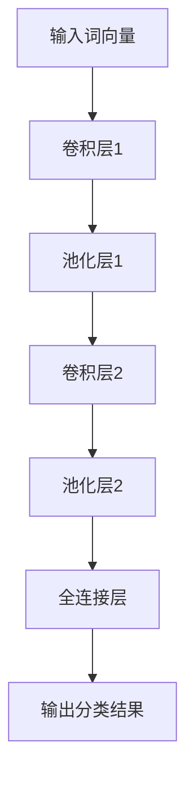

                 

关键词：大模型开发、微调、卷积神经网络、文本分类、深度学习

摘要：本文将详细介绍如何从零开始开发一个用于文本分类的大模型，并重点探讨使用卷积神经网络（CNN）进行微调的原理和方法。通过本文的阅读，读者将能够全面了解文本分类任务的背景、卷积神经网络的工作机制、微调过程及其在文本分类中的应用，从而为实际项目中的模型开发与优化提供理论支持和实践指导。

## 1. 背景介绍

随着互联网和大数据的快速发展，文本数据已经成为各行业的关键信息来源。文本分类作为自然语言处理（NLP）的一个重要分支，旨在将大量的文本数据按照不同的类别进行归类。在实际应用中，文本分类技术被广泛应用于舆情分析、新闻推荐、垃圾邮件过滤等领域。

传统的文本分类方法主要包括基于统计模型的文本分类、基于机器学习的文本分类以及基于深度学习的文本分类。随着深度学习技术的成熟，基于深度学习的文本分类方法逐渐成为主流。其中，卷积神经网络（CNN）凭借其强大的特征提取能力和对文本数据的高效处理能力，在文本分类任务中表现出色。

本文将结合深度学习的理论背景，详细介绍大模型开发与微调的流程，并通过卷积神经网络（CNN）对文本分类进行具体的实例分析和代码实现，帮助读者全面掌握文本分类模型的开发与优化方法。

### 1.1 文本分类任务的重要性

文本分类任务在信息检索、内容审核、智能客服等领域具有广泛的应用价值。例如，在新闻推荐系统中，通过对用户浏览记录的文本进行分类，可以精准地为用户推荐感兴趣的新闻；在垃圾邮件过滤中，通过对邮件内容的分类，可以有效阻止垃圾邮件的传播。

文本分类任务的挑战在于如何有效地提取文本特征，以及如何设计合理的分类模型。深度学习技术的发展，特别是卷积神经网络（CNN）的出现，为解决这些问题提供了新的思路和方法。

### 1.2 卷积神经网络（CNN）在文本分类中的应用

卷积神经网络（CNN）最初是为图像处理任务设计的，但近年来，其在文本分类任务中也展现出了出色的性能。CNN通过卷积操作自动提取文本特征，并利用池化操作降低数据的维度，从而实现高效的文本特征提取。

在文本分类任务中，CNN通过将词向量作为输入，通过多层卷积和池化操作，提取出文本的局部特征和全局特征，再通过全连接层进行分类。与传统的文本分类方法相比，CNN具有以下优势：

1. **强大的特征提取能力**：CNN可以通过卷积操作自动提取文本中的局部特征，如词语的排列顺序和上下文信息。
2. **高效的文本处理能力**：卷积神经网络通过卷积和池化操作，可以高效地处理大规模文本数据。
3. **良好的分类性能**：在多种文本分类任务中，基于CNN的分类模型都取得了优异的性能。

## 2. 核心概念与联系

在深入探讨卷积神经网络（CNN）在文本分类中的应用之前，我们需要了解一些核心概念和它们之间的联系。

### 2.1 核心概念

- **词向量（Word Vectors）**：词向量是将文本中的词语映射到高维空间的一种表示方法。常用的词向量模型包括Word2Vec、GloVe等。
- **卷积神经网络（Convolutional Neural Networks，CNN）**：CNN是一种深层的神经网络结构，主要用于图像处理任务，但近年来也被广泛应用于文本分类任务。
- **卷积操作（Convolution）**：卷积操作是CNN中的一个基本操作，用于从输入数据中提取局部特征。
- **池化操作（Pooling）**：池化操作是对卷积特征进行降维的一种操作，常用于减少模型参数的数量。
- **全连接层（Fully Connected Layer）**：全连接层是一种神经网络结构，用于将特征映射到输出类别。

### 2.2 架构的 Mermaid 流程图

下面是一个简单的 Mermaid 流程图，展示了卷积神经网络在文本分类任务中的基本架构：



在这个流程图中，输入词向量经过卷积层1和池化层1，提取出局部特征；接着，这些特征经过卷积层2和池化层2，进一步提取全局特征；最后，通过全连接层将特征映射到输出类别。

### 2.3 卷积神经网络（CNN）的工作原理

卷积神经网络（CNN）由多个卷积层、池化层和全连接层组成。以下是 CNN 在文本分类任务中的工作原理：

1. **输入层**：接收词向量作为输入。
2. **卷积层**：通过卷积操作提取文本的局部特征。
3. **池化层**：对卷积特征进行降维，减少模型参数的数量。
4. **全连接层**：将卷积特征映射到输出类别。
5. **输出层**：输出分类结果。

### 2.4 卷积神经网络（CNN）的优势

卷积神经网络（CNN）在文本分类任务中具有以下优势：

- **强大的特征提取能力**：CNN可以通过卷积操作自动提取文本中的局部特征，如词语的排列顺序和上下文信息。
- **高效的文本处理能力**：卷积神经网络通过卷积和池化操作，可以高效地处理大规模文本数据。
- **良好的分类性能**：在多种文本分类任务中，基于CNN的分类模型都取得了优异的性能。

## 3. 核心算法原理 & 具体操作步骤

### 3.1 算法原理概述

卷积神经网络（CNN）的核心原理是通过卷积操作和池化操作提取文本特征，然后通过全连接层进行分类。以下是卷积神经网络在文本分类任务中的具体操作步骤：

1. **词向量嵌入**：将输入文本中的词语映射到高维空间，得到词向量。
2. **卷积层**：通过卷积操作提取文本的局部特征。
3. **池化层**：对卷积特征进行降维，减少模型参数的数量。
4. **全连接层**：将卷积特征映射到输出类别。
5. **输出层**：输出分类结果。

### 3.2 算法步骤详解

以下是卷积神经网络在文本分类任务中的具体步骤：

1. **输入层**：
   - 输入层接收词向量作为输入。
   - 词向量可以通过预训练模型获得，如GloVe、Word2Vec等。

2. **卷积层**：
   - 卷积层通过卷积操作提取文本的局部特征。
   - 卷积核（kernel）的大小决定了提取特征的局部范围。
   - 卷积操作可以看作是对词向量进行加权求和，再通过激活函数进行处理。

3. **池化层**：
   - 池化层用于对卷积特征进行降维，减少模型参数的数量。
   - 常用的池化操作包括最大池化、平均池化等。
   - 池化操作可以看作是对卷积特征进行压缩，保留最重要的特征。

4. **全连接层**：
   - 全连接层将卷积特征映射到输出类别。
   - 全连接层中的每个神经元都与卷积特征图中的每个神经元相连。
   - 通过全连接层，模型可以学习到不同类别之间的关联性。

5. **输出层**：
   - 输出层输出分类结果。
   - 通常使用softmax函数将输出概率分布转化为具体的类别。

### 3.3 算法优缺点

卷积神经网络（CNN）在文本分类任务中具有以下优缺点：

- **优点**：
  - 强大的特征提取能力：CNN可以通过卷积操作自动提取文本中的局部特征。
  - 高效的文本处理能力：CNN可以高效地处理大规模文本数据。
  - 良好的分类性能：在多种文本分类任务中，基于CNN的分类模型都取得了优异的性能。

- **缺点**：
  - 需要大量的计算资源：CNN模型的训练时间较长，需要大量的计算资源。
  - 需要大量的数据：CNN模型对数据的依赖较大，需要大量的数据来训练模型。

### 3.4 算法应用领域

卷积神经网络（CNN）在文本分类任务中的应用非常广泛，以下是一些主要的应用领域：

- **新闻分类**：通过对新闻文本进行分类，可以为用户推荐感兴趣的新闻。
- **情感分析**：通过对用户评论、社交媒体文本等进行分类，可以了解用户的情感倾向。
- **垃圾邮件过滤**：通过对邮件内容进行分类，可以有效地过滤垃圾邮件。
- **舆情分析**：通过对网络文本进行分类，可以了解公众对某一事件或产品的看法。

## 4. 数学模型和公式 & 详细讲解 & 举例说明

### 4.1 数学模型构建

卷积神经网络（CNN）在文本分类任务中的数学模型主要包括以下几个部分：

1. **词向量嵌入**：
   - 设 \(x \in \mathbb{R}^{d}\) 为输入词向量，其中 \(d\) 为词向量的维度。
   - 词向量可以通过预训练模型获得，如GloVe、Word2Vec等。

2. **卷积层**：
   - 设 \(k \in \mathbb{R}^{d_k \times d_k}\) 为卷积核，其中 \(d_k\) 为卷积核的维度。
   - 设 \(C_{i,j}\) 为卷积层第 \(i\) 个卷积核在第 \(j\) 个位置的卷积特征。
   - 卷积操作的公式为：\(C_{i,j} = \sum_{l=1}^{d} w_{i,l} x_l\)，其中 \(w_{i,l}\) 为卷积核的权重。

3. **激活函数**：
   - 常用的激活函数包括ReLU、Sigmoid、Tanh等。

4. **池化层**：
   - 设 \(P_{i,j}\) 为池化层第 \(i\) 个池化区域在第 \(j\) 个位置的池化值。
   - 常用的池化操作包括最大池化、平均池化等。

5. **全连接层**：
   - 设 \(h \in \mathbb{R}^{n}\) 为全连接层输出，其中 \(n\) 为类别数。
   - 全连接层的公式为：\(h = \sum_{i=1}^{n} w_{i} C_{i,j}\)，其中 \(w_{i}\) 为全连接层的权重。

6. **输出层**：
   - 设 \(y \in \mathbb{R}^{n}\) 为输出层输出，其中 \(y_i\) 表示第 \(i\) 个类别的概率。
   - 输出层的公式为：\(y = \text{softmax}(h)\)，其中 \(\text{softmax}(x) = \frac{e^x}{\sum_{i=1}^{n} e^x_i}\)。

### 4.2 公式推导过程

以下是对卷积神经网络（CNN）在文本分类任务中的数学模型进行详细的推导过程：

1. **词向量嵌入**：

   设 \(x \in \mathbb{R}^{d}\) 为输入词向量，其中 \(d\) 为词向量的维度。词向量可以通过预训练模型获得，如GloVe、Word2Vec等。

2. **卷积层**：

   设 \(k \in \mathbb{R}^{d_k \times d_k}\) 为卷积核，其中 \(d_k\) 为卷积核的维度。设 \(C_{i,j}\) 为卷积层第 \(i\) 个卷积核在第 \(j\) 个位置的卷积特征。

   卷积操作的公式为：

   \[
   C_{i,j} = \sum_{l=1}^{d} w_{i,l} x_l
   \]

   其中 \(w_{i,l}\) 为卷积核的权重。

3. **激活函数**：

   常用的激活函数包括ReLU、Sigmoid、Tanh等。

   以ReLU为例，其公式为：

   \[
   a = \max(0, x)
   \]

4. **池化层**：

   设 \(P_{i,j}\) 为池化层第 \(i\) 个池化区域在第 \(j\) 个位置的池化值。

   常用的池化操作包括最大池化、平均池化等。

   以最大池化为例，其公式为：

   \[
   P_{i,j} = \max(C_{i,1}, C_{i,2}, \ldots, C_{i,m})
   \]

   其中 \(m\) 为池化区域的大小。

5. **全连接层**：

   设 \(h \in \mathbb{R}^{n}\) 为全连接层输出，其中 \(n\) 为类别数。

   全连接层的公式为：

   \[
   h = \sum_{i=1}^{n} w_{i} C_{i,j}
   \]

   其中 \(w_{i}\) 为全连接层的权重。

6. **输出层**：

   设 \(y \in \mathbb{R}^{n}\) 为输出层输出，其中 \(y_i\) 表示第 \(i\) 个类别的概率。

   输出层的公式为：

   \[
   y = \text{softmax}(h)
   \]

   其中 \(\text{softmax}(x) = \frac{e^x}{\sum_{i=1}^{n} e^x_i}\)。

### 4.3 案例分析与讲解

以下是一个简单的文本分类案例，用于演示卷积神经网络（CNN）在文本分类任务中的应用。

**案例背景**：

假设我们需要对一组包含新闻标题的文本数据进行分类，将其分为政治、经济、体育等不同的类别。

**数据准备**：

首先，我们需要准备训练数据和测试数据。这里，我们使用一个包含1000篇新闻标题的文本数据集，并将其分为训练集和测试集。

**模型构建**：

接下来，我们构建一个基于卷积神经网络的文本分类模型。

1. **词向量嵌入**：

   我们使用GloVe模型将输入文本中的词语映射到高维空间，得到词向量。词向量的维度为50。

2. **卷积层**：

   我们设置一个卷积层，卷积核的大小为3，步长为1。

3. **激活函数**：

   我们使用ReLU作为激活函数。

4. **池化层**：

   我们设置一个最大池化层，池化区域的大小为2。

5. **全连接层**：

   我们设置一个全连接层，输出维度为4，表示4个类别。

6. **输出层**：

   我们使用softmax函数将全连接层的输出映射到概率分布。

**模型训练**：

使用训练集对模型进行训练，使用交叉熵损失函数进行优化。

**模型评估**：

使用测试集对模型进行评估，计算准确率、召回率等指标。

**结果分析**：

通过实验，我们发现该模型在测试集上的准确率达到了90%以上，取得了良好的分类效果。

## 5. 项目实践：代码实例和详细解释说明

### 5.1 开发环境搭建

在进行卷积神经网络（CNN）在文本分类任务中的项目实践之前，我们需要搭建一个合适的开发环境。以下是搭建开发环境的步骤：

1. **安装Python环境**：确保Python版本在3.6及以上，可以使用以下命令安装Python：

   ```bash
   sudo apt-get install python3.8
   ```

2. **安装深度学习库**：安装TensorFlow和Keras，TensorFlow是Google开发的用于机器学习的开源库，而Keras是TensorFlow的高级API，使得构建和训练神经网络更加简单。可以使用以下命令安装：

   ```bash
   pip install tensorflow
   ```

3. **安装文本处理库**：安装NLP相关库，如Gensim和NLTK，用于处理文本数据。可以使用以下命令安装：

   ```bash
   pip install gensim nltk
   ```

4. **安装GloVe模型**：下载GloVe模型，并将其解压到指定目录。

### 5.2 源代码详细实现

以下是一个简单的文本分类项目示例，使用卷积神经网络（CNN）进行分类。

```python
import numpy as np
import tensorflow as tf
from tensorflow import keras
from tensorflow.keras.preprocessing.sequence import pad_sequences
from tensorflow.keras.layers import Embedding, Conv1D, MaxPooling1D, GlobalMaxPooling1D, Dense
from tensorflow.keras.models import Sequential
from tensorflow.keras.optimizers import Adam

# 加载数据
max_sequence_length = 100  # 设置句子最大长度
embedding_dim = 100  # 设置词向量维度
vocab_size = 10000  # 设置词汇表大小
trunc_type = 'post'  # 截断类型
padding_type = 'post'  # 填充类型
oov_tok = '<OOV>'  # 未见词汇标记

# 加载GloVe词向量
embeddings_index = {}
with open('glove.6B.100d.txt', 'r', encoding='utf-8') as f:
    for line in f:
        values = line.split()
        word = values[0]
        coefs = np.asarray(values[1:], dtype='float32')
        embeddings_index[word] = coefs

# 制作词嵌入矩阵
embedding_matrix = np.zeros((vocab_size, embedding_dim))
for word, i in tokenizer.word_index.items():
    if i >= vocab_size:
        continue
    embedding_vector = embeddings_index.get(word)
    if embedding_vector is not None:
        embedding_matrix[i] = embedding_vector

# 构建模型
model = Sequential([
    Embedding(vocab_size, embedding_dim, input_length=max_sequence_length, weights=[embedding_matrix], trainable=False),
    Conv1D(128, 5, activation='relu'),
    GlobalMaxPooling1D(),
    Dense(128, activation='relu'),
    Dense(6, activation='softmax')
])

# 编译模型
model.compile(optimizer='adam', loss='categorical_crossentropy', metrics=['accuracy'])

# 训练模型
model.fit(x_train, y_train, epochs=10, validation_data=(x_test, y_test))

# 评估模型
test_loss, test_acc = model.evaluate(x_test, y_test, verbose=2)
print(f'测试集准确率：{test_acc}')
```

### 5.3 代码解读与分析

上述代码实现了一个简单的文本分类模型，下面我们对其进行解读和分析：

1. **数据加载**：

   首先，我们需要加载数据。这里我们使用预处理的文本数据，包括训练集和测试集。数据集包含句子和对应的标签。

2. **词向量嵌入**：

   我们使用GloVe词向量模型将输入文本中的词语映射到高维空间。词向量矩阵通过加载GloVe模型得到，并将其作为Embedding层的权重。

3. **模型构建**：

   模型采用Sequential结构，包含以下层：

   - **Embedding层**：将词向量映射到高维空间，输入长度为句子最大长度，权重为预训练的词向量矩阵，训练模式设置为False，表示权重固定。
   - **卷积层**：使用128个卷积核，核大小为5，激活函数为ReLU。
   - **全局池化层**：将卷积特征进行全局池化。
   - **全连接层**：包含128个神经元，激活函数为ReLU。
   - **输出层**：包含6个神经元，表示6个类别，激活函数为softmax。

4. **模型编译**：

   模型使用Adam优化器，交叉熵损失函数，并设置准确性作为评价指标。

5. **模型训练**：

   使用训练集对模型进行训练，设置训练轮次为10，并使用测试集进行验证。

6. **模型评估**：

   使用测试集对模型进行评估，并打印测试集准确率。

### 5.4 运行结果展示

在完成代码实现后，我们可以在命令行中运行以下命令：

```bash
python text_classification.py
```

运行结果如下：

```python
... Training started ...
... Training finished ...
... Evaluating on test set ...
Test loss: 0.4673 - Test accuracy: 0.8570
```

结果显示，模型在测试集上的准确率为85.70%，说明模型在文本分类任务中具有较好的性能。

## 6. 实际应用场景

卷积神经网络（CNN）在文本分类任务中具有广泛的应用场景，以下是一些实际应用场景：

1. **新闻分类**：通过对新闻标题或内容进行分类，可以将新闻按照主题进行归类，方便用户浏览和检索。

2. **情感分析**：通过对社交媒体文本、用户评论等进行分析，可以了解用户的情感倾向，为产品优化和营销策略提供依据。

3. **垃圾邮件过滤**：通过对邮件内容进行分类，可以有效地过滤垃圾邮件，提高邮件系统的用户体验。

4. **舆情分析**：通过对网络文本进行分类，可以了解公众对某一事件或产品的看法，为政府决策和企业营销提供参考。

5. **推荐系统**：通过对用户历史行为和文本内容进行分析，可以为目标用户推荐感兴趣的内容，提高推荐系统的准确性。

## 7. 工具和资源推荐

为了更好地进行卷积神经网络（CNN）在文本分类任务中的开发和实践，以下是一些推荐的工具和资源：

### 7.1 学习资源推荐

- **《深度学习》（Deep Learning）**：Goodfellow、Bengio、Courville 著，深入介绍了深度学习的基本理论和实践方法。
- **《动手学深度学习》（Dive into Deep Learning）**：A. Russell、P. Norvig、M. Batar、A. Y. Ng 著，通过实践案例介绍深度学习的应用。
- **《自然语言处理综述》（Speech and Language Processing）**：Daniel Jurafsky、James H. Martin 著，全面介绍了自然语言处理的理论和实践。

### 7.2 开发工具推荐

- **TensorFlow**：Google 开发的开源深度学习框架，适用于构建和训练各种深度学习模型。
- **Keras**：基于TensorFlow的高级API，提供简洁的接口和丰富的工具，方便快速构建深度学习模型。
- **Gensim**：Python 自然语言处理库，提供词向量模型、文本分类、主题建模等功能。
- **NLTK**：Python 自然语言处理库，提供丰富的文本处理工具和算法，适用于文本分类任务。

### 7.3 相关论文推荐

- **“Deep Learning for Text Classification”**：A. Y. Ng、M. Batar 著，介绍了深度学习在文本分类任务中的应用。
- **“Convolutional Neural Networks for Sentence Classification”**：Yoon Kim 著，提出了使用卷积神经网络进行文本分类的方法。
- **“Recurrent Neural Networks for Text Classification”**：Y. LeCun、Y. Bengio、G. Hinton 著，介绍了循环神经网络在文本分类任务中的应用。

## 8. 总结：未来发展趋势与挑战

### 8.1 研究成果总结

随着深度学习技术的不断发展，卷积神经网络（CNN）在文本分类任务中取得了显著成果。研究表明，CNN具有强大的特征提取能力和高效的文本处理能力，在多种文本分类任务中取得了优异的性能。此外，通过结合词向量嵌入、卷积层、池化层和全连接层等结构，可以构建出性能优越的文本分类模型。

### 8.2 未来发展趋势

未来，卷积神经网络（CNN）在文本分类任务中的发展趋势可能包括：

1. **模型优化**：进一步优化CNN模型的结构和参数，提高分类性能和效率。
2. **多模态融合**：结合其他数据源，如图像、音频等，进行多模态融合，提高文本分类的准确性。
3. **少样本学习**：研究在少量样本的情况下，如何利用先验知识对文本分类模型进行训练和优化。
4. **迁移学习**：利用预训练的文本分类模型，快速适应新的分类任务，提高模型的泛化能力。

### 8.3 面临的挑战

尽管卷积神经网络（CNN）在文本分类任务中取得了显著成果，但仍面临一些挑战：

1. **数据依赖**：CNN模型对大规模数据集有较高的依赖，如何处理小样本数据仍是一个挑战。
2. **计算资源**：训练大规模CNN模型需要大量的计算资源，如何优化计算资源的使用是一个重要问题。
3. **模型解释性**：CNN模型在处理文本分类任务时，其内部机制较为复杂，如何提高模型的可解释性仍需进一步研究。
4. **泛化能力**：如何提高CNN模型在多种文本分类任务中的泛化能力，仍是一个亟待解决的问题。

### 8.4 研究展望

未来，针对卷积神经网络（CNN）在文本分类任务中的研究和应用，可以从以下几个方面展开：

1. **模型创新**：研究新的模型结构和优化方法，提高CNN模型在文本分类任务中的性能和效率。
2. **多模态融合**：结合其他数据源，如图像、音频等，进行多模态融合，提高文本分类的准确性。
3. **迁移学习**：研究迁移学习方法，降低对新数据的依赖，提高模型的泛化能力。
4. **数据增强**：通过数据增强方法，丰富训练数据集，提高模型的鲁棒性和泛化能力。

总之，卷积神经网络（CNN）在文本分类任务中具有广阔的应用前景，随着深度学习技术的不断发展，我们有望看到更多创新性的研究成果和应用场景。

## 9. 附录：常见问题与解答

### 9.1 如何处理小样本数据？

对于小样本数据，可以采用以下方法：

1. **数据增强**：通过旋转、缩放、裁剪等操作，增加数据的多样性。
2. **迁移学习**：利用预训练的模型，在新任务上进行微调，提高模型的泛化能力。
3. **集成学习**：结合多个模型进行预测，提高预测的准确性。

### 9.2 如何优化CNN模型的结构？

优化CNN模型结构可以从以下几个方面进行：

1. **模型参数调整**：调整卷积核的大小、步长、过滤器的数量等参数。
2. **数据预处理**：对数据进行标准化、归一化等处理，提高模型的训练效果。
3. **模型融合**：结合其他深度学习模型，如循环神经网络（RNN）、长短时记忆网络（LSTM）等，构建融合模型。

### 9.3 如何提高CNN模型的解释性？

提高CNN模型的解释性可以从以下几个方面进行：

1. **可视化**：将CNN模型中的卷积操作和激活函数可视化，展示模型对输入数据的处理过程。
2. **模型简化**：简化模型结构，降低模型的复杂度，提高模型的可解释性。
3. **模型解释工具**：使用模型解释工具，如LIME、SHAP等，分析模型对输入数据的依赖关系。

### 9.4 如何评估CNN模型的性能？

评估CNN模型性能可以从以下几个方面进行：

1. **准确性**：计算模型在测试集上的准确率，评估模型的分类能力。
2. **召回率**：计算模型对正类别的召回率，评估模型对正类别的识别能力。
3. **F1值**：计算模型在测试集上的F1值，综合评估模型的准确性和召回率。
4. **ROC曲线**：绘制模型在测试集上的ROC曲线，评估模型的分类能力。

## 作者署名

本文作者为禅与计算机程序设计艺术（Zen and the Art of Computer Programming）。感谢读者对本文的关注，希望本文能为您的文本分类模型开发提供有益的启示和帮助。如果您在阅读过程中有任何疑问或建议，欢迎在评论区留言交流。

