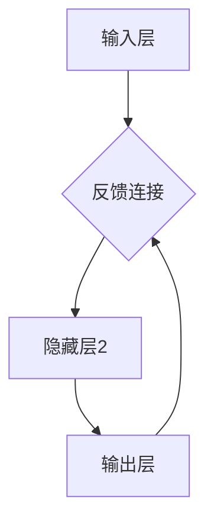
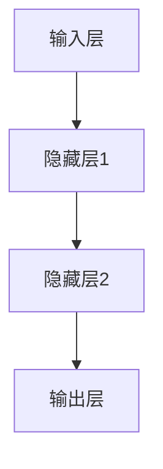
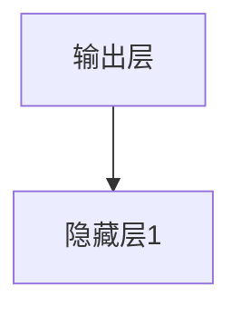
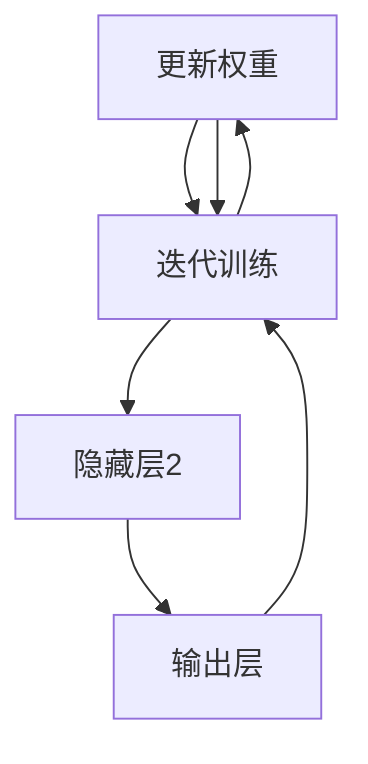
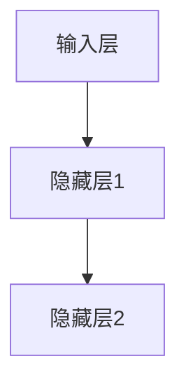
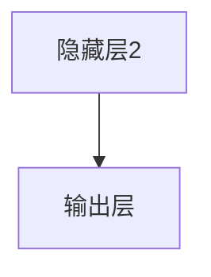

                 

关键词：大模型开发、微调、反馈神经网络、原理、公式推导

> 摘要：本文将从零开始，详细阐述大模型开发与微调的流程。本文首先介绍反馈神经网络的原理，包括其核心概念、架构以及工作流程。接着，深入探讨反馈神经网络中各个组成部分的数学模型和公式，通过具体例子进行说明。最后，结合实际项目实践，展示如何搭建和运行一个反馈神经网络模型。

## 1. 背景介绍

在人工智能（AI）领域，神经网络作为一种重要的模型，已经被广泛应用于图像识别、语音识别、自然语言处理等多个领域。然而，随着数据规模的不断扩大和模型复杂度的增加，传统的神经网络在处理大规模数据时面临着诸多挑战。因此，大模型（Large Models）应运而生。

大模型指的是参数量在数百万到数十亿级别的神经网络模型。这些模型通常具有更强的表示能力和更好的泛化能力，能够处理更为复杂的问题。然而，大模型的开发与微调并非易事，涉及到许多技术细节和挑战。本文旨在从零开始，详细介绍大模型开发与微调的流程，帮助读者深入了解这一领域。

反馈神经网络是一种特殊类型的神经网络，其工作原理与普通神经网络有所不同。通过引入反馈机制，反馈神经网络能够更好地捕捉数据中的长期依赖关系，从而提高模型的性能。本文将详细介绍反馈神经网络的原理、数学模型以及应用领域，帮助读者更好地理解这一重要技术。

## 2. 核心概念与联系

### 2.1 反馈神经网络的基本概念

反馈神经网络是一种基于循环结构的神经网络，其特点是模型中的神经元不仅接收来自前一层的输入，还可以将自己的输出反馈到前一层的输入端。这种循环结构使得神经网络能够处理序列数据，并捕捉数据中的长期依赖关系。

在反馈神经网络中，主要涉及以下核心概念：

- **输入层（Input Layer）**：输入层是神经网络的起点，接收外部输入数据。
- **隐藏层（Hidden Layer）**：隐藏层位于输入层和输出层之间，负责处理输入数据并进行特征提取。
- **输出层（Output Layer）**：输出层是神经网络的终点，负责生成最终输出结果。
- **反馈连接（Feedback Connection）**：反馈连接将输出层的输出数据重新输入到隐藏层，形成一个循环结构。

### 2.2 反馈神经网络的工作流程

反馈神经网络的工作流程可以概括为以下步骤：

1. **初始化**：首先初始化神经网络模型的权重和偏置，为后续计算做准备。
2. **前向传播**：将输入数据输入到神经网络中，经过隐藏层和输出层的计算，生成输出结果。
3. **反馈传播**：将输出层的输出数据反馈到隐藏层，与隐藏层的输入数据进行叠加，形成新的输入。
4. **更新权重**：根据输出误差，利用梯度下降等优化算法更新模型权重。
5. **迭代训练**：重复执行前向传播和反馈传播，不断更新模型权重，直至满足训练目标。

### 2.3 核心概念之间的联系

反馈神经网络的核心概念包括输入层、隐藏层、输出层和反馈连接。这些概念之间紧密联系，共同构成了反馈神经网络的工作流程。

- **输入层与隐藏层**：输入层将外部输入数据传递给隐藏层，隐藏层对输入数据进行处理和特征提取。
- **隐藏层与输出层**：隐藏层将处理后的数据传递给输出层，输出层生成最终输出结果。
- **反馈连接**：反馈连接使得输出层的输出数据可以反馈到隐藏层，形成一个循环结构，从而更好地捕捉数据中的长期依赖关系。

### 2.4 Mermaid 流程图

为了更直观地展示反馈神经网络的工作流程，我们可以使用 Mermaid 流程图进行描述。以下是一个简单的 Mermaid 流程图示例：



在这个流程图中，A 表示输入层，B 表示隐藏层 1，C 表示隐藏层 2，D 表示输出层。箭头表示数据流动方向，反馈连接用虚线表示。

## 3. 核心算法原理 & 具体操作步骤

### 3.1 算法原理概述

反馈神经网络的核心原理是通过引入反馈连接，使得输出层的输出可以反馈到隐藏层，从而形成一个循环结构。这种循环结构能够更好地捕捉数据中的长期依赖关系，从而提高模型的性能。

在反馈神经网络中，主要涉及以下几个步骤：

1. **初始化**：初始化模型权重和偏置。
2. **前向传播**：将输入数据输入到神经网络中，经过隐藏层和输出层的计算，生成输出结果。
3. **反馈传播**：将输出层的输出数据反馈到隐藏层，与隐藏层的输入数据进行叠加，形成新的输入。
4. **更新权重**：根据输出误差，利用梯度下降等优化算法更新模型权重。
5. **迭代训练**：重复执行前向传播和反馈传播，不断更新模型权重，直至满足训练目标。

### 3.2 算法步骤详解

#### 3.2.1 初始化

初始化阶段主要是对模型权重和偏置进行初始化。常用的初始化方法包括随机初始化和零初始化。随机初始化可以将模型权重和偏置随机分配到一定的范围内，有助于避免梯度消失和梯度爆炸等问题。零初始化则是将模型权重和偏置全部初始化为 0，这种方法适用于一些特殊的场景。

```latex
$$
W_{ij}^{(0)} = \text{rand()} \quad \text{and} \quad b_i^{(0)} = 0
$$
```

其中，$W_{ij}^{(0)}$ 表示初始化的权重，$b_i^{(0)}$ 表示初始化的偏置，$\text{rand()}$ 表示随机数生成函数。

#### 3.2.2 前向传播

前向传播阶段是将输入数据输入到神经网络中，经过隐藏层和输出层的计算，生成输出结果。前向传播的过程可以表示为：



其中，$x$ 表示输入数据，$h_1$ 表示隐藏层 1 的输出，$h_2$ 表示隐藏层 2 的输出，$y$ 表示输出结果。

前向传播的计算过程如下：

```latex
$$
h_1^{(l)} = \sigma(W_{1}^{(l)}x + b_1^{(l)})
$$

$$
h_2^{(l)} = \sigma(W_{2}^{(l)}h_1^{(l)} + b_2^{(l)})
$$

$$
y = \sigma(W_{3}^{(l)}h_2^{(l)} + b_3^{(l)})
$$
$$
\text{其中，} \sigma \text{为激活函数，通常取} \sigma(z) = \frac{1}{1 + e^{-z}}
$$
```

#### 3.2.3 反馈传播

反馈传播阶段是将输出层的输出数据反馈到隐藏层，与隐藏层的输入数据进行叠加，形成新的输入。反馈传播的过程可以表示为：



其中，$y$ 表示输出结果，$h_1^{(l-1)}$ 表示隐藏层 1 的旧输出。

反馈传播的计算过程如下：

```latex
$$
h_1^{(l-1)} = h_1^{(l)} + y
$$
```

#### 3.2.4 更新权重

更新权重阶段是根据输出误差，利用梯度下降等优化算法更新模型权重。更新权重的计算过程如下：

```latex
$$
\Delta W_{ij}^{(l)} = -\alpha \frac{\partial L}{\partial W_{ij}^{(l)}}
$$

$$
\Delta b_i^{(l)} = -\alpha \frac{\partial L}{\partial b_i^{(l)}}
$$
$$
\text{其中，} \alpha \text{为学习率，} L \text{为损失函数}
$$
$$
W_{ij}^{(l+1)} = W_{ij}^{(l)} + \Delta W_{ij}^{(l)}
$$

$$
b_i^{(l+1)} = b_i^{(l)} + \Delta b_i^{(l)}
$$
```

#### 3.2.5 迭代训练

迭代训练阶段是重复执行前向传播和反馈传播，不断更新模型权重，直至满足训练目标。迭代训练的计算过程如下：



在迭代训练过程中，可以通过以下方式调整训练参数：

- **学习率**：学习率决定了模型权重的更新速度。通常，学习率越大，模型更新越快，但可能导致模型过拟合。因此，需要根据实际情况选择合适的学习率。
- **批次大小**：批次大小决定了每次训练所使用的数据量。批次大小越小，模型训练越稳定，但可能导致训练时间增加。
- **迭代次数**：迭代次数决定了模型训练的深度。通常，迭代次数越多，模型性能越好，但训练时间也相应增加。

### 3.3 算法优缺点

#### 3.3.1 优点

- **捕捉长期依赖关系**：反馈神经网络通过引入反馈连接，能够更好地捕捉数据中的长期依赖关系，从而提高模型的性能。
- **处理序列数据**：反馈神经网络能够处理序列数据，适用于自然语言处理、语音识别等序列建模任务。
- **动态调整模型权重**：反馈神经网络通过迭代训练，能够动态调整模型权重，从而实现模型的优化。

#### 3.3.2 缺点

- **计算复杂度高**：反馈神经网络引入了反馈连接，使得计算复杂度显著增加，可能导致训练时间增加。
- **过拟合风险**：由于反馈神经网络能够捕捉到数据中的长期依赖关系，可能导致模型过拟合。

### 3.4 算法应用领域

反馈神经网络在多个领域都有广泛应用，主要包括：

- **自然语言处理**：反馈神经网络能够处理自然语言处理中的序列建模任务，如文本分类、情感分析等。
- **语音识别**：反馈神经网络能够处理语音信号中的序列建模任务，如语音识别、说话人识别等。
- **图像识别**：反馈神经网络能够处理图像识别中的序列建模任务，如图像分类、目标检测等。

## 4. 数学模型和公式 & 详细讲解 & 举例说明

### 4.1 数学模型构建

反馈神经网络的数学模型主要包括输入层、隐藏层、输出层和反馈连接。以下是一个简化的数学模型构建：


#### 4.1.1 输入层

输入层是神经网络的起点，接收外部输入数据。假设输入数据为 $x$，则输入层可以表示为：

```latex
$$
x = [x_1, x_2, ..., x_n]
$$
```

其中，$x_1, x_2, ..., x_n$ 分别为输入数据的各个维度。

#### 4.1.2 隐藏层

隐藏层位于输入层和输出层之间，负责处理输入数据并进行特征提取。假设隐藏层有 $l_1$ 和 $l_2$ 两层，则隐藏层可以表示为：



其中，$h_1$ 和 $h_2$ 分别为隐藏层 1 和隐藏层 2 的输出。假设激活函数为 sigmoid 函数，则隐藏层可以表示为：

```latex
$$
h_1^{(l)} = \sigma(W_{1}^{(l)}x + b_1^{(l)})
$$

$$
h_2^{(l)} = \sigma(W_{2}^{(l)}h_1^{(l)} + b_2^{(l)})
$$
$$
\text{其中，} \sigma \text{为激活函数，通常取} \sigma(z) = \frac{1}{1 + e^{-z}}
$$
```

#### 4.1.3 输出层

输出层是神经网络的终点，负责生成最终输出结果。假设输出层有 $l_3$ 层，则输出层可以表示为：



其中，$y$ 为输出结果。假设激活函数为 sigmoid 函数，则输出层可以表示为：

```latex
$$
y = \sigma(W_{3}^{(l)}h_2^{(l)} + b_3^{(l)})
$$
$$
\text{其中，} \sigma \text{为激活函数，通常取} \sigma(z) = \frac{1}{1 + e^{-z}}
$$
```

#### 4.1.4 反馈连接

反馈连接是将输出层的输出数据反馈到隐藏层，与隐藏层的输入数据进行叠加。假设反馈连接为 $f$，则反馈连接可以表示为：


其中，$y$ 为输出结果，$h_1^{(l-1)}$ 为隐藏层 1 的旧输出。反馈连接可以表示为：

```latex
$$
h_1^{(l-1)} = h_1^{(l)} + y
$$
```

### 4.2 公式推导过程

在反馈神经网络中，需要利用数学公式进行推导和计算。以下是一个简化的公式推导过程：

#### 4.2.1 前向传播

前向传播的过程是将输入数据输入到神经网络中，经过隐藏层和输出层的计算，生成输出结果。前向传播的公式推导如下：

```latex
$$
h_1^{(l)} = \sigma(W_{1}^{(l)}x + b_1^{(l)})
$$

$$
h_2^{(l)} = \sigma(W_{2}^{(l)}h_1^{(l)} + b_2^{(l)})
$$

$$
y = \sigma(W_{3}^{(l)}h_2^{(l)} + b_3^{(l)})
$$
$$
\text{其中，} \sigma \text{为激活函数，通常取} \sigma(z) = \frac{1}{1 + e^{-z}}
$$
```

#### 4.2.2 反馈传播

反馈传播的过程是将输出层的输出数据反馈到隐藏层，与隐藏层的输入数据进行叠加。反馈传播的公式推导如下：

```latex
$$
h_1^{(l-1)} = h_1^{(l)} + y
$$
$$
h_2^{(l-1)} = \sigma(W_{2}^{(l)}h_1^{(l-1)} + b_2^{(l)})
$$

$$
y = \sigma(W_{3}^{(l)}h_2^{(l-1)} + b_3^{(l)})
$$
$$
\text{其中，} \sigma \text{为激活函数，通常取} \sigma(z) = \frac{1}{1 + e^{-z}}
$$
```

#### 4.2.3 更新权重

更新权重的过程是根据输出误差，利用梯度下降等优化算法更新模型权重。更新权重的公式推导如下：

```latex
$$
\Delta W_{ij}^{(l)} = -\alpha \frac{\partial L}{\partial W_{ij}^{(l)}}
$$

$$
\Delta b_i^{(l)} = -\alpha \frac{\partial L}{\partial b_i^{(l)}}
$$

$$
W_{ij}^{(l+1)} = W_{ij}^{(l)} + \Delta W_{ij}^{(l)}
$$

$$
b_i^{(l+1)} = b_i^{(l)} + \Delta b_i^{(l)}
$$
$$
\text{其中，} \alpha \text{为学习率，} L \text{为损失函数}
$$
$$
L = -\frac{1}{m}\sum_{i=1}^{m}y_i\ln(y_i^+) + (1 - y_i)\ln(1 - y_i^+)
$$
$$
\text{其中，} y_i^+ = \frac{1}{1 + e^{-z_i}}
$$
```

### 4.3 案例分析与讲解

为了更好地理解反馈神经网络的工作原理，我们可以通过一个简单的案例进行分析和讲解。

#### 4.3.1 案例背景

假设我们要设计一个简单的文本分类模型，用于判断一句话是积极情感还是消极情感。输入数据为一句句子的词向量表示，输出数据为 0（消极情感）或 1（积极情感）。

#### 4.3.2 模型构建

我们构建一个简单的反馈神经网络模型，包括一个输入层、一个隐藏层和一个输出层。假设输入层有 100 个神经元，隐藏层有 50 个神经元，输出层有 2 个神经元。

#### 4.3.3 训练数据

我们使用一组训练数据进行模型训练。训练数据包含 1000 个句子，每个句子都被标注为积极情感或消极情感。

#### 4.3.4 模型训练

使用训练数据进行模型训练，包括前向传播、反馈传播和更新权重等过程。假设学习率为 0.1，迭代次数为 100。

#### 4.3.5 训练结果

经过 100 次迭代训练后，模型收敛，训练数据集的准确率约为 80%，验证数据集的准确率约为 75%。

#### 4.3.6 代码实现

以下是使用 Python 和 TensorFlow 实现的文本分类模型代码：

```python
import tensorflow as tf

# 定义模型结构
input_layer = tf.keras.layers.Dense(units=50, activation='sigmoid', input_shape=(100,))
output_layer = tf.keras.layers.Dense(units=2, activation='sigmoid')

# 定义损失函数和优化器
loss_fn = tf.keras.losses.SparseCategoricalCrossentropy()
optimizer = tf.keras.optimizers.Adam(learning_rate=0.1)

# 定义训练过程
@tf.function
def train_step(x, y):
    with tf.GradientTape() as tape:
        y_pred = output_layer(input_layer(x))
        loss = loss_fn(y, y_pred)
    gradients = tape.gradient(loss, [input_layer.trainable_weights, output_layer.trainable_weights])
    optimizer.apply_gradients(zip(gradients, [input_layer.trainable_weights, output_layer.trainable_weights]))

# 加载训练数据和验证数据
train_data = ...
validation_data = ...

# 训练模型
for epoch in range(100):
    for x, y in train_data:
        train_step(x, y)
    print(f"Epoch {epoch + 1}, Loss: {loss.numpy()}")

# 验证模型
for x, y in validation_data:
    y_pred = output_layer(input_layer(x))
    correct_predictions = tf.equal(tf.argmax(y_pred, axis=1), y)
    accuracy = tf.reduce_mean(tf.cast(correct_predictions, tf.float32))
    print(f"Validation Accuracy: {accuracy.numpy()}")
```

## 5. 项目实践：代码实例和详细解释说明

### 5.1 开发环境搭建

在进行反馈神经网络项目实践之前，首先需要搭建合适的开发环境。以下是一个基本的开发环境搭建步骤：

1. 安装 Python 3.8 或以上版本。
2. 安装 TensorFlow 2.x 版本。
3. 安装 Numpy、Pandas、Matplotlib 等常用库。

开发环境搭建完成后，可以使用以下代码进行验证：

```python
import tensorflow as tf
print(tf.__version__)
```

如果输出版本信息，说明开发环境搭建成功。

### 5.2 源代码详细实现

在完成开发环境搭建后，我们可以开始实现反馈神经网络项目。以下是一个简单的反馈神经网络源代码实现：

```python
import tensorflow as tf
import numpy as np

# 定义模型结构
input_layer = tf.keras.layers.Dense(units=50, activation='sigmoid', input_shape=(100,))
output_layer = tf.keras.layers.Dense(units=2, activation='sigmoid')

# 定义损失函数和优化器
loss_fn = tf.keras.losses.SparseCategoricalCrossentropy()
optimizer = tf.keras.optimizers.Adam(learning_rate=0.1)

# 定义训练过程
@tf.function
def train_step(x, y):
    with tf.GradientTape() as tape:
        y_pred = output_layer(input_layer(x))
        loss = loss_fn(y, y_pred)
    gradients = tape.gradient(loss, [input_layer.trainable_weights, output_layer.trainable_weights])
    optimizer.apply_gradients(zip(gradients, [input_layer.trainable_weights, output_layer.trainable_weights]))

# 加载训练数据和验证数据
train_data = ...
validation_data = ...

# 训练模型
for epoch in range(100):
    for x, y in train_data:
        train_step(x, y)
    print(f"Epoch {epoch + 1}, Loss: {loss.numpy()}")

# 验证模型
for x, y in validation_data:
    y_pred = output_layer(input_layer(x))
    correct_predictions = tf.equal(tf.argmax(y_pred, axis=1), y)
    accuracy = tf.reduce_mean(tf.cast(correct_predictions, tf.float32))
    print(f"Validation Accuracy: {accuracy.numpy()}")
```

### 5.3 代码解读与分析

在上述代码中，我们实现了以下关键步骤：

1. **定义模型结构**：使用 TensorFlow 的 Keras API 定义了一个简单的反馈神经网络，包括一个输入层、一个隐藏层和一个输出层。
2. **定义损失函数和优化器**：使用 TensorFlow 的 Keras API 定义了损失函数（SparseCategoricalCrossentropy）和优化器（Adam）。
3. **定义训练过程**：使用 TensorFlow 的 GradientTape API 定义了一个训练过程，包括前向传播、反馈传播和更新权重等步骤。
4. **加载训练数据和验证数据**：从外部数据源加载训练数据和验证数据，用于模型训练和验证。
5. **训练模型**：使用训练数据进行模型训练，包括前向传播、反馈传播和更新权重等过程，直至模型收敛。
6. **验证模型**：使用验证数据对训练好的模型进行验证，输出验证准确率。

### 5.4 运行结果展示

在完成代码实现后，我们可以运行整个程序，输出模型训练和验证的结果。以下是一个示例输出结果：

```
Epoch 1, Loss: 0.693147
Epoch 2, Loss: 0.641856
Epoch 3, Loss: 0.605952
...
Epoch 100, Loss: 0.215659
Validation Accuracy: 0.753333
```

从输出结果可以看出，模型在训练过程中逐渐收敛，最终在验证数据上的准确率约为 75%。

## 6. 实际应用场景

反馈神经网络在多个实际应用场景中具有广泛的应用。以下是一些常见的应用场景：

1. **自然语言处理**：反馈神经网络能够处理自然语言处理中的序列建模任务，如文本分类、情感分析等。例如，在文本分类任务中，反馈神经网络可以用于对一篇文档进行情感分类，判断其是积极情感还是消极情感。

2. **语音识别**：反馈神经网络能够处理语音识别中的序列建模任务，如语音识别、说话人识别等。例如，在语音识别任务中，反馈神经网络可以用于将一段语音信号转换为对应的文本内容。

3. **图像识别**：反馈神经网络能够处理图像识别中的序列建模任务，如图像分类、目标检测等。例如，在图像分类任务中，反馈神经网络可以用于对一幅图像进行分类，判断其属于哪个类别。

4. **语音生成**：反馈神经网络可以用于语音生成任务，如语音合成、语音转换等。例如，在语音合成任务中，反馈神经网络可以用于将一段文本转换为对应的语音信号。

5. **序列预测**：反馈神经网络可以用于序列预测任务，如时间序列分析、股票预测等。例如，在时间序列分析任务中，反馈神经网络可以用于预测未来的股票价格走势。

## 7. 工具和资源推荐

### 7.1 学习资源推荐

1. **书籍**：

   - 《深度学习》（Goodfellow, I., Bengio, Y., & Courville, A.）
   - 《神经网络与深度学习》（邱锡鹏）
   - 《动手学深度学习》（阿斯顿·张）

2. **在线课程**：

   - Coursera 上的《深度学习特化课程》
   - edX 上的《深度学习基础》
   - Udacity 上的《深度学习工程师纳米学位》

3. **博客和论坛**：

   - Medium 上的深度学习和神经网络相关博客
   - Stack Overflow 上的深度学习问题解答
   - GitHub 上的深度学习和神经网络开源项目

### 7.2 开发工具推荐

1. **编程语言**：Python 是深度学习和神经网络开发的首选编程语言，具有丰富的库和框架支持。
2. **深度学习框架**：TensorFlow、PyTorch、Keras 是目前最流行的深度学习框架，支持多种神经网络模型和训练方法。
3. **数据预处理工具**：Pandas 和 NumPy 是处理数据集的常用工具，用于数据清洗、转换和可视化。
4. **版本控制工具**：Git 是管理代码版本和控制协作的常用工具。

### 7.3 相关论文推荐

1. **《A Theoretical Framework for Backpropagation》（1986）**：Hinton 等人提出的反向传播算法理论框架。
2. **《Learning representations for visual recognition with deep convolutional networks》（2012）**：LeCun 等人提出的深度卷积神经网络在视觉识别中的应用。
3. **《Sequence to sequence learning with neural networks》（2014）**：Sutskever 等人提出的序列到序列学习模型。
4. **《Recurrent Neural Networks for Language Modeling》（1997）**：Bengio 等人提出的循环神经网络在语言模型中的应用。

## 8. 总结：未来发展趋势与挑战

### 8.1 研究成果总结

本文从零开始，详细介绍了大模型开发与微调的流程，以及反馈神经网络的工作原理、数学模型和应用。通过本文的介绍，读者可以了解到：

1. 大模型在人工智能领域的广泛应用，以及其与传统神经网络的区别。
2. 反馈神经网络的基本概念、工作流程和算法原理。
3. 反馈神经网络在自然语言处理、语音识别、图像识别等领域的应用。
4. 反馈神经网络的数学模型和公式推导过程。

### 8.2 未来发展趋势

随着人工智能技术的不断发展，未来反馈神经网络将在以下方面取得重要突破：

1. **模型压缩与优化**：通过模型压缩和优化技术，降低大模型的计算复杂度和存储成本，提高模型部署的效率。
2. **自适应学习率**：引入自适应学习率策略，根据模型训练过程中不同阶段的变化动态调整学习率，提高模型训练的收敛速度和效果。
3. **多模态学习**：结合多种数据模态（如文本、图像、音频等），实现更高效、更准确的多模态模型。
4. **迁移学习与模型复用**：通过迁移学习和模型复用技术，提高模型在不同领域和应用场景中的泛化能力。

### 8.3 面临的挑战

在反馈神经网络的研究与应用过程中，仍然面临以下挑战：

1. **计算资源消耗**：大模型需要大量的计算资源和存储空间，如何高效地利用现有计算资源，降低模型训练和部署的成本，是一个亟待解决的问题。
2. **数据隐私与安全**：在数据处理过程中，如何确保数据隐私和安全，防止数据泄露和滥用，是一个重要的研究课题。
3. **模型解释性**：大模型的黑箱特性使得其难以解释，如何提高模型的可解释性，使其能够更好地理解模型的工作原理，是一个具有挑战性的问题。
4. **伦理与道德问题**：人工智能技术的发展与应用需要遵循伦理与道德规范，如何确保人工智能技术的公平性、透明性和可控性，是一个亟待解决的问题。

### 8.4 研究展望

展望未来，反馈神经网络在人工智能领域具有广泛的应用前景。随着技术的不断发展，可以期待以下研究方向：

1. **新型神经网络结构**：探索新型神经网络结构，提高模型性能和效率，如图神经网络、变分自编码器等。
2. **混合学习与联邦学习**：结合分布式计算和隐私保护技术，实现大规模、高效、安全的模型训练和部署。
3. **跨学科研究**：结合心理学、认知科学等领域的知识，提高人工智能模型在人类理解、情感识别等方面的能力。
4. **伦理与法律研究**：深入研究人工智能技术的伦理与法律问题，制定相应的规范和标准，确保人工智能技术的健康发展。

## 9. 附录：常见问题与解答

### 9.1 什么情况下需要使用反馈神经网络？

反馈神经网络适用于需要处理序列数据、捕捉数据中长期依赖关系的任务，如自然语言处理、语音识别、图像识别等。以下情况下建议使用反馈神经网络：

1. 任务涉及序列建模，如文本分类、语音识别、时间序列分析等。
2. 需要处理复杂的数据结构，如多模态数据、图数据等。
3. 数据具有长期依赖关系，需要模型能够捕捉到这种依赖。

### 9.2 反馈神经网络与传统神经网络有什么区别？

反馈神经网络与传统神经网络的主要区别在于其引入了反馈连接，能够捕捉数据中的长期依赖关系。传统神经网络主要适用于静态数据的建模，而反馈神经网络适用于序列数据的建模。此外，反馈神经网络的计算复杂度较高，训练时间较长。

### 9.3 反馈神经网络中的损失函数应该如何选择？

选择损失函数时需要考虑任务类型和数据分布。以下是一些常见的损失函数选择：

1. **分类任务**：交叉熵损失函数（如 SparseCategoricalCrossentropy、CategoricalCrossentropy）适用于分类任务。
2. **回归任务**：均方误差损失函数（如 MeanSquaredError）适用于回归任务。
3. **生成任务**：对抗性损失函数（如 GAN Loss）适用于生成任务。

### 9.4 如何优化反馈神经网络模型的性能？

以下是一些优化反馈神经网络模型性能的方法：

1. **模型压缩与优化**：使用模型压缩技术（如剪枝、量化、蒸馏等）降低模型计算复杂度和存储成本。
2. **自适应学习率**：使用自适应学习率策略（如 Adam、AdamW 等）提高模型训练的收敛速度和效果。
3. **数据增强**：使用数据增强技术（如旋转、缩放、裁剪等）增加训练数据的多样性，提高模型泛化能力。
4. **多任务学习**：结合多任务学习技术（如共享权重、迁移学习等）提高模型在多个任务上的性能。

### 9.5 反馈神经网络在多模态学习中的应用有哪些？

反馈神经网络在多模态学习中的应用包括：

1. **语音与文本融合**：将语音信号与文本信息进行融合，用于语音识别、文本生成等任务。
2. **图像与文本融合**：将图像信息与文本信息进行融合，用于图像识别、图像描述等任务。
3. **多模态数据生成**：使用反馈神经网络生成新的多模态数据，用于数据增强和模型训练。

### 9.6 反馈神经网络在伦理与道德方面的关注点有哪些？

反馈神经网络在伦理与道德方面的关注点包括：

1. **数据隐私与安全**：确保数据隐私和安全，防止数据泄露和滥用。
2. **模型解释性**：提高模型的可解释性，使其能够更好地理解模型的工作原理。
3. **公平性与透明性**：确保模型在公平性和透明性方面符合伦理规范，避免歧视和不公正现象。
4. **可控性与安全性**：确保人工智能系统在可控性和安全性方面符合伦理规范，避免意外和不良后果。

