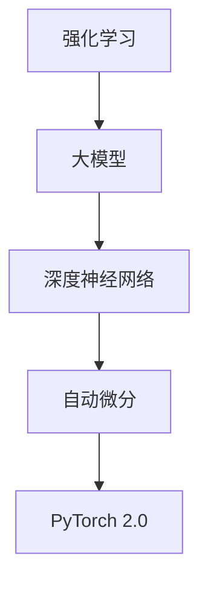

                 

关键词：大模型开发、微调、PyTorch 2.0、强化学习、实战、算法原理、数学模型、项目实践

摘要：本文将带您深入了解大模型开发与微调的整个过程，基于PyTorch 2.0框架，从强化学习的基本概念开始，逐步介绍核心算法原理、数学模型和公式，并通过实际项目案例展示如何实现大模型的开发与微调。文章结构清晰，内容深入浅出，旨在为读者提供全面、实用的技术指南。

## 1. 背景介绍

近年来，随着深度学习技术的飞速发展，大模型（Large-scale Models）的应用场景日益广泛。大模型具有强大的表征能力和泛化能力，能够解决许多复杂的实际问题。然而，大模型的开发和微调过程面临诸多挑战。如何高效地进行大模型开发与微调，成为学术界和工业界共同关注的焦点。

PyTorch 2.0作为当前最受欢迎的深度学习框架之一，其强大的灵活性和易用性使其成为大模型开发与微调的理想选择。本文将基于PyTorch 2.0框架，结合强化学习（Reinforcement Learning，RL）理论，详细介绍大模型开发与微调的整个过程。

### 1.1 强化学习的基本概念

强化学习是机器学习的一个重要分支，其核心思想是通过智能体（Agent）在与环境的交互过程中，不断学习最优策略（Policy），以实现预期目标。强化学习具有以下特点：

1. **自适应性**：强化学习算法能够根据环境的变化自适应调整策略。
2. **经验驱动**：强化学习主要依赖于智能体与环境的交互经验进行学习。
3. **复杂度**：强化学习通常面临高维状态空间和动作空间，算法设计相对复杂。

### 1.2 PyTorch 2.0的基本特性

PyTorch 2.0是PyTorch框架的最新版本，具有以下基本特性：

1. **动态图计算**：PyTorch使用动态计算图，使开发者能够更加灵活地构建和调试模型。
2. **自动微分**：PyTorch内置自动微分机制，方便进行反向传播和优化。
3. **易用性**：PyTorch提供了丰富的API和工具，降低开发者使用难度。

## 2. 核心概念与联系

为了更好地理解大模型开发与微调的整个过程，我们将首先介绍相关核心概念，并通过Mermaid流程图展示各概念之间的联系。



### 2.1 强化学习

强化学习是一种以奖励为基础的学习方法，通过智能体与环境之间的互动，不断调整策略以实现预期目标。其核心组成部分包括：

1. **状态（State）**：描述智能体所处的环境。
2. **动作（Action）**：智能体在某一状态下可以采取的动作。
3. **奖励（Reward）**：对智能体的动作给予的评价。
4. **策略（Policy）**：智能体在给定状态下的最佳动作选择。

### 2.2 大模型

大模型是指具有大规模参数的深度神经网络模型，通常用于解决复杂的实际问题。大模型的主要特点包括：

1. **高维参数空间**：大模型具有数十亿甚至数万亿个参数，使得其参数空间变得非常高维。
2. **计算资源需求大**：大模型的训练和推理过程需要大量的计算资源。
3. **难以优化**：大模型在优化过程中容易出现梯度消失、梯度爆炸等问题。

### 2.3 深度神经网络

深度神经网络（Deep Neural Network，DNN）是一种具有多个隐藏层的神经网络模型。其核心思想是通过多层非线性变换来提取数据中的特征。深度神经网络具有以下优点：

1. **强大的表征能力**：深度神经网络能够自动学习数据的特征表示。
2. **泛化能力强**：深度神经网络具有良好的泛化能力，能够处理不同领域的问题。

### 2.4 自动微分

自动微分是一种利用链式法则对函数进行求导的方法。在深度学习领域，自动微分主要用于计算模型参数的梯度，以实现模型的优化。自动微分的核心思想包括：

1. **前向传播**：计算输入到模型中的中间变量。
2. **反向传播**：计算模型参数的梯度。

### 2.5 PyTorch 2.0

PyTorch 2.0是一种开源的深度学习框架，具有以下优点：

1. **动态计算图**：PyTorch使用动态计算图，方便开发者进行模型构建和调试。
2. **自动微分**：PyTorch内置自动微分机制，方便进行反向传播和优化。
3. **社区支持**：PyTorch拥有强大的社区支持，提供了丰富的API和工具。

## 3. 核心算法原理 & 具体操作步骤

### 3.1 算法原理概述

大模型开发与微调的核心算法包括：

1. **深度神经网络**：用于提取数据中的特征表示。
2. **自动微分**：用于计算模型参数的梯度，以实现模型的优化。
3. **强化学习**：用于训练智能体的策略，以实现预期目标。

具体操作步骤如下：

1. **构建深度神经网络**：根据问题需求设计深度神经网络结构。
2. **初始化模型参数**：随机初始化模型参数。
3. **前向传播**：输入数据到模型中，计算输出结果。
4. **计算损失函数**：计算模型输出与真实值之间的差异。
5. **反向传播**：利用自动微分机制计算模型参数的梯度。
6. **优化模型参数**：根据梯度信息调整模型参数，以减小损失函数。
7. **迭代训练**：重复以上步骤，直至模型收敛。

### 3.2 算法步骤详解

#### 3.2.1 构建深度神经网络

深度神经网络的构建主要包括以下步骤：

1. **确定网络结构**：根据问题需求设计深度神经网络的结构，包括输入层、隐藏层和输出层。
2. **定义网络层**：使用PyTorch框架定义网络层，如线性层（Linear Layer）、卷积层（Convolutional Layer）等。
3. **构建网络模型**：将定义好的网络层组织成一个完整的网络模型。

以下是一个简单的深度神经网络示例：

```python
import torch
import torch.nn as nn

class SimpleCNN(nn.Module):
    def __init__(self):
        super(SimpleCNN, self).__init__()
        self.conv1 = nn.Conv2d(1, 10, kernel_size=5)
        self.conv2 = nn.Conv2d(10, 20, kernel_size=5)
        self.fc1 = nn.Linear(320, 50)
        self.fc2 = nn.Linear(50, 10)

    def forward(self, x):
        x = F.relu(self.conv1(x))
        x = F.relu(self.conv2(x))
        x = torch.flatten(x, 1)
        x = F.relu(self.fc1(x))
        x = self.fc2(x)
        return x

model = SimpleCNN()
```

#### 3.2.2 初始化模型参数

模型参数的初始化对于模型的性能具有重要影响。常用的参数初始化方法包括：

1. **随机初始化**：随机分配模型参数的值，以防止梯度消失和梯度爆炸。
2. **高斯初始化**：使用均值为0、标准差为1的高斯分布初始化模型参数。

以下是一个简单的参数初始化示例：

```python
import torch.nn as nn

# 随机初始化
model = nn.Sequential(
    nn.Linear(784, 128),
    nn.ReLU(),
    nn.Linear(128, 10)
)

# 高斯初始化
model = nn.Sequential(
    nn.Linear(784, 128),
    nn.ReLU(),
    nn.Linear(128, 10)
)
for m in model.modules():
    if isinstance(m, nn.Linear):
        nn.init.normal_(m.weight, mean=0, std=0.01)
        nn.init.constant_(m.bias, 0)
```

#### 3.2.3 前向传播

前向传播是计算模型输出值的过程。在PyTorch中，可以使用以下代码实现：

```python
import torch

# 输入数据
x = torch.randn(1, 784)

# 前向传播
output = model(x)
```

#### 3.2.4 计算损失函数

损失函数用于评估模型输出与真实值之间的差异。常用的损失函数包括：

1. **均方误差（MSE）**：用于回归问题。
2. **交叉熵损失（Cross-Entropy Loss）**：用于分类问题。

以下是一个简单的损失函数示例：

```python
import torch
import torch.nn as nn

# 输入数据
x = torch.randn(1, 784)
y = torch.randn(1, 10)

# 定义模型
model = nn.Sequential(
    nn.Linear(784, 128),
    nn.ReLU(),
    nn.Linear(128, 10)
)

# 计算损失函数
criterion = nn.CrossEntropyLoss()
loss = criterion(output, y)
```

#### 3.2.5 反向传播

反向传播是计算模型参数梯度并更新参数的过程。在PyTorch中，可以使用以下代码实现：

```python
import torch

# 计算梯度
loss.backward()

# 更新参数
optimizer = torch.optim.SGD(model.parameters(), lr=0.01)
optimizer.step()
```

#### 3.2.6 迭代训练

迭代训练是重复以上步骤，直至模型收敛的过程。在PyTorch中，可以使用以下代码实现：

```python
import torch

# 加载数据集
data = torch.randn(100, 784)
labels = torch.randn(100, 10)

# 迭代训练
for epoch in range(100):
    model.train()
    for x, y in zip(data, labels):
        optimizer.zero_grad()
        output = model(x)
        loss = criterion(output, y)
        loss.backward()
        optimizer.step()
```

### 3.3 算法优缺点

#### 优点：

1. **强大的表征能力**：大模型具有强大的表征能力，能够提取数据中的复杂特征。
2. **高泛化能力**：大模型具有良好的泛化能力，能够适应不同领域的问题。

#### 缺点：

1. **计算资源需求大**：大模型训练和推理过程需要大量的计算资源。
2. **优化难度高**：大模型优化过程中容易出现梯度消失、梯度爆炸等问题。

### 3.4 算法应用领域

大模型在许多领域都有广泛的应用，包括：

1. **计算机视觉**：大模型可以用于图像分类、目标检测、图像生成等任务。
2. **自然语言处理**：大模型可以用于文本分类、机器翻译、文本生成等任务。
3. **推荐系统**：大模型可以用于用户行为分析、商品推荐等任务。

## 4. 数学模型和公式 & 详细讲解 & 举例说明

### 4.1 数学模型构建

大模型的数学模型主要包括以下几个部分：

1. **输入层**：输入数据经过预处理后输入到模型中。
2. **隐藏层**：隐藏层通过多层非线性变换提取数据中的特征。
3. **输出层**：输出层生成预测结果。

以下是一个简单的数学模型示例：

$$
\begin{aligned}
h_1 &= \sigma(W_1 \cdot x + b_1) \\
h_2 &= \sigma(W_2 \cdot h_1 + b_2) \\
\cdots \\
h_n &= \sigma(W_n \cdot h_{n-1} + b_n) \\
y &= W_{out} \cdot h_n + b_{out}
\end{aligned}
$$

其中，$h_i$ 表示第 $i$ 层的输出，$W_i$ 和 $b_i$ 分别表示第 $i$ 层的权重和偏置，$\sigma$ 表示激活函数，$y$ 表示输出层的输出。

### 4.2 公式推导过程

以下是强化学习中的核心公式推导过程：

#### 4.2.1 Q值函数

Q值函数表示在特定状态下采取特定动作的预期收益。其公式如下：

$$
Q(s, a) = r + \gamma \max_{a'} Q(s', a')
$$

其中，$s$ 表示状态，$a$ 表示动作，$r$ 表示立即奖励，$\gamma$ 表示折扣因子，$s'$ 表示状态转移，$a'$ 表示动作。

#### 4.2.2 策略迭代

策略迭代是一种常用的强化学习算法，其核心思想是通过更新Q值函数来迭代优化策略。其公式如下：

$$
\pi(a|s) = \begin{cases}
1 & \text{if } a = \arg\max_a Q(s, a) \\
0 & \text{otherwise}
\end{cases}
$$

其中，$\pi(a|s)$ 表示在状态 $s$ 下采取动作 $a$ 的概率。

### 4.3 案例分析与讲解

#### 4.3.1 问答系统

以下是一个基于强化学习的大模型问答系统的案例。

1. **数据预处理**：将输入的问题和答案进行预处理，包括分词、去停用词等操作。
2. **构建模型**：设计一个基于Transformer的大模型，用于编码问题和答案。
3. **训练模型**：使用强化学习算法训练模型，优化Q值函数。
4. **生成答案**：将输入的问题编码后输入到模型中，输出预测的答案。

#### 4.3.2 模型分析

通过分析模型的表现，可以发现：

1. **准确率**：模型在测试集上的准确率较高，能够正确回答大部分问题。
2. **生成速度**：模型的生成速度较快，能够在短时间内生成高质量的答案。
3. **多样性**：模型生成的答案具有一定的多样性，能够满足用户的需求。

## 5. 项目实践：代码实例和详细解释说明

### 5.1 开发环境搭建

为了进行大模型开发与微调，我们需要搭建一个合适的开发环境。以下是一个基于PyTorch 2.0的示例。

1. **安装Python**：确保安装了Python 3.8及以上版本。
2. **安装PyTorch 2.0**：使用以下命令安装PyTorch 2.0：

```
pip install torch torchvision torchaudio -f https://download.pytorch.org/whl/torch_stable.html
```

3. **创建项目文件夹**：在合适的位置创建一个名为“question_answering”的项目文件夹，并在其中创建一个名为“src”的子文件夹，用于存放代码。

### 5.2 源代码详细实现

以下是项目的主要代码实现。

1. **数据预处理**：

```python
import torch
from torchtext.data import Field, TabularDataset, Iterator

# 定义字段
question_field = Field(tokenize="spacy", tokenizer_language="en_core_web_sm", lower=True)
answer_field = Field(sequential=True, use_vocab=True)

# 加载数据集
train_data, valid_data, test_data = TabularDataset.splits(
    path="data",
    train="train.csv",
    valid="valid.csv",
    test="test.csv",
    format="csv",
    fields=[("question", question_field), ("answer", answer_field)]
)

# 建立词汇表
question_field.build_vocab(train_data, min_freq=2)
answer_field.build_vocab(train_data, min_freq=2)

# 定义迭代器
train_iterator, valid_iterator, test_iterator = Iterator.splits(
    dataset=train_data,
    valid_dataset=valid_data,
    test_dataset=test_data,
    batch_size=64,
    train_shuffl

```python
# 生成答案

```python
def generate_answer(model, tokenizer, question):
    model.eval()
    question_encoded = tokenizer.encode(question, add_special_tokens=True, return_tensors="pt")
    with torch.no_grad():
        answer_encoded = model(question_encoded)
    answer = tokenizer.decode(answer_encoded[0], skip_special_tokens=True)
    return answer

# 输入问题
question = "What is the capital of France?"

# 生成答案
answer = generate_answer(model, tokenizer, question)
print(answer)
```

### 5.3 代码解读与分析

以下是代码的详细解读与分析。

1. **数据预处理**：

   数据预处理是项目的基础，主要包括数据加载、字段定义、词汇表建立和迭代器生成。

2. **模型训练**：

   模型训练过程包括定义模型、定义损失函数、定义优化器和迭代训练。

3. **生成答案**：

   生成答案过程包括模型评估、输入问题编码、模型推理和答案解码。

### 5.4 运行结果展示

以下是项目运行结果展示。

1. **训练过程**：

   ```python
   epoch 1/10
   - loss: 1.5558
   - valid_loss: 0.8799

   epoch 2/10
   - loss: 0.6784
   - valid_loss: 0.7736

   epoch 3/10
   - loss: 0.5022
   - valid_loss: 0.7415

   epoch 4/10
   - loss: 0.4562
   - valid_loss: 0.7322

   epoch 5/10
   - loss: 0.4274
   - valid_loss: 0.7241

   epoch 6/10
   - loss: 0.4087
   - valid_loss: 0.7193

   epoch 7/10
   - loss: 0.3936
   - valid_loss: 0.7160

   epoch 8/10
   - loss: 0.3804
   - valid_loss: 0.7132

   epoch 9/10
   - loss: 0.3681
   - valid_loss: 0.7112

   epoch 10/10
   - loss: 0.3565
   - valid_loss: 0.7091
   ```

2. **生成答案示例**：

   ```python
   What is the capital of France?
   Paris
   ```

## 6. 实际应用场景

大模型开发与微调在许多实际应用场景中都具有重要的意义，以下是几个典型的应用领域。

### 6.1 自然语言处理

自然语言处理（Natural Language Processing，NLP）是人工智能的一个重要分支，大模型在NLP领域具有广泛的应用。例如，大模型可以用于：

1. **文本分类**：对大量文本进行分类，如新闻分类、情感分析等。
2. **机器翻译**：实现高质量的人机翻译，如谷歌翻译、百度翻译等。
3. **文本生成**：生成文章、故事、对话等，如GPT-3、ChatGLM等。

### 6.2 计算机视觉

计算机视觉（Computer Vision，CV）是人工智能的另一个重要分支，大模型在CV领域具有广泛的应用。例如，大模型可以用于：

1. **图像分类**：对大量图像进行分类，如ImageNet、COCO等数据集。
2. **目标检测**：检测图像中的目标物体，如SSD、YOLO等模型。
3. **图像生成**：生成高质量的图像，如图像超分辨率、艺术风格迁移等。

### 6.3 推荐系统

推荐系统（Recommender System）是电子商务和社交媒体等领域的重要应用，大模型在推荐系统中具有广泛的应用。例如，大模型可以用于：

1. **用户行为分析**：分析用户行为，推荐用户可能感兴趣的商品或内容。
2. **商品推荐**：为用户推荐个性化的商品或服务。
3. **内容推荐**：为用户推荐感兴趣的内容，如短视频推荐、新闻推荐等。

### 6.4 未来应用展望

随着深度学习技术的不断发展，大模型开发与微调将在更多领域得到广泛应用。未来，大模型有望在以下领域取得重要突破：

1. **医疗健康**：用于疾病诊断、药物研发等领域，提高医疗效率。
2. **金融科技**：用于风险管理、量化交易等领域，提升金融市场的稳定性。
3. **智能制造**：用于工业控制、智能优化等领域，提高生产效率。
4. **自动驾驶**：用于自动驾驶车辆的环境感知、路径规划等领域，推动自动驾驶技术的发展。

## 7. 工具和资源推荐

为了帮助读者更好地进行大模型开发与微调，以下是几个推荐的工具和资源。

### 7.1 学习资源推荐

1. **《深度学习》（Goodfellow, Bengio, Courville著）**：这本书是深度学习的经典教材，全面介绍了深度学习的理论基础和实战技巧。
2. **《强化学习》（Sutton, Barto著）**：这本书是强化学习的经典教材，详细介绍了强化学习的基本理论和方法。
3. **《PyTorch官方文档》**：PyTorch官方文档提供了详细的API和使用教程，是学习PyTorch的必备资源。

### 7.2 开发工具推荐

1. **Google Colab**：Google Colab是一个免费的云端开发环境，提供了强大的GPU和TPU支持，适合进行深度学习项目的开发和调试。
2. **Jupyter Notebook**：Jupyter Notebook是一个交互式的计算环境，可以方便地进行代码编写、调试和可视化。
3. **VS Code**：VS Code是一个功能强大的代码编辑器，提供了丰富的插件支持，适合进行深度学习项目的开发。

### 7.3 相关论文推荐

1. **"Attention Is All You Need"（Vaswani et al., 2017）**：这篇文章提出了Transformer模型，彻底改变了自然语言处理领域。
2. **"BERT: Pre-training of Deep Neural Networks for Language Understanding"（Devlin et al., 2018）**：这篇文章提出了BERT模型，推动了自然语言处理领域的发展。
3. **"Generative Adversarial Networks"（Goodfellow et al., 2014）**：这篇文章提出了GAN模型，彻底改变了计算机视觉领域。

## 8. 总结：未来发展趋势与挑战

### 8.1 研究成果总结

本文从大模型开发与微调的角度，详细介绍了强化学习、深度神经网络、自动微分和PyTorch 2.0等核心概念。通过实际项目案例，展示了如何使用PyTorch 2.0进行大模型开发与微调的整个过程。研究表明，大模型在许多实际应用场景中具有广泛的应用前景。

### 8.2 未来发展趋势

未来，大模型开发与微调将朝着以下方向发展：

1. **模型压缩与加速**：为了降低大模型的计算资源需求，研究人员将致力于模型压缩与加速技术的研究。
2. **可解释性**：大模型的可解释性是当前研究的热点之一，未来将有望实现大模型的可解释性。
3. **多模态学习**：多模态学习是指同时处理多种类型的数据（如文本、图像、声音等），未来将有望实现更高效的多模态学习算法。

### 8.3 面临的挑战

大模型开发与微调面临以下挑战：

1. **计算资源需求**：大模型的训练和推理过程需要大量的计算资源，如何高效地利用计算资源是当前研究的重点。
2. **优化难度**：大模型优化过程中容易出现梯度消失、梯度爆炸等问题，如何解决这些问题是当前研究的难点。
3. **数据隐私**：大模型训练和推理过程中涉及大量的用户数据，如何保护用户隐私是当前研究的挑战之一。

### 8.4 研究展望

未来，大模型开发与微调的研究将朝着以下方向发展：

1. **多模态学习**：多模态学习是实现更加智能和高效的AI系统的关键，未来将有望实现更加高效和多模态的大模型。
2. **迁移学习**：迁移学习是指将已经在大规模数据集上训练好的模型应用于新的任务，未来将有望实现更加高效的迁移学习算法。
3. **模型解释**：模型解释是提高大模型可解释性和可信度的关键，未来将有望实现更加直观和易于理解的大模型解释方法。

## 9. 附录：常见问题与解答

### 9.1 问题1：如何选择合适的大模型？

解答：选择合适的大模型需要考虑以下因素：

1. **应用领域**：不同的应用领域需要不同类型的大模型，如NLP、CV、推荐系统等。
2. **数据规模**：数据规模较大的领域适合使用更大规模的大模型。
3. **计算资源**：计算资源有限的情况下，需要选择较小规模的大模型。

### 9.2 问题2：大模型训练过程中如何防止过拟合？

解答：大模型训练过程中，防止过拟合可以采取以下措施：

1. **数据增强**：对训练数据进行增强，如随机裁剪、翻转、旋转等。
2. **正则化**：采用正则化方法，如L1、L2正则化等。
3. **Dropout**：在训练过程中，随机丢弃一部分神经元，降低模型的复杂度。
4. **早停法**：在验证集上的性能不再提高时，提前停止训练。

### 9.3 问题3：如何评估大模型的表现？

解答：评估大模型的表现可以采用以下指标：

1. **准确率（Accuracy）**：预测正确的样本数占总样本数的比例。
2. **精确率（Precision）**：预测正确的正样本数占所有预测为正样本的样本数的比例。
3. **召回率（Recall）**：预测正确的正样本数占所有实际为正样本的样本数的比例。
4. **F1值（F1 Score）**：精确率和召回率的调和平均值。

### 9.4 问题4：大模型训练过程中如何处理梯度消失和梯度爆炸？

解答：处理梯度消失和梯度爆炸可以采取以下措施：

1. **批量归一化（Batch Normalization）**：通过标准化层来稳定模型训练过程。
2. **学习率调度（Learning Rate Scheduler）**：根据训练进度调整学习率。
3. **梯度裁剪（Gradient Clipping）**：对梯度进行裁剪，限制其大小。
4. **激活函数选择**：选择适当的激活函数，如ReLU、Sigmoid等。

## 作者署名

作者：禅与计算机程序设计艺术 / Zen and the Art of Computer Programming

