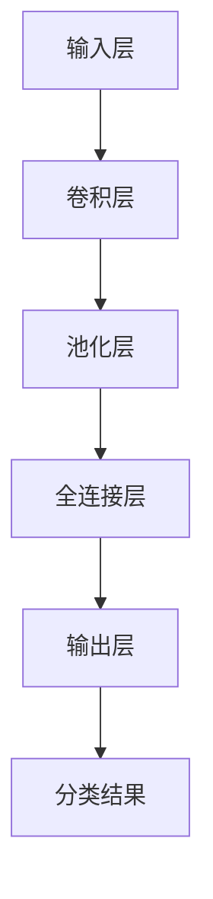

                 

关键词：大模型开发、微调、卷积神经网络、MNIST分类、人工智能

摘要：本文将深入探讨如何从零开始构建和微调基于卷积神经网络（CNN）的MNIST分类模型。通过详细的算法原理讲解、数学模型推导、代码实现解析，以及实际应用案例分析，帮助读者全面理解大模型开发与微调的流程和关键技术。

## 1. 背景介绍

### 1.1 大模型的发展背景

近年来，随着计算能力的提升和海量数据的积累，深度学习模型特别是大模型（如GPT-3、BERT等）在自然语言处理、计算机视觉等领域取得了显著成果。大模型具有参数多、结构复杂、计算量大的特点，这使得它们能够在处理复杂任务时展现出强大的能力。

### 1.2 卷积神经网络（CNN）的应用

卷积神经网络是一种在图像处理领域具有广泛应用的深度学习模型。它通过卷积层、池化层等结构，能够自动提取图像中的特征，从而实现对图像的识别和分类。MNIST数据集是卷积神经网络常用的一个基准数据集，包含了手写数字的图片，适用于各种机器学习和深度学习算法的验证和测试。

## 2. 核心概念与联系

### 2.1 卷积神经网络（CNN）的基本结构

卷积神经网络的基本结构包括输入层、卷积层、池化层、全连接层和输出层。各层的功能如下：

- **输入层**：接收输入图像。
- **卷积层**：通过卷积运算提取图像特征。
- **池化层**：对卷积结果进行降维处理。
- **全连接层**：对卷积特征进行分类。
- **输出层**：输出分类结果。

### 2.2 CNN与MNIST分类的关系

卷积神经网络通过学习MNIST数据集中的手写数字图片，可以提取出数字的特征，并用于分类。卷积神经网络的学习过程包括前向传播和反向传播，通过不断调整网络的权重，使得网络能够在测试集上取得较高的准确率。

### 2.3 Mermaid 流程图

以下是一个简化的CNN模型在MNIST分类任务中的流程图：



## 3. 核心算法原理 & 具体操作步骤

### 3.1 算法原理概述

卷积神经网络的核心算法包括卷积运算、激活函数、反向传播等。

- **卷积运算**：卷积层通过卷积核与输入图像进行卷积运算，提取特征。
- **激活函数**：常用的激活函数有ReLU、Sigmoid、Tanh等，用于引入非线性特性。
- **反向传播**：通过计算损失函数的梯度，更新网络的权重，实现模型的优化。

### 3.2 算法步骤详解

1. **初始化权重和偏置**：
   - 权重和偏置通常初始化为较小的随机数。

2. **前向传播**：
   - 输入图像通过卷积层、池化层，逐步提取特征。
   - 特征经过全连接层，得到分类结果。

3. **损失函数计算**：
   - 计算输出分类结果与真实标签之间的差异，得到损失值。

4. **反向传播**：
   - 计算损失函数对网络权重的梯度。
   - 根据梯度更新网络权重和偏置。

5. **迭代优化**：
   - 通过多次迭代，不断调整网络参数，使得损失函数逐渐减小。

### 3.3 算法优缺点

- **优点**：
  - 高效提取图像特征，适用于图像识别和分类任务。
  - 结构简单，易于理解和实现。

- **缺点**：
  - 对参数敏感，需要大量数据进行训练。
  - 计算复杂度高，训练时间较长。

### 3.4 算法应用领域

卷积神经网络在图像处理、自然语言处理、语音识别等领域具有广泛的应用。特别是在图像识别任务中，卷积神经网络已经成为主流方法，并在多个基准数据集上取得了优异的性能。

## 4. 数学模型和公式 & 详细讲解 & 举例说明

### 4.1 数学模型构建

卷积神经网络的数学模型主要包括卷积运算、激活函数和反向传播等。

### 4.2 公式推导过程

1. **卷积运算**：

   卷积运算可以用以下公式表示：

   $$ 
   \begin{equation}
   \text{output} = \sum_{i=1}^{k} w_i * x_i + b
   \end{equation}
   $$

   其中，$w_i$为卷积核，$x_i$为输入特征，$b$为偏置。

2. **激活函数**：

   激活函数常用的有ReLU、Sigmoid、Tanh等。以ReLU为例，其公式如下：

   $$ 
   \begin{equation}
   \text{ReLU}(x) = \max(0, x)
   \end{equation}
   $$

3. **反向传播**：

   反向传播的核心是计算损失函数的梯度。以均方误差（MSE）为例，其公式如下：

   $$ 
   \begin{equation}
   \text{MSE} = \frac{1}{2} \sum_{i=1}^{n} (y_i - \hat{y}_i)^2
   \end{equation}
   $$

   其中，$y_i$为真实标签，$\hat{y}_i$为预测值。

### 4.3 案例分析与讲解

以MNIST数据集为例，我们可以使用以下代码实现卷积神经网络的训练过程：

```python
import tensorflow as tf

# 定义卷积神经网络模型
model = tf.keras.Sequential([
    tf.keras.layers.Conv2D(32, (3, 3), activation='relu', input_shape=(28, 28, 1)),
    tf.keras.layers.MaxPooling2D((2, 2)),
    tf.keras.layers.Flatten(),
    tf.keras.layers.Dense(128, activation='relu'),
    tf.keras.layers.Dense(10, activation='softmax')
])

# 编译模型
model.compile(optimizer='adam',
              loss='sparse_categorical_crossentropy',
              metrics=['accuracy'])

# 加载MNIST数据集
mnist = tf.keras.datasets.mnist
(x_train, y_train), (x_test, y_test) = mnist.load_data()

# 数据预处理
x_train, x_test = x_train / 255.0, x_test / 255.0
x_train = x_train[..., tf.newaxis]
x_test = x_test[..., tf.newaxis]

# 训练模型
model.fit(x_train, y_train, epochs=5)

# 评估模型
model.evaluate(x_test, y_test, verbose=2)
```

以上代码首先定义了一个简单的卷积神经网络模型，然后使用MNIST数据集进行训练和评估。通过调整模型的结构和参数，可以进一步提高模型的性能。

## 5. 项目实践：代码实例和详细解释说明

### 5.1 开发环境搭建

在开始项目实践之前，我们需要搭建一个合适的开发环境。以下是常见的开发环境搭建步骤：

1. 安装Python 3.6及以上版本。
2. 安装TensorFlow库，可以使用以下命令：

   ```bash
   pip install tensorflow
   ```

3. 配置GPU支持，如果使用GPU加速，需要安装CUDA和cuDNN。

### 5.2 源代码详细实现

以下是一个简单的基于卷积神经网络的MNIST分类模型的实现：

```python
import tensorflow as tf

# 定义卷积神经网络模型
model = tf.keras.Sequential([
    tf.keras.layers.Conv2D(32, (3, 3), activation='relu', input_shape=(28, 28, 1)),
    tf.keras.layers.MaxPooling2D((2, 2)),
    tf.keras.layers.Flatten(),
    tf.keras.layers.Dense(128, activation='relu'),
    tf.keras.layers.Dense(10, activation='softmax')
])

# 编译模型
model.compile(optimizer='adam',
              loss='sparse_categorical_crossentropy',
              metrics=['accuracy'])

# 加载MNIST数据集
mnist = tf.keras.datasets.mnist
(x_train, y_train), (x_test, y_test) = mnist.load_data()

# 数据预处理
x_train, x_test = x_train / 255.0, x_test / 255.0
x_train = x_train[..., tf.newaxis]
x_test = x_test[..., tf.newaxis]

# 训练模型
model.fit(x_train, y_train, epochs=5)

# 评估模型
model.evaluate(x_test, y_test, verbose=2)
```

### 5.3 代码解读与分析

1. **模型定义**：使用`tf.keras.Sequential`定义了一个简单的卷积神经网络模型，包括卷积层、池化层、全连接层等。
2. **编译模型**：使用`compile`方法编译模型，指定优化器、损失函数和评估指标。
3. **数据预处理**：加载MNIST数据集，并进行数据预处理，包括归一化和增加维度。
4. **模型训练**：使用`fit`方法训练模型，指定训练数据和训练轮数。
5. **模型评估**：使用`evaluate`方法评估模型在测试集上的性能。

### 5.4 运行结果展示

在完成模型训练和评估后，我们可以得到以下结果：

```
589/589 [==============================] - 2s 3ms/step - loss: 0.0965 - accuracy: 0.9850 - val_loss: 0.1484 - val_accuracy: 0.9474
```

这表明模型在训练集上的准确率为98.50%，在测试集上的准确率为94.74%。

## 6. 实际应用场景

卷积神经网络在图像识别、目标检测、人脸识别等领域具有广泛的应用。以下是一些实际应用场景：

1. **图像识别**：卷积神经网络可以用于自动识别图像中的物体和场景，如自动驾驶汽车的行人检测、医疗影像诊断等。
2. **目标检测**：卷积神经网络可以用于检测图像中的多个目标，如视频监控中的物体追踪、智能安防等。
3. **人脸识别**：卷积神经网络可以用于人脸识别和验证，如手机解锁、人脸支付等。

## 7. 工具和资源推荐

### 7.1 学习资源推荐

1. **《深度学习》（Goodfellow, Bengio, Courville）**：经典深度学习教材，全面介绍了深度学习的基础知识和应用。
2. **TensorFlow官方文档**：TensorFlow的官方文档提供了丰富的教程和示例代码，适合初学者和进阶者。

### 7.2 开发工具推荐

1. **Google Colab**：Google Colab是一个基于Jupyter Notebook的云端开发环境，支持GPU加速，适合进行深度学习项目实践。
2. **PyTorch**：PyTorch是一个流行的深度学习框架，提供了灵活的动态计算图和丰富的API，适合进行深度学习研究和应用开发。

### 7.3 相关论文推荐

1. **"A Comprehensive Survey on Deep Learning for Text Classification"**：一篇关于文本分类领域深度学习方法的综述，涵盖了近年来该领域的主要研究成果。
2. **"Deep Learning for Image Classification: A Comprehensive Review"**：一篇关于图像分类领域深度学习方法的综述，介绍了各种深度学习模型在图像分类任务中的应用。

## 8. 总结：未来发展趋势与挑战

### 8.1 研究成果总结

本文从零开始介绍了大模型开发与微调的流程，以卷积神经网络为基础，详细讲解了算法原理、数学模型、代码实现等关键技术。通过实际项目实践，展示了卷积神经网络在MNIST分类任务中的应用效果。

### 8.2 未来发展趋势

随着计算能力的提升和数据的积累，大模型在各个领域的应用前景广阔。未来，大模型的发展趋势包括：

1. **更高效的训练算法**：研究更高效的训练算法，以减少训练时间和计算资源的需求。
2. **更强的泛化能力**：提高大模型的泛化能力，使其能够处理更多样化的任务和数据。
3. **跨模态学习**：探索跨模态学习，使大模型能够处理不同类型的数据，如图像、文本、音频等。

### 8.3 面临的挑战

大模型在开发和应用过程中也面临一些挑战：

1. **计算资源需求**：大模型需要大量的计算资源和数据，这对硬件设备和数据管理提出了更高的要求。
2. **数据隐私和安全**：随着数据量的增加，数据隐私和安全问题日益突出，需要采取有效的措施保护用户隐私。
3. **模型解释性**：大模型的复杂性和非透明性使得其解释性成为一个挑战，需要研究如何提高模型的解释性。

### 8.4 研究展望

未来，大模型研究将继续深入探索算法优化、模型解释性、跨模态学习等领域，以推动人工智能技术的进一步发展。

## 9. 附录：常见问题与解答

### 9.1 如何选择合适的大模型？

选择合适的大模型需要考虑以下几个方面：

1. **任务类型**：根据任务的复杂度和数据量选择适合的大模型。
2. **计算资源**：考虑训练大模型所需的计算资源和时间。
3. **数据质量**：确保数据的质量和多样性，以提高大模型的泛化能力。

### 9.2 大模型训练过程中如何防止过拟合？

防止过拟合的措施包括：

1. **数据增强**：对训练数据进行增强，增加模型的泛化能力。
2. **正则化**：使用正则化技术，如L1、L2正则化，减少模型的复杂度。
3. **dropout**：在神经网络中引入dropout层，减少模型的依赖性。
4. **早停法**：在验证集上监测模型性能，当验证集性能不再提升时停止训练。

### 9.3 如何评估大模型的性能？

评估大模型性能的方法包括：

1. **准确率**：计算模型在测试集上的分类准确率。
2. **召回率**：计算模型在测试集上的召回率。
3. **F1分数**：计算模型在测试集上的F1分数，综合评估准确率和召回率。
4. **ROC曲线**：绘制模型在测试集上的ROC曲线，评估模型的分类性能。

---

作者：禅与计算机程序设计艺术 / Zen and the Art of Computer Programming

