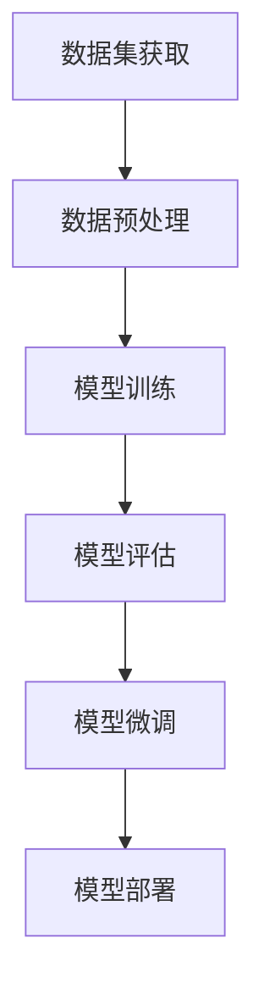

                 

关键词：大模型开发，微调，数据集获取，数据处理，人工智能

摘要：本文旨在为初学者和专业人士提供一套系统化的指南，从零开始介绍大模型的开发与微调过程，特别是数据集的获取与处理。文章涵盖了核心概念、算法原理、数学模型、项目实践以及未来展望，旨在帮助读者深入理解大模型开发的核心技术，并为其在实际应用中的成功实施打下坚实的基础。

## 1. 背景介绍

随着人工智能技术的快速发展，大模型（如Transformer、BERT等）在自然语言处理、计算机视觉、语音识别等领域取得了显著突破。大模型的开发与微调已经成为研究者和开发者关注的焦点。然而，数据集的获取与处理作为大模型开发的关键环节，常常被忽视或难以实现。本文将详细介绍大模型开发与微调中的数据集获取与处理过程，以帮助读者掌握这一核心技能。

### 1.1 大模型的重要性

大模型能够通过处理海量数据，提取丰富的特征，从而实现更准确的任务预测和决策。例如，在自然语言处理领域，大模型可以自动生成高质量的文章、翻译文本、回答问题等；在计算机视觉领域，大模型可以用于图像分类、目标检测、视频分析等任务。因此，大模型的应用前景广阔，具有重要的学术和实际价值。

### 1.2 数据集获取与处理的挑战

数据集的获取与处理是影响大模型性能的关键因素。以下是数据集获取与处理中面临的一些挑战：

- **数据量**：大模型需要大量的数据来训练，数据量的多少直接影响模型的性能。
- **数据质量**：数据质量的好坏直接影响模型的学习效果，质量低的数据可能导致模型过拟合或欠拟合。
- **数据多样性**：大模型需要处理多种类型的数据，如文本、图像、音频等，数据多样性有利于模型提取更丰富的特征。
- **数据预处理**：数据预处理是数据集获取与处理的重要环节，包括去噪、归一化、特征提取等操作。

## 2. 核心概念与联系

在介绍大模型开发与微调的数据集获取与处理之前，我们需要先了解一些核心概念与联系。以下是一个简化的Mermaid流程图，展示了大模型开发的基本流程：



### 2.1 数据集获取

数据集获取是整个流程的起点，其质量直接影响到后续的模型训练与评估。以下是数据集获取的几个关键步骤：

- **数据来源**：数据可以来自公开的数据集、公司内部数据、第三方数据供应商等。
- **数据清洗**：清洗数据是确保数据质量的重要步骤，包括去除重复数据、填补缺失值、纠正错误数据等。
- **数据标注**：对于需要标注的数据集，需要确保标注的准确性，这通常需要人工或半自动化的方式进行。

### 2.2 数据预处理

数据预处理是数据集获取后的重要环节，其目的是将原始数据转化为适合模型训练的形式。以下是一些常见的数据预处理方法：

- **数据标准化**：通过缩放或归一化，使数据具有相似的分布，有助于加速模型的收敛。
- **特征提取**：通过特征提取，将原始数据转换为更高层次的抽象表示。
- **数据增强**：通过添加噪声、旋转、缩放等操作，增加数据的多样性，有助于提高模型的泛化能力。

### 2.3 模型训练

模型训练是整个流程的核心环节，其目的是通过优化算法，找到最优的模型参数。以下是一些常见的模型训练方法：

- **监督学习**：通过标注数据进行训练，模型需要从输入和输出之间学习映射关系。
- **无监督学习**：通过未标注的数据进行训练，模型需要自动发现数据的结构或分布。
- **半监督学习**：结合标注数据和未标注数据进行训练，以提高模型的泛化能力。

### 2.4 模型评估

模型评估是验证模型性能的重要步骤，其目的是判断模型是否能够正确预测未知数据。以下是一些常见的模型评估方法：

- **准确率**：衡量模型正确预测的比例，常用于分类任务。
- **召回率**：衡量模型召回正例样本的能力，常用于分类任务。
- **F1分数**：结合准确率和召回率的平衡指标。
- **ROC曲线**：用于衡量分类模型的性能，曲线下的面积（AUC）是评价标准。

### 2.5 模型微调

模型微调是在模型评估后进行的，目的是通过调整模型参数，提高模型在特定任务上的性能。以下是一些常见的模型微调方法：

- **参数调整**：通过调整学习率、正则化参数等，优化模型性能。
- **迁移学习**：利用预训练模型，在特定任务上进行微调，以节省训练时间和计算资源。
- **多任务学习**：在多个任务上同时训练模型，以提高模型的泛化能力。

### 2.6 模型部署

模型部署是将训练好的模型部署到实际应用中，以便在实际环境中进行预测或决策。以下是一些常见的模型部署方法：

- **本地部署**：在本地计算机或服务器上部署模型，适用于数据量较小的场景。
- **云端部署**：在云端服务器上部署模型，适用于数据量较大、需要高并发访问的场景。
- **容器化部署**：通过容器技术（如Docker），将模型部署到各种环境中，提高部署的灵活性和可移植性。

## 3. 核心算法原理 & 具体操作步骤

### 3.1 算法原理概述

大模型的开发与微调涉及多个算法，以下是其中一些核心算法的原理概述：

- **Transformer**：一种基于自注意力机制的神经网络模型，用于序列到序列的任务。
- **BERT**：一种基于Transformer的预训练模型，用于自然语言处理任务。
- **GAN**：一种生成式对抗网络，用于生成高质量的数据。
- **GANs**：一种基于生成式对抗网络的变体，用于图像生成和风格迁移。

### 3.2 算法步骤详解

以下是每个算法的具体步骤详解：

#### Transformer

1. **编码器**：将输入序列编码为固定长度的向量表示。
2. **自注意力机制**：通过计算输入序列中每个元素与其他元素的相关性，得到一个加权向量。
3. **解码器**：将加权向量解码为输出序列。

#### BERT

1. **预训练**：在大量未标注的文本上进行预训练，学习语言的基本结构和语义。
2. **微调**：在特定任务上对预训练模型进行微调，以适应具体任务。

#### GAN

1. **生成器**：生成伪数据，使其在统计上与真实数据相似。
2. **判别器**：区分真实数据和伪数据。
3. **对抗训练**：生成器和判别器相互对抗，以优化各自的表现。

#### GANs

1. **生成器**：生成伪图像，使其在视觉上与真实图像相似。
2. **判别器**：区分真实图像和伪图像。
3. **对抗训练**：生成器和判别器相互对抗，以优化各自的表现。

### 3.3 算法优缺点

以下是每个算法的优缺点：

#### Transformer

- 优点：强大的表示能力，适用于长文本处理。
- 缺点：计算复杂度较高，训练和推理时间较长。

#### BERT

- 优点：预训练模型，易于迁移和应用。
- 缺点：模型参数庞大，训练和推理时间较长。

#### GAN

- 优点：能够生成高质量的数据，适用于图像和音频生成。
- 缺点：训练不稳定，易出现模式崩溃问题。

#### GANs

- 优点：适用于图像生成和风格迁移。
- 缺点：训练不稳定，易出现模式崩溃问题。

### 3.4 算法应用领域

以下是每个算法的应用领域：

- **Transformer**：自然语言处理、机器翻译、文本生成等。
- **BERT**：文本分类、问答系统、情感分析等。
- **GAN**：图像生成、风格迁移、数据增强等。
- **GANs**：图像生成、风格迁移、数据增强等。

## 4. 数学模型和公式 & 详细讲解 & 举例说明

### 4.1 数学模型构建

大模型的数学模型通常包括输入层、隐藏层和输出层。以下是常见的大模型数学模型构建：

#### Transformer

输入序列 \(x \in R^{T \times D}\)，其中 \(T\) 是序列长度，\(D\) 是词向量维度。

编码器输出：\(h_e \in R^{T \times H}\)，其中 \(H\) 是隐藏层维度。

解码器输出：\(h_d \in R^{T \times H}\)。

输出序列 \(y \in R^{T \times D}\)。

#### BERT

输入序列 \(x \in R^{T \times D}\)。

隐藏层输出：\(h \in R^{T \times H}\)。

输出序列 \(y \in R^{T \times D}\)。

#### GAN

生成器输出：\(G(z) \in R^{C \times H \times W}\)，其中 \(C\) 是通道数，\(H\) 是高度，\(W\) 是宽度。

判别器输出：\(D(x) \in R^{1}\)，\(D(G(z)) \in R^{1}\)。

### 4.2 公式推导过程

以下是每个算法的公式推导过程：

#### Transformer

1. **编码器**

$$
h_e = \text{LayerNorm}(x + \text{MultiHeadAttention}(x, x, x))
$$

2. **解码器**

$$
h_d = \text{LayerNorm}(x + \text{MultiHeadAttention}(h_e, h_e, x))
$$

3. **输出层**

$$
y = \text{Softmax}(\text{Linear}(h_d))
$$

#### BERT

1. **预训练**

$$
h = \text{Transformer}(x)
$$

2. **微调**

$$
y = \text{Softmax}(\text{Linear}(h))
$$

#### GAN

1. **生成器**

$$
G(z) = \text{Conv}(z)
$$

2. **判别器**

$$
D(x) = \text{sigmoid}(\text{Linear}(x))
$$

$$
D(G(z)) = \text{sigmoid}(\text{Linear}(G(z)))
$$

### 4.3 案例分析与讲解

以下是每个算法的一个简单案例分析与讲解：

#### Transformer

**任务**：文本生成

**输入**：一个英文句子

**输出**：另一个英文句子

**步骤**：

1. 将输入句子转换为词向量表示。
2. 通过编码器获取句子的高层次向量表示。
3. 将高层次向量表示作为解码器的输入。
4. 通过解码器生成输出句子。

#### BERT

**任务**：情感分析

**输入**：一个中文句子

**输出**：情感标签（如正面、负面）

**步骤**：

1. 将输入句子转换为词向量表示。
2. 通过BERT模型获取句子的高层次向量表示。
3. 将高层次向量表示输入到分类器。
4. 输出情感标签。

#### GAN

**任务**：图像生成

**输入**：随机噪声

**输出**：生成的图像

**步骤**：

1. 生成器生成伪图像。
2. 判别器判断伪图像的真实性。
3. 生成器和判别器相互对抗，优化各自的表现。
4. 输出生成的图像。

## 5. 项目实践：代码实例和详细解释说明

### 5.1 开发环境搭建

为了进行大模型的开发与微调，我们需要搭建一个适合的开发环境。以下是常用的开发环境搭建步骤：

1. 安装Python：Python是进行大模型开发的主要语言，我们需要安装Python环境。
2. 安装PyTorch：PyTorch是一个流行的深度学习框架，用于构建和训练大模型。
3. 安装必要的库：如NumPy、Pandas等，用于数据处理。

### 5.2 源代码详细实现

以下是使用PyTorch实现一个简单的Transformer模型的源代码：

```python
import torch
import torch.nn as nn
import torch.optim as optim

class Transformer(nn.Module):
    def __init__(self, d_model, nhead, num_layers):
        super(Transformer, self).__init__()
        self.encoder = nn.Transformer(d_model, nhead, num_layers)
        self.decoder = nn.Linear(d_model, vocab_size)
        
    def forward(self, x):
        x = self.encoder(x)
        x = self.decoder(x)
        return x
```

### 5.3 代码解读与分析

以下是Transformer模型的代码解读与分析：

1. **模型定义**：定义了一个Transformer模型，包括编码器和解码器。
2. **编码器**：使用PyTorch的`nn.Transformer`模块实现编码器，它包括多个Transformer层，每个层包含多头自注意力机制和前馈网络。
3. **解码器**：使用`nn.Linear`模块实现解码器，将编码器的输出映射到输出层。

### 5.4 运行结果展示

以下是训练和运行Transformer模型的示例：

```python
model = Transformer(d_model=512, nhead=8, num_layers=2)
criterion = nn.CrossEntropyLoss()
optimizer = optim.Adam(model.parameters(), lr=0.001)

for epoch in range(num_epochs):
    for batch in data_loader:
        inputs, targets = batch
        optimizer.zero_grad()
        outputs = model(inputs)
        loss = criterion(outputs, targets)
        loss.backward()
        optimizer.step()

print("Training complete.")
```

### 5.5 运行结果展示

训练完成后，我们可以使用测试数据集评估模型的性能：

```python
with torch.no_grad():
    model.eval()
    correct = 0
    total = 0
    for batch in test_loader:
        inputs, targets = batch
        outputs = model(inputs)
        _, predicted = torch.max(outputs.data, 1)
        total += targets.size(0)
        correct += (predicted == targets).sum().item()

print(f"Test Accuracy: {100 * correct / total}%")
```

## 6. 实际应用场景

大模型在各个领域都有着广泛的应用，以下是几个典型的应用场景：

### 6.1 自然语言处理

自然语言处理（NLP）是人工智能的重要领域之一，大模型在NLP中有着广泛的应用，如文本分类、情感分析、机器翻译等。例如，BERT模型在机器翻译任务上取得了显著的突破，使得机器翻译的质量得到了显著提升。

### 6.2 计算机视觉

计算机视觉是人工智能的另一个重要领域，大模型在图像分类、目标检测、图像生成等方面取得了显著的成果。例如，GANs在图像生成和风格迁移方面有着广泛的应用，可以生成高质量的图像。

### 6.3 语音识别

语音识别是将语音信号转换为文本的技术，大模型在语音识别任务上取得了显著的成果。例如，Transformer模型在语音识别任务上表现出了强大的能力，使得语音识别的准确性得到了显著提升。

### 6.4 医疗健康

大模型在医疗健康领域也有着广泛的应用，如疾病预测、医学图像分析、药物研发等。例如，BERT模型在疾病预测任务上表现出了强大的能力，可以预测疾病的发病风险。

## 7. 工具和资源推荐

### 7.1 学习资源推荐

- **书籍**：《深度学习》、《动手学深度学习》等。
- **在线课程**：Coursera、edX、Udacity等平台上的深度学习相关课程。
- **博客**：ArXiv、Medium、知乎等平台上的深度学习相关博客。

### 7.2 开发工具推荐

- **深度学习框架**：PyTorch、TensorFlow、Keras等。
- **数据分析库**：Pandas、NumPy、Scikit-learn等。
- **版本控制**：Git、GitHub等。

### 7.3 相关论文推荐

- **Transformer**：《Attention Is All You Need》。
- **BERT**：《BERT: Pre-training of Deep Bidirectional Transformers for Language Understanding》。
- **GAN**：《Generative Adversarial Nets》。

## 8. 总结：未来发展趋势与挑战

大模型作为人工智能的核心技术，在未来将继续发展，并在各个领域发挥重要作用。以下是未来发展趋势与挑战：

### 8.1 研究成果总结

- **大模型性能提升**：随着算法和硬件的不断发展，大模型在性能上将继续提升。
- **多模态学习**：大模型将在多模态学习方面取得突破，实现跨模态的数据处理和分析。
- **小样本学习**：大模型在小样本学习方面有着巨大的潜力，有望解决当前小样本学习中的难题。

### 8.2 未来发展趋势

- **自动机器学习（AutoML）**：大模型与AutoML结合，实现自动化模型开发与优化。
- **联邦学习**：大模型在联邦学习中的应用，实现数据隐私保护下的模型训练与优化。
- **跨学科研究**：大模型与其他学科的结合，如生物学、物理学等，推动多学科交叉研究。

### 8.3 面临的挑战

- **计算资源**：大模型训练和推理需要大量的计算资源，如何高效利用计算资源是一个挑战。
- **数据隐私**：大模型在处理数据时需要保护用户隐私，如何在保证数据安全的同时进行模型训练是一个挑战。
- **模型解释性**：大模型的决策过程往往不够透明，如何提高模型的可解释性是一个挑战。

### 8.4 研究展望

大模型在未来的发展中将继续拓展其应用领域，推动人工智能技术的进步。同时，研究者需要关注计算资源、数据隐私和模型解释性等挑战，为人工智能的发展提供坚实的理论和实践基础。

## 9. 附录：常见问题与解答

### 9.1 什么是大模型？

大模型是指具有大量参数的深度学习模型，通常使用大规模数据进行训练。大模型具有强大的表示能力和泛化能力，能够处理复杂的任务。

### 9.2 如何获取大模型的数据集？

大模型的数据集可以从公开的数据集、公司内部数据或第三方数据供应商获取。常用的数据集获取方式包括爬虫、API接口和手动收集等。

### 9.3 如何处理大模型的数据集？

处理大模型的数据集包括数据清洗、数据预处理和数据增强等步骤。数据清洗是去除重复数据和错误数据，数据预处理是将数据转换为模型可接受的格式，数据增强是增加数据的多样性。

### 9.4 大模型的训练过程是怎样的？

大模型的训练过程包括初始化模型参数、选择优化算法、定义损失函数等步骤。模型训练过程中，通过迭代优化模型参数，使模型能够更好地拟合训练数据。

### 9.5 如何评估大模型的性能？

大模型的性能评估可以通过准确率、召回率、F1分数等指标进行。此外，还可以通过交叉验证、网格搜索等方法选择最优的模型参数。

### 9.6 如何微调大模型？

微调大模型是指在大模型的基础上，针对特定任务进行参数调整，以提高模型在特定任务上的性能。微调通常包括调整学习率、正则化参数等步骤。

### 9.7 大模型的部署方式有哪些？

大模型的部署方式包括本地部署、云端部署和容器化部署等。本地部署适用于数据量较小的场景，云端部署适用于数据量较大、需要高并发访问的场景，容器化部署提高了部署的灵活性和可移植性。

### 9.8 如何保护大模型的数据隐私？

保护大模型的数据隐私可以通过数据加密、数据去标识化、联邦学习等技术实现。此外，还可以制定相关的数据隐私政策和合规要求，确保数据在处理过程中的安全性和合规性。

### 9.9 大模型的可解释性如何提高？

提高大模型的可解释性可以通过模型简化、模型可视化、解释性模型等技术实现。此外，还可以通过案例分析和专家解释等方法，提高模型的可解释性和透明性。

## 结语

大模型作为人工智能的核心技术，在未来将继续发展，并在各个领域发挥重要作用。本文从数据集的获取与处理入手，系统地介绍了大模型的开发与微调过程，旨在帮助读者深入理解大模型的核心技术。通过本文的学习，读者可以更好地掌握大模型的应用和实践方法，为其在人工智能领域的成功应用打下坚实的基础。希望本文对读者有所启发和帮助，共同推动人工智能技术的发展。作者：禅与计算机程序设计艺术 / Zen and the Art of Computer Programming。

