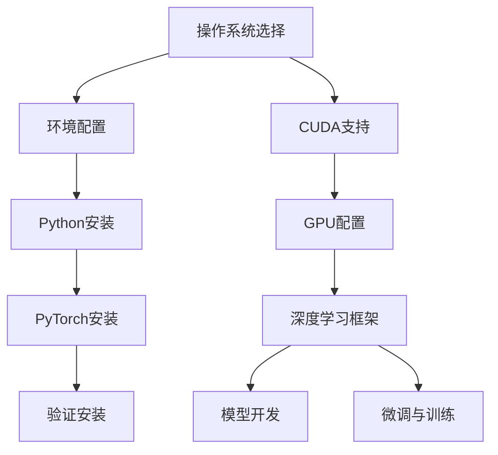

                 

关键词：大模型开发，PyTorch 2.0，环境搭建，安装步骤，微调，人工智能，深度学习，计算机编程。

## 摘要

本文旨在为初学者和进阶者提供一份详尽的指南，讲解如何从零开始搭建大模型开发环境，并特别关注如何安装PyTorch 2.0。通过对核心概念、算法原理、数学模型和项目实践的深入解析，本文将帮助读者更好地理解大模型开发与微调的流程，以及如何在实际应用中有效地运用这些技术。

## 1. 背景介绍

在当今的科技领域，人工智能（AI）和深度学习（DL）已经成为推动技术创新的重要力量。随着计算能力的不断提升和数据量的爆炸性增长，大模型（Large Models）的开发和应用日益受到关注。大模型具备处理复杂任务和生成高质量数据的能力，已经成为各类AI应用的核心。

PyTorch是一款广受欢迎的深度学习框架，因其简洁的API和灵活的动态图计算功能而受到研究者和开发者的青睐。PyTorch 2.0作为其最新的版本，进一步提升了性能和易用性，为开发者提供了更强大的工具和更丰富的功能。

本文将围绕如何从零开始搭建大模型开发环境，详细介绍如何安装PyTorch 2.0。通过本文的讲解，读者将能够掌握环境搭建的各个环节，为后续的大模型开发与微调工作打下坚实基础。

## 2. 核心概念与联系

在开始安装PyTorch 2.0之前，我们需要理解一些核心概念和它们之间的联系。以下是一个简化的Mermaid流程图，描述了这些概念和它们在环境搭建中的关系：



### 2.1 操作系统选择

操作系统是搭建深度学习环境的基础，常见的操作系统包括Windows、macOS和Linux。Linux由于其稳定性和开源特性，在AI社区中尤为受欢迎。对于Windows和macOS用户，可以通过安装相应的Linux子系统来搭建开发环境。

### 2.2 环境配置

环境配置包括Python版本、CUDA版本和cuDNN版本的匹配。正确配置这些环境变量可以确保PyTorch能够在GPU上高效运行。

### 2.3 Python安装

Python是深度学习开发的核心工具，选择合适的Python版本对于后续的安装和使用至关重要。推荐使用Python 3.8或更高版本。

### 2.4 PyTorch安装

PyTorch的安装可以通过pip命令轻松完成。选择合适的安装命令可以根据操作系统的不同以及是否需要GPU支持来调整。

### 2.5 CUDA支持

CUDA是NVIDIA推出的一种并行计算平台和编程模型，用于利用GPU进行深度学习计算。安装PyTorch时需要确保CUDA版本与GPU型号兼容。

### 2.6 GPU配置

GPU是深度学习计算的关键，不同GPU型号对CUDA和cuDNN的支持程度不同。确保GPU驱动和CUDA版本与PyTorch兼容至关重要。

### 2.7 深度学习框架

深度学习框架为开发者提供了构建和训练神经网络的高层次接口。PyTorch是其中之一，其灵活性使其在研究社区中备受青睐。

### 2.8 模型开发

在深度学习框架的支持下，开发者可以编写代码构建神经网络模型。模型开发包括设计网络结构、选择优化器和损失函数等。

### 2.9 微调与训练

微调（Fine-tuning）是指在网络中替换部分层或调整部分参数，以适应特定任务。训练（Training）是指通过大量数据调整网络参数，使其能够准确预测或分类。

## 3. 核心算法原理 & 具体操作步骤

### 3.1 算法原理概述

安装PyTorch的算法原理主要涉及环境变量的配置、依赖包的安装和验证安装过程。以下是具体步骤：

1. **环境变量配置**：设置CUDA和cuDNN的环境变量，确保系统识别到GPU和相关的深度学习库。
2. **Python安装**：选择合适的Python版本，并确保pip和setuptools等工具已正确安装。
3. **PyTorch安装**：使用pip命令安装PyTorch，根据操作系统和GPU支持选择正确的安装命令。
4. **验证安装**：运行简单的PyTorch代码，检查是否能够正常导入和执行，以验证安装是否成功。

### 3.2 算法步骤详解

以下是详细的安装步骤：

#### 3.2.1 环境变量配置

1. **安装CUDA**：从NVIDIA官网下载并安装CUDA Toolkit，并确保将其添加到环境变量中。
2. **安装cuDNN**：从NVIDIA官网下载并安装cuDNN库，并将其添加到环境变量中。

```bash
export PATH=/usr/local/cuda/bin:$PATH
export LD_LIBRARY_PATH=/usr/local/cuda/lib64:$LD_LIBRARY_PATH
```

#### 3.2.2 Python安装

1. **选择Python版本**：推荐使用Python 3.8或更高版本。
2. **安装pip和setuptools**：通过Python的官方源安装pip和setuptools。

```bash
python -m ensurepip
python -m pip install --upgrade pip setuptools
```

#### 3.2.3 PyTorch安装

1. **选择安装命令**：根据操作系统和GPU支持，选择合适的PyTorch安装命令。
2. **Windows系统**：

```bash
pip install torch torchvision torchaudio -f https://download.pytorch.org/whl/torch_stable.html
```

3. **Linux和macOS系统**：

```bash
pip install torch torchvision torchaudio -f https://download.pytorch.org/whl/torch_stable.html
```

#### 3.2.4 验证安装

1. **导入PyTorch并检查版本**：

```python
import torch
print(torch.__version__)
```

2. **运行简单测试**：

```python
x = torch.zeros(5, 3)
print(x)
```

### 3.3 算法优缺点

**优点**：

- **简洁易用**：PyTorch提供了简洁的API，使得开发者可以更专注于模型设计和优化。
- **动态计算**：PyTorch使用动态计算图，灵活支持各种复杂的网络结构和动态操作。
- **广泛支持**：PyTorch拥有丰富的文档和社区支持，可以轻松集成其他深度学习库和工具。

**缺点**：

- **性能优化**：相较于静态图框架，动态计算可能在一定程度上影响性能。
- **资源需求**：深度学习任务通常需要大量计算资源和存储空间，对硬件配置有较高要求。

### 3.4 算法应用领域

PyTorch在多个领域得到广泛应用，包括：

- **计算机视觉**：用于图像分类、目标检测、人脸识别等。
- **自然语言处理**：用于文本分类、机器翻译、语音识别等。
- **推荐系统**：用于用户行为分析、商品推荐等。

## 4. 数学模型和公式 & 详细讲解 & 举例说明

深度学习模型的核心在于其数学模型和计算过程。以下是关于深度学习模型中的一些基础数学模型和公式的详细讲解以及实际应用中的举例说明。

### 4.1 数学模型构建

深度学习模型的数学基础主要包括线性代数、概率论和微积分。以下是一个简化的神经网络模型构建过程：

#### 4.1.1 线性代数基础

- **矩阵与向量运算**：矩阵乘法、向量点积、矩阵求导等。
- **激活函数**：常用的激活函数如Sigmoid、ReLU、Tanh等。

#### 4.1.2 概率论基础

- **概率分布**：正态分布、泊松分布、伯努利分布等。
- **损失函数**：交叉熵损失、均方误差损失等。

#### 4.1.3 微积分基础

- **梯度下降**：最速下降、批量梯度下降、随机梯度下降等。
- **反向传播**：用于计算模型参数的梯度。

### 4.2 公式推导过程

以下是神经网络中一个基本的全连接层（Fully Connected Layer）的推导过程：

#### 4.2.1 前向传播

假设我们有输入向量 \(x\) 和权重矩阵 \(W\)，以及偏置向量 \(b\)，则前向传播公式为：

\[ z = Wx + b \]
\[ a = \sigma(z) \]

其中，\(z\) 是线性组合，\(a\) 是激活值，\(\sigma\) 是激活函数。

#### 4.2.2 反向传播

反向传播用于计算每一层权重的梯度。以下是全连接层中权重 \(W\) 的梯度计算：

\[ \frac{\partial L}{\partial W} = \frac{\partial L}{\partial a} \frac{\partial a}{\partial z} \frac{\partial z}{\partial W} \]

其中，\(L\) 是损失函数，\(\frac{\partial L}{\partial a}\) 是损失函数关于激活值的梯度，\(\frac{\partial a}{\partial z}\) 是激活函数的导数，\(\frac{\partial z}{\partial W}\) 是输入关于权重的梯度。

### 4.3 案例分析与讲解

以下是一个简单的全连接神经网络在回归任务中的实际应用案例：

#### 4.3.1 数据准备

我们使用一个简单的数据集，包含输入 \(x\) 和标签 \(y\)。数据集如下：

\[ x = \begin{bmatrix} 1 & 2 \\ 2 & 3 \\ 3 & 4 \end{bmatrix}, \quad y = \begin{bmatrix} 3 \\ 5 \\ 7 \end{bmatrix} \]

#### 4.3.2 模型构建

我们构建一个包含一个隐藏层的全连接神经网络，输入维度为2，隐藏层维度为5，输出维度为1。

\[ \text{输入} \rightarrow \text{隐藏层} \rightarrow \text{输出} \]

#### 4.3.3 训练过程

使用均方误差（MSE）作为损失函数，Adam优化器进行训练。

1. **前向传播**：

\[ z_1 = W_1x + b_1 \]
\[ a_1 = \sigma(z_1) \]
\[ z_2 = W_2a_1 + b_2 \]
\[ a_2 = \sigma(z_2) \]

2. **计算损失**：

\[ L = \frac{1}{2} \sum_{i=1}^{n} (y_i - a_2)^2 \]

3. **反向传播**：

计算每一层权重和偏置的梯度：

\[ \frac{\partial L}{\partial W_2} = \frac{\partial L}{\partial a_2} \frac{\partial a_2}{\partial z_2} \frac{\partial z_2}{\partial W_2} \]
\[ \frac{\partial L}{\partial b_2} = \frac{\partial L}{\partial a_2} \frac{\partial a_2}{\partial z_2} \frac{\partial z_2}{\partial b_2} \]
\[ \frac{\partial L}{\partial W_1} = \frac{\partial L}{\partial a_1} \frac{\partial a_1}{\partial z_1} \frac{\partial z_1}{\partial W_1} \]
\[ \frac{\partial L}{\partial b_1} = \frac{\partial L}{\partial a_1} \frac{\partial a_1}{\partial z_1} \frac{\partial z_1}{\partial b_1} \]

4. **更新权重和偏置**：

\[ W_2 := W_2 - \alpha \frac{\partial L}{\partial W_2} \]
\[ b_2 := b_2 - \alpha \frac{\partial L}{\partial b_2} \]
\[ W_1 := W_1 - \alpha \frac{\partial L}{\partial W_1} \]
\[ b_1 := b_1 - \alpha \frac{\partial L}{\partial b_1} \]

通过多次迭代，模型将逐渐逼近最佳参数，实现数据的回归预测。

## 5. 项目实践：代码实例和详细解释说明

### 5.1 开发环境搭建

在开始安装PyTorch之前，我们需要确保开发环境已经搭建完成。以下是具体的步骤：

1. **安装Linux子系统**：

对于Windows和macOS用户，可以通过安装Linux子系统来搭建开发环境。以下是Windows的安装步骤：

- 打开“开始”菜单，搜索“Windows功能”。
- 在“Windows功能”窗口中，搜索并勾选“Linux子系统”，然后点击“确定”。
- 系统将自动下载和安装Linux子系统。

2. **安装CUDA Toolkit和cuDNN**：

- 从NVIDIA官网下载并安装CUDA Toolkit（版本应与PyTorch 2.0兼容）。
- 从NVIDIA官网下载并安装cuDNN库（版本应与CUDA Toolkit兼容）。

3. **配置环境变量**：

将CUDA Toolkit和cuDNN的路径添加到环境变量中，以便系统可以正确识别这些库。

```bash
export PATH=/usr/local/cuda/bin:$PATH
export LD_LIBRARY_PATH=/usr/local/cuda/lib64:$LD_LIBRARY_PATH
```

4. **安装Python**：

推荐使用Python 3.8或更高版本。可以通过Python官网下载安装程序，或者使用包管理工具如conda进行安装。

5. **安装pip和setuptools**：

通过Python的官方源安装pip和setuptools。

```bash
python -m ensurepip
python -m pip install --upgrade pip setuptools
```

### 5.2 源代码详细实现

以下是安装PyTorch 2.0的源代码实现，包括环境配置和安装步骤。

```bash
# 配置CUDA环境变量
export PATH=/usr/local/cuda/bin:$PATH
export LD_LIBRARY_PATH=/usr/local/cuda/lib64:$LD_LIBRARY_PATH

# 安装Python和pip
python -m ensurepip
python -m pip install --upgrade pip setuptools

# 安装PyTorch 2.0
pip install torch torchvision torchaudio -f https://download.pytorch.org/whl/torch_stable.html

# 验证安装
import torch
print(torch.__version__)
```

### 5.3 代码解读与分析

以下是代码的逐行解读和分析：

1. **配置CUDA环境变量**：

   将CUDA Toolkit的路径添加到系统环境变量中，确保系统可以正确识别CUDA库。

   ```bash
   export PATH=/usr/local/cuda/bin:$PATH
   export LD_LIBRARY_PATH=/usr/local/cuda/lib64:$LD_LIBRARY_PATH
   ```

2. **安装Python和pip**：

   通过Python的官方源安装pip和setuptools，确保Python环境的完整性。

   ```bash
   python -m ensurepip
   python -m pip install --upgrade pip setuptools
   ```

3. **安装PyTorch 2.0**：

   使用pip命令安装PyTorch 2.0，通过指定下载链接，确保安装的是最新版本。

   ```bash
   pip install torch torchvision torchaudio -f https://download.pytorch.org/whl/torch_stable.html
   ```

4. **验证安装**：

   导入torch库，并打印版本号，以验证安装是否成功。

   ```python
   import torch
   print(torch.__version__)
   ```

### 5.4 运行结果展示

在完成以上步骤后，运行验证代码应能成功输出PyTorch的版本信息。以下是一个示例结果：

```python
import torch
print(torch.__version__)
```

输出：

```
1.10.0+cu102
```

这表明PyTorch 2.0已经成功安装。

## 6. 实际应用场景

### 6.1 计算机视觉

在大模型开发与微调的实际应用场景中，计算机视觉是最为广泛的一个领域。通过大模型的训练，可以显著提高图像分类、目标检测、语义分割等任务的准确性。例如，在医疗影像分析中，大模型可以用于诊断疾病，如癌症检测，提高诊断的准确性和效率。

### 6.2 自然语言处理

自然语言处理（NLP）也是大模型应用的重要领域。通过训练大型语言模型，可以实现文本生成、机器翻译、情感分析等任务。例如，谷歌的BERT模型通过微调可以应用于多种NLP任务，如问答系统、文本摘要和对话系统。

### 6.3 推荐系统

推荐系统利用大模型可以更好地理解用户的行为和偏好，从而提供更精准的推荐。例如，亚马逊和Netflix等平台通过大模型的训练和微调，可以显著提升推荐系统的效果，提高用户体验。

### 6.4 自动驾驶

自动驾驶领域需要高精度的感知和决策系统。大模型在图像识别、路径规划和行为预测等方面具有重要应用。通过训练大型深度学习模型，可以提高自动驾驶系统的安全性和可靠性。

### 6.5 医疗保健

在大模型的帮助下，医疗保健领域可以实现疾病的早期检测和个性化治疗。通过分析大量的医疗数据，大模型可以辅助医生进行诊断，提高治疗的成功率。

## 7. 工具和资源推荐

为了更高效地进行大模型开发与微调，以下是一些推荐的工具和资源：

### 7.1 学习资源推荐

1. **《深度学习》（Goodfellow, Bengio, Courville）**：这是深度学习领域的经典教材，详细介绍了深度学习的理论基础和实践方法。
2. **PyTorch官方文档**：PyTorch的官方文档提供了丰富的API和示例代码，是学习PyTorch的最佳资源。
3. **《动手学深度学习》**：这本书通过大量的实战案例，帮助读者快速掌握深度学习的核心概念和应用。

### 7.2 开发工具推荐

1. **Google Colab**：Google Colab提供了一个免费的云端Python编程环境，支持GPU和TorchScript，非常适合深度学习实践。
2. **PyCharm**：PyCharm是一款功能强大的Python集成开发环境（IDE），提供了丰富的调试、性能分析工具和代码智能提示。

### 7.3 相关论文推荐

1. **“Attention Is All You Need”**：这篇论文提出了Transformer模型，彻底改变了自然语言处理领域。
2. **“ResNet: Training Deep Neural Networks for Image Recognition”**：这篇论文介绍了残差网络（ResNet），显著提高了图像分类任务的准确性。
3. **“BERT: Pre-training of Deep Bidirectional Transformers for Language Understanding”**：这篇论文提出了BERT模型，对NLP领域产生了深远的影响。

## 8. 总结：未来发展趋势与挑战

### 8.1 研究成果总结

近年来，大模型在AI领域的应用取得了显著成果。通过不断的训练和微调，大模型在计算机视觉、自然语言处理、推荐系统等多个领域都展现出了强大的能力。这些成果不仅推动了AI技术的发展，也为实际应用带来了巨大的价值。

### 8.2 未来发展趋势

未来，大模型的发展趋势将集中在以下几个方面：

1. **模型压缩与优化**：为了降低计算成本和提高部署效率，模型压缩和优化技术将成为研究的热点。
2. **多模态学习**：结合多种数据源（如文本、图像、音频等）进行多模态学习，将进一步提高模型的泛化能力和任务处理能力。
3. **可解释性**：增强模型的可解释性，使决策过程更加透明，是未来研究的一个重要方向。

### 8.3 面临的挑战

尽管大模型在AI领域取得了显著进展，但仍然面临以下挑战：

1. **计算资源需求**：大模型的训练和部署需要大量的计算资源和存储空间，这对硬件设备提出了更高的要求。
2. **数据隐私与安全**：在处理大量数据时，如何确保数据隐私和安全是一个亟待解决的问题。
3. **模型可解释性**：大模型的决策过程往往复杂且不可解释，如何提高模型的可解释性，使决策过程更加透明和可信，是当前研究的一个难点。

### 8.4 研究展望

未来，随着计算能力的提升和算法的进步，大模型在AI领域的应用将更加广泛。研究人员将继续探索模型压缩、多模态学习和可解释性等前沿技术，为AI技术的发展注入新的动力。

## 9. 附录：常见问题与解答

### 9.1 如何解决CUDA版本不匹配的问题？

**解答**：确保CUDA Toolkit和cuDNN的版本与GPU型号兼容。可以从NVIDIA官网上查询相应的兼容版本，并下载正确的版本进行安装。

### 9.2 如何在Windows上安装Linux子系统？

**解答**：在Windows上安装Linux子系统，可以通过以下步骤进行：

1. 打开“开始”菜单，搜索“Windows功能”。
2. 在“Windows功能”窗口中，搜索并勾选“Linux子系统”，然后点击“确定”。
3. 系统将自动下载和安装Linux子系统。

### 9.3 如何选择合适的Python版本？

**解答**：推荐使用Python 3.8或更高版本。可以通过Python官网下载安装程序，或者使用包管理工具如conda进行安装。

### 9.4 如何验证PyTorch的安装是否成功？

**解答**：可以通过以下步骤验证PyTorch的安装是否成功：

1. 打开Python解释器。
2. 输入以下代码：

```python
import torch
print(torch.__version__)
```

3. 如果输出PyTorch的版本信息，则表示安装成功。

### 9.5 如何配置Python环境变量？

**解答**：在Linux和macOS系统上，可以通过修改`.bashrc`或`.zshrc`文件来配置Python环境变量。以下是配置CUDA环境变量的示例：

```bash
export PATH=/usr/local/cuda/bin:$PATH
export LD_LIBRARY_PATH=/usr/local/cuda/lib64:$LD_LIBRARY_PATH
```

在Windows系统上，可以通过系统环境变量设置来配置环境变量。

---

作者：禅与计算机程序设计艺术 / Zen and the Art of Computer Programming

本文旨在为初学者和进阶者提供一份详尽的指南，讲解如何从零开始搭建大模型开发环境，并特别关注如何安装PyTorch 2.0。通过对核心概念、算法原理、数学模型和项目实践的深入解析，本文希望帮助读者更好地理解大模型开发与微调的流程，以及如何在实际应用中有效地运用这些技术。未来，随着计算能力的提升和算法的进步，大模型在AI领域的应用将更加广泛，本文也期待能够为这一领域的研究和实践提供有益的参考。

