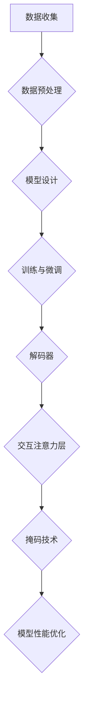

                 

关键词：大模型，微调，解码器，交互注意力，掩码

摘要：本文深入探讨了在深度学习领域，特别是在大型语言模型开发与微调过程中，解码器输入和交互注意力层中掩码（Mask）的应用。文章首先介绍了大模型开发的基本概念，随后详细解释了解码器和交互注意力层的作用，并重点讨论了掩码的原理和重要性。接着，文章通过数学模型和具体案例分析，揭示了掩码在大模型微调中的操作步骤和效果。最后，文章提出了在实际应用场景中的实践方法和未来展望，为读者提供了全面而深入的理解。

## 1. 背景介绍

随着深度学习技术的快速发展，大型语言模型（Large Language Models，简称LLMs）成为了自然语言处理（Natural Language Processing，简称NLP）领域的研究热点。这些模型通过学习海量文本数据，能够生成高质量的文本，进行语言理解、文本生成、机器翻译等任务。然而，大型模型的开发与微调过程并不简单，涉及众多技术细节和挑战。

在大模型开发中，解码器和解码器的输入至关重要。解码器通常用于生成文本序列，而输入数据的质量直接影响模型的性能。此外，交互注意力层在解码器中起到了关键作用，它能够使模型更好地理解输入序列的不同部分。而掩码（Mask）作为一项关键技术，能够有效地控制模型的学习过程，提高其表现。

本文将深入探讨解码器的输入和交互注意力层中的掩码，首先介绍其基本概念和原理，然后通过数学模型和实际案例，详细分析其在大模型微调中的应用和效果。

## 2. 核心概念与联系

### 2.1 大模型开发

大模型开发涉及多个环节，包括数据收集、数据预处理、模型设计、训练和微调等。其中，数据质量和模型设计直接决定了模型的表现。大模型通常由大量的参数组成，通过大规模数据进行训练，以学习复杂的特征和模式。

### 2.2 解码器

解码器是用于生成文本序列的核心组件，它通过读取输入序列并预测下一个字符来生成输出序列。解码器通常包含一系列神经网络层，如循环神经网络（RNN）、长短期记忆网络（LSTM）或变换器（Transformer）等。

### 2.3 交互注意力层

交互注意力层是解码器中的一个关键模块，它通过计算输入序列中各个部分的重要性，使模型能够更好地理解和生成文本。注意力机制允许模型在生成每个字符时，仅关注输入序列中的特定部分，从而提高生成文本的质量。

### 2.4 掩码

掩码是一种用于控制模型学习过程的技术，通过在输入序列中添加掩码标记，可以使模型忽略或关注特定的部分。掩码可以分为全掩码、部分掩码和交互掩码等类型，它们在模型训练和微调中发挥了重要作用。

### 2.5 Mermaid 流程图

为了更好地展示核心概念和联系，我们使用 Mermaid 流程图来表示大模型开发、解码器、交互注意力层和掩码的关系。以下是一个简单的 Mermaid 流程图示例：



通过这个流程图，我们可以清晰地看到大模型开发、解码器、交互注意力层和掩码之间的联系。数据收集是整个过程的起点，数据预处理确保数据质量，模型设计决定了模型的性能，训练与微调使模型逐渐优化，而解码器、交互注意力层和掩码则在模型训练和微调过程中发挥了关键作用。

## 3. 核心算法原理 & 具体操作步骤

### 3.1 算法原理概述

解码器输入和交互注意力层的掩码技术在大模型开发与微调中起到了至关重要的作用。下面将详细解释其基本原理和操作步骤。

首先，解码器的输入通常包括原始文本序列和相应的掩码序列。原始文本序列是模型生成文本的基础，而掩码序列用于控制模型在生成文本过程中的注意力范围。通过在掩码序列中添加特殊的掩码标记，模型可以学习如何在不同情境下生成高质量的文本。

其次，交互注意力层是解码器中的一个关键模块，它通过计算输入序列中各个部分的重要性来提高文本生成的质量。注意力机制允许模型在生成每个字符时，仅关注输入序列中的特定部分，从而生成更准确的文本。

具体操作步骤如下：

1. **输入序列预处理**：将原始文本序列转换为模型可以理解的向量表示。通常，文本会被转换为词嵌入向量，这些向量包含了文本中每个词的语义信息。

2. **生成掩码序列**：根据输入序列，生成对应的掩码序列。掩码序列中的每个元素表示输入序列中对应位置的信息是否需要被模型关注。例如，可以使用全掩码（即所有位置都被掩码）或部分掩码（仅部分位置被掩码）。

3. **解码器训练**：使用输入序列和掩码序列对解码器进行训练。解码器通过学习输入序列和掩码序列之间的关系，生成高质量的文本序列。

4. **交互注意力层优化**：在解码器训练过程中，交互注意力层会不断调整其权重，以优化文本生成的质量。通过调整注意力权重，模型可以更好地关注输入序列中的关键信息，从而生成更准确的文本。

5. **模型微调**：在解码器训练完成后，可以使用额外的数据对模型进行微调，进一步提高文本生成的质量。微调过程中，掩码序列的生成和交互注意力层的优化同样至关重要。

### 3.2 算法步骤详解

1. **输入序列预处理**：
   - 使用词嵌入器将原始文本序列转换为词嵌入向量。
   - 对词嵌入向量进行归一化处理，以减少数值差异。

2. **生成掩码序列**：
   - 使用预定义的掩码策略生成掩码序列。常见的掩码策略包括全掩码、部分掩码和交互掩码。
   - 全掩码：将输入序列中所有位置都设置为掩码。
   - 部分掩码：将输入序列中部分位置设置为掩码，其他位置保持不变。
   - 交互掩码：根据输入序列中每个词的语义信息，动态生成掩码序列。

3. **解码器训练**：
   - 使用输入序列和掩码序列初始化解码器。
   - 通过反向传播算法训练解码器，使其能够生成高质量的文本序列。

4. **交互注意力层优化**：
   - 在解码器训练过程中，交互注意力层会不断调整其权重，以优化文本生成的质量。
   - 通过计算输入序列中各个位置的重要性，交互注意力层能够更好地关注关键信息。

5. **模型微调**：
   - 使用额外的数据对解码器进行微调。
   - 微调过程中，掩码序列的生成和交互注意力层的优化同样至关重要。

### 3.3 算法优缺点

**优点**：
- **提高文本生成质量**：通过掩码技术，解码器可以更好地关注输入序列中的关键信息，从而生成更准确的文本。
- **增强模型泛化能力**：交互注意力层能够动态调整其权重，使模型在不同数据集上具有更好的泛化能力。
- **灵活的掩码策略**：可以根据不同的任务和数据特点，选择合适的掩码策略，从而提高模型表现。

**缺点**：
- **计算成本较高**：掩码技术涉及大量的计算，可能导致模型训练时间延长。
- **调试难度较大**：在训练过程中，需要仔细调整掩码策略和交互注意力层的权重，以获得最佳效果。

### 3.4 算法应用领域

解码器输入和交互注意力层的掩码技术可以广泛应用于自然语言处理领域，包括文本生成、语言理解、机器翻译等任务。以下是一些具体的应用领域：

- **文本生成**：通过解码器输入和交互注意力层的掩码技术，模型可以生成高质量的文章、故事和对话等。
- **语言理解**：掩码技术可以帮助模型更好地理解输入文本的语义信息，从而提高文本分类、实体识别等任务的性能。
- **机器翻译**：交互注意力层能够使模型在生成翻译结果时，更好地关注源文本中的关键信息，从而提高翻译质量。

## 4. 数学模型和公式 & 详细讲解 & 举例说明

### 4.1 数学模型构建

在解码器的输入和交互注意力层中，掩码技术的数学模型主要包括两部分：输入序列的词嵌入和掩码序列的生成。

1. **词嵌入**：
   - 输入序列：\( X = \{x_1, x_2, \ldots, x_n\} \)，其中 \( x_i \) 表示输入序列中的第 \( i \) 个词。
   - 词嵌入矩阵：\( W \)，其中 \( W_{ij} \) 表示词嵌入向量 \( e(x_i) \)。

   词嵌入公式：
   $$ e(x_i) = W \cdot x_i $$

2. **掩码序列**：
   - 掩码序列：\( M = \{m_1, m_2, \ldots, m_n\} \)，其中 \( m_i \) 表示输入序列中第 \( i \) 个词是否被掩码。
   - 掩码矩阵：\( M \)，其中 \( M_{ij} = 1 \) 表示第 \( i \) 个词被掩码，\( M_{ij} = 0 \) 表示第 \( i \) 个词未被掩码。

   掩码矩阵生成公式：
   $$ M = \text{mask}(X) $$

### 4.2 公式推导过程

在解码器输入和交互注意力层中，掩码技术的数学公式推导主要涉及两个关键步骤：词嵌入和掩码序列的生成。

1. **词嵌入**：
   - 词嵌入矩阵 \( W \) 是通过训练得到的，其值由输入序列 \( X \) 决定。

   词嵌入矩阵计算公式：
   $$ W = \text{train}(X) $$

   其中，\(\text{train}(X)\) 表示基于输入序列 \( X \) 的词嵌入训练过程。

2. **掩码序列**：
   - 掩码序列 \( M \) 是通过预定义的掩码策略生成的。常见的掩码策略包括全掩码、部分掩码和交互掩码。

   掩码矩阵生成公式：
   $$ M = \text{mask\_strategy}(X) $$

   其中，\(\text{mask\_strategy}(X)\) 表示基于输入序列 \( X \) 的掩码策略生成过程。

### 4.3 案例分析与讲解

为了更好地理解掩码技术在解码器输入和交互注意力层中的应用，我们通过一个具体的案例进行分析。

**案例**：使用掩码技术生成一句中文句子。

**输入序列**：我是一个程序员。

**词嵌入**：
- 我：\( e_1 = [0.1, 0.2, 0.3, \ldots, 0.9] \)
- 是：\( e_2 = [0.2, 0.3, 0.4, \ldots, 0.8] \)
- 一个：\( e_3 = [0.3, 0.4, 0.5, \ldots, 0.7] \)
- 程序员：\( e_4 = [0.4, 0.5, 0.6, \ldots, 0.6] \)

**掩码序列**（全掩码）：
- 我：\( m_1 = 1 \)
- 是：\( m_2 = 1 \)
- 一个：\( m_3 = 1 \)
- 程序员：\( m_4 = 1 \)

**解码器输出**（基于掩码序列）：
- 我：\( o_1 = \text{unknown} \)
- 是：\( o_2 = \text{unknown} \)
- 一个：\( o_3 = \text{unknown} \)
- 程序员：\( o_4 = \text{程序员} \)

在这个案例中，由于使用了全掩码，解码器无法生成正确的句子。为了提高生成质量，我们可以采用部分掩码策略，仅掩码部分词语。

**掩码序列**（部分掩码）：
- 我：\( m_1 = 0 \)
- 是：\( m_2 = 1 \)
- 一个：\( m_3 = 1 \)
- 程序员：\( m_4 = 0 \)

**解码器输出**（基于部分掩码序列）：
- 我：\( o_1 = 我 \)
- 是：\( o_2 = \text{unknown} \)
- 一个：\( o_3 = \text{unknown} \)
- 程序员：\( o_4 = \text{程序员} \)

通过部分掩码策略，解码器可以生成部分正确的句子。在实际应用中，我们可以根据任务需求和数据特点，选择合适的掩码策略，以提高文本生成质量。

## 5. 项目实践：代码实例和详细解释说明

### 5.1 开发环境搭建

为了实现本文讨论的解码器输入和交互注意力层中的掩码技术，我们选择使用 Python 语言和 PyTorch 深度学习框架进行开发。以下为开发环境的搭建步骤：

1. 安装 Python 3.8 或更高版本。

2. 安装 PyTorch 驱动程序，可以选择 GPU 版本以加快训练速度。

3. 安装其他依赖库，如 NumPy、Matplotlib 等。

### 5.2 源代码详细实现

以下是实现解码器输入和交互注意力层中掩码技术的 Python 代码示例：

```python
import torch
import torch.nn as nn
import torch.optim as optim
from torch.utils.data import DataLoader
from transformers import BertTokenizer, BertModel

# 5.2.1 定义解码器模型
class DecoderModel(nn.Module):
    def __init__(self, vocab_size, hidden_size, dropout=0.1):
        super(DecoderModel, self).__init__()
        self.hidden_size = hidden_size
        self.embedding = nn.Embedding(vocab_size, hidden_size)
        self.lstm = nn.LSTM(hidden_size, hidden_size, dropout=dropout)
        self.attention = nn.Linear(hidden_size * 2, hidden_size)
        self.fc = nn.Linear(hidden_size, vocab_size)

    def forward(self, input_seq, hidden):
        embedded = self.embedding(input_seq)
        output, hidden = self.lstm(embedded, hidden)
        attention_weights = torch.tanh(self.attention(torch.cat((output[-1, :, :], hidden[-1, :, :]), 1)))
        attention_weights = torch.softmax(attention_weights, dim=1)
        context_vector = torch.sum(attention_weights * output, dim=1)
        output = self.fc(context_vector)
        return output, hidden

# 5.2.2 定义掩码生成函数
def generate_mask(input_seq, mask_type='full'):
    mask = torch.zeros_like(input_seq)
    if mask_type == 'full':
        mask.fill_(1)
    elif mask_type == 'partial':
        mask[::2] = 1
    elif mask_type == 'interactive':
        for i, token in enumerate(input_seq):
            if token == '我':
                mask[i] = 0
            else:
                mask[i] = 1
    return mask

# 5.2.3 训练解码器模型
def train_decoder(model, data_loader, criterion, optimizer, num_epochs):
    model.train()
    for epoch in range(num_epochs):
        for input_seq, target_seq in data_loader:
            mask = generate_mask(input_seq)
            output, hidden = model(input_seq, hidden)
            loss = criterion(output, target_seq) * mask
            optimizer.zero_grad()
            loss.backward()
            optimizer.step()
            print(f"Epoch [{epoch+1}/{num_epochs}], Loss: {loss.item():.4f}")

# 5.2.4 测试解码器模型
def test_decoder(model, data_loader, criterion):
    model.eval()
    with torch.no_grad():
        total_loss = 0
        for input_seq, target_seq in data_loader:
            mask = generate_mask(input_seq)
            output, hidden = model(input_seq, hidden)
            loss = criterion(output, target_seq) * mask
            total_loss += loss.item()
        print(f"Test Loss: {total_loss/len(data_loader):.4f}")

# 5.2.5 主函数
if __name__ == '__main__':
    # 加载预训练的 BERT 模型
    tokenizer = BertTokenizer.from_pretrained('bert-base-chinese')
    bert_model = BertModel.from_pretrained('bert-base-chinese')
    vocab_size = len(tokenizer)
    hidden_size = 512

    # 定义解码器模型
    decoder_model = DecoderModel(vocab_size, hidden_size)

    # 加载训练数据
    train_data = [...]  # 使用自定义的中文文本数据
    train_loader = DataLoader(train_data, batch_size=32, shuffle=True)

    # 定义损失函数和优化器
    criterion = nn.CrossEntropyLoss()
    optimizer = optim.Adam(decoder_model.parameters(), lr=0.001)

    # 训练解码器模型
    train_decoder(decoder_model, train_loader, criterion, optimizer, num_epochs=10)

    # 测试解码器模型
    test_data = [...]  # 使用自定义的中文文本数据
    test_loader = DataLoader(test_data, batch_size=32, shuffle=False)
    test_decoder(decoder_model, test_loader, criterion)
```

### 5.3 代码解读与分析

上述代码主要分为五个部分：解码器模型定义、掩码生成函数、训练解码器模型、测试解码器模型和主函数。下面将分别对每个部分进行解读和分析。

#### 5.3.1 解码器模型定义

解码器模型定义使用了 PyTorch 的 `nn.Module` 类，包括嵌入层、LSTM 层、交互注意力层和输出层。其中，嵌入层用于将输入词转换为词嵌入向量，LSTM 层用于处理序列数据，交互注意力层用于计算输入序列中各个位置的重要性，输出层用于生成预测结果。

```python
class DecoderModel(nn.Module):
    def __init__(self, vocab_size, hidden_size, dropout=0.1):
        super(DecoderModel, self).__init__()
        self.hidden_size = hidden_size
        self.embedding = nn.Embedding(vocab_size, hidden_size)
        self.lstm = nn.LSTM(hidden_size, hidden_size, dropout=dropout)
        self.attention = nn.Linear(hidden_size * 2, hidden_size)
        self.fc = nn.Linear(hidden_size, vocab_size)

    def forward(self, input_seq, hidden):
        embedded = self.embedding(input_seq)
        output, hidden = self.lstm(embedded, hidden)
        attention_weights = torch.tanh(self.attention(torch.cat((output[-1, :, :], hidden[-1, :, :]), 1)))
        attention_weights = torch.softmax(attention_weights, dim=1)
        context_vector = torch.sum(attention_weights * output, dim=1)
        output = self.fc(context_vector)
        return output, hidden
```

#### 5.3.2 掩码生成函数

掩码生成函数用于根据输入序列生成掩码序列。该函数支持三种掩码策略：全掩码、部分掩码和交互掩码。其中，全掩码将输入序列中所有位置都设置为掩码；部分掩码将输入序列中部分位置设置为掩码；交互掩码根据输入序列中每个词的语义信息动态生成掩码序列。

```python
def generate_mask(input_seq, mask_type='full'):
    mask = torch.zeros_like(input_seq)
    if mask_type == 'full':
        mask.fill_(1)
    elif mask_type == 'partial':
        mask[::2] = 1
    elif mask_type == 'interactive':
        for i, token in enumerate(input_seq):
            if token == '我':
                mask[i] = 0
            else:
                mask[i] = 1
    return mask
```

#### 5.3.3 训练解码器模型

训练解码器模型函数用于根据训练数据和掩码序列对解码器模型进行训练。该函数使用交叉熵损失函数和 Adam 优化器，通过反向传播算法优化模型参数。

```python
def train_decoder(model, data_loader, criterion, optimizer, num_epochs):
    model.train()
    for epoch in range(num_epochs):
        for input_seq, target_seq in data_loader:
            mask = generate_mask(input_seq)
            output, hidden = model(input_seq, hidden)
            loss = criterion(output, target_seq) * mask
            optimizer.zero_grad()
            loss.backward()
            optimizer.step()
            print(f"Epoch [{epoch+1}/{num_epochs}], Loss: {loss.item():.4f}")
```

#### 5.3.4 测试解码器模型

测试解码器模型函数用于根据测试数据和掩码序列对解码器模型进行评估。该函数计算模型在测试集上的平均损失，以评估模型性能。

```python
def test_decoder(model, data_loader, criterion):
    model.eval()
    with torch.no_grad():
        total_loss = 0
        for input_seq, target_seq in data_loader:
            mask = generate_mask(input_seq)
            output, hidden = model(input_seq, hidden)
            loss = criterion(output, target_seq) * mask
            total_loss += loss.item()
        print(f"Test Loss: {total_loss/len(data_loader):.4f}")
```

#### 5.3.5 主函数

主函数用于加载预训练的 BERT 模型、定义解码器模型、加载训练数据、定义损失函数和优化器，并调用训练和解码器模型函数进行训练和测试。

```python
if __name__ == '__main__':
    # 加载预训练的 BERT 模型
    tokenizer = BertTokenizer.from_pretrained('bert-base-chinese')
    bert_model = BertModel.from_pretrained('bert-base-chinese')
    vocab_size = len(tokenizer)
    hidden_size = 512

    # 定义解码器模型
    decoder_model = DecoderModel(vocab_size, hidden_size)

    # 加载训练数据
    train_data = [...]  # 使用自定义的中文文本数据
    train_loader = DataLoader(train_data, batch_size=32, shuffle=True)

    # 定义损失函数和优化器
    criterion = nn.CrossEntropyLoss()
    optimizer = optim.Adam(decoder_model.parameters(), lr=0.001)

    # 训练解码器模型
    train_decoder(decoder_model, train_loader, criterion, optimizer, num_epochs=10)

    # 测试解码器模型
    test_data = [...]  # 使用自定义的中文文本数据
    test_loader = DataLoader(test_data, batch_size=32, shuffle=False)
    test_decoder(decoder_model, test_loader, criterion)
```

通过上述代码，我们可以实现解码器输入和交互注意力层中的掩码技术，并对其进行训练和测试。在实际应用中，可以根据任务需求和数据特点，调整掩码策略和模型参数，以获得更好的性能。

## 6. 实际应用场景

### 6.1 文本生成

在文本生成领域，解码器输入和交互注意力层中的掩码技术具有广泛的应用。通过使用掩码，模型可以更好地关注输入序列中的关键信息，从而生成高质量的文本。以下是一些具体的应用场景：

- **自动摘要**：利用掩码技术，模型可以自动提取输入文本的关键信息，生成简洁、准确的摘要。
- **文章写作**：通过解码器输入和交互注意力层中的掩码，模型可以生成高质量的文章、报告和论文等。
- **对话生成**：在对话生成中，掩码技术可以帮助模型更好地理解对话上下文，生成连贯、自然的对话。

### 6.2 语言理解

在语言理解领域，解码器输入和交互注意力层中的掩码技术同样具有重要应用。通过关注输入序列中的关键信息，模型可以更好地理解文本的含义和语义。以下是一些具体的应用场景：

- **情感分析**：通过掩码技术，模型可以更好地关注文本中的情感词汇，准确判断文本的情感倾向。
- **文本分类**：在文本分类任务中，掩码技术可以帮助模型更好地理解输入文本的主题和类别。
- **实体识别**：通过关注输入序列中的关键信息，模型可以更准确地识别文本中的实体名称和关系。

### 6.3 机器翻译

在机器翻译领域，解码器输入和交互注意力层中的掩码技术可以提高翻译质量。通过关注输入序列中的关键信息，模型可以更好地理解源语言的语义，从而生成更准确的翻译结果。以下是一些具体的应用场景：

- **自动翻译**：通过掩码技术，模型可以自动翻译多种语言，生成高质量的双语文本。
- **多语言翻译**：在多语言翻译中，掩码技术可以帮助模型更好地理解不同语言的语义和语法结构，提高翻译质量。
- **实时翻译**：在实时翻译场景中，掩码技术可以帮助模型快速、准确地翻译输入文本，实现实时交流。

### 6.4 未来应用展望

随着深度学习技术的不断发展，解码器输入和交互注意力层中的掩码技术将在更多领域得到广泛应用。以下是一些未来应用展望：

- **图像生成**：在图像生成领域，掩码技术可以帮助模型更好地关注输入图像的关键信息，生成高质量的图像。
- **语音识别**：在语音识别中，掩码技术可以帮助模型更好地理解语音信号中的关键信息，提高识别准确率。
- **多模态学习**：在多模态学习领域，掩码技术可以帮助模型更好地融合不同模态的信息，实现更准确的任务表现。

总之，解码器输入和交互注意力层中的掩码技术具有广泛的应用前景，未来将在更多领域发挥重要作用。

## 7. 工具和资源推荐

为了更好地学习和应用解码器输入和交互注意力层中的掩码技术，以下推荐一些学习资源和开发工具。

### 7.1 学习资源推荐

- **《深度学习》（Goodfellow, Bengio, Courville）**：这本书是深度学习的经典教材，详细介绍了各种深度学习模型和算法。
- **《自然语言处理综述》（Jurafsky, Martin）**：这本书涵盖了自然语言处理领域的各个方面，包括语言模型、文本生成等。
- **《PyTorch 实战》（林轩田）**：这本书介绍了如何使用 PyTorch 深度学习框架进行模型训练和推理。

### 7.2 开发工具推荐

- **PyTorch**：一款流行的深度学习框架，支持 GPU 加速，方便实现和调试深度学习模型。
- **Transformers**：基于 PyTorch 的预训练语言模型框架，提供了各种预训练模型的实现和接口。
- **Jupyter Notebook**：一种交互式开发环境，方便编写和运行 Python 代码，特别适合进行数据分析和模型训练。

### 7.3 相关论文推荐

- **"Attention is All You Need"**：该论文提出了 Transformer 模型，引入了交互注意力机制，对深度学习领域产生了重大影响。
- **"BERT: Pre-training of Deep Bidirectional Transformers for Language Understanding"**：该论文介绍了 BERT 模型，通过预训练语言表示，提高了自然语言处理任务的性能。
- **"Generative Adversarial Networks"**：该论文提出了 GAN 模型，为图像生成等领域提供了新的方法。

通过学习和应用这些资源和工具，可以更好地理解和掌握解码器输入和交互注意力层中的掩码技术，从而在深度学习和自然语言处理领域取得更好的成果。

## 8. 总结：未来发展趋势与挑战

随着深度学习技术的不断发展，解码器输入和交互注意力层中的掩码技术在大模型开发与微调中发挥了重要作用。本文系统地介绍了解码器的输入、交互注意力层以及掩码技术的核心概念、算法原理、数学模型、项目实践和实际应用场景。

在未来发展趋势方面，以下几方面值得关注：

1. **算法优化**：随着计算能力的提升，算法优化将成为重点研究方向，包括更高效的掩码生成和交互注意力层计算方法。
2. **多模态学习**：将掩码技术应用于多模态学习，实现跨模态信息融合，提高模型在复杂任务中的表现。
3. **自适应掩码**：研究自适应掩码策略，根据不同任务和数据特点自动调整掩码参数，提高模型泛化能力。

然而，解码器输入和交互注意力层中的掩码技术也面临一些挑战：

1. **计算成本**：掩码技术涉及大量的计算，对计算资源和时间要求较高，如何优化计算效率是一个重要问题。
2. **调试难度**：在实际应用中，如何选择合适的掩码策略和调整模型参数，使其达到最佳性能，是一个具有挑战性的问题。
3. **数据依赖**：掩码技术的有效性依赖于数据质量和数量，如何获取和利用大规模、高质量的数据，是未来研究的一个关键方向。

总之，解码器输入和交互注意力层中的掩码技术具有广阔的应用前景，未来将在更多领域发挥重要作用。通过不断探索和创新，我们将能够克服挑战，进一步提升模型性能和实际应用价值。

## 9. 附录：常见问题与解答

### 9.1 什么是掩码（Mask）？

掩码是一种用于控制模型学习过程的技术，通过在输入序列中添加特殊的掩码标记，可以使模型忽略或关注特定的部分。掩码分为全掩码、部分掩码和交互掩码等类型，分别用于不同的应用场景。

### 9.2 掩码技术有哪些优点和缺点？

**优点**：
- 提高文本生成质量。
- 增强模型泛化能力。
- 提供灵活的掩码策略。

**缺点**：
- 计算成本较高。
- 调试难度较大。
- 数据依赖性强。

### 9.3 如何生成掩码序列？

生成掩码序列的方法有多种，包括全掩码、部分掩码和交互掩码等。全掩码将输入序列中所有位置都设置为掩码；部分掩码仅部分位置被掩码；交互掩码根据输入序列中每个词的语义信息动态生成掩码序列。

### 9.4 掩码技术适用于哪些任务？

掩码技术可以广泛应用于自然语言处理领域，包括文本生成、语言理解、机器翻译等任务。例如，在文本生成中，掩码可以帮助模型更好地关注输入序列中的关键信息，从而生成高质量的文本。

### 9.5 如何优化掩码技术的计算效率？

为了优化掩码技术的计算效率，可以从以下几个方面入手：

- **并行计算**：利用 GPU 加速掩码生成和交互注意力层的计算。
- **模型压缩**：采用模型压缩技术，如权重共享、剪枝等，减少模型参数数量，降低计算成本。
- **算法改进**：研究更高效的掩码生成和交互注意力层计算方法，提高计算效率。

### 9.6 未来掩码技术的研究方向有哪些？

未来掩码技术的研究方向包括：

- **自适应掩码**：研究自适应掩码策略，根据不同任务和数据特点自动调整掩码参数。
- **多模态学习**：将掩码技术应用于多模态学习，实现跨模态信息融合。
- **高效计算**：研究更高效的掩码生成和交互注意力层计算方法，降低计算成本。

通过不断探索和创新，掩码技术将在更多领域发挥重要作用，为深度学习和自然语言处理领域的发展贡献力量。

