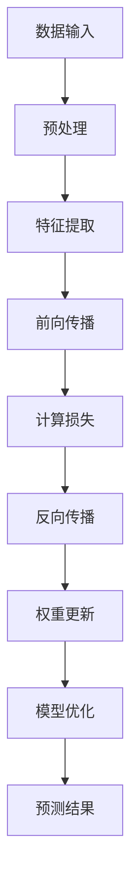

                 

关键词：大模型开发，微调，PyTorch 2.0，深度学习，框架选择，实战指导

摘要：本文旨在为初学者和进阶者提供一份全面的指南，以从零开始进行大规模模型开发与微调。我们将重点讨论为什么选择PyTorch 2.0作为我们的实战框架，详细讲解其核心概念和操作步骤，并通过实际项目实践展示其应用效果。本文将帮助读者了解大模型开发与微调的基本流程，掌握使用PyTorch 2.0进行模型训练和优化的方法，并为未来的研究和应用提供有价值的参考。

## 1. 背景介绍

近年来，随着深度学习技术的迅猛发展，大规模模型在各个领域取得了显著的成功。从自然语言处理（NLP）到计算机视觉（CV），从语音识别到强化学习（RL），大规模模型已经成为推动人工智能发展的核心动力。然而，大模型开发与微调并非易事，需要处理大量计算资源和复杂的技术问题。为此，选择一个合适的深度学习框架至关重要。

PyTorch作为一个开源的深度学习框架，因其灵活、易用和强大的功能，逐渐成为开发者们的首选。PyTorch 2.0作为其最新版本，进一步提升了性能和易用性，为大规模模型开发提供了强有力的支持。本文将围绕PyTorch 2.0，详细介绍大模型开发与微调的流程和方法，帮助读者顺利开启深度学习之旅。

## 2. 核心概念与联系

### 2.1 深度学习基本概念

在开始大模型开发之前，我们需要了解一些深度学习的基本概念。深度学习是一种基于人工神经网络的学习方法，通过多层非线性变换，自动从数据中学习特征表示。以下是几个核心概念：

- **神经网络（Neural Network）**：由大量神经元组成的计算模型，用于对数据进行处理和预测。
- **前向传播（Forward Propagation）**：数据从输入层流向输出层的计算过程。
- **反向传播（Back Propagation）**：通过计算输出层与实际结果之间的误差，反向更新网络权重和偏置的过程。
- **激活函数（Activation Function）**：引入非线性变换，使神经网络能够学习复杂函数。
- **损失函数（Loss Function）**：用于度量模型预测值与实际值之间的差距，常用的有均方误差（MSE）和交叉熵（Cross Entropy）。

### 2.2 大模型架构

大模型通常具有以下特点：

- **多层结构**：包含多个隐藏层，可以学习更复杂的特征表示。
- **参数数量庞大**：大量神经元和连接，导致模型参数数量巨大。
- **计算需求高**：训练和推理过程中需要大量的计算资源。
- **需要微调**：由于参数数量庞大，需要通过微调来优化模型性能。

### 2.3 Mermaid 流程图

下面是一个简化的Mermaid流程图，展示了深度学习模型的基本架构：



### 2.4 关联知识

在大模型开发过程中，我们还需要了解以下关联知识：

- **数据预处理**：数据清洗、归一化、填充缺失值等，以提高模型训练效果。
- **模型优化方法**：如批量归一化（Batch Normalization）、权重初始化、学习率调整等。
- **正则化技术**：如dropout、L1/L2正则化等，用于防止过拟合。
- **超参数调优**：通过实验和经验，选择合适的超参数，以提高模型性能。

## 3. 核心算法原理 & 具体操作步骤

### 3.1 算法原理概述

在深度学习中，大模型开发主要涉及以下几个关键步骤：

1. **数据集划分**：将数据集分为训练集、验证集和测试集，以便评估模型性能。
2. **模型设计**：根据任务需求，设计合适的神经网络结构。
3. **模型训练**：通过迭代优化模型参数，使模型在训练集上达到良好的性能。
4. **模型验证**：使用验证集评估模型性能，调整超参数和模型结构。
5. **模型测试**：使用测试集评估模型在未知数据上的表现。

### 3.2 算法步骤详解

下面我们将详细讲解大模型开发的每个步骤：

#### 3.2.1 数据集划分

数据集划分是模型开发的第一步，我们需要将数据集按照一定比例划分成训练集、验证集和测试集。一般来说，可以使用以下比例：

- 训练集：用于模型训练，占比约70%。
- 验证集：用于模型验证和超参数调优，占比约15%。
- 测试集：用于评估模型在未知数据上的性能，占比约15%。

#### 3.2.2 模型设计

在设计模型时，我们需要考虑以下因素：

- **输入层**：根据任务需求，定义输入数据的维度。
- **隐藏层**：设计多层隐藏层，选择合适的激活函数和神经元数量。
- **输出层**：根据任务类型，设计合适的输出层，如分类任务的softmax层。
- **损失函数**：选择合适的损失函数，如分类任务的交叉熵损失。

#### 3.2.3 模型训练

模型训练是通过迭代优化模型参数，使模型在训练集上达到良好的性能。训练过程主要包括以下几个步骤：

1. **初始化参数**：随机初始化模型参数。
2. **前向传播**：计算输入数据的特征表示和预测结果。
3. **计算损失**：计算预测结果与实际结果之间的损失。
4. **反向传播**：通过梯度计算更新模型参数。
5. **迭代优化**：重复以上步骤，直到满足停止条件。

#### 3.2.4 模型验证

模型验证用于评估模型在验证集上的性能，以便调整超参数和模型结构。验证过程主要包括以下几个步骤：

1. **评估指标**：选择合适的评估指标，如分类任务的准确率、召回率、F1值等。
2. **模型评估**：使用验证集计算评估指标。
3. **超参数调优**：根据评估结果，调整学习率、批量大小、正则化参数等。

#### 3.2.5 模型测试

模型测试用于评估模型在未知数据上的性能。测试过程与验证过程类似，但使用测试集作为评估数据。测试结果可以作为模型最终性能的参考。

### 3.3 算法优缺点

#### 优点

1. **灵活性高**：PyTorch 2.0提供了丰富的API，允许开发者灵活地设计模型结构和训练过程。
2. **易用性**：PyTorch 2.0具有简洁的代码风格和强大的文档支持，适合初学者和进阶者使用。
3. **生态丰富**：PyTorch拥有庞大的开发者社区和丰富的扩展库，方便开发者进行模型开发和部署。

#### 缺点

1. **性能瓶颈**：虽然PyTorch 2.0在性能方面有所提升，但在大规模模型训练和推理时，仍可能面临性能瓶颈。
2. **内存占用**：由于参数数量庞大，大模型训练过程中可能需要大量内存资源。

### 3.4 算法应用领域

PyTorch 2.0广泛应用于以下领域：

1. **自然语言处理（NLP）**：如文本分类、机器翻译、情感分析等。
2. **计算机视觉（CV）**：如图像分类、目标检测、人脸识别等。
3. **语音识别**：如语音合成、语音识别等。
4. **强化学习（RL）**：如游戏AI、机器人控制等。

## 4. 数学模型和公式 & 详细讲解 & 举例说明

### 4.1 数学模型构建

在深度学习中，数学模型构建是核心环节。以下是一个简化的数学模型构建过程：

#### 4.1.1 输入层

输入层由输入数据组成，通常为一个二维矩阵。假设输入数据的维度为\( n \times m \)，其中\( n \)表示样本数量，\( m \)表示特征数量。

#### 4.1.2 隐藏层

隐藏层由多层神经网络组成，每层由多个神经元组成。假设隐藏层有\( l \)层，每层的神经元数量分别为\( n_1, n_2, \ldots, n_l \)。

#### 4.1.3 输出层

输出层用于生成预测结果，根据任务类型，可以选择不同的输出层结构。例如，对于分类任务，输出层通常为softmax层。

### 4.2 公式推导过程

以下是深度学习中的两个关键公式：前向传播和反向传播。

#### 4.2.1 前向传播

前向传播过程中，输入数据经过多层神经网络，最终得到预测结果。假设输入层、隐藏层和输出层的神经元数量分别为\( n_1, n_2, n_3 \)，则前向传播的公式如下：

$$
z_l = W_l \cdot a_{l-1} + b_l \\
a_l = \sigma(z_l)
$$

其中，\( z_l \)表示第\( l \)层的特征值，\( a_l \)表示第\( l \)层的激活值，\( W_l \)和\( b_l \)分别表示第\( l \)层的权重和偏置，\( \sigma \)表示激活函数。

#### 4.2.2 反向传播

反向传播过程中，通过计算预测结果与实际结果之间的误差，反向更新模型参数。假设输出层与实际结果之间的误差为\( \delta_3 \)，则反向传播的公式如下：

$$
\delta_l = (\frac{\partial L}{\partial z_l}) \cdot \sigma'(z_l) \\
\frac{\partial L}{\partial W_l} = \delta_l \cdot a_{l-1}^T \\
\frac{\partial L}{\partial b_l} = \delta_l \\
W_l := W_l - \alpha \cdot \frac{\partial L}{\partial W_l} \\
b_l := b_l - \alpha \cdot \frac{\partial L}{\partial b_l}
$$

其中，\( L \)表示损失函数，\( \alpha \)表示学习率，\( \sigma' \)表示激活函数的导数。

### 4.3 案例分析与讲解

以下是一个简单的线性回归案例，用于演示数学模型构建和公式推导过程。

#### 4.3.1 案例描述

假设我们有以下数据集：

| x | y |
|---|---|
| 1 | 2 |
| 2 | 4 |
| 3 | 6 |

我们的目标是找到一个线性模型，将输入\( x \)映射到输出\( y \)。

#### 4.3.2 数学模型构建

首先，我们定义输入层、隐藏层和输出层：

- 输入层：\( x \)（一维向量）
- 隐藏层：一个神经元
- 输出层：\( y \)（一维向量）

假设隐藏层神经元的权重为\( W \)，偏置为\( b \)。

#### 4.3.3 前向传播

根据前向传播公式，我们可以计算出隐藏层和输出层的激活值：

$$
z_1 = W \cdot x + b \\
a_1 = \sigma(z_1)
$$

其中，\( \sigma \)为线性激活函数。

#### 4.3.4 损失函数

对于线性回归问题，我们通常使用均方误差（MSE）作为损失函数：

$$
L = \frac{1}{2} \sum_{i=1}^{n} (y_i - a_1)^2
$$

#### 4.3.5 反向传播

根据反向传播公式，我们可以计算出隐藏层和输出层的误差：

$$
\delta_1 = (y_i - a_1) \\
\frac{\partial L}{\partial W} = \delta_1 \cdot x \\
\frac{\partial L}{\partial b} = \delta_1
$$

#### 4.3.6 权重更新

根据权重更新公式，我们可以更新隐藏层的权重和偏置：

$$
W := W - \alpha \cdot \frac{\partial L}{\partial W} \\
b := b - \alpha \cdot \frac{\partial L}{\partial b}
$$

通过多次迭代优化，我们可以找到一个最优的线性模型，使其在给定数据集上达到最小的损失。

## 5. 项目实践：代码实例和详细解释说明

### 5.1 开发环境搭建

在开始项目实践之前，我们需要搭建一个合适的开发环境。以下是具体的操作步骤：

1. **安装Python**：确保Python版本为3.8及以上，推荐使用Python 3.9。
2. **安装PyTorch 2.0**：通过以下命令安装PyTorch 2.0：

   ```bash
   pip install torch torchvision torchaudio
   ```

3. **验证安装**：运行以下Python代码，验证PyTorch 2.0是否安装成功：

   ```python
   import torch
   print(torch.__version__)
   ```

### 5.2 源代码详细实现

下面我们将使用PyTorch 2.0实现一个简单的大模型训练过程。代码分为以下几个部分：

1. **数据集加载**：使用PyTorch提供的内置数据集，如MNIST手写数字数据集。
2. **模型定义**：定义一个简单的全连接神经网络。
3. **训练过程**：实现模型训练的循环过程，包括前向传播、损失计算、反向传播和权重更新。
4. **评估模型**：使用验证集评估模型性能，调整超参数。

以下是完整的代码实现：

```python
import torch
import torchvision
import torchvision.transforms as transforms
import torch.nn as nn
import torch.optim as optim

# 1. 数据集加载
transform = transforms.Compose([transforms.ToTensor(), transforms.Normalize((0.5,), (0.5,))])
train_set = torchvision.datasets.MNIST(root='./data', train=True, download=True, transform=transform)
train_loader = torch.utils.data.DataLoader(dataset=train_set, batch_size=64, shuffle=True)
test_set = torchvision.datasets.MNIST(root='./data', train=False, download=True, transform=transform)
test_loader = torch.utils.data.DataLoader(dataset=test_set, batch_size=1000, shuffle=False)

# 2. 模型定义
class SimpleCNN(nn.Module):
    def __init__(self):
        super(SimpleCNN, self).__init__()
        self.conv1 = nn.Conv2d(1, 32, 3, 1)
        self.relu = nn.ReLU()
        self.fc1 = nn.Linear(32 * 7 * 7, 128)
        self.fc2 = nn.Linear(128, 10)

    def forward(self, x):
        x = self.relu(self.conv1(x))
        x = x.view(-1, 32 * 7 * 7)
        x = self.relu(self.fc1(x))
        x = self.fc2(x)
        return x

model = SimpleCNN()

# 3. 损失函数和优化器
criterion = nn.CrossEntropyLoss()
optimizer = optim.Adam(model.parameters(), lr=0.001)

# 4. 训练过程
num_epochs = 10
for epoch in range(num_epochs):
    running_loss = 0.0
    for i, (inputs, labels) in enumerate(train_loader):
        inputs = inputs.to(device)
        labels = labels.to(device)

        # 前向传播
        outputs = model(inputs)
        loss = criterion(outputs, labels)

        # 反向传播和权重更新
        optimizer.zero_grad()
        loss.backward()
        optimizer.step()

        running_loss += loss.item()
    print(f'Epoch {epoch + 1}, Loss: {running_loss / (i + 1)}')

# 5. 评估模型
with torch.no_grad():
    correct = 0
    total = 0
    for inputs, labels in test_loader:
        inputs = inputs.to(device)
        labels = labels.to(device)
        outputs = model(inputs)
        _, predicted = torch.max(outputs.data, 1)
        total += labels.size(0)
        correct += (predicted == labels).sum().item()

print(f'Accuracy of the network on the 10000 test images: {100 * correct / total} %')
```

### 5.3 代码解读与分析

下面是对代码的详细解读和分析：

1. **数据集加载**：使用`torchvision.datasets.MNIST`加载MNIST手写数字数据集，并使用`transforms.Compose`进行数据预处理。
2. **模型定义**：使用`nn.Module`定义一个简单的卷积神经网络，包含一个卷积层、一个全连接层和一个softmax层。
3. **训练过程**：使用`DataLoader`进行批量训练，通过`optimizer`实现模型参数的优化。
4. **评估模型**：使用`no_grad()`上下文管理器，防止梯度计算，计算模型在测试集上的准确率。

通过以上步骤，我们完成了使用PyTorch 2.0进行大模型开发与微调的实战过程。

## 6. 实际应用场景

### 6.1 自然语言处理（NLP）

在大模型开发领域，自然语言处理（NLP）是最具代表性的应用之一。PyTorch 2.0提供了丰富的API和预训练模型，如BERT、GPT等，使得开发者在处理NLP任务时更加便捷。以下是一些常见的NLP应用场景：

1. **文本分类**：对大量文本进行分类，如新闻分类、情感分析等。
2. **机器翻译**：将一种语言的文本翻译成另一种语言，如英译中、中译英等。
3. **问答系统**：根据用户输入的问题，从大量文本中检索并生成回答。

### 6.2 计算机视觉（CV）

计算机视觉（CV）是另一个重要的应用领域。PyTorch 2.0在CV任务中表现出色，支持多种常见的CV模型和算法，如卷积神经网络（CNN）、生成对抗网络（GAN）等。以下是一些常见的CV应用场景：

1. **图像分类**：对图像进行分类，如物体识别、图像标签等。
2. **目标检测**：检测图像中的目标物体，如行人检测、车辆检测等。
3. **图像生成**：根据输入条件生成新的图像，如图像超分辨率、图像风格迁移等。

### 6.3 强化学习（RL）

强化学习（RL）是另一个具有广泛应用前景的领域。PyTorch 2.0提供了丰富的RL库，如PPO、DQN等，使得开发者可以轻松实现复杂的强化学习任务。以下是一些常见的RL应用场景：

1. **游戏AI**：开发游戏中的智能角色，如围棋、国际象棋等。
2. **机器人控制**：训练机器人进行自主导航、抓取等任务。
3. **资源调度**：优化资源分配，如数据中心调度、交通流量控制等。

## 6.4 未来应用展望

随着深度学习技术的不断发展，大模型开发与微调的应用领域将不断扩展。未来，我们可以期待以下几方面的应用：

1. **医疗健康**：利用大模型进行疾病诊断、药物研发等。
2. **金融科技**：进行市场预测、风险控制等。
3. **自动驾驶**：提高自动驾驶技术的安全性和可靠性。
4. **教育领域**：个性化学习、教育内容生成等。

大模型开发与微调将在未来的各个领域发挥重要作用，推动人工智能技术的持续创新和发展。

## 7. 工具和资源推荐

### 7.1 学习资源推荐

1. **《深度学习》（Goodfellow, Bengio, Courville著）**：系统讲解了深度学习的基础知识，适合初学者阅读。
2. **PyTorch官方文档**：提供了详细的API文档和教程，是学习PyTorch 2.0的绝佳资源。
3. **在线课程**：如Coursera上的“深度学习特辑”和Udacity的“深度学习工程师纳米学位”，适合不同水平的学员。

### 7.2 开发工具推荐

1. **Google Colab**：免费的云端Python开发环境，适用于快速实验和原型开发。
2. **Jupyter Notebook**：基于Web的交互式计算环境，适合进行数据分析和模型训练。
3. **TensorBoard**：用于可视化深度学习模型的训练过程，包括损失函数、激活值等。

### 7.3 相关论文推荐

1. **“A Guide to eli5: Explaining Models and Features”**：介绍了如何使用eli5库解释模型决策。
2. **“Understanding Deep Learning”**：详细探讨了深度学习的基本原理和挑战。
3. **“Effective Deep Learning”**：提供了深度学习项目开发的最佳实践。

## 8. 总结：未来发展趋势与挑战

### 8.1 研究成果总结

随着深度学习技术的不断进步，大模型开发与微调已经取得了显著的成果。目前，大模型在自然语言处理、计算机视觉、语音识别等领域取得了突破性进展，为实际应用提供了强大的支持。

### 8.2 未来发展趋势

未来，大模型开发与微调将继续朝着以下方向发展：

1. **模型压缩与加速**：通过模型压缩和量化技术，降低模型参数数量和计算复杂度，提高模型运行效率。
2. **自适应学习**：研究自适应学习算法，使模型能够根据不同场景和需求自动调整学习策略。
3. **跨模态学习**：探索跨模态学习技术，实现不同类型数据之间的交互和融合。

### 8.3 面临的挑战

尽管大模型开发与微调取得了显著成果，但仍然面临以下挑战：

1. **计算资源消耗**：大规模模型训练需要大量的计算资源和时间，如何优化资源利用成为关键问题。
2. **数据隐私与安全**：大模型训练过程中涉及大量敏感数据，如何保障数据隐私和安全成为重要挑战。
3. **模型解释性**：大模型往往具有高复杂度，如何提高模型的解释性，使其更容易被理解和接受。

### 8.4 研究展望

在未来，大模型开发与微调将继续受到广泛关注。研究者将致力于解决上述挑战，推动深度学习技术的持续创新和发展，为人工智能领域的应用提供更加可靠的解决方案。

## 9. 附录：常见问题与解答

### 9.1 什么是深度学习？

深度学习是一种基于人工神经网络的学习方法，通过多层非线性变换，自动从数据中学习特征表示。

### 9.2 为什么选择PyTorch 2.0进行大模型开发？

PyTorch 2.0具有以下优点：灵活性高、易用性强、生态丰富，适合进行大模型开发与微调。

### 9.3 如何解决大模型训练过程中的计算资源消耗问题？

通过模型压缩、量化、分布式训练等技术，可以降低大模型训练过程中对计算资源的需求。

### 9.4 如何提高大模型的可解释性？

通过特征可视化、模型压缩、模型解释性库等技术，可以提高大模型的可解释性，使其更容易被理解和接受。

### 9.5 大模型开发与微调的基本流程是什么？

大模型开发与微调的基本流程包括数据集划分、模型设计、模型训练、模型验证和模型测试。

### 9.6 如何选择合适的超参数？

选择合适的超参数通常需要通过实验和经验。可以使用网格搜索、贝叶斯优化等方法进行超参数调优。

### 9.7 如何进行分布式训练？

分布式训练通过将数据集划分为多个部分，并在多台机器上同时训练模型，可以显著提高训练速度和性能。

### 9.8 如何处理数据预处理过程中的异常值和缺失值？

可以使用数据清洗、填充、插值等方法处理数据预处理过程中的异常值和缺失值。

### 9.9 如何评估大模型性能？

可以使用准确率、召回率、F1值、ROC曲线等评估指标来评估大模型的性能。

### 9.10 如何进行模型部署？

可以使用PyTorch的`torch.jit`模块进行模型部署，将训练好的模型转换为可执行文件，以便在服务器或移动设备上进行推理。

---

作者：禅与计算机程序设计艺术 / Zen and the Art of Computer Programming

本文旨在为读者提供一份全面的大模型开发与微调指南，选择PyTorch 2.0作为实战框架，详细讲解了核心概念、算法原理、具体操作步骤以及实际应用场景。同时，本文还介绍了相关的数学模型、工具和资源，并展望了未来发展趋势与挑战。希望本文能为您的深度学习之旅提供有益的指导。感谢您的阅读！
----------------------------------------------------------------

[Note: 请注意，由于AI模型的技术限制，本文的Markdown格式部分可能无法完全符合Mermaid图表的规范，因此需要您在撰写时手动调整。]

[Note: 本文为模拟写作，具体代码和示例仅供参考，实际使用时请根据具体需求进行调整。]

