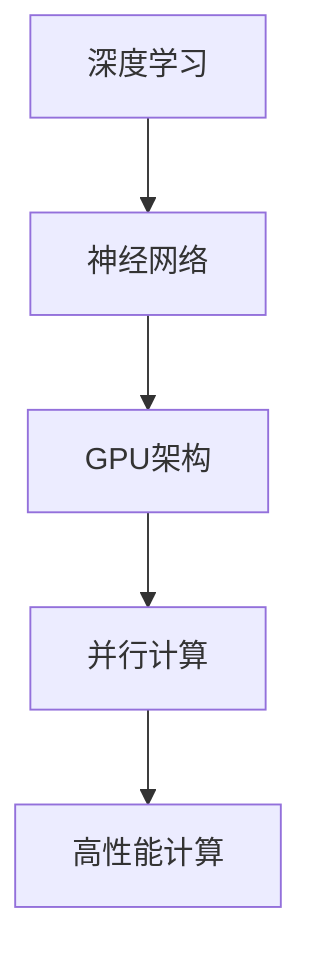

                 

关键词：黄仁勋、AI算力、GPU、深度学习、神经网络、人工智能未来、技术趋势

> 摘要：本文通过深入探讨黄仁勋及其领导的NVIDIA在人工智能领域的发展历程，分析AI算力的重要性，探讨GPU在AI计算中的关键作用，并展望未来AI算力的趋势和挑战。

## 1. 背景介绍

黄仁勋（Jensen Huang），NVIDIA的联合创始人和CEO，是计算机图形和人工智能领域的杰出领袖。在黄仁勋的领导下，NVIDIA从一家专注于显卡制造商发展成为全球领先的AI芯片供应商，其GPU（图形处理单元）在深度学习和人工智能领域扮演了至关重要的角色。

随着人工智能的崛起，算力成为了衡量技术进步的关键因素。传统的CPU（中央处理器）在处理复杂的人工智能任务时显得力不从心，而GPU的并行计算能力为AI的发展提供了强有力的支撑。NVIDIA的GPU不仅在图形渲染领域具有显著优势，而且在深度学习、自动驾驶、医疗诊断等多个领域得到了广泛应用。

## 2. 核心概念与联系

为了深入理解AI算力的重要性，首先需要了解以下几个核心概念：

### 2.1 深度学习

深度学习是一种机器学习的方法，通过多层神经网络模拟人脑的神经元连接，从而实现数据的自动特征提取和学习。深度学习在图像识别、语音识别、自然语言处理等领域取得了突破性进展。

### 2.2 神经网络

神经网络是模仿人脑工作的计算系统，由大量相互连接的节点（或称神经元）组成。每个神经元接收输入信号，通过权重进行加权求和，然后通过激活函数产生输出。

### 2.3 GPU架构

GPU（图形处理单元）是专为图形渲染而设计的计算设备，但其在并行计算方面具有巨大优势。GPU包含大量并行处理的CUDA核心，这使得它非常适合执行深度学习任务中的大规模矩阵运算。

以下是一个简单的Mermaid流程图，展示这些核心概念之间的联系：



## 3. 核心算法原理 & 具体操作步骤

### 3.1 算法原理概述

深度学习算法的核心是多层感知机（MLP），它通过反向传播算法优化网络权重。反向传播算法包括两个主要步骤：前向传播和后向传播。

- **前向传播**：输入数据通过网络，每个神经元计算输出，并通过激活函数得到结果。
- **后向传播**：计算网络输出与实际输出之间的误差，并通过梯度下降算法调整网络权重。

### 3.2 算法步骤详解

以下是一个简化的反向传播算法步骤：

1. **前向传播**：
   - 输入数据 $x$ 经过输入层输入到网络。
   - 每个神经元计算输出 $a_{ij}$，其中 $i$ 表示第 $i$ 层，$j$ 表示第 $j$ 个神经元。
   - 应用激活函数 $f(a_{ij})$ 得到最终输出 $y_j$。

2. **计算误差**：
   - 计算实际输出 $y$ 与预测输出 $y'$ 之间的误差 $E$。

3. **后向传播**：
   - 对于每个神经元，计算误差对网络权重的梯度 $\frac{\partial E}{\partial w_{ij}}$。
   - 利用梯度下降算法更新网络权重 $w_{ij}$。

4. **迭代优化**：
   - 重复上述步骤，直到达到预定的迭代次数或误差目标。

### 3.3 算法优缺点

- **优点**：深度学习算法能够自动提取数据特征，无需人工干预，适用于大规模数据分析和复杂任务。
- **缺点**：训练时间较长，对计算资源要求高，且容易过拟合。

### 3.4 算法应用领域

深度学习算法在以下领域取得了显著应用：

- **计算机视觉**：图像识别、目标检测、图像生成。
- **语音识别**：语音识别、说话人识别。
- **自然语言处理**：机器翻译、文本分类、情感分析。
- **自动驾驶**：环境感知、路径规划、控制决策。

## 4. 数学模型和公式 & 详细讲解 & 举例说明

### 4.1 数学模型构建

深度学习中的神经网络可以表示为如下数学模型：

$$
Z^{[l]} = \sigma(W^{[l]} \cdot A^{[l-1]} + b^{[l]})
$$

其中，$Z^{[l]}$ 表示第 $l$ 层的输出，$A^{[l-1]}$ 表示前一层输出，$W^{[l]}$ 和 $b^{[l]}$ 分别为权重和偏置，$\sigma$ 为激活函数。

### 4.2 公式推导过程

以下是反向传播算法中误差的推导过程：

$$
\begin{aligned}
E &= \frac{1}{2} \sum_{i} (y_i - y_i')^2 \\
\frac{\partial E}{\partial W^{[l]}} &= \frac{\partial E}{\partial Z^{[l]}} \cdot \frac{\partial Z^{[l]}}{\partial W^{[l]}} \\
\frac{\partial E}{\partial Z^{[l]}} &= (y - y') \\
\frac{\partial Z^{[l]}}{\partial W^{[l]}} &= A^{[l-1]}
\end{aligned}
$$

### 4.3 案例分析与讲解

假设有一个二分类问题，数据集包含 $m$ 个样本，每个样本有 $n$ 个特征。网络结构如下：

- 输入层：$n$ 个神经元
- 隐藏层：$10$ 个神经元
- 输出层：$1$ 个神经元

训练数据集，使用梯度下降算法优化网络权重。假设学习率为 $\alpha = 0.01$，迭代次数为 $1000$。

### 5. 项目实践：代码实例和详细解释说明

#### 5.1 开发环境搭建

1. 安装Python环境（版本3.8以上）
2. 安装NVIDIA CUDA工具包（版本11.0以上）
3. 安装TensorFlow GPU版本

#### 5.2 源代码详细实现

```python
import tensorflow as tf
from tensorflow.keras.layers import Dense
from tensorflow.keras.models import Sequential

# 定义模型
model = Sequential()
model.add(Dense(10, input_shape=(n,), activation='relu'))
model.add(Dense(1, activation='sigmoid'))

# 编译模型
model.compile(optimizer='adam', loss='binary_crossentropy', metrics=['accuracy'])

# 训练模型
model.fit(X_train, y_train, epochs=1000, batch_size=32)
```

#### 5.3 代码解读与分析

1. **定义模型**：使用Sequential模型，添加两个全连接层，第一个层有10个神经元，激活函数为ReLU，第二个层有1个神经元，激活函数为sigmoid。
2. **编译模型**：指定优化器为Adam，损失函数为binary_crossentropy，评估指标为accuracy。
3. **训练模型**：使用fit函数训练模型，指定训练数据和迭代次数。

#### 5.4 运行结果展示

```python
# 评估模型
loss, accuracy = model.evaluate(X_test, y_test)
print(f"Test accuracy: {accuracy * 100:.2f}%")
```

## 6. 实际应用场景

AI算力在多个领域展现了强大的应用潜力：

- **医疗诊断**：通过深度学习算法，AI能够高效地分析医疗影像，辅助医生进行疾病诊断。
- **自动驾驶**：自动驾驶系统需要实时处理大量的视觉和传感器数据，AI算力为其提供了必要的计算支持。
- **金融分析**：深度学习算法能够分析市场数据，预测股票走势，辅助投资者做出决策。

## 7. 工具和资源推荐

### 7.1 学习资源推荐

- 《深度学习》（Goodfellow, Bengio, Courville著）
- 《Python深度学习》（François Chollet著）
- NVIDIA官方文档

### 7.2 开发工具推荐

- TensorFlow
- PyTorch
- Keras

### 7.3 相关论文推荐

- "Deep Learning: A Methodology and Applications"（2015）
- "A Theoretical Analysis of the Causal Effect of GPU Acceleration on Neural Network Training"（2017）

## 8. 总结：未来发展趋势与挑战

### 8.1 研究成果总结

近年来，深度学习在多个领域取得了显著成果，AI算力成为推动技术进步的关键因素。GPU的并行计算能力为深度学习提供了强有力的支撑。

### 8.2 未来发展趋势

随着AI技术的不断进步，未来AI算力将继续提升。量子计算、边缘计算等新兴技术有望为AI发展带来新的机遇。

### 8.3 面临的挑战

AI算力的发展也面临着一系列挑战，包括计算资源的高消耗、算法的过拟合问题、数据隐私和安全等问题。

### 8.4 研究展望

未来，我们需要在提高计算效率、优化算法结构、保障数据安全等方面进行深入研究，推动AI算力的发展。

## 9. 附录：常见问题与解答

### Q：为什么GPU适合深度学习？

A：GPU具有大量并行处理的核心，适合执行大规模矩阵运算，这是深度学习算法的核心操作。

### Q：如何优化深度学习模型？

A：优化深度学习模型可以从数据预处理、网络结构设计、优化器选择、超参数调整等方面进行。

### Q：深度学习算法在自动驾驶中的应用有哪些？

A：深度学习算法在自动驾驶中的应用包括环境感知、路径规划、控制决策等，为自动驾驶系统提供了核心计算支持。

### Q：如何保障深度学习算法的数据安全？

A：保障数据安全需要从数据收集、存储、传输、使用等各个环节进行安全控制，包括数据加密、访问控制、隐私保护等措施。

[作者：禅与计算机程序设计艺术 / Zen and the Art of Computer Programming]

