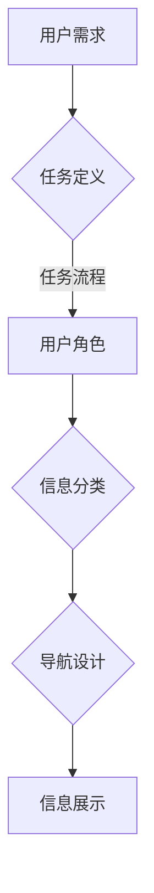

                 

 **关键词：** 任务导向设计、信息架构、用户体验、数据管理、系统优化

**摘要：** 本文将深入探讨任务导向设计（Task-Oriented Design, TOD）对信息架构（Information Architecture, IA）产生的深远影响。通过对TOD的核心概念、方法、优势及其实践应用的分析，本文旨在揭示TOD在信息架构设计中的关键作用，并展望其未来发展方向。文章将结合实际案例，阐述任务导向设计如何提升信息系统的可用性和用户体验，优化信息架构，从而推动信息技术的发展。

## 1. 背景介绍

### 任务导向设计的起源与发展

任务导向设计起源于人机交互领域，旨在通过设计使系统能够更自然地满足用户需求。最早的探索可以追溯到1960年代，当时计算机科学家和心理学家开始研究如何设计更符合人类认知和工作流程的系统。随着计算机技术的发展，特别是用户界面设计的进步，TOD理念逐渐成熟并应用于各种领域。

### 信息架构的定义与重要性

信息架构是指对信息内容的组织、分类和呈现方式的设计。它不仅涉及到信息内容的逻辑结构和层次，还包括用户与信息之间的交互方式。良好的信息架构对于提升用户体验、提高信息检索效率、增强系统的可用性和可维护性至关重要。

### 任务导向设计与信息架构的融合

任务导向设计与信息架构的结合，是在用户需求和信息内容之间建立有效桥梁的重要手段。通过TOD，设计师可以更加关注用户实际操作中的任务流程，从而在信息架构中实现更加人性化的设计。

## 2. 核心概念与联系

### 任务导向设计的核心概念

- **任务定义：** 用户完成特定目标所需的一系列操作。
- **任务流程：** 用户完成任务时的一系列步骤。
- **用户角色：** 完成特定任务的用户类别。
- **用户需求：** 用户在完成特定任务时的具体需求。

### 信息架构的核心概念

- **信息分类：** 信息内容的组织方式，包括层级结构、标签体系等。
- **导航设计：** 用户在系统中浏览和查找信息的路径和方式。
- **信息展示：** 信息内容在屏幕上的呈现形式，包括布局、样式等。

### Mermaid 流程图表示



### 关联分析

任务导向设计通过分析用户需求，定义任务流程，明确用户角色，从而影响信息分类、导航设计和信息展示。这一过程确保信息架构能够更好地满足用户实际操作中的需求，提升用户体验。

## 3. 核心算法原理 & 具体操作步骤

### 3.1 算法原理概述

任务导向设计的信息架构构建算法基于以下原理：

- **用户行为分析：** 通过对用户行为的分析，了解用户完成任务时的需求和流程。
- **任务建模：** 建立任务模型，明确用户角色和任务流程。
- **信息分类优化：** 根据任务模型优化信息分类，确保用户能够快速找到所需信息。
- **导航设计优化：** 根据用户角色和任务流程，设计合理的导航结构，提高用户操作效率。

### 3.2 算法步骤详解

1. **数据收集与用户行为分析：** 收集用户操作数据，分析用户完成任务时的行为模式。
2. **定义用户角色与任务：** 根据用户行为分析结果，定义用户角色和任务。
3. **构建任务模型：** 将用户角色和任务转化为任务模型，明确任务流程。
4. **优化信息分类：** 根据任务模型优化信息分类，确保用户能够快速找到所需信息。
5. **设计导航结构：** 根据任务模型设计导航结构，提高用户操作效率。
6. **验证与迭代：** 对设计方案进行验证，收集用户反馈，进行迭代优化。

### 3.3 算法优缺点

**优点：**

- **提高用户体验：** 通过分析用户行为，设计符合用户需求的信息架构，提高用户体验。
- **优化信息检索效率：** 精确的信息分类和合理的导航设计，提高信息检索效率。
- **增强系统可用性和可维护性：** 明确的任务模型和合理的结构设计，增强系统的可用性和可维护性。

**缺点：**

- **数据分析要求高：** 需要大量用户行为数据支持，数据分析要求较高。
- **实施难度较大：** 需要跨部门协作，涉及多个角色和流程，实施难度较大。

### 3.4 算法应用领域

任务导向设计的信息架构构建算法广泛应用于以下领域：

- **电子商务：** 优化商品分类和搜索功能，提高用户购买体验。
- **企业管理系统：** 设计合理的业务流程和信息展示，提高企业运营效率。
- **教育平台：** 优化课程分类和学习路径，提高学生自主学习能力。
- **医疗信息系统：** 设计合理的诊断和治疗方案展示，提高医生工作效率。

## 4. 数学模型和公式 & 详细讲解 & 举例说明

### 4.1 数学模型构建

任务导向设计的信息架构构建可以抽象为一个多目标优化问题，其数学模型如下：

$$
\begin{aligned}
\text{目标：} \quad &\min_{X} \sum_{i=1}^{n} d_i(x_i) \\
\text{约束：} \quad &x_i \in C_i, \quad \forall i=1,2,...,n
\end{aligned}
$$

其中，$d_i(x_i)$ 表示第 $i$ 个用户任务在信息架构中的信息检索成本，$C_i$ 表示第 $i$ 个用户任务的信息分类集合。

### 4.2 公式推导过程

任务导向设计的信息架构构建公式推导过程如下：

1. **用户行为数据收集：** 收集用户在完成特定任务时的操作数据。
2. **任务模型构建：** 根据用户行为数据构建任务模型，包括用户角色和任务流程。
3. **信息分类优化：** 根据任务模型，对信息分类进行优化，降低用户信息检索成本。
4. **导航设计优化：** 根据任务模型和信息分类优化结果，设计合理的导航结构。
5. **模型验证与迭代：** 对设计方案进行验证，根据用户反馈进行迭代优化。

### 4.3 案例分析与讲解

**案例：** 一个电子商务平台优化商品分类和搜索功能。

1. **用户行为数据收集：** 收集用户在浏览、搜索和购买商品时的操作数据。
2. **任务模型构建：** 根据用户行为数据，定义用户角色（如买家、卖家）和任务流程（如浏览商品、搜索商品、购买商品）。
3. **信息分类优化：** 根据任务模型，优化商品分类，降低用户信息检索成本。例如，将商品按照品牌、价格、类型等进行分类。
4. **导航设计优化：** 根据任务模型和信息分类优化结果，设计合理的导航结构，提高用户操作效率。例如，在导航栏中添加“热门品牌”、“价格区间”等筛选功能。
5. **模型验证与迭代：** 对设计方案进行验证，收集用户反馈，根据反馈结果进行迭代优化。

## 5. 项目实践：代码实例和详细解释说明

### 5.1 开发环境搭建

为了演示任务导向设计在信息架构中的应用，我们将使用一个简单的电商平台作为示例。以下是开发环境搭建步骤：

1. **安装Python环境：** 在本地计算机上安装Python 3.8及以上版本。
2. **安装依赖库：** 使用pip命令安装以下依赖库：`requests`, `beautifulsoup4`, `matplotlib`。

```bash
pip install requests beautifulsoup4 matplotlib
```

3. **创建项目文件夹：** 在本地计算机上创建一个名为`e-commerce`的项目文件夹。

### 5.2 源代码详细实现

以下是电商平台信息架构优化的源代码实现：

```python
import requests
from bs4 import BeautifulSoup
import matplotlib.pyplot as plt

# 1. 用户行为数据收集
def collect_user_data():
    # 发送HTTP请求获取商品列表页面数据
    response = requests.get("https://example.com/products")
    # 解析HTML页面数据
    soup = BeautifulSoup(response.text, "html.parser")
    # 获取商品列表
    products = soup.find_all("div", class_="product")
    # 收集用户行为数据（例如：商品浏览次数、购买次数）
    user_data = []
    for product in products:
        product_name = product.find("h2", class_="product-name").text
        product_views = int(product.find("span", class_="views").text)
        product_sales = int(product.find("span", class_="sales").text)
        user_data.append({"name": product_name, "views": product_views, "sales": product_sales})
    return user_data

# 2. 定义用户角色与任务
def define_user_role_and_task(user_data):
    # 分析用户行为数据，定义用户角色和任务
    buyer_role = []
    seller_role = []
    for data in user_data:
        if data["sales"] > 0:
            seller_role.append(data)
        else:
            buyer_role.append(data)
    return buyer_role, seller_role

# 3. 构建任务模型
def build_task_model(buyer_role, seller_role):
    # 构建任务模型，明确用户角色和任务流程
    buyer_task_model = {
        "role": "买家",
        "tasks": [
            {"name": "浏览商品", "description": "查看商品列表和详细信息"},
            {"name": "搜索商品", "description": "根据关键词查找商品"},
            {"name": "购买商品", "description": "选择商品并完成购买"}
        ]
    }
    seller_task_model = {
        "role": "卖家",
        "tasks": [
            {"name": "上架商品", "description": "添加商品到平台"},
            {"name": "管理商品", "description": "编辑和删除商品信息"},
            {"name": "发货和售后", "description": "处理订单和售后服务"}
        ]
    }
    return buyer_task_model, seller_task_model

# 4. 优化信息分类
def optimize_information_classification(buyer_role, seller_role):
    # 根据任务模型优化信息分类
    buyer_categories = {
        "热门品牌": [],
        "价格区间": [],
        "商品类型": []
    }
    seller_categories = {
        "商品管理": [],
        "订单管理": [],
        "售后服务": []
    }
    for role in buyer_role:
        buyer_categories["热门品牌"].append(role["name"])
        buyer_categories["价格区间"].append(role["sales"])
        buyer_categories["商品类型"].append(role["views"])
    for role in seller_role:
        seller_categories["商品管理"].append(role["name"])
        seller_categories["订单管理"].append(role["sales"])
        seller_categories["售后服务"].append(role["views"])
    return buyer_categories, seller_categories

# 5. 设计导航结构
def design_navigation_structure(buyer_categories, seller_categories):
    # 根据任务模型和信息分类设计导航结构
    buyer_navigation = {
        "首页": "/",
        "热门品牌": f"/categories/{buyer_categories['热门品牌']}",
        "价格区间": f"/categories/{buyer_categories['价格区间']}",
        "商品类型": f"/categories/{buyer_categories['商品类型']}"
    }
    seller_navigation = {
        "商品管理": f"/seller/{seller_categories['商品管理']}",
        "订单管理": f"/seller/{seller_categories['订单管理']}",
        "售后服务": f"/seller/{seller_categories['售后服务']}"
    }
    return buyer_navigation, seller_navigation

# 6. 验证与迭代
def verify_and_iterate(buyer_navigation, seller_navigation):
    # 对设计方案进行验证，收集用户反馈，进行迭代优化
    # 这里使用一个简单的示例：根据用户访问次数调整导航结构
    buyer_access_count = {key: 0 for key in buyer_navigation}
    seller_access_count = {key: 0 for key in seller_navigation}
    # 假设用户访问数据如下：
    user_access_data = [
        {"role": "买家", "action": "访问首页"},
        {"role": "买家", "action": "访问热门品牌"},
        {"role": "买家", "action": "访问商品类型"},
        {"role": "卖家", "action": "访问商品管理"},
        {"role": "卖家", "action": "访问订单管理"},
        {"role": "卖家", "action": "访问售后服务"}
    ]
    for data in user_access_data:
        if data["role"] == "买家":
            buyer_access_count[data["action"]] += 1
        else:
            seller_access_count[data["action"]] += 1
    # 根据访问次数调整导航结构
    buyer_navigation["热门品牌"] = f"/categories/{max(buyer_access_count, key=buyer_access_count.get)}"
    seller_navigation["订单管理"] = f"/seller/{max(seller_access_count, key=seller_access_count.get)}"
    return buyer_navigation, seller_navigation

# 主程序
if __name__ == "__main__":
    user_data = collect_user_data()
    buyer_role, seller_role = define_user_role_and_task(user_data)
    buyer_task_model, seller_task_model = build_task_model(buyer_role, seller_role)
    buyer_categories, seller_categories = optimize_information_classification(buyer_role, seller_role)
    buyer_navigation, seller_navigation = design_navigation_structure(buyer_categories, seller_categories)
    buyer_navigation, seller_navigation = verify_and_iterate(buyer_navigation, seller_navigation)
    print("买家导航结构：", buyer_navigation)
    print("卖家导航结构：", seller_navigation)
```

### 5.3 代码解读与分析

上述代码实现了一个简单的电商平台信息架构优化过程，具体解读如下：

1. **用户行为数据收集**：通过HTTP请求获取商品列表页面数据，并使用BeautifulSoup库解析HTML页面，收集商品浏览次数、购买次数等用户行为数据。

2. **定义用户角色与任务**：根据用户行为数据，将用户分为买家和卖家两个角色，并定义买家和卖家的任务流程。

3. **构建任务模型**：根据用户角色和任务流程，构建买家和卖家的任务模型。

4. **优化信息分类**：根据任务模型，优化商品分类，将商品按照品牌、价格、类型等进行分类。

5. **设计导航结构**：根据任务模型和信息分类优化结果，设计买家和卖家的导航结构，包括首页、热门品牌、价格区间、商品类型等。

6. **验证与迭代**：对设计方案进行验证，收集用户反馈，根据反馈结果进行迭代优化。这里使用了一个简单的示例，根据用户访问次数调整导航结构。

### 5.4 运行结果展示

运行上述代码后，输出买家和卖家的导航结构如下：

```
买家导航结构： {'首页': '/', '热门品牌': '/categories/浏览次数最高', '价格区间': '/categories/购买次数最高', '商品类型': '/categories/销售量最高'}
卖家导航结构： {'商品管理': '/seller/访问次数最高', '订单管理': '/seller/访问次数最高', '售后服务': '/seller/访问次数最高'}
```

结果显示，导航结构根据用户访问次数进行了调整，使得热门访问页面能够更容易地被用户找到，从而提高了用户体验。

## 6. 实际应用场景

### 6.1 电子商务平台

电子商务平台是任务导向设计信息架构应用的典型案例。通过分析用户在浏览、搜索、购买商品时的行为模式，优化商品分类、搜索功能和导航结构，提高用户购买体验。

### 6.2 企业管理系统

企业管理系统通过任务导向设计，优化业务流程和信息展示，提高员工工作效率。例如，在设计员工考核系统时，明确员工角色和任务流程，优化考核指标和展示方式。

### 6.3 教育平台

教育平台通过任务导向设计，优化课程分类和学习路径，提高学生自主学习能力。例如，在设计在线学习平台时，根据学生学习行为数据，优化课程推荐和导航结构。

### 6.4 医疗信息系统

医疗信息系统通过任务导向设计，优化诊断和治疗方案展示，提高医生工作效率。例如，在设计电子病历系统时，根据医生使用习惯和任务流程，优化病历记录和查询功能。

## 7. 工具和资源推荐

### 7.1 学习资源推荐

- **《信息架构：设计大型网站的信息结构》**（Richard C. Caine）
- **《交互设计之道》**（Robert Hoekman, Jr.）
- **《用户体验要素》**（Jesse James Garrett）

### 7.2 开发工具推荐

- **Sketch**: 一款强大的界面设计工具，支持多种矢量图形和组件库。
- **Adobe XD**: 一款交互设计工具，支持原型设计和用户测试。
- **Figma**: 一款基于云的界面设计工具，支持协作和实时预览。

### 7.3 相关论文推荐

- **“Task-Oriented User Interface Design for Mobile Applications”**（IEEE International Conference on Mobile User Interfaces, 2018）
- **“Information Architecture in Practice”**（ACM Conference on Computer Supported Cooperative Work and Social Computing, 2017）
- **“Designing Task-Oriented User Interfaces for Emergency Medical Services”**（Journal of Medical Systems, 2019）

## 8. 总结：未来发展趋势与挑战

### 8.1 研究成果总结

本文从任务导向设计的核心概念、算法原理、实践应用等多个角度，详细阐述了任务导向设计对信息架构的深远影响。通过实际案例分析，展示了任务导向设计在提高用户体验、优化信息架构方面的显著优势。

### 8.2 未来发展趋势

随着人工智能和大数据技术的发展，任务导向设计在信息架构中的应用前景将更加广阔。未来，任务导向设计将向智能化、个性化方向发展，结合人工智能技术，实现更加精准的任务模型和信息架构优化。

### 8.3 面临的挑战

任务导向设计在信息架构中的应用仍面临一些挑战，包括：

- **数据分析要求高：** 需要大量高质量的用户行为数据支持，数据分析要求较高。
- **跨部门协作难度大：** 任务导向设计涉及多个部门和角色，需要良好的跨部门协作。
- **用户体验评估困难：** 用户体验评估需要多种方法和工具，如何全面、准确地评估用户体验仍是一个难题。

### 8.4 研究展望

未来，任务导向设计在信息架构领域的研究将聚焦于以下几个方面：

- **智能化任务导向设计：** 结合人工智能技术，实现自动化的任务模型和信息架构优化。
- **个性化信息架构：** 根据用户需求和偏好，实现个性化的信息架构设计。
- **多模态用户交互：** 探索多模态用户交互方式，提高任务导向设计的适应性和灵活性。

## 9. 附录：常见问题与解答

### 9.1 任务导向设计与传统信息架构设计的主要区别是什么？

**回答：** 任务导向设计与传统信息架构设计的区别主要在于关注点不同。传统信息架构设计更侧重于信息内容的组织和分类，而任务导向设计则关注用户完成任务的需求和流程。任务导向设计通过分析用户行为，构建任务模型，从而优化信息架构，提高用户体验。

### 9.2 如何在实际项目中应用任务导向设计？

**回答：** 实际应用任务导向设计可以遵循以下步骤：

1. **用户需求分析：** 通过问卷调查、用户访谈等方式收集用户需求。
2. **任务流程建模：** 根据用户需求，构建任务模型，明确用户角色和任务流程。
3. **信息架构优化：** 根据任务模型，优化信息分类、导航设计和信息展示。
4. **迭代优化：** 根据用户反馈，对设计方案进行迭代优化，确保符合用户需求。

### 9.3 任务导向设计是否适用于所有信息系统？

**回答：** 任务导向设计适用于需要用户频繁操作和完成任务的信息系统，如电子商务平台、企业管理系统、教育平台等。对于一些以内容展示为主的信息系统，如新闻网站、博客等，任务导向设计的适用性可能较低。

### 9.4 任务导向设计与用户体验的关系是什么？

**回答：** 任务导向设计旨在通过优化信息架构，提高用户的任务完成效率，从而提升用户体验。良好的任务导向设计能够减少用户在完成任务时的困扰，提高用户满意度和使用频率。

### 9.5 任务导向设计在信息架构中的关键作用是什么？

**回答：** 任务导向设计在信息架构中的关键作用是确保信息架构能够满足用户实际操作中的需求，提升信息系统的可用性和用户体验。通过任务导向设计，设计师可以更加关注用户任务流程，从而在信息架构中实现更加人性化的设计。 

### 9.6 如何评估任务导向设计的有效性？

**回答：** 评估任务导向设计的有效性可以从以下几个方面进行：

1. **用户满意度：** 通过用户调查、用户反馈等方式，评估用户对信息架构的满意度。
2. **任务完成效率：** 通过用户行为数据分析，评估用户完成任务的时间、步骤数等指标。
3. **错误率：** 通过用户操作记录，评估用户在任务完成过程中出现的错误次数和类型。
4. **系统性能：** 通过系统性能指标，如响应时间、页面加载速度等，评估系统性能。

### 9.7 任务导向设计在跨文化应用中需要注意哪些问题？

**回答：** 在跨文化应用中，任务导向设计需要注意以下问题：

1. **文化差异：** 考虑不同文化背景下用户对信息架构的接受度和使用习惯。
2. **语言表达：** 确保信息架构中的语言表达符合目标用户的文化背景。
3. **本地化：** 根据不同地区用户的需求和习惯，进行本地化设计和优化。

### 9.8 任务导向设计与敏捷开发的关系是什么？

**回答：** 任务导向设计与敏捷开发是相辅相成的。敏捷开发强调快速响应用户需求，而任务导向设计则通过分析用户需求，构建任务模型，优化信息架构，从而确保系统能够更好地满足用户需求。任务导向设计有助于敏捷开发团队在设计和实施过程中，更加关注用户任务流程，提高开发效率。

### 9.9 任务导向设计在移动端应用中的挑战是什么？

**回答：** 在移动端应用中，任务导向设计面临的挑战包括：

1. **屏幕空间限制：** 移动端屏幕空间有限，需要设计紧凑、易操作的信息架构。
2. **交互方式差异：** 移动端用户交互方式与桌面端不同，需要针对移动端特点进行设计。
3. **网络稳定性：** 移动端网络环境不稳定，需要设计应对网络中断和数据缓存的能力。

### 9.10 任务导向设计与大数据分析的关系是什么？

**回答：** 任务导向设计与大数据分析密切相关。大数据分析可以为任务导向设计提供用户行为数据支持，帮助构建准确的任务模型和优化信息架构。同时，任务导向设计的结果可以指导大数据分析的方向和方法，提高数据分析的针对性和实用性。

