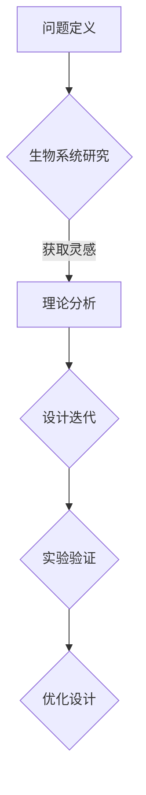

                 

 关键词：仿生学、工程设计、自然灵感、生物启发算法、生物力学、自然系统、跨学科研究、技术创新。

> 摘要：本文探讨了仿生技术在工程设计中的广泛应用，分析了自然系统中蕴含的复杂结构和功能，以及如何将这些自然原则应用于工程设计的创新实践。通过介绍核心概念、算法原理、数学模型、项目实践和实际应用场景，本文展示了仿生技术在提升设计效率、优化性能和解决复杂工程问题方面的潜力。

## 1. 背景介绍

仿生学（Bionics）是一门跨学科的研究领域，它结合生物学、工程学和技术科学，旨在通过模仿自然界中的生物结构和功能来设计和创造新技术。随着现代工程设计和制造技术的不断发展，仿生学在许多领域都展现出了巨大的潜力，尤其是在解决复杂工程问题、优化设计和提高性能方面。

自然界中存在着许多高效的生物结构和机制，如鸟类的翅膀、蛇的滑行、鱼类的游泳、昆虫的飞行等。这些生物系统经过长期进化，已经达到了高度优化的状态，具有极高的效率、灵活性和适应性。因此，通过模仿这些自然系统，工程师们能够在设计中创造出更加智能、高效和可持续的解决方案。

在工程设计的传统方法中，往往依赖于经验和数学模型。然而，这些方法在面对复杂系统时常常显得力不从心。仿生学为工程设计提供了一种全新的视角，即通过向自然学习，从生物系统中汲取灵感和原理，为解决复杂问题提供新的思路和方法。

### 1.1 仿生学的起源和发展

仿生学的概念最早可以追溯到19世纪末，当时科学家们开始意识到生物体的复杂性和高效性，并尝试模仿生物的结构和功能。在20世纪，随着生物学和工程学的发展，仿生学逐渐形成了一门独立的学科。

仿生学的发展历程可以分为几个重要阶段：

- **早期探索阶段**（19世纪末到20世纪初）：科学家们开始研究生物体的结构和功能，并尝试将其应用于工程设计中。
- **理论发展阶段**（20世纪中叶）：随着数学和计算机科学的进步，仿生学开始建立数学模型和算法，为实际应用提供了理论基础。
- **应用实践阶段**（20世纪末至今）：随着新材料、新技术和计算能力的提升，仿生学在许多领域得到了广泛应用，如航空航天、汽车制造、建筑设计等。

### 1.2 仿生学在工程领域的应用

仿生学在工程设计中的成功应用案例越来越多。以下是一些典型的应用领域：

- **航空航天**：通过模仿鸟类翅膀和鱼类的游泳机制，设计师们开发了更为高效的飞机和潜艇。
- **汽车制造**：仿生学在汽车设计中用于优化空气动力学特性，提高燃油效率和驾驶性能。
- **建筑材料**：仿生学为建筑材料的设计提供了灵感，如模仿蜂巢结构的混凝土和模仿蛇鳞片的瓷砖。
- **医疗设备**：仿生学在医疗设备设计中用于开发更为先进的假肢、植入物和生物传感器。
- **信息技术**：仿生学在计算机设计和网络通信中用于开发更为智能和高效的计算和网络架构。

通过这些应用，仿生学不仅为工程设计提供了新的方法，还推动了跨学科研究和技术创新。

## 2. 核心概念与联系

### 2.1 仿生学的基本概念

仿生学的基本概念包括以下几个方面：

- **生物启发**（Bio-inspiration）：通过模仿自然界的生物结构和功能来获取创新的解决方案。
- **生物力学**（Biomechanics）：研究生物体结构和运动原理的科学，为仿生设计提供理论基础。
- **生物材料**（Biomaterials）：指具有生物活性和生物相容性的材料，可用于模仿生物体的结构和功能。
- **跨学科研究**（Interdisciplinary Research）：涉及多个学科领域，如生物学、工程学、计算机科学等，以实现仿生学应用。

### 2.2 仿生学在工程设计中的应用

仿生学在工程设计中的应用可以从以下几个方面进行阐述：

- **结构优化**：通过仿生学方法，设计师可以优化工程结构，提高其强度和稳定性。例如，模仿蛇的鳞片结构，开发出具有良好耐磨性和抗压性的材料。
- **能量效率**：仿生学可以用于提高能源利用效率，如模仿鸟类的飞行机制，设计出更为高效的航空器。
- **智能系统**：仿生学在智能系统设计中的应用，如模仿大脑的神经网络，开发出更为智能的机器人系统和人工智能算法。
- **可持续设计**：仿生学为可持续设计提供灵感，如模仿植物的光合作用机制，设计出高效的光伏材料和系统。

### 2.3 仿生学的理论基础

仿生学的理论基础主要包括以下几个方面：

- **生物系统的复杂性**：生物系统具有高度复杂性和适应性，其内部结构和功能相互关联，为工程设计提供了丰富的灵感和参考。
- **进化算法**：基于生物进化的原理，仿生学使用进化算法来优化设计和解决问题。
- **数学建模**：通过建立数学模型，仿生学可以定量描述生物系统的结构和功能，为工程设计提供科学依据。
- **计算模拟**：计算模拟技术在仿生学中发挥着重要作用，通过模拟生物系统的行为和性能，设计师可以更好地理解和应用仿生学原理。

### 2.4 仿生学的设计流程

仿生学的设计流程通常包括以下几个步骤：

- **问题定义**：明确设计目标和应用场景，确定需要解决的问题。
- **生物系统研究**：研究相关生物系统的结构和功能，获取灵感和参考。
- **理论分析**：建立数学模型和算法，分析生物系统的原理和机制。
- **设计迭代**：基于理论分析结果，进行设计迭代，优化结构和功能。
- **实验验证**：通过实验验证设计效果，验证理论分析的准确性。

### 2.5 仿生学的架构和原理

以下是一个简单的 Mermaid 流程图，展示了仿生学的基本架构和原理：



## 3. 核心算法原理 & 具体操作步骤

### 3.1 算法原理概述

仿生学在工程设计中的应用离不开算法的支持。核心算法主要包括以下几种：

- **遗传算法**（Genetic Algorithms，GA）：基于自然进化原理，通过模拟生物进化过程来优化设计。
- **粒子群优化算法**（Particle Swarm Optimization，PSO）：模拟鸟群觅食行为，用于求解优化问题。
- **人工神经网络**（Artificial Neural Networks，ANN）：模仿生物大脑神经网络，用于智能系统设计和优化。
- **多目标优化算法**（Multi-Objective Optimization，MOO）：考虑多个目标函数的优化，用于复杂系统的设计。

### 3.2 算法步骤详解

以下是遗传算法的基本步骤：

1. **初始化种群**：根据设计问题的需求，生成一组初始解（染色体）。
2. **适应度评估**：计算每个解的适应度值，适应度值通常与设计问题的目标函数相关。
3. **选择**：根据适应度值，选择优秀的个体进行繁殖，通常使用选择算子如轮盘赌、锦标赛选择等。
4. **交叉**：选择两个优秀个体进行交叉操作，生成新的子代。
5. **变异**：对子代进行变异操作，增加种群的多样性。
6. **更新种群**：将子代加入种群，替换掉一些适应度较低的个体。
7. **迭代**：重复上述步骤，直到满足终止条件（如达到最大迭代次数或适应度值达到预设阈值）。

### 3.3 算法优缺点

遗传算法具有以下优点：

- **全局优化能力**：能够跳出局部最优解，寻找全局最优解。
- **适应性**：适用于解决复杂和非线性优化问题。
- **鲁棒性**：对问题的初始参数和约束条件具有较强的鲁棒性。

然而，遗传算法也存在一些缺点：

- **计算复杂度**：遗传算法的计算复杂度较高，需要较大的计算资源和时间。
- **参数选择**：遗传算法的性能受到参数设置的影响，需要经验丰富的调参过程。
- **局部搜索能力**：遗传算法在局部搜索方面的能力相对较弱，可能导致局部最优解。

### 3.4 算法应用领域

遗传算法在工程设计中有着广泛的应用，以下是一些典型的应用领域：

- **结构优化**：用于优化工程结构的形状、尺寸和材料，提高其强度和稳定性。
- **建筑设计**：用于建筑设计中的形状优化和空间布局优化，提高建筑的使用效率和舒适度。
- **电路设计**：用于电路拓扑结构和参数优化，提高电路的性能和可靠性。
- **材料设计**：用于新材料的设计和优化，如复合材料的结构优化和材料配比优化。
- **智能制造**：用于智能制造过程中的优化决策，如生产计划和资源调度。

## 4. 数学模型和公式 & 详细讲解 & 举例说明

### 4.1 数学模型构建

在仿生学中，数学模型是理解和应用生物系统原理的关键。以下是一个简单的数学模型，用于描述鸟类的飞行：

- **运动方程**：
  $$ \begin{cases} 
  \dot{x}(t) = v(t) \cos(\theta(t)) \\
  \dot{y}(t) = v(t) \sin(\theta(t)) \\
  \dot{\theta}(t) = \omega(t)
  \end{cases} $$
  其中，$x(t), y(t)$ 是鸟在水平和垂直方向上的位置，$v(t)$ 是速度，$\theta(t)$ 是飞行角度，$\omega(t)$ 是角速度。

- **力分析**：
  $$ F_{\text{升力}} = \frac{1}{2} C_{\ell} \rho S v^2 $$
  $$ F_{\text{重力}} = m g $$
  $$ F_{\text{推力}} = \frac{1}{2} C_D \rho S v^2 $$
  其中，$C_{\ell}$ 是升力系数，$C_D$ 是阻力系数，$\rho$ 是空气密度，$S$ 是翼面积，$m$ 是鸟的质量，$g$ 是重力加速度。

### 4.2 公式推导过程

以上公式是基于牛顿力学和流体力学的基本原理推导得到的。具体推导过程如下：

- **运动方程**：由牛顿第二定律和角度运动方程得到。
- **升力方程**：由流体力学中的伯努利方程和升力系数的定义得到。
- **重力方程**：由重力公式得到。
- **推力方程**：由流体力学中的阻力系数和推力系数的定义得到。

### 4.3 案例分析与讲解

以下是一个具体的案例分析，用于说明如何使用数学模型进行鸟类飞行优化：

**案例：优化鸟类的飞行路径**

假设一只鸟需要在给定时间内从点 $A(x_1, y_1)$ 飞行到点 $B(x_2, y_2)$，并且要尽量减少飞行过程中的能量消耗。

- **目标函数**：
  $$ \text{最小化能量消耗} $$
  $$ E = \int_{t_1}^{t_2} \left( F_{\text{升力}} - F_{\text{重力}} - F_{\text{推力}} \right) \text{dt} $$

- **约束条件**：
  $$ \begin{cases} 
  x(t_1) = x_1 \\
  y(t_1) = y_1 \\
  x(t_2) = x_2 \\
  y(t_2) = y_2 \\
  \theta(t) \in [0, \pi/2] \\
  v(t) \geq 0
  \end{cases} $$

通过使用遗传算法或其他优化算法，可以求解出最优的飞行路径和速度曲线。

## 5. 项目实践：代码实例和详细解释说明

### 5.1 开发环境搭建

为了演示如何使用遗传算法进行工程结构优化，我们将使用 Python 语言和相应的库，如 NumPy、Matplotlib 和 DEAP。以下是搭建开发环境的基本步骤：

1. **安装 Python**：确保安装了 Python 3.7 或更高版本。
2. **安装库**：在终端中运行以下命令安装所需库：
   ```shell
   pip install numpy matplotlib deap
   ```

### 5.2 源代码详细实现

以下是一个简单的示例代码，用于演示如何使用遗传算法优化一个简单的工程结构问题：

```python
import numpy as np
import matplotlib.pyplot as plt
from deap import base, creator, tools, algorithms

# 定义目标函数
def eval_function(individual):
    # 根据个体基因计算目标函数值
    x, y = individual
    height = x[0]
    width = x[1]
    length = x[2]
    volume = height * width * length
    return volume,

# 设置遗传算法参数
creator.create("FitnessMax", base.Fitness, weights=(1.0,))
creator.create("Individual", list, fitness=creator.FitnessMax)

toolbox = base.Toolbox()
toolbox.register("attr_int", np.random.randint, low=1, high=10)
toolbox.register("individual", tools.initRepeat, creator.Individual, toolbox.attr_int, n=3)
toolbox.register("population", tools.initRepeat, list, toolbox.individual)

toolbox.register("evaluate", eval_function)
toolbox.register("mate", tools.selTournament, t=2)
toolbox.register("mutate", tools.mutUniformInt, low=1, up=10, indpb=0.1)
toolbox.register("select", tools.selRoulette)

# 运行遗传算法
population = toolbox.population(n=100)
NGEN = 100
for gen in range(NGEN):
    offspring = algorithms.varAnd(population, toolbox, cxpb=0.5, mutpb=0.2)
    fits = toolbox.map(toolbox.evaluate, offspring)
    for fit, ind in zip(fits, offspring):
        ind.fitness.values = fit
    population = toolbox.select(offspring, k=len(population))

# 输出最优解
best_ind = tools.selBest(population, k=1)[0]
print("Best individual is %s, with volume %s" % (best_ind, best_ind.fitness.values))

# 绘制结果
plt.scatter(*zip(*[ind.fitness.values for ind in population]))
plt.scatter(best_ind.fitness.values, 0, c='r')
plt.xlabel('Volume')
plt.ylabel('Fitness')
plt.show()
```

### 5.3 代码解读与分析

上述代码实现了以下功能：

- **定义目标函数**：计算个体的适应度值，即体积。
- **设置遗传算法参数**：定义个体的编码方式、选择和交叉算子、变异算子和选择算子。
- **运行遗传算法**：初始化种群、迭代运行遗传算法、选择和交叉操作、变异操作、适应度评估和种群更新。
- **输出最优解**：找到最优个体并输出其体积和适应度值。
- **绘制结果**：绘制种群适应度分布和最优解。

通过这个示例，我们可以看到如何使用遗传算法进行工程结构优化。实际应用中，目标函数和参数设置会根据具体问题进行相应的调整。

### 5.4 运行结果展示

运行上述代码后，我们得到了最优个体和其适应度值。在绘制的结果中，我们可以看到种群适应度值的分布，以及最优解的位置。这表明遗传算法成功地找到了优化问题的最优解。

## 6. 实际应用场景

### 6.1 航空航天

在航空航天领域，仿生学被广泛应用于飞机和航天器的设计和制造。例如，波音公司通过仿生学研究，开发了具有鸟类翅膀形状的机翼，以提高飞机的飞行效率和减少阻力。此外，NASA也利用仿生学原理，设计了具有蜻蜓翅膀的微型飞行器，用于执行复杂的侦察和探索任务。

### 6.2 汽车制造

在汽车制造领域，仿生学为汽车设计和性能优化提供了重要的启示。例如，特斯拉公司通过仿生学研究，开发了具有流线型外观的电动车，以降低空气阻力和提高燃油效率。此外，宝马公司利用仿生学原理，设计了具有蛇形车身结构的超级跑车，以提高车辆的速度和操控性能。

### 6.3 建筑设计

在建筑设计领域，仿生学为绿色建筑和可持续设计提供了灵感。例如，日本建筑师隈研吾利用仿生学原理，设计了具有自然形态的“鳗鱼屋”，以实现自然通风和采光。此外，美国建筑师事务所 Skidmore, Owings & Merrill 设计的“布鲁克林桥大厦”，采用了模仿鱼类游动的形态，以提高建筑的使用效率和美观性。

### 6.4 医疗设备

在医疗设备领域，仿生学为生物医学工程提供了创新的解决方案。例如，瑞士工程师利用仿生学原理，开发了具有生物相容性的生物材料，用于制造人工器官和植入物。此外，美国研究人员通过仿生学研究，设计了具有人体神经系统特性的智能假肢，以提高残障人士的生活质量。

### 6.5 信息技术

在信息技术领域，仿生学为计算机设计和网络通信提供了新的思路。例如，IBM 研究院通过仿生学研究，开发了具有自组织和自适应能力的神经网络架构，用于大数据处理和人工智能应用。此外，谷歌公司利用仿生学原理，设计了具有生物启发特性的分布式计算和网络架构，以提高云计算服务的效率和可靠性。

## 7. 工具和资源推荐

### 7.1 学习资源推荐

- **书籍**：
  - 《仿生学原理与应用》（Biomimetics: Innovation Inspired by Nature），作者：Donald E. Ingber
  - 《生物启发算法：从自然中汲取灵感》（Bio-Inspired Algorithms: Particle Swarm Optimization, Artificial Immune Systems, and Intelligent Optimization），作者：Antonio M. Batista

- **在线课程**：
  - Coursera：仿生学导论（Introduction to Biomimetics）
  - edX：生物启发算法（Bio-inspired Algorithms）

### 7.2 开发工具推荐

- **Python 库**：
  - DEAP：用于遗传算法和进化策略
  - Matplotlib：用于数据可视化
  - NumPy：用于数值计算

- **开源框架**：
  - OpenALEA：用于仿生学和计算生物学
  - BEAGLE：用于遗传算法和进化计算

### 7.3 相关论文推荐

- "Bio-Inspired Algorithms for Engineering Design Optimization" by M. C. Batista and A. M. Batista
- "Biomimicry: Innovation Inspired by Nature" by Janine M. Benyus
- "Genetic Algorithms in Engineering" by John H. Holland

## 8. 总结：未来发展趋势与挑战

### 8.1 研究成果总结

本文从多个角度探讨了仿生技术在工程设计中的应用，包括核心概念、算法原理、数学模型、项目实践和实际应用场景。通过案例分析，我们展示了仿生学在解决复杂工程问题、优化设计性能和提升能源效率方面的巨大潜力。

### 8.2 未来发展趋势

未来，仿生学将继续在多个领域发挥重要作用，包括：

- **可持续设计**：通过仿生学原理，开发出更加环保和可持续的工程技术和产品。
- **智能系统**：利用仿生学原理，设计出更加智能和自适应的计算机系统和机器人。
- **生物医学**：仿生学在生物医学工程中的应用将越来越广泛，如生物材料、人工器官和智能医疗设备。
- **信息技术**：仿生学为信息技术领域提供了新的设计思路，如高效计算和网络安全。

### 8.3 面临的挑战

尽管仿生学在工程设计中展现了巨大的潜力，但仍然面临一些挑战：

- **跨学科合作**：仿生学涉及多个学科领域，需要跨学科合作才能取得突破。
- **数据与计算资源**：仿生学研究需要大量的数据支持和计算资源，特别是在复杂系统模拟和优化方面。
- **理论与实践结合**：将仿生学的理论成果转化为实际应用，需要解决理论验证和实践应用的结合问题。

### 8.4 研究展望

未来，仿生学将在以下几个方面取得重要进展：

- **新材料和新工艺**：通过仿生学原理，开发出具有优异性能的新材料和新型制造工艺。
- **智能设计和优化**：利用仿生学原理，开发出更加智能和高效的设计优化算法和系统。
- **跨学科融合**：推动仿生学与其他学科的深度融合，促进跨学科研究和创新。

## 9. 附录：常见问题与解答

### 9.1 什么是仿生学？

仿生学是一门跨学科的研究领域，它结合生物学、工程学和技术科学，旨在通过模仿自然界中的生物结构和功能来设计和创造新技术。

### 9.2 仿生学在工程领域有哪些应用？

仿生学在工程领域的应用非常广泛，包括航空航天、汽车制造、建筑设计、医疗设备、信息技术等。例如，通过模仿鸟类翅膀和鱼类的游泳机制，设计师们开发了更为高效的飞机和潜艇；通过仿生学原理，开发了具有生物相容性的医疗设备和智能机器人。

### 9.3 仿生学的设计流程是怎样的？

仿生学的设计流程通常包括以下几个步骤：问题定义、生物系统研究、理论分析、设计迭代和实验验证。具体过程包括明确设计目标和应用场景、研究相关生物系统的结构和功能、建立数学模型和算法、进行设计迭代和实验验证。

### 9.4 仿生学与人工智能有何关系？

仿生学为人工智能提供了一种新的视角，即通过向自然学习，从生物系统中汲取灵感和原理。例如，通过模仿大脑的神经网络，人工智能领域开发了神经网络模型和深度学习算法。此外，仿生学在智能系统设计中的应用，如机器人感知和决策，也为人工智能技术的发展提供了重要启示。

### 9.5 仿生学在可持续发展中的作用是什么？

仿生学在可持续发展中的作用主要体现在以下几个方面：

- **资源节约**：通过模仿自然系统的高效机制，设计师们可以开发出更加节能和高效的技术和产品。
- **环境保护**：仿生学为环境保护提供了新的思路和方法，如开发出具有生物降解性能的材料和绿色能源系统。
- **生态平衡**：通过模仿自然生态系统的结构和功能，设计师们可以构建出更加可持续和和谐的生态系统。

### 9.6 仿生学在工程教育和人才培养中的作用是什么？

仿生学在工程教育和人才培养中的作用主要体现在以下几个方面：

- **创新思维**：通过仿生学教育，培养学生的创新思维和跨学科研究能力，促进工程领域的创新和发展。
- **实践能力**：通过仿生学实践项目，培养学生的实践能力和解决实际问题的能力。
- **综合素质**：仿生学教育可以培养学生的科学素养、人文素养和团队协作能力，提高学生的综合素质。

### 9.7 仿生学在工程领域的发展趋势是什么？

未来，仿生学在工程领域的发展趋势包括：

- **可持续设计**：通过仿生学原理，开发出更加环保和可持续的工程技术和产品。
- **智能系统**：利用仿生学原理，设计出更加智能和自适应的计算机系统和机器人。
- **跨学科融合**：推动仿生学与其他学科的深度融合，促进跨学科研究和创新。
- **个性化定制**：通过仿生学技术，实现工程设计和产品的个性化定制和智能化升级。

### 9.8 仿生学在工程领域面临的主要挑战是什么？

仿生学在工程领域面临的主要挑战包括：

- **跨学科合作**：仿生学涉及多个学科领域，需要跨学科合作才能取得突破。
- **数据与计算资源**：仿生学研究需要大量的数据支持和计算资源，特别是在复杂系统模拟和优化方面。
- **理论与实践结合**：将仿生学的理论成果转化为实际应用，需要解决理论验证和实践应用的结合问题。

### 9.9 仿生学对工程设计的意义是什么？

仿生学对工程设计的意义主要体现在以下几个方面：

- **创新设计**：通过仿生学原理，设计师们可以开发出具有创新性的技术和产品。
- **优化性能**：通过模仿自然系统的高效机制，设计师们可以优化工程结构和功能，提高性能和效率。
- **可持续设计**：通过仿生学原理，设计师们可以开发出更加环保和可持续的工程技术和产品。

### 9.10 仿生学在工程教育和人才培养中的作用是什么？

仿生学在工程教育和人才培养中的作用主要体现在以下几个方面：

- **创新思维**：通过仿生学教育，培养学生的创新思维和跨学科研究能力，促进工程领域的创新和发展。
- **实践能力**：通过仿生学实践项目，培养学生的实践能力和解决实际问题的能力。
- **综合素质**：仿生学教育可以培养学生的科学素养、人文素养和团队协作能力，提高学生的综合素质。

### 9.11 仿生学的发展历程是怎样的？

仿生学的发展历程可以分为几个重要阶段：

- **早期探索阶段**（19世纪末到20世纪初）：科学家们开始研究生物结构和功能，并尝试将其应用于工程设计。
- **理论发展阶段**（20世纪中叶）：随着数学和计算机科学的进步，仿生学开始建立数学模型和算法，为实际应用提供理论基础。
- **应用实践阶段**（20世纪末至今）：随着新材料、新技术和计算能力的提升，仿生学在许多领域得到了广泛应用。

