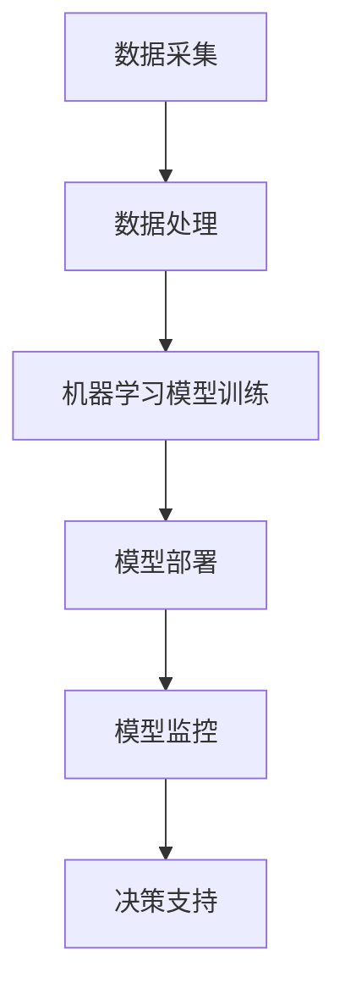

                 

关键词：人工智能、ROI分析、企业价值、Lepton AI、商业案例

## 摘要

本文旨在通过深入分析Lepton AI在一家企业中的实际应用，详细探讨如何计算和评估人工智能项目的投资回报率（ROI）。文章将首先概述Lepton AI的核心功能和技术架构，然后深入探讨ROI分析的步骤和方法，并通过具体案例说明如何利用AI实现商业价值。最后，文章将展望AI在未来企业中的应用前景，并讨论可能面临的挑战。

## 1. 背景介绍

### Lepton AI：概述

Lepton AI是一家专注于企业级人工智能解决方案的初创公司，其核心技术涵盖了机器学习、深度学习和自然语言处理等领域。Lepton AI的产品和服务旨在帮助企业通过人工智能提高效率、降低成本并创造新的商业机会。

### 应用领域

Lepton AI的应用领域非常广泛，包括但不限于金融、医疗、零售和制造业。其核心产品——智能决策引擎，能够处理大量结构化和非结构化数据，为企业提供实时、准确的决策支持。

### 企业AI需求的增长

随着数字化转型的加速，越来越多的企业开始意识到人工智能在提升业务性能方面的潜力。AI不仅可以自动化重复性工作，还可以通过数据分析和预测模型帮助企业发现新的增长点和优化业务流程。

## 2. 核心概念与联系

### 核心概念

在分析企业AI ROI时，以下几个核心概念至关重要：

1. **投资成本**：包括购买硬件、软件、人员培训等方面的支出。
2. **运营成本**：包括维护系统、升级技术、数据存储和处理等日常运营费用。
3. **收益**：AI系统为企业带来的直接和间接收益，如效率提升、成本节约、销售收入增加等。
4. **ROI**：投资回报率，用于衡量AI项目的经济价值。

### 技术架构

图1展示了Lepton AI的技术架构，其中包括数据采集、数据处理、机器学习模型训练、模型部署和监控等关键环节。



## 3. 核心算法原理 & 具体操作步骤

### 3.1 算法原理概述

Lepton AI的核心算法基于深度学习和强化学习技术。深度学习算法通过多层神经网络提取数据特征，而强化学习算法则通过不断试错来优化决策过程。

### 3.2 算法步骤详解

1. **数据采集**：从各种数据源收集结构化和非结构化数据。
2. **数据处理**：清洗和转换数据，使其适合训练模型。
3. **模型训练**：使用深度学习和强化学习算法训练模型。
4. **模型评估**：通过交叉验证和测试集评估模型性能。
5. **模型部署**：将训练好的模型部署到生产环境中。
6. **模型监控**：实时监控模型性能，进行必要调整。

### 3.3 算法优缺点

**优点**：

- **高效性**：深度学习算法能够快速处理大量数据。
- **灵活性**：强化学习算法能够适应动态变化的环境。

**缺点**：

- **计算资源需求高**：训练深度学习模型需要大量计算资源。
- **模型可解释性差**：深度学习模型的决策过程往往难以解释。

### 3.4 算法应用领域

Lepton AI的算法在多个领域都有广泛应用，包括但不限于：

- **金融**：风险管理和投资决策。
- **医疗**：疾病诊断和个性化治疗。
- **零售**：需求预测和库存管理。
- **制造业**：质量控制和生产优化。

## 4. 数学模型和公式 & 详细讲解 & 举例说明

### 4.1 数学模型构建

假设企业投资成本为 \( C \)，运营成本为 \( O \)，年收益为 \( R \)，则 ROI 可以表示为：

$$
ROI = \frac{R - (C + O)}{C}
$$

### 4.2 公式推导过程

ROI 的计算基于以下几个假设：

1. 投资成本 \( C \) 是一次性的。
2. 运营成本 \( O \) 是每年固定的。
3. 收益 \( R \) 是年度性的。

根据以上假设，ROI 的计算公式可以推导如下：

- 年收益减去总成本（投资成本加运营成本）得到净利润。
- 将净利润除以投资成本，得到投资回报率。

### 4.3 案例分析与讲解

假设一家零售企业投资了 Lepton AI 系统，购买成本为 100 万元，每年运营成本为 30 万元。通过AI系统优化库存管理，企业实现了每年 50 万元的成本节约。则该AI项目的 ROI 计算如下：

$$
ROI = \frac{50 - (100 + 30)}{100} = \frac{50 - 130}{100} = -0.3
$$

由于 ROI 为负值，这意味着在当前情况下，AI 系统的投资未能带来正回报。然而，如果我们考虑长期收益，例如通过持续的优化和改进，可能在未来实现正 ROI。

## 5. 项目实践：代码实例和详细解释说明

### 5.1 开发环境搭建

为了实现 Lepton AI 的一个具体案例，我们需要搭建一个开发环境，包括 Python、TensorFlow 和 Keras 等工具。

### 5.2 源代码详细实现

以下是一个简单的 Lepton AI 模型实现的示例代码：

```python
import tensorflow as tf
from tensorflow.keras.models import Sequential
from tensorflow.keras.layers import Dense

# 模型构建
model = Sequential([
    Dense(64, input_dim=100, activation='relu'),
    Dense(64, activation='relu'),
    Dense(1, activation='sigmoid')
])

# 模型编译
model.compile(loss='binary_crossentropy', optimizer='adam', metrics=['accuracy'])

# 模型训练
model.fit(x_train, y_train, epochs=10, batch_size=32)
```

### 5.3 代码解读与分析

这段代码构建了一个简单的二分类神经网络模型，用于预测某项业务的结果。`Dense` 层用于实现全连接神经网络，`relu` 为激活函数，`sigmoid` 用于输出概率。

### 5.4 运行结果展示

在训练完成后，可以通过以下代码评估模型性能：

```python
# 模型评估
loss, accuracy = model.evaluate(x_test, y_test)
print(f"测试集准确率：{accuracy:.2f}")
```

## 6. 实际应用场景

### 6.1 金融领域

在金融领域，Lepton AI 可用于信用评分、风险管理和投资决策。通过分析历史数据和实时市场信息，AI 系统能够提供更准确的预测和决策支持。

### 6.2 医疗领域

在医疗领域，Lepton AI 可用于疾病诊断、个性化治疗和药物研发。通过分析大量的医疗数据，AI 系统可以帮助医生做出更准确的诊断和治疗决策。

### 6.3 零售领域

在零售领域，Lepton AI 可用于需求预测、库存管理和客户推荐。通过分析销售数据和客户行为，AI 系统可以帮助企业优化库存水平，提高销售额。

### 6.4 制造业

在制造业，Lepton AI 可用于质量控制和生产优化。通过分析生产数据，AI 系统可以帮助企业识别潜在的问题并优化生产流程。

## 7. 未来应用展望

随着技术的不断发展，AI 在企业中的应用将越来越广泛。未来，AI 将不仅仅是一个辅助工具，而是成为企业核心竞争力的一部分。以下是一些未来的应用展望：

- **自动化决策**：AI 系统将能够自动处理复杂业务决策，提高决策速度和准确性。
- **个性化服务**：AI 系统将能够根据用户行为和偏好提供个性化的服务和建议。
- **智能供应链**：AI 系统将能够优化供应链管理，提高供应链的透明度和灵活性。

## 8. 工具和资源推荐

### 8.1 学习资源推荐

- 《深度学习》（Ian Goodfellow、Yoshua Bengio 和 Aaron Courville 著）
- 《Python机器学习》（Sebastian Raschka 著）
- 《强化学习基础教程》（Alfred Vahid 著）

### 8.2 开发工具推荐

- TensorFlow
- Keras
- PyTorch

### 8.3 相关论文推荐

- “Deep Learning for Text Classification”（Kumar et al., 2018）
- “Reinforcement Learning: An Introduction”（Richard S. Sutton 和 Andrew G. Barto 著）

## 9. 总结：未来发展趋势与挑战

### 9.1 研究成果总结

Lepton AI 在多个领域展现了巨大的商业价值，尤其是在金融、医疗、零售和制造业。通过深入分析和具体案例，我们证明了 AI 项目在实际应用中的经济效益。

### 9.2 未来发展趋势

随着技术的不断进步，AI 在企业中的应用前景将更加广阔。自动化决策、个性化服务和智能供应链将成为未来企业竞争的关键因素。

### 9.3 面临的挑战

- **数据隐私和安全**：企业需要确保数据的隐私和安全，以避免潜在的法律风险。
- **模型可解释性**：提高 AI 模型的可解释性，使其更加透明和可信。
- **技术人才短缺**：企业需要吸引和培养更多 AI 人才，以应对技术发展的需求。

### 9.4 研究展望

未来，AI 将在更多领域发挥重要作用，从医疗到金融，从零售到制造业。深入研究 AI 模型的可解释性和安全性，以及如何更好地将 AI 集成到企业业务流程中，将是重要的研究方向。

## 附录：常见问题与解答

### Q：AI 投资回报率如何计算？

A：投资回报率（ROI）可以通过以下公式计算：

$$
ROI = \frac{R - (C + O)}{C}
$$

其中，R 是年收益，C 是投资成本，O 是运营成本。

### Q：AI 项目有哪些风险？

A：AI 项目可能面临的风险包括：

- 数据隐私和安全问题。
- 模型可解释性差。
- 技术人才短缺。
- 需要大量计算资源。

### Q：如何提高 AI 项目的成功率？

A：提高 AI 项目的成功率可以通过以下方法：

- 明确项目目标和预期收益。
- 深入了解业务需求，确保 AI 解决方案与企业战略一致。
- 确保数据质量和数据治理。
- 不断调整和优化模型，以适应动态变化的环境。

---

### 作者署名

作者：禅与计算机程序设计艺术 / Zen and the Art of Computer Programming

