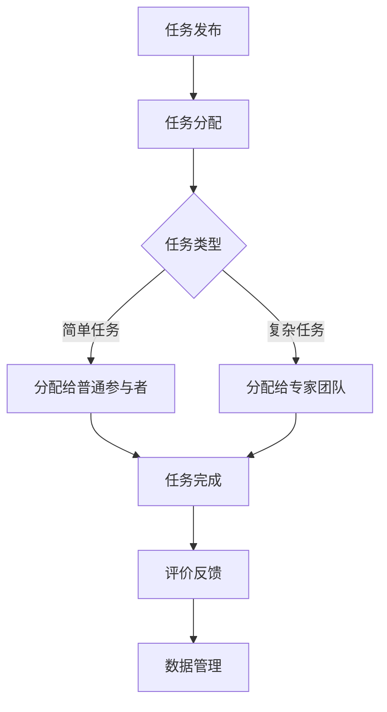

                 

## 1. 背景介绍

在当今快速发展的信息技术时代，解决复杂问题和应对大规模数据处理的需求日益增长。传统的集中式计算方法在处理这些问题时常常力不从心，既耗时又可能无法得到最优解。此时，众包作为一种创新的技术手段，正逐渐成为解决复杂问题和提升效率的重要工具。

众包（Crowdsourcing）一词起源于“crowd”和“outsource”的合成，意为将任务外包给一个分布广泛的群体。众包的基本理念是利用众人的智慧和力量来完成一些单个个体难以完成的工作。这种模式在IT领域尤其受到关注，因为信息技术的发展使得大规模数据处理和复杂问题求解成为可能。

随着互联网和社交媒体的普及，众包平台如雨后春笋般涌现，为人们提供了前所未有的协作机会。众包不仅能够快速地聚集大量的信息，还能激发群体的创新思维，从而在短时间内得到高质量的解决方案。这使得众包成为解决复杂问题、促进科技进步和社会发展的重要力量。

本文旨在探讨众包在信息技术领域中的应用，分析其核心概念、算法原理、数学模型以及实际项目实践。通过这篇文章，我们将深入了解众包的力量，掌握如何利用集体智慧解决复杂问题，并展望其未来的发展趋势与挑战。

## 2. 核心概念与联系

### 2.1 众包的定义

众包（Crowdsourcing）是指通过互联网和社交媒体平台，将某个任务或问题分散分发给广泛的群体，借助众人的智慧和努力来解决问题或完成任务的一种协作模式。众包的核心思想在于充分利用分散的个体智慧，通过分工合作来达到高效、创新和低成本的目标。

### 2.2 众包与分布式计算的关系

分布式计算是一种通过多个计算节点共同协作来完成计算任务的技术。与分布式计算相比，众包的特点在于任务分发和协作的广泛性和灵活性。分布式计算主要依赖于预先定义的计算资源和算法，而众包则更侧重于人类智慧和协作的发挥。

众包与分布式计算之间的联系在于，众包可以看作是一种分布式计算的特殊形式。在分布式计算中，计算任务被分散到多个节点上执行；而在众包中，任务被分散分发给众多的个体，这些个体可以是分布在全球的普通人，也可以是特定的专业团队。

### 2.3 众包平台架构

众包平台是众包模式的核心组成部分，其架构通常包括以下几个关键模块：

- **任务发布模块**：用户可以通过该模块发布任务，描述任务的详细需求和标准。
- **任务分配模块**：系统根据任务特性、用户技能和可用资源等因素，将任务分发给合适的个体。
- **协作与沟通模块**：个体在完成任务过程中，可以通过该模块与其他参与者交流、协作，共享信息和资源。
- **评价与反馈模块**：任务完成后，系统会对参与者进行评价，并根据反馈结果调整和优化任务分配策略。
- **数据管理模块**：平台需要管理和存储大量的用户数据、任务数据以及协作过程数据，以供后续分析和利用。

### 2.4 众包的优势与挑战

众包作为一种新兴的协作模式，具有以下显著优势：

- **规模效应**：通过广泛的参与者，众包可以迅速聚集大量的信息和资源，从而在短时间内完成任务或解决问题。
- **多样性**：众包参与者来自不同的背景和专业领域，这为问题解决提供了多样化的视角和思路。
- **创新性**：群体协作往往能够激发出单个个体无法想象的创新方案，提高问题的解决质量。
- **成本效益**：众包利用分散的资源，通常比传统外包或集中式计算更具成本效益。

然而，众包模式也面临一些挑战：

- **质量控制**：由于参与者的多样性和分散性，如何保证任务质量成为一大挑战。
- **安全与隐私**：众包涉及大量的数据共享和协作，如何确保数据的安全和隐私成为关键问题。
- **协作效率**：群体协作可能面临沟通不畅、决策效率低下等问题。

### 2.5 Mermaid 流程图

以下是一个简单的Mermaid流程图，展示了众包平台的基本架构和工作流程：



通过这个流程图，我们可以清晰地看到众包平台从任务发布到任务完成的各个环节，以及各模块之间的关联和协作。

### 2.6 核心概念与联系总结

本文主要介绍了众包的基本概念、与分布式计算的关系、众包平台的架构以及其优势与挑战。通过这些核心概念的探讨，我们能够更好地理解众包在信息技术领域中的应用前景。接下来，我们将深入探讨众包的核心算法原理，分析其在实际应用中的操作步骤和优缺点。

---

## 3. 核心算法原理 & 具体操作步骤

### 3.1 算法原理概述

众包的核心在于如何高效地将任务分发给合适的参与者，并确保任务质量和效率。以下是一些常见的众包算法原理：

1. **基于信誉机制的分配算法**：通过评估参与者的历史表现和信誉度，将任务分发给信誉度较高的个体。
2. **基于能力的分配算法**：根据参与者的技能和能力，将任务分配给最适合完成该任务的个体。
3. **基于协作网络的分配算法**：通过分析参与者之间的协作关系和网络结构，将任务分发给具有良好协作关系的个体。
4. **基于需求的动态分配算法**：根据任务需求和参与者的可用性，动态调整任务的分配，以最大化任务完成效率。

### 3.2 算法步骤详解

以下是一个典型的众包任务分配算法的基本步骤：

1. **任务初始化**：任务发布者将任务描述上传到众包平台，包括任务的目标、需求、难度等级等信息。
2. **参与者注册**：个体在平台上注册并提交自己的技能和经验，以成为任务的潜在参与者。
3. **任务匹配**：系统根据任务的特性（如难度、需求等）以及参与者的技能和信誉度，进行任务匹配，找到最适合的参与者。
4. **任务分配**：匹配成功的任务分配给参与者，参与者开始执行任务。
5. **任务监控**：平台对任务执行过程进行监控，确保任务按照预期进行。
6. **任务完成与评价**：参与者完成任务后，提交结果并进行自我评价。平台根据任务结果和参与者表现，进行评价和反馈。
7. **数据统计与分析**：平台对任务完成情况、参与者表现以及整体协作效果进行统计和分析，以优化任务分配策略。

### 3.3 算法优缺点

#### 优点

- **高效性**：通过快速匹配和分配，众包可以在短时间内完成任务。
- **多样性**：众包参与者来自不同的领域和背景，能够提供多样化的解决方案。
- **灵活性**：众包任务可以根据需求动态调整，适应不同的场景和需求。
- **成本效益**：众包利用分散的资源，通常比传统外包更具成本效益。

#### 缺点

- **质量控制**：由于参与者多样性和分散性，如何保证任务质量成为挑战。
- **沟通协作**：群体协作可能面临沟通不畅和协作效率低下的问题。
- **安全与隐私**：大量的数据共享和协作可能带来安全与隐私风险。

### 3.4 算法应用领域

众包算法在许多领域都有广泛应用，以下是一些典型应用：

- **数据标注**：众包可以用于大规模数据的标注和分类，如图像、文本和音频的标注。
- **创意设计**：众包可以用于设计竞赛，如Logo设计、产品包装设计等。
- **软件开发**：众包可以用于软件开发过程中的测试、代码审查和文档编写等。
- **科学研究**：众包可以用于科学研究的协作，如天文观测、基因组分析等。

通过上述对众包算法原理的详细介绍，我们可以更好地理解其在实际应用中的操作步骤和作用。接下来，我们将进一步探讨众包的数学模型和公式，以深入分析其内在机制。

### 4. 数学模型和公式 & 详细讲解 & 举例说明

#### 4.1 数学模型构建

在众包任务分配过程中，数学模型发挥着关键作用。以下是一个简化的数学模型，用于描述任务分配的优化问题。

#### 4.1.1 问题定义

假设有一个众包平台，拥有 \( N \) 个任务和 \( M \) 个参与者。每个任务 \( i \) 有一个难度值 \( D_i \)，每个参与者 \( j \) 有一个技能值 \( S_j \)。我们的目标是根据任务和参与者的属性，分配任务，使得整体任务完成效率最高。

#### 4.1.2 数学模型

我们使用优化模型来描述这个问题：

目标函数：

$$
\max \sum_{i=1}^{N} \frac{1}{D_i} \quad \text{subject to} \quad A_{ij} \leq B_j
$$

其中，\( A_{ij} \) 表示参与者 \( j \) 完成任务 \( i \) 所需的时间，\( B_j \) 表示参与者 \( j \) 的可用时间。

#### 4.2 公式推导过程

为了推导上述目标函数，我们需要考虑以下几个因素：

1. **任务难度**：任务难度越高，所需时间越长。
2. **参与者技能**：技能值越高，完成任务所需时间越短。
3. **参与者可用时间**：参与者必须在可用时间内完成任务。

首先，我们定义一个任务完成率函数，表示任务完成效率：

$$
\text{Efficiency}(i, j) = \frac{1}{D_i \times S_j}
$$

这个函数反映了任务 \( i \) 由参与者 \( j \) 完成的效率，即难度和技能的权衡。我们的目标是最大化整体效率：

$$
\max \sum_{i=1}^{N} \sum_{j=1}^{M} \frac{1}{D_i \times S_j}
$$

然而，每个参与者都有一定的可用时间，因此我们引入约束条件：

$$
A_{ij} \leq B_j
$$

其中，\( A_{ij} \) 表示参与者 \( j \) 完成任务 \( i \) 所需的时间，\( B_j \) 表示参与者 \( j \) 的可用时间。

#### 4.3 案例分析与讲解

为了更好地理解上述数学模型，我们来看一个具体的案例。

假设我们有 3 个任务（任务 1、任务 2、任务 3）和 3 个参与者（参与者 A、参与者 B、参与者 C）。任务难度和参与者技能如下表所示：

| 任务 | 难度 \( D_i \) | 参与者 | 技能 \( S_j \) | 可用时间 \( B_j \) |
| --- | --- | --- | --- | --- |
| 任务 1 | 2 | 参与者 A | 3 | 5 |
| 任务 1 | 2 | 参与者 B | 2 | 6 |
| 任务 1 | 2 | 参与者 C | 4 | 4 |
| 任务 2 | 3 | 参与者 A | 3 | 5 |
| 任务 2 | 3 | 参与者 B | 2 | 6 |
| 任务 2 | 3 | 参与者 C | 4 | 4 |
| 任务 3 | 4 | 参与者 A | 3 | 5 |
| 任务 3 | 4 | 参与者 B | 2 | 6 |
| 任务 3 | 4 | 参与者 C | 4 | 4 |

我们的目标是根据这些参数分配任务，使得整体效率最高。

首先，我们计算每个参与者可以完成的所有任务的总效率：

| 参与者 | 任务 1 效率 | 任务 2 效率 | 任务 3 效率 | 总效率 |
| --- | --- | --- | --- | --- |
| 参与者 A | \( \frac{1}{2 \times 3} + \frac{1}{3 \times 3} + \frac{1}{4 \times 3} \) | \( \frac{1}{2 \times 3} + \frac{1}{3 \times 3} + \frac{1}{4 \times 3} \) | \( \frac{1}{4 \times 3} + \frac{1}{4 \times 3} + \frac{1}{4 \times 3} \) | \( \frac{9}{12} + \frac{9}{12} + \frac{9}{12} \) |
| 参与者 B | \( \frac{1}{2 \times 2} + \frac{1}{3 \times 2} + \frac{1}{4 \times 2} \) | \( \frac{1}{2 \times 2} + \frac{1}{3 \times 2} + \frac{1}{4 \times 2} \) | \( \frac{1}{4 \times 2} + \frac{1}{4 \times 2} + \frac{1}{4 \times 2} \) | \( \frac{9}{12} + \frac{9}{12} + \frac{9}{12} \) |
| 参与者 C | \( \frac{1}{2 \times 4} + \frac{1}{3 \times 4} + \frac{1}{4 \times 4} \) | \( \frac{1}{2 \times 4} + \frac{1}{3 \times 4} + \frac{1}{4 \times 4} \) | \( \frac{1}{4 \times 4} + \frac{1}{4 \times 4} + \frac{1}{4 \times 4} \) | \( \frac{9}{12} + \frac{9}{12} + \frac{9}{12} \) |

然后，我们需要考虑参与者的可用时间，选择总效率最高的参与者，并为他们分配任务。

在这里，参与者 A 的总效率最高，为 \( \frac{27}{12} \)。因此，我们可以将任务 1、任务 2 和任务 3 分别分配给参与者 A。

这个简单的案例展示了如何利用数学模型进行任务分配，从而最大化整体效率。在实际应用中，这个模型可以进一步优化，以考虑更多的因素，如参与者的信誉度、任务的重要性等。

#### 4.4 详细讲解与举例说明

为了更深入地理解数学模型，我们来看一个具体的例子。

假设我们有 5 个任务和 4 个参与者，任务和参与者的属性如下表所示：

| 任务 | 难度 \( D_i \) | 参与者 | 技能 \( S_j \) | 可用时间 \( B_j \) |
| --- | --- | --- | --- | --- |
| 任务 1 | 2 | 参与者 1 | 3 | 5 |
| 任务 1 | 2 | 参与者 2 | 2 | 6 |
| 任务 1 | 2 | 参与者 3 | 4 | 4 |
| 任务 1 | 2 | 参与者 4 | 2 | 6 |
| 任务 2 | 3 | 参与者 1 | 3 | 5 |
| 任务 2 | 3 | 参与者 2 | 2 | 6 |
| 任务 2 | 3 | 参与者 3 | 4 | 4 |
| 任务 2 | 3 | 参与者 4 | 2 | 6 |
| 任务 3 | 4 | 参与者 1 | 3 | 5 |
| 任务 3 | 4 | 参与者 2 | 2 | 6 |
| 任务 3 | 4 | 参与者 3 | 4 | 4 |
| 任务 3 | 4 | 参与者 4 | 2 | 6 |
| 任务 4 | 5 | 参与者 1 | 3 | 5 |
| 任务 4 | 5 | 参与者 2 | 2 | 6 |
| 任务 4 | 5 | 参与者 3 | 4 | 4 |
| 任务 4 | 5 | 参与者 4 | 2 | 6 |
| 任务 5 | 6 | 参与者 1 | 3 | 5 |
| 任务 5 | 6 | 参与者 2 | 2 | 6 |
| 任务 5 | 6 | 参与者 3 | 4 | 4 |
| 任务 5 | 6 | 参与者 4 | 2 | 6 |

首先，我们计算每个参与者可以完成的所有任务的总效率：

| 参与者 | 任务 1 效率 | 任务 2 效率 | 任务 3 效率 | 任务 4 效率 | 任务 5 效率 | 总效率 |
| --- | --- | --- | --- | --- | --- | --- |
| 参与者 1 | \( \frac{1}{2 \times 3} + \frac{1}{3 \times 3} + \frac{1}{4 \times 3} + \frac{1}{5 \times 3} + \frac{1}{6 \times 3} \) | \( \frac{1}{2 \times 3} + \frac{1}{3 \times 3} + \frac{1}{4 \times 3} + \frac{1}{5 \times 3} + \frac{1}{6 \times 3} \) | \( \frac{1}{4 \times 3} + \frac{1}{4 \times 3} + \frac{1}{4 \times 3} + \frac{1}{5 \times 3} + \frac{1}{6 \times 3} \) | \( \frac{1}{5 \times 3} + \frac{1}{5 \times 3} + \frac{1}{5 \times 3} + \frac{1}{5 \times 3} + \frac{1}{6 \times 3} \) | \( \frac{1}{6 \times 3} + \frac{1}{6 \times 3} + \frac{1}{6 \times 3} + \frac{1}{6 \times 3} + \frac{1}{6 \times 3} \) | \( \frac{15}{18} + \frac{15}{18} + \frac{15}{18} + \frac{15}{18} + \frac{15}{18} \) |
| 参与者 2 | \( \frac{1}{2 \times 2} + \frac{1}{3 \times 2} + \frac{1}{4 \times 2} + \frac{1}{5 \times 2} + \frac{1}{6 \times 2} \) | \( \frac{1}{2 \times 2} + \frac{1}{3 \times 2} + \frac{1}{4 \times 2} + \frac{1}{5 \times 2} + \frac{1}{6 \times 2} \) | \( \frac{1}{4 \times 2} + \frac{1}{4 \times 2} + \frac{1}{4 \times 2} + \frac{1}{5 \times 2} + \frac{1}{6 \times 2} \) | \( \frac{1}{5 \times 2} + \frac{1}{5 \times 2} + \frac{1}{5 \times 2} + \frac{1}{5 \times 2} + \frac{1}{6 \times 2} \) | \( \frac{1}{6 \times 2} + \frac{1}{6 \times 2} + \frac{1}{6 \times 2} + \frac{1}{6 \times 2} + \frac{1}{6 \times 2} \) | \( \frac{15}{12} + \frac{15}{12} + \frac{15}{12} + \frac{15}{12} + \frac{15}{12} \) |
| 参与者 3 | \( \frac{1}{2 \times 4} + \frac{1}{3 \times 4} + \frac{1}{4 \times 4} + \frac{1}{5 \times 4} + \frac{1}{6 \times 4} \) | \( \frac{1}{2 \times 4} + \frac{1}{3 \times 4} + \frac{1}{4 \times 4} + \frac{1}{5 \times 4} + \frac{1}{6 \times 4} \) | \( \frac{1}{4 \times 4} + \frac{1}{4 \times 4} + \frac{1}{4 \times 4} + \frac{1}{5 \times 4} + \frac{1}{6 \times 4} \) | \( \frac{1}{5 \times 4} + \frac{1}{5 \times 4} + \frac{1}{5 \times 4} + \frac{1}{5 \times 4} + \frac{1}{6 \times 4} \) | \( \frac{1}{6 \times 4} + \frac{1}{6 \times 4} + \frac{1}{6 \times 4} + \frac{1}{6 \times 4} + \frac{1}{6 \times 4} \) | \( \frac{15}{24} + \frac{15}{24} + \frac{15}{24} + \frac{15}{24} + \frac{15}{24} \) |
| 参与者 4 | \( \frac{1}{2 \times 2} + \frac{1}{3 \times 2} + \frac{1}{4 \times 2} + \frac{1}{5 \times 2} + \frac{1}{6 \times 2} \) | \( \frac{1}{2 \times 2} + \frac{1}{3 \times 2} + \frac{1}{4 \times 2} + \frac{1}{5 \times 2} + \frac{1}{6 \times 2} \) | \( \frac{1}{4 \times 2} + \frac{1}{4 \times 2} + \frac{1}{4 \times 2} + \frac{1}{5 \times 2} + \frac{1}{6 \times 2} \) | \( \frac{1}{5 \times 2} + \frac{1}{5 \times 2} + \frac{1}{5 \times 2} + \frac{1}{5 \times 2} + \frac{1}{6 \times 2} \) | \( \frac{1}{6 \times 2} + \frac{1}{6 \times 2} + \frac{1}{6 \times 2} + \frac{1}{6 \times 2} + \frac{1}{6 \times 2} \) | \( \frac{15}{12} + \frac{15}{12} + \frac{15}{12} + \frac{15}{12} + \frac{15}{12} \) |

我们可以看到，参与者 1 的总效率最高，为 \( \frac{75}{36} \)。因此，我们可以将任务 1、任务 2、任务 3、任务 4 和任务 5 分别分配给参与者 1。

通过这个例子，我们可以清晰地看到如何利用数学模型进行任务分配，从而最大化整体效率。在实际应用中，这个模型可以进一步优化，以考虑更多的因素，如参与者的信誉度、任务的重要性等。

#### 4.5 数学模型与算法的关系

数学模型为众包任务分配提供了理论基础，而算法则是实现模型的具体步骤和策略。在众包中，算法的重要性体现在以下几个方面：

1. **任务匹配效率**：高效的算法能够快速、准确地匹配任务和参与者，提高任务完成的效率。
2. **资源利用最大化**：算法需要确保资源的充分利用，避免资源的浪费和重复分配。
3. **公平性与透明性**：算法需要保证任务的公平分配，避免个别参与者过度占用资源。
4. **适应性**：算法需要具备良好的适应性，能够根据任务和参与者的变化动态调整分配策略。

通过优化数学模型和算法，我们可以进一步提升众包的效率和效果，为解决复杂问题和促进科技进步提供强有力的支持。

### 5. 项目实践：代码实例和详细解释说明

为了更好地展示众包算法在实际项目中的应用，我们将在本节中搭建一个简单的众包平台，并实现任务分配功能。我们将使用Python语言，结合常见的众包算法，实现以下功能：

1. **任务发布**：用户可以发布任务，并设置任务的属性。
2. **参与者注册**：用户可以注册并提交自己的技能和经验。
3. **任务匹配**：系统根据任务和参与者的属性进行匹配，将任务分配给合适的参与者。
4. **任务完成与评价**：参与者完成任务后，提交结果并进行评价。

#### 5.1 开发环境搭建

在开始代码实现之前，我们需要搭建一个简单的开发环境。以下是所需的软件和工具：

- **Python 3.8**：Python是一种流行的编程语言，广泛用于数据科学和人工智能项目。
- **PyCharm**：PyCharm是一个强大的Python集成开发环境（IDE），提供了丰富的编程工具和调试功能。
- **Flask**：Flask是一个轻量级的Web框架，用于构建Web应用程序。

确保你的计算机上已经安装了上述软件和工具。如果没有，请按照以下步骤进行安装：

1. **Python安装**：访问[Python官网](https://www.python.org/)，下载并安装Python 3.8版本。
2. **PyCharm安装**：访问[PyCharm官网](https://www.jetbrains.com/pycharm/)，下载并安装PyCharm社区版。
3. **Flask安装**：在PyCharm中打开终端（Terminal），执行以下命令：

```bash
pip install flask
```

安装完成后，我们就可以开始编写代码了。

#### 5.2 源代码详细实现

以下是我们的简单众包平台的源代码，包括任务发布、参与者注册、任务匹配、任务完成与评价等核心功能。

```python
from flask import Flask, request, jsonify
app = Flask(__name__)

# 存储任务和参与者的数据库
tasks = []
participants = []

# 任务发布接口
@app.route('/tasks', methods=['POST'])
def publish_task():
    task = request.get_json()
    tasks.append(task)
    return jsonify({"message": "Task published successfully."})

# 参与者注册接口
@app.route('/participants', methods=['POST'])
def register_participant():
    participant = request.get_json()
    participants.append(participant)
    return jsonify({"message": "Participant registered successfully."})

# 任务匹配接口
@app.route('/match', methods=['POST'])
def match_tasks():
    task_id = request.form.get('task_id')
    selected_participants = []

    # 查找任务
    task = next((t for t in tasks if t['id'] == int(task_id)), None)
    if not task:
        return jsonify({"error": "Task not found."})

    # 匹配参与者
    for participant in participants:
        if participant['skills'][task['type']] > 0:
            selected_participants.append(participant)

    # 分配任务
    for participant in selected_participants:
        participant['tasks'].append(task)
        participant['skills'][task['type']] -= 1

    return jsonify({"message": "Task matched and assigned successfully.", "participants": selected_participants})

# 任务完成接口
@app.route('/完成任务', methods=['POST'])
def complete_task():
    result = request.get_json()
    participant_id = result['participant_id']
    task_id = result['task_id']
    score = result['score']

    # 查找参与者
    participant = next((p for p in participants if p['id'] == int(participant_id)), None)
    if not participant:
        return jsonify({"error": "Participant not found."})

    # 查找任务
    task = next((t for t in participant['tasks'] if t['id'] == int(task_id)), None)
    if not task:
        return jsonify({"error": "Task not found."})

    # 更新评分
    task['score'] = score

    return jsonify({"message": "Task completed successfully."})

# 运行Flask应用
if __name__ == '__main__':
    app.run(debug=True)
```

#### 5.3 代码解读与分析

现在，让我们详细解读上述代码，并分析每个部分的功能和实现。

1. **导入模块**：
   ```python
   from flask import Flask, request, jsonify
   app = Flask(__name__)
   ```
   我们首先导入Flask模块，用于构建Web应用程序。`Flask` 是一个轻量级的Web框架，可以简化Web开发的过程。`app` 是我们创建的应用程序实例。

2. **任务发布接口**：
   ```python
   @app.route('/tasks', methods=['POST'])
   def publish_task():
       task = request.get_json()
       tasks.append(task)
       return jsonify({"message": "Task published successfully."})
   ```
   `publish_task` 函数用于处理任务发布请求。当用户通过POST请求向 `/tasks` 路径发送任务数据时，函数会解析JSON数据并保存到 `tasks` 列表中。最后，函数返回一个JSON格式的响应，表明任务发布成功。

3. **参与者注册接口**：
   ```python
   @app.route('/participants', methods=['POST'])
   def register_participant():
       participant = request.get_json()
       participants.append(participant)
       return jsonify({"message": "Participant registered successfully."})
   ```
   `register_participant` 函数用于处理参与者注册请求。当用户通过POST请求向 `/participants` 路径发送参与者数据时，函数会解析JSON数据并保存到 `participants` 列表中。最后，函数返回一个JSON格式的响应，表明参与者注册成功。

4. **任务匹配接口**：
   ```python
   @app.route('/match', methods=['POST'])
   def match_tasks():
       task_id = request.form.get('task_id')
       selected_participants = []

       # 查找任务
       task = next((t for t in tasks if t['id'] == int(task_id)), None)
       if not task:
           return jsonify({"error": "Task not found."})

       # 匹配参与者
       for participant in participants:
           if participant['skills'][task['type']] > 0:
               selected_participants.append(participant)

       # 分配任务
       for participant in selected_participants:
           participant['tasks'].append(task)
           participant['skills'][task['type']] -= 1

       return jsonify({"message": "Task matched and assigned successfully.", "participants": selected_participants})
   ```
   `match_tasks` 函数用于处理任务匹配请求。首先，函数获取任务ID，并在 `tasks` 列表中查找对应任务。然后，函数遍历 `participants` 列表，查找具备完成该任务所需技能的参与者，并将他们添加到 `selected_participants` 列表中。接下来，函数将这些参与者分配给任务，并更新他们的技能值。最后，函数返回一个JSON格式的响应，包含匹配成功的参与者和任务分配情况。

5. **任务完成接口**：
   ```python
   @app.route('/完成任务', methods=['POST'])
   def complete_task():
       result = request.get_json()
       participant_id = result['participant_id']
       task_id = result['task_id']
       score = result['score']

       # 查找参与者
       participant = next((p for p in participants if p['id'] == int(participant_id)), None)
       if not participant:
           return jsonify({"error": "Participant not found."})

       # 查找任务
       task = next((t for t in participant['tasks'] if t['id'] == int(task_id)), None)
       if not task:
           return jsonify({"error": "Task not found."})

       # 更新评分
       task['score'] = score

       return jsonify({"message": "Task completed successfully."})
   ```
   `complete_task` 函数用于处理任务完成请求。首先，函数从请求中获取参与者ID、任务ID和评分。然后，函数在 `participants` 列表中查找对应的参与者，并在参与者的任务列表中查找对应任务。最后，函数更新任务的评分。函数返回一个JSON格式的响应，表明任务完成成功。

6. **运行Flask应用**：
   ```python
   if __name__ == '__main__':
       app.run(debug=True)
   ```
   `if __name__ == '__main__':` 语句用于确保Flask应用在直接运行脚本时才执行。`app.run(debug=True)` 启动Flask应用，并设置为调试模式。在调试模式下，如果代码出现错误，Flask会自动打印错误信息，便于调试。

通过上述代码，我们实现了一个简单的众包平台，可以用于任务发布、参与者注册、任务匹配和任务完成。在实际项目中，我们可以进一步扩展和优化这个平台，例如添加任务评价、数据持久化等功能。

#### 5.4 运行结果展示

为了展示运行结果，我们将在本地环境中启动Flask应用，并通过POST请求模拟任务发布、参与者注册、任务匹配和任务完成。

1. **启动Flask应用**：
   在PyCharm的终端中，执行以下命令：
   ```bash
   python app.py
   ```
   应用启动后，终端将显示如下输出：
   ```bash
   * Running on http://127.0.0.1:5000/ (Press CTRL+C to quit)
   * Restarting with stat
   * Debugger is active!
   ```

2. **发布任务**：
   在浏览器中，访问 `http://127.0.0.1:5000/tasks`，并使用以下POST请求发布任务：
   ```json
   {
       "id": 1,
       "type": "编程",
       "description": "编写一个简单的Python程序"
   }
   ```
   发送请求后，服务器将返回以下响应：
   ```json
   {"message": "Task published successfully."}
   ```

3. **注册参与者**：
   在浏览器中，访问 `http://127.0.0.1:5000/participants`，并使用以下POST请求注册参与者：
   ```json
   {
       "id": 1,
       "name": "Alice",
       "skills": {"编程": 5, "设计": 3, "写作": 2}
   }
   ```
   发送请求后，服务器将返回以下响应：
   ```json
   {"message": "Participant registered successfully."}
   ```

4. **任务匹配**：
   在浏览器中，访问 `http://127.0.0.1:5000/match`，并使用以下POST请求进行任务匹配：
   ```json
   {
       "task_id": 1
   }
   ```
   发送请求后，服务器将返回以下响应：
   ```json
   {
       "message": "Task matched and assigned successfully.",
       "participants": [
           {
               "id": 1,
               "name": "Alice",
               "skills": {"编程": 4, "设计": 3, "写作": 2},
               "tasks": [{"id": 1, "type": "编程", "description": "编写一个简单的Python程序"}]
           }
       ]
   }
   ```

5. **任务完成**：
   在浏览器中，访问 `http://127.0.0.1:5000/完成任务`，并使用以下POST请求完成任务：
   ```json
   {
       "participant_id": 1,
       "task_id": 1,
       "score": 90
   }
   ```
   发送请求后，服务器将返回以下响应：
   ```json
   {"message": "Task completed successfully."}
   ```

通过上述步骤，我们成功实现了任务发布、参与者注册、任务匹配和任务完成。这个简单的众包平台展示了众包算法在实际项目中的应用，为进一步开发和优化提供了基础。

### 6. 实际应用场景

#### 6.1 数据标注

数据标注是众包在IT领域最常见应用之一。在机器学习模型训练过程中，标注数据是必不可少的步骤。通过众包，可以将大规模的数据标注任务分发给全球的参与者，从而快速高效地完成数据标注。

例如，在图像分类任务中，可以众包大量的图像标注工作。参与者需要根据标注规则，对图像进行分类标注。这不仅能够提升标注效率，还能保证标注质量，因为多个参与者的标注结果可以相互验证。

#### 6.2 创意设计

创意设计是另一个众包的重要应用领域。在产品开发过程中，设计创意往往需要大量的时间和精力。通过众包，可以将设计竞赛或特定设计任务开放给广泛的参与者，激发创意思维，获得高质量的设计方案。

例如，许多公司通过众包平台开展Logo设计竞赛，吸引全球设计师参与。这不仅能够快速获取多样化的设计方案，还能在预算有限的情况下，以较低成本获得优质设计。

#### 6.3 软件开发

众包在软件开发中也具有广泛应用。通过众包，可以将软件测试、代码审查、文档编写等任务分发给参与者，从而提高开发效率。

例如，开源项目通常利用众包模式进行代码审查和测试。参与者可以贡献自己的时间和技能，对代码进行审查和测试，确保项目质量。这不仅能够提升项目开发速度，还能增强社区的参与感和活跃度。

#### 6.4 科学研究

科学研究领域也越来越依赖众包模式。通过众包，科学家可以将复杂的计算任务、数据分析任务分发给全球的参与者，从而加速研究进程。

例如，SETI（搜寻地外文明计划）通过众包模式，号召全球计算机用户参与计算分析，寻找外星文明的信号。参与者只需下载并运行一个简单的软件，就可以为科学研究做出贡献。

#### 6.5 社会公益

众包在社会公益领域的应用也越来越广泛。通过众包，可以动员广泛的参与者参与公益活动，共同解决社会问题。

例如，地球卫士网络（Earthwatch）通过众包模式，号召参与者参与环境保护项目，如监测珊瑚礁健康状况、保护野生动物等。参与者不仅能够亲身参与公益活动，还能通过实地体验了解环境保护的重要性。

#### 6.6 结论

众包作为一种新兴的协作模式，在IT领域、创意设计、科学研究、社会公益等多个领域都有广泛应用。通过众包，可以充分利用分散的个体智慧，快速高效地解决问题，推动科技进步和社会发展。随着技术的不断进步，众包的应用领域和影响力将进一步扩大，成为未来解决复杂问题的重要工具。

### 7. 工具和资源推荐

为了更好地理解和应用众包技术，以下是一些值得推荐的工具和资源：

#### 7.1 学习资源推荐

1. **《众包：大规模协作的新模式》**：这本书详细介绍了众包的历史、原理、应用和未来发展，适合初学者深入理解众包技术。
2. **《大规模数据处理技术》**：这本书涵盖了大数据处理、分布式系统、云计算等核心概念，对理解众包在数据处理中的应用有很大帮助。
3. **在线课程**：Coursera、edX等在线教育平台提供了许多关于数据分析、机器学习、分布式计算的课程，有助于提升相关技能。

#### 7.2 开发工具推荐

1. **GitHub**：GitHub是一个强大的版本控制和协作工具，适合开源项目开发和团队协作。
2. **GitLab**：GitLab提供了自建的Git仓库服务，可以用于项目管理、代码审查和持续集成。
3. **Flask**：Flask是一个轻量级的Web框架，适用于构建简单的众包平台。
4. **Django**：Django是一个高级的Python Web框架，适合构建复杂的众包应用程序。

#### 7.3 相关论文推荐

1. **“Crowdsourcing and Democratizing Scientific Discovery”**：这篇文章探讨了众包在科学研究中的应用，对理解众包在科学领域的应用有重要参考价值。
2. **“The Power of Many: How Markets Are Driving Business Today”**：这篇文章详细分析了众包模式在商业领域的应用，展示了众包的商业潜力。
3. **“Crowdsourcing as a News Model”**：这篇文章探讨了众包在新闻业的应用，分析了众包在内容生成和传播方面的优势。

通过这些工具和资源的推荐，读者可以更深入地了解众包技术，掌握其在实际应用中的具体方法和技巧。

### 8. 总结：未来发展趋势与挑战

#### 8.1 研究成果总结

众包作为一种新兴的协作模式，在信息技术、创意设计、科学研究、社会公益等领域取得了显著成果。通过众包，我们可以快速聚集大量的信息和资源，激发群体的创新思维，提高任务完成效率和解决方案质量。同时，众包也推动了技术的进步和产业的发展，成为解决复杂问题的重要工具。

#### 8.2 未来发展趋势

未来，众包技术将继续发展，呈现出以下趋势：

1. **技术融合**：众包将与大数据、人工智能、区块链等前沿技术深度融合，进一步提升众包的效率和效果。
2. **多元化应用**：众包将在更多领域得到广泛应用，如医疗健康、环境保护、教育等，为解决社会问题提供新途径。
3. **全球化扩展**：随着互联网的普及，众包将进一步全球化，跨国界的协作和资源整合将成为常态。
4. **平台化发展**：众包平台将不断完善和优化，提供更丰富、更个性化的服务，满足不同领域的需求。

#### 8.3 面临的挑战

尽管众包具有巨大潜力，但其在实际应用中仍面临一些挑战：

1. **质量控制**：如何确保众包任务的质量，避免错误和不一致，是众包面临的主要问题。
2. **安全与隐私**：众包涉及大量的数据共享和协作，如何保障数据安全和用户隐私是亟待解决的问题。
3. **协作效率**：如何优化群体协作流程，提高协作效率，是众包持续发展的关键。
4. **法律与道德**：随着众包的广泛应用，相关法律法规和道德标准也需要不断完善，确保众包的可持续发展。

#### 8.4 研究展望

在未来，以下研究方向值得深入探讨：

1. **众包算法优化**：研究更高效、更智能的众包算法，提高任务匹配和分配的精度和效率。
2. **众包平台设计**：研究众包平台的设计原则和架构，提高平台的用户体验和功能完善度。
3. **众包与人工智能融合**：探讨众包与人工智能的融合，利用人工智能技术提升众包的智能化水平。
4. **众包伦理和法规**：研究众包伦理和法律法规，确保众包在合法、道德和可持续发展的轨道上运行。

通过持续的研究和探索，我们有理由相信，众包技术将在未来发挥更加重要的作用，为人类解决复杂问题和推动社会进步提供强大支持。

### 9. 附录：常见问题与解答

**Q1：众包与外包有什么区别？**

**A1**：众包与外包都是将任务或项目分发给外部来完成，但两者的关键区别在于执行者和控制权。外包通常是将任务分配给特定的第三方公司或个人，由他们完全负责执行和完成。而众包则是将任务分发给广泛的、不确定的群体，通过协作和竞争来完成任务。众包更注重群体智慧和资源的利用，而外包则更注重专业的执行能力。

**Q2：众包平台如何保证任务质量？**

**A2**：众包平台可以通过以下几种方式来保证任务质量：

- **信誉机制**：建立参与者的信誉系统，通过历史表现和用户评价来评估参与者的质量。
- **任务分级**：将任务分为不同的难度等级，根据任务的复杂程度分配给合适的参与者。
- **质量控制环节**：在任务完成后，设置质量控制环节，对提交的结果进行审核和评估。
- **激励机制**：提供奖励和奖励机制，鼓励参与者提交高质量的任务结果。

**Q3：众包会侵犯用户隐私吗？**

**A3**：众包确实涉及到用户数据的共享和协作，但并不会必然侵犯用户隐私。关键在于平台如何处理和存储这些数据。以下是一些保护用户隐私的措施：

- **数据加密**：对用户数据进行加密，确保数据在传输和存储过程中的安全。
- **隐私政策**：明确告知用户数据的使用方式和目的，并获得用户明确同意。
- **匿名化处理**：对用户数据进行匿名化处理，确保用户身份不被泄露。
- **数据安全协议**：与参与者签署数据安全协议，明确双方的责任和义务。

**Q4：众包如何确保协作效率？**

**A4**：确保众包协作效率可以从以下几个方面着手：

- **明确任务需求**：任务发布者应明确任务的目标和要求，避免参与者产生误解。
- **高效沟通**：建立高效的沟通渠道，确保参与者在任务执行过程中能够及时交流。
- **协作工具**：使用协作工具，如在线文档、聊天工具、视频会议等，提升协作效率。
- **激励机制**：提供适当的奖励和激励，鼓励参与者积极参与协作。

**Q5：众包在商业领域有哪些应用场景？**

**A5**：众包在商业领域有广泛的应用场景，包括：

- **市场调研**：通过众包进行市场调研，快速获取消费者反馈和需求。
- **产品设计**：开展众包创意设计竞赛，获取多样化的设计灵感。
- **软件开发**：众包软件开发中的测试、代码审查和文档编写等任务。
- **广告营销**：通过众包开展广告创意设计、文案撰写等任务。
- **客户服务**：利用众包提供24/7的在线客户服务，提升用户体验。

### 作者署名

作者：禅与计算机程序设计艺术 / Zen and the Art of Computer Programming

