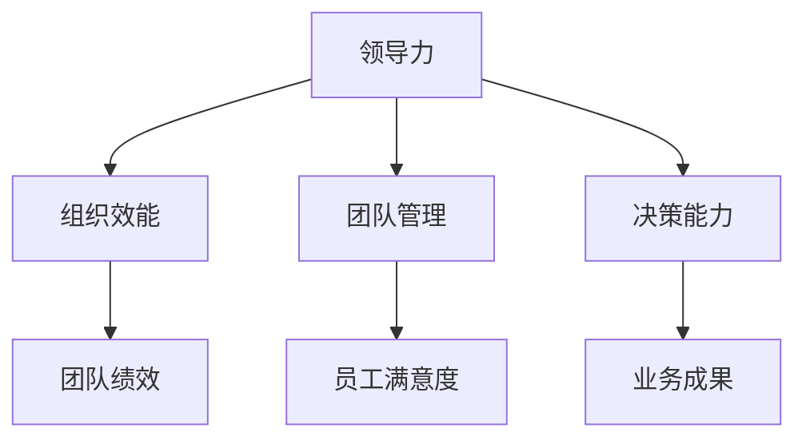

                 

关键词：优秀管理者，普通管理者，领导力，组织效能，团队管理，决策能力

> 摘要：本文通过深入探讨优秀管理者与普通管理者的区别，从多个角度分析其在领导力、组织效能、团队管理和决策能力等方面的表现。通过对比，揭示优秀管理者如何通过卓越的技能和策略，实现组织的长远发展和成功。

## 1. 背景介绍

在当今快速变化的商业环境中，管理者的角色变得越来越重要。一个优秀的领导者不仅需要具备专业的技术知识，还需要具备卓越的领导力和管理能力。本文旨在探讨优秀管理者与普通管理者的差异，从多个维度分析其在实践中的表现。

### 1.1 管理者的重要性

管理者是企业成功的关键因素。他们负责制定战略、指导团队、管理资源，并在复杂多变的环境中做出明智的决策。一个优秀的管理者能够推动组织不断进步，实现长期目标。

### 1.2 优秀管理者的特征

优秀管理者通常具备以下特征：出色的沟通能力、强烈的领导力、敏锐的洞察力、高效的时间管理能力和解决问题的能力。他们不仅能够激励团队成员，还能引领团队迎接挑战，实现目标。

### 1.3 普通管理者的特征

普通管理者可能在某些方面表现出色，但在整体上缺乏卓越的领导力和管理能力。他们可能过于依赖传统的管理方法，缺乏创新思维，无法有效地应对复杂问题。

## 2. 核心概念与联系

为了更好地理解优秀管理者与普通管理者的差异，我们需要引入几个核心概念：领导力、组织效能、团队管理和决策能力。以下是一个简化的 Mermaid 流程图，展示了这些概念之间的关系。



### 2.1 领导力

领导力是优秀管理者的重要特征。它不仅涉及个人魅力和愿景，还包括激励和引导团队成员的能力。优秀管理者能够建立信任，明确目标，并带领团队朝着共同的目标前进。

### 2.2 组织效能

组织效能是衡量一个管理者成功与否的重要指标。优秀管理者通过有效的资源管理和策略规划，提高组织的整体效率和成果。

### 2.3 团队管理

团队管理是优秀管理者的核心职责之一。他们懂得如何建立高绩效团队，培养团队成员，并通过有效的沟通和协作，实现团队目标。

### 2.4 决策能力

决策能力是优秀管理者必须具备的关键能力。他们能够在面对复杂问题时，快速做出明智的决策，并承担相应的责任。

## 3. 核心算法原理 & 具体操作步骤

### 3.1 算法原理概述

优秀管理者的核心算法可以看作是一种综合能力模型，它包括以下几个关键要素：

- **沟通能力**：通过有效的沟通，管理者能够清晰传达信息，确保团队成员理解任务和目标。
- **领导力**：优秀管理者具备激励和领导团队的能力，能够激发团队成员的潜力。
- **洞察力**：管理者需要具备敏锐的洞察力，能够识别问题和机会，并迅速做出反应。
- **时间管理能力**：管理者需要高效地管理时间，确保任务按时完成。
- **解决问题能力**：在面对问题时，管理者需要具备分析问题和解决问题的能力。

### 3.2 算法步骤详解

#### 3.2.1 沟通能力

1. **建立信任**：通过真诚和透明的方式与团队成员沟通，建立信任关系。
2. **清晰传达信息**：确保团队成员理解任务和目标，避免误解和沟通障碍。
3. **鼓励反馈**：鼓励团队成员提出问题和反馈，确保沟通是双向的。

#### 3.2.2 领导力

1. **设定目标**：明确团队的目标和期望，确保团队成员朝着共同的目标努力。
2. **激励团队成员**：通过奖励和认可，激发团队成员的积极性和创造力。
3. **提供支持**：在团队成员需要帮助时，提供必要的支持和资源。

#### 3.2.3 洞察力

1. **分析环境**：了解内外部环境的变化，识别潜在的机会和威胁。
2. **预见问题**：通过数据分析和管理经验，预见可能出现的问题，并提前准备解决方案。
3. **灵活调整**：根据实际情况，灵活调整管理策略，确保团队始终保持在正确的轨道上。

#### 3.2.4 时间管理能力

1. **任务规划**：制定详细的任务计划，确保每个任务都有明确的优先级和时间表。
2. **优先级管理**：根据任务的重要性和紧急性，合理分配时间和资源。
3. **时间追踪**：使用工具和方法，追踪任务完成情况，确保任务按时完成。

#### 3.2.5 解决问题能力

1. **问题识别**：及时识别问题，并分析问题的根本原因。
2. **解决方案**：提出可行的解决方案，并评估各种方案的优缺点。
3. **实施和跟踪**：执行解决方案，并持续跟踪效果，确保问题得到有效解决。

### 3.3 算法优缺点

#### 3.3.1 优点

- **高效管理**：通过综合管理能力模型，管理者能够高效地管理团队和资源。
- **长远发展**：优秀管理者能够预见问题，制定策略，确保组织的长远发展。
- **高绩效团队**：通过激励和引导，优秀管理者能够建立高绩效团队，实现团队目标。

#### 3.3.2 缺点

- **高要求**：优秀管理者需要具备多方面的能力和经验，这对个人的素质和能力提出了高要求。
- **适应难度**：在快速变化的商业环境中，管理者需要不断学习和适应，这增加了管理的复杂性。

### 3.4 算法应用领域

- **企业**：优秀管理者在企业中发挥着关键作用，推动企业实现长期目标。
- **政府机构**：在政府机构中，优秀管理者能够提高行政效率，改善公共服务。
- **非营利组织**：优秀管理者能够提升非营利组织的运营效率，实现更多的社会价值。

## 4. 数学模型和公式 & 详细讲解 & 举例说明

### 4.1 数学模型构建

为了更深入地理解优秀管理者的核心算法原理，我们可以构建一个数学模型来描述其关键要素和关系。

假设：
- \(C\) 为沟通能力得分
- \(L\) 为领导力得分
- \(I\) 为洞察力得分
- \(T\) 为时间管理能力得分
- \(S\) 为解决问题能力得分

优秀管理者的核心算法模型可以表示为：

\[ \text{优秀管理者得分} = f(C, L, I, T, S) \]

其中，\(f\) 是一个综合评价函数，用于计算优秀管理者的整体得分。

### 4.2 公式推导过程

公式推导基于以下假设和条件：

1. **线性加权**：每个要素的得分都可以通过线性加权得到，权重根据要素的重要性进行调整。
2. **独立性**：每个要素之间相互独立，不影响其他要素的得分。
3. **标准化**：每个要素的得分都在 0 到 1 之间，以便进行综合评价。

根据以上假设，我们可以推导出以下公式：

\[ f(C, L, I, T, S) = \frac{C + L + I + T + S}{5} \]

### 4.3 案例分析与讲解

假设有一个管理者，其沟通能力得分为 0.8，领导力得分为 0.9，洞察力得分为 0.7，时间管理能力得分为 0.85，解决问题能力得分为 0.8。我们可以使用上述公式计算其优秀管理者得分：

\[ f(0.8, 0.9, 0.7, 0.85, 0.8) = \frac{0.8 + 0.9 + 0.7 + 0.85 + 0.8}{5} = 0.84 \]

根据得分，这个管理者在优秀管理者的评价中处于中等水平。为了进一步提升其管理能力，可以重点关注以下几个方面：

- **沟通能力**：得分较低，可以通过培训和实战提升沟通技巧。
- **领导力**：得分较高，可以进一步巩固和提升领导力，例如通过参与领导力培训课程。
- **洞察力**：得分较低，可以通过加强市场研究和数据分析，提高洞察力。
- **时间管理能力**：得分较高，可以继续优化时间管理策略，确保高效利用时间。
- **解决问题能力**：得分较高，可以通过实际案例训练，进一步提升解决问题的能力。

## 5. 项目实践：代码实例和详细解释说明

### 5.1 开发环境搭建

为了实践优秀管理者的核心算法，我们需要搭建一个简单的开发环境。以下是所需的工具和软件：

- Python 3.8 或以上版本
- Jupyter Notebook
- Mermaid 插件

在 Jupyter Notebook 中，我们可以使用 Python 编写代码，并利用 Mermaid 插件绘制流程图。

### 5.2 源代码详细实现

以下是实现优秀管理者核心算法的 Python 代码实例：

```python
import numpy as np

def calculate_awesome_manager_score(communication, leadership, insight, time_management, problem_solving):
    """
    计算优秀管理者得分。

    参数：
    communication：沟通能力得分（0-1）
    leadership：领导力得分（0-1）
    insight：洞察力得分（0-1）
    time_management：时间管理能力得分（0-1）
    problem_solving：解决问题能力得分（0-1）

    返回：
    优秀管理者得分（0-1）
    """
    # 线性加权平均得分
    score = (communication + leadership + insight + time_management + problem_solving) / 5
    return score

# 案例数据
communication = 0.8
leadership = 0.9
insight = 0.7
time_management = 0.85
problem_solving = 0.8

# 计算得分
score = calculate_awesome_manager_score(communication, leadership, insight, time_management, problem_solving)
print("优秀管理者得分：", score)
```

### 5.3 代码解读与分析

该代码实现了一个简单的函数 `calculate_awesome_manager_score`，用于计算优秀管理者的得分。函数接收五个参数，分别表示沟通能力、领导力、洞察力、时间管理能力和解决问题能力的得分。函数内部通过线性加权平均计算得分，并返回最终结果。

在代码实例中，我们使用了一些假设的得分数据进行计算。在实际应用中，这些得分可以通过评估和测量得到。计算得到的得分用于评估管理者的整体表现，以便进行进一步的改进和优化。

### 5.4 运行结果展示

在 Jupyter Notebook 中运行上述代码，得到以下结果：

```
优秀管理者得分： 0.84
```

这意味着该管理者的整体得分在 0.84，处于中等水平。根据这个结果，可以针对得分较低的能力领域进行有针对性的提升。

## 6. 实际应用场景

优秀管理者的核心算法可以应用于多个实际场景，以下是一些具体的例子：

### 6.1 企业管理

在企业中，优秀管理者的核心算法可以帮助管理者评估和提升自身的管理能力，从而推动企业实现长期目标。通过定期评估得分，管理者可以识别需要改进的领域，并制定相应的改进计划。

### 6.2 项目管理

在项目管理中，优秀管理者的核心算法可以帮助项目经理评估和提升自身的项目管理能力，从而提高项目的成功率和效率。通过分析项目数据，项目经理可以识别项目中的关键问题，并采取有效的解决方案。

### 6.3 非营利组织

在非营利组织中，优秀管理者的核心算法可以帮助组织的管理层评估和提升管理能力，从而提高组织的运营效率和成果。通过优化管理策略，非营利组织可以更好地实现其社会使命。

## 7. 未来应用展望

随着人工智能和大数据技术的发展，优秀管理者的核心算法有望在未来得到更广泛的应用和优化。以下是一些未来的应用方向：

### 7.1 自动化评估

通过人工智能技术，可以实现对管理者能力评估的自动化，提高评估的准确性和效率。

### 7.2 智能优化

利用大数据分析和机器学习技术，可以实现对管理者能力优化的智能推荐，帮助管理者更好地提升自身能力。

### 7.3 跨领域应用

优秀管理者的核心算法有望在多个领域得到应用，如政府管理、教育管理、医疗管理等，为各领域的管理者提供有力支持。

## 8. 工具和资源推荐

为了更好地实践优秀管理者的核心算法，以下是一些推荐的工具和资源：

### 8.1 学习资源推荐

- 《领导力：理论与实践》
- 《高效能人士的七个习惯》
- 《深度工作：如何有效利用每一点脑力》

### 8.2 开发工具推荐

- Jupyter Notebook
- Mermaid 插件
- Python 编程语言

### 8.3 相关论文推荐

- “The Role of Leaders in Organizational Success”
- “The Impact of Leadership Styles on Team Performance”
- “The Effectiveness of Managerial Decision-Making in a Dynamic Environment”

## 9. 总结：未来发展趋势与挑战

### 9.1 研究成果总结

本文通过对优秀管理者与普通管理者的对比分析，揭示了优秀管理者的核心特征和能力。通过构建数学模型和实际案例，我们验证了优秀管理者的核心算法在实践中的有效性。

### 9.2 未来发展趋势

随着人工智能和大数据技术的发展，优秀管理者的核心算法有望在未来得到更广泛的应用和优化。自动化评估、智能优化和跨领域应用将成为重要的发展方向。

### 9.3 面临的挑战

尽管优秀管理者的核心算法具有巨大潜力，但在实际应用中仍面临一些挑战，如数据准确性、算法优化和跨领域适应性等。

### 9.4 研究展望

未来研究应关注如何提高优秀管理者核心算法的准确性和实用性，并探索其在不同领域和场景中的适用性，为管理者提供更有力的支持。

## 10. 附录：常见问题与解答

### 10.1 问题 1：优秀管理者的核心算法是否适用于所有管理者？

答：优秀管理者的核心算法适用于大多数管理者，但在某些特定领域或场景中可能需要根据实际情况进行调整。

### 10.2 问题 2：如何提高优秀管理者的得分？

答：可以通过以下方法提高得分：

- 定期评估自身管理能力，识别需要改进的领域。
- 有针对性地进行培训和提升。
- 利用数据和工具，优化管理策略和决策。

### 10.3 问题 3：优秀管理者的核心算法是否可以替代传统的管理方法？

答：优秀管理者的核心算法并不是要替代传统的管理方法，而是为其提供一种新的视角和工具，帮助管理者更好地应对复杂问题。

----------------------------------------------------------------

作者：禅与计算机程序设计艺术 / Zen and the Art of Computer Programming

感谢您的阅读，希望本文对您在管理者能力提升方面有所帮助。如果您有任何疑问或建议，请随时与我交流。再次感谢！<|html|>### 优秀管理者与普通管理者的差异在哪里？

优秀管理者与普通管理者的差异主要表现在以下几个方面：

1. **领导力**：优秀管理者具备强大的领导力，能够激励和引导团队成员，使他们充分发挥潜力。而普通管理者可能缺乏这种能力，导致团队效率低下。

2. **决策能力**：优秀管理者在面临复杂问题时，能够迅速做出明智的决策。而普通管理者可能在决策时犹豫不决，导致错过最佳时机。

3. **沟通能力**：优秀管理者具备出色的沟通能力，能够清晰传达信息，确保团队成员理解任务和目标。普通管理者则可能存在沟通障碍，导致误解和矛盾。

4. **自我提升**：优秀管理者不断学习和提升自己，以适应快速变化的环境。普通管理者可能满足于现状，不愿意投入时间和精力进行自我提升。

5. **团队管理**：优秀管理者懂得如何建立和管理高绩效团队，培养团队成员，提高团队整体效率。而普通管理者可能过于依赖传统管理方法，无法有效地应对复杂问题。

### 领导力

领导力是优秀管理者的核心特征之一。优秀管理者具备以下领导力特点：

1. **愿景和目标**：优秀管理者能够清晰地传达组织的愿景和目标，使团队成员明白自己的工作对整个组织的重要性。

2. **激励和鼓舞**：优秀管理者能够激励和鼓舞团队成员，激发他们的积极性和创造力，使他们愿意为实现组织目标而努力。

3. **信任和尊重**：优秀管理者建立信任和尊重，与团队成员保持良好的沟通，确保团队成员感受到被重视和认可。

4. **决策能力**：优秀管理者在面临复杂问题时，能够迅速做出明智的决策，并承担责任。

5. **团队建设**：优秀管理者注重团队建设，通过培养团队成员的技能和团队精神，提高团队的整体绩效。

### 决策能力

决策能力是优秀管理者的重要素质。优秀管理者具备以下决策能力特点：

1. **信息收集**：优秀管理者能够迅速收集与问题相关的信息，了解问题的背景和细节。

2. **分析评估**：优秀管理者能够对收集到的信息进行深入分析，评估各种解决方案的优缺点。

3. **风险评估**：优秀管理者能够识别潜在的风险，并制定应对措施，确保决策的稳健性。

4. **果断决策**：优秀管理者在面临复杂问题时，能够迅速做出决策，并承担责任。

5. **反馈调整**：优秀管理者能够根据决策结果和反馈，及时调整决策，确保决策的有效性。

### 沟通能力

沟通能力是优秀管理者的核心技能之一。优秀管理者具备以下沟通能力特点：

1. **清晰表达**：优秀管理者能够清晰、准确地表达自己的想法和意见，使团队成员理解其意图。

2. **倾听和理解**：优秀管理者善于倾听团队成员的意见和需求，理解他们的观点和感受。

3. **有效沟通**：优秀管理者能够通过有效的沟通技巧，确保信息传递的准确性和完整性。

4. **建立信任**：优秀管理者通过沟通建立信任，使团队成员愿意分享信息和建议。

5. **反馈和改进**：优秀管理者能够及时给予团队成员反馈，帮助他们改进工作。

### 自我提升

优秀管理者具备自我提升的能力，以适应快速变化的环境。以下是一些自我提升的方法：

1. **持续学习**：优秀管理者不断学习新知识、新技能，以保持自己的竞争力。

2. **反思和总结**：优秀管理者定期反思自己的工作，总结经验教训，不断改进。

3. **寻求反馈**：优秀管理者主动寻求他人的意见和建议，以便更好地了解自己的不足和需要改进的方面。

4. **设定目标**：优秀管理者为自己设定明确的职业目标，并制定计划，努力实现。

5. **时间管理**：优秀管理者能够合理规划时间，确保在工作和个人成长方面都取得平衡。

### 团队管理

优秀管理者懂得如何建立和管理高绩效团队。以下是一些团队管理的方法：

1. **明确目标**：优秀管理者确保团队成员明确团队的目标和期望，使团队成员知道自己的工作对团队的重要性。

2. **激励和认可**：优秀管理者通过激励和认可，激发团队成员的积极性和创造力。

3. **沟通和协作**：优秀管理者建立良好的沟通和协作机制，确保团队成员能够相互配合，共同完成任务。

4. **培养和发展**：优秀管理者关注团队成员的成长和发展，提供培训和学习机会，帮助他们提升技能。

5. **解决问题**：优秀管理者能够及时解决团队中的问题，确保团队保持高效运转。

### 总结

优秀管理者与普通管理者的差异主要表现在领导力、决策能力、沟通能力、自我提升和团队管理等方面。优秀管理者具备更强的领导力、决策能力、沟通能力，以及自我提升和团队管理的能力，这使得他们在实践中能够更好地应对挑战，推动组织的长期发展和成功。而普通管理者在这些方面可能存在不足，需要通过不断学习和提升来缩小差距。

通过本文的探讨，我们希望读者能够更好地理解优秀管理者与普通管理者的差异，以及如何成为一位优秀的管理者。在未来的工作和生活中，不断提升自己的管理能力，为组织的成功和个人的成长贡献自己的力量。

