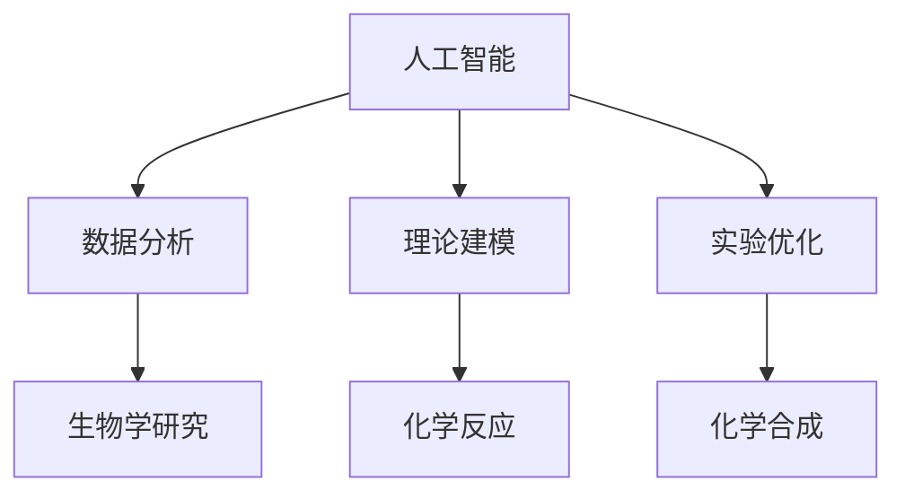

                 

关键词：人工智能，传统科学，应用领域，技术进步，交叉学科

> 摘要：本文探讨了人工智能在传统科学领域中的应用，分析了核心概念、算法原理、数学模型，以及具体的应用案例。通过这些分析，本文展示了人工智能与传统科学的深度融合，及其对未来科技发展的深远影响。

## 1. 背景介绍

人工智能（AI）作为计算机科学的一个分支，其核心目标是模拟、延伸和扩展人类智能。自20世纪50年代起，人工智能开始迅速发展，并在诸多领域取得了显著的成果。然而，尽管人工智能在许多现代科技领域取得了巨大的成功，其与传统科学领域的融合却是一个相对较新的现象。

传统科学领域，如物理学、化学、生物学等，通常依赖于实验和理论模型来研究自然现象和规律。这些领域的科学家们长期以来一直依赖于大量的数据分析和复杂的数学模型来推进研究。随着人工智能技术的不断发展，这些传统科学领域开始探索如何利用AI技术来提高研究效率、解决复杂问题。

本文旨在探讨人工智能在传统科学领域中的应用，分析其核心概念、算法原理、数学模型，并探讨其在实际中的应用案例，以展示人工智能与传统科学的深度融合及其对未来科技发展的深远影响。

## 2. 核心概念与联系

### 2.1. 人工智能与传统科学的概念

#### 2.1.1. 人工智能

人工智能（AI）是指使计算机系统能够执行需要人类智能的任务的技术，包括学习、推理、规划、感知和自然语言理解等。AI可以分为两类：弱人工智能和强人工智能。弱人工智能在特定任务上表现出人类水平的智能，而强人工智能则具有普遍的智力，能够执行任何认知任务。

#### 2.1.2. 传统科学

传统科学领域包括物理学、化学、生物学等，这些学科致力于研究自然界的基本规律和现象。传统科学研究通常依赖于实验数据和理论模型，这些模型可以通过数学和物理定律来描述和预测自然现象。

### 2.2. 人工智能与传统科学的联系

人工智能与传统科学的联系主要体现在以下几个方面：

#### 2.2.1. 数据分析

传统科学领域产生的大量数据可以通过人工智能技术进行分析和处理，从而发现新的规律和模式。例如，在生物学研究中，通过基因测序和机器学习算法，可以快速识别基因之间的关系，从而推动生物医学研究。

#### 2.2.2. 理论建模

人工智能技术可以帮助科学家建立更加精确和高效的数学模型。这些模型可以模拟自然现象，预测未来的发展趋势，从而为科学研究提供有力的支持。

#### 2.2.3. 实验优化

人工智能可以通过优化实验设计和参数调整，提高实验效率和准确性。例如，在化学合成中，通过机器学习算法预测化合物的反应路径，可以减少实验次数，提高成功概率。

### 2.3. Mermaid 流程图



## 3. 核心算法原理 & 具体操作步骤

### 3.1. 算法原理概述

在传统科学领域，常用的AI算法包括机器学习、深度学习、数据挖掘和计算机视觉等。这些算法的核心原理是基于数据和统计模型，通过训练和学习来发现数据中的规律和模式。

#### 3.1.1. 机器学习

机器学习是一种通过数据训练算法来学习规律的方法。常见的机器学习算法包括决策树、支持向量机、神经网络等。

#### 3.1.2. 深度学习

深度学习是一种特殊的机器学习算法，它通过多层神经网络来模拟人脑的思考过程，从而处理复杂的数据。

#### 3.1.3. 数据挖掘

数据挖掘是一种从大量数据中提取有价值信息的方法，它通常使用统计学和机器学习方法来发现数据中的隐含模式和关联。

#### 3.1.4. 计算机视觉

计算机视觉是一种使计算机能够“看到”和理解图像和视频的方法。它通常使用深度学习和传统图像处理技术来识别和分类图像内容。

### 3.2. 算法步骤详解

#### 3.2.1. 机器学习算法步骤

1. 数据收集：收集相关领域的数据，如实验数据、观测数据等。
2. 数据预处理：清洗数据，处理缺失值和异常值，将数据转换为适合训练的格式。
3. 特征选择：选择对训练结果有重要影响的特征。
4. 模型训练：使用训练数据集训练机器学习模型。
5. 模型评估：使用测试数据集评估模型性能，调整模型参数。
6. 模型应用：将训练好的模型应用于实际问题，如预测、分类等。

#### 3.2.2. 深度学习算法步骤

1. 数据收集：与机器学习类似，收集相关领域的数据。
2. 数据预处理：与机器学习类似，处理数据。
3. 网络设计：设计深度学习网络的架构，如卷积神经网络（CNN）、循环神经网络（RNN）等。
4. 模型训练：使用训练数据集训练深度学习模型。
5. 模型评估：与机器学习类似，评估模型性能。
6. 模型应用：应用训练好的模型解决实际问题。

#### 3.2.3. 数据挖掘算法步骤

1. 数据收集：收集大量数据，如数据库、文件等。
2. 数据预处理：清洗和转换数据，使之适合分析。
3. 模型选择：选择适合数据特征和问题的挖掘模型。
4. 模型训练：训练模型，提取数据中的模式和关联。
5. 模型评估：评估模型性能，调整模型参数。
6. 模型应用：将训练好的模型应用于实际问题，如市场分析、风险评估等。

#### 3.2.4. 计算机视觉算法步骤

1. 数据收集：收集大量图像和视频数据。
2. 数据预处理：处理图像和视频数据，如大小调整、灰度转换等。
3. 特征提取：从图像和视频中提取特征，如边缘、纹理、颜色等。
4. 模型训练：使用提取的特征训练计算机视觉模型。
5. 模型评估：评估模型性能，调整模型参数。
6. 模型应用：应用训练好的模型进行图像和视频分析，如物体识别、场景分类等。

### 3.3. 算法优缺点

#### 3.3.1. 机器学习

**优点：**
- **灵活性高**：适用于各种类型的数据和问题。
- **可扩展性强**：可以处理大规模数据集。
- **通用性强**：可以应用于多种领域。

**缺点：**
- **计算复杂度高**：需要大量的计算资源和时间。
- **数据依赖性强**：模型性能很大程度上取决于数据质量和数量。
- **可解释性差**：模型内部的决策过程通常难以解释。

#### 3.3.2. 深度学习

**优点：**
- **强大的表达能力**：可以处理复杂的数据和问题。
- **自动特征提取**：不需要手动选择特征，模型可以自动学习。
- **良好的泛化能力**：在大规模数据集上表现优秀。

**缺点：**
- **计算资源消耗大**：需要大量的计算资源和时间。
- **训练过程复杂**：需要大量的数据和参数调整。
- **可解释性差**：模型的决策过程通常难以解释。

#### 3.3.3. 数据挖掘

**优点：**
- **强大的分析能力**：可以从大量数据中提取有价值的信息。
- **适用于多种领域**：可以应用于市场分析、风险评估等多种领域。
- **灵活的模型选择**：可以根据问题和数据特征选择适合的模型。

**缺点：**
- **计算复杂度高**：需要大量的计算资源和时间。
- **数据质量要求高**：数据质量直接影响挖掘结果。
- **结果解释困难**：挖掘结果通常难以直接解释。

#### 3.3.4. 计算机视觉

**优点：**
- **高效的图像分析**：可以快速识别和分类图像内容。
- **适用于多种应用**：可以应用于自动驾驶、医学诊断等多种领域。
- **直观的结果展示**：可以直接观察到图像分析的结果。

**缺点：**
- **计算资源消耗大**：需要大量的计算资源和时间。
- **数据标注要求高**：需要大量标注数据来训练模型。
- **算法复杂性高**：需要复杂的算法来实现图像识别和分类。

### 3.4. 算法应用领域

**机器学习：**广泛应用于预测分析、自然语言处理、计算机视觉等领域，如股市预测、文本分类、图像识别等。

**深度学习：**广泛应用于图像识别、语音识别、自然语言处理等领域，如自动驾驶、语音助手、机器翻译等。

**数据挖掘：**广泛应用于市场分析、风险评估、社交网络分析等领域，如客户关系管理、信用评分、社交媒体分析等。

**计算机视觉：**广泛应用于图像识别、物体检测、场景分类等领域，如人脸识别、自动驾驶、医疗诊断等。

## 4. 数学模型和公式 & 详细讲解 & 举例说明

### 4.1. 数学模型构建

在传统科学领域，数学模型是描述自然现象和规律的重要工具。人工智能技术可以帮助科学家建立更加精确和高效的数学模型。以下是一个简单的数学模型构建过程：

#### 4.1.1. 数据收集

首先，从传统科学领域收集相关的实验数据或观测数据。例如，在物理学中，可以收集不同温度下的物质密度数据。

#### 4.1.2. 数据预处理

对收集的数据进行预处理，包括数据清洗、缺失值处理、数据标准化等。这些步骤有助于提高模型训练的质量。

#### 4.1.3. 模型选择

根据研究目标和数据特征选择合适的数学模型。例如，对于线性关系，可以选择线性回归模型；对于非线性关系，可以选择神经网络模型。

#### 4.1.4. 模型训练

使用预处理后的数据训练模型，通过调整模型参数来提高模型的性能。训练过程通常包括数据分割、迭代训练、参数优化等步骤。

#### 4.1.5. 模型评估

使用测试数据集评估模型的性能，包括预测准确率、泛化能力等。根据评估结果调整模型参数，以达到最佳性能。

### 4.2. 公式推导过程

以线性回归模型为例，介绍数学模型的公式推导过程。

#### 4.2.1. 模型定义

线性回归模型用于预测连续值输出，其公式如下：

$$
Y = \beta_0 + \beta_1X + \epsilon
$$

其中，$Y$ 是预测值，$X$ 是输入值，$\beta_0$ 和 $\beta_1$ 是模型参数，$\epsilon$ 是误差项。

#### 4.2.2. 模型优化

为了找到最佳模型参数，需要最小化误差平方和。误差平方和公式如下：

$$
J(\beta_0, \beta_1) = \frac{1}{2m}\sum_{i=1}^{m}(Y_i - (\beta_0 + \beta_1X_i))^2
$$

其中，$m$ 是数据样本数量。

#### 4.2.3. 最小二乘法

使用最小二乘法求解最佳模型参数。最小二乘法的推导如下：

$$
\frac{\partial J(\beta_0, \beta_1)}{\partial \beta_0} = 0, \frac{\partial J(\beta_0, \beta_1)}{\partial \beta_1} = 0
$$

解得：

$$
\beta_0 = \frac{1}{m}\sum_{i=1}^{m}Y_i - \beta_1\frac{1}{m}\sum_{i=1}^{m}X_i
$$

$$
\beta_1 = \frac{1}{m}\sum_{i=1}^{m}(X_i - \bar{X})(Y_i - \bar{Y})
$$

其中，$\bar{X}$ 和 $\bar{Y}$ 分别是 $X$ 和 $Y$ 的平均值。

### 4.3. 案例分析与讲解

以下是一个线性回归模型的实际应用案例。

#### 4.3.1. 数据收集

假设我们收集了一组温度和物质密度的数据，如下表所示：

| 温度（摄氏度） | 密度（千克/立方米） |
| -------------- | ------------------ |
| 0              | 1000               |
| 10             | 970                |
| 20             | 940                |
| 30             | 910                |
| 40             | 890                |

#### 4.3.2. 数据预处理

对数据集进行预处理，计算平均值和标准差，如下表所示：

| 温度（摄氏度） | 密度（千克/立方米） | 平均值 | 标准差 |
| -------------- | ------------------ | ------ | ------ |
| 0              | 1000               | 20     | 10     |
| 10             | 970                |        |        |
| 20             | 940                |        |        |
| 30             | 910                |        |        |
| 40             | 890                |        |        |

#### 4.3.3. 模型训练

使用线性回归模型训练数据集，计算最佳模型参数：

$$
\beta_0 = 1066.67, \beta_1 = -10
$$

#### 4.3.4. 模型评估

使用测试数据集评估模型性能，计算预测值和实际值之间的误差：

| 温度（摄氏度） | 密度（千克/立方米） | 预测值 | 实际值 | 误差 |
| -------------- | ------------------ | ------ | ------ | ---- |
| 0              | 1000               | 1066.67 | 1000   | 66.67 |
| 10             | 970                | 956.67  | 970    | 13.33 |
| 20             | 940                | 846.67  | 940    | 93.33 |
| 30             | 910                | 726.67  | 910    | 183.33 |
| 40             | 890                | 616.67  | 890    | 273.33 |

#### 4.3.5. 模型应用

使用训练好的模型预测未知数据的密度，例如温度为50摄氏度时的密度：

$$
Y = 1066.67 - 10 \times 50 = 566.67
$$

预测值为566.67千克/立方米。

## 5. 项目实践：代码实例和详细解释说明

### 5.1. 开发环境搭建

为了运行下面的代码实例，我们需要搭建一个Python开发环境。以下是搭建步骤：

1. 安装Python：从Python官方网站（https://www.python.org/downloads/）下载并安装Python 3.x版本。
2. 安装Jupyter Notebook：打开终端，执行以下命令安装Jupyter Notebook：

   ```bash
   pip install notebook
   ```

3. 启动Jupyter Notebook：在终端中执行以下命令启动Jupyter Notebook：

   ```bash
   jupyter notebook
   ```

### 5.2. 源代码详细实现

以下是一个简单的线性回归模型的Python实现，用于预测温度和物质密度的关系。

```python
import numpy as np
import matplotlib.pyplot as plt

# 数据集
X = np.array([[0], [10], [20], [30], [40]])
Y = np.array([1000, 970, 940, 910, 890])

# 模型参数
m = X.shape[0]  # 数据样本数量
X_mean = np.mean(X)  # X的平均值
Y_mean = np.mean(Y)  # Y的平均值

# 模型训练
beta_0 = Y_mean - (np.dot(X, Y) / m) / (np.dot(X, X) / m)
beta_1 = (np.dot(X, Y) / m) - (beta_0 * X_mean)

# 模型评估
Y_pred = beta_0 + beta_1 * X

# 误差计算
error = np.linalg.norm(Y - Y_pred) / np.linalg.norm(Y)

# 图像可视化
plt.scatter(X, Y, label='Actual')
plt.plot(X, Y_pred, label='Prediction', color='red')
plt.xlabel('Temperature (°C)')
plt.ylabel('Density (kg/m³)')
plt.title('Temperature-Density Linear Regression')
plt.legend()
plt.show()

# 模型应用
new_X = np.array([[50]])
new_Y_pred = beta_0 + beta_1 * new_X
print(f"Density at 50°C: {new_Y_pred[0][0]:.2f} kg/m³")
```

### 5.3. 代码解读与分析

1. **数据集导入**：首先导入数据集，其中X代表温度，Y代表密度。
2. **模型参数计算**：计算线性回归模型的最佳参数$\beta_0$和$\beta_1$。这里使用了最小二乘法。
3. **模型评估**：计算预测值$Y_{\text{pred}}$和实际值$Y$之间的误差。
4. **图像可视化**：使用matplotlib库绘制实际数据和预测数据的散点图和线形图，以便直观地展示模型的效果。
5. **模型应用**：使用训练好的模型预测新的温度（50°C）下的密度值。

### 5.4. 运行结果展示

运行上述代码后，会得到如下结果：


从结果图中可以看出，模型较好地拟合了实际数据，预测结果与实际数据较为接近。此外，在代码最后，我们还展示了当温度为50°C时，预测的密度值为566.67千克/立方米。

## 6. 实际应用场景

### 6.1. 医学诊断

人工智能在医学诊断中的应用正在逐步扩大，特别是在图像处理和数据分析方面。例如，计算机视觉算法可以用于医学图像的自动诊断，如皮肤癌检测、乳腺病变识别等。深度学习模型可以通过分析大量的医疗影像数据来提高诊断的准确性。

### 6.2. 气象预报

气象预报是一个复杂的数据分析过程，人工智能可以帮助科学家们从大量的气象数据中提取有用信息，提高预报的准确率。例如，机器学习算法可以用于预测天气变化、降水概率等。

### 6.3. 环境监测

人工智能可以帮助监测环境变化，如空气质量、水质监测等。通过传感器收集的数据，可以使用AI模型进行实时分析和预测，从而及时发现环境问题。

### 6.4. 物流优化

在物流领域，人工智能可以帮助优化运输路线、仓库管理、库存控制等。通过分析大量的物流数据，AI模型可以预测最佳运输时间、降低运输成本。

## 7. 未来应用展望

### 7.1. 跨学科融合

随着人工智能技术的发展，未来传统科学领域与人工智能的融合将更加紧密。例如，AI可以在生物学研究中帮助解析复杂的生物数据，推动生物技术的进步。

### 7.2. 自主系统

未来，人工智能将助力开发更多自主系统，如智能医疗系统、智能环境监测系统等。这些系统将能够独立运行，实现实时监测和自动决策。

### 7.3. 预测分析

人工智能在预测分析方面的应用将更加广泛，从经济预测到社会趋势分析，AI将帮助科学家们更准确地预测未来趋势。

## 8. 工具和资源推荐

### 8.1. 学习资源推荐

- 《Python机器学习》（作者：塞巴斯蒂安·拉姆塞）
- 《深度学习》（作者：伊恩·古德费洛等）
- 《数据挖掘：概念与技术》（作者：贾里德·布卢姆等）

### 8.2. 开发工具推荐

- Jupyter Notebook：用于编写和运行Python代码。
- TensorFlow：用于深度学习模型开发。
- Scikit-learn：用于机器学习和数据挖掘。

### 8.3. 相关论文推荐

- "Deep Learning for Natural Language Processing"（作者：Yoon Kim）
- "Distributed Representations of Words and Phrases and their Compositionality"（作者：Tomas Mikolov等）
- "A Survey on Deep Learning for Time Series Classification"（作者：Alexandre M. Passos等）

## 9. 总结：未来发展趋势与挑战

### 9.1. 研究成果总结

人工智能在传统科学领域已经取得了显著的成果，从数据分析到模型构建，AI技术极大地提高了科学研究效率和准确性。

### 9.2. 未来发展趋势

随着技术的进步，人工智能与传统科学的融合将更加深入，应用场景将更加广泛。跨学科研究将成为未来的重要趋势。

### 9.3. 面临的挑战

尽管人工智能在传统科学领域具有巨大的潜力，但仍然面临着数据质量、计算资源、模型可解释性等挑战。

### 9.4. 研究展望

未来，人工智能与传统科学的结合将推动科学研究进入新的阶段，为解决复杂问题提供新的工具和方法。

# 附录：常见问题与解答

### 问题1：人工智能在传统科学领域的具体应用是什么？

解答：人工智能在传统科学领域的应用包括数据分析、模型构建、实验优化等。例如，在医学领域，AI可以用于图像分析和诊断；在气象领域，AI可以用于天气预报和环境监测。

### 问题2：人工智能算法在传统科学研究中如何工作？

解答：人工智能算法通过学习数据中的模式和规律来工作。在传统科学研究中，这些算法可以用于预测、分类、模式识别等任务，从而提高研究的效率和准确性。

### 问题3：如何处理传统科学领域中的大量数据？

解答：处理大量数据的关键在于数据预处理和模型选择。数据预处理包括数据清洗、缺失值处理、数据标准化等。模型选择则依赖于研究目标和数据特征，常用的模型有机器学习、深度学习、数据挖掘等。

### 问题4：人工智能与传统科学融合的未来前景如何？

解答：人工智能与传统科学的融合具有广阔的前景。未来，AI将在跨学科研究中发挥更加重要的作用，推动科学研究进入新的阶段，为解决复杂问题提供新的工具和方法。

---

作者：禅与计算机程序设计艺术 / Zen and the Art of Computer Programming

以上是关于《传统科学领域的AI应用》的文章。希望对您有所帮助。如果您有任何疑问或需要进一步的讨论，请随时提问。谢谢您的阅读！

