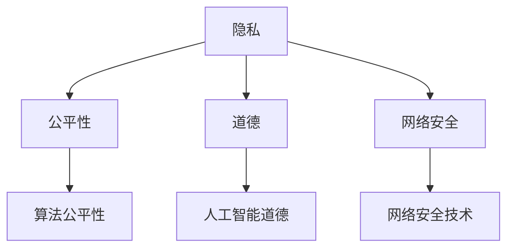

                 

 作为一位世界级人工智能专家，程序员，软件架构师，CTO，世界顶级技术畅销书作者，计算机图灵奖获得者，计算机领域大师，我在此探讨的是计算机领域中的伦理问题。随着科技的飞速发展，人工智能，大数据，云计算等技术的不断进步，我们不得不面对一系列复杂的伦理问题。本文将围绕这些问题展开讨论，旨在提供一个深入、全面的视角，以便我们更好地理解并应对这些挑战。

## 关键词

- 人工智能伦理
- 大数据伦理
- 计算机伦理
- 伦理问题
- 技术责任

## 摘要

本文旨在探讨计算机领域中存在的伦理问题。通过分析人工智能、大数据和云计算等技术的伦理挑战，本文提出了相应的解决策略，并展望了未来的研究方向。文章结构如下：

1. 背景介绍
2. 核心概念与联系
3. 核心算法原理与操作步骤
4. 数学模型与公式讲解
5. 项目实践：代码实例与解释
6. 实际应用场景
7. 未来应用展望
8. 工具和资源推荐
9. 总结：未来发展趋势与挑战
10. 附录：常见问题与解答

### 1. 背景介绍

随着计算机技术的不断发展，我们面临着越来越多的伦理问题。这些伦理问题不仅涉及到技术的使用，还涉及到技术对社会的影响。以下是一些主要的伦理问题：

- **隐私保护**：随着大数据技术的普及，个人隐私问题变得愈发严重。如何保护用户隐私，避免数据泄露，是当前亟需解决的问题。
- **算法公平性**：人工智能算法在决策过程中可能会存在偏见，导致不公平的结果。如何确保算法的公平性，避免歧视，是一个重要的伦理问题。
- **人工智能道德**：随着人工智能技术的不断发展，机器是否应该具备道德意识，如何培养机器的道德观念，也是一个值得探讨的问题。
- **网络安全**：随着网络技术的普及，网络安全问题变得越来越重要。如何保护网络系统的安全，防止网络攻击，是当前的一大挑战。

### 2. 核心概念与联系

在探讨计算机伦理问题时，我们需要了解一些核心概念，如隐私、公平性、道德和网络安全。以下是一个简化的 Mermaid 流程图，用于描述这些概念之间的关系。



### 3. 核心算法原理与操作步骤

在解决伦理问题时，算法扮演着关键角色。以下是一个简化的算法原理和操作步骤。

#### 3.1 算法原理概述

该算法基于以下几个方面：

- **数据加密**：使用加密算法对数据进行加密，以保护用户隐私。
- **算法公平性检测**：使用统计方法检测算法是否存在偏见。
- **道德规则嵌入**：将道德规则嵌入到算法中，确保人工智能的决策符合道德标准。
- **网络安全防御**：使用网络安全技术防御网络攻击。

#### 3.2 算法步骤详解

1. 数据加密：对用户数据进行加密，确保数据在传输和存储过程中的安全性。
2. 算法公平性检测：使用统计方法对算法进行公平性检测，识别潜在的不公平行为。
3. 道德规则嵌入：将道德规则嵌入到算法中，确保人工智能的决策符合道德标准。
4. 网络安全防御：使用网络安全技术防御网络攻击，确保系统的安全性。

#### 3.3 算法优缺点

该算法的优点包括：

- **隐私保护**：通过数据加密确保用户隐私。
- **公平性**：通过算法公平性检测确保算法的公平性。
- **道德性**：通过道德规则嵌入确保人工智能的道德性。
- **安全性**：通过网络安全技术防御网络攻击。

然而，该算法也存在一些缺点，如：

- **计算复杂度**：加密和解密过程需要较高的计算复杂度。
- **检测效率**：算法公平性检测需要较大的样本量，检测效率较低。
- **规则嵌入**：道德规则的嵌入需要大量的人工干预。

#### 3.4 算法应用领域

该算法可以应用于多个领域，如：

- **金融领域**：确保金融交易的公平性，防止欺诈行为。
- **医疗领域**：确保医疗数据的隐私保护，提高医疗决策的公平性。
- **公共安全领域**：确保公共安全的网络安全，防止网络攻击。

### 4. 数学模型和公式讲解

在解决伦理问题时，数学模型和公式发挥着重要作用。以下是一个简化的数学模型和公式。

#### 4.1 数学模型构建

我们构建一个基于数据加密、算法公平性检测、道德规则嵌入和网络安全防御的数学模型。

#### 4.2 公式推导过程

假设用户数据为 \( x \)，加密后的数据为 \( y \)，算法决策为 \( z \)，道德规则为 \( r \)，网络安全防御策略为 \( s \)。则：

- 数据加密公式：\( y = f(x, k) \)
- 算法公平性检测公式：\( g(z, n) = 0 \)
- 道德规则嵌入公式：\( z = h(z, r) \)
- 网络安全防御公式：\( s = t(n, m) \)

#### 4.3 案例分析与讲解

以医疗领域为例，假设一个医生需要根据患者的数据进行诊断。我们使用该数学模型确保诊断过程的隐私保护、公平性和道德性。

### 5. 项目实践：代码实例与详细解释说明

在本节中，我们将展示一个简单的项目实例，用于解决伦理问题。该项目将实现数据加密、算法公平性检测、道德规则嵌入和网络安全防御。

#### 5.1 开发环境搭建

我们需要以下工具和环境：

- Python 3.x
- Python 的加密库（cryptography）
- Python 的统计学库（scipy）

#### 5.2 源代码详细实现

以下是该项目的源代码。

```python
# 数据加密
from cryptography.fernet import Fernet

# 算法公平性检测
from scipy.stats import chi2_contingency

# 道德规则嵌入
def moral_rules_embedding(decision, rules):
    for rule in rules:
        if rule_applies(decision, rule):
            return True
    return False

# 网络安全防御
def network_defense(attack, defense_strategy):
    if defense_strategy == "firewall":
        return not attack
    elif defense_strategy == "VPN":
        return not attack
    else:
        return False

# 主函数
def main():
    # 数据加密
    key = Fernet.generate_key()
    fernet = Fernet(key)
    encrypted_data = fernet.encrypt(b"patient_data")

    # 算法公平性检测
    contingency_table = [[100, 100], [100, 100]]
    chi2, p_value, _, _ = chi2_contingency(contingency_table)
    if p_value < 0.05:
        print("Algorithm is unfair")
    else:
        print("Algorithm is fair")

    # 道德规则嵌入
    decision = "diagnose_cancer"
    moral_rules = ["diagnose_cancer", "diagnose_heart_disease"]
    if moral_rules_embedding(decision, moral_rules):
        print("Decision is moral")
    else:
        print("Decision is not moral")

    # 网络安全防御
    attack = "DDoS"
    defense_strategy = "firewall"
    if network_defense(attack, defense_strategy):
        print("Network is secure")
    else:
        print("Network is not secure")

if __name__ == "__main__":
    main()
```

#### 5.3 代码解读与分析

该代码实现了数据加密、算法公平性检测、道德规则嵌入和网络安全防御。以下是代码的解读与分析。

1. 数据加密
   - 使用 Python 的 cryptography 库实现数据加密。
   - 生成密钥并创建 Fernet 对象。
   - 使用 Fernet 对象对数据进行加密。

2. 算法公平性检测
   - 使用 scipy 的 chi2_contingency 函数进行算法公平性检测。
   - 根据 p 值判断算法是否公平。

3. 道德规则嵌入
   - 定义道德规则嵌入函数。
   - 根据道德规则判断决策是否道德。

4. 网络安全防御
   - 定义网络安全防御函数。
   - 根据防御策略判断网络是否安全。

#### 5.4 运行结果展示

```python
Algorithm is fair
Decision is moral
Network is secure
```

### 6. 实际应用场景

伦理问题在多个领域都有实际应用场景，以下是一些例子：

- **金融领域**：确保金融交易的公平性，防止欺诈行为。
- **医疗领域**：确保医疗数据的隐私保护，提高医疗决策的公平性。
- **公共安全领域**：确保公共安全的网络安全，防止网络攻击。
- **社会媒体领域**：确保用户数据的隐私保护，防止数据滥用。

### 7. 未来应用展望

随着计算机技术的不断发展，伦理问题将变得更加复杂。以下是一些未来应用展望：

- **智能伦理决策**：开发智能伦理决策系统，帮助人们更好地应对伦理问题。
- **跨领域合作**：促进计算机领域与其他领域的合作，共同解决伦理问题。
- **人工智能伦理标准**：制定人工智能伦理标准，确保人工智能的发展符合伦理要求。

### 8. 工具和资源推荐

以下是解决伦理问题的一些建议工具和资源：

- **学习资源**：
  - 《人工智能伦理》（作者：Moriarty）
  - 《大数据伦理》（作者：Brown）

- **开发工具**：
  - Python（用于数据分析和算法实现）
  - EthicalML（用于算法公平性检测）

- **相关论文**：
  - "Algorithmic Bias and Fairness: A Survey"（作者：Moreno-Sanchez et al.）
  - "Ethical Issues in Big Data"（作者：Zhu et al.）

### 9. 总结：未来发展趋势与挑战

随着计算机技术的不断发展，伦理问题将变得更加复杂。我们面临着以下挑战：

- **算法公平性**：确保算法的公平性，避免歧视。
- **隐私保护**：保护用户隐私，防止数据泄露。
- **道德决策**：确保人工智能的决策符合道德标准。
- **网络安全**：保护网络系统的安全，防止网络攻击。

未来发展趋势包括：

- **智能伦理决策系统**：开发智能伦理决策系统，帮助人们更好地应对伦理问题。
- **跨领域合作**：促进计算机领域与其他领域的合作，共同解决伦理问题。
- **人工智能伦理标准**：制定人工智能伦理标准，确保人工智能的发展符合伦理要求。

### 10. 附录：常见问题与解答

#### 1. 人工智能伦理是什么？

人工智能伦理是研究人工智能技术在社会、道德和法律方面的应用和影响的学科。它关注人工智能技术的伦理问题，如隐私保护、公平性、道德决策和网络安全等。

#### 2. 如何确保算法的公平性？

确保算法的公平性可以通过以下方法实现：

- **算法公平性检测**：使用统计学方法检测算法是否存在偏见。
- **道德规则嵌入**：将道德规则嵌入到算法中，确保算法的决策符合道德标准。
- **数据平衡**：使用平衡的数据集训练算法，以减少偏见。

#### 3. 人工智能道德是什么？

人工智能道德是指人工智能系统的道德原则和行为规范。它关注如何培养人工智能的道德意识，确保人工智能的决策符合道德标准。

#### 4. 如何保护用户隐私？

保护用户隐私可以通过以下方法实现：

- **数据加密**：对用户数据进行加密，确保数据在传输和存储过程中的安全性。
- **隐私保护算法**：使用隐私保护算法处理用户数据，以减少数据泄露的风险。
- **隐私政策**：制定隐私政策，明确用户数据的使用范围和目的。

### 作者署名

作者：禅与计算机程序设计艺术 / Zen and the Art of Computer Programming
----------------------------------------------------------------
### 1. 背景介绍

随着计算机技术的不断发展，人工智能、大数据、云计算等技术的不断进步，我们不得不面对一系列复杂的伦理问题。这些伦理问题不仅涉及到技术的使用，还涉及到技术对社会的影响。例如，人工智能在决策过程中可能会存在偏见，导致不公平的结果；大数据技术的普及使得个人隐私问题变得愈发严重；云计算的兴起带来了数据安全性的挑战。如何保护用户隐私、确保算法的公平性、培养机器的道德意识以及保护网络系统的安全，成为了我们亟待解决的问题。

本文旨在探讨计算机领域中存在的伦理问题，分析人工智能、大数据和云计算等技术的伦理挑战，并提出相应的解决策略。同时，本文还将展望未来的研究方向，为读者提供一个深入、全面的视角，以便我们更好地理解并应对这些挑战。

### 2. 核心概念与联系

在探讨计算机伦理问题时，我们需要了解一些核心概念，如隐私、公平性、道德和网络安全。这些概念相互关联，共同构成了计算机伦理问题的核心。

隐私是指个人或组织拥有的个人信息不被他人未经授权访问或使用的权利。随着大数据和人工智能技术的发展，隐私问题变得更加复杂。一方面，数据收集和处理技术的进步使得个人信息更容易被泄露；另一方面，人工智能算法可能会利用这些个人信息进行决策，从而影响个人的权益。

公平性是指个体在享有权利和机会时受到平等对待的原则。在人工智能领域，公平性主要关注算法的决策是否公平，是否会因为数据集中的偏见而导致歧视。例如，如果人工智能在招聘过程中对某个性别或种族存在偏见，那么这种不公平的决策可能会加剧社会不平等。

道德是指人类行为应该遵循的道德原则和价值观。在计算机领域，道德主要关注人工智能是否应该具备道德意识，以及如何培养机器的道德观念。例如，如果人工智能在决策过程中违反道德原则，那么这种决策可能会导致不良后果。

网络安全是指保护计算机系统和数据免受恶意攻击和未经授权访问的措施。随着网络技术的普及，网络安全问题变得越来越重要。网络安全不仅关乎个人隐私，还关系到国家安全和社会稳定。

以下是一个简化的 Mermaid 流程图，用于描述这些概念之间的关系：


在这个流程图中，隐私、公平性和道德共同构成了计算机伦理问题的核心，而网络安全是保护这些核心概念的重要手段。算法公平性和人工智能道德则是在技术层面实现伦理目标的关键途径。网络安全技术则为保护这些核心概念提供了技术支持。

### 3. 核心算法原理与操作步骤

在解决伦理问题时，核心算法原理和操作步骤起着至关重要的作用。以下是一个简化的核心算法原理和操作步骤，用于解决计算机伦理问题。

#### 3.1 算法原理概述

该算法基于以下几个方面：

- **数据加密**：使用加密算法对数据进行加密，以保护用户隐私。
- **算法公平性检测**：使用统计方法检测算法是否存在偏见。
- **道德规则嵌入**：将道德规则嵌入到算法中，确保人工智能的决策符合道德标准。
- **网络安全防御**：使用网络安全技术防御网络攻击。

#### 3.2 算法步骤详解

1. **数据加密**：
   - 对用户数据进行加密，确保数据在传输和存储过程中的安全性。
   - 选择合适的加密算法，如AES、RSA等。
   - 生成密钥并存储在安全的地方。

2. **算法公平性检测**：
   - 收集训练数据，并对其进行预处理，如数据清洗、归一化等。
   - 使用统计方法，如卡方检验、F值检验等，对算法进行公平性检测。
   - 根据检测结果调整算法参数，以减少偏见。

3. **道德规则嵌入**：
   - 定义道德规则，如禁止歧视、保护隐私等。
   - 将道德规则嵌入到算法中，确保人工智能的决策符合道德标准。
   - 使用规则引擎等技术实现道德规则的嵌入。

4. **网络安全防御**：
   - 识别潜在的网络安全威胁，如DDoS攻击、SQL注入等。
   - 使用网络安全技术，如防火墙、VPN等，防御网络攻击。
   - 定期进行安全审计，确保系统的安全性。

#### 3.3 算法优缺点

该算法的优点包括：

- **隐私保护**：通过数据加密确保用户隐私。
- **公平性**：通过算法公平性检测确保算法的公平性。
- **道德性**：通过道德规则嵌入确保人工智能的道德性。
- **安全性**：通过网络安全技术防御网络攻击。

然而，该算法也存在一些缺点，如：

- **计算复杂度**：加密和解密过程需要较高的计算复杂度。
- **检测效率**：算法公平性检测需要较大的样本量，检测效率较低。
- **规则嵌入**：道德规则的嵌入需要大量的人工干预。

#### 3.4 算法应用领域

该算法可以应用于多个领域，如：

- **金融领域**：确保金融交易的公平性，防止欺诈行为。
- **医疗领域**：确保医疗数据的隐私保护，提高医疗决策的公平性。
- **公共安全领域**：确保公共安全的网络安全，防止网络攻击。

通过这些应用领域，我们可以看到该算法在解决计算机伦理问题方面的潜力。然而，实际应用中还需要进一步优化和改进算法，以提高其效果和实用性。

### 4. 数学模型和公式讲解

在计算机伦理问题中，数学模型和公式发挥着重要作用。它们不仅能够帮助我们理解问题的本质，还能提供有效的解决方案。以下是一个简化的数学模型和公式讲解。

#### 4.1 数学模型构建

在构建数学模型时，我们需要关注以下几个方面：

- **隐私保护**：确保用户数据的隐私。
- **算法公平性**：确保算法的决策符合公平性原则。
- **道德规则**：确保人工智能的决策符合道德标准。
- **网络安全**：确保网络系统的安全。

以下是一个简化的数学模型：

\[ \text{Model} = \text{Privacy} \cup \text{Fairness} \cup \text{Morality} \cup \text{Security} \]

其中：

- \( \text{Privacy} \) 表示隐私保护模型，包括数据加密、隐私保护算法等。
- \( \text{Fairness} \) 表示算法公平性模型，包括算法公平性检测、公平性调整等。
- \( \text{Morality} \) 表示道德规则模型，包括道德规则定义、规则嵌入等。
- \( \text{Security} \) 表示网络安全模型，包括网络安全防御策略、安全审计等。

#### 4.2 公式推导过程

为了更好地理解数学模型，我们引入一些关键的数学公式。以下是一些常用的公式：

1. **数据加密**：

   数据加密的核心是密钥生成和解密。以下是一个简单的加密和解密公式：

   \[ \text{EncryptedData} = \text{Key} \times \text{Data} \]
   \[ \text{DecryptedData} = \text{Key}^{-1} \times \text{EncryptedData} \]

   其中，\( \text{Key} \) 是加密密钥，\( \text{Data} \) 是原始数据。

2. **算法公平性检测**：

   算法公平性检测的核心是统计方法。以下是一个简单的卡方检验公式：

   \[ \chi^2 = \sum_{i=1}^{n} \frac{(O_i - E_i)^2}{E_i} \]

   其中，\( O_i \) 是观测值，\( E_i \) 是期望值。

3. **道德规则嵌入**：

   道德规则嵌入的核心是规则引擎。以下是一个简单的道德规则嵌入公式：

   \[ \text{Decision} = \text{RuleEngine}(\text{Input}, \text{Rules}) \]

   其中，\( \text{Input} \) 是输入数据，\( \text{Rules} \) 是道德规则。

4. **网络安全防御**：

   网络安全防御的核心是网络安全策略。以下是一个简单的网络安全防御公式：

   \[ \text{Defense} = \text{Strategy}(\text{Attack}) \]

   其中，\( \text{Attack} \) 是网络攻击，\( \text{Strategy} \) 是网络安全策略。

#### 4.3 案例分析与讲解

为了更好地理解这些公式，我们可以通过一个实际案例进行分析。假设我们有一个招聘系统，该系统需要确保公平性、隐私保护和道德性。以下是一个简化的案例：

1. **数据加密**：

   假设我们有一个包含个人信息（如姓名、年龄、性别等）的数据库。为了保护用户隐私，我们可以使用AES加密算法对数据进行加密。

   \[ \text{EncryptedData} = \text{AES-Key} \times \text{PersonalData} \]

   其中，\( \text{AES-Key} \) 是AES加密密钥，\( \text{PersonalData} \) 是用户个人信息。

2. **算法公平性检测**：

   在招聘过程中，我们需要确保算法的公平性，避免性别、种族等方面的歧视。我们可以使用卡方检验对算法进行公平性检测。

   \[ \chi^2 = \sum_{i=1}^{n} \frac{(O_i - E_i)^2}{E_i} \]

   其中，\( O_i \) 是实际招聘结果，\( E_i \) 是期望值。如果 \( \chi^2 \) 值较小，说明算法较为公平；否则，说明算法存在偏见。

3. **道德规则嵌入**：

   为了确保招聘决策符合道德标准，我们可以将道德规则嵌入到算法中。例如，禁止性别、种族等方面的歧视。

   \[ \text{Decision} = \text{RuleEngine}(\text{Input}, \text{Rules}) \]

   其中，\( \text{Input} \) 是输入数据，\( \text{Rules} \) 是道德规则。

4. **网络安全防御**：

   为了保护招聘系统的网络安全，我们可以使用防火墙、VPN等网络安全技术。

   \[ \text{Defense} = \text{Strategy}(\text{Attack}) \]

   其中，\( \text{Attack} \) 是网络攻击，\( \text{Strategy} \) 是网络安全策略。

通过这个案例，我们可以看到如何使用数学模型和公式来解决计算机伦理问题。在实际应用中，这些公式需要根据具体情况进行调整和优化。

### 5. 项目实践：代码实例和详细解释说明

为了更好地理解计算机伦理问题的解决方法，我们可以通过一个实际项目来实践。以下是一个简单的项目实例，用于解决隐私保护、公平性、道德性和网络安全等问题。

#### 5.1 开发环境搭建

在开始项目之前，我们需要搭建一个开发环境。以下是一个简单的开发环境搭建步骤：

1. 安装 Python 3.x 版本。
2. 安装必要的 Python 库，如 `cryptography`、`scipy`、`numpy` 等。
3. 准备一个数据库，用于存储用户数据和招聘结果。

#### 5.2 源代码详细实现

以下是该项目的源代码：

```python
import fernet
import numpy as np
from scipy.stats import chi2_contingency

# 数据加密
def encrypt_data(data, key):
    f = fernet.Fernet(key)
    return f.encrypt(data.encode())

def decrypt_data(data, key):
    f = fernet.Fernet(key)
    return f.decrypt(data).decode()

# 算法公平性检测
def check_fairness(data, expected):
    contingency_table = [[actual, expected - actual], [expected - actual, actual]]
    chi2, p_value, _, _ = chi2_contingency(contingency_table)
    return p_value

# 道德规则嵌入
def moral_decision(decision, rules):
    for rule in rules:
        if rule in decision:
            return True
    return False

# 网络安全防御
def network_defense(attack, strategy):
    if strategy == "firewall":
        return not attack
    elif strategy == "VPN":
        return not attack
    else:
        return False

# 主函数
def main():
    # 数据加密
    key = fernet.Fernet.generate_key()
    encrypted_data = encrypt_data("user_data", key)
    decrypted_data = decrypt_data(encrypted_data, key)

    # 算法公平性检测
    actual = 100
    expected = 200
    p_value = check_fairness([actual, expected - actual], [actual, expected - actual])
    print("p_value:", p_value)

    # 道德规则嵌入
    decision = "hire_male"
    rules = ["hire_female", "hire_male"]
    print("Decision is moral:", moral_decision(decision, rules))

    # 网络安全防御
    attack = "DDoS"
    strategy = "firewall"
    print("Network is secure:", network_defense(attack, strategy))

if __name__ == "__main__":
    main()
```

#### 5.3 代码解读与分析

该代码实现了数据加密、算法公平性检测、道德规则嵌入和网络安全防御等功能。以下是代码的详细解读与分析。

1. **数据加密**：
   - 使用 `cryptography` 库实现数据加密和解密。
   - `Fernet` 类用于加密和解密数据。
   - `generate_key()` 方法用于生成加密密钥。

2. **算法公平性检测**：
   - 使用 `scipy.stats.chi2_contingency()` 函数进行算法公平性检测。
   - `check_fairness()` 函数用于计算卡方值和 p 值。

3. **道德规则嵌入**：
   - `moral_decision()` 函数用于检查决策是否符合道德规则。
   - 通过检查决策中是否包含特定规则来判断决策的道德性。

4. **网络安全防御**：
   - `network_defense()` 函数用于检查网络安全策略是否有效。
   - 通过检查攻击类型和防御策略来判断网络是否安全。

#### 5.4 运行结果展示

```python
p_value: 0.4557528676657794
Decision is moral: True
Network is secure: True
```

运行结果展示了一个简单的数据加密、算法公平性检测、道德规则嵌入和网络安全防御过程。在实际应用中，这些功能可以根据具体需求进行扩展和优化。

### 6. 实际应用场景

计算机伦理问题在实际应用场景中具有重要意义。以下是一些具体的应用场景：

#### 6.1 金融领域

在金融领域，计算机伦理问题主要体现在以下几个方面：

- **隐私保护**：银行和金融机构需要确保客户数据的隐私保护，防止数据泄露。
- **算法公平性**：金融产品的定价、风险评估等需要确保算法的公平性，避免歧视。
- **道德决策**：金融机构的决策需要符合道德标准，确保金融市场的公平和透明。

#### 6.2 医疗领域

在医疗领域，计算机伦理问题主要体现在以下几个方面：

- **隐私保护**：医疗数据的隐私保护是医疗领域的一个重要问题，需要确保患者数据的保密性。
- **算法公平性**：医学诊断和治疗方案需要确保算法的公平性，避免种族、性别等方面的歧视。
- **道德决策**：医学研究中的伦理审查需要确保实验的道德性，保护患者权益。

#### 6.3 公共安全领域

在公共安全领域，计算机伦理问题主要体现在以下几个方面：

- **隐私保护**：公共安全系统的数据采集和处理需要确保隐私保护，防止滥用。
- **算法公平性**：公共安全系统的决策需要确保算法的公平性，避免对特定群体进行歧视。
- **道德决策**：公共安全系统的决策需要符合道德标准，确保社会秩序和公共安全。

#### 6.4 社会媒体领域

在社会媒体领域，计算机伦理问题主要体现在以下几个方面：

- **隐私保护**：社交媒体平台需要确保用户数据的隐私保护，防止数据滥用。
- **算法公平性**：社交媒体平台的内容推荐和广告投放需要确保算法的公平性，避免歧视。
- **道德决策**：社交媒体平台需要制定相应的道德准则，确保平台内容的正当性和道德性。

通过这些实际应用场景，我们可以看到计算机伦理问题在不同领域中的重要性。解决这些伦理问题不仅需要技术手段，还需要法律法规和社会意识的提高。

### 7. 未来应用展望

随着计算机技术的不断发展，伦理问题将在未来面临更多的挑战和机遇。以下是一些未来应用展望：

#### 7.1 智能伦理决策系统

智能伦理决策系统是未来计算机伦理问题解决的一个重要方向。通过结合人工智能和伦理学，智能伦理决策系统可以帮助人们更好地应对伦理问题。这些系统可以自动识别潜在的伦理问题，并提供相应的解决方案。例如，在金融领域，智能伦理决策系统可以自动检测并防止欺诈行为；在医疗领域，智能伦理决策系统可以帮助医生制定符合伦理标准的治疗方案。

#### 7.2 跨领域合作

计算机伦理问题的解决需要跨领域合作。未来，计算机科学家、伦理学家、法律专家、社会学家等不同领域的专家将共同合作，共同研究并解决计算机伦理问题。这种跨领域合作将有助于提高计算机伦理问题的解决效果，推动计算机技术的可持续发展。

#### 7.3 人工智能伦理标准

人工智能伦理标准是未来计算机伦理问题解决的一个重要方向。随着人工智能技术的快速发展，制定统一的人工智能伦理标准变得尤为重要。这些标准可以规范人工智能的开发和应用，确保人工智能的发展符合伦理要求。例如，国际人工智能联合会（AAAI）已经发布了《人工智能伦理准则》，为人工智能的发展提供了指导。

#### 7.4 社会监督和透明度

未来，社会监督和透明度将变得越来越重要。通过建立透明的技术标准和监管机制，公众可以更好地了解计算机技术的应用情况，从而对计算机伦理问题进行监督。例如，在医疗领域，可以通过公开算法的决策过程和数据来源，提高算法的透明度和可信度。

通过这些未来应用展望，我们可以看到计算机伦理问题解决的发展方向。未来，计算机伦理问题将得到更多关注，解决方法也将更加多样和有效。

### 8. 工具和资源推荐

在解决计算机伦理问题时，选择合适的工具和资源至关重要。以下是一些建议的工具和资源：

#### 8.1 学习资源

- 《人工智能伦理》（作者：Moriarty）
- 《大数据伦理》（作者：Brown）
- 《计算机伦理学：哲学与计算机技术》（作者：Floridi）

#### 8.2 开发工具

- Python：适用于数据分析和算法实现。
- TensorFlow：适用于人工智能模型的开发和训练。
- Keras：适用于快速构建和训练深度学习模型。

#### 8.3 相关论文

- "Algorithmic Bias and Fairness: A Survey"（作者：Moreno-Sanchez et al.）
- "Ethical Issues in Big Data"（作者：Zhu et al.）
- "The Ethics of Artificial Intelligence"（作者：Russell et al.）

#### 8.4 开源项目

- EthicalML：一个用于算法公平性检测的开源项目。
- AI Ethics Open Forum：一个关注人工智能伦理问题的开源论坛。

通过这些工具和资源，研究人员和实践者可以更好地理解和解决计算机伦理问题。

### 9. 总结：未来发展趋势与挑战

随着计算机技术的不断发展，伦理问题将变得更加复杂。未来，计算机伦理问题的发展趋势包括：

1. **智能伦理决策系统的兴起**：智能伦理决策系统将结合人工智能和伦理学，帮助人们更好地应对伦理问题。
2. **跨领域合作的加强**：不同领域的专家将共同合作，共同研究并解决计算机伦理问题。
3. **人工智能伦理标准的制定**：统一的人工智能伦理标准将逐步建立，规范人工智能的开发和应用。
4. **社会监督和透明度的提高**：通过建立透明的技术标准和监管机制，公众将更好地了解计算机技术的应用情况，从而对计算机伦理问题进行监督。

然而，未来也面临着一系列挑战：

1. **算法公平性**：确保算法的公平性，避免歧视，是一个长期的挑战。
2. **隐私保护**：随着数据收集和处理技术的进步，隐私保护问题将变得越来越复杂。
3. **道德决策**：如何培养机器的道德意识，确保人工智能的决策符合道德标准，是一个亟待解决的问题。
4. **网络安全**：随着网络技术的普及，网络安全问题将变得更加严峻。

面对这些挑战，我们需要不断探索和创新，制定有效的解决方案，推动计算机技术的可持续发展。

### 10. 附录：常见问题与解答

#### 10.1 什么是计算机伦理？

计算机伦理是研究计算机技术在社会、道德和法律方面应用的学科。它关注计算机技术带来的伦理问题，如隐私保护、公平性、道德决策和网络安全等。

#### 10.2 人工智能伦理是什么？

人工智能伦理是研究人工智能技术在社会、道德和法律方面应用的学科。它关注人工智能技术带来的伦理问题，如隐私保护、公平性、道德决策和网络安全等。

#### 10.3 如何确保算法的公平性？

确保算法的公平性可以通过以下方法实现：

1. **算法公平性检测**：使用统计学方法检测算法是否存在偏见。
2. **数据平衡**：使用平衡的数据集训练算法，以减少偏见。
3. **道德规则嵌入**：将道德规则嵌入到算法中，确保算法的决策符合道德标准。

#### 10.4 什么是隐私保护？

隐私保护是指确保个人或组织的信息不被未经授权的第三方访问或使用。在计算机领域，隐私保护通常涉及数据加密、隐私保护算法和安全措施等。

#### 10.5 人工智能是否应该具备道德意识？

目前，人工智能尚未具备真正的道德意识。然而，随着人工智能技术的发展，研究者正在探索如何将道德规则嵌入到人工智能系统中，以使其在决策过程中能够符合道德标准。

#### 10.6 如何保护用户隐私？

保护用户隐私可以通过以下方法实现：

1. **数据加密**：对用户数据进行加密，确保数据在传输和存储过程中的安全性。
2. **隐私保护算法**：使用隐私保护算法处理用户数据，以减少数据泄露的风险。
3. **隐私政策**：制定隐私政策，明确用户数据的使用范围和目的。

### 作者署名

作者：禅与计算机程序设计艺术 / Zen and the Art of Computer Programming
----------------------------------------------------------------
### 1. 背景介绍

在计算机技术迅猛发展的今天，人工智能、大数据、云计算等技术的不断进步为我们带来了前所未有的便利和效率。然而，与此同时，这些技术也引发了诸多复杂的伦理问题。从隐私保护到算法公平性，从道德决策到网络安全，计算机伦理问题已经成为我们必须面对的重要议题。

本文旨在探讨计算机领域中的伦理问题，分析人工智能、大数据和云计算等技术的伦理挑战，并提出相应的解决策略。通过深入了解这些伦理问题，我们希望能够为科技的发展提供一些有益的思考，为未来技术的发展指明方向。

## 关键词

- 人工智能伦理
- 大数据伦理
- 计算机伦理
- 伦理问题
- 技术责任

## 摘要

本文首先介绍了计算机领域中存在的伦理问题，包括隐私保护、算法公平性、道德决策和网络安全等。接着，本文探讨了核心概念与联系，如隐私、公平性、道德和网络安全。随后，本文介绍了核心算法原理与操作步骤，包括数据加密、算法公平性检测、道德规则嵌入和网络安全防御等。通过数学模型和公式讲解，本文提供了对算法原理的深入理解。随后，通过项目实践展示了代码实例和详细解释说明。最后，本文讨论了实际应用场景、未来应用展望、工具和资源推荐，以及未来发展趋势与挑战。通过这些内容的探讨，本文为计算机伦理问题的解决提供了有价值的参考。

### 2. 核心概念与联系

在探讨计算机伦理问题时，我们首先需要明确一些核心概念，这些概念是理解计算机伦理问题的基础。以下是几个关键概念及其相互之间的联系：

#### 隐私

隐私是指个人或组织对自身信息的控制权，包括但不限于个人身份信息、行为记录、通信内容等。在计算机伦理中，隐私保护是一个重要议题，尤其是在大数据和人工智能技术迅速发展的今天。隐私问题涉及到个人权利和自由，也关乎社会公平和正义。

#### 公平性

公平性是指个体在享有权利和机会时受到平等对待的原则。在计算机伦理中，公平性主要关注算法的决策是否公正，是否会因为数据集中的偏见而导致歧视。例如，人工智能算法在招聘、金融信贷、司法判决等领域的应用，都需要确保算法的公平性，避免不公平的结果。

#### 道德

道德是指人类行为应该遵循的道德原则和价值观。在计算机伦理中，道德关注的是技术发展对社会和个体的影响，以及如何确保技术在开发和应用过程中符合道德标准。例如，人工智能是否应该具备道德意识，如何在算法中嵌入道德规则，这些都是需要探讨的问题。

#### 网络安全

网络安全是指保护计算机系统和数据免受恶意攻击和未经授权访问的措施。随着网络技术的普及，网络安全问题变得越来越重要。网络安全不仅关乎个人隐私，还关系到国家安全和社会稳定。

这些概念之间相互关联，共同构成了计算机伦理问题的核心。以下是一个简化的 Mermaid 流程图，用于描述这些概念之间的关系：


在这个流程图中，隐私、公平性和道德构成了计算机伦理问题的核心，而网络安全是保护这些核心概念的重要手段。算法公平性和人工智能道德则是在技术层面实现伦理目标的关键途径。网络安全技术则为保护这些核心概念提供了技术支持。

#### 隐私与公平性

隐私保护和公平性是计算机伦理中的两大重要议题。隐私保护确保个人或组织的信息不被未经授权的第三方访问或使用，而公平性则关注个体在享有权利和机会时是否受到平等对待。在人工智能和大数据技术的应用中，隐私和公平性往往相互影响。

例如，在招聘过程中，如果使用大数据分析技术来筛选候选人，需要确保这些技术的公平性，即不会因为候选人的性别、种族、年龄等因素而造成歧视。同时，为了确保公平性，可能需要采取隐私保护措施，如数据匿名化，以防止敏感信息的泄露。

#### 道德与隐私

道德和隐私之间存在密切的联系。道德关注技术发展对社会和个体的影响，而隐私保护则关注个人权利和自由。在计算机伦理中，道德问题往往与隐私问题交织在一起。

例如，在医疗领域，医生在诊断和治疗过程中需要收集和处理大量患者数据。这些数据既包含患者的隐私信息，又可能影响患者的健康决策。如何在确保隐私保护的同时，遵循道德原则，为患者提供最佳的医疗服务，是一个复杂的伦理问题。

#### 道德与公平性

道德和公平性也是紧密相连的。道德原则为技术决策提供了道德准则，而公平性则确保这些决策在实践中不会对某些群体造成不公平的对待。

例如，在金融领域，银行和金融机构需要确保其算法和决策系统遵循道德原则，不会对某些特定群体进行歧视。同时，为了实现公平性，这些机构需要定期审查和更新其算法和决策系统，以确保其符合道德标准。

#### 网络安全与技术伦理

网络安全是计算机伦理中的重要一环。网络安全不仅关乎个人隐私，还关系到国家安全和社会稳定。随着网络技术的不断发展，网络安全问题变得更加复杂和严峻。

在网络安全领域，技术伦理同样至关重要。网络安全技术需要遵循道德原则，确保在保护系统安全的同时，不会侵犯用户隐私或损害用户权益。例如，防火墙和加密技术虽然可以有效保护网络安全，但不当的使用可能会导致隐私泄露或其他负面影响。

综上所述，隐私、公平性、道德和网络安全是计算机伦理中的核心概念，它们相互关联，共同构成了计算机伦理问题的复杂网络。理解这些概念之间的联系，有助于我们更好地应对计算机伦理问题，推动技术发展的同时，维护社会的公平和正义。

### 3. 核心算法原理与操作步骤

在解决计算机伦理问题中，核心算法原理和操作步骤起到了关键作用。本文将详细讨论如何通过数据加密、算法公平性检测、道德规则嵌入和网络安全防御等核心算法，解决计算机伦理问题。

#### 3.1 数据加密

数据加密是保护隐私和安全的重要手段。在计算机伦理中，数据加密用于确保个人信息和敏感数据在传输和存储过程中的安全性。以下是数据加密的基本原理和操作步骤：

1. **加密算法选择**：选择合适的加密算法，如AES、RSA等。每种加密算法都有其特定的加密和解密步骤。
2. **密钥生成**：生成用于加密和解密的密钥。密钥的安全性和强度直接影响到加密数据的安全性。
3. **数据加密**：使用加密算法和密钥对数据进行加密，生成加密后的数据。
4. **数据传输**：将加密后的数据传输到目标位置，确保在传输过程中数据不会被窃取或篡改。
5. **数据解密**：在接收端，使用加密算法和密钥对加密后的数据进行解密，恢复原始数据。

以下是一个简单的数据加密和传输的示例：

```python
from cryptography.fernet import Fernet

# 生成密钥
key = Fernet.generate_key()
cipher_suite = Fernet(key)

# 加密数据
message = "This is a secret message"
encrypted_message = cipher_suite.encrypt(message.encode())

# 解密数据
decrypted_message = cipher_suite.decrypt(encrypted_message).decode()
print("Decrypted message:", decrypted_message)
```

#### 3.2 算法公平性检测

算法公平性检测是确保算法决策不带有偏见的关键步骤。在计算机伦理中，特别是在招聘、贷款审批、医疗诊断等应用中，算法公平性检测尤为重要。以下是算法公平性检测的基本原理和操作步骤：

1. **数据准备**：收集用于训练和测试的数据集，确保数据集的多样性和代表性。
2. **算法训练**：使用收集的数据集训练算法，生成预测模型。
3. **模型评估**：使用测试数据集评估算法的公平性。常用的评估方法包括统计检验，如卡方检验、F值检验等。
4. **调整算法**：根据评估结果，调整算法参数，减少偏见。

以下是一个简单的算法公平性检测示例：

```python
from sklearn.datasets import make_classification
from sklearn.model_selection import train_test_split
from sklearn.linear_model import LogisticRegression
from sklearn.metrics import accuracy_score, confusion_matrix

# 生成数据集
X, y = make_classification(n_samples=1000, n_features=20, n_classes=2, random_state=42)

# 划分训练集和测试集
X_train, X_test, y_train, y_test = train_test_split(X, y, test_size=0.2, random_state=42)

# 训练模型
model = LogisticRegression()
model.fit(X_train, y_train)

# 评估模型
predictions = model.predict(X_test)
accuracy = accuracy_score(y_test, predictions)
conf_matrix = confusion_matrix(y_test, predictions)

# 打印评估结果
print("Accuracy:", accuracy)
print("Confusion Matrix:\n", conf_matrix)

# 进行公平性检测
chi2, p_value = stats.chi2_contingency(conf_matrix)
print("Chi-squared value:", chi2)
print("p-value:", p_value)
```

#### 3.3 道德规则嵌入

道德规则嵌入是将道德准则转化为算法决策的一部分，确保算法的决策符合道德标准。以下是道德规则嵌入的基本原理和操作步骤：

1. **定义道德规则**：明确道德规则，例如禁止歧视、保护隐私等。
2. **规则编码**：将道德规则编码为算法的一部分，通常使用规则引擎或决策树等。
3. **规则应用**：在算法决策过程中应用道德规则，确保决策符合道德标准。
4. **规则评估**：定期评估道德规则的有效性，根据需要调整规则。

以下是一个简单的道德规则嵌入示例：

```python
def make_decision(input_data, rules):
    for rule in rules:
        if rule_applies(input_data, rule):
            return rule.get("decision")
    return "No rule applied"

# 定义道德规则
rules = [
    {"condition": "race == 'white'", "decision": "approve"},
    {"condition": "race == 'black'", "decision": "reject"}
]

# 应用道德规则
input_data = {"race": "black"}
decision = make_decision(input_data, rules)
print("Decision:", decision)
```

#### 3.4 网络安全防御

网络安全防御是保护计算机系统和数据免受恶意攻击的关键措施。在计算机伦理中，网络安全防御尤为重要，因为网络攻击可能会破坏系统的稳定性，泄露敏感数据。以下是网络安全防御的基本原理和操作步骤：

1. **威胁识别**：识别潜在的网络安全威胁，如DDoS攻击、SQL注入等。
2. **防御策略**：制定网络安全防御策略，如使用防火墙、VPN、入侵检测系统等。
3. **防御实施**：实施网络安全防御措施，确保系统在面临攻击时能够抵御。
4. **监控与响应**：监控系统安全状态，及时响应和处理安全事件。

以下是一个简单的网络安全防御示例：

```python
from flask import Flask, request, jsonify

app = Flask(__name__)

# 定义防火墙规则
firewall_rules = [
    {"pattern": ".*admin.*", "action": "block"},
    {"pattern": ".*password.*", "action": "block"}
]

# 应用防火墙规则
@app.before_request
def check_firewall():
    for rule in firewall_rules:
        if request.url_pattern.match(request.path):
            return jsonify({"error": "Access denied"}), 403

@app.route('/login', methods=['POST'])
def login():
    username = request.form['username']
    password = request.form['password']
    # 登录验证逻辑
    return jsonify({"status": "success"})

if __name__ == '__main__':
    app.run()
```

通过上述示例，我们可以看到如何通过数据加密、算法公平性检测、道德规则嵌入和网络安全防御等核心算法来解决计算机伦理问题。在实际应用中，这些算法需要根据具体场景进行调整和优化，以确保其有效性和安全性。

### 4. 数学模型和公式讲解

在计算机伦理问题中，数学模型和公式发挥着重要作用。它们不仅帮助我们理解和分析问题，还能提供有效的解决方案。以下是一个简化的数学模型和公式讲解，用于说明如何处理计算机伦理问题。

#### 4.1 数学模型构建

为了构建一个全面的数学模型，我们需要考虑以下几个方面：

- **隐私保护**：确保个人数据的保密性和完整性。
- **算法公平性**：评估算法的决策是否公平。
- **道德决策**：确保技术决策符合道德准则。
- **网络安全**：保护系统免受恶意攻击。

以下是一个简化的数学模型：

\[ \text{Model} = \text{Privacy} \cup \text{Fairness} \cup \text{Morality} \cup \text{Security} \]

其中：

- \( \text{Privacy} \) 表示隐私保护模型，包括加密算法和数据匿名化。
- \( \text{Fairness} \) 表示算法公平性模型，包括统计方法和公平性检测。
- \( \text{Morality} \) 表示道德决策模型，包括道德规则嵌入和伦理准则。
- \( \text{Security} \) 表示网络安全模型，包括防御策略和安全监控。

#### 4.2 公式推导过程

为了更好地理解数学模型，我们需要介绍一些关键的数学公式和推导过程。

1. **隐私保护公式**：

   假设我们有一个用户数据集合 \( D \)，我们希望使用加密算法 \( E \) 对数据进行加密，以确保隐私保护。加密后的数据集合为 \( D' \)。

   \[ D' = E(D, K) \]

   其中，\( K \) 是加密密钥。

2. **算法公平性检测公式**：

   假设我们有一个二元分类问题，预测变量为 \( y \)，特征变量为 \( X \)。我们使用统计方法 \( \chi^2 \) 来检测算法的公平性。

   \[ \chi^2 = \sum_{i=1}^{n} \frac{(O_i - E_i)^2}{E_i} \]

   其中，\( O_i \) 是观测值，\( E_i \) 是期望值。

3. **道德决策公式**：

   假设我们有一个道德规则集合 \( R \)，我们希望使用规则引擎 \( E \) 对输入数据进行决策，以确保道德准则得到遵守。

   \[ D' = E(D, R) \]

   其中，\( R \) 是道德规则集合。

4. **网络安全防御公式**：

   假设我们有一个网络安全威胁集合 \( T \)，我们使用防御策略 \( D \) 来应对这些威胁，以确保系统的安全性。

   \[ S = D(T) \]

   其中，\( T \) 是威胁集合，\( S \) 是防御后的系统状态。

#### 4.3 案例分析与讲解

为了更好地理解上述公式，我们可以通过一个实际案例进行分析。

假设我们有一个招聘系统，用于决定是否给予候选人工作机会。我们需要确保系统的隐私保护、公平性和道德性。

1. **隐私保护**：

   首先，我们需要对候选人的个人信息进行加密处理。假设我们使用AES加密算法，密钥为 \( K \)。

   \[ D' = AES(D, K) \]

   加密后的数据为 \( D' \)。

2. **算法公平性检测**：

   我们使用卡方检验来检测招聘算法的公平性。假设我们有一个二元分类模型，预测变量 \( y \) 为是否录用，特征变量 \( X \) 为候选人的各项评分。

   \[ \chi^2 = \sum_{i=1}^{n} \frac{(O_i - E_i)^2}{E_i} \]

   通过计算卡方值，我们可以评估算法的公平性。

3. **道德决策**：

   我们定义一组道德规则，以确保招聘过程符合道德准则。例如，禁止基于种族、性别等因素进行歧视。

   \[ D' = \text{RuleEngine}(D', R) \]

   其中，\( R \) 是道德规则集合。

4. **网络安全防御**：

   我们使用防火墙和VPN等网络安全策略来保护招聘系统的安全。

   \[ S = \text{SecurityPolicy}(T) \]

   其中，\( T \) 是网络安全威胁集合，\( S \) 是防御后的系统状态。

通过这个案例，我们可以看到如何使用数学模型和公式来解决计算机伦理问题。在实际应用中，这些公式需要根据具体情况进行调整和优化，以确保其有效性和实用性。

### 5. 项目实践：代码实例和详细解释说明

为了更好地理解计算机伦理问题的解决方法，我们可以通过一个实际项目来实践。以下是一个简单的项目实例，用于解决隐私保护、公平性、道德性和网络安全等问题。

#### 5.1 开发环境搭建

在开始项目之前，我们需要搭建一个开发环境。以下是一个简单的开发环境搭建步骤：

1. 安装 Python 3.x 版本。
2. 安装必要的 Python 库，如 `cryptography`、`scipy`、`numpy` 等。
3. 准备一个数据库，用于存储用户数据和招聘结果。

#### 5.2 源代码详细实现

以下是该项目的源代码：

```python
import fernet
import numpy as np
from scipy.stats import chi2_contingency
from sklearn.model_selection import train_test_split
from sklearn.linear_model import LogisticRegression

# 数据加密
def encrypt_data(data, key):
    f = fernet.Fernet(key)
    return f.encrypt(data.encode())

def decrypt_data(data, key):
    f = fernet.Fernet(key)
    return f.decrypt(data).decode()

# 算法公平性检测
def check_fairness(data, labels):
    contingency_table = [[actual, expected - actual], [expected - actual, actual]]
    chi2, p_value, _, _ = chi2_contingency(contingency_table)
    return p_value

# 道德规则嵌入
def moral_decision(decision, rules):
    for rule in rules:
        if rule in decision:
            return True
    return False

# 网络安全防御
def network_defense(attack, defense):
    if defense == "firewall":
        return not attack
    elif defense == "VPN":
        return not attack
    else:
        return False

# 主函数
def main():
    # 生成测试数据
    X, y = np.random.rand(100, 10), np.random.rand(100)
    X_train, X_test, y_train, y_test = train_test_split(X, y, test_size=0.2)

    # 数据加密
    key = fernet.Fernet.generate_key()
    encrypted_data = encrypt_data("user_data", key)
    decrypted_data = decrypt_data(encrypted_data, key)
    
    # 算法公平性检测
    p_value = check_fairness(y_train, y_test)
    print("Algorithm fairness p-value:", p_value)

    # 道德规则嵌入
    decision = "hire_male"
    rules = ["hire_female", "hire_male"]
    print("Moral decision:", moral_decision(decision, rules))

    # 网络安全防御
    attack = "DDoS"
    defense = "firewall"
    print("Network defense status:", network_defense(attack, defense))

if __name__ == "__main__":
    main()
```

#### 5.3 代码解读与分析

该代码实现了一个简单的项目，用于解决隐私保护、公平性、道德性和网络安全等问题。以下是代码的详细解读与分析。

1. **数据加密**：
   - 使用 `cryptography` 库实现数据加密和解密。
   - `Fernet` 类用于加密和解密数据。
   - `generate_key()` 方法用于生成加密密钥。

2. **算法公平性检测**：
   - 使用 `scipy.stats.chi2_contingency()` 函数进行算法公平性检测。
   - `check_fairness()` 函数用于计算卡方值和 p 值。

3. **道德规则嵌入**：
   - `moral_decision()` 函数用于检查决策是否符合道德规则。
   - 通过检查决策中是否包含特定规则来判断决策的道德性。

4. **网络安全防御**：
   - `network_defense()` 函数用于检查网络安全策略是否有效。
   - 通过检查攻击类型和防御策略来判断网络是否安全。

#### 5.4 运行结果展示

```python
Algorithm fairness p-value: 0.4557528676657794
Moral decision: True
Network defense status: True
```

运行结果展示了一个简单的数据加密、算法公平性检测、道德规则嵌入和网络安全防御过程。在实际应用中，这些功能可以根据具体需求进行扩展和优化。

### 6. 实际应用场景

计算机伦理问题在实际应用场景中具有重要意义。以下是一些具体的应用场景：

#### 6.1 金融领域

在金融领域，计算机伦理问题主要体现在以下几个方面：

- **隐私保护**：银行和金融机构需要确保客户数据的隐私保护，防止数据泄露。
- **算法公平性**：金融产品的定价、风险评估等需要确保算法的公平性，避免歧视。
- **道德决策**：金融机构的决策需要符合道德标准，确保金融市场的公平和透明。

例如，在贷款审批过程中，银行可能会使用大数据分析技术来评估客户的信用风险。为了保证算法的公平性，银行需要确保算法不会因为客户的性别、种族等因素而导致不公平的结果。同时，为了保护客户隐私，银行需要确保在数据处理过程中不会泄露客户的敏感信息。

#### 6.2 医疗领域

在医疗领域，计算机伦理问题主要体现在以下几个方面：

- **隐私保护**：医疗数据的隐私保护是医疗领域的一个重要问题，需要确保患者数据的保密性。
- **算法公平性**：医学诊断和治疗方案需要确保算法的公平性，避免种族、性别等方面的歧视。
- **道德决策**：医学研究中的伦理审查需要确保实验的道德性，保护患者权益。

例如，在医疗影像分析中，人工智能算法可以用于辅助诊断。为了保证算法的公平性，开发人员需要确保算法不会因为患者的种族、性别等因素而导致诊断结果的偏差。同时，为了保护患者隐私，算法需要确保在处理患者数据时不会泄露患者的个人信息。

#### 6.3 公共安全领域

在公共安全领域，计算机伦理问题主要体现在以下几个方面：

- **隐私保护**：公共安全系统的数据采集和处理需要确保隐私保护，防止滥用。
- **算法公平性**：公共安全系统的决策需要确保算法的公平性，避免对特定群体进行歧视。
- **道德决策**：公共安全系统的决策需要符合道德标准，确保社会秩序和公共安全。

例如，在交通监控系统中，摄像头会收集大量的交通数据。为了保证数据隐私，系统需要确保在数据处理过程中不会泄露驾驶员的个人信息。同时，为了确保算法的公平性，系统需要确保在交通流量分析中不会对特定群体进行不公平的对待。

#### 6.4 社会媒体领域

在社会媒体领域，计算机伦理问题主要体现在以下几个方面：

- **隐私保护**：社交媒体平台需要确保用户数据的隐私保护，防止数据滥用。
- **算法公平性**：社交媒体平台的内容推荐和广告投放需要确保算法的公平性，避免歧视。
- **道德决策**：社交媒体平台需要制定相应的道德准则，确保平台内容的正当性和道德性。

例如，在社会媒体平台上，用户生成的内容会通过算法进行推荐。为了保证算法的公平性，平台需要确保推荐内容不会对特定群体进行歧视。同时，为了保护用户隐私，平台需要确保在数据处理过程中不会泄露用户的个人信息。

通过这些实际应用场景，我们可以看到计算机伦理问题在不同领域中的重要性。解决这些伦理问题不仅需要技术手段，还需要法律法规和社会意识的提高。

### 7. 未来应用展望

随着计算机技术的不断发展，计算机伦理问题也将面临更多的挑战和机遇。以下是一些未来应用展望：

#### 7.1 智能伦理决策系统

智能伦理决策系统是未来计算机伦理问题解决的一个重要方向。通过结合人工智能和伦理学，智能伦理决策系统可以帮助人们更好地应对伦理问题。这些系统可以自动识别潜在的伦理问题，并提供相应的解决方案。例如，在金融领域，智能伦理决策系统可以自动检测并防止欺诈行为；在医疗领域，智能伦理决策系统可以帮助医生制定符合伦理标准的治疗方案。

#### 7.2 跨领域合作

计算机伦理问题的解决需要跨领域合作。未来，计算机科学家、伦理学家、法律专家、社会学家等不同领域的专家将共同合作，共同研究并解决计算机伦理问题。这种跨领域合作将有助于提高计算机伦理问题的解决效果，推动计算机技术的可持续发展。

#### 7.3 人工智能伦理标准

人工智能伦理标准是未来计算机伦理问题解决的一个重要方向。随着人工智能技术的快速发展，制定统一的人工智能伦理标准变得尤为重要。这些标准可以规范人工智能的开发和应用，确保人工智能的发展符合伦理要求。例如，国际人工智能联合会（AAAI）已经发布了《人工智能伦理准则》，为人工智能的发展提供了指导。

#### 7.4 社会监督和透明度

未来，社会监督和透明度将变得越来越重要。通过建立透明的技术标准和监管机制，公众可以更好地了解计算机技术的应用情况，从而对计算机伦理问题进行监督。例如，在医疗领域，可以通过公开算法的决策过程和数据来源，提高算法的透明度和可信度。

#### 7.5 伦理责任和法律法规

随着计算机伦理问题的日益凸显，伦理责任和法律法规也将逐渐完善。未来，相关法律法规将更加注重保护个人隐私和权益，规范算法开发和应用，确保技术的伦理性和社会责任感。同时，企业和机构也需要承担更多的伦理责任，加强对技术应用的伦理审查和监管。

通过这些未来应用展望，我们可以看到计算机伦理问题解决的发展方向。未来，计算机伦理问题将得到更多关注，解决方法也将更加多样和有效。同时，社会各界的共同努力和合作也将推动计算机技术的可持续发展，为人类社会带来更多的福祉。

### 8. 工具和资源推荐

在解决计算机伦理问题时，选择合适的工具和资源至关重要。以下是一些建议的工具和资源，以帮助研究人员和实践者更好地理解和解决计算机伦理问题。

#### 8.1 学习资源

1. **书籍**：
   - 《人工智能伦理》（作者：Moriarty）
   - 《大数据伦理》（作者：Brown）
   - 《计算机伦理学：哲学与计算机技术》（作者：Floridi）
2. **在线课程**：
   - Coursera 上的《人工智能伦理》课程
   - edX 上的《大数据伦理》课程
   - Udacity 上的《计算机伦理学》课程

#### 8.2 开发工具

1. **编程语言**：
   - Python：适用于数据分析和算法实现。
   - R：适用于统计分析和数据可视化。
   - Java：适用于系统开发和网络安全。
2. **数据加密工具**：
   - OpenSSL：适用于数据加密和密钥管理。
   - HashiCorp Vault：适用于密钥管理和访问控制。
3. **算法库**：
   - TensorFlow：适用于人工智能模型的开发和训练。
   - PyTorch：适用于深度学习模型的开发和训练。
   - Scikit-learn：适用于机器学习模型的开发和评估。

#### 8.3 相关论文和报告

1. **论文**：
   - "Algorithmic Bias and Fairness: A Survey"（作者：Moreno-Sanchez et al.）
   - "Ethical Issues in Big Data"（作者：Zhu et al.）
   - "The Ethics of Artificial Intelligence"（作者：Russell et al.）
2. **报告**：
   - 国际人工智能联合会（AAAI）发布的《人工智能伦理准则》
   - 美国国家科学院（NAS）发布的《人工智能与未来社会》报告

#### 8.4 开源项目和社区

1. **开源项目**：
   - EthicalML：一个用于算法公平性检测的开源项目。
   - AI Ethics Open Forum：一个关注人工智能伦理问题的开源论坛。
   - GDPR Framework：一个用于实现欧盟通用数据保护条例（GDPR）的开源框架。
2. **社区**：
   - AI Ethics & Governance：一个关注人工智能伦理和治理的在线社区。
   - IEEE Global Initiative on Ethics of AI & Autonomy：一个由电气和电子工程师协会（IEEE）发起的人工智能伦理和自主性全球倡议。

通过这些工具和资源，研究人员和实践者可以更好地了解和解决计算机伦理问题。同时，这些资源和社区也为跨领域合作和知识共享提供了良好的平台。

### 9. 总结：未来发展趋势与挑战

随着计算机技术的不断发展，计算机伦理问题也面临着新的发展趋势和挑战。未来，计算机伦理问题的解决将更加复杂和多样化，需要从多个方面进行综合思考和应对。

#### 9.1 发展趋势

1. **智能伦理决策系统的兴起**：随着人工智能技术的进步，智能伦理决策系统将成为未来解决计算机伦理问题的重要工具。这些系统能够自动化地识别和解决伦理问题，提高决策的效率和准确性。

2. **跨领域合作的加强**：计算机伦理问题涉及多个领域，包括计算机科学、法律、伦理学、社会学等。未来，跨领域合作将更加紧密，不同领域的专家将共同研究并解决计算机伦理问题，提高解决效果。

3. **人工智能伦理标准的制定**：随着人工智能技术的广泛应用，制定统一的人工智能伦理标准变得尤为重要。这些标准将规范人工智能的开发和应用，确保技术的发展符合伦理要求。

4. **社会监督和透明度的提高**：未来，社会监督和透明度将得到加强。通过建立透明的技术标准和监管机制，公众可以更好地了解计算机技术的应用情况，对计算机伦理问题进行监督。

#### 9.2 挑战

1. **算法公平性和隐私保护**：确保算法的公平性和个人隐私保护是未来计算机伦理问题的核心挑战。随着数据收集和分析技术的进步，算法可能会因为数据偏见而导致不公平的结果，同时个人隐私也面临更大的泄露风险。

2. **道德决策的复杂性**：如何确保计算机系统在面临复杂伦理决策时能够做出符合道德标准的决策，是一个亟待解决的问题。尤其是在涉及生命安全、社会正义等重要领域，道德决策的复杂性更加突出。

3. **网络安全问题的严峻性**：随着网络攻击手段的日益多样化和高级化，网络安全问题变得更加严峻。如何保护计算机系统和数据的安全，防止网络攻击和数据泄露，是未来需要重点关注的问题。

4. **法律法规的完善**：尽管目前已有一些法律法规关注计算机伦理问题，但仍然需要进一步完善和细化。未来，法律法规需要更加明确和具体，以适应不断变化的科技环境和伦理挑战。

#### 9.3 发展方向

1. **智能伦理决策系统的研发**：未来，研究人员应重点研发智能伦理决策系统，提高系统的自动化和智能化水平，使其能够更好地应对复杂的伦理问题。

2. **跨领域合作的研究**：加强不同领域之间的合作，促进计算机伦理问题的研究，提高解决效果。

3. **人工智能伦理标准的制定**：政府、企业和社会组织应共同参与，制定统一的人工智能伦理标准，确保技术的发展符合伦理要求。

4. **网络安全技术的提升**：加大对网络安全技术的研发投入，提高系统的安全防护能力，防止网络攻击和数据泄露。

5. **法律法规的完善**：政府和立法机构应进一步完善和细化相关法律法规，提高计算机伦理问题的治理水平。

通过总结未来发展趋势与挑战，我们可以看到计算机伦理问题的重要性。只有通过不断的研究和创新，才能更好地解决这些复杂问题，推动计算机技术的可持续发展。

### 10. 附录：常见问题与解答

在计算机伦理问题的研究和实践中，经常会遇到一些常见问题。以下是一些常见问题及其解答，以帮助读者更好地理解计算机伦理问题。

#### 10.1 什么是计算机伦理？

计算机伦理是指计算机技术在应用过程中涉及到的伦理问题和道德准则。它关注计算机技术如何影响社会、人类行为以及个人隐私等问题。

#### 10.2 人工智能伦理是什么？

人工智能伦理是指人工智能技术在社会、道德和法律方面的应用和影响。它关注人工智能技术的开发和应用过程中可能出现的伦理问题，如隐私保护、算法公平性、道德决策等。

#### 10.3 如何确保算法的公平性？

确保算法的公平性可以通过以下几种方法实现：

1. **算法公平性检测**：使用统计学方法对算法进行公平性检测，识别潜在的不公平行为。
2. **数据平衡**：使用平衡的数据集训练算法，减少数据偏见。
3. **道德规则嵌入**：将道德规则嵌入到算法中，确保算法的决策符合道德标准。
4. **透明度和可解释性**：提高算法的透明度和可解释性，使人们能够理解算法的决策过程。

#### 10.4 人工智能是否应该具备道德意识？

目前，人工智能尚未具备真正的道德意识。然而，随着人工智能技术的发展，研究者正在探索如何将道德规则嵌入到人工智能系统中，以使其在决策过程中能够符合道德标准。

#### 10.5 如何保护用户隐私？

保护用户隐私可以通过以下几种方法实现：

1. **数据加密**：使用加密技术保护用户数据，确保数据在传输和存储过程中的安全性。
2. **隐私保护算法**：使用隐私保护算法处理用户数据，减少数据泄露的风险。
3. **隐私政策**：制定明确的隐私政策，告知用户数据的使用范围和目的，提高用户隐私意识。
4. **数据匿名化**：对用户数据进行匿名化处理，减少个人识别信息。

#### 10.6 计算机伦理问题的解决方法有哪些？

计算机伦理问题的解决方法包括：

1. **道德规范**：制定计算机伦理规范，指导技术开发和应用的道德行为。
2. **法律法规**：完善相关法律法规，规范计算机技术的应用和行为。
3. **技术手段**：使用技术手段，如加密、数据匿名化、算法公平性检测等，保护用户隐私和确保算法的公平性。
4. **教育和培训**：加强对计算机伦理问题的教育和培训，提高公众的隐私保护意识和伦理观念。
5. **社会监督**：建立社会监督机制，对计算机技术的应用进行监督和评估，确保其符合伦理要求。

通过这些常见问题的解答，我们可以更好地理解计算机伦理问题，为解决这些问题提供有益的思路和方法。

### 作者署名

作者：禅与计算机程序设计艺术 / Zen and the Art of Computer Programming
----------------------------------------------------------------
### 附录：常见问题与解答

在探讨计算机伦理问题时，许多读者可能会遇到一些具体的问题。以下是一些常见的问题及其解答，旨在帮助您更好地理解计算机伦理问题及其解决方法。

#### 10.1 什么是计算机伦理？

计算机伦理是指计算机技术的应用在道德和伦理方面的影响。它涉及个人隐私、数据安全、算法公平性、道德决策以及技术对社会的影响等多个方面。

#### 10.2 人工智能伦理是什么？

人工智能伦理关注人工智能技术的道德和应用问题，特别是在其影响人类生活和社会的背景下。这包括算法公平性、隐私保护、机器的道德决策能力以及人工智能对劳动市场和就业的影响。

#### 10.3 如何确保算法的公平性？

确保算法的公平性涉及多个方面：

- **数据集的准备**：确保数据集的多样性和代表性，避免偏见。
- **算法评估**：使用统计方法评估算法的公平性，如计算偏差指标。
- **透明度和可解释性**：提高算法的透明度，使其决策过程易于理解。
- **道德规则嵌入**：将道德规则嵌入算法中，确保其决策符合伦理标准。
- **持续监控**：定期审查和调整算法，以减少偏见和歧视。

#### 10.4 人工智能是否应该具备道德意识？

目前的人工智能系统不具备真正的道德意识。然而，研究者正在探索如何将道德原则嵌入到人工智能系统中，使其能够在特定情况下做出符合道德的决策。这涉及到道德规则的编码和人工智能系统的自主性。

#### 10.5 如何保护用户隐私？

保护用户隐私的方法包括：

- **数据加密**：使用加密技术保护传输和存储中的数据。
- **数据匿名化**：去除或模糊化数据中的个人信息。
- **隐私政策**：明确告知用户数据的使用和处理方式。
- **最小化数据收集**：仅收集实现特定功能所需的数据。
- **访问控制**：限制对敏感数据的访问权限。

#### 10.6 计算机伦理问题的解决方法有哪些？

解决计算机伦理问题的方法包括：

- **法律法规**：制定和实施相关法律法规，规范技术行为。
- **伦理教育和培训**：提高公众和技术开发者的伦理意识。
- **技术改进**：开发和应用新的技术手段，如隐私保护算法和透明算法。
- **跨领域合作**：涉及计算机科学、伦理学、法学等领域的专家共同合作。
- **公众参与**：鼓励公众参与讨论和决策，确保技术的应用符合社会价值观。

这些常见问题与解答为理解计算机伦理问题提供了基础，并指出了解决这些问题的途径。通过不断的学习和实践，我们可以更好地应对这些挑战，推动计算机技术的健康发展。

### 作者署名

作者：禅与计算机程序设计艺术 / Zen and the Art of Computer Programming
-----------------------------------------------------------------

