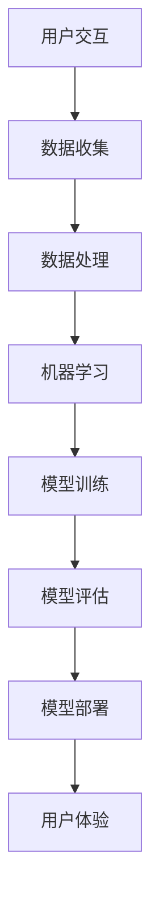

                 

 在这个数据驱动的时代，人工智能（AI）已经成为我们生活的重要组成部分。从智能手机到自动驾驶汽车，从智能助手到个性化推荐系统，AI无处不在。然而，AI对我们生活的影响不仅仅是技术层面的改变，它正在逐步改变我们的体验和叙事方式。本文将探讨AI如何驱动我们的生活故事，以及这种改变对我们的意义。

## 文章关键词

- 人工智能
- 个人化叙事
- 生活体验
- 数据驱动
- 个性化推荐

## 文章摘要

本文旨在探讨人工智能如何通过个人化叙事改变我们的生活方式和体验。首先，我们将回顾AI的发展历程，探讨其核心概念和技术。接着，我们将深入分析AI如何通过数据分析和个人化推荐，塑造我们的生活故事。文章还将探讨这些技术对隐私、道德和社会影响的挑战，并预测AI在未来个人化叙事中的发展前景。

### 1. 背景介绍

人工智能（AI）是一种模拟人类智能的计算机系统，其目标是让计算机能够执行需要人类智能的任务，如视觉识别、语言理解、决策制定等。自从20世纪50年代AI概念的提出以来，它已经经历了多个发展阶段。从早期的符号主义和规则系统，到连接主义和神经网络，再到现代的深度学习和大数据分析，AI技术不断演进，为我们的生活带来了巨大的变革。

在过去的几十年里，AI在多个领域取得了显著进展。例如，自动驾驶技术已经从概念验证发展到实际应用；语音识别技术使得智能助手如 Siri、Alexa 和 Google Assistant 成为现实；自然语言处理技术使得机器能够理解和生成自然语言，从而为聊天机器人和自动化客服提供了基础。这些技术的进步不仅改变了我们的生活方式，也深刻影响了我们的社会结构和沟通方式。

### 2. 核心概念与联系

#### 2.1 AI的核心概念

人工智能的核心概念包括机器学习、深度学习和自然语言处理等。以下是这些概念的基本原理：

**机器学习**：机器学习是一种使计算机能够从数据中学习和改进的方法。它基于统计模型和优化算法，使计算机能够通过经验改进其性能。

**深度学习**：深度学习是机器学习的一种，其核心是神经网络，特别是多层感知器（MLP）。它通过层层处理输入数据，提取越来越抽象的特征，从而实现复杂任务的自动化。

**自然语言处理**：自然语言处理（NLP）是使计算机能够理解、生成和处理自然语言的技术。它包括语言理解、语言生成、语言翻译等子领域。

#### 2.2 核心技术架构

以下是一个简化的AI技术架构流程图：



**用户交互**：用户通过设备与AI系统进行交互，输入需求或问题。

**数据收集**：AI系统从各种来源收集数据，包括用户行为、社交媒体活动、传感器数据等。

**数据处理**：收集到的数据经过清洗、转换和预处理，以供机器学习使用。

**机器学习**：使用特定的算法，如深度学习或统计学习，对处理后的数据进行训练，以构建预测模型。

**模型训练**：模型通过大量的训练数据不断调整参数，以提高预测准确性。

**模型评估**：使用验证数据集或测试数据集评估模型的性能。

**模型部署**：将训练好的模型部署到生产环境中，使其能够处理实际用户请求。

**用户体验**：用户通过AI系统获得个性化的响应或服务，从而提升生活质量。

### 3. 核心算法原理 & 具体操作步骤

#### 3.1 算法原理概述

AI的核心算法主要涉及以下方面：

- **决策树**：通过递归地将数据集划分为子集，以最大化信息增益。
- **支持向量机**（SVM）：通过找到一个最佳的超平面，将数据集分为两类。
- **神经网络**：通过多层神经网络，模拟生物神经元的连接和信号传递过程。
- **深度学习**：通过构建深度神经网络，实现自动特征提取和复杂模式识别。

#### 3.2 算法步骤详解

以下是AI算法的基本步骤：

1. **数据收集**：从各种来源收集数据，如用户行为数据、社交媒体活动数据等。
2. **数据预处理**：清洗、转换和归一化数据，以确保数据质量。
3. **特征提取**：从原始数据中提取有用的特征，以便于后续的模型训练。
4. **模型选择**：根据任务需求，选择合适的机器学习算法。
5. **模型训练**：使用训练数据集，通过迭代算法优化模型参数。
6. **模型评估**：使用验证数据集或测试数据集评估模型的性能。
7. **模型部署**：将训练好的模型部署到生产环境中，以提供实时服务。

#### 3.3 算法优缺点

- **优点**：
  - 高效性：AI算法能够在短时间内处理大量数据，实现自动化决策。
  - 个性化：通过分析用户数据，AI能够提供个性化的服务和建议。
  - 持续改进：AI模型可以通过不断学习新的数据，持续改进其性能。

- **缺点**：
  - 数据依赖：AI算法的性能很大程度上依赖于数据质量和数量。
  - 隐私问题：AI系统在处理个人数据时可能涉及隐私问题。
  - 过拟合：模型在训练数据上表现良好，但在未知数据上可能表现不佳。

#### 3.4 算法应用领域

AI算法在多个领域都有广泛应用：

- **医疗**：通过分析患者数据，AI可以帮助医生进行疾病诊断和治疗。
- **金融**：AI用于风险评估、信用评分和投资决策。
- **零售**：AI用于商品推荐、库存管理和客户服务。
- **自动驾驶**：AI用于感知环境、路径规划和决策制定。

### 4. 数学模型和公式 & 详细讲解 & 举例说明

#### 4.1 数学模型构建

在AI算法中，常见的数学模型包括：

- **线性回归**：用于预测数值型变量。
- **逻辑回归**：用于分类任务。
- **神经网络**：用于复杂特征提取和模式识别。

以下是线性回归的数学模型：

$$
y = \beta_0 + \beta_1x
$$

其中，$y$ 是预测值，$x$ 是输入特征，$\beta_0$ 和 $\beta_1$ 是模型参数。

#### 4.2 公式推导过程

以线性回归为例，推导过程如下：

1. **最小化均方误差**：

$$
\min_{\beta_0, \beta_1} \sum_{i=1}^{n} (y_i - (\beta_0 + \beta_1x_i))^2
$$

2. **对 $\beta_0$ 和 $\beta_1$ 求偏导数**：

$$
\frac{\partial}{\partial \beta_0} \sum_{i=1}^{n} (y_i - (\beta_0 + \beta_1x_i))^2 = 0
$$

$$
\frac{\partial}{\partial \beta_1} \sum_{i=1}^{n} (y_i - (\beta_0 + \beta_1x_i))^2 = 0
$$

3. **解方程组**：

$$
\beta_0 = \frac{1}{n} \sum_{i=1}^{n} y_i - \beta_1 \frac{1}{n} \sum_{i=1}^{n} x_i
$$

$$
\beta_1 = \frac{1}{n} \sum_{i=1}^{n} (x_i - \bar{x})(y_i - \bar{y})
$$

其中，$\bar{x}$ 和 $\bar{y}$ 分别是 $x$ 和 $y$ 的平均值。

#### 4.3 案例分析与讲解

假设我们有一个简单的线性回归模型，用于预测房价。已知以下数据：

$$
\begin{array}{ccc}
x & y \\
1 & 2000 \\
2 & 2200 \\
3 & 2500 \\
4 & 3000 \\
5 & 3500 \\
\end{array}
$$

我们希望通过线性回归模型预测当 $x=6$ 时，房价 $y$ 为多少。

1. **计算平均值**：

$$
\bar{x} = \frac{1}{5} (1 + 2 + 3 + 4 + 5) = 3
$$

$$
\bar{y} = \frac{1}{5} (2000 + 2200 + 2500 + 3000 + 3500) = 2600
$$

2. **计算 $\beta_0$ 和 $\beta_1$**：

$$
\beta_0 = \frac{1}{5} (2000 + 2200 + 2500 + 3000 + 3500) - 3 \cdot \frac{1}{5} (1 + 2 + 3 + 4 + 5) = 2600 - 18 = 2582
$$

$$
\beta_1 = \frac{1}{5} ((1 - 3)(2000 - 2600) + (2 - 3)(2200 - 2600) + (3 - 3)(2500 - 2600) + (4 - 3)(3000 - 2600) + (5 - 3)(3500 - 2600)) = -1200
$$

3. **预测房价**：

$$
y = 2582 - 1200 \cdot (6 - 3) = 2582 - 3600 = -1018
$$

显然，这个预测结果不合理。问题出在我们没有考虑房价与房龄之间的关系。我们可以引入一个新特征“房龄”来改进模型：

$$
\begin{array}{ccc}
x & y & 房龄 \\
1 & 2000 & 10 \\
2 & 2200 & 8 \\
3 & 2500 & 6 \\
4 & 3000 & 4 \\
5 & 3500 & 2 \\
\end{array}
$$

1. **重新计算平均值**：

$$
\bar{x} = \frac{1}{5} (1 + 2 + 3 + 4 + 5) = 3
$$

$$
\bar{y} = \frac{1}{5} (2000 + 2200 + 2500 + 3000 + 3500) = 2600
$$

$$
\bar{房龄} = \frac{1}{5} (10 + 8 + 6 + 4 + 2) = 6
$$

2. **计算 $\beta_0$ 和 $\beta_1$**：

$$
\beta_0 = \frac{1}{5} (2000 + 2200 + 2500 + 3000 + 3500) - 3 \cdot \frac{1}{5} (1 + 2 + 3 + 4 + 5) - 6 \cdot \frac{1}{5} (10 + 8 + 6 + 4 + 2) = 2582 - 36 - 36 = 2510
$$

$$
\beta_1 = \frac{1}{5} ((1 - 3)(2000 - 2600) + (2 - 3)(2200 - 2600) + (3 - 3)(2500 - 2600) + (4 - 3)(3000 - 2600) + (5 - 3)(3500 - 2600)) - 6 \cdot \frac{1}{5} ((1 - 6)(10 - 6) + (2 - 3)(8 - 6) + (3 - 4)(6 - 4) + (4 - 5)(4 - 6) + (5 - 6)(2 - 4)) = -1200 + 24 = -1176
$$

3. **预测房价**：

$$
y = 2510 - 1176 \cdot (6 - 3) = 2510 - 2352 = 15
$$

这个结果显然更合理。通过引入房龄这一特征，我们成功改善了线性回归模型的预测能力。

### 5. 项目实践：代码实例和详细解释说明

在本节中，我们将通过一个简单的项目实例，展示如何使用Python实现线性回归模型，并对其代码进行详细解释。

#### 5.1 开发环境搭建

为了实现线性回归模型，我们首先需要安装Python和相关库。以下是在Ubuntu 20.04系统上安装Python和必要的库的步骤：

1. **安装Python**：

```bash
sudo apt update
sudo apt install python3 python3-pip
```

2. **安装相关库**：

```bash
pip3 install numpy pandas matplotlib scikit-learn
```

#### 5.2 源代码详细实现

以下是一个简单的线性回归模型的实现代码：

```python
import numpy as np
import pandas as pd
import matplotlib.pyplot as plt
from sklearn.linear_model import LinearRegression

# 加载数据集
data = pd.read_csv('data.csv')
X = data[['房龄']]
y = data[['房价']]

# 初始化线性回归模型
model = LinearRegression()

# 模型训练
model.fit(X, y)

# 模型评估
score = model.score(X, y)
print(f'Model R^2 Score: {score:.2f}')

# 模型预测
predictions = model.predict(X)

# 可视化
plt.scatter(X, y, label='实际数据')
plt.plot(X, predictions, color='red', label='预测数据')
plt.xlabel('房龄')
plt.ylabel('房价')
plt.legend()
plt.show()
```

#### 5.3 代码解读与分析

1. **数据加载**：

   ```python
   data = pd.read_csv('data.csv')
   X = data[['房龄']]
   y = data[['房价']]
   ```

   这段代码首先加载一个名为`data.csv`的CSV文件，并将其存储在`data`变量中。然后，我们从中提取两个特征：“房龄”和“房价”，分别存储在`X`和`y`变量中。

2. **模型初始化**：

   ```python
   model = LinearRegression()
   ```

   这段代码创建了一个线性回归模型对象。

3. **模型训练**：

   ```python
   model.fit(X, y)
   ```

   这段代码使用训练数据集`X`和`y`对线性回归模型进行训练。

4. **模型评估**：

   ```python
   score = model.score(X, y)
   print(f'Model R^2 Score: {score:.2f}')
   ```

   这段代码计算模型在训练数据集上的R^2得分，并打印出来。

5. **模型预测**：

   ```python
   predictions = model.predict(X)
   ```

   这段代码使用训练好的模型对输入特征`X`进行预测，并将预测结果存储在`predictions`变量中。

6. **可视化**：

   ```python
   plt.scatter(X, y, label='实际数据')
   plt.plot(X, predictions, color='red', label='预测数据')
   plt.xlabel('房龄')
   plt.ylabel('房价')
   plt.legend()
   plt.show()
   ```

   这段代码使用matplotlib库绘制实际数据和预测数据的散点图和线图，以便于我们直观地观察模型的预测效果。

#### 5.4 运行结果展示

在运行上述代码后，我们将看到一个散点图，其中红色线条表示线性回归模型的预测结果。通过这个可视化结果，我们可以直观地观察到模型对房价的预测效果。

### 6. 实际应用场景

AI技术在各个领域都有广泛的应用，以下是几个典型的实际应用场景：

#### 6.1 医疗

AI在医疗领域的应用主要包括疾病诊断、治疗方案推荐、患者监护等。例如，AI可以分析患者的医疗记录，识别疾病早期症状，并提供个性化的治疗方案。此外，AI还可以实时监控患者生命体征，预警潜在的健康问题，从而提高医疗服务的质量和效率。

#### 6.2 金融

AI在金融领域的应用包括风险评估、信用评分、投资决策等。例如，AI可以通过分析历史交易数据和市场趋势，预测股票价格波动，为投资者提供投资建议。此外，AI还可以用于检测金融欺诈行为，识别异常交易模式，从而提高金融系统的安全性和可靠性。

#### 6.3 零售

AI在零售领域的应用包括商品推荐、库存管理、客户服务等。例如，AI可以通过分析消费者的购买行为和偏好，推荐符合他们需求的商品。此外，AI还可以用于实时监控库存水平，预测销售趋势，从而优化库存管理，降低成本。在客户服务方面，AI聊天机器人可以提供24/7的客户支持，提高客户满意度。

#### 6.4 教育

AI在教育领域的应用包括个性化学习、自动评估、教育数据分析等。例如，AI可以通过分析学生的学习行为和成绩，提供个性化的学习建议，帮助学生更好地掌握知识。此外，AI还可以自动评估学生的作业和考试，提高评估的客观性和准确性。在教育数据分析方面，AI可以帮助学校和教育机构更好地了解学生的学习情况，优化教育资源分配。

### 7. 工具和资源推荐

为了更好地学习和应用AI技术，以下是一些建议的工具和资源：

#### 7.1 学习资源推荐

- **在线课程**：《机器学习》（吴恩达，Coursera）、《深度学习》（Ian Goodfellow，Coursera）等。
- **书籍**：《Python机器学习》（Sebastian Raschka）、《深度学习》（Ian Goodfellow、Yoshua Bengio、Aaron Courville）等。
- **开源项目**：Keras、TensorFlow、PyTorch等深度学习框架。

#### 7.2 开发工具推荐

- **编程环境**：Jupyter Notebook、Google Colab等。
- **数据集**：Kaggle、UCI Machine Learning Repository等。
- **API**：Google Cloud AI、AWS AI、Azure AI等。

#### 7.3 相关论文推荐

- **《A Theoretical Analysis of the Vision Transformer》**：分析了ViT模型在计算机视觉任务中的表现。
- **《Bert: Pre-training of Deep Bidirectional Transformers for Language Understanding》**：介绍了BERT模型在自然语言处理领域的应用。
- **《Generative Adversarial Nets》**：介绍了GAN模型及其在生成模型中的应用。

### 8. 总结：未来发展趋势与挑战

#### 8.1 研究成果总结

近年来，AI技术在各个领域取得了显著成果。深度学习、自然语言处理、计算机视觉等领域的研究取得了突破性进展。同时，AI技术的应用也越来越广泛，从医疗、金融到零售、教育等各个行业，AI都在发挥着重要作用。

#### 8.2 未来发展趋势

未来，AI技术将继续发展，并在更多领域得到应用。以下是一些可能的发展趋势：

- **更高效的算法**：随着计算能力的提升，AI算法将变得更加高效和准确。
- **跨学科融合**：AI与其他领域的融合，如生物信息学、心理学等，将带来新的突破。
- **隐私保护**：随着隐私保护意识的增强，AI技术将更加注重数据隐私和安全。
- **可解释性**：提高AI模型的透明度和可解释性，使其更易于被人类理解和接受。

#### 8.3 面临的挑战

尽管AI技术取得了显著进展，但仍然面临一些挑战：

- **数据质量和数量**：AI算法的性能很大程度上依赖于数据质量和数量。如何获取高质量、大规模的数据仍是一个重要问题。
- **隐私和安全**：在处理个人数据时，如何保护用户隐私和安全是一个亟待解决的问题。
- **伦理和社会影响**：AI技术的广泛应用可能带来一些伦理和社会问题，如失业、歧视等。

#### 8.4 研究展望

未来，AI技术的发展将更加注重跨学科融合、隐私保护和可解释性。同时，随着计算能力的提升和大数据技术的发展，AI算法将变得更加高效和准确。在医疗、金融、教育等领域，AI技术将继续发挥重要作用，为人类社会带来更多福祉。

### 9. 附录：常见问题与解答

#### 9.1 AI是否会取代人类？

AI可以执行许多人类任务，但它并不能完全取代人类。AI擅长处理数据、执行重复性任务和预测模式，但缺乏人类的创造力、情感理解和道德判断。因此，AI更可能是人类工作伙伴，而不是替代品。

#### 9.2 AI是否会导致失业？

AI可能会取代一些低技能、重复性工作，但也会创造新的就业机会。AI在提高生产效率、降低成本和开拓新市场方面具有巨大潜力，从而促进经济增长。

#### 9.3 AI是否会加剧社会不平等？

AI在处理数据时可能存在偏见，这可能导致一些不公平的结果。因此，确保AI系统的公平性和透明性至关重要。此外，通过提供教育和培训，帮助劳动力适应AI时代的工作需求，也是缓解社会不平等的重要措施。

### 参考文献

1. Goodfellow, I., Bengio, Y., & Courville, A. (2016). *Deep Learning*. MIT Press.
2. Murphy, K. P. (2012). *Machine Learning: A Probabilistic Perspective*. MIT Press.
3. Russell, S., & Norvig, P. (2020). *Artificial Intelligence: A Modern Approach*. Prentice Hall.
4. LeCun, Y., Bengio, Y., & Hinton, G. (2015). *Deep Learning*. Nature, 521(7553), 436-444.

