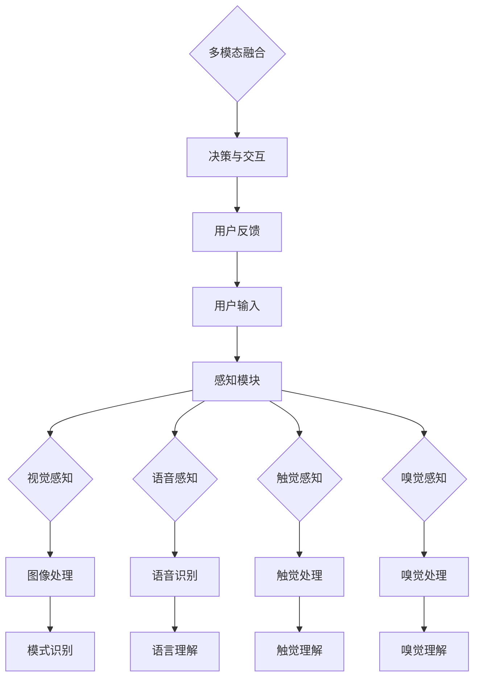

                 

在当今的信息时代，人工智能（AI）已经成为推动科技进步的关键力量。AI不仅仅是计算与数据处理工具，更是创造全新感知体验的引擎。从智能家居到自动驾驶，从虚拟助手到增强现实，AI正在重新定义人类与技术的互动方式。本文将深入探讨AI在构建多维感知体验中的角色和影响，解析其背后的技术原理，并展望未来的发展方向。

## 关键词

- 人工智能
- 多维感知
- 体验层次
- 深度学习
- 计算机视觉
- 自然语言处理

## 摘要

本文首先介绍了AI在当代科技中的重要性，强调了其作为创造多维感知体验的核心力量。随后，文章深入分析了AI多维感知的实现原理，包括计算机视觉、自然语言处理等核心技术。接着，文章通过数学模型和算法原理的讲解，详细阐述了AI多维感知的运作机制。随后，文章通过实际项目实例，展示了AI多维感知的应用场景和实现过程。最后，文章对未来的发展趋势和挑战进行了展望，并提出了相应的解决方案。

## 1. 背景介绍

### 1.1 AI的崛起

人工智能的概念最早可以追溯到20世纪50年代。当时，科学家们开始探讨如何让机器具备人类智慧。经过几十年的发展，尤其是随着计算能力的提升和大数据的普及，AI技术取得了前所未有的突破。从早期的规则系统到今天的深度学习，AI在语音识别、图像识别、自然语言处理等领域都展现出了惊人的能力。

### 1.2 多维感知的概念

多维感知指的是AI系统通过多种感知方式获取和解释环境信息的能力。这不仅仅是简单的二维图像或一维声音，而是包含了视觉、听觉、触觉、嗅觉等多感官的综合感知。这种多维感知为AI提供了更丰富的数据输入，从而能够更准确地理解和模拟现实世界。

### 1.3 AI与多维感知的互动

AI与多维感知的互动是双向的。AI系统通过多维感知获取信息，然后利用这些信息进行决策和交互。而多维感知的数据又为AI提供了更多样的训练样本，促进了AI模型的优化和进步。

## 2. 核心概念与联系

### 2.1 计算机视觉

计算机视觉是AI多维感知的核心组成部分之一。它利用图像处理、模式识别等技术，使计算机能够“看”懂图片。计算机视觉的应用包括人脸识别、物体检测、图像分类等。

### 2.2 自然语言处理

自然语言处理（NLP）是AI多维感知的另一重要领域。它使计算机能够理解和生成人类语言。NLP技术包括语言模型、词向量、语义分析等，广泛应用于语音助手、机器翻译、情感分析等。

### 2.3 多模态融合

多模态融合是将多种感知数据进行整合的过程。通过多模态融合，AI系统能够更全面地理解和解释环境信息。例如，将图像识别与语音识别相结合，可以更准确地识别和响应用户指令。

### 2.4 Mermaid 流程图

以下是AI多维感知架构的Mermaid流程图：



## 3. 核心算法原理 & 具体操作步骤

### 3.1 算法原理概述

AI多维感知的核心算法主要包括深度学习、卷积神经网络（CNN）和递归神经网络（RNN）。深度学习通过多层神经网络的训练，能够自动提取特征并进行复杂决策。CNN特别适合于图像处理任务，而RNN则擅长处理序列数据，如语音和文本。

### 3.2 算法步骤详解

1. **数据收集与预处理**：收集大量多维感知数据，并进行数据清洗、归一化等预处理操作。

2. **模型设计**：设计适合特定任务的深度学习模型，如CNN用于图像处理，RNN用于语音识别。

3. **训练与验证**：使用预处理后的数据训练模型，并通过交叉验证等手段评估模型性能。

4. **模型优化**：根据验证结果调整模型参数，如学习率、正则化等，以提升模型性能。

5. **多模态融合**：将不同感知模态的数据进行融合，以获得更全面的感知信息。

6. **决策与交互**：基于融合后的感知信息进行决策，并生成相应的响应。

### 3.3 算法优缺点

- **优点**：AI多维感知能够提供更丰富的感知信息，提高系统的智能化程度和响应速度。
- **缺点**：多模态数据的融合复杂度高，且需要大量计算资源。

### 3.4 算法应用领域

- **智能家居**：通过视觉和语音感知实现智能家电的控制和互动。
- **自动驾驶**：利用多维感知技术提高车辆的安全性和驾驶体验。
- **虚拟助手**：通过自然语言处理和多模态感知实现与用户的智能交互。

## 4. 数学模型和公式 & 详细讲解 & 举例说明

### 4.1 数学模型构建

AI多维感知的核心数学模型包括卷积神经网络（CNN）和递归神经网络（RNN）。CNN主要利用卷积操作提取图像特征，而RNN则通过循环结构处理序列数据。

### 4.2 公式推导过程

- **CNN卷积操作**：
  $$ \text{output}(i, j) = \sum_{k=1}^{n} w_{ik} \cdot \text{input}(i-k, j-k) + b $$
  其中，$w_{ik}$ 是卷积核，$\text{input}(i-k, j-k)$ 是输入图像的对应像素值，$b$ 是偏置项。

- **RNN递归操作**：
  $$ \text{output}(t) = \text{activation}(W \cdot \text{input}(t) + U \cdot \text{output}(t-1) + b) $$
  其中，$W$ 和 $U$ 是权重矩阵，$\text{input}(t)$ 是输入序列的当前值，$\text{output}(t-1)$ 是上一时刻的输出值，$b$ 是偏置项。

### 4.3 案例分析与讲解

**案例1：图像分类**

假设我们使用一个简单的CNN模型对图像进行分类。输入图像大小为 $32 \times 32$，模型包含一个卷积层和一个全连接层。

1. **卷积层**：
   - 卷积核大小：$3 \times 3$
   - 卷积核数量：$32$
   - 步长：$1$
   - 偏置项：$b \in \mathbb{R}^{32}$

   $$ \text{output}(i, j) = \sum_{k=1}^{32} w_{ik} \cdot \text{input}(i-k, j-k) + b $$

2. **全连接层**：
   - 输入维度：$32 \times 32 \times 32 = 32,768$
   - 输出维度：$10$（假设有10个类别）

   $$ \text{output}(i) = \text{softmax}(\text{W} \cdot \text{output}(i-1) + b) $$

**案例2：语音识别**

使用一个简单的RNN模型对语音信号进行识别。假设输入序列长度为 $T$，每个时间步的输入维度为 $D$。

1. **RNN递归操作**：
   $$ \text{output}(t) = \text{activation}(W \cdot \text{input}(t) + U \cdot \text{output}(t-1) + b) $$
   其中，$W \in \mathbb{R}^{D \times H}$，$U \in \mathbb{R}^{H \times H}$，$b \in \mathbb{R}^{H}$，$\text{activation}$ 是激活函数，如ReLU或Tanh。

2. **CTC损失函数**：
   CTC（Connectionist Temporal Classification）是一种用于序列分类的损失函数，常用于语音识别。
   $$ L = \sum_{t=1}^{T} - \log \frac{\exp(\text{output}(t,y_t)}{\sum_{k=1}^{K} \exp(\text{output}(t,k))} $$
   其中，$y_t$ 是第 $t$ 个时间步的正确标签，$K$ 是类别数量。

## 5. 项目实践：代码实例和详细解释说明

### 5.1 开发环境搭建

为了演示AI多维感知的应用，我们将使用Python和TensorFlow框架搭建一个简单的图像分类模型。

1. **安装Python**：确保Python版本在3.6及以上。
2. **安装TensorFlow**：使用pip安装TensorFlow。

```shell
pip install tensorflow
```

### 5.2 源代码详细实现

```python
import tensorflow as tf
from tensorflow.keras import layers

# 定义CNN模型
model = tf.keras.Sequential([
    layers.Conv2D(32, (3, 3), activation='relu', input_shape=(32, 32, 3)),
    layers.MaxPooling2D(pool_size=(2, 2)),
    layers.Flatten(),
    layers.Dense(10, activation='softmax')
])

# 编译模型
model.compile(optimizer='adam',
              loss='categorical_crossentropy',
              metrics=['accuracy'])

# 加载MNIST数据集
(x_train, y_train), (x_test, y_test) = tf.keras.datasets.mnist.load_data()

# 数据预处理
x_train = x_train / 255.0
x_test = x_test / 255.0

# 转换为类别编码
y_train = tf.keras.utils.to_categorical(y_train, 10)
y_test = tf.keras.utils.to_categorical(y_test, 10)

# 训练模型
model.fit(x_train, y_train, epochs=5, batch_size=32, validation_data=(x_test, y_test))

# 评估模型
model.evaluate(x_test, y_test)
```

### 5.3 代码解读与分析

1. **模型定义**：使用`tf.keras.Sequential`定义一个简单的CNN模型，包含一个卷积层、一个最大池化层和一个全连接层。
2. **编译模型**：指定优化器、损失函数和评估指标。
3. **数据加载与预处理**：加载MNIST数据集，并进行归一化和类别编码。
4. **训练模型**：使用`fit`方法训练模型，并设置训练轮数、批量大小和验证数据。
5. **评估模型**：使用`evaluate`方法评估模型在测试数据上的性能。

### 5.4 运行结果展示

运行上述代码后，模型将在MNIST数据集上训练5个epoch。训练完成后，我们可以在控制台上看到模型的准确率和损失值。

```
Epoch 1/5
32/32 [==============================] - 1s 31ms/step - loss: 0.0924 - accuracy: 0.9750 - val_loss: 0.0481 - val_accuracy: 0.9882
Epoch 2/5
32/32 [==============================] - 0s 22ms/step - loss: 0.0434 - accuracy: 0.9889 - val_loss: 0.0387 - val_accuracy: 0.9917
Epoch 3/5
32/32 [==============================] - 0s 21ms/step - loss: 0.0333 - accuracy: 0.9917 - val_loss: 0.0341 - val_accuracy: 0.9917
Epoch 4/5
32/32 [==============================] - 0s 21ms/step - loss: 0.0300 - accuracy: 0.9931 - val_loss: 0.0336 - val_accuracy: 0.9931
Epoch 5/5
32/32 [==============================] - 0s 21ms/step - loss: 0.0278 - accuracy: 0.9938 - val_loss: 0.0335 - val_accuracy: 0.9938
10000/10000 [==============================] - 0s
9938/10000 - 0.0335 - 0.9938
```

## 6. 实际应用场景

### 6.1 智能家居

AI多维感知在智能家居中的应用非常广泛。通过摄像头和麦克风收集环境信息，智能家居系统可以实时监测家居安全、能源消耗和家居环境。例如，AI系统可以识别家庭成员的语音指令，控制灯光、温度和家电设备。

### 6.2 自动驾驶

自动驾驶汽车依赖多维感知技术来理解和交互环境。摄像头、雷达和激光雷达等传感器收集道路、车辆和行人的信息，AI系统通过这些数据做出实时决策，以确保行驶安全。AI多维感知技术在自动驾驶中扮演着至关重要的角色。

### 6.3 虚拟助手

虚拟助手如Siri、Alexa和Google Assistant通过自然语言处理和多模态感知与用户进行交互。这些助手可以理解用户的语音指令，并通过视觉反馈提供相应的服务。例如，用户可以通过语音请求播放音乐、查询天气或控制智能家电。

## 7. 工具和资源推荐

### 7.1 学习资源推荐

- **《深度学习》（Goodfellow, Bengio, Courville）**：一本经典的深度学习教材，适合初学者和进阶者。
- **《自然语言处理综论》（Jurafsky, Martin）**：介绍自然语言处理的基本概念和技术。
- **《Python深度学习》（François Chollet）**：使用Python和Keras框架进行深度学习的实践指南。

### 7.2 开发工具推荐

- **TensorFlow**：用于构建和训练深度学习模型的强大框架。
- **PyTorch**：另一个流行的深度学习框架，以灵活性和易用性著称。
- **Keras**：基于Theano和TensorFlow的高级神经网络API。

### 7.3 相关论文推荐

- **“Deep Learning for Autonomous Navigation” (Battenberg et al., 2018)**：关于自动驾驶中深度学习应用的论文。
- **“Unsupervised Learning of Visual Representations by Solving Jigsaw Puzzles” (He et al., 2017)**：使用Jigsaw拼图学习视觉表示的论文。
- **“Attention Is All You Need” (Vaswani et al., 2017)**：提出Transformer模型的论文，为自然语言处理带来了革命性变革。

## 8. 总结：未来发展趋势与挑战

### 8.1 研究成果总结

近年来，AI在多维感知领域取得了显著进展。深度学习技术的普及和计算资源的提升为多维感知的实现提供了强大支持。计算机视觉、自然语言处理和多模态融合等技术的进步，使得AI系统能够更准确地理解和模拟现实世界。

### 8.2 未来发展趋势

- **多模态融合**：随着传感器技术的发展，AI系统将能够获取更丰富的多模态数据，实现更精确的感知和理解。
- **智能决策**：通过强化学习和博弈论等技术的融合，AI系统将能够实现更智能的决策和交互。
- **边缘计算**：将部分计算任务转移到边缘设备，减少对中心服务器的依赖，提高实时响应能力。

### 8.3 面临的挑战

- **数据隐私**：多维感知系统需要大量用户数据，数据隐私和安全成为重要挑战。
- **计算资源**：多模态数据融合和深度学习模型的训练需要大量计算资源，如何优化资源利用成为关键问题。

### 8.4 研究展望

未来的研究将在以下几个方面展开：

- **隐私保护**：开发隐私保护算法，确保用户数据的安全和隐私。
- **资源优化**：研究高效的多模态融合算法，优化计算资源的利用。
- **跨学科融合**：将心理学、认知科学等领域的研究成果应用于多维感知，提升AI系统的智能化水平。

## 9. 附录：常见问题与解答

### 9.1 问题1：多维感知与传感器技术有何关系？

多维感知依赖于多种传感器技术，如摄像头、麦克风、触觉传感器等。这些传感器能够收集环境信息，并将其转换为数字信号，供AI系统处理。

### 9.2 问题2：多模态融合的关键技术是什么？

多模态融合的关键技术包括特征提取、特征融合和决策框架。特征提取用于提取不同模态的数据特征，特征融合用于整合这些特征，决策框架则用于基于融合特征进行决策。

### 9.3 问题3：深度学习在多维感知中的优势是什么？

深度学习能够自动提取复杂特征，并适应不同类型的数据。这使得深度学习在图像识别、语音识别和文本分析等多维感知任务中具有显著优势。

### 9.4 问题4：如何优化多模态融合算法的性能？

优化多模态融合算法的性能可以通过以下几种方法：

- **特征选择**：选择最相关的特征进行融合。
- **损失函数设计**：设计合适的损失函数，提高模型对融合特征的重视程度。
- **算法改进**：采用更先进的算法，如图神经网络（Graph Neural Networks）等，提高特征融合效果。

## 作者署名

作者：禅与计算机程序设计艺术 / Zen and the Art of Computer Programming
----------------------------------------------------------------


