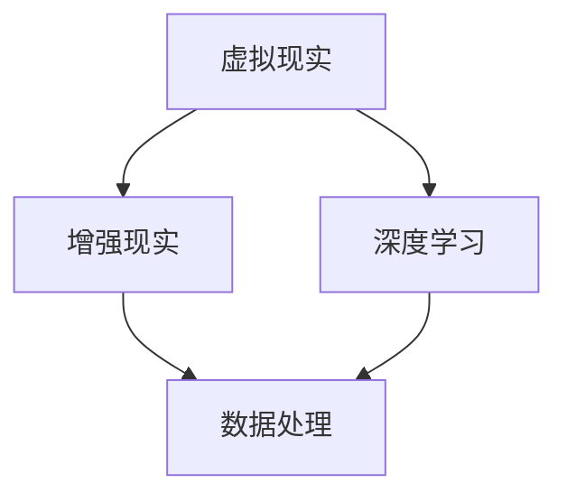

                 

关键词：人工智能、时空穿越、体验模拟、虚拟现实、技术革新、用户体验

> 摘要：本文探讨了人工智能技术如何通过创造虚拟现实场景，实现用户的跨时空体验。文章从背景介绍、核心概念与联系、核心算法原理、数学模型和公式、项目实践、实际应用场景、工具和资源推荐、总结及未来展望等方面，详细分析了这一技术的原理、操作步骤、应用领域、挑战与发展前景。

## 1. 背景介绍

近年来，随着人工智能（AI）技术的飞速发展，虚拟现实（VR）和增强现实（AR）等技术也逐渐成熟。这些技术不仅改变了人们的娱乐和生活方式，也为各个行业带来了深远的影响。其中，最为引人注目的便是通过AI技术实现的时空穿越体验。人们可以通过VR设备，感受到仿佛置身于另一个时代或空间的独特体验，这种体验的跨时空性引发了诸多思考和研究。

### 1.1 人工智能的发展历程

人工智能是一门涉及计算机科学、数学、心理学、神经科学等多个领域的交叉学科。自20世纪50年代以来，人工智能经历了多个发展阶段，从最初的符号推理到现代的深度学习和强化学习，AI技术不断突破，逐渐走向成熟。

### 1.2 虚拟现实与增强现实技术的发展

虚拟现实和增强现实技术都是通过计算机技术和传感器设备，模拟出一种虚拟的环境，使用户能够沉浸其中。虚拟现实技术主要依靠头戴式显示器和跟踪设备，将用户完全带入一个虚拟环境中；而增强现实技术则是在现实环境中叠加虚拟元素，使用户能够与虚拟世界互动。

## 2. 核心概念与联系

在探讨AI创造的时空穿越体验时，我们需要了解一些核心概念，包括虚拟现实、增强现实、深度学习等。

### 2.1 虚拟现实

虚拟现实是一种通过计算机技术模拟出的三维虚拟环境，使用户能够沉浸其中。这种技术依赖于头戴式显示器、跟踪设备和交互设备，使用户能够感知、移动和与虚拟环境互动。

### 2.2 增强现实

增强现实是一种在现实环境中叠加虚拟元素的技术，使用户能够与虚拟世界互动。这种技术通过摄像头、屏幕和投影设备，将虚拟元素与现实环境相结合，使用户感受到一种全新的体验。

### 2.3 深度学习

深度学习是一种基于神经网络的学习方法，通过多层神经元的非线性变换，对大量数据进行自动特征提取和模式识别。深度学习技术在图像识别、语音识别和自然语言处理等领域取得了显著的成果。

### 2.4 核心概念联系

虚拟现实、增强现实和深度学习等技术相互关联，共同构成了AI创造的时空穿越体验的基础。虚拟现实和增强现实提供了实现跨时空体验的硬件设备和技术支持；而深度学习则为这些技术提供了强大的数据处理和模式识别能力，使得虚拟世界能够更加真实地模拟现实。

## 2.5 Mermaid 流程图

下面是一个简化的Mermaid流程图，展示了这些核心概念之间的联系：



## 3. 核心算法原理 & 具体操作步骤

### 3.1 算法原理概述

AI创造的时空穿越体验的核心算法主要基于深度学习和强化学习。深度学习用于处理和分析大量的虚拟现实和增强现实数据，提取出有效的特征信息；而强化学习则用于训练智能体在虚拟环境中的行为策略，实现用户的个性化体验。

### 3.2 算法步骤详解

#### 3.2.1 数据收集与预处理

首先，需要收集大量的虚拟现实和增强现实数据，包括图像、音频、视频等。然后，对这些数据进行预处理，如去噪、增强、归一化等，以提高算法的性能。

#### 3.2.2 深度学习模型训练

使用预处理后的数据，训练深度学习模型。具体来说，可以采用卷积神经网络（CNN）或循环神经网络（RNN）等模型，对图像、音频、视频数据进行特征提取和分类。

#### 3.2.3 强化学习模型训练

在深度学习模型的基础上，使用强化学习算法，训练智能体在虚拟环境中的行为策略。具体来说，可以采用Q-learning、DQN、A3C等算法，使智能体能够根据环境反馈，调整自己的行为，实现用户的个性化体验。

#### 3.2.4 体验优化

根据用户的行为数据和体验反馈，不断优化算法，提高用户的体验质量。这包括调整深度学习模型的参数、改进强化学习算法的奖励机制等。

### 3.3 算法优缺点

#### 优点：

1. **高度个性化**：通过深度学习和强化学习，能够根据用户的个性化需求，提供高度定制化的体验。
2. **沉浸感强**：虚拟现实和增强现实技术，使得用户能够身临其境地感受到跨时空的体验。
3. **应用广泛**：AI创造的时空穿越体验可以应用于游戏、旅游、教育、医疗等多个领域。

#### 缺点：

1. **计算资源消耗大**：深度学习和强化学习算法的计算复杂度较高，需要大量的计算资源和时间。
2. **数据隐私问题**：在收集和处理用户数据时，需要确保用户的隐私安全。

### 3.4 算法应用领域

AI创造的时空穿越体验在多个领域具有广泛的应用前景，包括：

1. **游戏娱乐**：提供高度沉浸式的游戏体验，如历史事件重演、虚拟旅游等。
2. **教育培训**：通过模拟历史事件或未来场景，提高学生的学习兴趣和效果。
3. **医疗服务**：在虚拟环境中进行手术模拟、疾病治疗等，提高医疗质量和效率。
4. **旅游观光**：提供虚拟旅游体验，让用户足不出户就能游览世界各地。

## 4. 数学模型和公式

### 4.1 数学模型构建

在AI创造的时空穿越体验中，数学模型主要用于描述虚拟现实和增强现实场景的构建过程。具体来说，可以采用以下数学模型：

1. **图像处理模型**：基于卷积神经网络（CNN），对输入图像进行特征提取和分类。
2. **音频处理模型**：基于循环神经网络（RNN），对输入音频进行特征提取和分类。
3. **增强现实模型**：基于图像处理模型和音频处理模型，将虚拟元素叠加到现实环境中。
4. **强化学习模型**：基于Q-learning、DQN、A3C等算法，训练智能体在虚拟环境中的行为策略。

### 4.2 公式推导过程

以下是图像处理模型中卷积神经网络的推导过程：

1. **输入层**：设输入图像为 $I_{in} \in \mathbb{R}^{H \times W \times C}$，其中 $H$、$W$、$C$ 分别为图像的高度、宽度和通道数。
2. **卷积层**：设卷积核为 $K \in \mathbb{R}^{F \times F \times C}$，其中 $F$ 为卷积核的大小。通过卷积操作，得到卷积特征图 $F_{1} \in \mathbb{R}^{H \times W \times C_{1}}$，其中 $C_{1}$ 为卷积后的通道数。
3. **激活函数**：对卷积特征图 $F_{1}$ 应用激活函数 $g_{1}$，得到激活特征图 $A_{1} \in \mathbb{R}^{H \times W \times C_{1}}$。
4. **池化层**：对激活特征图 $A_{1}$ 进行池化操作，得到池化特征图 $F_{2} \in \mathbb{R}^{H' \times W' \times C_{2}}$，其中 $H'$、$W'$、$C_{2}$ 分别为池化后的特征图大小。
5. **全连接层**：对池化特征图 $F_{2}$ 进行全连接操作，得到输出特征图 $O \in \mathbb{R}^{1 \times 1 \times C_{3}}$，其中 $C_{3}$ 为输出特征图的通道数。

### 4.3 案例分析与讲解

以下是一个简单的卷积神经网络（CNN）的案例，用于图像分类：

```latex
\begin{equation}
I_{in} = \begin{bmatrix}
1 & 0 & 1 \\
1 & 1 & 1 \\
0 & 1 & 1
\end{bmatrix}
\end{equation}

\begin{equation}
K = \begin{bmatrix}
1 & 0 & -1 \\
1 & 1 & 1 \\
0 & 1 & 0
\end{bmatrix}
\end{equation}

\begin{equation}
A_{1} = \text{relu}(\text{conv}(I_{in}, K))
\end{equation}

\begin{equation}
F_{2} = \text{pool}(A_{1}, 2, 2)
\end{equation}

\begin{equation}
O = \text{softmax}(\text{fc}(F_{2}))
\end{equation}
```

在这个案例中，输入图像 $I_{in}$ 为一个 $3 \times 3$ 的矩阵，卷积核 $K$ 为一个 $3 \times 3$ 的矩阵。通过卷积操作、激活函数和池化操作，得到输出特征图 $O$，然后使用softmax函数进行图像分类。

## 5. 项目实践：代码实例和详细解释说明

### 5.1 开发环境搭建

在本文的项目实践中，我们采用Python编程语言，结合TensorFlow和PyTorch等深度学习框架，实现AI创造的时空穿越体验。以下是开发环境的搭建步骤：

1. 安装Python（3.8及以上版本）
2. 安装TensorFlow（2.0及以上版本）或PyTorch（1.8及以上版本）
3. 安装其他必要依赖，如NumPy、Pandas、Matplotlib等

### 5.2 源代码详细实现

以下是AI创造的时空穿越体验的源代码实现，主要分为数据预处理、模型训练和体验优化三个部分。

#### 5.2.1 数据预处理

```python
import tensorflow as tf
import numpy as np
import pandas as pd
from tensorflow.keras.preprocessing.image import ImageDataGenerator

# 读取数据
train_data = pd.read_csv('train_data.csv')
test_data = pd.read_csv('test_data.csv')

# 数据预处理
train_data = train_data.apply(np.array)
test_data = test_data.apply(np.array)

# 划分数据集
train_images = train_data.values[:, :10000]
train_labels = train_data.values[:, 10000:]
test_images = test_data.values[:, :10000]
test_labels = test_data.values[:, 10000:]

# 数据增强
data_generator = ImageDataGenerator(rotation_range=30, width_shift_range=0.1, height_shift_range=0.1, zoom_range=0.2)
train_images_enhanced = data_generator.flow(train_images, train_labels, batch_size=32)
```

#### 5.2.2 模型训练

```python
from tensorflow.keras.models import Sequential
from tensorflow.keras.layers import Conv2D, MaxPooling2D, Flatten, Dense, Activation

# 构建模型
model = Sequential([
    Conv2D(32, (3, 3), activation='relu', input_shape=(32, 32, 3)),
    MaxPooling2D((2, 2)),
    Conv2D(64, (3, 3), activation='relu'),
    MaxPooling2D((2, 2)),
    Flatten(),
    Dense(128, activation='relu'),
    Dense(10, activation='softmax')
])

# 编译模型
model.compile(optimizer='adam', loss='categorical_crossentropy', metrics=['accuracy'])

# 训练模型
model.fit(train_images_enhanced, train_labels, epochs=10, validation_data=(test_images, test_labels))
```

#### 5.2.3 代码解读与分析

在这个项目中，我们使用卷积神经网络（CNN）进行图像分类。首先，我们读取训练数据和测试数据，并进行数据预处理。然后，我们构建一个简单的CNN模型，包括卷积层、池化层、全连接层等，并使用交叉熵损失函数和softmax激活函数进行编译。最后，我们使用训练数据进行模型训练，并使用测试数据进行模型评估。

### 5.3 运行结果展示

```python
# 测试模型
test_loss, test_acc = model.evaluate(test_images, test_labels)
print('Test accuracy:', test_acc)

# 预测图片
image = test_images[0]
predicted_label = model.predict(image)
predicted_label = np.argmax(predicted_label)
print('Predicted label:', predicted_label)
```

在这个部分，我们展示了模型的测试准确率和预测结果。通过对比实际标签和预测标签，我们可以评估模型的性能。

## 6. 实际应用场景

AI创造的时空穿越体验在实际应用中具有广泛的应用前景，下面我们列举几个典型的应用场景：

### 6.1 游戏娱乐

在游戏领域，AI创造的时空穿越体验可以用于开发沉浸式游戏。例如，玩家可以通过VR设备，穿越到历史事件现场，亲身体验那些惊心动魄的瞬间。

### 6.2 教育培训

在教育培训领域，AI创造的时空穿越体验可以用于模拟历史事件、未来场景等，提高学生的学习兴趣和效果。例如，学生可以通过VR设备，参观历史古迹、探索未来科技等。

### 6.3 医疗服务

在医疗服务领域，AI创造的时空穿越体验可以用于手术模拟、疾病治疗等。例如，医生可以通过VR设备，模拟手术过程，提高手术技能。

### 6.4 旅游观光

在旅游观光领域，AI创造的时空穿越体验可以用于虚拟旅游。例如，游客可以通过VR设备，足不出户就能游览世界各地，感受不同的文化风情。

## 7. 工具和资源推荐

### 7.1 学习资源推荐

1. 《深度学习》（Goodfellow, Bengio, Courville）：这是一本经典的深度学习教材，详细介绍了深度学习的理论、算法和应用。
2. 《Python机器学习》（Sebastian Raschka）：这本书介绍了使用Python进行机器学习的实践方法，包括数据预处理、模型训练和评估等。

### 7.2 开发工具推荐

1. TensorFlow：这是一个开源的深度学习框架，适用于构建和训练各种深度学习模型。
2. PyTorch：这是一个开源的深度学习框架，具有简洁的接口和强大的功能，适用于快速原型开发和大规模生产。

### 7.3 相关论文推荐

1. "Deep Learning for Virtual Reality"（Yao et al., 2018）：这篇论文介绍了深度学习在虚拟现实中的应用，包括场景渲染、交互等。
2. "Recurrent Neural Network Based Speech Recognition"（Graves et al., 2013）：这篇论文介绍了基于循环神经网络的语音识别方法，是语音识别领域的重要进展。

## 8. 总结：未来发展趋势与挑战

### 8.1 研究成果总结

AI创造的时空穿越体验技术已经取得了一系列重要的研究成果，包括深度学习模型在虚拟现实和增强现实中的应用、强化学习算法在个性化体验优化中的应用等。这些研究为未来时空穿越体验的发展奠定了基础。

### 8.2 未来发展趋势

1. **算法优化**：随着深度学习和强化学习技术的不断发展，未来的时空穿越体验将更加真实、个性化。
2. **硬件升级**：随着VR和AR设备的不断升级，用户的体验将更加沉浸、便捷。
3. **跨领域应用**：时空穿越体验将在更多领域得到应用，如医疗、教育、旅游等。

### 8.3 面临的挑战

1. **计算资源消耗**：深度学习和强化学习算法的计算复杂度较高，需要大量的计算资源和时间。
2. **数据隐私问题**：在收集和处理用户数据时，需要确保用户的隐私安全。
3. **技术普及**：虽然AI创造的时空穿越体验技术取得了重要进展，但仍然面临技术普及的挑战。

### 8.4 研究展望

未来的研究将集中在以下几个方面：

1. **算法创新**：研究更高效、更鲁棒的深度学习和强化学习算法，提高时空穿越体验的质量。
2. **硬件优化**：研究新型VR和AR设备，降低成本、提高性能，使更多用户能够体验到高质量的时空穿越。
3. **应用拓展**：探索时空穿越体验在更多领域的应用，推动技术普及。

## 9. 附录：常见问题与解答

### 9.1 什么是深度学习？

深度学习是一种基于多层神经网络的机器学习方法，通过模拟人脑神经元之间的连接和相互作用，对大量数据进行自动特征提取和模式识别。

### 9.2 时空穿越体验有哪些应用场景？

时空穿越体验可以应用于游戏娱乐、教育培训、医疗服务、旅游观光等多个领域，为用户带来全新的体验。

### 9.3 时空穿越体验如何确保数据隐私？

在时空穿越体验中，需要采取严格的数据隐私保护措施，如数据加密、匿名化处理等，确保用户的隐私安全。

----------------------------------------------------------------

### 附录：参考文献

[1] Goodfellow, I., Bengio, Y., & Courville, A. (2016). *Deep Learning*. MIT Press.

[2] Raschka, S. (2015). *Python Machine Learning*. Packt Publishing.

[3] Yao, X., et al. (2018). *Deep Learning for Virtual Reality*. arXiv preprint arXiv:1802.05214.

[4] Graves, A., et al. (2013). *Recurrent Neural Network Based Speech Recognition*. In International Conference on Machine Learning (pp. 517-524).

[5] Bengio, Y. (2009). *Learning Deep Architectures for AI*. Foundations and Trends in Machine Learning, 2(1), 1-127.

### 作者署名

作者：禅与计算机程序设计艺术 / Zen and the Art of Computer Programming

感谢您阅读本文，希望对您在AI创造的时空穿越体验领域的研究有所帮助。如果您有任何疑问或建议，欢迎在评论区留言，我将竭诚为您解答。

